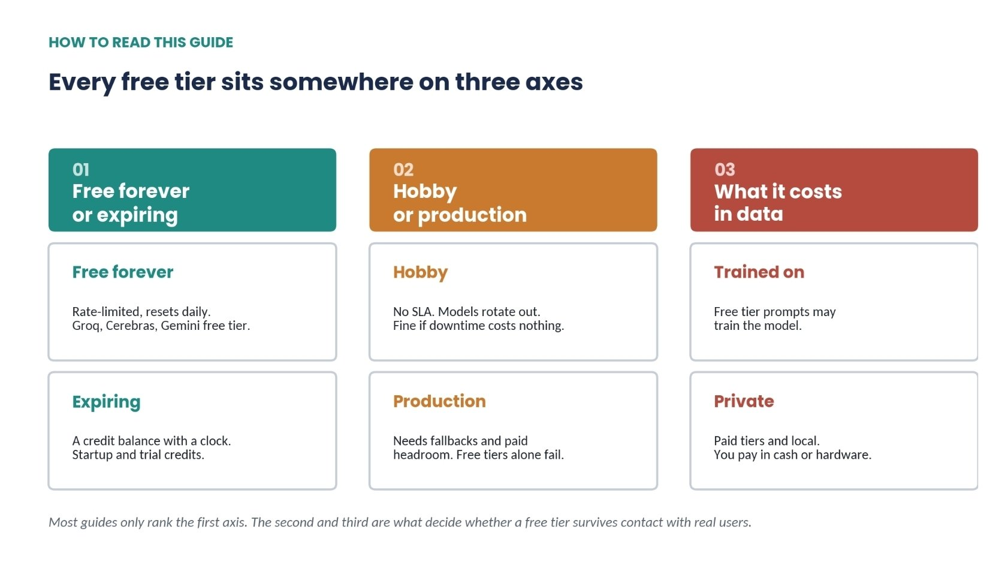
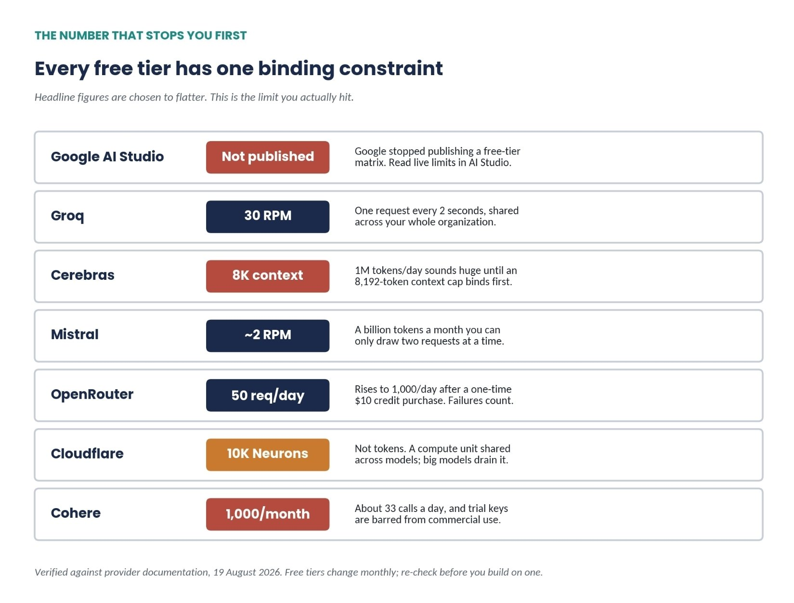
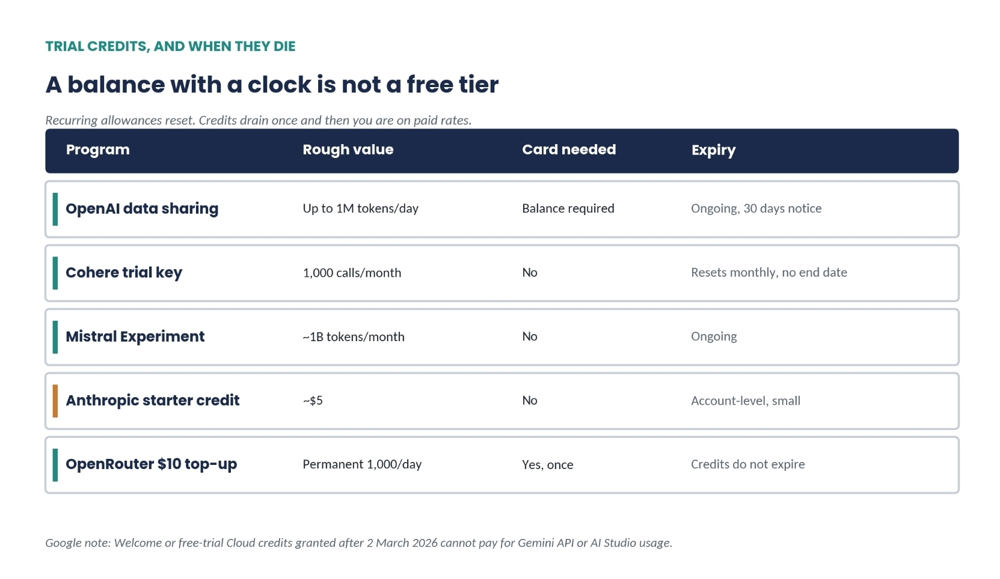
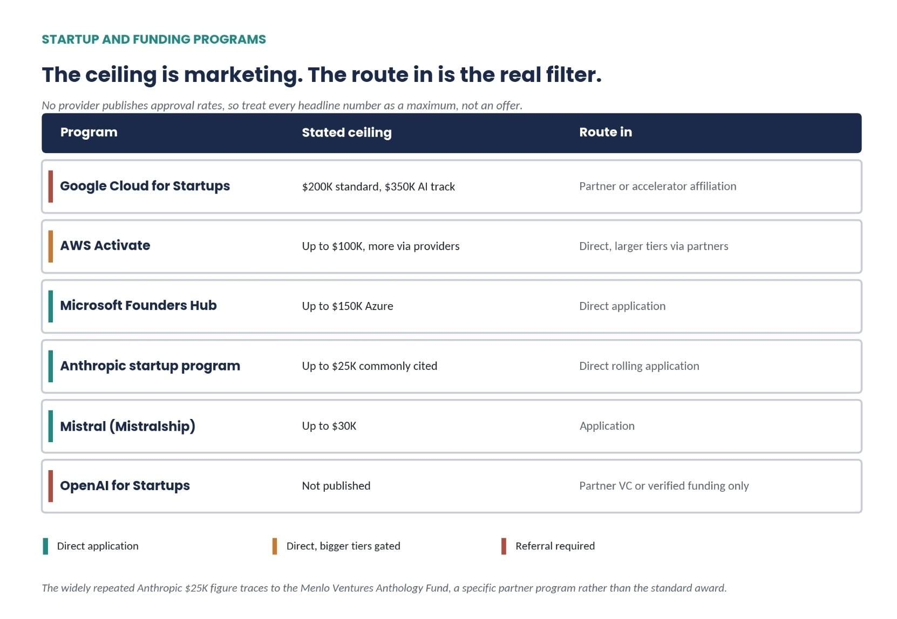
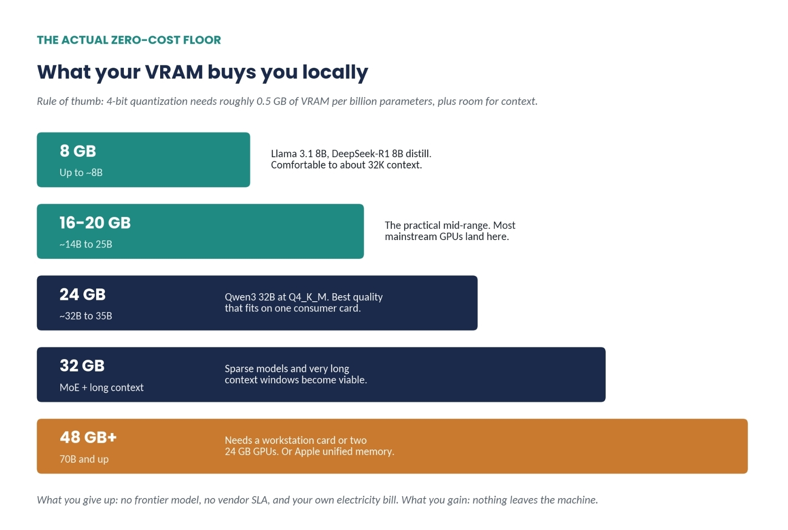
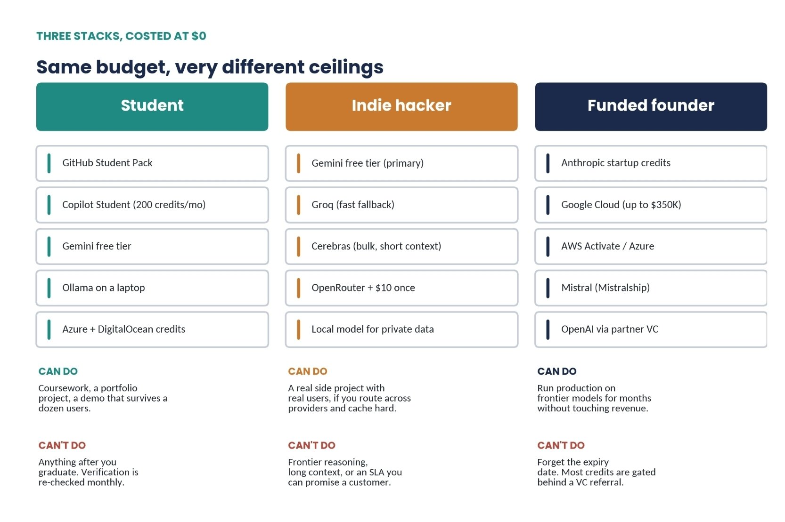
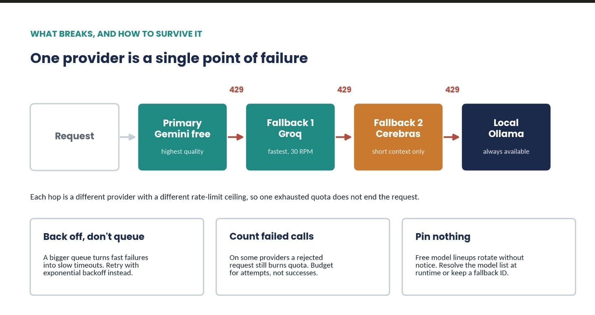

# ALL the free AI resources that exist in 2026 (nobody uses them)

@mikenevermiss · [X 原文](https://x.com/mikenevermiss/article/2090300976670425489)


I spent a week testing and comparing almost every free or nearly free way to access good AI models. This includes free APIs, trial credits, startup programs, student benefits, and grants for developers.

The biggest thing I discovered was that many “free AI” lists online are outdated or simply wrong. Some numbers have changed, while others measure something different from what you might expect.

For example, Google no longer clearly publishes the limits for some of its free AI access. Cloudflare’s free allowance is not based on tokens. Cerebras gives you up to 1 million tokens per day, but limits the amount of context you can use at once to 8,192 tokens.

### How to read this guide

Every free AI offer has three important things to consider, but most guides only focus on the first one.



**Free forever or. expiring credits**. A free plan that gives you a daily limit is different from credits that expire after a certain time. Once those credits expire, they are gone.

**Hobby or. production**. Free plans usually come with no guarantee that the service will always be available or that the model will still exist next month. That is fine for experiments, but risky if your business depends on it.

 **What it costs in data**. This is the part people often miss. On Google's free tier, your prompts and outputs can be used to improve their products. On the paid tier, they are not. So you are not just paying for more usage, you are also paying for better data privacy.

### Truly free, no card



**Google AI Studio**

The biggest thing to know is that Google no longer publicly lists exact free-tier limits like requests per minute or requests per day. Instead, you have to check your actual limits inside AI Studio, and Google says those limits can change.

So when you see claims like 1,500 requests per day or 1 million tokens per minute, don't treat them as official Google limits. They may be based on what users are currently experiencing.

What Google does clearly confirm is which models are free. Several Gemini Flash and Flash-Lite models, along with Gemini 2.5 Pro, are available for free. Some newer Pro, image-generation, video, and Imagen models are paid only.

The free tier also allows 500 search-grounding requests per day, shared between Flash and Flash-Lite.

Getting started is easy. You only need a Google account and you don't need a credit card.

The biggest downside is data privacy. Google can use prompts and outputs from the free tier to improve its products, so it's not ideal for confidential information.

Google also changes and retires models. For example, Gemini 2.0 Flash was shut down on June 1, 2026.

Best for testing AI ideas, multimodal projects, and working with large amounts of context.

Not ideal for confidential or sensitive work.

```bash
curl "https://generativelanguage.googleapis.com/v1beta/models/gemini-3.5-flash:generateContent" \
  -H "x-goog-api-key: $GEMINI_API_KEY" \
  -H 'Content-Type: application/json' \
  -d '{"contents":[{"parts":[{"text":"Explain rate limiting in two sentences."}]}]}'
```

**Groq**

Groq generally gives you around 30 requests per minute and 6,000 tokens per minute on many models, and you don't need a credit card to get started.

The daily limit is less clear. Some sources say around 1,000 requests per day, while others report 14,400. It depends on the model, so check the limit for the specific model you're using instead of trusting a fixed number.

Two things are more important than the numbers.

First, the limits apply to your entire organization. Creating five API keys does not give you five times the quota.

Second, cached tokens don't count toward your rate limits. This is useful when you're sending the same long system prompt repeatedly.

With 30 requests per minute, you're basically getting one request every two seconds across your whole account.

Best for fast, single-user AI tools where low latency matters.

Not ideal for apps with lots of users making requests at the same time.

```python
import os
from openai import OpenAI  # Groq is OpenAI-compatible

client = OpenAI(
    api_key=os.environ["GROQ_API_KEY"],
    base_url="https://api.groq.com/openai/v1",
)

# Check console.groq.com for the current free-tier model list before pinning an ID
resp = client.chat.completions.create(
    model="llama-3.3-70b-versatile",
    messages=[{"role": "user", "content": "Summarize this in one line."}],
)
print(resp.choices[0].message.content)
```

**Cerebras**

Cerebras gives you **1 million tokens per day for free**, and you don't need a credit card.

The current limit is around **5 requests per minute and 30,000 tokens per minute** on a limited number of models. If you see older guides saying 30 requests per minute, those limits may be outdated.

The biggest catch is the **8,192-token context limit** on the free tier. So even though you get 1 million tokens per day, you can't use that quota for very large prompts.

At just 5 requests per minute, it's also not designed for agents making lots of calls at the same time.

**Best for ** processing lots of short tasks, like classification.

**Not ideal for **long context tasks or systems that need many requests running in parallel.

```python
client = OpenAI(
    api_key=os.environ["CEREBRAS_API_KEY"],
    base_url="https://api.cerebras.ai/v1",
)

MAX_FREE_CONTEXT = 8192          # free-tier ceiling, not the model's real limit

def classify(text):
    if len(text) // 4 > MAX_FREE_CONTEXT - 500:   # ~4 chars per token, leave room to answer
        raise ValueError("too long for the free tier, chunk it first")
    return client.chat.completions.create(
        model="gpt-oss-120b",
        messages=[{"role": "user", "content": f"Label the sentiment:\n{text}"}],
    )
```

**Mistral La Plateforme
**
Mistral's Experiment tier gives you free, rate-limited access to its models, including Large and Codestral. You don't need a credit card.

Mistral no longer publicly lists exact free-tier limits. Some users report around 2 requests per minute and roughly 1 billion tokens per month, but you should check your own limits in the console instead of relying on those numbers.

The problem is that having 1 billion tokens doesn't mean much if you can only make about 2 requests per minute.

Best for testing and evaluating models.

Not ideal for production apps or systems that need lots of requests at the same time.

```python
# Mistral is OpenAI-compatible too. At ~2 RPM, pace deliberately rather than retrying blind.
client = OpenAI(
    api_key=os.environ["MISTRAL_API_KEY"],
    base_url="https://api.mistral.ai/v1",
)

for i, doc in enumerate(documents):
    resp = client.chat.completions.create(
        model="mistral-large-latest",
        messages=[{"role": "user", "content": doc}],
    )
    time.sleep(30)   # ~2 requests/minute; verify your live ceiling in the console
```

**Cloudflare Workers AI**

Cloudflare gives you 10,000 Neurons per day for free. Neurons are not tokens, they are Cloudflare's way of measuring how much computing power you're using.

The important part is that all models share the same 10,000-Neuron daily allowance. Bigger, more expensive models use up that allowance much faster than smaller ones.

So when you see people saying "10,000 free tokens," that's wrong. There isn't a fixed number of tokens because the amount you can generate depends on which model you're using.

The allowance resets every day at 00:00 UTC. On the free Workers plan, you stop when you run out. On the paid plan, you can keep going and pay $0.011 per 1,000 Neurons.

Best for running smaller AI models directly at the edge, especially if you're already using Cloudflare Workers.

```bash
# Direct REST call. No Worker deployment needed to use the daily Neuron allowance.
curl "https://api.cloudflare.com/client/v4/accounts/$CF_ACCOUNT_ID/ai/run/@cf/meta/llama-3.1-8b-instruct" \
  -H "Authorization: Bearer $CF_API_TOKEN" \
  -d '{"messages":[{"role":"user","content":"Rewrite this subject line."}]}'

# Track burn rate in the dashboard, since Neurons per call vary by model:
# Workers AI > Usage. A hard stop at 10,000/day means silent failure at 00:01 UTC.
```

**OpenRouter**

OpenRouter gives you one API key to access 25+ free models from different AI companies.

The free tier allows 20 requests per minute and just 50 requests per day if you've never bought credits.

The useful trick: buy $10 in credits once, and your daily limit jumps to 1,000 requests and stays there even after your balance reaches zero.

Failed requests still count, and extra API keys won't increase your limit.

Best for trying many AI models through one API.

```python
resp = client.chat.completions.create(
    model="meta-llama/llama-3.3-70b-instruct:free",
    messages=[{"role": "user", "content": "Hello"}],
    extra_body={"models": ["qwen/qwen-2.5-72b-instruct:free"]},  # automatic fallback
)
```

**Cohere**

Cohere gives you a free trial key when you sign up. No credit card is required.

You get 1,000 API calls per month and up to 20 requests per minute for Chat. It's especially useful for embeddings and reranking.

The big catch is that trial keys cannot be used for commercial or production work. So it's mainly for testing and research.

**OpenAI**

OpenAI doesn't have a permanent free API tier. Starter credits are also not guaranteed.

The main way to get free API usage is through its data-sharing program. You opt in to share API inputs and outputs, and eligible organizations receive free daily tokens.

The allowance can reach 1 million tokens per day on larger models and 10 million on mini and nano models at higher usage tiers.

You still need a positive account balance, and only organization owners can enable it.

Best for developers willing to trade some data privacy for free API usage.

This is the clearest illustration of the third axis in the whole guide. The tokens are free. You are paying with every prompt you send.

### Trial credits, and when they die



One warning that catches people out. Google's billing documentation states that Welcome or free-trial Cloud credits granted after 2 March 2026 cannot pay for Gemini API or AI Studio usage. Do not plan a free runway around generic cloud credits without checking the billing account first.

### Startup and funding programs

No provider publishes approval rates, so anyone quoting you odds is guessing. The honest proxy is structural: whether there is a direct application path, or whether you need a VC referral to get in the door.



Two corrections worth making. Anthropic does not publish a universal credit figure; the widely repeated $25,000 number traces to Menlo Ventures' Anthology Fund, a specific partner program rather than the standard award. OpenAI likewise publishes no standard amount, and the size depends on the arrangement with the participating fund. Treat every headline ceiling as a ceiling.

Google's credits are also split across two years, weighted heavily to year one, which changes the runway math considerably.

### Students and academics

The situation changed twice this year, so most guides are wrong.

In March 2026 GitHub replaced the donated Copilot Pro seat with a dedicated Copilot Student plan: unlimited code completions plus 200 GitHub AI Credits per month for chat and agent work. At roughly $0.01 per credit that allowance is worth about $2 of metered usage, and students doing agentic work report exhausting it in a single day. Premium models can no longer be hand-selected; the plan runs on automatic routing. GitHub then paused new sign-ups entirely in April citing compute demand, and reopened them on 17 June 2026.

The rest of the Student Developer Pack was never affected: JetBrains licenses, Azure for Students credits, DigitalOcean credits, a free domain, and a long list of partner tools. Verification is via academic email or enrollment documents, and eligibility is re-checked periodically. SheerID is the separate verification service used by Cursor, Perplexity, Canva and Notion, so it is worth completing that one too.

### Open source maintainers

The most undersubscribed category here, and the one with the clearest qualification bar.

**Claude for Open Source**. Launched February 2026, offering six months of Claude Max 20x to qualifying maintainers. The terms specify a 10,000-recipient cap, a 90-day activation window, rolling review, and notifications sent only to approved applicants. Still open as of mid-August 2026. Note this is the consumer subscription, not API credits.

**OpenAI Codex for Open Source**. Announced 7 March 2026 against an initial $1 million fund. Up to $25,000 in API credits plus six months of ChatGPT Pro. Qualification is explicit: projects must show active use of Codex in real maintainer work such as pull request review, release automation or triage. Star count alone does not qualify, and applying does not guarantee selection. Rolling, no announced deadline.

**GitHub Copilot for maintainers**. Maintainers of top open source projects get Copilot Pro access, and unlike the others the evaluation is automated: GitHub scans public repositories to identify active maintainers. There is nothing to apply for, which also means nothing to appeal.

### Regional access

Don't assume Google AI Studio is available in 220+ countries. That number mixes different Google products, and each has its own list of supported regions. For the API, check Google's official API availability list.

US AI providers also block comprehensively sanctioned regions. China and Russia can also have network-level restrictions that prevent access.

One important detail for Colab: the region of the Colab server matters, not your physical location.

If a provider isn't available in your region, the legitimate options are usually its cloud or enterprise version, or an aggregator that supports your region.

Using a VPN to pretend you're in another country can violate the provider's terms and could get your account suspended.

### Local and self-hosted: the actual zero-cost floor

This is the biggest gap in every free AI roundup I read. Every hosted free tier is a favor that can be withdrawn. A model on your own machine is the only option with no rate limit, no data clause, no deprecation notice and no region lock.



The math is simple. Weights at full precision need roughly 2 GB per billion parameters. Four-bit quantization, usually the Q4\_K\_M format, cuts that to about 0.5 GB per billion with minimal quality loss on most tasks. Then add the KV cache, which grows close to linearly with context length, so a long context window can cost as much memory as the model itself.

The tooling has consolidated. llama.cpp is the MIT-licensed engine underneath most of the ecosystem, with active daily development. Ollama wraps it for easy model management and shipped an MLX engine in preview in March 2026, substantially updated in June, improving speed and memory use on Apple Silicon. On AMD, the single most common setup failure is ROCm: you need version 7 installed from AMD directly, because the version bundled with the Linux kernel is too old.

```bash
# Zero rate limits, nothing leaves the machine
curl -fsSL https://ollama.com/install.sh | sh
ollama pull qwen3:32b        # ~24GB VRAM at Q4_K_M
ollama serve                 # OpenAI-compatible endpoint on :11434
```

```python
# Point any OpenAI-compatible client at it
client = OpenAI(base_url="http://localhost:11434/v1", api_key="ollama")
```

What you give up is real: no frontier model, no vendor SLA, slower inference than a dedicated provider, and your own electricity bill. What you get is the only tier in this guide that cannot be revoked.

### Three stacks, costed at $0



The student stack is the strongest of the three in absolute value and the most fragile in duration, because every piece is contingent on verification that gets re-checked.

The indie hacker stack is the one most people should actually build. Gemini free tier as primary for quality, Groq for speed, Cerebras for short-context bulk work, one $10 OpenRouter top-up for the 20x daily headroom, and a local model for anything you would not want used as training data.

The funded founder stack has the highest ceiling and the sharpest cliff. Credits expire, most large programs require a partner referral, and building unit economics on subsidized inference is how you discover your margin does not exist in month thirteen.

### What breaks



Every free tier eventually hits the same problem: a 429 rate-limit error, usually at the worst possible time.

Adding a bigger queue doesn't really fix it. It just turns fast failures into slow timeouts.

The better approach is backoff and routing. When one provider hits its limit, send the request to another provider with more capacity.

For example, if a job is too demanding for a 6,000 TPM limit, route it somewhere with more headroom.

```python
import time

PROVIDERS = [gemini_call, groq_call, cerebras_call, ollama_call]

def complete(prompt, max_attempts=3):
    for provider in PROVIDERS:
        for attempt in range(max_attempts):
            try:
                return provider(prompt)
            except RateLimitError:
                time.sleep(2 ** attempt)   # 1s, 2s, 4s
            except Exception:
                break                      # provider down, move to the next
    raise RuntimeError("all providers exhausted")
```

Don't guess your rate limits. Read the response headers.

Most AI providers tell you how many requests and tokens you have left, along with when the limit resets.

Use that information to slow down or schedule requests before you hit the limit instead of waiting for a 429 error.

```python
# Pace from what the provider tells you, not from a number in a blog post.
raw = client.chat.completions.with_raw_response.create(
    model="llama-3.3-70b-versatile",
    messages=[{"role": "user", "content": prompt}],
)
h = raw.headers
print(h.get("x-ratelimit-remaining-requests"))  # calls left in the window
print(h.get("x-ratelimit-remaining-tokens"))    # tokens left in the window
print(h.get("x-ratelimit-reset-requests"))      # when it refills
print(h.get("retry-after"))                     # present on a 429; obey it
```

### When to stop using free tiers

The right time to start paying isn't about how many tokens you have left. It's when the free tier starts creating real problems.

Pay when you're handling data you don't want used for training, when people depend on your app, when rate limits happen during normal use, or when you're spending more than an hour every month managing quotas.

At that point, your time is worth more than the free tier.

Free AI access is surprisingly generous. Getting a million tokens a day from Cerebras, access to Mistral's models, or running a 32B model on your own GPU would have been a serious research budget just a few years ago.

But free tiers change. Providers can reduce limits, remove models, or change their plans without much warning.

So don't build your entire system around one free provider.

Use several providers, keep a local backup, and never promise customers something that depends on a free tier you don't control.

And always verify the limits before relying on them.

I verified the numbers using the providers’ official documentation.

Free plans can change often, and some changed while I was writing this.

If I could not confirm a number from an official source, I clearly said so..
