# 万字长文｜从零到一部署适合自己电脑的本地大模型，跑通第一个本地 API

@JackyCufe · [X 原文](https://x.com/JackyCufe/article/2093959043630924170)


## 0. 主要内容

这篇文章记录的是一次最小但完整的模型本地化部署全流程。

**首先明确，本地部署大模型并不是什么高端操作。对本文这种“先跑通一个合适的小模型”的目标来说，一台普通电脑、一个能够稳定访问外网和模型下载站点的干净网络节点，就足够开始。难点不在于堆配置，而在于让模型、硬件和运行方式互相适配。**

本文不是告诉你“下载哪个模型”的清单，也不是一场在普通电脑上硬挑战最大参数量的比赛。整个流程从前置准备开始：**先看自己的硬件条件，找到与设备相匹配的模型；再解决下载和运行中可能遇到的问题；然后完成本地推理，最后把模型作为 API 提供给其他应用调用。**

看完以后，你会获得四件具体的东西：

1. **一个根据自己电脑选择本地模型的方法，而不是只看参数量或模型排行榜。**
2. **一组足够用的大模型基础概念：参数、token、上下文、量化、GGUF、运行器和 API 分别在做什么。**
3. **一套本地化部署的基本流程：下载模型、在终端推理、观察速度与内存、启动本地服务。**
4. **一个真正跑通的本地 API。也就是说，不只是“我在终端里和模型聊过天”，而是其他程序也可以调用它。**

本文以 Windows 命令作为主要实操环境。针对 macOS 系统提供参考命令，但不应该不加判断地照抄：Mac 的芯片、内存、安装方式和实际命令名都可能不同。更稳妥的做法，是先理解本文的流程与参数含义，再根据自己的设备验证命令是否适用，或继续与 AI 交互探索。

### 0.1 思路摘要：先评估硬件，再处理下载与运行

第一件事不是直接去Hugging Face找一个最牛的大模型下载，而是评估硬件条件。你的电脑有什么 CPU、有没有独立显卡、显存或内存有多少、硬盘还有多少空间，这些共同决定了什么模型更适合你。若有更高的预算购入更强的算力，答案当然会不同；但在已有设备上做选择时，先查清硬件边界，反而能少走很多弯路。

第二件事是解决下载和运行中的问题。真实部署不总是一条命令就结束：模型文件从哪里下载、网络能否访问、运行器是否能正确找到模型、上下文该设多大，都可能影响结果。本文会展示 Windows 上实际验证过的命令；macOS 只提供参考路径，并明确哪些地方需要你结合自己的机器继续验证。

第三件事是完成本地推理与 API 调用。模型在终端里回答问题，证明它能运行；把它启动为本地服务，再从另一个终端发起 chat/completions 请求并拿到回答，才说明它已经成为一项能被其他程序调用的能力。

### 0.2 为什么值得亲手实操一遍

**这条完整的本地化部署流程，是FDE经常会遇到的一类真实问题。**它当然不是 FDE 的全部，但其中的能力很基础，也很实用：知道硬件边界，能做方案取舍，遇到报错会定位问题，并把模型交付成可调用的能力。

**同时，我也认为，本地算力和端侧推理会成为重要的趋势之一。**这并不代表所有任务都应该搬回本地，也不代表每个人都要买一张高端显卡，或者配置一台算力极强的主机。更值得理解的是：模型、硬件和应用，如何在一台设备上真正跑起来并连接起来。这个能力会越来越影响我们理解和使用 AI 产品的方式。

于是这次，我会结合自己正在使用的一台笔记本，从硬件判断开始，经过模型选择、下载、运行和排错，最后跑通第一个 API，带大家走完这一遍全流程。

## 1. 硬件评估：你的电脑适合部署多强的大模型？

本地部署的第一步不是下载模型，而是看电脑。模型能不能运行、跑得有多快、一次能放多长的上下文，都不是单纯由模型参数量或“模型强不强”决定的，而是由 CPU、GPU / 显存、内存和硬盘共同决定的。

换句话说，开源模型排行榜只能说明“模型在某些测试里表现如何”，不能说明“它是否适合你的电脑”。本地模型的上限，首先由你的设备决定。先看机器，再看模型，最后才看榜单和评价，这是比较稳的顺序。

### 1.1 Windows 上如何查看自己的硬件

Windows 用户可以按 Ctrl + Shift + Esc 直接打开任务管理器；也可以按 Ctrl + Alt + Delete 后，再点击“任务管理器”。在左侧点击“性能”，就能快速看到 CPU、内存、磁盘和 GPU 的基本配置。

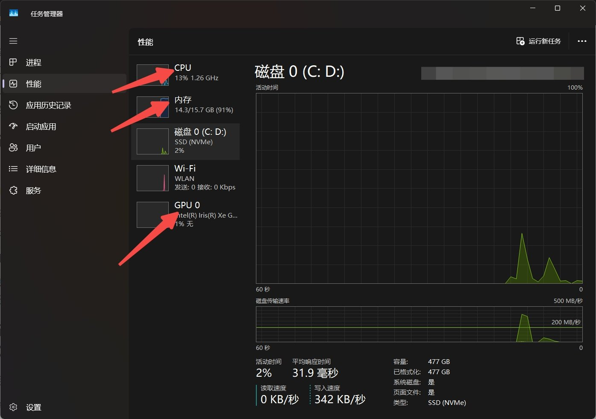

以我的电脑为例：它使用 Intel Core i5-1240P，12 核 16 线程；有 16GB RAM；显卡是 Intel Iris Xe 集成显卡，没有独立显存。这个配置不是不能跑本地模型，但它显然不应该一上来就追 14B、32B 或更大的模型。

在开始选型前，你至少要记下四件事：CPU 型号，RAM 容量，GPU 型号与独立显存容量，以及硬盘剩余空间。后面所有模型选择，都会围绕这四项展开。也可以直接问 AI：**“我要部署本地大模型，请告诉我这台电脑上与部署相关的硬件配置是什么？”**

### 1.2 四个硬件项，到底各自影响什么

我们不需要把这些硬件概念用晦涩的语言详细展开，只要用一个食堂的比喻，理解它们各自的角色就够了：

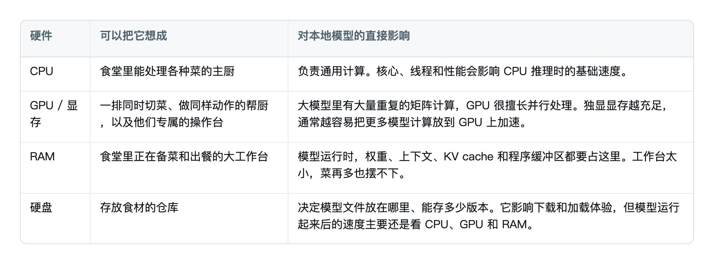

这里还有一个特别容易混淆的点：独显有自己的显存（VRAM），就像 GPU 有一张专属操作台；集显没有这张专属操作台，它会和系统一起共用 RAM。

我的 Intel Iris Xe 就是集显。因此它不是完全不能参与计算，而是它使用的仍然是那 16GB 系统内存。系统、浏览器、模型和集显都在共享同一块空间，模型选择自然要更保守一些。相反，如果你的电脑有一张 8GB、12GB 甚至更大显存的独立显卡，模型规模、上下文和推理速度的选择空间都会大很多。

这也是为什么“我有 16GB 内存”和“我有 16GB 显存”完全不是一回事。前者是整台电脑共同使用的工作台；后者是显卡专属、可用于高速并行计算的工作台。

### 1.3 回到这台电脑：怎样选出合适的模型

知道硬件边界后，才进入模型选择。我的做法很简单：先把电脑配置和目标任务写清楚，再让 AI 帮我做第一轮筛选，并要求它结合当时 Hugging Face 上可获取的模型与 GGUF 量化版本给出建议。

这里 AI 的角色不是替我做一个不需要验证的决定，而是缩小搜索范围。给它的输入至少应该包括：CPU 型号、内存大小、GPU 与显存、操作系统、硬盘空间，以及你的主要任务是中文聊天、写作、代码辅助，还是本地知识库。然后继续追问：这个模型的 GGUF 文件有多大？建议什么量化？需要多少 RAM 或 VRAM？在我的设备上更看重速度还是质量？

Hugging Face 的模型页面、模型卡和榜单，是这个阶段的重要参考，但不要把榜单第一名直接等同于“最适合我”。榜单更适合回答“哪些模型值得进入候选池”；硬件和任务要求，才负责把候选池收缩为一两个真正能稳定运行的选择。

对我这台电脑，我最终选择的是 Qwen3.5-4B-Q4\_K\_M.gguf。其中 4B 表示模型参数规模，Q4*K*M 是量化方案，GGUF 是供 llama.cpp 加载的本地文件格式。该文件实际大小是 2,740,937,888 bytes，约 2.55 GiB（相关名词会在下文说明）。

它不是参数量最大的模型，却是这台电脑在质量、内存占用和速度之间更稳妥的平衡点。7B 或更大模型并不意味着绝对不能启动，但对共享内存的集显笔记本来说，速度和内存余量都会更紧张。第一轮部署优先选一个能稳定跑通、也能完整验证 API 的模型，比硬扛一个更大的模型更有价值。

**这里也要强调**：本文的结论不是“16GB 集显笔记本只能跑 4B”，更不是“所有人都应该选 Qwen3.5-4B Q4”。正确顺序仍然是：先看你的硬件，再明确你的任务，最后参考模型表现和量化版本。本文这台电脑的答案是 4B Q4；你的答案应该由你的设备和任务要求决定。

接下来我会把部署模型参数、token、上下文、量化、GGUF 等概念直接讲清楚。只有先建立这张概念地图，后面的下载、加载、速度和内存数据才不会只是一串看不懂的命令行输出。

## 2. 部署前必须分清的几个概念

然后我们在部署之前，先搞清楚几个基础概念。这样有助于大家之后根据自己的设备和任务，自定义调整已经部署下来的模型。下面这张表不追求严格的教科书定义，只追求一件事：让完全没有技术背景的人，看到后面的模型文件、内存和 API 时，知道自己正在看什么。

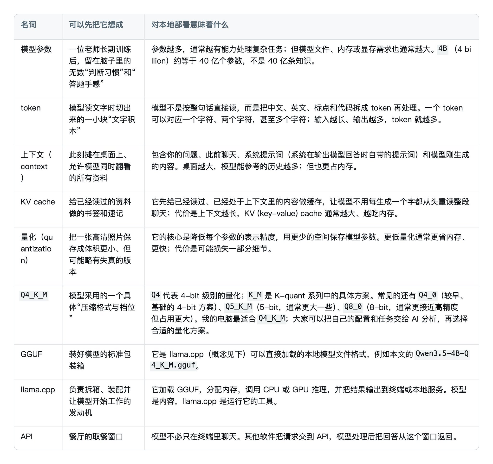

大家先对这些概念有一个基础了解即可，尤其是后面几个和大模型安装、运行直接相关的词汇。不需要一开始就把所有原理完全搞清楚，也不需要马上分清 llama.cpp、Ollama 和 LM Studio 的每一个区别；只要大概知道它们是什么、分别在做哪件事，之后看命令行参数时就会有基本理解。

## 3. 安装运行器、准备路径、下载模型

### 3.1 安装 llama.cpp，统一模型目录

选择 llama.cpp 的原因很简单：

1. 它可以通过命令行把模型的各项运行配置带进去执行，因此更容易直观地调试自己部署下来的大模型。
2. 命令行参数代表的就是模型配置：模型从哪里加载、上下文设了多少、一次最多生成多少内容、速度是多少，都会直接显示出来。
3. 它还能够直接启动兼容 OpenAI 风格的本地 API。对于第一次跑通本地模型，它比直接上 LM Studio 更适合建立基础认知。

在 Windows 上，先确认 winget 是否可用：

```cmd
winget -v
```

如果能返回版本号，直接安装 llama.cpp：

```cmd
winget install llama.cpp
```

如果系统提示找不到 winget，说明 Windows 的 App Installer 没有安装或没有完成注册。最省事的方式是在 CMD 中执行下面的命令，打开微软官方的 App Installer 页面，点击“获取”或“安装”：

```cmd
start "" "ms-windows-store://pdp/?productid=9NBLGGH4NNS1"
```

安装完成后，重新打开 CMD，再执行一次 winget -v。确认 WinGet 可用后，继续执行上面的 llama.cpp 安装命令。

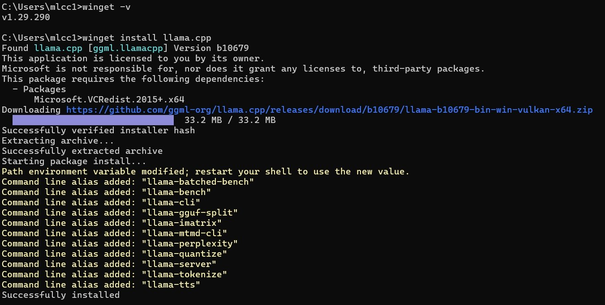

安装日志最后出现 Successfully installed 就代表安装成功。日志也会提示 PATH 已更新，因此关闭并重新打开 CMD 后，再用下面这条命令确认运行器可用：

```cmd
llama --version
```

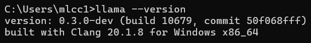

我电脑上的版本为 0.3.0-dev，build 为 10679。版本号不需要和我完全相同，但只要 llama --version 能正常返回，就说明运行器已经进入系统路径。

对不少 Windows 用户来说，C 盘空间不足是一个很常见的问题。模型文件本身比较大，我的 C 盘空间也比较吃紧，所以没有把模型放在 C 盘，而是直接把模型统一放到 D 盘。以后如果这台机器还要部署其他模型，也都落在 D 盘的统一目录里；C 盘只安装运行器。

于是我运行了下面的命令。为方便大家复制，我已经改成通用版：你只需要按自己的情况修改前 3 行环境变量，后面的路径会自动拼好。下面的 set 变量只在**当前 CMD 窗口**有效；关闭窗口后需要重新设置一次。这正好避免了每条命令都手改路径。

```cmd
set "MODEL_DIR=D:\llm-models"
set "MODEL_FILE=Qwen3.5-4B-Q4_K_M.gguf"
set "MODEL_URL=https://huggingface.co/unsloth/Qwen3.5-4B-GGUF/resolve/main/Qwen3.5-4B-Q4_K_M.gguf"
set "MODEL_PATH=%MODEL_DIR%\%MODEL_FILE%"
mkdir "%MODEL_DIR%"

setx LLAMA_CACHE "D:\llm-cache"
set "LLAMA_CACHE=D:\llm-cache"
```

从第 4 行开始，这几条命令分别在做什么：

- set "MODEL\_PATH=..."：把模型目录和模型文件名自动拼成完整路径，后面直接用 %MODEL\_PATH% 就行，不需要自己再写一遍。
- mkdir "%MODEL\_DIR%"：创建模型目录；如果目录已经存在，也不用担心。
- setx LLAMA\_CACHE "D:\\llm-cache"：把 LLAMA\_CACHE 写入 Windows 的用户环境变量。setx 里的 x 可以理解为“写到之后也能继续使用的环境里”，因此新打开的 CMD 也会知道 llama.cpp 的缓存目录是 D 盘。
- set "LLAMA\_CACHE=D:\\llm-cache"：让同一个 CMD 窗口立刻使用这个缓存目录。因为 setx 写入后通常要新开终端才会生效，所以这里再加一条 set，不用重开窗口也能马上继续操作。

为了方便，我这里直接使用了绝对目录：模型统一放在 D:\\llm-models，缓存放在 D:\\llm-cache。如果你的电脑使用其他盘符或目录，只需要修改前面对应的路径即可。

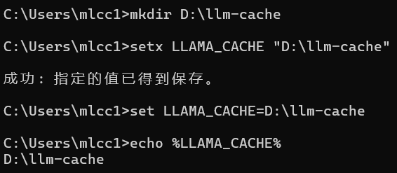

macOS用户可以用 Homebrew 安装 llama.cpp，并在 Terminal 中用 export 设置同样的变量。macOS 下的模型目录通常放在用户目录即可，不需要假设有 D 盘：

```bash
brew install llama.cpp

export MODEL_DIR="$HOME/llm-models"
export MODEL_FILE="Qwen3.5-4B-Q4_K_M.gguf"
export MODEL_URL="https://huggingface.co/unsloth/Qwen3.5-4B-GGUF/resolve/main/Qwen3.5-4B-Q4_K_M.gguf"
export MODEL_PATH="$MODEL_DIR/$MODEL_FILE"
mkdir -p "$MODEL_DIR"
```

本文在 Windows 上实测的是统一入口 llama cli 与 llama serve；Homebrew 安装的 macOS 版本通常使用 llama-cli 与 llama-server。命令名可能随安装渠道更新，因此 macOS 用户在继续前先执行一次 llama-cli --help 确认即可。

### 3.2 模型下载与问题排查

接下来我们可以尝试直接用 llama.cpp 的 Hugging Face 下载方式，把模型下载并启动：

```cmd
llama cli -hf unsloth/Qwen3.5-4B-GGUF:Q4_K_M --no-mmproj -c 8192 -n 256
```

第一次看到这条命令时，不需要死记。先知道每一段在做什么就够了：

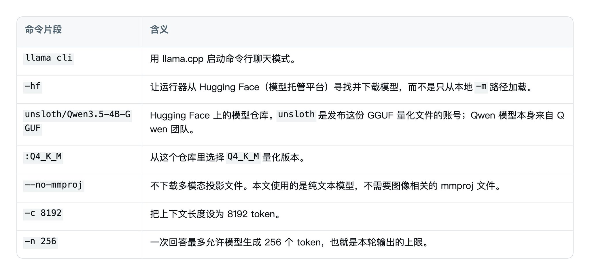

**这里也有一个踩坑记录：我的第一次尝试没有成功，终端出现了下面的结果：**

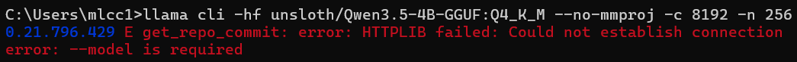

这个报错可以分两层来看。第一层 Could not establish connection 的意思是：运行器在访问 Hugging Face、查询模型仓库和版本时没有建立起网络连接。第二层 --model is required 是连带报错：-hf 本来应该在联网成功后解析出真正的模型文件，但前一步失败后，运行器没有得到可加载的模型路径，于是后续加载器只能提示“缺少模型”。它不代表我忘记写 -m；我本来使用的是 -hf，只是这个来源没有成功解析。

遇到这类失败时，不要立刻换模型。先把问题拆开：到底是网络根本无法访问 Hugging Face，还是网络可以访问、但当前运行器没有使用正确的代理或网络设置？

先用 curl.exe 做一个最小范围探测，只检查当前网络是否能访问 Hugging Face：

```cmd
curl.exe -I -L --connect-timeout 15 https://huggingface.co
```

如果结果里出现 HTTP/1.1 200 OK，说明网络本身可以访问 Hugging Face；这时就不需要怀疑模型链接，而要检查下载工具是否走到了已有的代理网络。

如果你通过 Clash Verge 使用代理，可以在“设置”里找到“复制环境变量类型”。先把右侧下拉框选成你正在使用的终端：用 PowerShell 就选 PowerShell；我这里使用 CMD，因此选择 CMD。这个选择很重要，因为它决定 Clash Verge 复制出来的是 set ... 还是 PowerShell 的环境变量语法，选错终端后直接粘贴就不会生效。

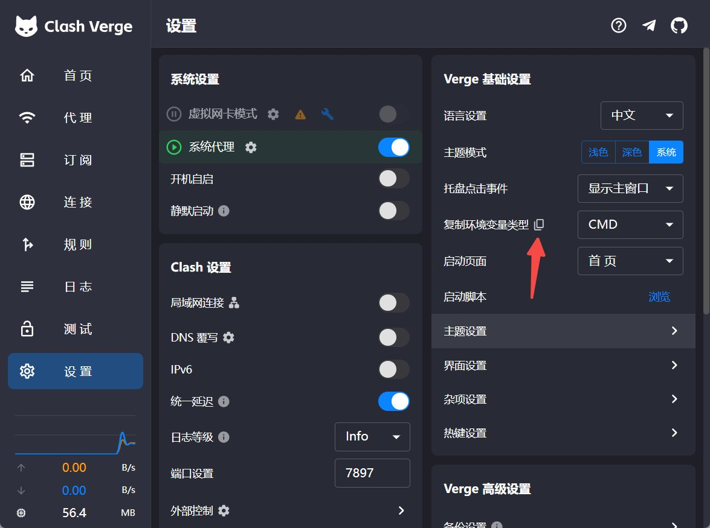

很多代理工具默认端口常被写成 7890，但不能想当然照抄。图中的“端口设置”是 7897，所以我实际使用的代理端口就是 7897。确认端口并复制环境变量后，在**同一个 CMD 窗口**执行下面三行：前两行让该窗口里的网络请求走代理，第三行再次验证连接。

```cmd
set "HTTP_PROXY=http://127.0.0.1:7897"
set "HTTPS_PROXY=http://127.0.0.1:7897"
curl.exe -I -L --connect-timeout 15 https://huggingface.co
```

我这里使用 curl.exe 下载的原因是：在我安装的这版 llama.cpp 中，llama cli -hf 的下载方式没有按预期使用这组代理环境变量；而 curl.exe 能走当前 CMD 已指定的代理网络。因此，网络验证通过后，我改用 curl.exe 直接下载模型文件：

```cmd
curl.exe -L -C - --retry 5 --retry-delay 3 -o "%MODEL_PATH%" "%MODEL_URL%"
```

这里的 -C - 表示断点续传；--retry 5 表示遇到临时网络错误时最多再试 5 次；-o 指定模型要保存到哪里。模型较大时需要等待一会儿。下载进度中，百分比到 100，并且箭头指向的大文件大小与 AI 预估的模型大小接近时，就可以认为模型已经完整下载到本地。

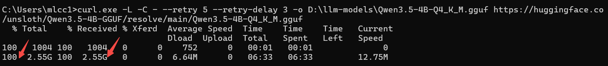

这次下载的文件大小是 2.55 GiB，耗时约 6 分 33 秒。下载完成后，模型就已经在本地；后面的 CLI 推理和本地 API 调用都不需要再次访问 Hugging Face。换句话说，代理流量主要消耗在这一次模型下载上。

macOS 的下载逻辑相同，只是变量写法不同：

```bash
curl -L -C - --retry 5 --retry-delay 3 -o "$MODEL_PATH" "$MODEL_URL"
```

## 4. 第一次本地推理

模型文件到位后，先不要急着启动 API。我们还需要先调试模型，找到适合这台机器的模型配置，并验证模型真的能在本机运行。遵循最小验证原则，第一步应该让它在终端里回答一个简单、可检验的问题；如果这里就有问题，就能优先判断是模型加载或配置问题，而不用一上来还要同时排查后面的服务调用问题。

Windows 上的命令如下：

```cmd
llama cli -m "%MODEL_PATH%" -c 8192 -n 256 --reasoning off
```

这里有几个参数需要注意：

- -m 指向已经下载好的本地模型文件；
- -c 8192 把上下文设为 8192 token；
- -n 256 限制一次最多生成 256 个 token；
- --reasoning off 则是这次模型特有、也很实用的设置：关闭可见的 reasoning 输出，让有限的输出预算优先留给最终答案。

macOS 参考命令如下：

```bash
llama-cli -m "$MODEL_PATH" -c 8192 -n 256 --reasoning off
```

我第一次没有关闭 reasoning。模型先输出了很长一段 thinking 过程，-n 256 的输出预算被它占用，最终回答没有完整出现。这个现象不是模型坏了，也不是上下文不够，而是我把“思考过程”和“最终回答”放进了同一份有限的生成预算里。

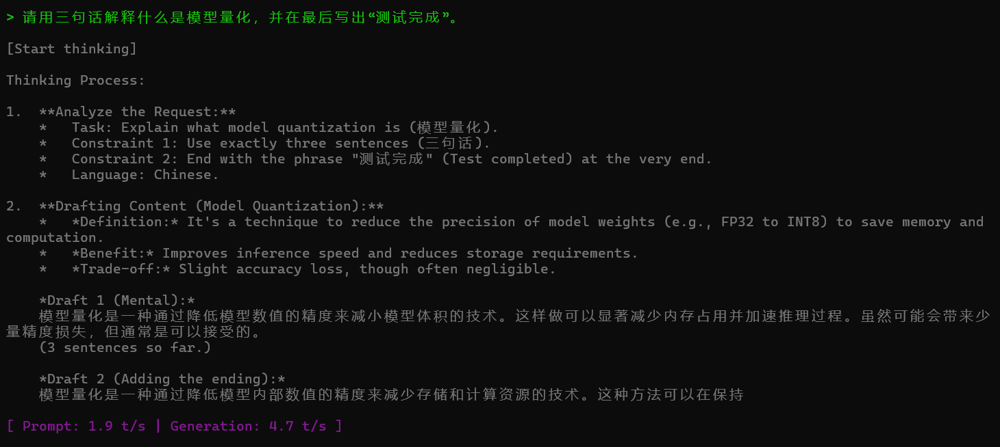

关闭 reasoning 后，我让模型“用三句话解释什么是模型量化，并在最后写出测试完成”。它给出了完整中文回答，并按要求结尾。

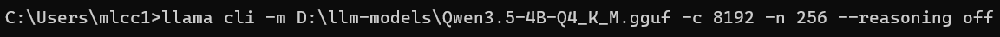

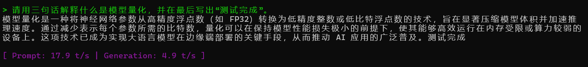

终端最后给出了两项很有价值的性能数据：Prompt 和 Generation。前者可以理解为模型阅读问题和历史上下文的速度；后者则是模型生成答案的速度，计量单位是 token。我的这台机器在这次测试中，Prompt 为 17.9 token/s，Generation 为 4.9 token/s。

4.9 token/s 并不是一个通用结果，更不能写成“Qwen3.5-4B 的速度就是 4.9”。它只是我这台电脑在特定硬件、特定模型配置和当前模型版本下的实测结果。性能数字永远要将硬件和模型配置纳入考虑范围。

### 4.1 模型文件 2.55 GiB，为什么运行时还会吃内存

我的这台机器没有独立显卡，使用的是集成显卡，因此没有一块单独的 VRAM 可以专门放模型。本文这次 CPU 基线运行时，模型权重、计算缓冲区和上下文需要的 KV cache 都会占用系统 RAM；所以 2.55 GiB 的 GGUF 文件在运行时会吃掉一部分内存，而且实际占用不会只等于文件大小。

在模型运行时，可以用下面这条 Windows 命令查看 llama.exe 当前占用了多少系统内存：

```cmd
tasklist /FI "IMAGENAME eq llama.exe" /FO LIST
```

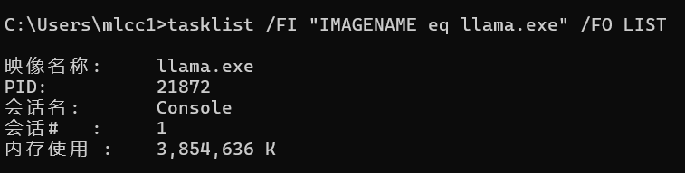

当时的内存使用是 3,854,636 K，约为 3.68 GiB。这个数值包含的不只是模型权重，也包括运行所需的其他内存。它给出的不是“所有电脑都会占 3.68 GiB”的结论，而是让我们能在自己的机器上用真实数据判断：模型到底有没有把系统挤得太紧。

如果你的电脑有独立显卡，并且后续把模型层 offload 到 GPU，部分模型数据会占用独立显存。需要注意的是：这里的 tasklist 只能查看进程使用的系统 RAM，不能准确显示 VRAM；显存占用应到任务管理器的 GPU 性能页查看；如果你使用NVIDIA，也可以使用 nvidia-smi 等显卡工具查看。

## 5. 把终端里的模型变成其他应用可调用的 API

到这里，模型已经能在终端和我们实现聊天功能。但如果要给一个网页、脚本、工作流或其他桌面应用调用，还需要把它启动成一个本地服务。

Windows 上，先在当前 CLI 里输入 /exit 退出聊天模式；然后另开一个 CMD 窗口，以 serve 模式启动服务。serve 可以理解为把模型变成一个小型服务器：它会为其他应用提供一个可访问的本地端口。

```cmd
llama serve -m "%MODEL_PATH%" -c 8192 -np 1 --reasoning off
```

macOS 的参考命令是：

```bash
llama-server -m "$MODEL_PATH" -c 8192 -np 1 --reasoning off
```

其中 -np 1 表示只为单用户打开一个并发槽位。我的目标是先跑通个人电脑上的单用户 API，而不是在这台集显笔记本上搭一个多人服务；因此没有必要一开始就预留多个上下文槽位。

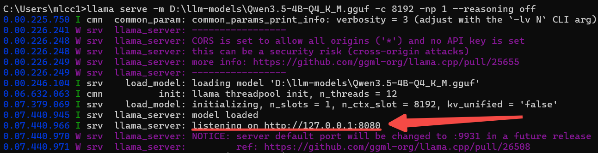

日志中的 listening on http://127.0.0.1:8080 很重要。127.0.0.1 是本机回环地址，意味着服务只接受这台电脑自己发出的请求，并没有直接暴露到局域网或公网。日志里也会提示 CORS 和 API key；在这个只监听本机的学习场景里，它提醒我们知道这项风险即可，不需要把服务暴露出去。

接下来保持服务窗口不要关闭，重新开一个 CMD 窗口，先做健康检查：

```cmd
curl.exe http://127.0.0.1:8080/health
```

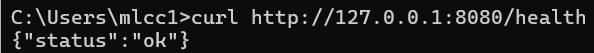

返回 {"status":"ok"} 说明服务活着、端口可访问。但这还不是最终验证，因为它并没有让模型生成任何内容。真正的闭环，是向 OpenAI 兼容的 chat completion 端点发一个问题：

```cmd
curl.exe http://127.0.0.1:8080/v1/chat/completions -H "Content-Type: application/json" -d "{\"messages\":[{\"role\":\"user\",\"content\":\"用一句话说明：这是谁的本地模型？\"}],\"max_tokens\":80,\"temperature\":0.3}"
```

macOS 下同一请求的写法更适合用单引号包住 JSON：

```bash
curl http://127.0.0.1:8080/v1/chat/completions \
  -H 'Content-Type: application/json' \
  -d '{"messages":[{"role":"user","content":"用一句话说明：这是谁的本地模型？"}],"max_tokens":80,"temperature":0.3}'
```

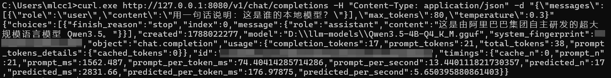

这段 JSON 里有三个地方值得注意：

- "object":"chat.completion"：说明调用走的是兼容 OpenAI 风格的聊天完成接口。
- "content"：这里面是真实的模型回答。
- "predicted\_per\_second"：这里给出了这次 API 调用时的生成速度。

到这一步，模型不再只是一个终端里的聊天对象，而是一项能被其他程序使用的本地能力。

## 6. 把本地模型接入已有 AI 项目

上一章完成的是接口层的验证：模型能收到请求，也能够回答问题。但真正落到 AI 应用里，就不是再“生成一个 API”，而是把原有项目的模型供应商从云端换到这台电脑上的本地接口。

**这里我用本机已有的一个简历评分项目做演示。这个项目最初来自一位 HR 朋友的真实需求：面对大量候选人简历，他们需要按预设指标提取信息、逐项评分、再把分数加总；总分超过门槛的候选人，才进入电话邀约面试环节。**

人工逐份看简历既慢又容易疲劳，所以我帮做了一个以关键词匹配为主、大模型兜底的简历评分系统。它会提取简历中的特定字段，先按规则评分；关键词无法判断时，再交给模型补齐。**这套应用已经进入实际招聘流程：原来一天人工处理约 300 份简历，现在 20 分钟左右就能自动完成同样规模的初筛。**

项目原先预留的是云端模型配置。为了做这次演示，我把它临时换成刚刚部署的本地模型：接口地址换成本地地址，模型名换成当前运行的本地模型。

### 6.1 本地 API 地址和 API Key 各自负责什么

我们启动 llama serve 后，本地 API 已经存在，地址就是：

```text
http://127.0.0.1:8080/v1/chat/completions
```

API Key 可以理解成这扇本地接口的门锁：模型服务和调用它的项目拿着同一把 Key，才能对上。它不是要去云平台申请的东西，而是一段自己设置的校验文本。

当前服务只监听 127.0.0.1，本机不开 Key 也能完成演示。为了完整走完“把本地模型接入项目”这个闭环，我还是把 API Key 打开了。

### 6.2 把项目的模型配置切到本机

为了不破坏项目原来的云端配置，我没有删除旧的 Key，而是沿用前面设置环境变量的方法，单独准备一把本机 Key。新开一个 CMD，执行：

```cmd
set "LOCAL_LLM_API_KEY=llama-local-%RANDOM%-%RANDOM%-%RANDOM%-%RANDOM%"
setx LOCAL_LLM_API_KEY "%LOCAL_LLM_API_KEY%"
```

其中 %RANDOM% 会生成随机数字；把几段数字拼起来，就得到一把这次演示使用的本机 Key。关闭并重新打开 CMD 后，用同一个变量启动模型服务：

```cmd
llama serve -m "D:\llm-models\Qwen3.5-4B-Q4_K_M.gguf" -c 8192 -np 1 --reasoning off --api-key "%LOCAL_LLM_API_KEY%"
```

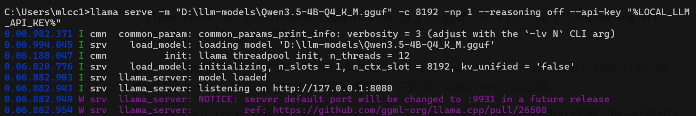

继续启动简历评分项目。项目会读取这把本机 Key，并把原先的云端配置临时换成下面三项：

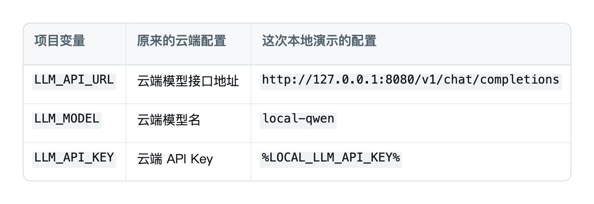

这里真正要验证的只有三点：

1. 接口地址已经指向本机的 127.0.0.1:8080。
2. 项目携带的是和模型服务相同的 Key。
3. 模型名使用项目约定的 local-qwen。

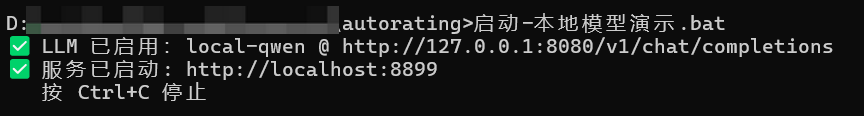

服务启动成功后，可以按住 Ctrl 再单击日志中的 http://localhost:8899，直接打开简历评分网页。

这是一种只适合在个人电脑本地运行的接法。若应用要对外提供服务，Key 应由后端保管，而不是交给浏览器页面。

### 6.3 用真实业务流程验证本地模型接入

我启动项目后，使用项目里的测试简历走完完整流程：文件文本提取 → 关键词规则初筛 → 判断是否需要 LLM 兜底 → 请求本地 chat/completions → 解析模型返回的 JSON。

测试中成功触发了 LLM 兜底，并从 127.0.0.1:8080 收到可解析的 JSON 响应。这比只让模型回答一句话更接近真实使用：前者验证服务端能够回答，后者还验证了应用能带着自己的提示词、配置和业务数据调用模型。

**这个项目已经进入生产，比较成熟，解析结果非常准确。**接入本地模型后，接口连通、格式兼容和项目接入都在这里完成验证。以下是模型的执行结果：

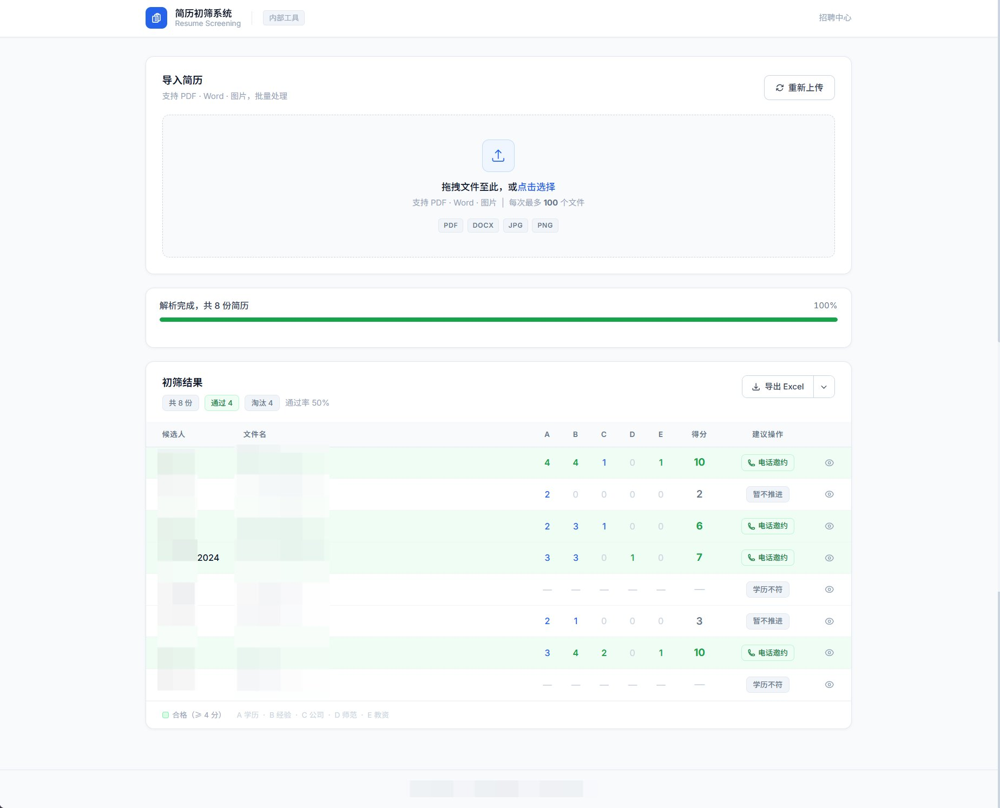

至此，这次部署完成了一个清晰的最小闭环：根据硬件选择模型，下载并保存 GGUF，在 CLI 中得到中文回答，观察真实速度和内存，启动只监听本机的服务，通过 chat/completions 拿到 API 返回，再把它接入一个已有的 AI 项目。

这已经足够作为第一个本地大模型项目的实践结果。之后当然还可以继续做：测试 Intel GPU 是否值得 offload、换更大的模型、接入聊天界面、做本地知识库 / RAG、开放局域网访问，或者为多用户请求做更严肃的资源和安全配置。但这些都是后续实践，不需要混进第一次跑通的目标里。

一个更好的实践顺序，是先在自己的电脑上建立一个最小的实践地基，再带着实际运行数据决定下一步。知道模型文件在哪里、为什么选择这个量化、速度和内存是多少、API 怎么调用，比直接堆很多工具更重要。

## 后记：为什么我仍然建议亲手跑一遍

最省事的方式，当然是直接把所有要求丢给 AI 一句话：请根据我的电脑，选一个适合本机的本地大模型，帮我部署下来，再给一条可以验证部署结果的命令。AI 可以快速给出答案，甚至可以把大部分操作都执行好。

但我仍然建议大家亲手跑一遍整个流程。原因并不复杂：只有每一步自己踩过坑，遇到不懂的地方，才会停下来问“为什么”。为什么同样叫 GPU，独显和集显的边界不同？为什么一个两三 GB 的模型文件，运行起来会占用更多内存？为什么网络已经能访问模型网站，下载命令却仍然失败？为什么健康检查成功了，还要再发一次真正的 API 请求？

如果跳过这些环节，得到的可能是一个已经成功、自己却无法解释原理的结果。这次实践本身，也是巩固基础知识、拓展认知边界的过程。下一次遇到显存不足、模型加载失败或接口报错等问题时，如果没有做过这些实操，我们往往只能依赖提示词去索取下一条命令，在本来可以手动改掉的问题上浪费大量 token。

这并不意味着每个人都要成为硬件专家。我们只需要至少知道各个环节分别负责什么，并且能把它们区分开。硬件决定运行边界，模型决定能力，量化决定体积与质量的取舍，运行器负责推理，API 则负责把这项能力交给其他应用。概念不需要一次性摸透，但至少不能混为一谈。

这篇文章分享的不是“普通电脑能不能无损替代云端大模型”，而是一个更长远的实践基础：

先让自己的设备稳定完成一次真实推理和一次真实的 API 调用。之后无论是换更好的设备、更大的模型、尝试 GPU 加速，还是做本地知识库和 AI 应用，才有一块更可靠的地基。

**我是 Jacky，持续记录 FDE 实践、分享 FDE 方法，也持续分享各种 AI 相关的知识。如果你在部署过程中遇到任何问题，也欢迎在评论区留言；我看到后一定会解答。**
