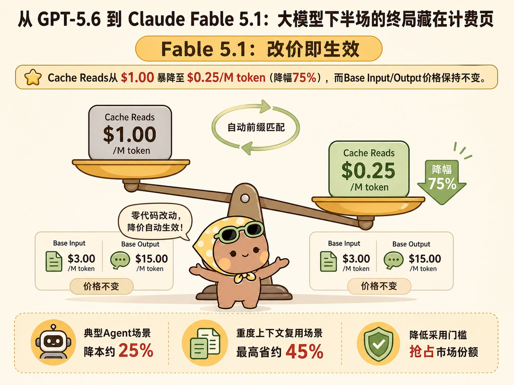
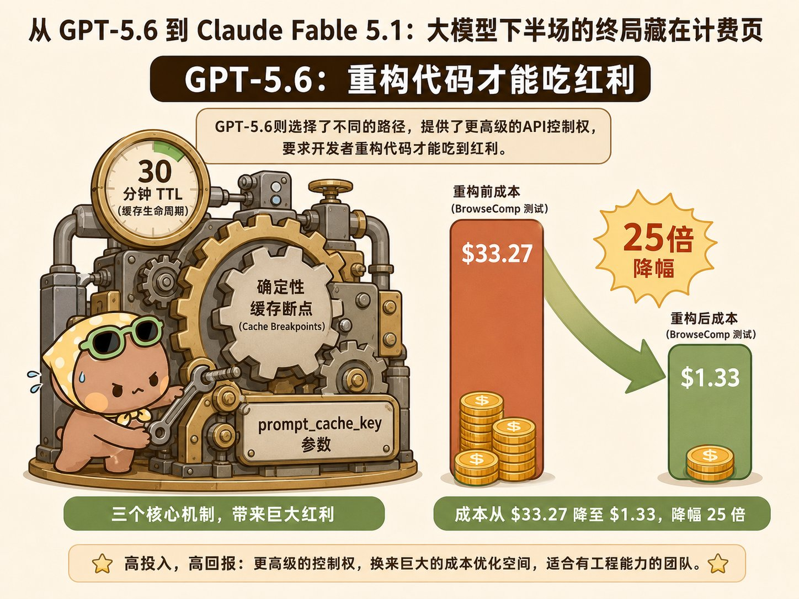
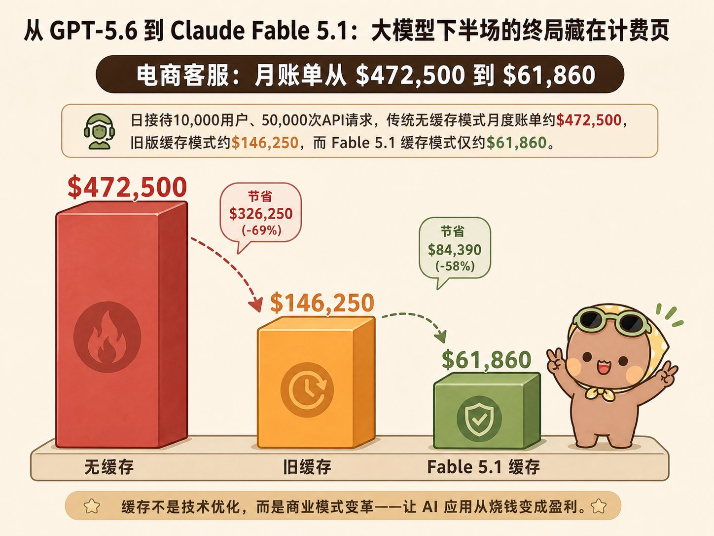

# 从 GPT-5.6 到 Claude Fable 5.1：为什么说大模型下半场的终局，藏在计费页不起眼的几行字里？

@StoryComicAI · [X 原文](https://x.com/StoryComicAI/article/2095307769020846255)


昨天 Anthropic 又发布了新模型 Fable 5.1，很多人的注意力都集中在 Benchmark 榜单的跑分上。但真正决定你的 AI 应用每月账单和响应速度的，是藏在 API 计费页里不起眼的几行字：

**Claude Fable 5.1 把缓存读取（Cache Reads）的价格暴降了 75%**；而 GPT-5.6 把缓存生命周期（TTL）拉长到了 30 分钟，并引入了“确定性缓存断点”与 prompt\_cache\_key。

这篇指南就从这些底层机制讲起。我们不拉踩模型，也不堆砌虚无缥缈的“AI 趋势”。先帮你把两家的缓存计费模型、工程机制、参数区别彻底认清，再判断你的业务该如何重构。

读完以后，你应该可以清楚地知道：两家到底动了什么，怎么在 API 层面配置缓存，什么时候该用，什么时候用了反而多花钱。


### 一、 先知道 Prompt Caching 到底在解决什么问题？

在聊具体模型前，必须先理清大模型计费与处理的四步循环：输入（Prompt） → 预处理（KV Cache 生成） → 推理（Reasoning） → Output（Completion）

过去大部分 AI 应用与 Agent 的成本，90% 烧在第一步和第二步：每次发起新对话，你都得把几万字的历史背景、规章制度、系统指令（System Prompt）重新发送并从头计算一遍。

- **传统模式（无缓存）：
第 1 轮：** 输入 20,000 token 制度 + 100 token 问题 ➔ 计费 **20,100 token
第 2 轮：** 输入 20,000 token 制度 + 200 token 上下文 ➔ 计费 **20,200 token
累积计费：** **40,300 全价 token**
- **缓存模式（Prompt Caching）：
第 1 轮：** 写入 20,000 token 静态背景（付一次 Cache Write 写入溢价）
**第 2 轮：** 读取 20,000 token 缓存（付 25% 或更低的 Cache Read 读取费）+ 200 token 增量
**累积计费：** **综合成本瞬间砍掉 70%～90%**

两家顶级厂商的动作，本质上宣告了一个事实：**省钱和性能的杠杆，已经彻底从“怎么写提示词”转移到了“怎么配置缓存”。**

### 二、 Claude Fable 5.1：动的不是能力，是 Pricing 骨架

翻开 Anthropic 最新发布页，最核心的变动在于这组定价数字：

- **Base Input / Output：** $10 / $50 每 M token
- **Cache Writes（写入缓存）：** $12.50 / M token
- **Cache Reads（读取缓存）：** 从 $1.00 暴降至 **$0.25 / M token（降幅 75%）**

根据 Anthropic 官方数据，这次调整让典型 Agent 场景降本约 25%，重度上下文复用（Heavy Agentic）场景最高省约 45%。

配合此前 Claude 系列的工程更新——*“中途更换工具（Mid-conversation tool changes）不再导致 Prompt Cache 失效”*——Anthropic 的逻辑非常明确：

你几乎不需要大改 API 代码逻辑。只要你的上下文（System Prompt + 工具定义 + 历史对话）满足最低 **1024 token** 的缓存门槛，系统会自动进行前缀匹配。

以前你在多轮对话里临时增加或关闭一个工具 API，缓存就全盘作废、被迫付全价重算；现在底层算法能自动将工具解耦，让你在灵活调度 Agent 工具链的同时，依然能吃到 75% 的降本收益。



### 三、 GPT-5.6：不给无感折扣，给架构级杠杆

与 Claude 的“自动打折”不同，在 GPT-5.6 体系下，OpenAI 选了另一条路：提供更高级的 API 控制权，**要求开发者必须重构代码才能吃到红利**。

GPT-5.6 在 Cache 层面给了三个核心 API 机制：

1. **30 分钟 TTL（Time-To-Live）：** 传统缓存通常只有 5 秒到 5 分钟闲置寿命，而 GPT-5.6 保证上下文在 30 分钟内无请求也不会被刷掉，极大延长了长生命周期 Agent 的存活时间。
2. **确定性缓存断点（Cache Breakpoints）：** 允许开发者在 Prompt 内部显式声明分界线，把“绝不变更的基座（如规章）”与“动态变化的内容（如用户输入）”强制切割。
3. prompt\_cache\_key** 参数：** 显式绑定工作区或会话 Key，提升跨并发请求时的显存命中概率。

官方指南给出了一个真实工程数据：在 BrowseComp 测试中，GPT-5.5 跑完任务成本为 **$33.27**；而采用原生压缩与 Breakpoints 配置后的 GPT-5.6 Luna，成本仅为 **$1.33**——**性能持平（84.36% vs 84.04%），成本飙降 25 倍。**



### 四、 算一笔真实账：电商客服 Agent 场景成本推算

为了让你更直观地看到差异，我们拿一个真实的 **企业级电商客服 Agent** 场景算一笔真金白银的账：

**业务假设条件：**

- **系统 Prompt + 店铺 50 项售后 SOP + 商品知识库：** 固定 30,000 Tokens
- **对话模式：** 平均每位用户对话 5 轮，每轮用户输入 100 Tokens，模型回答 200 Tokens
- **日均接待量：** 10,000 名用户（每天产生 50,000 次 API 请求）

**月度账单对比：**

| 模式 | 预处理计费方式 | 每天 Input 计费 | 每天 Output 计费 | 月度预计总账单 |
| --- | --- | --- | --- | --- |
| 传统无缓存 | 每次对话重新扫描 30,000 Tokens | $15,000 / 天 | $750 / 天 | 约 $472,500 / 月 |
| 旧版缓存 ($1/M) | 1 次写入 + 4 次读取 | $4,125 / 天 | $750 / 天 | 约 $146,250 / 月 |
| Fable 5.1 缓存 ($0.25/M) | 1 次写入 + 4 次读取 (打 2.5 折) | $1,312 / 天 | $750 / 天 | 约 $61,860 / 月 |

> **结论：** 在长上下文的高频交互场景下，单单是 Caching 价格从 $1 降到 $0.25 这一个改动，就能直接把企业每个月的 AI 显存费用砍掉将近 60%！



### 五、 开发者最容易踩的 4 个“缓存失效 (Cache Miss)”暗坑

在实际工程落地中，很多开发者跑完代码发现“自己的账单一点没少”，通常是因为踩了以下四个极为隐蔽的工程坑位：

1. **动态变量置顶（最致命错误）：
错误：** 在 System Prompt 第一行写入 当前时间：2026-09-02 10:01:23 或 当前 Session\_ID: 9527。因为时间/ID 每秒都在变，导致后面精心准备的 3 万字知识库缓存完全作废。
✅**正确：** 时间戳、用户 ID、Session ID 强行塞在 Prompt 的**最末尾**。
2. **JSON 工具定义（Tools）的序列化顺序随机：
**在部分 Python/Node.js 后端框架中，字典或对象转 JSON 字符串时，Key 的排列顺序每次是随机的。字节流发生微小改变，会导致底层前缀 Hash 匹配失败。传参时必须显式设置 sort\_keys=True。
3. **设置的上下文低于阈值门槛：
**Claude 需要上下文达到 **1024 Tokens**，OpenAI 需要达到 **2048 Tokens**。几百字的小提示词强行开启缓存无意义，甚至写入时还要额外付出写入溢价（Write Premium）。
4. **并发请求分散到了不同的 Serverless 节点（OpenAI 侧）：
**多线程高并发场景下，如果请求被负载均衡路由到了不同的物理 GPU 节点，且没有显式携带 prompt\_cache\_key，就会导致节点频繁重新加载显存。

### 六、 两大巨头缓存机制全方位选型对比

不同场景下两家的适用性截然不同，下面内容可以作为参考：

| 维度 | Claude (Fable 5.1) | OpenAI (GPT-5.6) |
| --- | --- | --- |
| 接入成本 | 零门槛（自动匹配前缀，改价即生效） | 中等（需手动重构 API 请求，加 Breakpoints 和 Key） |
| 缓存寿命 (TTL) | 动态维持（约 5 分钟无请求自动释放） | 固定 30 分钟（适合异步低频 Agent） |
| 降本极限 | 缓存读取打 2.5 折（降 75%） | 结合原生压缩与断点，最高降至 1/25 |
| 工具修改影响 | 不失效（支持动态工具解耦） | 需要保持 Tools 序列化定义严格一致 |
| 最佳适用场景 | 高频多轮对话、动态工具调用的客服/代码助手 | 长时间运行的异步 Agent、超大上下文检索系统 |

### 七、 提示词结构重构：从“文本拼接”到“动静分离”

知道了机制，实际代码或 Prompt 该怎么写？最核心的原则是：**动静分离，前置固定。**我们将现代 Caching 架构提炼为“三层沙盒模型”：

```text
┌──────────────────────────────────────────────────────────┐
│ 【1. 绝对静态层】(置顶)                                   │
│ 👉 系统角色设定、安全边界防范、格式输出规则                 │
│ 👉 永远保持字节级一致                                     │
└──────────────────────────────────────────────────────────┘
                             │
                             ▼
┌──────────────────────────────────────────────────────────┐
│ 【2. 相对静态层】(中间)                                   │
│ 👉 5000 字公司 SOP、Schema 定义、工具 (Tools) 声明         │
│ 👉 配置 Cache Breakpoint 与 prompt_cache_key             │
└──────────────────────────────────────────────────────────┘
                             │
              【 缓存断点 / Cache Boundary 】
                             │
                             ▼
┌──────────────────────────────────────────────────────────┐
│ 【3. 频繁动态层】(置底)                                   │
│ 👉 动态环境变量（如当前系统时间）、用户历史提问、增量输入   │
│ 👉 频繁变更，只作为少量增量计算                           │
└──────────────────────────────────────────────────────────┘
```

**核心法则：** 把永远不变的规则、知识库、结构化 JSON 定义强行按顺序塞在最前面。只要前缀不变，这部分永远只付 25% 甚至更低的读取费。

### 八、 进阶工程范式：多 Agent 协作系统（Multi-Agent）的共享缓存

在复杂工作流中，我们常常需要调度多个子 Agent（例如：代码编写 Agent、代码审查 Agent、单元测试 Agent）。

过去，每个子 Agent 独立调用 LLM，各自扫描一遍上万行的工程源码，造成极大的资源浪费。

在全新的 Caching 架构下，**最先进的工程范式是“中央主干共享缓存”**：

1. **共享 Base 上下文：** 启动时，由 Orchestrator（主控 Agent）将全局工程代码库与架构规范一次性写入显存（付出 1 次 Write 成本）。
2. **派生分支任务：** 当派生出 Review Agent 或 Test Agent 时，将各自的专属指令附加在全局上下文**底部**发起请求。
3. **效果：** 所有子 Agent 共享同一个“绝对静态层”，使得多 Agent 协同的 Token 开销直接下降 80% 以上，响应速度（TTFT）提升 3 倍。

### 九、 落地实施顺序与总结

如果你正在开发 AI 产品或维护 Agent 系统，建议按以下三步推进：

1. **第一阶段（零代码结构优化）：** 检查现有 Prompt 顺序。把系统设定、角色要求、参考文档统统提到最前排，动态变量置底。如果是 Claude 用户，此时已经自动享受降本。
2. **第二阶段（API 接入改造）：** 如果使用 GPT-5.6，花半天时间引入 prompt\_cache\_key，并在 API 调用中显式声明断点，享受 30 分钟 TTL 带来的异步复用收益。
3. **第三阶段（推理强度调优）：** 告别“无脑拉满推理强度”。根据官方测试数据，开启“原生压缩 + 中低推理强度”，表现往往优于盲目堆砌 Token 的高推理模式。

我是齐杰拉，在互联网大厂做AI Agent开发，同时兼岗产品经理，关注我[@StoryComicAI](https://x.com/@StoryComicAI)，**一起成长，一起赚钱**。
