# 从零安装Qwen3.8-27B：Mac本地部署与性能调优指南

@ai_suxiaole · [X 原文](https://x.com/ai_suxiaole/article/2094417646284587282)


Qwen3.8-27B 来了
普通 Mac 也有机会跑
内存、速度、上下文
这份指南一次讲透

最近两条消息，刚好撞到了一起。

8 月 14 日，Qwen3.8-27B 正式开放权重。不到两周后，苹果又发布了搭载 M5 Max 和 M5 Ultra 的新款 Mac Studio，重点宣传本地 AI 性能和最高 512GB 统一内存。

看完这些介绍，很容易产生一个错觉：想在 Mac 上运行 Qwen3.8-27B，是不是也得买一台最新的 Mac Studio，甚至直接上 Ultra？

其实没有这么夸张。

但在过去，27B Dense 模型确实不是普通本地用户最愿意选的方案。Dense 的特点是每生成一个 token，都要读取和计算完整的主体参数。在 24GB 级设备上，即使经过量化、勉强装进内存，早期社区实测也经常只有个位数到十几 token/s。

相比之下，35B-A3B 这类 MoE 模型虽然总参数更多，每次实际激活的参数却只有约 3B，生成速度可能快上数倍。对于需要连续读代码、调用工具和反复修改文件的 Agent 来说，模型能力再强，如果每一轮都要等很久，也很难成为日常工具。因此，过去不少本地玩家会优先选择 MoE。

现在情况开始发生变化。

量化格式、Apple Silicon 推理框架和新一代解码加速方式逐渐成熟，让 27B Dense 模型第一次有机会同时兼顾能力与速度。你不一定需要最新的 Ultra：24GB、32GB Mac 可以从 4-bit 版本开始，48GB 以上则有更宽松的选择。

真正的问题已经不只是“能不能加载”，而是怎样选择量化版本、控制上下文和内存，并把生成速度调到真正可用。

这篇文章会从零完成一套可复现的部署：先算清楚内存账，再跑出没有加速的基础速度，最后用相同任务做 A/B 测试，并把模型启动成 OpenAI、Anthropic 客户端都能调用的本地 API。

如果你现在不打算部署，也建议先收藏。以后换了大内存 Mac，或者准备把本地模型接进代码 Agent、知识库和自动化工作流，照着做就行。

## 先说结论：你的 Mac 能不能跑？

只看统一内存，可以先用这张表做决定：

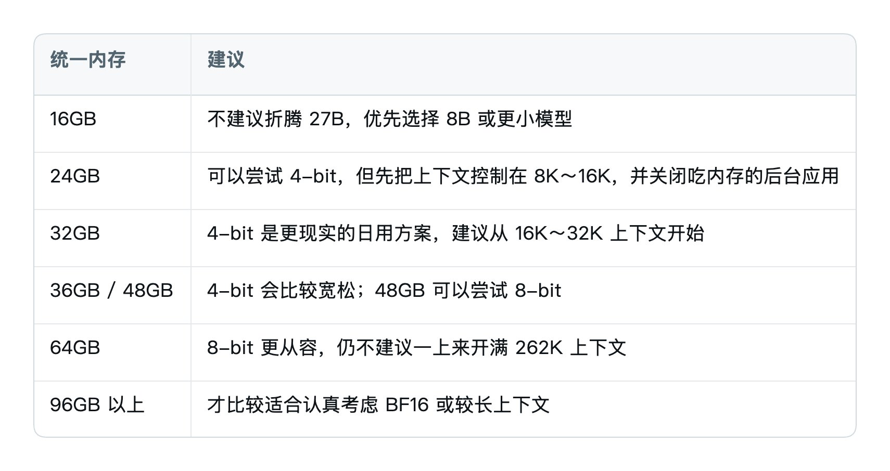

这张表不是“能不能点亮模型”的绝对边界，而是“能不能稳定工作”的建议。

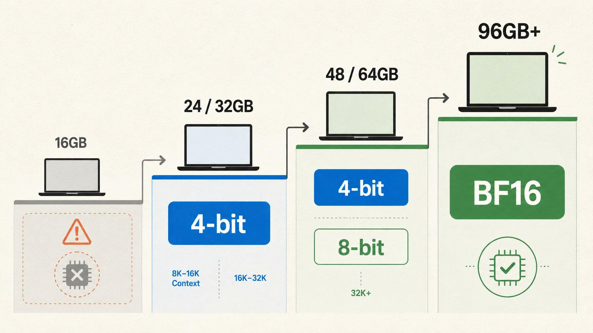

有些 24GB Mac 确实能加载 4-bit，但加载成功不等于适合长期使用。macOS、浏览器、开发工具、模型运行缓冲、上下文缓存和 DFlash 2 草稿模型，都要争用同一块统一内存。模型刚启动看起来没问题，真正输入一段长代码后才开始 Swap，是最常见的翻车方式。

另外，本教程只适用于 Apple Silicon，也就是 M1、M2、M3、M4、M5 系列 Mac。Intel Mac 不走这套 MLX 路线。

## 27B 到底是什么？先纠正一个最容易传错的数字

模型名字里的 B 是 Billion，也就是十亿。

所以 27B 的意思是约 270 亿参数，不是 2700 亿。

你可以把参数理解成训练结束后保留下来的大量数字。模型每生成一个 token，都要读取并计算这些数字，再判断下一个 token 应该是什么。27B 就像一台拥有 270 亿个旋钮的机器：训练负责把旋钮调到合适的位置，本地推理负责把这些旋钮载入内存并不断读取。

Qwen3.8-27B 是 Dense 模型。Dense 可以简单理解为：每生成一个 token，主体参数都要参与计算。

这和名称中带有 A3B、A10B 的 MoE 模型不一样。比如一个 35B-A3B 模型，可能总共存着 350 亿参数，但每次只激活约 30 亿参数。它依然需要为全部权重准备存储空间，不过单 token 的计算量和内存读取量会小很多。

所以，不能因为两个模型都写着“30B 左右”，就默认它们速度、内存占用和能力档位接近。总参数、激活参数、模型架构和量化精度要放在一起看。

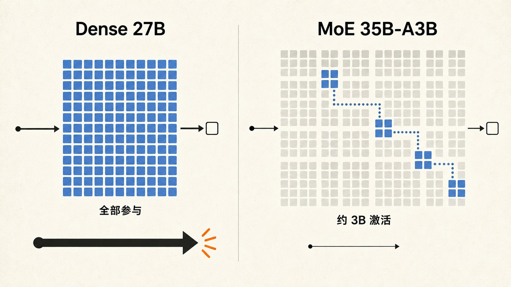

Qwen3.8-27B 还不是传统意义上的“每层都做完整注意力”。[官方模型卡](https://huggingface.co/Qwen/Qwen3.8-27B)显示，它由 64 层组成，采用 Gated DeltaNet 与 Gated Attention 混合架构：大致每 3 层线性注意力，穿插 1 层标准注意力。它原生支持 262,144 token 上下文，也具备图像和视频理解能力，默认开启思考模式，并允许通过 reasoning\_effort 调整推理深度。

这些能力解释了它为什么适合代码、研究、长任务和 Agent；也解释了为什么部署时不能只盯着一个“27B”。

## 它的能力大概在哪一档？

如果把个人电脑上的本地模型粗略分档：

- 3B～8B：启动快、占用低，适合普通问答、简单提取和轻量工具调用；复杂任务更容易跑偏。
- 14B～30B：目前最实用的高质量区间，开始能稳定承担代码生成、长文处理、结构化分析和 Agent 工作。
- 70B 以上 Dense：整体稳定性往往更强，但内存容量和带宽要求会明显上升，个人部署成本也高很多。

Qwen3.8-27B 正好卡在“个人设备还能现实部署，能力又足够进入生产工作流”的位置。

官方模型卡里，它在 SWE-bench Pro 上给出 61.7，在 Terminal Bench 2.1 上给出 73.0；同一张表中的 Opus 4.6 Max 分别是 53.4 和 78.2。这个结果可以说明：在部分编码和终端 Agent 任务上，Qwen3.8-27B 已经有资格和闭源旗舰放在同一张表里讨论。

但别把这句话改写成“27B 全面超过闭源旗舰”。

Benchmark 会受到提示词、采样参数、工具环境、测试框架和推理预算影响。官方模型卡也专门披露了不同测试使用的 harness。一个分数更高，只能说明它在那套测试条件下表现更好，不代表知识广度、开放式推理、长文稳定性、视觉能力和真实工作流都全面领先。

更准确的定位是：它不是闭源旗舰的完整替代品，但已经是一台可以认真干活的本地模型。

## 真正决定你能不能跑的，是这笔内存账

很多人会把“模型参数量”和“运行内存”直接画等号：27B，所以需要 27GB。

这个算法不对。参数量还要乘以每个参数占多少位。

以 270 亿参数粗算：

- BF16：每个参数 2 Byte，原始权重约 54GB。
- 8-bit：每个参数约 1 Byte，理论值约 27GB。
- 4-bit：每个参数约 0.5 Byte，理论值约 13.5GB。

理论值只算主体权重。真实模型仓库还包含量化比例、配置、词表、视觉组件等内容。Hugging Face 上的 MLX 社区版本，4-bit 文件约 16.1GB，8-bit 文件约 29.5GB。一个文本 BF16 社区转换则明确写着约 54GB。

到这里还只是“文件多大”，不是“启动后占多少”。模型运行时至少还会吃掉四类空间。

### 1. 上下文缓存

模型需要记住已经读过的内容，否则生成每个新 token 都要从头重算。标准注意力部分会使用 KV Cache，线性注意力层也有自己的状态。

上下文越长，缓存越大。mlx-dspark 项目的实测显示，Qwen3.8-27B 在 128K 上下文时，缓存可能额外增加约 11GB；完整 256K 上下文可能增加约 23GB。

这就是为什么官方写着支持 262K，不等于 24GB Mac 也应该开 262K。能力上限是模型能处理的上限，不是你的机器最舒服的默认值。

### 2. 运行缓冲和临时激活

模型读取长 Prompt 的阶段叫 Prefill。这个阶段要一次处理大量输入，内存和计算压力可能突然上升。你只发一句“你好”时的内存截图，不能代表粘贴 2 万 token 代码后的情况。

### 3. macOS 和其他应用

Apple Silicon 的 CPU 与 GPU 共用统一内存，这是 MLX 高效的基础，也是内存预算必须保守的原因。模型、系统、Chrome、Cursor、Docker 和其他程序都在同一池子里抢空间。

### 4. DFlash 2 草稿模型

DFlash 2 不是一个免费开关。它需要额外加载草稿模型和对应缓存。项目给出的聊天长度峰值参考约为：4-bit 目标模型加草稿约 18GB，8-bit 约 29GB。这里仍然没替 macOS 预留空间。

因此，完整公式应该是：

> 实际内存 = 模型权重 + 上下文缓存 + 运行缓冲 + 草稿模型 + macOS 与其他应用

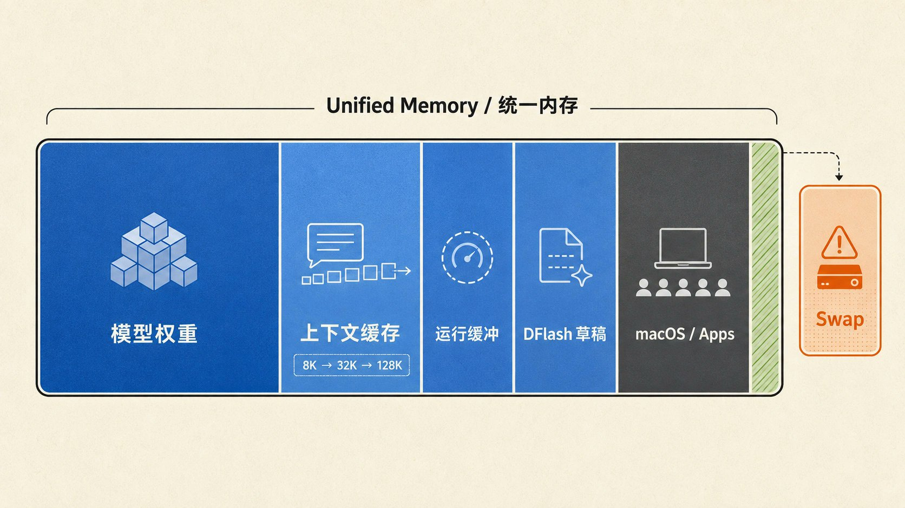

理解这条公式，比记住任何一台博主电脑的速度都重要。

## 4-bit、8-bit、BF16 到底怎么选？

量化可以理解成把模型参数记录得更紧凑。位数越低，模型越省内存，通常也会更快；代价是会损失一部分精度。

对普通 Mac 用户，我建议这样选：

### 24GB / 32GB：直接从 4-bit 开始

模型仓库：

```text
mlx-community/Qwen3.8-27B-4bit
```

4-bit 文件约 16.1GB。24GB 能尝试，但要主动关闭大型后台应用，从 8K～16K 上下文开始。32GB 会更适合日常使用。

不要因为 24GB“可以加载”，就继续叠加超长上下文和 DFlash 2。先跑稳定，再一个变量一个变量地加。

### 48GB / 64GB：可以考虑 8-bit

模型仓库：

```text
mlx-community/Qwen3.8-27B-8bit
```

8-bit 文件约 29.5GB。48GB 是比较现实的起点，64GB 会更从容。如果你更看重速度、上下文空间和系统余量，64GB 也完全可以继续用 4-bit，不必为了“精度更高”强行上 8-bit。

### BF16：别把“能塞进去”当成“适合用”

BF16 文本权重已经约 54GB。64GB Mac 理论上接近能装下，但再加系统、缓存和缓冲，余量会非常小。实际长期使用，更适合从 96GB 往上考虑。

对于大多数人，4-bit 和 8-bit 的使用体验差异，远小于“是否因为内存不足开始 Swap”的差异。一旦持续 Swap，再高的量化精度也救不了响应速度。

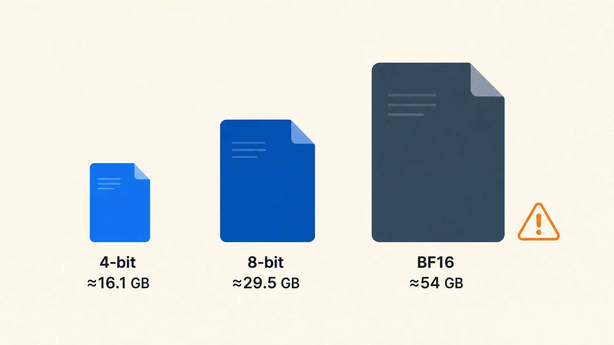

## 部署前准备：检查芯片、内存和磁盘

先打开终端，确认机器信息：

```bash
system_profiler SPHardwareDataType
```

你需要看到 Apple M 系列芯片和统一内存容量。

再看磁盘：

```bash
df -h .
```

建议至少留出模型体积两倍左右的可用空间。下载过程可能产生缓存，之后还会有草稿模型、多个量化版本和日志。4-bit 最好准备 35GB 以上空余，8-bit 最好准备 60GB 以上。

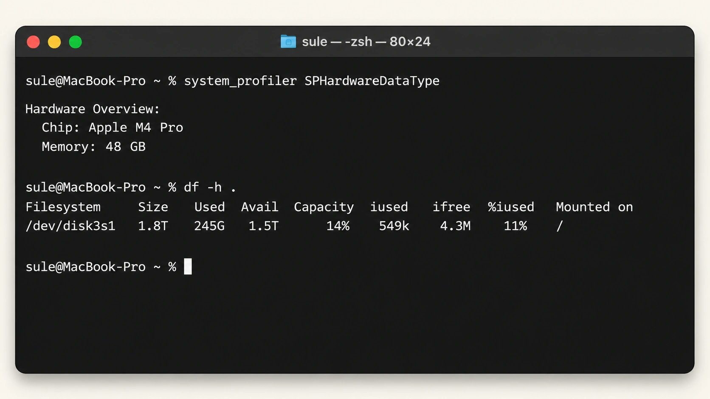

本教程使用 uv 管理 Python 环境。没有安装的话：

```bash
brew install uv
```

创建独立目录和虚拟环境：

```bash
mkdir -p qwen38-local/models
cd qwen38-local

uv venv .venv
source .venv/bin/activate
```

这样做的好处不是“看起来专业”，而是避免 MLX、Transformers 和其他项目依赖互相污染。以后不想用了，删除这个项目目录即可。

安装需要的工具：

```bash
uv pip install -U huggingface_hub mlx-dspark
```

mlx-dspark 当前要求 Apple Silicon 和 Python 3.10 以上，并会自动安装 mlx-lm、mlx-vlm 和合适的 MLX 依赖。

## 下载模型：不要在浏览器里逐个点文件

大模型通常被拆成多个权重分片。浏览器逐个下载，容易中断、漏文件，也不方便续传。更稳妥的方法是使用 Hugging Face 官方 hf 命令。

### 4-bit 下载命令

```bash
MODEL_DIR="$PWD/models/Qwen3.8-27B-4bit"

hf download mlx-community/Qwen3.8-27B-4bit \
  --local-dir "$MODEL_DIR"
```

### 8-bit 下载命令

```bash
MODEL_DIR="$PWD/models/Qwen3.8-27B-8bit"

hf download mlx-community/Qwen3.8-27B-8bit \
  --local-dir "$MODEL_DIR"
```

新版 Hugging Face Hub 使用 Xet 分块下载，默认会根据网络自适应并发。多数人不需要再复制旧教程里的 hf\_transfer 配置。

你可能还会看到这个“高性能下载”开关：

```bash
HF_XET_HIGH_PERFORMANCE=1 hf download ...
```

别无脑开启。Hugging Face 官方说明，它会提高并发、缓冲和 CPU 使用，更适合高带宽且至少 64GB 内存的机器。低内存 Mac 可能因为抢占资源反而更慢。24GB、32GB 机器先用默认设置即可。

下载完成后检查目录大小：

```bash
du -sh "$MODEL_DIR"
```

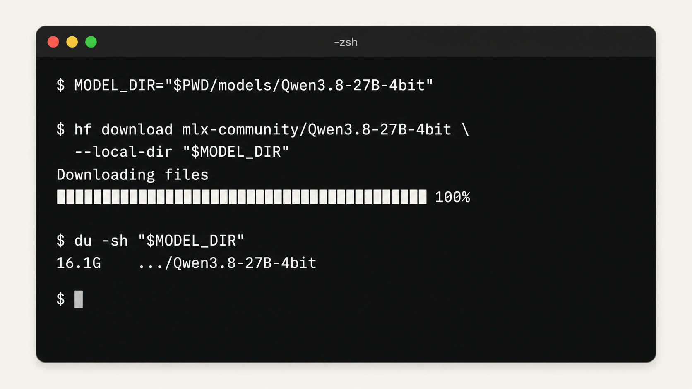

## 第一次运行：先测基础速度，别急着开 DFlash 2

部署本地模型最容易犯的错，是一次打开十个优化选项。最后确实跑快了，你不知道是谁的功劳；跑慢了，也不知道该关谁。

正确顺序是先跑 baseline。

准备一段固定提示词，最好接近你的真实工作。比如你主要用它写代码，可以用：

```text
请用 Python 实现一个支持过期时间和 LRU 淘汰的线程安全缓存，先解释设计，再给出完整代码和测试。
```

基础测试：

```bash
mlx-dspark generate \
  --model "$MODEL_DIR" \
  --mode baseline \
  --prompt "请用 Python 实现一个支持过期时间和 LRU 淘汰的线程安全缓存，先解释设计，再给出完整代码和测试。" \
  --max-new-tokens 600
```

记录四个数字：

1. 模型加载时间。
2. Prompt 处理速度，也就是 Prefill tok/s。
3. 首 token 等待时间，也就是 TTFT。
4. 正式生成速度，也就是 generation tok/s。

生成速度决定“字一个个出来有多快”，Prefill 和 TTFT 决定“你按下回车后要等多久”。对代码 Agent 来说，每轮可能都要重新读取大量系统提示词和代码，Prefill 往往比纯生成速度更影响体感。

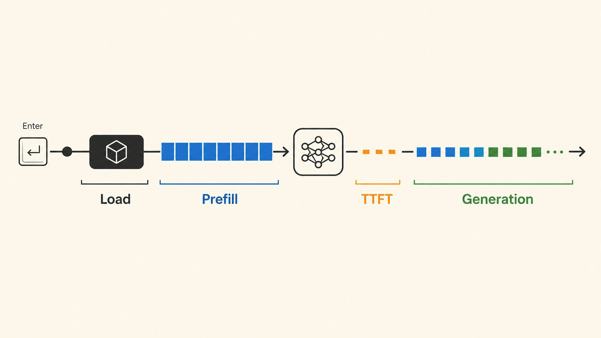

测试时还要打开“活动监视器 → 内存”，观察内存压力和 Swap。黄色不一定马上出问题，但如果 Swap 持续上涨，说明这套配置没有稳定余量。

别只跑 50 个 token。短回答会让加载和热身时间占比过高，也看不出持续生成时的真实速度。建议至少生成 400～1000 token。

## DFlash 2 是怎么把 27B 跑快的？

普通解码是串行的。Qwen3.8-27B 生成一个 token，完整目标模型跑一次；再生成下一个，又跑一次。生成 1000 个 token，就要连续做大约 1000 轮。

DFlash 2 会加入一个更轻的草稿模型。草稿模型先并行提出一组候选 token，再让 27B 主模型统一验证。猜对的部分可以一次接受多个，猜错的部分由主模型纠正。

可以把它想成：

- 草稿模型是助理，负责快速起草。
- 27B 主模型是主编，拥有最终决定权。
- 助理连续猜对得越多，主编需要完整走的轮次越少。

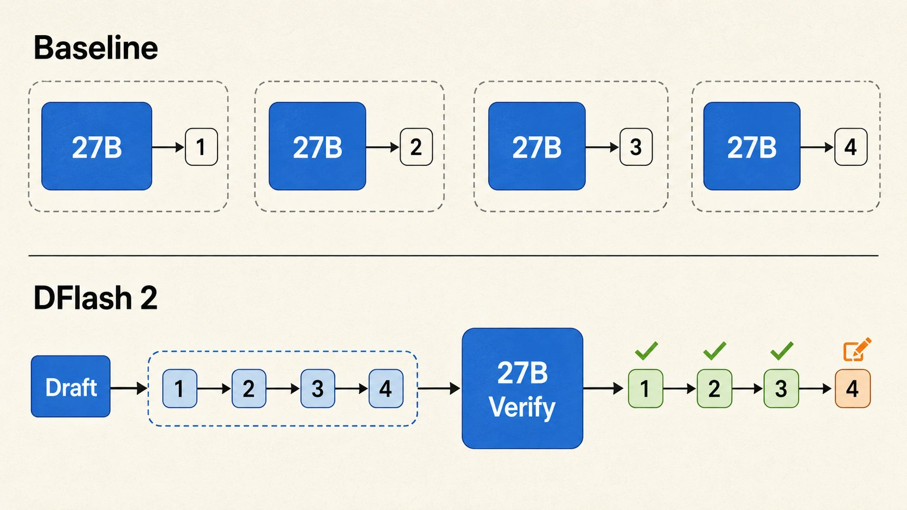

草稿模型不会单独决定输出。DFlash 2 模型卡说明，在贪心解码下，输出可与目标模型一致；随机采样时则保持目标模型的分布。

它也不是任何场景都必然加速。

如果任务让草稿模型很容易预测，比如代码续写、格式稳定的长文，接受长度通常更高；如果内容跳跃大、答案很短或采样随机性高，草稿经常被拒绝，额外计算就可能吃掉收益。

## 开启 DFlash 2：让工具自己校准，别抄别人参数

先跑项目自带 benchmark：

```bash
mlx-dspark benchmark \
  --model "$MODEL_DIR" \
  --modes dflash \
  --caps auto \
  --trials 3
```

这里显式指定 --modes dflash，因为当前版本的 benchmark 默认测试 DSpark 和 lookup，并不会自动切到 Qwen3.8-27B 的 DFlash 2。第一次运行会下载匹配的草稿模型；--caps auto 会根据你的 Mac、目标模型和量化版本测试合适的 draft cap。M1 Max、M4 Pro、M5 Max 的内存带宽和计算成本不同，最佳参数不应该完全一样。

因此，不建议看到别人写 --max-draft 7 就永久照抄。让自动校准先给出答案，再用真实任务复测。

用相同提示词开启自动模式：

```bash
mlx-dspark generate \
  --model "$MODEL_DIR" \
  --mode auto \
  --prompt "请用 Python 实现一个支持过期时间和 LRU 淘汰的线程安全缓存，先解释设计，再给出完整代码和测试。" \
  --max-new-tokens 600
```

现在把它和 baseline 比较：

- 输出文本是否一致？
- TTFT 有没有明显变长？
- generation tok/s 提升多少？
- mean accept length 是多少？
- 峰值内存和 Swap 是否恶化？

这组命令默认使用贪心解码，baseline 与 auto 的输出文本应当一致，极少数浮点并列情况除外。如果答案明显不同，先检查 Prompt、思考模式、采样参数和软件版本是否完全一致，再谈速度。随机采样时，DFlash 2 保持的是目标分布，不保证两次生成的具体文字相同。

[\`mlx-dspark\` 项目](https://github.com/ARahim3/mlx-dspark)在 M4 Pro 48GB 上的项目基准中，8-bit 从约 8.4 tok/s 提升到 30.5 tok/s，平均约 3.63 倍；4-bit 从约 14.7 tok/s 提升到 33.8 tok/s，平均约 2.30 倍。

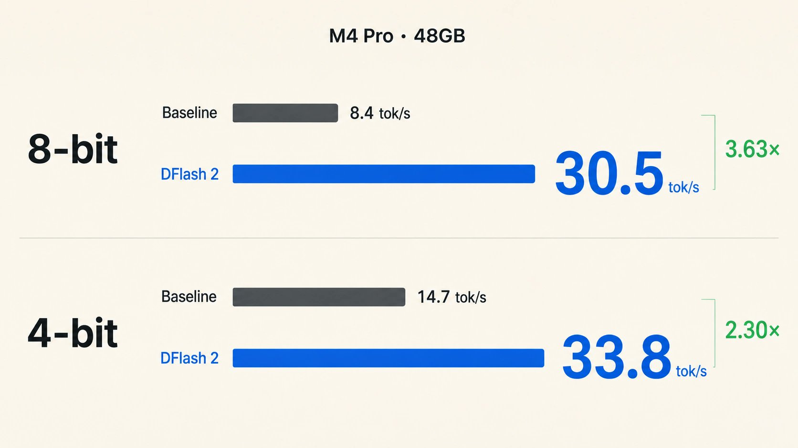

这是特定版本、机器、热启动状态和测试提示词下的结果，不是承诺。项目自己的拆分数据也显示，聊天、代码和数学任务的加速比例不同。

真正有用的判断标准不是“别人跑到 30 tok/s”，而是你的高频任务有没有变快。

如果你平时让模型改代码，就拿真实仓库中的修改任务测；如果用它写文章，就连续生成 1500 token；如果要接 Agent，就完整跑一次工具调用。只有真实任务的总耗时下降，DFlash 2 才值得常开。

## 把模型启动成一个本地 API

确认基础模式和自动模式都稳定后，可以把模型常驻为服务。24GB Mac 先把上下文限制为 8K：

```bash
mlx-dspark serve \
  --model "$MODEL_DIR" \
  --mode auto \
  --context-window 8192
```

32GB 可以先从 16K 开始；稳定后再逐步提高到 32K：

```bash
mlx-dspark serve \
  --model "$MODEL_DIR" \
  --mode auto \
  --context-window 16384
```

服务启动后，在另一个终端检查状态：

```bash
curl http://127.0.0.1:8080/health
curl http://127.0.0.1:8080/v1/models
```

/health 会返回实际模式、上下文上限和内存警告；/v1/models 会给出客户端应该填写的模型 ID。

两类客户端的地址不要混用：

```text
OpenAI Base URL：http://127.0.0.1:8080/v1
Anthropic Base URL：http://127.0.0.1:8080
Anthropic Messages 路由：/v1/messages
```

它同时提供 OpenAI 和 Anthropic 兼容接口。支持自定义 Base URL 的聊天客户端、代码工具和 Agent，通常都能接入。

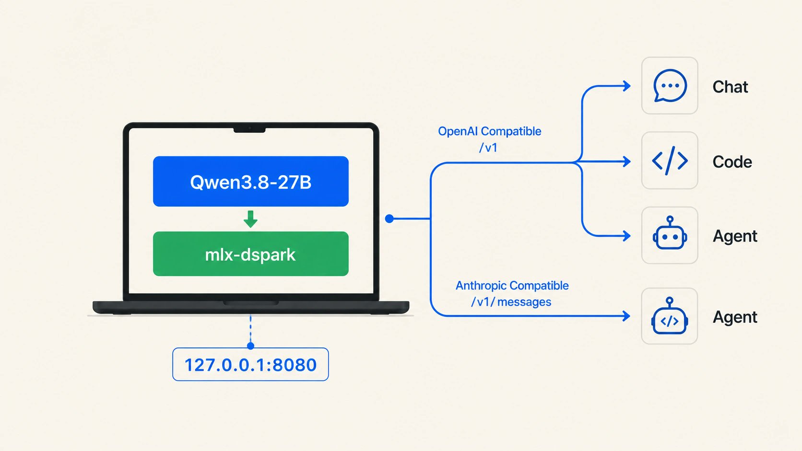

用 curl 做一次对话测试。下面以 4-bit 返回的模型 ID 为例；如果你下载的是 8-bit，请替换成 /v1/models 实际返回的值：

```bash
curl http://127.0.0.1:8080/v1/chat/completions \
  -H "Content-Type: application/json" \
  -d '{
    "model": "Qwen3.8-27B-4bit",
    "messages": [
      {"role": "user", "content": "用三句话解释什么是统一内存。"}
    ],
    "max_tokens": 200
  }'
```

只在本机使用时，127.0.0.1 是最安全省事的选择。有些客户端强制要求填写 API Key，可以填任意占位字符串；未启用鉴权时，本地服务不会验证它。

如果需要局域网访问，才考虑修改监听地址和防火墙。不要把一个没有认证、没有 TLS、没有限流的接口直接暴露到公网。模型运行在本地，不代表服务天然安全。

## 上下文怎么设置，才不会把内存吃爆？

最稳妥的方法不是猜，而是阶梯式增加：

1. 24GB 从 8K 开始，稳定后试 16K。
2. 32GB 从 16K 开始，再试 32K。
3. 48GB / 64GB 从 32K 开始，按任务需要试 64K。
4. 只有确实处理超长文档或大型代码库时，才继续往 128K 增加。

每提高一档，都重复相同测试：固定 Prompt、固定最大输出、记录 TTFT、生成速度、内存峰值和 Swap。

“模型支持 262K”是能力参数，不是默认推荐。对于日常聊天、写作和多数代码任务，16K～32K 已经能覆盖很多场景。

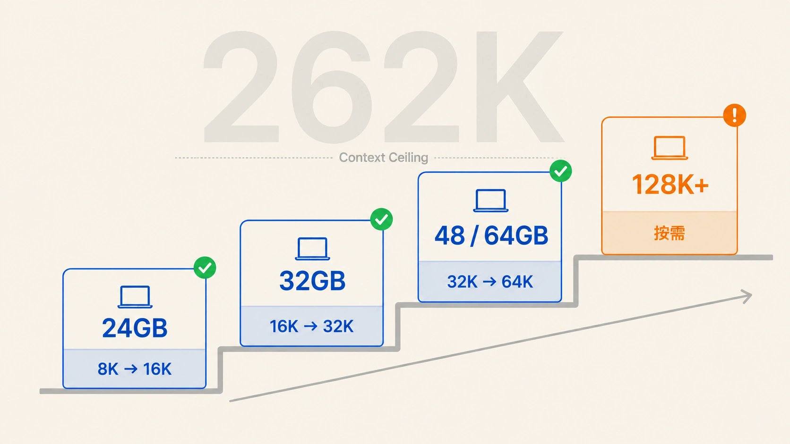

上下文不是越大越聪明；塞入过多无关内容，还可能稀释关键信息，让模型更慢、更贵、更容易跑偏。

如果服务给 Agent 使用，优先保留 Prefix Cache。代码 Agent 的系统提示词和工具定义往往很长，多轮之间复用前缀，可以显著减少重复 Prefill。

## 思考模式怎么选？测试时最容易忽略的变量

Qwen3.8 默认会先思考再回答。复杂代码修改、数学推理、研究分析和多轮 Agent 任务，可以保留默认思考模式；普通聊天、翻译、摘要和格式转换，思考过程往往只会增加等待时间和输出 token。

如果想保留思考，但降低推理深度，使用完整命令：

```bash
mlx-dspark serve \
  --model "$MODEL_DIR" \
  --mode auto \
  --context-window 16384 \
  --reasoning-effort low
```

如果任务非常直接，可以关闭思考：

```bash
mlx-dspark serve \
  --model "$MODEL_DIR" \
  --mode auto \
  --context-window 16384 \
  --no-thinking
```

这两个参数设置的是服务默认行为。支持相关字段的客户端也可以按单次请求覆盖，因此接入工具后还要确认客户端有没有悄悄改回自己的默认值。

这里没有一条适合所有任务的答案。low 单轮看起来更快，却可能因为分析不足导致 Agent 反复重试，整项任务反而更慢。最稳妥的方法还是用完整任务计算总耗时，而不是只比较第一轮回答。

有一条规则必须记住：做 baseline 与 DFlash 2 A/B 时，思考模式要完全一致。一个开启思考、一个关闭思考，token 数和任务路径都变了，算出来的速度没有比较意义。采样参数、Prompt、最大输出长度、上下文和冷/热启动状态同样要保持一致。

## 最短部署路线：把需要输入的命令压缩到一起

前面讲的是每一步为什么这样做。已经理解原理、只想快速复现，可以按下面的顺序执行。示例选择 4-bit 和 8K 上下文，适合 24GB Mac 保守起步；下载与 benchmark 的实际耗时取决于网络和芯片，不包含在“最短”里：

```bash
brew install uv

mkdir -p qwen38-local/models
cd qwen38-local
uv venv .venv
source .venv/bin/activate

uv pip install -U huggingface_hub mlx-dspark

MODEL_DIR="$PWD/models/Qwen3.8-27B-4bit"
hf download mlx-community/Qwen3.8-27B-4bit \
  --local-dir "$MODEL_DIR"

mlx-dspark generate \
  --model "$MODEL_DIR" \
  --mode baseline \
  --prompt "解释统一内存，并给出运行本地大模型时的三条建议。" \
  --max-new-tokens 400

mlx-dspark benchmark \
  --model "$MODEL_DIR" \
  --modes dflash \
  --caps auto \
  --trials 3

mlx-dspark serve \
  --model "$MODEL_DIR" \
  --mode auto \
  --context-window 8192
```

这组命令的目标是“先安全跑通”，不是榨干硬件。跑通以后再按内存余量依次尝试 16K、32K 上下文，或把 4-bit 仓库替换成 8-bit。一次只改一个变量，测试数据才有意义。

服务起来后别急着接第三方客户端，先访问 /health 和 /v1/models。前者确认没有内存警告、实际启用了预期模式，后者确认模型 ID。然后完成一轮 400 token 左右的长回答，观察活动监视器中的内存压力与 Swap。四项都正常，再把 Base URL 填进日常工具。这几分钟检查能排除大多数“客户端连不上”和“跑一会儿整机变卡”的问题。

## 第二天怎么重新启动？

虚拟环境和 MODEL\_DIR 只在当前终端会话里生效。第二天重新打开终端，不需要重新下载或安装，只要回到目录、激活环境并重新声明路径：

```bash
cd qwen38-local
source .venv/bin/activate
MODEL_DIR="$PWD/models/Qwen3.8-27B-4bit"

mlx-dspark serve \
  --model "$MODEL_DIR" \
  --mode auto \
  --context-window 8192
```

升级工具时在虚拟环境内执行：

```bash
uv pip install -U huggingface_hub mlx-dspark
```

升级后先跑一次短 baseline 和 /health，确认模型仍能加载，再恢复长期服务。推理工具更新很快，旧版本能工作的参数不一定永远是最佳参数，所以保留自己的基线记录很有价值。

## 局域网访问：至少先加一把锁

默认的 127.0.0.1 只能由本机访问。如果你想让同一 Wi-Fi 下的另一台 Mac 或 iPad 调用，可以监听所有网卡，同时设置 API Key：

```bash
mlx-dspark serve \
  --model "$MODEL_DIR" \
  --mode auto \
  --context-window 16384 \
  --host 0.0.0.0 \
  --api-key "请替换成一段足够长的随机字符串"
```

客户端把 127.0.0.1 换成这台 Mac 的局域网 IP，并在请求里发送 Authorization: Bearer 你的密钥。同时检查 macOS 防火墙，只允许可信网络访问 8080 端口。

这仍然只是局域网方案。要通过互联网访问，还需要 TLS、反向代理、访问控制和限流，不要在路由器上直接映射 8080。最省心的做法，是通过可信 VPN 回到家庭网络，再访问本地服务。

## 常见问题排查

### 1. 模型加载到一半被系统杀掉

先确认选对量化版本。24GB、32GB 不要误下 8-bit，更不要碰 BF16。关闭 Docker、虚拟机、大量浏览器标签页和其他本地模型，再重试 4-bit。

### 2. 能运行，但整台 Mac 变得很卡

打开活动监视器看 Swap。若 Swap 持续上涨，先缩短上下文，再关闭 DFlash 2。不要只盯着模型进程自己的数字，因为统一内存压力是全系统共同造成的。

### 3. DFlash 2 反而更慢

确认比较条件一致：相同 Prompt、相同输出长度、相同思考模式、同样冷启动或热启动。短回答不适合判断推测解码收益。跑三轮以上，并用真实长任务测试。

如果仍然更慢，说明当前任务接受率低，或者草稿模型带来的额外内存让系统开始 Swap。关掉它不是失败，稳定的 baseline 本来就是有效方案。

### 4. 首 token 很慢，但后面生成还可以

这是 Prefill 瓶颈。检查输入是否太长、是否每轮重复塞入大量无关文件、Prefix Cache 是否命中。对 Agent 来说，优化 Prompt 长度往往比继续追求生成 tok/s 更有效。

### 5. 下载速度很慢或中断

重新运行同一条 hf download 命令即可利用缓存和续传。不要删除未完成目录后从零开始。Hugging Face 访问不稳定时，可考虑官方推荐的 ModelScope 路线。

### 6. 想让它识别图片

这里要区分“模型有视觉能力”和“当前服务支持视觉输入”。上述 MLX 仓库保留了视觉组件，但 mlx-dspark 当前提供的是文本推理服务，发给它的图片内容不会进入模型。

要测试图片，需要暂时绕开 DFlash 2，改用 mlx-vlm：

```bash
uv run python -m mlx_vlm.generate \
  --model "$MODEL_DIR" \
  --max-tokens 200 \
  --temperature 0 \
  --prompt "请描述这张图片。" \
  --image "/绝对路径/example.jpg"
```

视觉输入会增加处理复杂度和内存占用。如果主要用途是代码、写作和 Agent，先把文本链路跑稳，再单独测试视觉任务。

## 一套最不容易翻车的部署顺序

一张执行清单：

1. 确认是 Apple Silicon Mac。
2. 16GB 放弃 27B；24GB/32GB 选 4-bit；48GB/64GB 再考虑 8-bit。
3. 给模型预留足够磁盘空间，使用 uv 创建独立环境。
4. 用 hf download 下载完整仓库，不在浏览器里逐个点权重文件。
5. 先用 --mode baseline 跑固定 Prompt，记录加载、Prefill、TTFT、生成速度和内存。
6. 从 8K、16K 或 32K 上下文起步，不要直接开满 262K。
7. 跑 mlx-dspark benchmark --modes dflash --caps auto --trials 3，让工具按本机校准。
8. 用完全相同的真实任务比较 baseline 与 auto。
9. 只在速度明显提升、内存压力稳定时长期开启 DFlash 2。
10. 最后再启动本地 API，接入代码工具、知识库或 Agent。

本地部署的意义，不只是省 API 费用。

当 Qwen3.8-27B 变成 Mac 上一个随时可调用的本地服务，你可以让敏感代码和文档留在自己的机器上，可以离线处理资料，也可以把它接进自动化任务、个人知识库和长时间运行的 Agent 工作流。

我自己的及格线很简单：常用任务不 Swap，回答速度能忍，第二天还会主动打开它。满足这三条，它才算真正部署成功。

如果你已经跑起来了，欢迎把「芯片型号、统一内存、4/8-bit、上下文长度、baseline 和 DFlash 2 tok/s」留在评论区。数据够多，可以继续整理成一张 Mac 配置实测表。

## 如果你觉得部署还是麻烦

我把这篇文章里涉及的安装命令、模型下载、速度测试、DFlash 2 加速、本地 API 启动和常见问题排查，整理成了一份可以直接照着执行的部署清单：

```text
https://github.com/wdwxw/macRunqwen38_27b_install
```

你可以自己按顺序复制执行，也可以直接把这个 GitHub 仓库交给 Codex 或 Claude Code，让它读取 README.md，检查你的 Mac 配置并按清单完成安装。这样不用反复从长文里找命令，后续更新和排查问题也更方便。

## 往期精彩文章

[Skill 持续升级指南：让 AI 从记住方法走向自动驾驶](https://x.com/ai_suxiaole/status/2094009111973343255)

[让 AI 真正懂你的工作：小白 Skill 制作指南](https://x.com/ai_suxiaole/status/2093220640308285865)

[省Token又快速，新一代的Agent - Pi](https://x.com/ai_suxiaole/status/2092815138785247436)

[百万级 Skill grill-me：从安装到实战](https://x.com/ai_suxiaole/status/2092495559743730005)

[10分钟学会CLAUDE.md: 从入门到精通](https://x.com/ai_suxiaole/status/2092090376899199201)

[海外注册接码验证？手把手教学美国紫卡 PayGo购买/激活/保号全流程](https://x.com/ai_suxiaole/status/2082296820781449243)

[2026 年最强Obsidian保姆级教程，10分钟打造你的第二大脑](https://x.com/ai_suxiaole/status/2080133894222057612)

[别人已经用 WorkBuddy 找工作拿了面试，你还在一份份手工改简历](https://x.com/ai_suxiaole/status/2078000025590731230)

[Workbuddy+微信读书最强联动，再也不怕“假”读书](https://x.com/ai_suxiaole/status/2077225803461566565)

[GPT-5.6 提示词大师课（OpenAI 出品）](https://x.com/ai_suxiaole/status/2076154810387341725)

[WorkBuddy + 好提示词 = 生产力。43 个场景，复制就能用](https://x.com/ai_suxiaole/status/2075425615264505958)

[摸鱼神器：0基础小白5分钟玩转workbuddy 指令教程](https://x.com/ai_suxiaole/status/2074055523024945321)

[WorkBuddy 从 0 到 1：一份让妈妈也能用的 AI 助手教程](https://x.com/ai_suxiaole/status/2072514519990223112)

[5岁小朋友都能看懂的Claude Code/Codex 安装部署指南](https://x.com/ai_suxiaole/status/2071427591211557079)

[你不需要时间管理，95%的人把它当作自己失败的安慰](https://x.com/ai_suxiaole/status/2070382714629591040)

[10年大厂HR告诉我，90%的简历都是没人看的垃圾](https://x.com/ai_suxiaole/status/2069669311187423691)

[普通人做小红书电商，从0-100万只需这5步（附2026最新教程）](https://x.com/ai_suxiaole/status/2066770808446619705)

[Claude Cowork 小白完整教程：12 个真实场景，不需要写一行代码](https://x.com/ai_suxiaole/status/2064234237788926039)

[10分钟学会CLAUDE.md: 从入门到精通](https://x.com/ai_suxiaole/status/2092090376899199201)

[海外注册接码验证？手把手教学美国紫卡 PayGo购买/激活/保号全流程](https://x.com/ai_suxiaole/status/2082296820781449243)

[2026 年最强Obsidian保姆级教程，10分钟打造你的第二大脑](https://x.com/ai_suxiaole/status/2080133894222057612)

[别人已经用 WorkBuddy 找工作拿了面试，你还在一份份手工改简历](https://x.com/ai_suxiaole/status/2078000025590731230)

[Workbuddy+微信读书最强联动，再也不怕“假”读书](https://x.com/ai_suxiaole/status/2077225803461566565)

[GPT-5.6 提示词大师课（OpenAI 出品）](https://x.com/ai_suxiaole/status/2076154810387341725)

[WorkBuddy + 好提示词 = 生产力。43 个场景，复制就能用](https://x.com/ai_suxiaole/status/2075425615264505958)

[摸鱼神器：0基础小白5分钟玩转workbuddy 指令教程](https://x.com/ai_suxiaole/status/2074055523024945321)

[WorkBuddy 从 0 到 1：一份让妈妈也能用的 AI 助手教程](https://x.com/ai_suxiaole/status/2072514519990223112)

[5岁小朋友都能看懂的Claude Code/Codex 安装部署指南](https://x.com/ai_suxiaole/status/2071427591211557079)

[你不需要时间管理，95%的人把它当作自己失败的安慰](https://x.com/ai_suxiaole/status/2070382714629591040)

[10年大厂HR告诉我，90%的简历都是没人看的垃圾](https://x.com/ai_suxiaole/status/2069669311187423691)

[普通人做小红书电商，从0-100万只需这5步（附2026最新教程）](https://x.com/ai_suxiaole/status/2066770808446619705)

[Claude Cowork 小白完整教程：12 个真实场景，不需要写一行代码](https://x.com/ai_suxiaole/status/2064234237788926039)

我是苏乐 [@ai\_suxiaole](https://x.com/@ai_suxiaole) XWise 插件作者，长期实践 AI，分享 AI 工具、赚钱案例、效率技巧和真实生活思考。关注我，一起把 AI 用到生活和工作里。
