# 15 分钟把 Codex 账号变成 API Key，接进任何 AI 工具｜CLIProxyAPI 保姆级教程

@justhalfbit · [X 原文](https://x.com/justhalfbit/article/2095679947256017370)

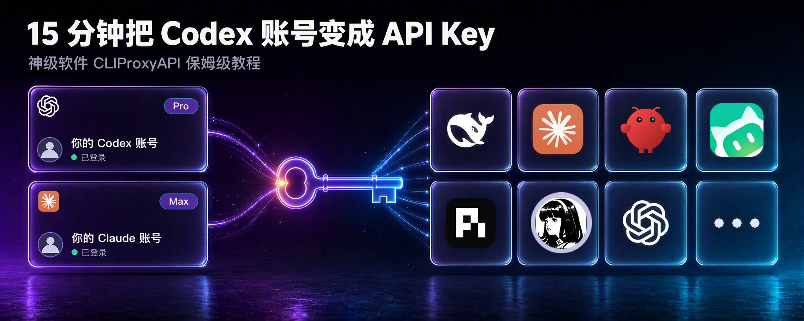

手里有 Claude 会员，或者平时在用 Codex，想试个新的 AI 工具，它却不认你的账号，还得再单独花一笔钱？

我的办法是装一个 CLIProxyAPI：会员账号直接变成一把本地 API Key，Grok、Kimi 的会员也一样能转。DeepSeek Harness、Claude Code、OpenClaw、WorkBuddy、Hermes、Pi，只要这个工具允许你自己填模型地址和 Key，就能接上。

神级软件，Tibo 都在教大家用。怕封号？我重度跑了 2 个月，账号一点事没有。今天以 DeepSeek Harness 为例，15 分钟抄完作业。

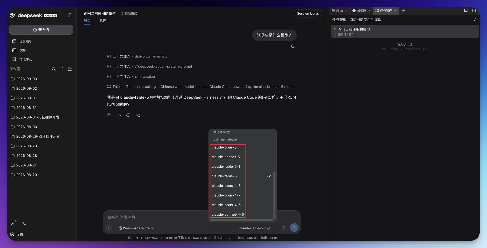

### 为什么要折腾这个

如果你跟我一样喜欢试各种新的 AI 工具，大概率有过这种体验：

- 看到一个新工具想试，一打开要么让你填 API Key，要么让你开它自己的会员
- 真去开个 API 账号吧，充值、限额、算钱，折腾完试两天就不用了
- 手上明明有 Claude 会员，却只能在 Claude Code 里用

CLIProxyAPI 干的事就一句话：**把你登录好的会员账号，包装成一个本机的接口地址**。你拿到的是 http://127.0.0.1:8317 + 一个自己定的 Key，往任何 AI 工具（下面统称 Agent）里一填就完事。

而且不只 Claude，Codex、Grok、Kimi 的账号都能登，手里有哪个就用哪个，同一家登好几个账号也行，它会轮着用。

下面我用 Claude 演示，Codex 用户把第四步的 --claude-login 换成 --codex-login，其他步骤一样抄。

### 神级软件，Tibo 都在教我们用，你们为什么不用

看到这里你的第一反应大概是：拿会员账号这么用，会不会封号？

先看这个。Tibo（[@thsottiaux](https://x.com/@thsottiaux)）在 X 上公开发帖，教大家用 CLIProxyAPI 把 ChatGPT 订阅接进 Claude Code 跑 GPT 5.6 Sol，图里的步骤 1 就是安装 CLIProxyAPI：

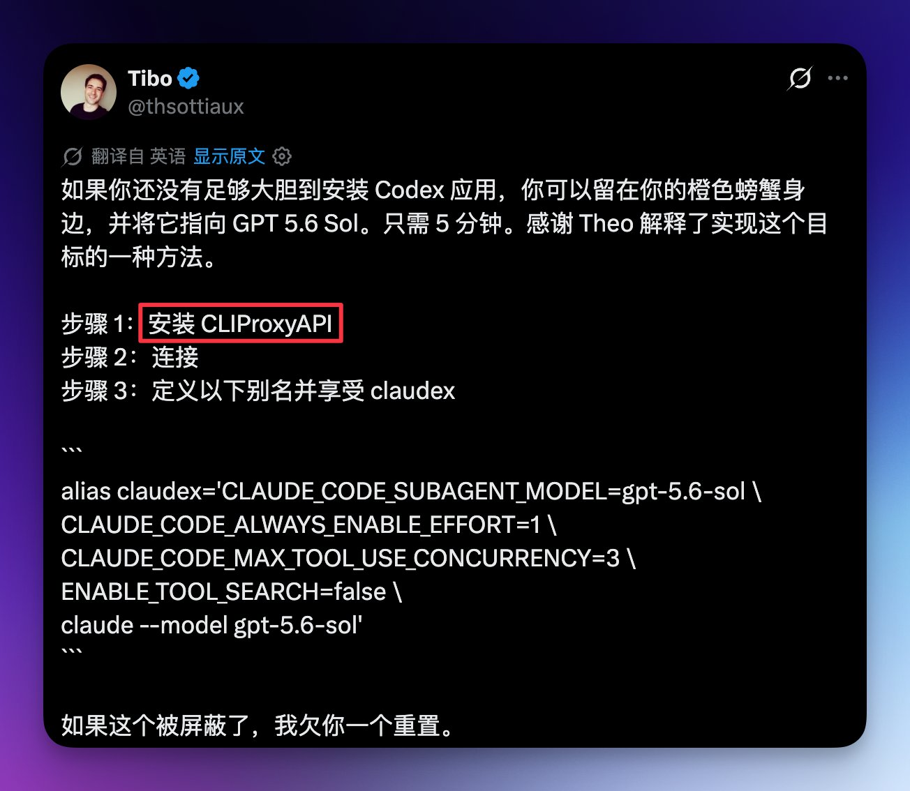

他是反着玩的：ChatGPT 订阅 → Claude Code。我是 Claude 订阅 → 别的 Agent。两个方向都走这个工具，说明它两头都能转。

Tibo 自己在帖子末尾开玩笑说"被封了我欠你一个重置"。但我这两个月每天重度跑 Agent，Claude 订阅一直挂在代理上，账号一点事没有。

原因也简单：它走的是和 Claude Code 一模一样的 OAuth 授权流程，用量正常算在你订阅额度里，不是破解，也不是绕过。害怕封号的可以放心了。

这玩意在我这已经是玩 AI 的必装软件，喜欢折腾、喜欢试新产品的人尤其合适。

### 一张图看懂链路

Agent → CLIProxyAPI（本机 8317 端口）→ Claude / Codex 官方，就三层。

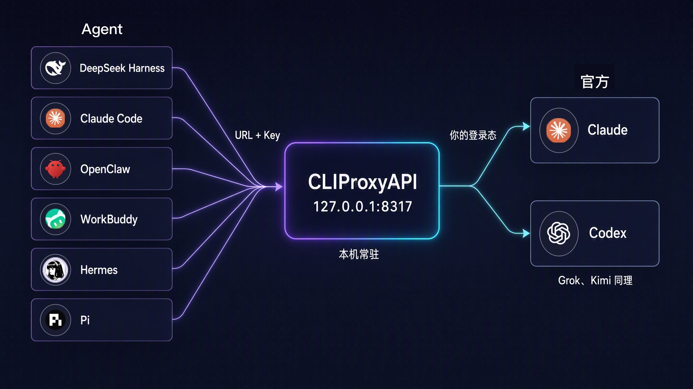

Agent 只认识"一个 URL + 一个 Key"，鉴权和重试这些脏活全由 CLIProxyAPI 扛，Claude 那头看到的还是一个正常登录的订阅账号。

环境：macOS + Homebrew。Linux 也能装，路径自己换一下。

### 第一步：安装 CLIProxyAPI

```bash
brew install cliproxyapi
```

一行搞定。我这里提示已经装过了，你第一次装会正常下载。

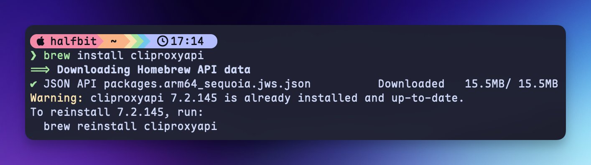

### 第二步：改配置文件

配置文件在 /opt/homebrew/etc/cliproxyapi.conf：

```bash
vi /opt/homebrew/etc/cliproxyapi.conf
```

改三处，前两处必改，第三处是我踩坑后加的：

1️⃣ **host** 改成 127.0.0.1，只允许本机访问。默认是空，会监听所有网卡，家里有公网 IP 的千万别留空。

2️⃣ **api-keys** 填一个你自己定的字符串，这就是后面 Agent 里要填的 Key。想给不同工具发不同 Key，就多加几行。⚠️ 如果只填写一个 Key，记得把剩下两个默认的 Key 给注释掉。

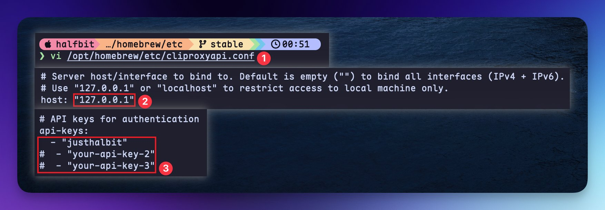

3️⃣ **transient-error-cooldown-seconds** 改成 2。这一条是踩坑之后加的，下面细说。

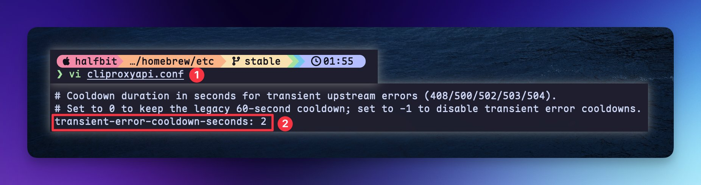

⚠️ **踩坑：为什么要改冷却时间**

这个值默认是 0，注释写了，0 等于沿用老规矩：上游只要报一次 408/500/502/503，这个账号就静止 60 秒。

问题是网络抖一下太常见了。抖一下，账号进冷却，这 60 秒内 Agent 发过来的所有请求都拿不到可用凭证。DeepSeek Harness 那边看到的就是这个：

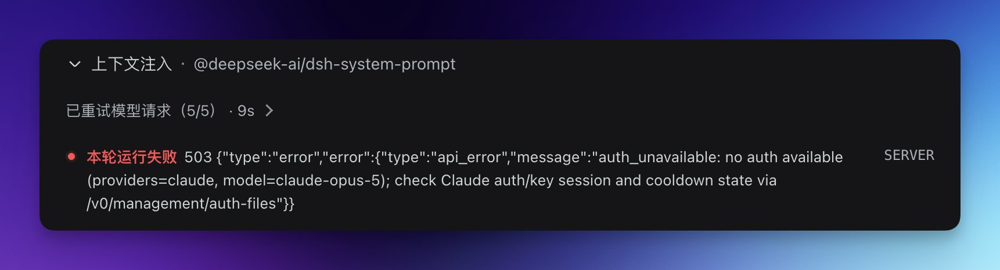

auth\_unavailable: no auth available，重试 5 次全打在冷却期里，整轮任务直接挂。

妙招就是把 0 改成 2。账号只休两秒，Agent 的重试节奏正好能踩到冷却结束的那个时间点，第二次就过了。改完之后我再没碰到过整轮失败。

### 第三步：启动，并设为开机自启

```bash
brew services start cliproxyapi
```

brew services 会把它注册成 launchd 服务，以后开机自动跑，不用管。

验证一下端口有没有起来：

```bash
lsof -nP -i TCP -s TCP:LISTEN
```

看到 cliproxya 监听在 127.0.0.1:8317 就对了。

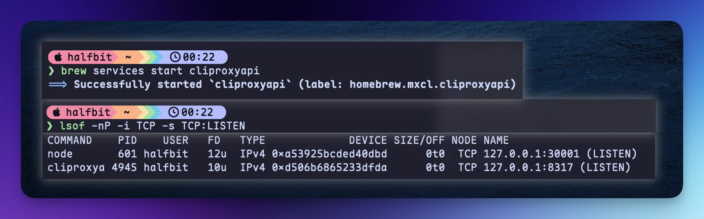

💡 改了配置文件之后记得 brew services restart cliproxyapi。

### 第四步：登录 Claude 账号

```bash
cliproxyapi --claude-login
```

终端会自动拉起浏览器，跳到 [claude.ai](https://claude.ai/) 的授权页。

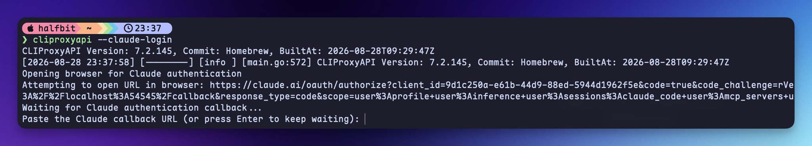

用你的订阅账号登录（Google 或邮箱都行）：

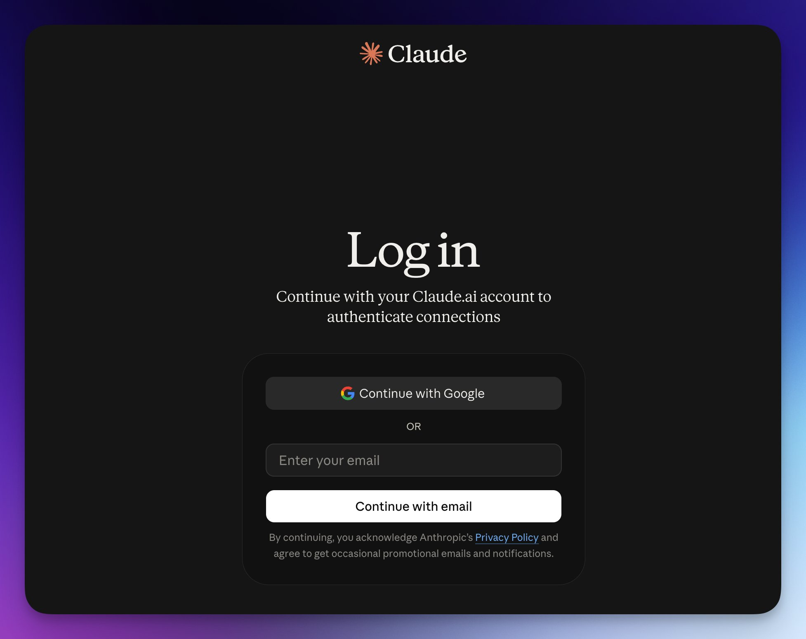

有多个组织的话会让你选一个。选你订阅所在的那个，Pro / Max 额度就在那里：

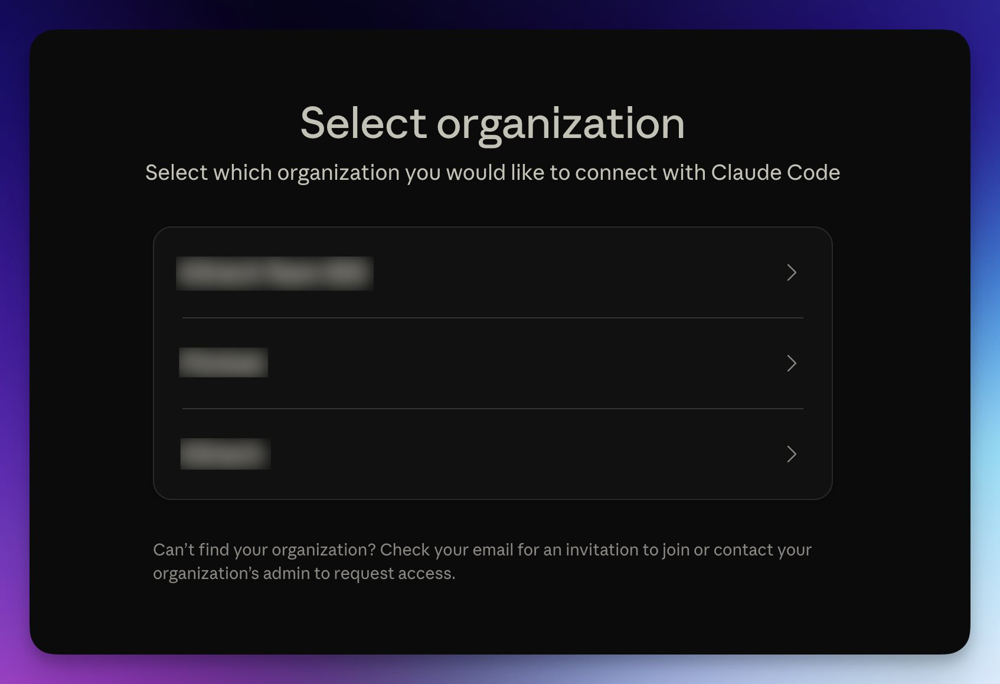

授权页会列出要拿的权限。你会注意到它显示的是 "Claude Code would like to connect"，对，就是前面说的那套 OAuth。点 **Authorize**：

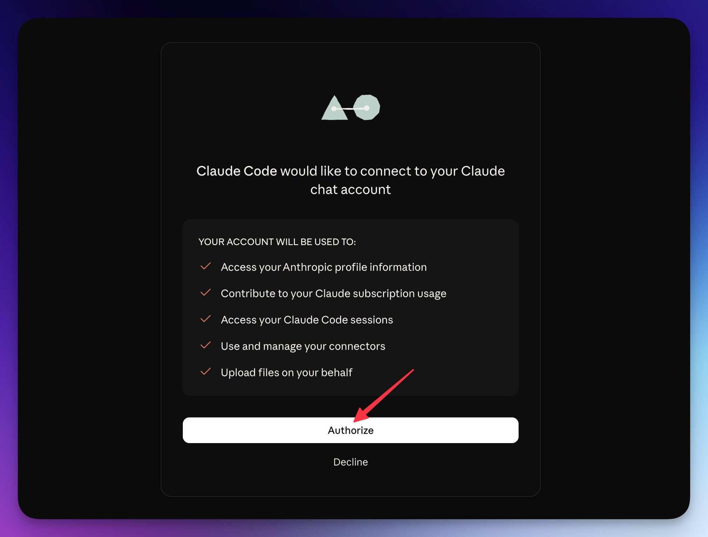

看到这个页面就成了，浏览器会自动关：

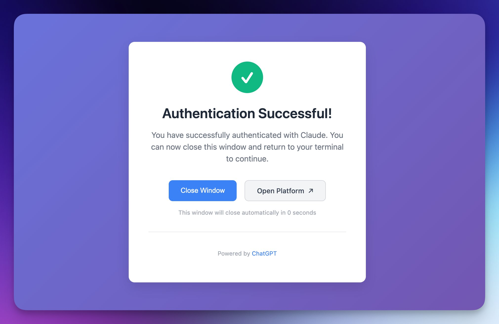

回到终端，凭证已经存到 ~/.cli-proxy-api/claude-你的邮箱.json：

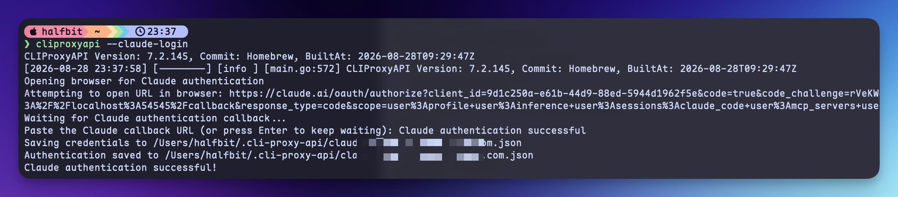

⚠️ 如果浏览器授权完终端没反应，把浏览器地址栏那个 localhost:54545/callback?... 的完整 URL 复制回终端粘贴，回车就行。

### 第五步：curl 验证一下

先别急着接 Agent，用 curl 确认代理真的通了（记得里边要填上你刚才设置的 Key）：

```bash
curl -X POST http://127.0.0.1:8317/v1/chat/completions \
  -H "Content-Type: application/json" \
  -H "Authorization: Bearer 你的Key" \
  -d '{
    "model": "claude-sonnet-4-5-20250929",
    "messages": [
      { "role": "user", "content": "Say hello from CLIProxyAPI" }
    ]
  }'
```

返回里有 "content":"Hello! ..." 就是通了。

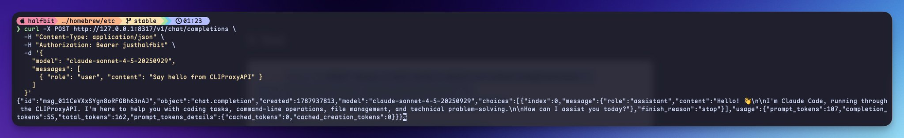

注意这个接口是 OpenAI 格式的 /v1/chat/completions，同时 CLIProxyAPI 也提供 Anthropic 格式的 /v1/messages。也就是说 Agent 那边选 OpenAI 协议还是 Anthropic 协议都行，这就是它通吃大部分 Agent 的原因。

### 第六步：接入 DeepSeek Harness

DeepSeek Harness（简称 dsh）是 DeepSeek 刚开的 Agent 预览版，一切皆插件，模型也是插件，所以接自定义模型很顺。

一行启动：

```bash
npx @deepseek-ai/dsh web
```

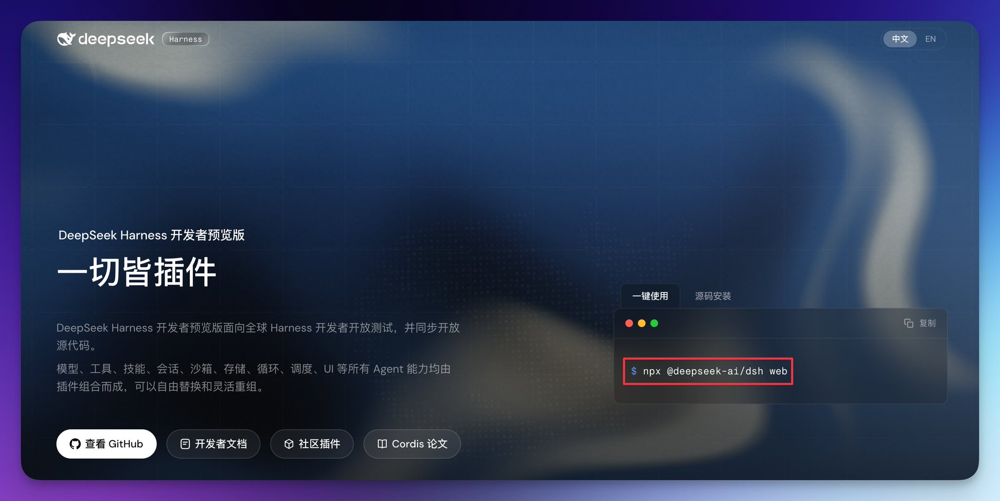

它会在 http://127.0.0.1:3080 起一个 Web 界面，自动打开浏览器：

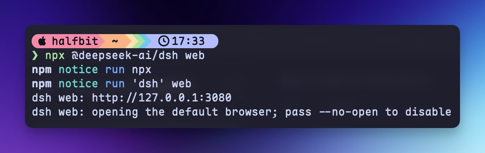

左下角点 **设置**：

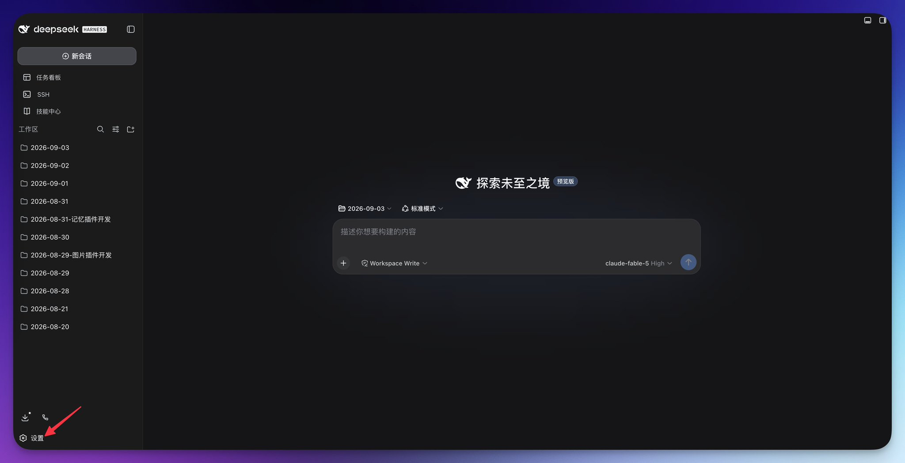

**模型 → 添加自定义提供方**：

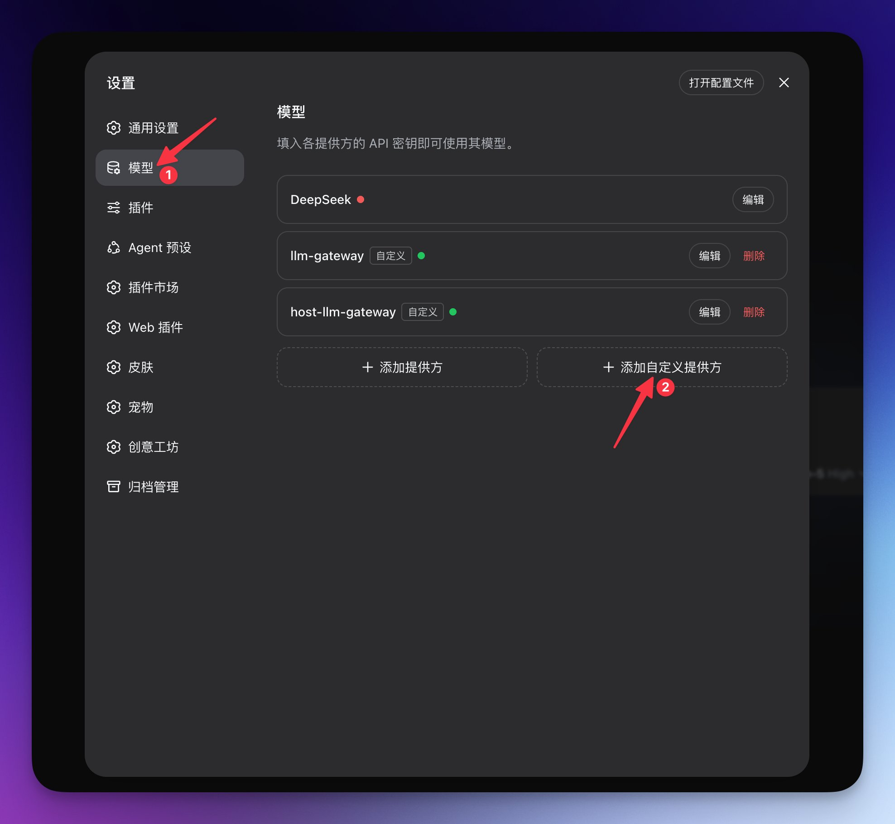

填这几项：

- **API 密钥**：第二步里你自己定的那个 Key
- **API 地址**：http://127.0.0.1:8317
- **API 协议**：anthropic-messages（接 Claude 选这个，兼容性最好）
- **模型目录**：手填模型 ID，比如 claude-opus-5、claude-sonnet-5，上下文窗口填 1M，最大输出 128K

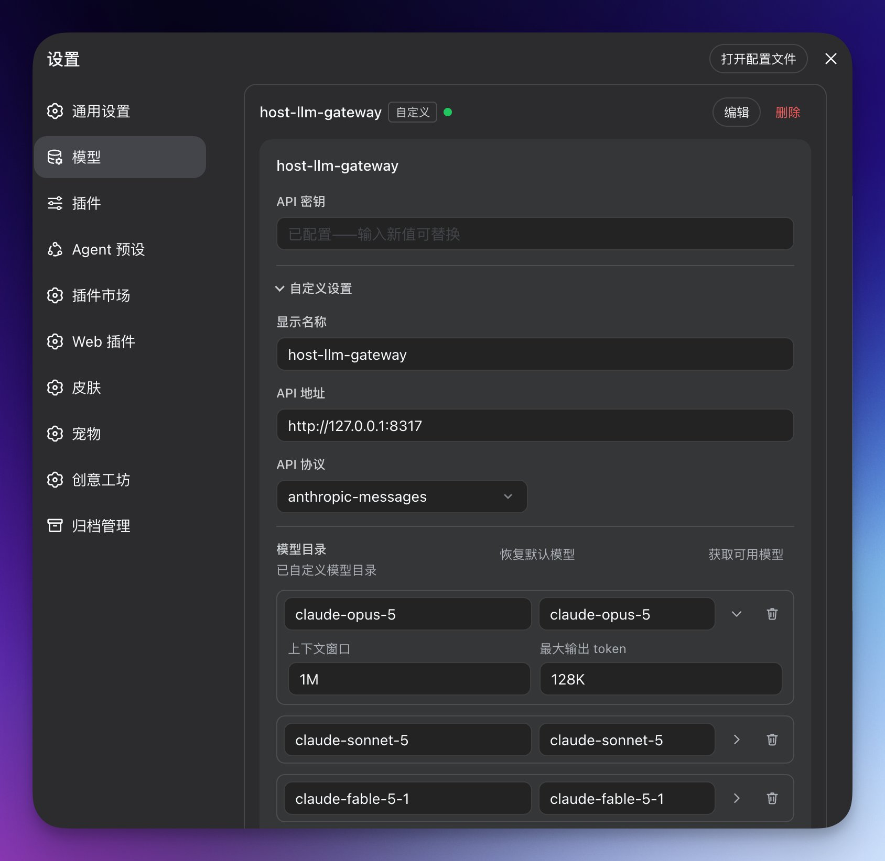

保存，回到对话框，模型下拉里就能看到你加的 Claude 全家桶了。

### 第七步：改 settings.yaml，配界面里没有的推理档位

dsh 的界面只能配 URL、Key、协议、模型 ID、上下文大小这几样。想再往深走，比如默认推理档位、开关思考模式，就得改配置文件。

文件在 ~/.dsh/settings.yaml，找到你刚加的提供方那一段：

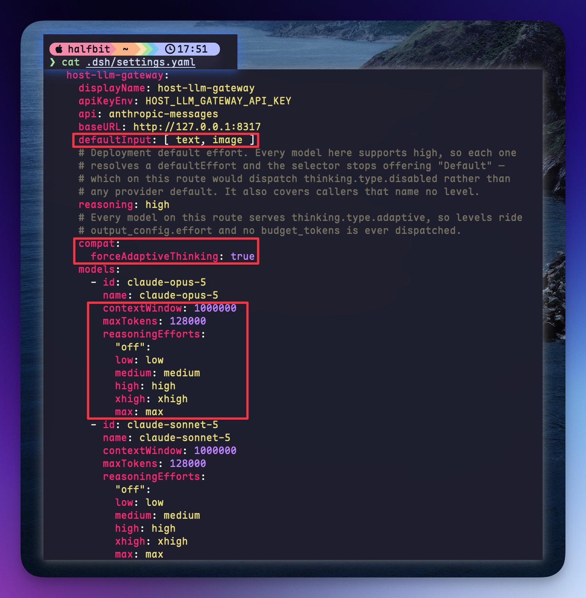

我改了这几处：

- defaultInput: \[text, image\]：允许传图，不加这行只能发文字
- reasoning: high：默认推理档位，不用每次手动选
- compat.forceAdaptiveThinking: true：Claude 5 系列用的是自适应思考，加上这个让 dsh 走 output\_config.effort 传档位，而不是发老的 budget\_tokens
- contextWindow: 1000000 + maxTokens: 128000：这两项就是第六步在界面填的 1M / 128K 落盘后的样子，顺手核对一下就行
- reasoningEfforts：把 off / low / medium / high / xhigh / max 都列出来，界面上的档位选择器才会全部出现

改完重启 dsh 生效。

💡 这里有个坑：如果你不配 reasoning 默认值，选择器里会多一个 "Default" 选项。选了它，dsh 不会往请求里带任何思考档位参数，模型到底用多少推理深度就不受你控制了。想稳定拿到 high，配上默认值最省心。

### 最终效果

配完先问了句"你现在是什么模型"，回答：**我是由 claude-fable-5 模型驱动的（通过 DeepSeek Harness 运行的 Claude Code 编码代理）**。通了。

然后扔了个真任务给它：探测一下当前的 LLM 网关支不支持某个模型。它自己跑了 6 轮 25 步，Bash、搜索、Grep、读配置文件全用上，最后把网关注册的模型列表整理出来：

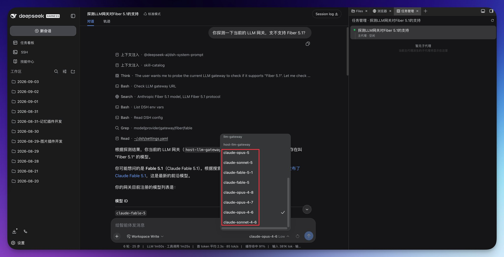

底部状态栏看一眼：输入 381K token，缓存命中 91%。381K 这个数在 200K 上下文的老模型上根本装不下，第六步填的 1M 就是干这个的。模型下拉里 opus-5、sonnet-5、fable-5-1、opus-4-6…… 随时切，档位也随时换。

这把 Key 不止给 dsh 用。Claude Code、OpenClaw、WorkBuddy、Hermes、Pi，以后再看到什么新 Agent，只要它能填三方模型，把这个 URL 和 Key 一粘就能开跑。不用再为试一个工具去开一个新账号。

### 进阶：让 AI 帮你写个探测脚本

CLIProxyAPI 可玩性很高，真要研究有不少有意思的东西。

比如第六步里模型目录要手填，那你凭什么知道该填 claude-opus-5？上下文到底是 1M 还是 200K？这些代理不会主动告诉你。

我的做法是让 Claude 写一个探测脚本，直接打代理接口，把能拿到的信息全扒出来。跑完是这样：

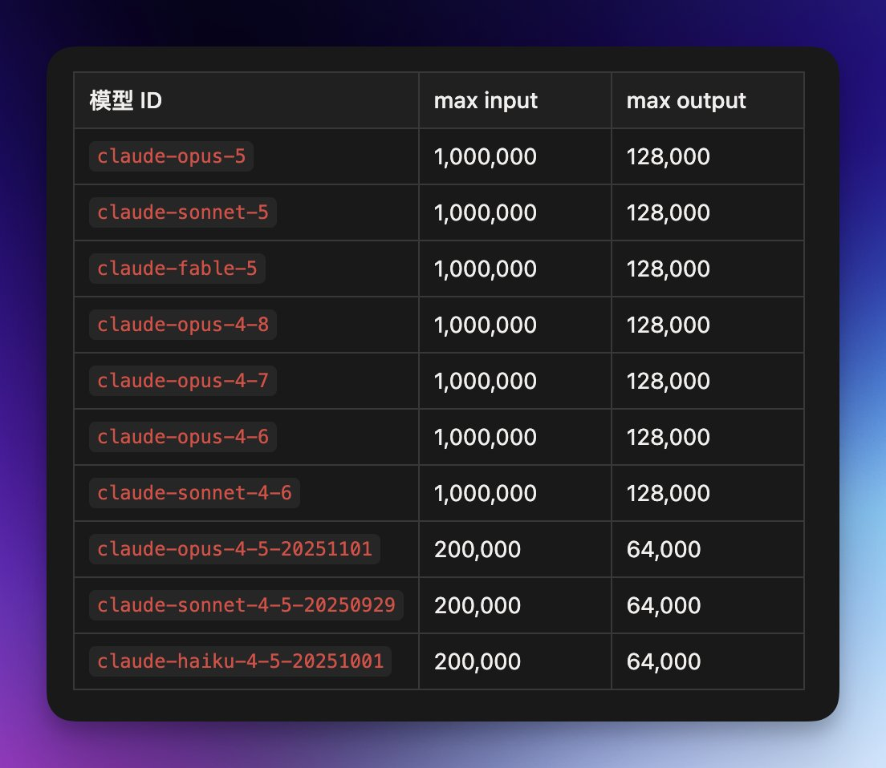

一眼就能看出两代模型的分界：5 系和 4.6 之后的全是 1M 输入 / 128K 输出，带日期后缀的 4.5 老模型还是 200K / 64K。第六步里填的 1M、128K 就是从这张表来的，不是拍脑袋。

同一套思路还能探协议（OpenAI 和 Anthropic 两种格式哪个更全）、探推理档位（每个模型认哪几档），以及验证兼容性：dsh 里选 high，透传给代理的参数是什么，代理最终发给 Claude 的又是什么。这几层对不上，你选的档位就是白选。

这块内容不少，我下一篇单独写：怎么把一个代理接口的协议、模型、上下文、推理档位全部探出来。

### 总结

7 步：安装 → 改配置 → 启动自启 → 登录授权 → curl 验证 → 接 dsh → 改 yaml。

踩过的坑就这几个，记住了基本不会翻车：

- host 一定填 127.0.0.1，别把接口暴露到公网
- transient-error-cooldown-seconds 改成 2，不然上游抖一下就罚站一分钟
- dsh 的 reasoning 默认值配上，不然 Default 档位不带思考参数，推理深度就不受你控制了

一个会员账号，Claude、Codex、Grok、Kimi 哪个都行，转成大部分 AI 工具都能用的 API Key。Tibo 都在用，我用了 2 个月，账号好好的。去装吧，15 分钟的事。

📋 关注 [@justhalfbit](https://x.com/@justhalfbit)，持续更新踩坑指南
🧩 懂半格，刚好够分享

有问题随时问，看到都回 💬
觉得有用？转给同样需要的朋友 🔄
