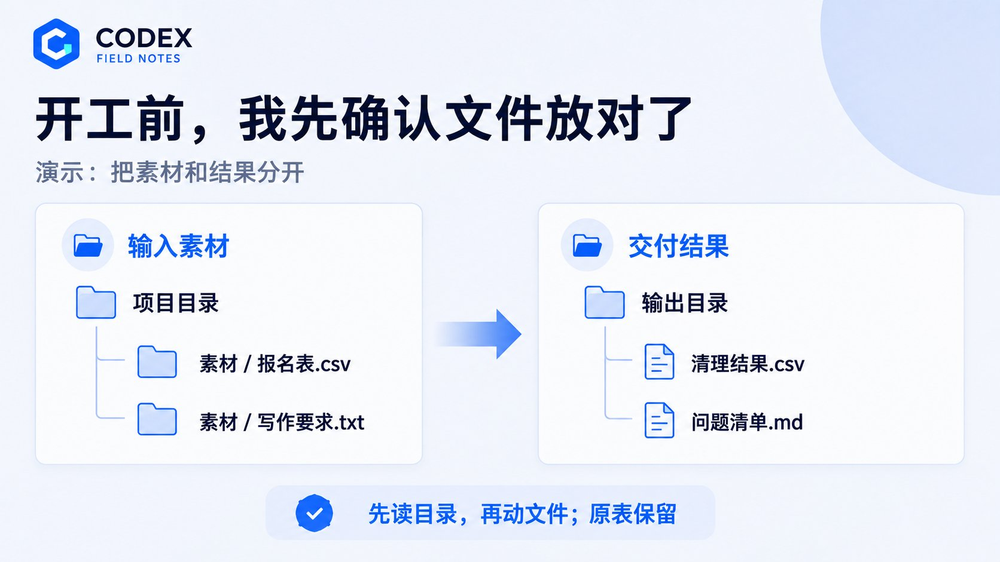
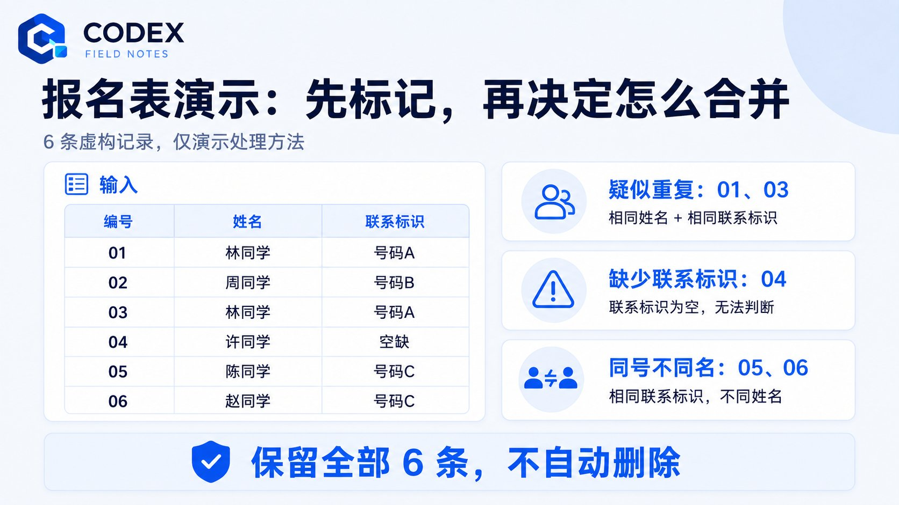
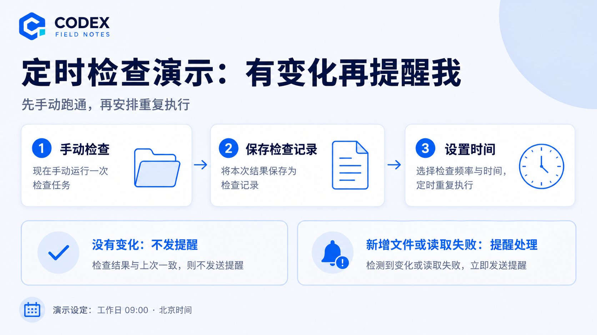

# 6000字长文｜Codex 6 入门指南：16个必备技巧，节省90%的Token

@goan999999 · [X 原文](https://x.com/goan999999/article/2095819685707346262)


用 Codex 6 时，最怕的是看它忙了半天，拿到结果以后，我还得从头检查、重新整理。

比如我只想调一下排版，它却连配色一起换了。我要的是一篇能发的文章，它交来的文字像产品说明。

文件生成了，我还得打开看看，图表有没有挤在一起。没处理好的地方，还是得接着改。

所以我更关心一个朴素的问题：怎么把任务交代清楚，让它做出我能接着用的结果？

我把这些做法整理成 16 个技巧，穿插几段可以照着操作的演示。写代码、整理资料、改文章，都有用得上的地方。

❗️演示里的报名记录、文件名和页面尺寸是示例，你可以换成自己的材料。


### 01｜先更新，再找按钮，别拿旧截图和新界面较劲

打开后，我先确认自己用的是什么：桌面应用、编辑器里的扩展，还是终端里的 Codex CLI。这几个入口能做的事有重叠，按钮位置和操作方式却不完全一样。

如果教程里的菜单找不到，我会先检查应用更新和账号当前能用的功能。跟着旧截图改配置，尤其是把别人整份配置文件复制过来，容易把对方的模型、路径和权限一起带进自己的环境。

需要升级时，我会这样交代：

先识别我正在使用的 Codex 入口、当前版本和安装方式。按原来的安装渠道检查最新稳定版，保留现有配置。更新完成后，告诉我实际版本，以及哪些功能在当前环境可以使用。

我会先选稳定版。手头有任务要做的时候，我不想把时间花在预览版本的兼容问题上。

模型也一样。我会先用当前可选列表里的默认项，复杂任务再比较能力和耗时。换个按钮文案，不值得为了“最强模型”先折腾半小时。

### 02｜先看目录，别改错文件

电脑里同时有“项目”“项目备份”“项目最终版”，这种目录命名实在太常见了。

开工之前，我会让 Codex 报一下当前路径。如果是代码项目，再确认分支和未提交修改；如果是文章或资料任务，就确认它读到的素材是不是这一批。

先查看当前工作目录，告诉我你找到哪些主要文件、哪些是输入素材，以及结果准备存在哪里。暂时不要修改。遇到同名文件或多个版本，先把区别列出来。

写长文时，我会把资料和成稿分开放。参考文章、截图、访谈记录放进素材目录，交付文件另存到输出目录。代码项目则尽量沿用原有结构。

我不想等文章写完，才发现它读的是上个月那份旧提纲。

我会这样开始一个新任务

假设文件夹里有报名表和写作要求，我先把这个文件夹交给 Codex，再输入：

先检查目录。告诉我报名表和写作要求分别在哪里，准备把结果存到哪里。现在只读取，不改文件。

我会看它回复的路径。如果它找到了两份报名表，就补一句“使用素材目录里的那份，备份目录先不读”。确认后再发出整理指令。

这一步的交付很小：明确读哪份文件、写到哪里。先确认这一点，后面的提示词才有意义。



### 03｜把四件事说清楚

“帮我优化一下”这句话，我会尽量少用。优化到什么程度、给谁看、哪些东西要保留，都没有说清楚。

我交代稍微复杂一点的任务，会补齐目标、材料、限制和完成标准。中文就行，不必为了显得专业改成英文。

比如我要整理一份活动报名表，会这样写：

```plaintext
把这份报名表整理成能交给活动执行人员使用的版本。读取我提供的表格，以手机号识别疑似重复报名，但先标记，不直接删掉。保留原表，另存清理结果和问题清单。完成后检查总人数、缺失联系方式和重复记录，说明每一类怎么处理。
```

“整理一下表格”和这段话，差的就是交付要求。后者让它知道什么能直接做，什么需要留给我判断。

演示：遇到重复报名，我会怎么追问

我用六条虚构记录演示。01 和 03 都是林同学，联系标识都是号码 A；04 没填联系标识；05 和 06 的名字不同，却填了同一个号码 C。其余一条是周同学，号码 B。



第一轮，我只让它找问题：

检查这六条记录。保留原始编号，标记疑似重复、缺少联系标识、同号不同名。不要删除，也不要把同一个号码直接当作同一个人。

如果它准备把 05 和 06 合并，我就补充：

05 和 06 可能是两个人共用一个联系方式。保留两条，并注明需要人工确认。01 和 03 也先标成疑似重复，等我确认后再处理。

这份示例里，我希望看到的结果是：六条都保留，01、03 标为疑似重复，04 标为联系标识缺失，05、06 标为同号不同名。周同学那条不需要问题标记。

我验收时先数记录，再看标签。表格看起来再整齐，少了一条报名记录也不算做好。

写文章时，我也会补上读者是谁、篇幅大概多长、哪些事实必须保留，以及有没有不能编的经历。尤其是第一人称文章，不能一句“写得真实一点”，就让它给我添一段不存在的创业故事。

### 04｜没想清楚，先开 Plan

如果只是改个错别字，我会直接让它改。

但要做一个新页面、调整整篇文章结构，或者排查一个不知道原因的报错，我会先用 Plan。支持的入口可以输入 /plan；也可以直接说“先分析和规划，暂时不要动文件”。

我会让计划回答几个具体问题：它理解的结果是什么，需要查看哪些材料，哪一步最容易出错，还有什么关键问题没确定。

先读材料，给我两种可行方案，解释各自需要改动什么。重点指出你还不能确认的地方。计划控制在我能快速看完的长度，暂时不要执行。

我会警惕一种计划：写得很长，换个项目名称也能照用。它如果没提到我的文件、页面或内容，说明还没有把任务看明白。

计划确定后，再明确说“按这个方案执行”。我不需要让一个按钮改色任务也开成需求评审会。


### 05｜能圈出来，就发图

“上面那块有点大”“右边那个按钮不太对”，对着屏幕说的时候很好理解，放进聊天框就容易产生歧义。

我会把截图一起发过去，圈出要改的区域，再补一句具体要求。比如标题保留两行、图片按原比例显示、按钮与正文左边缘对齐。

有 Appshots 的 macOS 桌面入口，可以把当前应用窗口和可读取的文字一起带进任务。默认快捷键涉及同时按下左右两个 Command 键，自己改过快捷键的话就按实际设置来。普通截图也足够解决很多问题。

我会这样提要求：

看我圈出的这组卡片。标题与图片之间留白太大，请缩小这段间距，保留字体、颜色和卡片顺序。改完给我同一位置的预览，方便比较。

如果浏览器预览支持元素标注，我会直接点对应元素。反馈越靠近具体位置，我越容易确认它有没有改对。

截图主要负责告诉它“我看到什么”。涉及网页交互、文件内容或应用操作，还需要相应工具和访问权限。

演示：把“这个页面不好看”改成能执行的要求

假设我要改一张文章卡片：标题太长，封面图变形，按钮还挤出了边界。我会附上截图，并让它查看对应项目文件。

只调整这张文章卡片。标题最多显示两行，超出部分用省略号；封面保持 16:9，并说明是否会裁切；按钮留在卡片内。保留当前配色、文案和链接。请在 390px 宽的手机视口下检查。


如果裁切后封面上的字没了，我会继续补充：

这张封面里的文字必须完整。请改为完整显示图片，允许留白，卡片外框的比例保持不变。

验收时，我会打开页面缩到目标宽度，看标题行数、图片里的文字和按钮位置，再点一下链接。截图能告诉我排版，点击才能确认链接有没有被改坏。

### 06｜发现方向偏了，我会在它工作时插一句

我不会为了等一个完整结果，眼看着它沿着错误方向继续做。

桌面任务运行时可以补充消息。发现它准备换掉整套配色，我就直接说清楚接下来怎么改：

保留已经完成的排版调整。配色继续沿用原方案，接下来只修复小屏幕上的文字换行。请检查刚才有没有改动颜色，有的话只撤回这一部分。

这里我会把“保留什么”和“撤回什么”一起说。只发一句“不要这样改”，它还得猜我反对的是哪一步。

还有一种消息，我会明确放到后面执行：

当前修改做完并检查后，再整理一份交付说明。现在先完成页面。

界面提供即时补充和排队选项时，我就按当前需要选择。前一种是在改当前方向，后一种是在安排后续工作。选错了，原本只是补个说明，也可能打断正在处理的任务。

### 07｜多步骤任务，我会用 Goal 写清终点

我不喜欢每隔一会儿就发一次“继续”。

任务确实需要多步完成，而且我知道最终要什么时，会用 /goal。目标要写到它能判断是否完成，不能只写“把网站做好”。

例如：

/goal 把这个作品集页面做到可以本地验收。完成首页和项目详情页，使用我提供的文案与图片。桌面和手机布局都要检查，导航可以跳转，所有图片正常加载。最后交付启动方法、页面预览和未完成项。做到这些就停止。

我会区分“继续尝试就能解决的问题”和“缺少我的决定”。某张图加载失败，可以继续排查；主视觉要选哪张，而我还没给素材，就需要把缺口告诉我。

Goal 不会凭空增加权限，也不能保证机器休眠、网络断开后任务仍然照常运行。本地长任务开始前，我会确认运行环境能保持可用。

### 08｜同一件事接着聊，关键决定留文件

同一篇文章的提纲、初稿、修改意见，我会留在同一个任务里。这样我说“把第二版那个例子放回来”，还有上下文可接。

话题换了，我就新建任务。把论文整理、网页改版和周报写作混在一起，后面自己找记录也费劲。

但我不会把长期约定只留在聊天里。一个阶段结束时，我会要求：

把已经确定的要求、当前文件位置、完成的部分和下一步写进项目记录。只记录最终决定，已经放弃的方案除非影响后续判断，否则不展开。

以后换任务，我可以让它先读这份记录。有关品牌语气、文章读者、输出规格的要求，也能继续沿用。

长对话有助于延续工作，却不等于每个细节都会永久、完整地保留。需要反复依赖的信息，我更愿意放到自己看得见、改得了的文件中。

### 09｜总在重复的要求，我会写进 AGENTS.md

“正文用中文”“别改原始数据”“结果另存”“没验证的地方要说出来”，如果这些要求一直重复出现，我会把它们写成项目规则。

AGENTS.md 就适合放这种说明。它可以告诉 Codex 这个项目怎么工作，而不必每次重新交代。

内容项目里，我会写得很具体：

读者是刚接触 AI 工具的人。正文用简体中文，第一次出现的必要术语要解释。没有材料支持的数字、亲身经历和引语不补写。参考素材保留原文件，成稿另存。图片使用同一套配色和比例。

代码项目还可以补充实际使用的启动和检查命令。我会先让它查看项目配置，确认命令存在，再写进去。把网上常见的 npm test 抄进一个根本没有测试脚本的项目，只会制造新问题。

规则也要定期删。已经不用的技术栈、过时的目录、互相打架的要求，留着只会让后面的任务更难理解。

### 10｜Skill 我会按工作选，少装一点也没关系

我对“必装几十个 Skill”这种清单没什么兴趣。真正用得到的流程，才值得留下。

项目规则写的是这份工作有哪些约定；Skill 可以把一类任务的做法保存下来，例如处理 PDF、制作表格、审查代码，或者修改中文文章。

拿这篇文章来说，我会让三个写作 Skill 分工。humanizer-zh 看中文句子是否自然，qu-ai-wei 检查空话和未经支持的细节，stop-slop 再删掉重复铺垫与口号式收尾。

我不会让它们各自把整篇文章推倒重写。多轮打磨最容易出的问题，是文字越来越顺，原来的意思却一点点变了。所以事实、例子和判断要保留，修改重点放在表达上。

重复做的任务，也可以让 Codex 帮我整理成自己的 Skill：

```plaintext
把这次已经跑通的整理流程做成可复用 Skill，说明需要什么输入、按什么步骤处理、最后交付什么。缺材料时明确报告，不要用假数据填满模板。
```

能稳定完成一次，再保存成流程，我觉得更靠谱。


### 11｜先确认工具接通了没有

需要调用外部应用时，我先问 Codex 当前能访问哪些工具。

会整理笔记，不等于已经接通我的笔记库；会分析表格，也不等于能操作我电脑上任何一个打开的表格窗口。Skill 里的步骤与实际工具访问，是两回事。

如果需要用到外部应用，我会连接对应插件或工具，然后做一个很小的读取任务，例如找出我指定的页面，确认标题和内容都对。

浏览器任务也要选对入口。我会先说清楚，是查看公开网页，还是使用我已经登录的浏览器页面。不能默认一个新开的预览窗口就带着我的登录状态。

我会先这样问：

这项任务需要读取指定页面和附件。请先确认当前工具能访问哪一部分；无法访问的部分直接列出来，并告诉我可以补交什么文件。

看得到什么就处理什么，缺什么就补什么。比起让它围绕一段看不见的内容猜，我宁愿直接把文件给它。

### 12｜遇到权限提示，我先看它具体要做什么

我不会把“全自动”理解成把所有权限一次放开。

它需要读取哪个目录、写入哪个文件、连接哪个网站，这些都可以具体说明。运行项目已有的检查命令，和修改系统设置，是不同的事情。

旧教程里的 approval\_policy = "on-request"，也不能简单理解成“每条命令都问一次”。是否发起请求，要结合当前权限、沙盒和审批策略来看。

如果某一步被拦住，我会先要求它说明原因：

告诉我刚才哪项操作没有执行，当前限制是什么。能在已有权限内完成的部分继续做；确实需要额外访问时，说明具体范围和用途。

我尤其不想为了消除一个弹窗，把整个环境改得面目全非。权限问题解决到当前任务够用就行。

13｜并行前，先分清谁改什么

我要同时做资料整理和封面设计，这两件事可以分开推进。但如果两个任务都要修改文章正文，就得排好先后顺序。

代码项目更需要留意。只开两个聊天窗口，不代表文件也隔离了。它们如果操作同一个工作目录，改动可能互相覆盖。

需要并行开发时，我会使用独立工作副本，比如 Git worktree，并划清负责范围。一个处理页面，另一个检查独立模块，最后再合并和验证。worktree 能隔开工作目录，但不能替我解决所有合并冲突。

如果任务太小，我就顺着做。为了并行先交代半天分工，再花半天合并，省下的时间未必够付这些成本。

### 14｜它说“完成了”，我会先看改动范围

验收时，我先打开 Diff，看看修改前后有什么差异。

如果需求只是修复某个按钮，我会留意有没有顺手改掉配置、引入依赖、删除原有逻辑。看不懂的部分，可以让 Codex 按文件解释修改原因。

按文件说明本次改动，每一项对应哪条需求。把与任务无关的变化、删除的内容和新增依赖单独列出来，先不要继续修改。

文章也能按这个思路检查。要求它润色，我就重点看观点有没有变化，数字有没有被补写，原本有条件的判断有没有变成绝对结论。

“语气更有力量”不能成为改动事实的理由。把“在这个场景下可用”改成“所有人都应该用”，句子是更响亮了，意思也已经不一样。


### 16｜自动化从一件小事开始，先手动跑通

定时任务里，我会先选范围小、结果容易判断的工作，比如每天检查某个资料目录有没有新增文件，再整理变化清单。

流程还不稳定时，我会先手动跑。今天漏了附件，明天输出格式又变了，这时候加上定时，只会按时重复这些问题。

确认能跑通后，我会把频率、时区、检查范围和通知条件一起写清楚：

每个工作日上午九点，按北京时间检查这个项目的资料目录。与上次记录比较，只整理新增和修改的文件。没有变化时保持安静；遇到读取失败或需要我处理的问题再提醒。继续使用当前任务里的上下文。

保存后，我会核对下一次运行时间和任务内容，再看首轮结果。本地项目的定时工作，需要对应机器、应用和文件保持可用。关了电脑后会不会继续跑，取决于任务实际运行在哪里，不能靠想当然。

> 演示：我会先试三种结果，再开定时

> 拿检查资料目录来说，我先手动执行一次，让它保存本次检查记录。随后用三种情况确认任务写法是否够清楚。

> 目录没有变化时，它应该不发提醒。加入一份新的演示文件后，下一次检查应该指出新增文件的名称和位置。如果目录读不到，它应该报告读取失败，不能把“没读到”写成“没有变化”。



这几种情况的处理符合要求后，我才设置工作日上午九点运行，再核对时区和下一次执行时间。

以后不需要盯这个目录了，我会暂停对应任务。否则文件早就归档，它还在按时检查，提醒也会慢慢变成噪声。

我会先把这一件小事用顺。等输出不用反复纠正，再把更多重复工作交过去。

如果你现在从零开始，先不要把这 16 个技巧全部配置一遍。先拿一个正在做、又容易检查的小任务练手：改一页排版，整理一张表，或者把一篇初稿改到可以发。

把材料交进去，说清结果，做完后自己打开看。哪个要求需要反复提醒，就留下来变成项目规则；哪个流程确实重复，再做成 Skill 或定时任务。

我想省掉的是反复解释、复制和整理的时间。至于最终文件有没有用，我还是会亲自看一眼。
