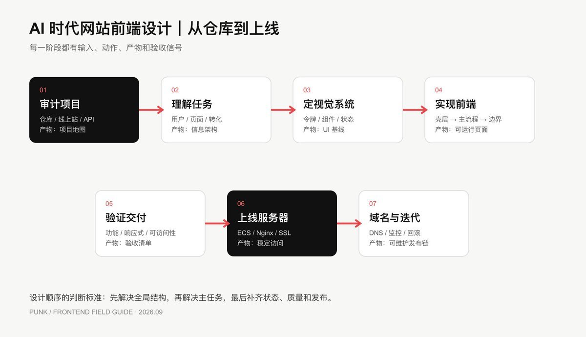
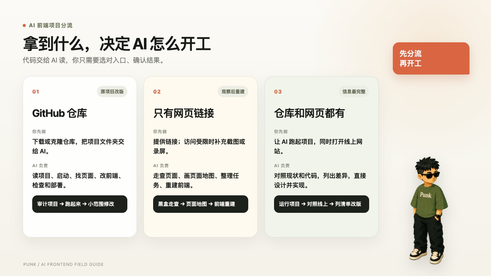
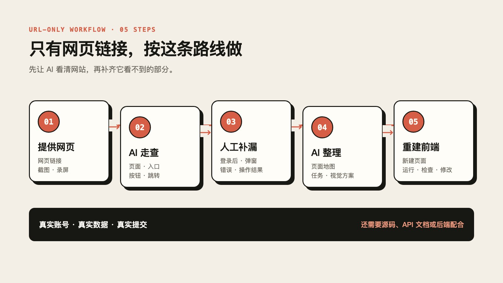
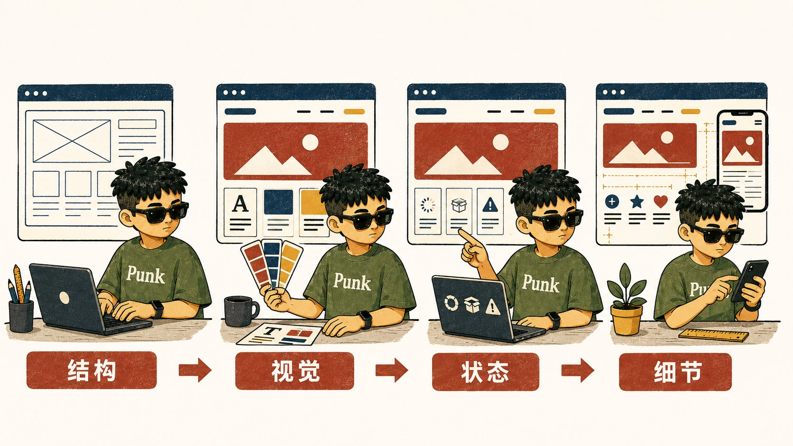
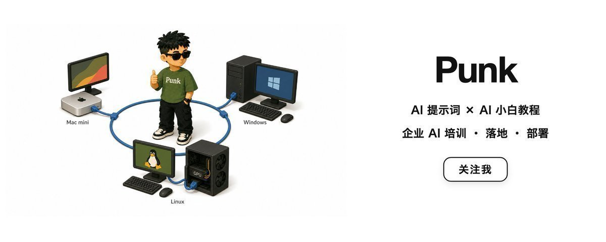

# AI网站前端设计工作流：小白保姆级教程

@AdrianPunk115 · [X 原文](https://x.com/AdrianPunk115/article/2096202974653722823)


最近接了好几个设计前端网页的活。

刚开始做的时候，我没有一套特别完整的方法，往往想到哪里改到哪里：改一版，再补一版，再推倒重来。项目小的时候还好，遇到层级多、页面复杂的网站，效率就会很低，最后的检查环节也经常有疏漏。

于是我开始去找一套更正确、更标准化的流程。

先说明这篇文章写给谁：想尝试前端设计的设计师、第一次自己做 UI 的小白，以及想借助 AI 完成前端设计和实现的人。如果你已经是一名有成熟工作流的前端设计师，可以把它当成一份个人实践参考。

做了几个项目之后，我把之前“先跑起来再说”的野蛮干法重新梳理了一遍，逐渐形成了这套目前正在使用的流程。它不要求你先看懂代码，也不要求你先学会专业设计软件。AI 负责读项目、拆页面、改前端和检查结果，你负责提供材料、确认目标、判断页面是否符合真实需求。

你手里可能只有一个 GitHub 仓库，也可能只有一个功能齐全的网页链接。有时两样都有，有时只有其中一样。

起点不同，第一步就不同；后面的工作，都会慢慢汇合到同一条线上：**先看懂，再规划；先做主流程，再补细节；先验证，再上线。**



## 一、先判断你手里拿到什么，决定怎么让 AI 开始

我现在接到项目，第一件事已经变了：先判断输入材料，再把正确的任务交给 AI。

对小白来说，核心问题是怎样把材料和任务交给 AI。具体操作就是让 AI 读项目、改前端、运行命令，并在浏览器里检查结果。你需要判断它能替你做哪一段工作，自己还需要补哪一步。



如果对方只说“照着这个网站重做”，先问清楚到底要交付哪一种：只能点击的静态页面、可以运行的前端，还是包含真实数据和登录的完整网站。

这几种交付物的流程不同：只有网页链接时，重点是观察、记录、拆解，然后让 AI 重建前端；有 GitHub 仓库时，重点是让 AI 先理解现有项目，再在原有功能上改前端；两样都有时，先对照现状，再让 AI 直接设计和实现。

只有网页链接时，你可以研究视觉和交互；要实现真实登录、真实数据和真实提交，就需要源码、API 文档或后端同事的配合。这个区别要在开始之前确认，否则很容易把“做得像”误认为“功能已经实现”。

### 拿到 GitHub 仓库，按这条路线做

1. 把仓库下载到电脑，或者用 Git 克隆一份项目副本。
2. 用 AI 打开这个项目文件夹，让它读取项目文件。
3. 先不要让 AI 改页面，先让它回答：这是什么技术、怎么启动、有哪些页面、哪些文件控制页面、项目能不能正常运行。
4. 让 AI 启动项目。终端出现报错时，把报错原样交给 AI，让它修复并再次启动。
5. 项目能打开之后，再提出具体的设计任务，例如“先改首页首屏”，不要一开始就说“把整个网站重新设计一遍”。

这条路线的真正难点，是让 AI 先把项目跑起来。项目一旦能运行，后面就是“提出一个小改动 → AI 修改 → 浏览器检查 → 继续改”的循环。

### 只有网页链接，按另一条路线做

1. 把网页链接交给 AI；如果 AI 无法打开，就自己按页面顺序截图、录屏，再交给 AI。
2. 让 AI 列出页面、入口、按钮、页面跳转和主要用户任务。
3. 你自己像普通用户一样点一遍，把 AI 看不到的登录后页面、弹窗、错误提示和操作结果补充进去。
4. 让 AI 根据这些材料画页面地图、整理设计任务，并直接提出页面结构和视觉方案。
5. 最后让 AI 新建或重建前端。涉及真实账号、真实数据和真实提交时，再确认有没有源码、接口或后端配合。



这条路线前面更容易，因为不需要先处理项目环境；后面更难，因为 AI 只能看到网页表现，不知道原来的组件、接口和数据库怎么工作。

## 二、只有网页链接时，先像用户一样走一遍网站

黑盒走查，简单说就是让 AI 先把网站当成普通用户来使用，只观察页面呈现、点击反馈和操作结果，暂时不管里面的代码、数据库和后台怎么实现。

你需要提供网页链接。AI 负责查看页面、点击导航和按钮、整理页面之间的关系，并记录用户从进入网站到完成任务的完整路径。遇到登录后页面、弹窗或 AI 无法访问的内容，再补充截图或录屏。

把下面这段提示词直接交给 AI：

```text
请对下面这个网站做一次黑盒走查，只根据用户能看到和操作到的内容进行分析。

网站链接：
【把网页链接放在这里】

如果你无法打开某些页面，我会补充截图或录屏。请先说明你实际访问到了哪些页面，哪些结论来自截图，哪些信息仍然缺失。

请像普通用户一样检查网站：
1. 从首页或其他入口开始，查看导航、按钮、链接和页面跳转；
2. 找出用户可以完成的主要任务；
3. 记录每条任务路径经过的页面、点击的操作和操作结果；
4. 关注登录、注册、表单提交、搜索、创建、编辑、删除和返回等操作；
5. 检查加载中、无数据、出错、成功、禁用和无权限等状态；
6. 分别观察桌面端和手机端的布局变化。

请按以下格式输出：

一、访问结果
- 实际访问到的页面；
- 访问受限的页面；
- 需要我补充的截图、录屏或登录后信息。

二、页面清单
用表格列出：页面名称、URL、进入方式、页面主要任务、关键操作、操作结果、下一步页面、异常状态。

三、用户任务路径
至少整理出三条完整路径，格式如下：
入口 → 页面 → 操作 → 页面 → 成功或失败

四、页面地图
用树状结构列出访客页面、登录后页面、列表、详情、创建、设置和错误页面，并标出页面之间的跳转关系。

五、前端设计任务
根据走查结果，列出需要实现或改进的页面，按 P0（必须优先完成）、P1、P2 排序，并说明每个页面的主要内容、主按钮和必须支持的状态。

要求：
- 只记录你实际看到或我明确提供的信息；
- 无法确认的内容标注“需要确认”；
- 不猜测代码、接口、数据库和用户权限；
- 先输出走查结果和设计任务，暂时不要修改代码。
```

AI 输出之后，你只需要核对页面是否真实存在、主要任务是否正确、登录后的页面有没有遗漏。确认结果后，再让 AI 根据页面清单和任务路径开始设计前端。

如果后面拿到了源码，把源码所在的项目文件夹也交给 AI，让它把网页走查结果和现有项目对照。这样它能判断哪些功能可以复用，哪些页面需要新做。


## 三、页面地图到底怎么画

页面地图要呈现页面之间的关系和用户完成任务的路径，单独罗列 URL 或拼接截图都不够。

它要回答三个问题：用户从哪里进来？要经过哪些页面？在哪一步完成任务？

最简单的画法，是分成三层：

```text
入口层：首页 / 搜索 / 分享链接 / 后台入口
页面层：首页 / 列表 / 详情 / 创建 / 设置 / 错误页
任务层：查看 → 选择 → 编辑 → 提交 → 成功或失败
```

再把它画成真正的树：

```text
访客
├── 首页
│   ├── 产品介绍
│   └── 登录 / 注册
├── 搜索
│   ├── 结果列表
│   ├── 无结果
│   └── 详情页
└── 登录用户
    ├── 工作台
    ├── 创建内容
    │   ├── 提交中
    │   ├── 提交成功
    │   └── 提交失败
    └── 设置
```

页面地图画完之后，再给每个页面加四个字段：

- 用户为什么来到这里；
- 页面最重要的信息是什么；
- 用户最应该点击哪个按钮；
- 失败之后还能不能继续。

这一步会直接决定页面设计顺序。

如果你说不清用户怎样从页面 A 走到页面 B，就先不要写 CSS。

### 页面地图完全可以让 AI 先画一版

这一步很适合交给 AI 做第一轮整理，尤其是页面多、路由多、自己刚接手项目的时候。

你可以把网页链接、README、路由文件、页面目录和接口说明交给 AI，让它先把散落的信息整理成一张地图。AI 的价值在于快速归纳和发现遗漏，页面优先级、真实业务含义和最终取舍，还是要由你确认。

Mermaid 是一种用文字写流程图的格式，很多 Markdown 工具、Obsidian 和 GitHub 都能把它显示成图。下面这段提示词可以直接复制：

```text
你是一名资深产品设计师、前端架构师和用户体验研究员。

请根据我提供的项目材料，整理一份“网站页面地图”和“核心用户任务流”。

项目材料可能来自以下一种或多种来源：
- GitHub 仓库或项目文件；
- 已上线的网站链接；
- README、路由文件、页面目录；
- API 文档、接口类型、产品说明；
- 页面截图或录屏。

项目材料：
【把 GitHub 链接、网页链接、文件内容或截图放在这里】

请按以下顺序输出：

一、先判断输入材料
1. 你实际看到了哪些材料；
2. 哪些结论来自真实文件或网页；
3. 哪些地方只是推测；
4. 哪些信息需要我或产品方确认。

二、页面清单
用表格列出：
- 页面名称；
- URL 或路由；
- 用户进入条件；
- 页面主任务；
- 页面主要内容；
- 数据来源或 API；
- 成功后的下一步；
- loading（加载中）/ empty（无数据）/ error（出错）/ success（成功）/ no permission（无权限）状态；
- 优先级：P0（必须优先完成）、P1 或 P2。

三、页面地图
请用树状结构表示：
- 访客入口；
- 登录用户入口；
- 首页、列表、详情、创建、设置和错误页；
- 页面之间的父子关系和返回路径。

四、核心用户任务流
至少找出一条 P0（最重要、必须优先完成）主流程，并用下面格式表示：
入口 → 页面 → 操作 → 页面 → 成功或失败

五、Mermaid 图
输出可以直接粘贴到 Markdown、Obsidian 或 GitHub 的 Mermaid 代码。
请分别输出：
1. site map 页面树；
2. P0 用户任务流程图。

六、前端设计建议
根据页面地图给出：
- 全局壳层应该包含什么；
- 哪些组件可以复用；
- 页面应该按什么顺序设计；
- 哪些状态必须先设计；
- 哪些问题会影响 API、路由或部署。

约束：
- 不要编造项目中不存在的页面、API、字段或用户角色；
- GitHub 项目优先引用真实文件路径；
- 只有网页链接时，明确标注“根据页面观察得到”；
- 无法访问链接或材料不足时，直接说明缺口，不要假装已经分析完成；
- 先分析和输出文档，不要修改任何代码文件。
```

如果你只有网页链接，可以把截图、页面 URL 和自己的走查记录一并放进去。如果你有 GitHub 仓库，优先让 AI 读取 README.md、package.json、路由入口、页面目录和 API 类型，画出来的地图会更接近真实项目。

AI 输出之后，人工只需要重点核对三件事：页面是否真实存在、P0 主流程是否正确、异常状态有没有漏掉。确认完，再把 Mermaid 图和页面清单放进项目的 DESIGN-NOTES.md。

## 四、设计顺序，按影响范围排

以前我经常从最有感觉的页面开始做，比如首页、登录页、某个视觉很强的详情页。

现在我会按照影响范围排。这里的 P0，指“最重要、必须优先完成的任务”：

1. 全局壳层：导航、容器、页脚、登录状态；
2. P0 主流程：用户最需要完成的那个任务；
3. 主流程状态：加载、空数据、错误、成功、禁用、无权限；
4. 高频辅助页面：列表、搜索、详情、设置；
5. 边缘页面：404、帮助、隐私、旧链接；
6. 最后再做装饰、动效和细节打磨。


原因很简单：壳层会影响所有页面，主流程会暴露 API 和组件问题，异常状态会暴露产品是否真的能用。

先把这三块做稳，后面的页面会快很多。

## 五、让 AI 先搭结构，再做视觉

这里不需要先画设计稿。直接让 AI 在项目里改，然后在浏览器里看结果。

我会把一个页面拆成四次修改：

1. 先搭结构：确定导航、容器、内容区、卡片、表单和主要按钮的位置；
2. 再定视觉：统一背景、颜色、字体、间距、圆角、边框和阴影；
3. 再补状态：把加载、空数据、错误、成功、禁用和无权限补齐；
4. 最后做细节：处理手机端、动效、图片、图标和微小间距。



每一次只让 AI 完成一个范围，并明确要求它修改哪些页面、不要动哪些功能。完成后立刻在浏览器里检查，再进入下一次。这样即使你看不懂代码，也能通过“任务—结果—反馈”控制方向。

可以直接这样对 AI 说：

```text
请先只处理首页的页面结构，不要修改接口、路由和业务逻辑。
根据现有项目和下面的页面目标，调整导航、首屏、主要内容区和主按钮。
请复用项目里已有的组件和依赖，不要新增不必要的库。
完成后启动项目，告诉我修改了哪些文件，并说明我应该打开哪个地址检查。
先不要处理动效、复杂插画和其他页面。
```

页面能正常显示后，再把视觉要求、参考网站、颜色和素材交给 AI，让它继续改。

不要每个页面单独挑颜色。先建立设计令牌，哪怕只有这一点：

```css
:root {
  --color-bg: #f7f7f5;
  --color-surface: #ffffff;
  --color-text: #111111;
  --color-muted: #6b7280;
  --color-border: #e5e7eb;
  --color-primary: #111111;
  --space-4: 16px;
  --space-6: 24px;
  --radius-md: 12px;
}
```

令牌的好处是，改一次可以影响全站，也方便 AI 按规则继续写代码。

还有一个经常被忽略的点：组件要连同状态一起设计。

按钮至少看默认、悬停、按下、禁用、加载；输入框至少看默认、聚焦、已填写、错误、禁用；列表和卡片要看加载、空数据、错误和无权限。

真实用户大部分时间都在等待、修改、犯错和重新尝试。只设计默认状态，交付出来的页面很容易停在“看起来不错”。

## 六、AI 应该参与哪几步

AI 可以从读项目、画页面地图、改页面到检查上线全部参与。你不需要把代码读懂，但每一步都要给它清楚的任务边界。

我会把工作拆成四轮：

第一轮，让 AI 读项目。

把项目文件夹交给它，让它输出：技术栈、启动命令、页面路由、接口关系、环境变量和潜在风险。要求它先不要修改文件，不要编造接口，把不确定的地方标成“需要人工确认”。

第二轮，让 AI 拆页面。

给它网页链接、截图、页面地图、目标用户、主任务和参考网站，让它输出页面区块、主 CTA（用户最应该点击的主要按钮）、移动端变化，以及加载中、无数据、出错、成功等状态。

第三轮，让 AI 实现一个小闭环。

例如先做“注册 → 验证 → 成功页”，不要一次性改完整个网站。要求它复用已有组件和依赖，说明修改文件，启动项目，并告诉你检查地址。

第四轮，让 AI 做浏览器验收。

把页面截图、报错和验收清单交给它，让它检查视觉层级、移动端溢出、按钮是否能点击、错误提示、键盘操作和不必要的依赖。每轮修改后都在浏览器里看结果，发现问题就把截图和具体位置继续交给 AI。

写代码和验收最好分开：一次对话负责实现，另一次对话负责挑问题。这样更容易发现“代码完成了，但页面并不好用”的情况。

## 七、灵感和素材，应该怎么找

我找灵感时会先确定要观察什么，再去找对应的参考。

- 看首屏构图：Awwwards、Land-book；
- 看 SaaS 和后台流程：Mobbin、Pageflows、SaaSFrame；
- 找现成组件和代码：shadcn/ui、Magic UI、Aceternity UI、React Bits、HyperUI；
- 看动效：Codrops、Godly；
- 看颜色：Coolors、Realtime Colors；
- 看图标：Lucide、Heroicons；
- 看图片：Unsplash、Pexels、Pixabay。


这些网站的用途，是给 AI 提供参考。找到喜欢的页面后，可以把链接、截图、组件代码或页面上的提示词交给 AI，并明确告诉它：参考哪一部分、保留什么、哪些部分需要重新设计、要放进当前项目的哪个页面。

推荐按这个方式使用：先找 1～3 个参考，不要把十几个网站一起丢给 AI；再写清楚你借鉴的是布局、颜色、动效还是组件；最后让 AI 根据当前项目的技术和功能重新实现。能直接复制的代码也要先让 AI 检查依赖和授权，不要把整站代码原样搬过来。

如果你想直接用提示词探索页面，可以试试 v0；如果你想找可以落地的组件代码，可以优先看 shadcn/ui、Magic UI、Aceternity UI、React Bits 和 HyperUI。

每张参考图，我会写一句“我到底借鉴了什么”。

比如不要写“喜欢它的高级感”，要写“首屏只保留一句价值主张、一个主按钮和一个可见结果，适合单一转化目标”。

素材也要记录来源、作者、授权和用途。图片、字体、图标、人物肖像和品牌标志，不能因为能下载就默认可以商用。

## 八、前端实现和验收

代码实现依然按这条顺序走：壳层 → P0 主流程 → 真实数据 → 异常状态 → 辅助页面 → 装饰细节。

每完成一小段，就在真实浏览器里检查，不要等所有页面写完再看。

至少检查 390px、768px、1024px、1440px 四个宽度。重点看横向溢出、导航折叠、长标题、长数字、表格、图片裁切和按钮点击区域。

再用键盘走一遍主流程：焦点是否可见，顺序是否合理，弹窗能否关闭，错误是否能被理解。按钮用真实的 \<button\>，输入框要有 label，图片要有合适的替代文本。

最后跑：

```bash
npm run lint
npm run build
git status
git diff --stat
```

确认 .env、密钥、用户数据、调试日志和临时截图没有进入仓库。

## 九、上线发布，记住这条顺序

前端在本地验收通过后，接着进入发布：

```text
判断部署方式 → 准备线上环境 → 配置生产环境变量 → 构建并发布 → 绑定域名和 HTTPS → 线上验收 → 保留回滚版本
```


这里先记住完整顺序。实际操作时，把项目文件夹和所选平台告诉 AI，让它读取技术栈、构建命令和项目配置，再逐步给出对应的发布操作。账号密码、密钥、支付和域名所有权由你自己处理，每完成一步都让 AI 检查结果。

## 最后

我现在越来越觉得，前端设计最耗时的部分，常常发生在让 AI 写代码之前：你有没有把问题拆开。

你不知道自己手里有什么，就没法判断第一步；你没有页面地图，就不知道先做哪个页面；你没有主流程，就会一直在装饰细节里打转；你没有验收清单，上线前就一定会漏东西。

如果你今天准备开始一个项目，先别急着改首页。

先建立三样东西：一张页面地图、一条 P0 用户路径、一张项目审计表。

这三样东西写清楚之后，页面规划、AI、代码和验收才会真正接上。

### 关于作者

**Punk**｜中科大管理学硕士｜AI提示词、AI小白教程｜Punk系列Skills作者｜3个月赚了8位数｜Learn in Public｜FDE文章浏览量240w｜[@AdrianPunk115](https://x.com/@AdrianPunk115)


