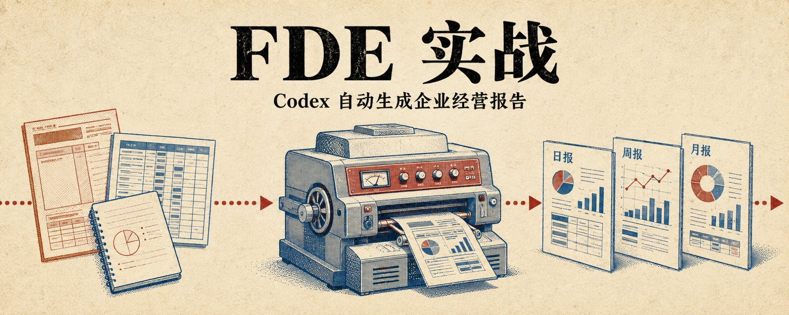
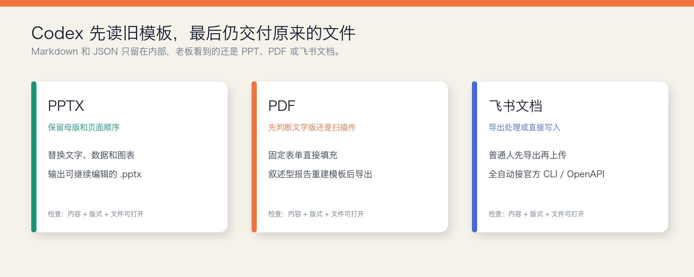
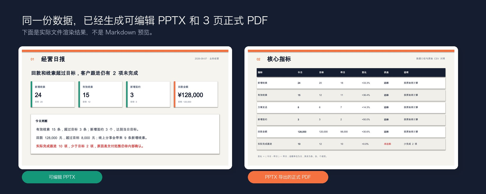
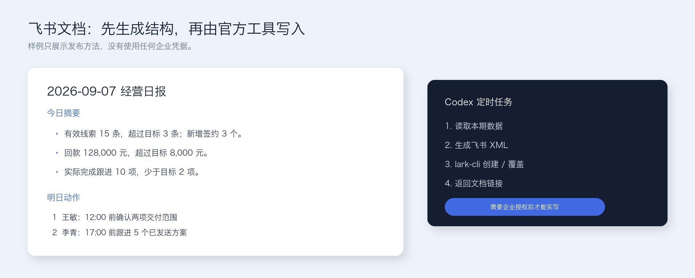
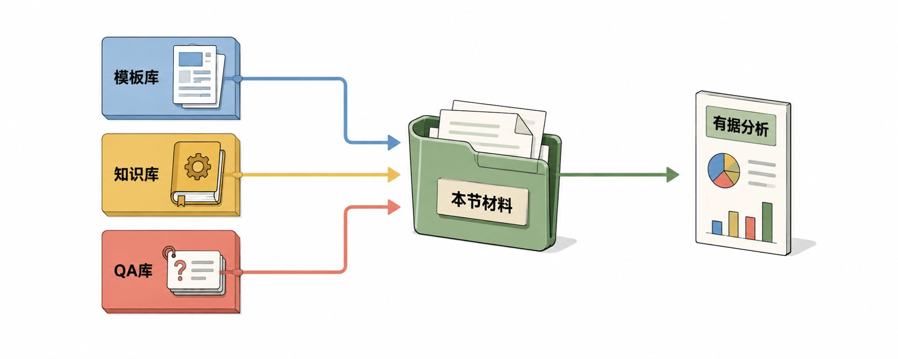
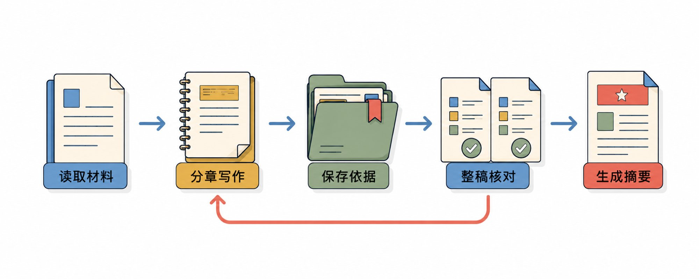
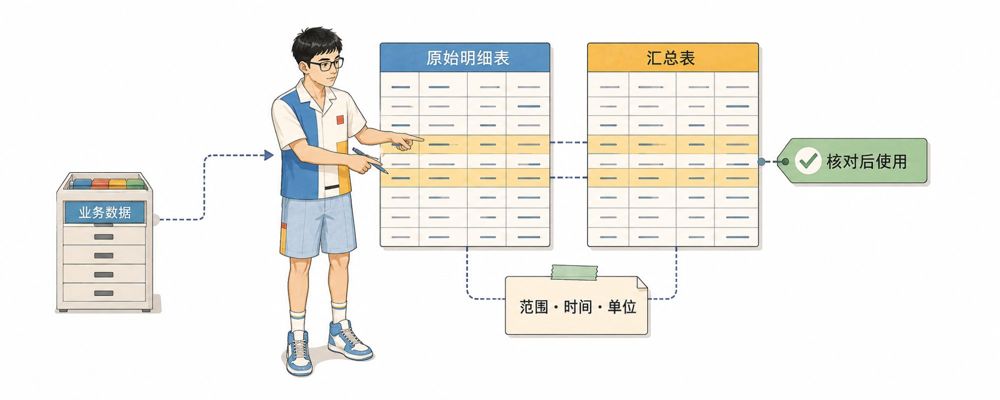
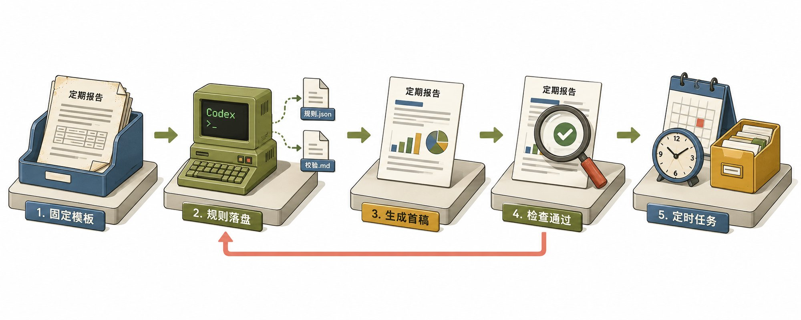

# FDE 落地实战｜Codex 自动生成企业经营报告 （含日报、周报、月报）

@miles_mazy · [X 原文](https://x.com/miles_mazy/article/2096836534410657992)



一份日报看起来只有几页，真正写起来却要找资料、导数据、对口径、写分析，最后还要把内容塞回 PPT、PDF 或飞书文档，几个小时很容易就过去了。

如果一家企业准备开始做 FDE，我认为经营报告是很合适的第一站。它有固定模板、明确的数据来源和稳定的生成频率，结果能不能用也很容易检查。

第一次让 Codex 把模板、资料、数据和检查规则跑通，后面就能设成定时任务。你只需要打开成稿，确认数字和结论，然后发出去。

我的流程是：**读取旧模板 → 固定报告规则 → 准备资料和数据 → 生成正式文件 → 检查 → 定时运行**。


## 先把旧模板交给codex

很多人做报告自动化，第一句话就是：“帮我写一份经营日报。”

它会生成一段内容，但大概率不能直接用。公司原来的报告已经形成了固定习惯：老板先看哪几个数字，第二页放什么图表，风险写到什么程度，最后要留下哪些负责人和截止时间。你突然换一套结构，别人还要重新找信息。

第一步，把公司已经在用的版本交给 Codex，让它沿用这套结构。

空白模板用来确认版式，一两份已经通过的历史报告用来确认内容。Codex 需要把它们拆成一套长期规则：报告有几页，每一页回答什么问题，哪些位置放数字，哪些地方需要分析，内容最多写多少字，缺少资料时应该怎么处理。

可以直接这样告诉 Codex：

```text
请读取现有报告模板和已经通过的历史报告。

先不要生成新报告。请分析固定的页面顺序、标题层级、数据位置、图表位置、每一部分要回答的问题，以及写完后的检查要求。

把这些内容整理成长期使用的报告规则。保留原来的阅读顺序和版式习惯，无法从历史报告确定的内容单独列为待确认问题。
```

做完这一步，Codex 以后就不用每次重新猜。它先读固定规则，再处理本期数据，生成出来的内容自然会回到原来的框架里。

## 公司用什么格式，Codex 最后就交付什么格式

内部处理过程中，Codex 可以用 Markdown 保存文字，用 JSON 保存数据，但这些只是中间文件。

公司原来用 PPT 汇报，最后就要生成可以继续修改的 PPT；公司要求 PDF 归档，最后就要输出排好版的 PDF；团队一直在飞书文档里看日报，结果就应该回到飞书。

如果最后还要安排一个人复制、粘贴、换字体，这套自动化仍然没有完成。



## 原来的报告是 PPT

PPT 是企业经营报告里最常见的一种，也是最适合直接改造的一种。

Codex 先读取原来的 PPT，看清母版、页面顺序、文本框、表格、图片和图表的位置。然后复制一份模板，只替换本期需要变化的内容。封面、配色、页脚、字号和页面比例都保留下来，老板打开以后，看到的还是原来熟悉的报告。

一份经营日报可以固定成三页：第一页放当天最重要的判断和核心数字，第二页放完整指标，第三页放风险和明日动作。到了下一期，页面不变，Codex 只更新日期、数字、分析和待办。

如果旧 PPT 的结构比较乱，每个月都有人随手增加文本框，可以先整理一次，把会变化的位置固定下来。例如日期、回款、线索数和风险分别对应一个确定区域。这个动作只做一次，后面就可以反复使用。

下面这份经营日报，就是从固定 PPT 模板里生成的。数字来自同一份演示数据，第一页负责讲结论，第二页负责核对指标，生成后仍然可以继续编辑。



这里最容易忽略的是检查。程序显示“生成成功”，只代表文件做出来了，不代表它能交付。Codex 还要把每一页重新渲染成图片，检查标题有没有被截断、表格有没有溢出、中文字体有没有丢失、图表和数字能不能对应上。

如果需要自己搭这条 PPT 生成流程，可以使用 python-pptx：

[https://github.com/scanny/python-pptx](https://github.com/scanny/python-pptx)

它可以读取和更新 PowerPoint 文件，也可以把数据库查询或结构化数据写回原来的页面。

## 原来的报告是 PDF

PDF 更适合做最终交付，不太适合反复修改。最稳的做法，是找到它原来的 PPT 或 Word 模板，让 Codex 更新源文件，再重新导出 PDF。

如果公司只剩下一份 PDF，也可以让 Codex 读取里面的文字、表格和页面布局，照着它重建一份可以长期使用的模板。第一次会多花一点时间，后面每一期就只需要换数据和内容。

下面的 PDF 样例和前面的 PPT 来自同一份报告。PPT 留作内部修改，PDF 用来发给别人或归档。这样既保留可编辑版本，也能保证发出去的版式不会变化。

如果需要读取 PDF、识别表格、提取页面位置或者处理扫描件，可以使用 PyMuPDF：

[https://github.com/pymupdf/pymupdf](https://github.com/pymupdf/pymupdf)

它也支持 OCR。扫描版 PDF 可以先识别文字，再对照原页面重建模板，不需要把一份图片式报告重新手工录入。

## 原来的报告在飞书文档

飞书文档可以先从最简单的方式开始。

把原来的飞书日报导出一次，让 Codex 读懂标题、段落、表格和待办结构。每一期生成完成后，先由人复制回飞书。虽然还保留最后一步操作，但查资料、算数据、写分析和整理结构已经自动完成，很适合先验证这套流程是否稳定。

如果每天都要生成，希望到时间直接拿到飞书链接，就给 Codex 接上飞书的文档能力。Codex 把报告整理成标题、段落、列表、表格和图片，再通过飞书官方工具创建一份新文档，或者覆盖指定的日报文档。

整个过程其实只有四步：读取本期数据，生成报告内容，写入飞书文档，返回文档链接。



飞书已经提供面向 Agent 的官方 CLI，可以创建、读取和更新文档：

[https://github.com/larksuite/cli](https://github.com/larksuite/cli)

如果公司已经在使用 MCP，也可以接飞书官方 OpenAPI MCP：

[https://github.com/larksuite/lark-openapi-mcp](https://github.com/larksuite/lark-openapi-mcp)

这里有一个实际边界。当前官方 MCP 可以读取和导入文档，但还不能直接编辑已有的飞书云文档。需要自动覆盖原文档时，可以使用飞书官方 CLI，或者让 Codex 按照飞书 OpenAPI 做一个很小的发布脚本。第一次需要管理员开通企业应用和云文档权限，后面就可以跟定时任务一起运行。

## 模板解决格式，知识库解决分析

报告只有数据还不够。销售额增长了，库存下降了，客户跟进少了两项，这些只是现象。老板真正想知道的是：为什么会这样，有没有风险，接下来谁处理。

Codex 要写出这种分析，还需要公司的业务上下文。

指标口径、部门目标、产品资料、业务计划和已经确认过的常见问题，可以放进长期知识库。本期的会议记录、业务进展、客户反馈和临时说明，则跟本期数据放在一起。

这样写报告时，Codex 才能分清楚什么是数字，什么是已经发生的事实，什么只是推测。

例如数据只能证明“有效线索比昨天增长了 36.4%”。如果业务记录没有说明原因，Codex 就应该写“增长原因待确认”。它不能因为当天做了一场分享会，就自动认定所有增长都来自这场活动。



一份报告里的每个部分，都要提前讲清楚四件事：去哪里找资料，要回答什么问题，结果放在什么位置，什么情况下必须留下“待确认”。

这样整份报告就不再是一个模糊任务，而是一组有顺序的小任务。Codex 先完成各个章节，保存数字和依据，再检查整份报告，最后才写开头摘要。某一部分有问题，也只需要退回那一部分重新处理。



## 数据从最容易拿到的地方开始

第一次不需要先连接公司所有系统。

平时用 Excel、CSV、Word 或 PDF，就先把这些文件交给 Codex。找一个自己熟悉的历史周期，让它重新生成一次，再和原来的报告逐项对照。日期范围、部门范围、订单状态、去重方式和金额单位都能对上，这套取数方式才算跑通。

等文件方式稳定以后，再去连接 CRM、ERP 或数据库。已有 API 就调用 API，已有查询脚本就继续使用，系统提供 MCP 就让 Codex 接 MCP。没有现成连接，也可以把接口说明和需要的字段交给 Codex，让它生成一个小的取数工具。

底下使用哪种技术并不影响后面的报告流程。Codex 每次先得到一份可以核对的本期数据，再用同一套模板、知识和检查规则生成报告。



## 第一份报告的作用，是把问题找出来

模板、资料和数据准备好以后，让 Codex 完整生成第一份报告。

这一次不要急着追求全自动。先看页面顺序有没有变，数字能不能和原始数据对上，分析有没有事实依据，缺少资料的地方有没有明确标出来，最终的 PPT 或 PDF 能不能正常打开。

发现问题以后，也不要只修改眼前这一份。

如果标题经常放不下，就把标题字数写进长期规则；如果某个指标经常取错，就把时间范围、筛选条件和单位写进检查清单；如果 Codex 总把推测当成原因，就规定“没有业务记录支持时必须标记待确认”。

第一份报告真正留下来的，不只是一个文件，而是一套下次还能继续使用的规则。

## 跑通一次，再交给定时任务

第一份报告确认没问题以后，就可以让 Codex 定期执行。

```text
把这套经营日报设为定时任务，每个工作日 18:00 运行。

读取当天最新的业务资料和数据，按照已经确认的模板与规则生成报告。继续使用原来的交付格式，输出可编辑 PPT，并同步导出 PDF。

生成后完成数字和页面检查。缺少关键数据、数字核对失败或页面显示异常时，不生成正式版，直接告诉我需要处理什么。
```

如果最终使用飞书文档，就把输出要求换成“生成飞书文档并返回链接”。

定时任务开始运行以后，前几期仍然要人工检查。等到数据来源、分析规则和页面格式都稳定，再决定要不要自动放进共享目录或发布到飞书。

日报、周报和月报的区别，只是模板、统计周期和关注点不同。底下运行的还是同一套流程：Codex 读旧模板，拿到本期资料和数据，完成分析，生成公司原来就在使用的文件，再按照固定时间交付。

以前每天重复的是找资料、搬数字和调格式。把这些工作固定下来以后，人只需要处理真正需要判断的部分：这个变化意味着什么，风险要不要处理，下一步到底由谁负责。

经营报告跑通以后，企业也就完成了 FDE 的第一轮练习：AI 怎么读取内部资料，怎么连接业务数据，怎么遵守原来的交付格式，怎么处理缺失信息，最后又由谁确认结果。

这几件事跑通了，后面再把同样的方法放进客户跟进、项目复盘、库存分析和管理汇报，就会顺很多。



我是 Miles，一名从大厂转型 FDE 的 AI 算法专家，做过算法研发、优化部署，也做过企业培训、落地交付，我的 X 账号，**15 天做到 1 万粉，一周写出三篇百万曝光长文**，其中两篇后来超过 200 万。

关注我[@miles\_mazy](https://x.com/@miles_mazy)，**一起成长，一起赚钱**。


