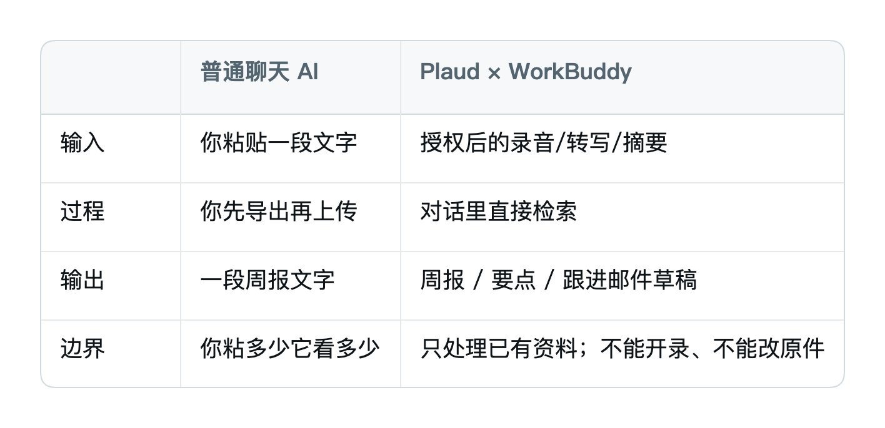
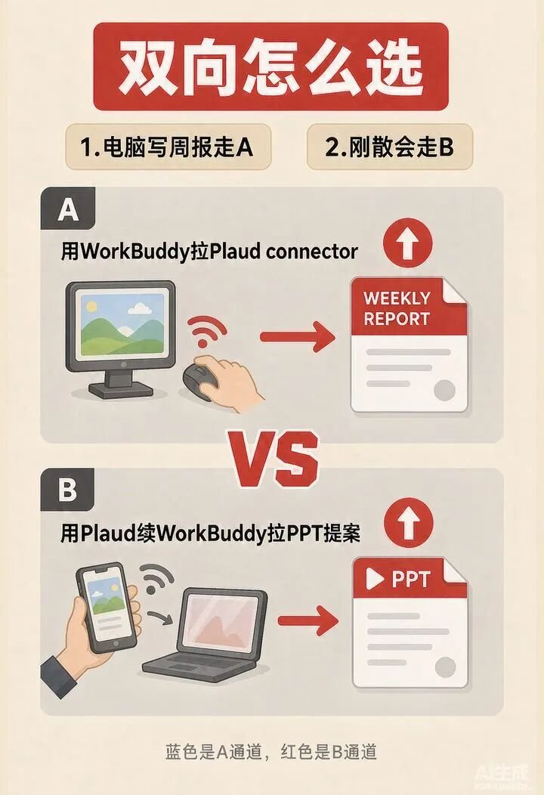
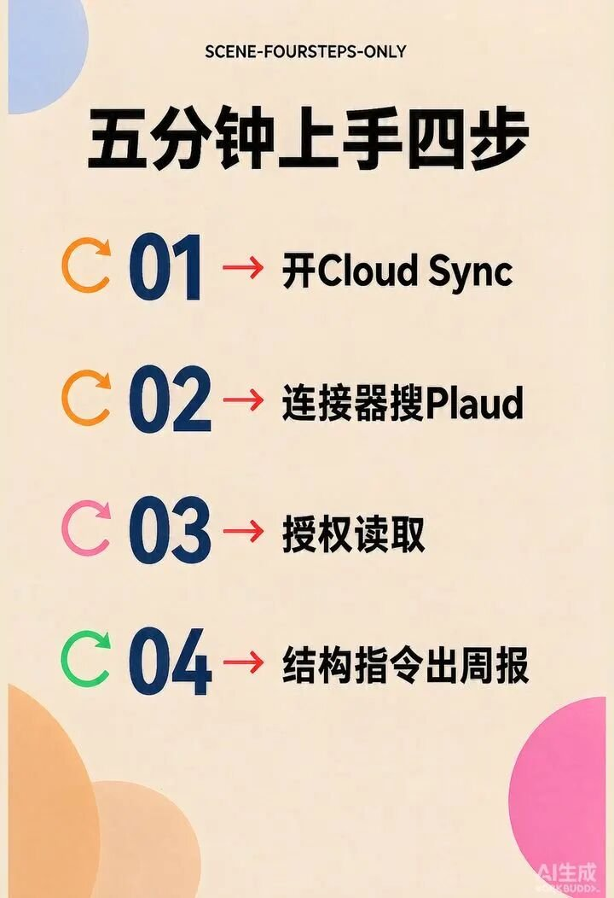
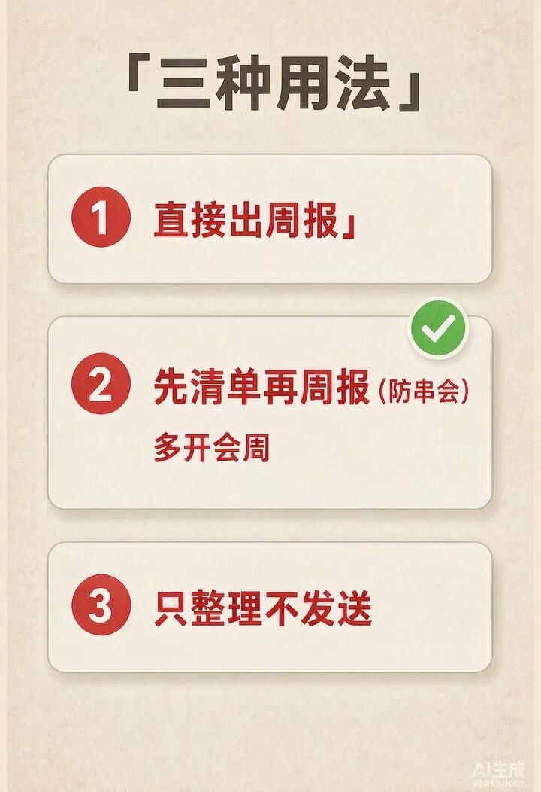
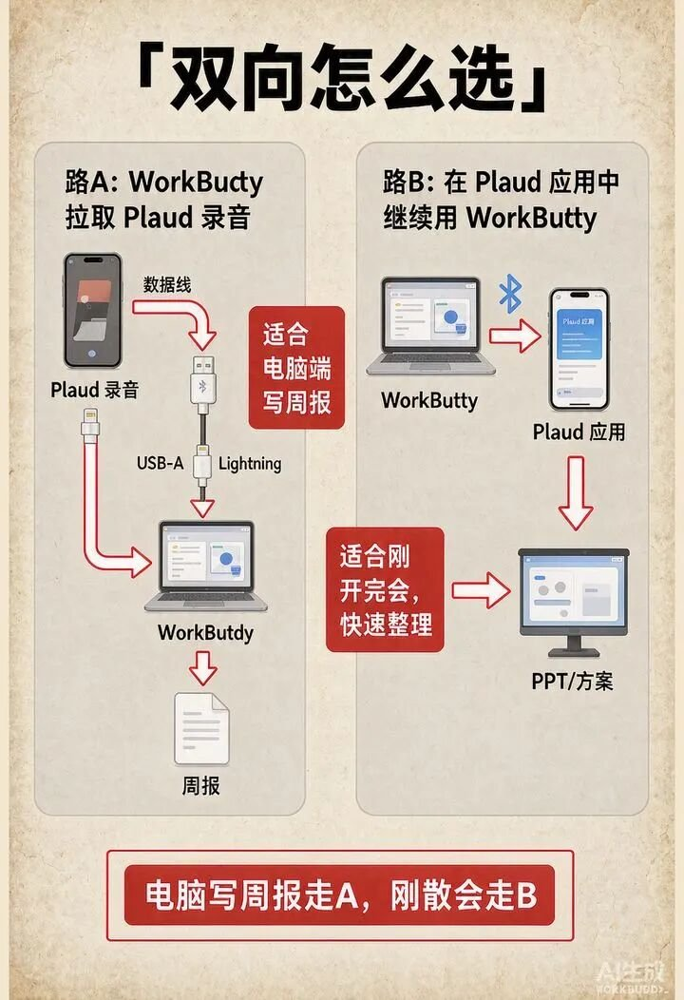
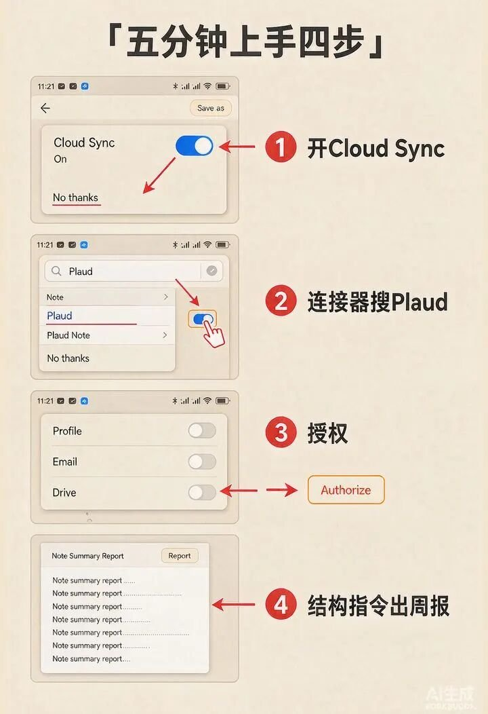

# Plaud × WorkBuddy（录音直出周报）

@Shenmeili1213 · [X 原文](https://x.com/Shenmeili1213/article/2096830786947399818)


开完会最烦的，不是开会。
是会后那一串：
找录音。 导出。 上传。 再打开一个对话框，让 AI「帮我写周报」。
中间只要卡一步，周报就拖到晚上。
这几天公开报道写得很直白：

**Plaud 的官方 MCP，接进了腾讯 WorkBuddy。**

授权之后，你可以在 WorkBuddy 里直接检索 Plaud 账号里的录音、逐字稿、摘要、待办，继续生成周报、会议要点、跟进邮件。

不用先导出，再上传。

这篇不讲发布会稿。 讲你怎么从 0 跑通第一次：

**录音在那边，周报在这边出来。**

照着走一遍。 你至少能拿到一份能改的周报草稿。

话不多说，直接开始。

## 本期导读

① 它是什么（双向怎么选） ② 一张图看懂链路 ③ 五分钟上手四步 ④ 三种用法 + 防串会 ⑤ 可复制指令库 ⑥ 权限边界 ⑦ 避坑六条 ⑧ 六个场景 ⑨ 没有 Plaud 硬件怎么办

## 一、它是什么

一句话：

**它是一条「真实对话 → 工作成果」的短链路。**

以前：

录音在 Plaud。 脑子在你这。 周报还得另起炉灶。

公开能力里，其实是 **双向**：

### 路 A｜在 WorkBuddy 里连 Plaud（今天主讲）

入口：WorkBuddy「专家·技能·连接器」搜 Plaud。 能干：对话里检索录音 / 逐字稿 / 摘要 / 待办 → 生成周报、会议要点、跟进邮件。

适合：你已经在 WorkBuddy 里干活，想少一次导出上传。

### 路 B｜在 Plaud 里继续叫 WorkBuddy

录完、转写、总结后，不用切 App，继续生成 PPT、方案、报告。 成果还能云同步到 WorkBuddy，手机/电脑接续；往后可发方案、加日程、推进协作。

适合：会刚散，人还在 Plaud 界面，顺手把「下一步」做掉。

今天这篇，主讲 **路 A**：

**WorkBuddy 侧，从 0 连上 Plaud，跑通「录音变周报」。**

跟普通聊天 AI 的区别很大：



记住一句：

**录音是原料，连接器是水管，周报是成品。**



## 二、大框架图解：一张图看懂全貌

别急着让它写。

先把站位记清楚。

整条链路就四块：

1. **Plaud**：负责录、转写、摘要、待办
2. **Cloud Sync**：云同步打开，WorkBuddy 才调得到
3. **WorkBuddy 连接器**：在「专家·技能·连接器」里搜 Plaud，完成授权
4. **对话生成**：用自然语言要周报 / 要点 / 跟进邮件

一句话记住：

**Plaud 负责听见，WorkBuddy 负责办成。中间靠授权，不靠导出。**

再补一句选型：

- 人在电脑前写周报 → 走 **路 A**
- 人还在手机/Plaud 刚散会 → 先走 **路 B** 出纪要/方案，再回 WorkBuddy 接续



## 三、五分钟上手实操

### Step 1：先确认你有「原料」

第一次别贪多。

只要有 **1 段** 你自己的会议/客户沟通录音，并且已经转写、有摘要最好。

适合当原料：

- 周会（已有结论）
- 客户沟通（已有下一步）
- 采访 / 复盘（主题单一）

不适合第一次就扔：

- 一整天杂录音合集
- 没开云同步的本地孤岛文件
- 含身份证号、银行卡、未公开合同价的原文（先脱敏）

### Step 2：打开 Plaud Cloud Sync

公开说明写得很清楚：

**使用前需开启 Plaud Cloud Sync。**

没开同步，连接器后面会空转。

这一步过了，再进 WorkBuddy。

### Step 3：在 WorkBuddy 连接 Plaud

路径（公开报道口径）：

**WorkBuddy →「专家·技能·连接器」→ 搜索 Plaud → 连接并授权**

授权时看清范围。

你是在允许它「读取已有录音/转写/摘要/待办」，不是把账号甩出去不管。

看到连接成功，这一步就过了。

同一套 MCP，公开说明也可用于 ChatGPT / Claude / Cursor 等支持 MCP 的工具。 你主战场在 WorkBuddy，就先只连这一处，别一上来四处授权。

### Step 4：丢一句指令，出第一份周报

别写虚的。

差指令：

```text
帮我写个周报
```

好指令：

```text
读取我本周 Plaud 里和「客户A复盘会」相关的录音/摘要/待办。
输出一份周报草稿，只要这四块：
1）本周完成
2）关键决定
3）未完成与卡点
4）下周三件事
语气干脆，用条目，不要形容词。
先给我草稿，不要发送给任何人。
```

然后看三件事：

- 有没有串会（把别的会混进来）
- 数字、人名、截止日期对不对
- 待办是不是原文里真有的

能改、能用，第一条就算跑通。

不满意怎么办？

**不要推倒重来换五个工具。**

改指令，再生成一次。

比如：

```text
上一条太散。只保留「客户A」这一场。删掉所有情绪评价。待办必须带来源会议名。
```



## 四、跟它「对话」的三种方式（含防串会）

很多人问：怎么控制它别乱写？

其实就三种。

### 方式一：直接生成 → 它直接出周报

适用：本周主题单一、会议少。

```text
根据我本周 Plaud 会议摘要，写一份给老板看的周报，400字内，条目化。不要发送。
```

### 方式二：先要点，再周报（会多必用）

适用：会多、容易串。

先要：

```text
先列出本周所有相关会议的「标题 / 日期 / 关键决定 / 待办」，不要写周报。
每条待办标注来源会议名。
```

你核对名单，勾掉不相关的，再让它：

```text
只基于上面清单写周报，不要新增清单外的事。
结构：完成 / 决定 / 卡点 / 下周三件事。
```

花 30 秒核对，往往省掉两轮废稿。

### 方式三：只整理，不发送

适用：你还不确定要不要发出去。

生成 → 你改 → 你自己粘贴到飞书/微信/邮件。

一句话：

**AI 负责起草，你负责把关。这是底线。**



## 五、可复制指令库（直接拿走）

下面这几条，按场景改括号里的词就行。

### 1）标准周报

```text
读取我本周 Plaud 中与「项目名」相关的录音/摘要/待办。
写周报草稿，四块：本周完成、关键决定、未完成与卡点、下周三件事。
每条待办带来源会议名。不要形容词。不要发送。
```

### 2）老板版（更短）

```text
把本周相关会议压成 300 字内老板周报。
只保留：结果数字、拍板事项、需要老板拍板的问题。
删掉过程讨论。不要发送。
```

### 3）客户跟进邮件

```text
基于「客户名 + 会议日期」的录音摘要，写一封跟进邮件。
只确认：3个决定、2个待办、下一次沟通时间。
语气礼貌、短。先给我正文，不要发送。
```

### 4）客户方案骨架

```text
读取「客户名」最近一次会谈摘要与待办。
输出客户方案骨架：背景、对方诉求、我们可交付、风险、下一步。
不要写价格，不要承诺未讨论过的事项。
```

### 5）创作者周复盘

```text
读取本周选题会与发布复盘相关摘要。
输出内容周报：发了什么、数据要点、踩坑、下周只改一个变量。
不要鸡汤。
```

### 6）跨周捞待办

```text
把过去两周所有提到「关键词」的待办捞出来，按负责人汇总。
每条写：待办、来源会议、是否已完成（未知就标未知）。
不要编造完成状态。
```

【插图5】避坑与场景。成品：p31-images/05-pits-scenes.png

## 六、权限边界：它能干什么，不能干什么

公开说明里，这几条要钉死：

- **能**：访问与处理已有录音、逐字稿、摘要、待办
- **能**：在对话里继续生成周报、会议要点、跟进邮件等
- **不能**：发起录音
- **不能**：编辑原始录音、逐字稿
- **口径**：录音/转写/总结数据只在执行任务时传输处理，任务结束后不被存储（以官方说明为准）

所以你别指望：

「帮我现在开始录」 「把原逐字稿里这句话删掉」 「直接群发给全员」

那不是这条水管的活。

录，还是回 Plaud。 改原件，还是回 Plaud。 发出去，还是你点。

WorkBuddy 这条线，主业是 **调用已有资料，往下做成稿。**

## 七、避坑指南

### 坑 1：没开 Cloud Sync 就连

差：连接器点了，什么都调不到。 好：先同步，再连接。

### 坑 2：一句话「写周报」

差：范围不清，它只能猜。 好：写清时间范围、项目名、输出结构、不要发送。

### 坑 3：多场会不先列清单

差：直接要周报，客户会和内部吐槽混进一篇。 好：先清单，勾选，再写。

### 坑 4：不审核就群发

差：人名错、日期错、把私下吐槽写进周报。 好：对照摘要听/看一遍，再发出去。

### 坑 5：敏感原话全丢进同一池

差：合同价、身份证、未公开薪资混在同一授权池。 好：敏感会单独处理；能脱敏先脱敏；授权范围能收就收。

### 坑 6：指望它替你开会、替你发

差：以为连上就能自动录、自动改原件、自动发邮件。 好：它是「已有资料 → 成稿」；录与发，人还在回路。

一句话：

**先跑通一个简单任务，再进阶。**



## 八、六个真实会用到的场景

### 场景 1：创作者周复盘

本周选题会 + 发布复盘录音 → 出「本周内容周报」：发了什么、数据、下周只改一个变量。

### 场景 2：客户沟通变跟进邮件

会后不要隔夜。 用指令库第 3 条，10 分钟内发出确认信。

### 场景 3：采访变大纲

采访摘要 → 文章大纲 / Shorts 脚本骨架。 长内容仍你写，结构它先铺。

### 场景 4：店长周会变三件事

周会里的缺人、补货、投诉 → 压成「下周三件事」，丢店员群。

### 场景 5：跨周追责

「说过但没人盯」的坑，用指令库第 6 条按人捞待办。

### 场景 6：路 B 散会即出方案

人还在 Plaud：先结构化纪要 → 在 Plaud 里继续叫 WorkBuddy 出客户方案骨架 → 回电脑在 WorkBuddy 改第二稿。 适合「会刚散、热乎劲还在」的那半小时。

## 九、没有 Plaud 硬件怎么办

别卡死。

没有连接器直取，你仍可跟做「成稿肌肉」：

1. 手机录音
2. 转写成文档（任意转写工具）
3. 丢进 WorkBuddy
4. 用同一套结构指令出周报

区别只有一个：

**还要导出上传。**

今天这条热点的价值，是把这一步砍掉。 你没硬件，先练指令和审核习惯；以后连上连接器，只是水管更短。

也别把「必须买联名款」写成门槛。 公开口径里，核心是 **MCP 授权 + Cloud Sync**；联名款是后续硬件形态，不是今晚跑通的前提。

## 十、写在最后

WorkBuddy 的连接器以后还会更多。

这篇不求面面俱到。

你只要记住一条链路：

**开 Cloud Sync → 连接器搜 Plaud → 授权 → 用结构指令要周报 → 人审核再发出。**

从 0 到 1，不是学会又一个软件名词。

**是先拿到一份不用导出上传的周报草稿。**

我是栗子，热衷于把 AI 热点拆成普通人今晚就能跟做的动作。

芭提雅，某个上午，我们把会议录音压成周报。
