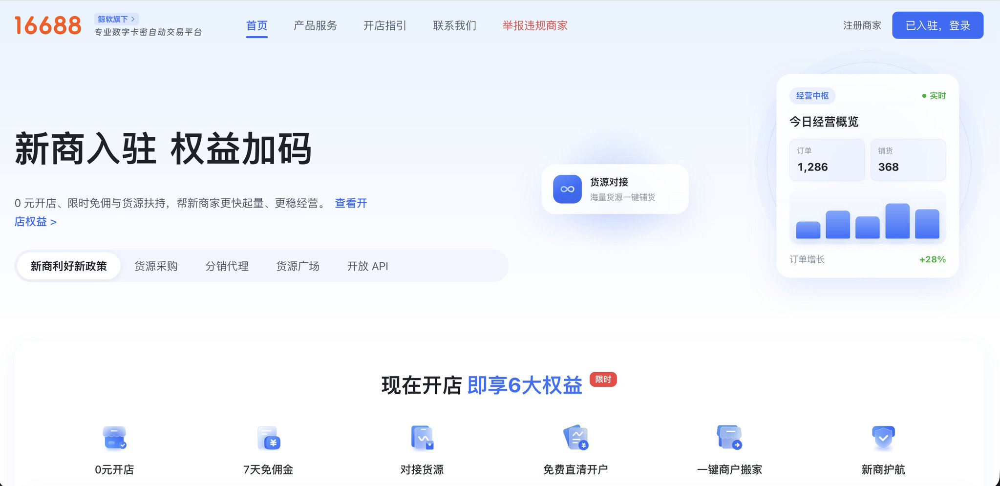
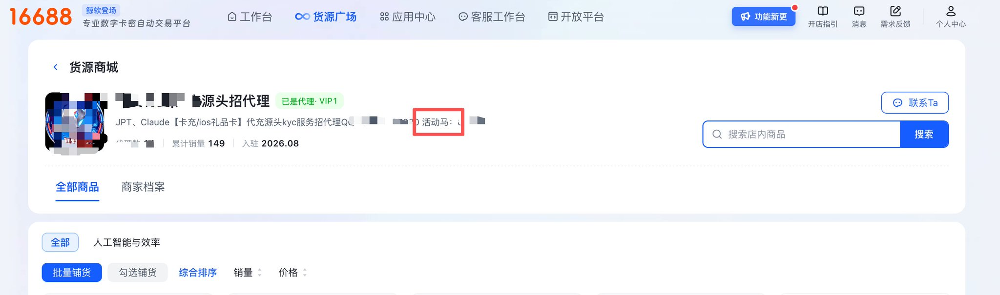
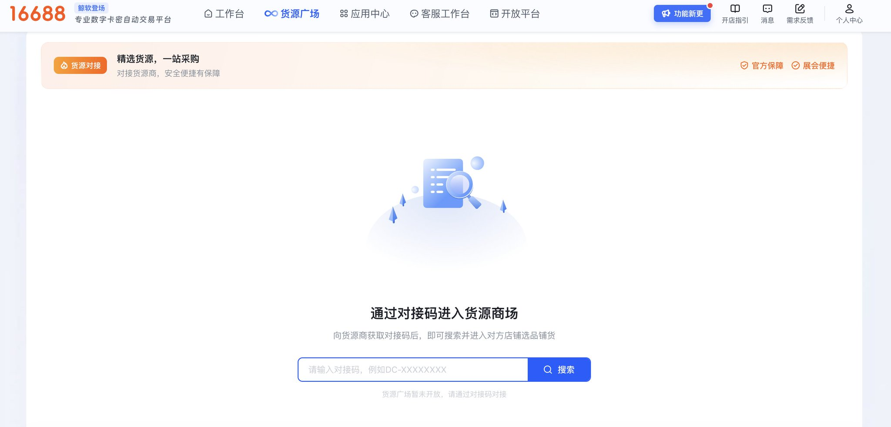
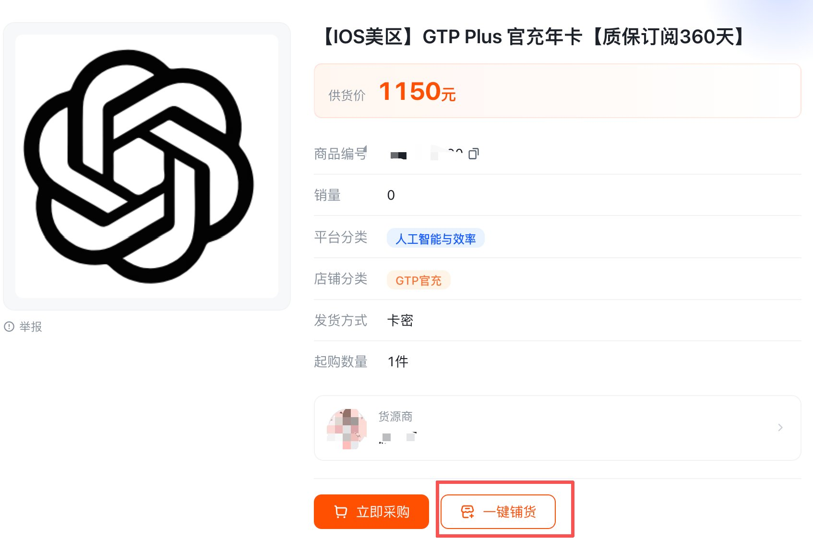
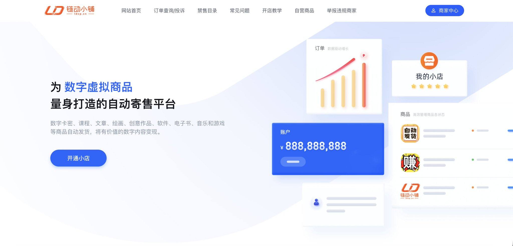
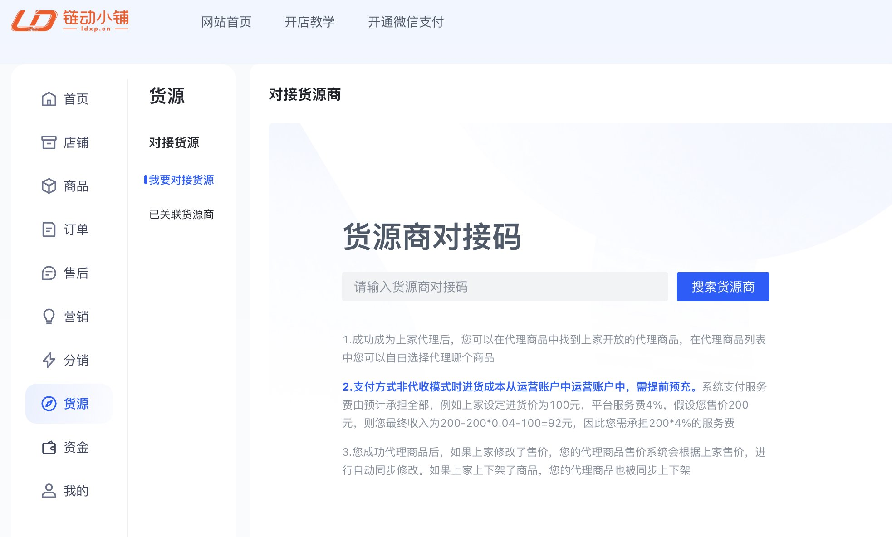
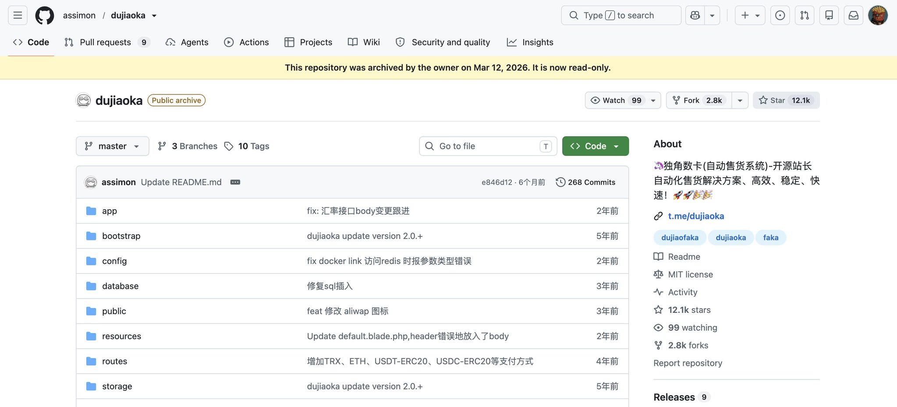

# 代充这门生意怎么做？从获客、货源到自动发卡，拆解一门小生意

@superwang · [X 原文](https://x.com/superwang/article/2096194855458218235)

很多朋友看了我上一次发的“AI订阅价格雷达”，私信和下面问的最多的一个问题就是。自己充值的问题解决了，但是想做代充生意，该怎么入局？

这一篇，把我知道的和了解的，尽可能的详细的写给大家。

写在最前，我始终认为没有必要在X上卷价格。

这篇文章内所有信息都是公开可查询的，我只是一个整理者。所以能上X的，也都是很聪明的小伙伴。国内有这么多人，这可都是刚需。所以把信息差留给墙内外吧。

做生意的本质，其实剥离掉所有包装后，核心就两条准则：**开源**和**节流。**

## 一、关于开源：获客不是死磕技术，先搞定人从哪来

做代充，其实最怕的不是搞不到货，而是手里压了一堆货。然后狠狠的发个朋友圈。到最后通讯录里面只有你妈给你点赞。连一个询价的都没有。

代充的核心是**信任交付。**用户为什么不直接自己官网充？要么是卡在支付方式上，要么就是怕麻烦，或者就是觉得便宜。你能赚到钱，本质上赚的还是**信息差**和**便利费**。

关于怎么搞流量，怎么低成本获客。[@Ansyn\_07](https://x.com/Ansyn_07) 昨天的文章已经写的很好了，很实操，很干货，有任何想做代充的之前可以去通读一遍。

把开源的问题想明白了，你就会发现：你的精力其实极其有限，应该有一大半都放在搞流量和做服务上，而不是去干苦力。所以这就引出了第二件事，就是节流。

## 二、关于节流：新手最大的蠢事，就是“手搓”

大部分新手死在代充的路上，都是被自己蠢死的。

一听别人说代充赚钱，第一反应是什么？要搞，要狠狠的搞。然后大概流程如下

- 自己跑去办一堆乱七八糟的海外虚拟卡（还要被吃开卡费和高额损耗）
- 再手动注册一堆乱七八糟的邮箱，想卖成品号
- 每次来个客户，自己战战兢兢开着梯子去手动充
- 然后风控一升级，卡也被封了，号也被封了，客户跑来问候你全家，辛辛苦苦赚了15块，赔给客户150

或者，自己盲目去找上游、买技术。

这种时候就会出现两件事。

第一件事，找到了靠谱上游，他把技术卖给你，然后你自己搓卡密，搓账号，然后垫了一堆钱，但是卖不出去。

第二件事，上游的利润点就是你。

所以醒醒吧，做生意是要追求利润率的，拿自己的时间去手搓，你不是在创业，你是在给大模型打纯人工黑工。

**真正的节流，使用最低的边际成本，拿到最稳定的上游渠道。**

这个可以看一下我的网站，上面罗列了各个平台和独立站的价格信息，自己去挑选一个合适的渠道。

## 三、代充渠道从哪里来的？

很多人会很好奇：为什么官方是20刀？但是有的人120也能卖，130也能卖。

这里面并没有一个统一的答案，因为不同的数字产品渠道结构都不一样。有的是官方促销，有的是代理，有的是批量采购。但是现在大多数代充其实都是地区套利。说白了就是低价区代充。这些信息网站上都有。

当然，其中还有一些是黑充或者骗子，这些这里就不展开。

## 四、如何从0开始搭建一个代充小店

此时，想做代充的你就有两种选择了。

第一，自己做节点、地区虚拟卡、自己充值、自己建卡密站、自己建发卡站、自己找下游、自己卖.....光是打这些我就已经力竭了，所以这种原生态的生意模式我也不详细展开了，因为很不推荐。这种就属于传统生意里的自己建工厂重资产投资。

第二，找上游，也就是已经有自己的一套“生产能力”的工厂，去当他们那里拿货，再卖给需要的人。

但是归根结底，是要先开个店的。

店铺的选择市面上有以下几种。提前声明，没有任何广告，全部是自己实操客观评价，请自行分辨。

### 1，16688平台

这个平台看名字也知道是模仿的谁了，所以就不多介绍功能。

这个网站的主要优势在于可以一键铺货，也就是说，你在我网站上选择这个平台的低价商品和店铺，在这个网站上注册好后是直接可以0成本售卖的。这就很适合小白。不需要垫一分钱，只要你有销售能力，你就能赚钱。

首先注册平台，注册后在我的网站上找到最低的几个此平台的商家，拿到下图所示的商家对接码

然后在下图中输入对接码

然后选择商品就好了，点击一键铺货，然后选择你的加价幅度，就会自动到你的小店里去。

最终做完之后，你的店铺效果就是这样的。下面是我自己的小店的链接，可以做参考

[https://www.16688.com.cn/shop/AIPRO](https://www.16688.com.cn/shop/AIPRO)

### 2，链动小铺

这个平台和刚才的那个平台功能大致一致。现在X上很多的代充站，包括TG上很多的代充站，也都是用的这个平台。

它的商品上架形式也和刚才前面的16688一致。也是拿上游商品的对接码，直接一键铺货就好了。对于小白最友好。

因为形式一样，这里就不再过多赘述了。

### 3，独角数卡

这个就需要有一定的动手能力的小伙伴来选择了。

独角数卡是GitHub上的一个开源程序，这个程序内有完整的业务闭环。

覆盖了商品、订单、支付、交付、用户中心和商家管理页面的核心流程。

里面也做了多种支付的接口。我在X上看到了很多独立代充站，也都是在这个架构上自己二开，或者根本就没开的。

选择这个，整体店铺的维护成本和开发成本，就要比前面两项要重的多。

你多了网站的部署工作，多了上架流程，多了后期的维护。但是好处也是显而易见的，就是相比于平台来说，店铺的装修更灵活，独立站的页面也更好看。

但是整体的架构还是没有变。只是你需要自己去完成一些事情。

1，上游渠道（卡密生态）

市面上早就有极其成熟的卡密源头。无论是批量成品号、兑换卡密、还是直接授权的充值接口。价格都非常低。（就像我雷达里刷出来的那些低价源）

你也完全不需要碰卡，不用承担风控的风险，你只认卡密。坏号有上游质保补单，你做的就是无风险的中间商。

2，中转与交付

市面上也有很多开源的发卡系统。这些都可以使用，因为涉及到其他东西，这里我就不截图了。很多发卡网所以发货全部都可以实现自动化。

用户下单-自动发卡密-用户到你的发卡站进行cdk的验证、自助提交session，然后等待到账。

3，你的核心壁垒：定价和包装

上游拿到的卡密，在你的店里包装成稳定无忧版。用户省了心，上游出了量，你吃掉了净利润，连电脑都不用开。这难道不比自己垫钱开卡区手搓要好的多吗？

## 五、选择上游的几个关键因素

我现在自己看一个渠道，价格肯定是第一眼会看的。但是看完价格之后，还是会继续看一些其他的东西。

比如货稳不稳？库存够不够？交付快不快？出了问题有没有人管？

这几个东西其实比单纯的低价要重要的多。比如同样便宜5%。一个渠道每天都有货，一个渠道经常缺货。

那如果你已经开始投流，或者有固定的客户，缺货本身就是损失。

再比如售后，卡密失效怎么办？订单发错怎么办？产品规则突然变化怎么办？渠道方是退款、补码还是直接不认？那这些东西只有真正做过几单才会意识到重要。

所以对于我前两天做的那个AI订阅价格雷达的网站来说，我也只能解决其中一个很小的问题。

我的网站目前可以帮你了解今天哪里最便宜，但是暂时还没法知道哪个渠道的价格比较稳定，谁又突然涨价，谁又长期维持在一个区间，或者哪个产品有套利的空间。所以后面我网站的继续方向就是把库存和历史价格的变化加进去。

对于真正想做生意的人来说，一次的最低价参考价值其实有限。

**长期稳定的成本才更有意义**，这是我建议选择源头的很重要的一点。

## 写在最后

代充这门生意。把它拆开后，其实没有想象中那么神秘。

甚至可以说就是一个再简单不过的商业流程。上游生产，中游当二道贩子，下游获得方便。

那对于我们来说，无非就是一条供应链：找到客户、找到货、把货交给客户。

这也是我为什么推荐用平台的方式。因为最开始的时候，你根本就不知道你的第一个用户到底从哪里来？当订单多了以后，再慢慢把你的人工变成自动化，再慢慢把上游的价格一点点的压缩。而不是一开始就花几天时间去找到一个便宜两块钱的上游。

**在刚开始，怎么样持续的获得客户，要比怎么样找到更便宜的上游更重要。**

如果对你有帮助，就请给我点个赞吧。
