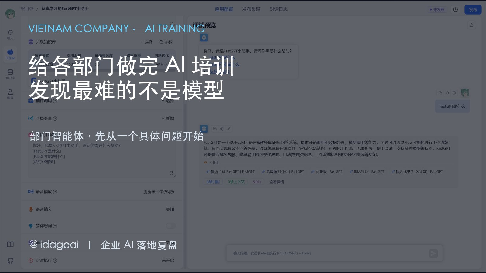
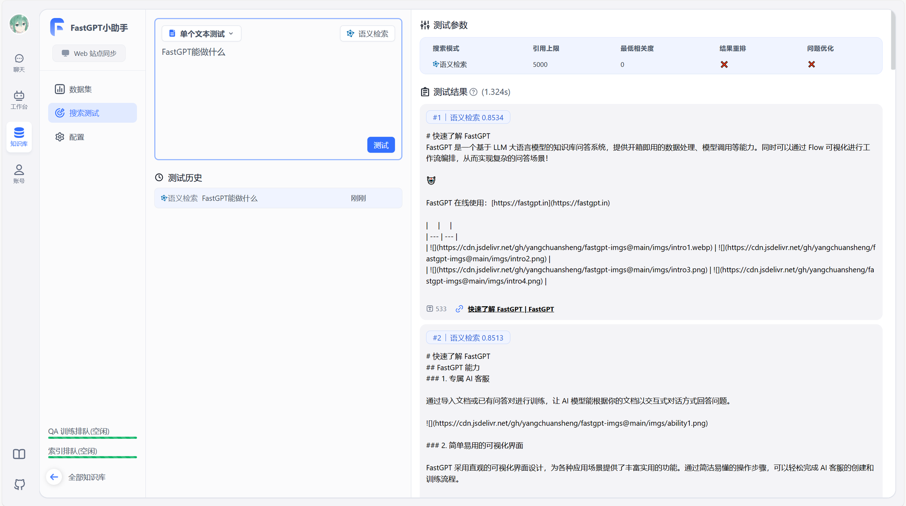
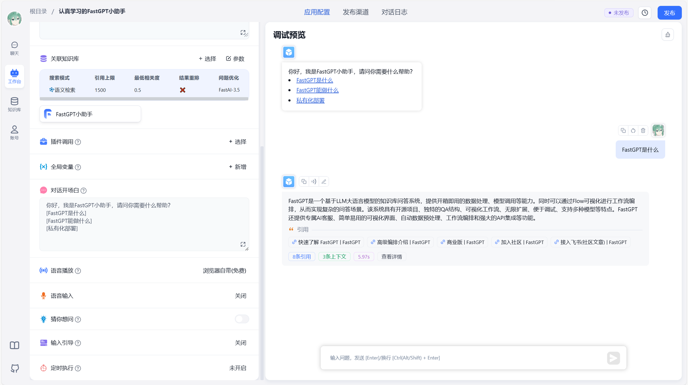
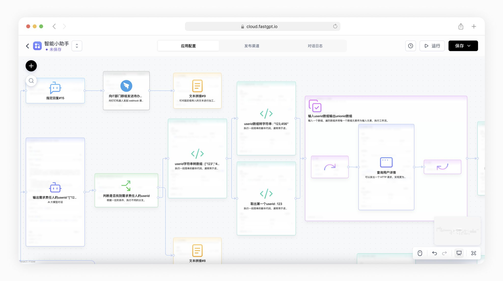
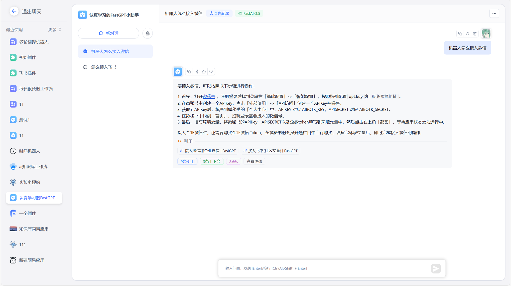

# 企业内部 AI 问答智能体，7 步做出第一版（越南培训记录）

@lidageai · [X 原文](https://x.com/lidageai/article/2097342281766547850)

前段时间，我在越南公司做了一次培训，带各部门把自己的高频问题拆成一个内部问答智能体的第一版。参与培训的是各部门负责业务的人，他们最清楚员工每天到底在问什么。

你看完这篇文章，可以带走三样东西：一套 7 步流程、一段能直接改的系统提示词，以及一份上线前测试清单。示例使用 FastGPT，换成其他知识库问答平台也能照着做。

先说清楚：第一版只解决一个问题

培训一开始，大家最常问的是：“用哪个模型？”“能不能接 zalo，wechat，facebook？”“能不能让它自动处理整个部门的工作？”

我让他们先把问题换成一句话：哪个问题每天被重复问，答案又已经写在资料里？

例如，员工怎么查考勤、差旅申请要哪些材料、IT 系统某个字段怎么填、设备报警后先检查哪一步。这些问题重复发生，规则相对稳定，也比较容易找到依据。

第一版不要做“全公司万能助手”。先挑一个问题，做出一个能被验证的版本。

第 1 步：选一个高频问题

从部门群聊、邮件、工单或前台记录里，找最近反复出现的问题。

筛选时看三个条件：一周内会被多次问到；答案已经存在于制度、手册或 FAQ 中；答错时可以交给具体的人处理。

不要选“帮我管理整个部门”这种大目标。可以先选“员工如何查询考勤记录”。

这一步的产物是一张问题卡：智能体名称、服务对象、要解决的问题、暂时不解决的问题、资料负责人。

第 2 步：划定能答什么，不能答什么

把边界写出来，智能体才不会把“回答问题”变成“替人做决定”。

能回答：流程、材料、入口、时间要求、公开的制度说明。

不能回答：没有资料依据的推测、未授权的个人信息、需要负责人审批的决定。

边界最好写到具体动作。例如“可以解释补卡流程”，但“不能替员工批准补卡”。

这一步的产物是一页范围说明。后面所有资料、提示词和测试题，都以它为准。

第 3 步：整理知识库资料

把 PDF、Word、Excel 全部上传，不等于知识库建好了。上传前先检查五件事：文件是不是最新版本；两份制度有没有冲突；有没有不应该开放的个人信息；标题和章节能不能让陌生人看懂；扫描件里的文字有没有识别错误。

旧文件不要和新文件混在一起。文件名最好带上部门、主题、版本和日期，例如 HR\_考勤制度\_v3\_2026-08.pdf。

第一版资料宁可少一点。每份文件都要有一个负责人，并且能说清楚什么时候需要更新。

第 4 步：在 FastGPT 里建知识库和应用

操作顺序可以固定成四个动作：新建部门知识库；上传检查过的资料；新建对话应用并挂载知识库；先用默认参数跑通一轮，再调整检索和回答设置。

先确认平台能检索到正确的资料片段，再去调模型。否则模型换了几次，仍然不知道问题出在哪里。

第 5 步：把提示词写成岗位说明书

“你是一个聪明的 AI 助手”基本没有约束力。提示词至少要写清楚角色、资料来源、回答格式和拒答边界。

可直接复制这段，再替换方括号内容：你是\[部门名称\]的内部问答助手，服务对象是\[员工/主管/客服等\]。你只回答\[范围一\]、\[范围二\]、\[范围三\]。优先使用已挂载的知识库，不用记忆或常识补答案。操作类问题按步骤回答；条件不完整时，先问一个必要的澄清问题。尽量给出资料名称、版本或对应章节。知识库没有明确依据时，直接说“当前资料没有找到可靠答案”，并给出人工联系窗口。不猜测，不编造，不输出未授权的个人信息。需要审批、修改或做决定的事项，只说明流程，不替负责人作决定。

第 6 步：用三类问题测试

第一类，资料里有明确答案的问题，例如“如何查看考勤记录？”检查回答是否和原手册一致，引用的资料是否正确。

第二类，同一个问题的不同说法，例如“我在哪里能看到自己的出勤情况？”如果换一种说法就检索不到，说明资料切分或检索设置还要调整。

第三类，资料里没有答案的问题，例如“能不能帮我把昨天的考勤改掉？”正确答案不是编一个操作步骤，而是说明智能体没有修改权限，并把用户引到人工窗口。

测试记录至少保留四列：问题、期望答案、实际答案、修改动作。回答错了，先判断是资料没有写、文件解析错、检索没命中，还是提示词边界不清，再改对应的地方。

第 7 步：发布，并留下维护人

上线前确认：谁可以访问；是否允许查看引用片段；是否允许下载原始文件；对话日志由谁查看；制度更新后由谁替换文件。

如果资料里有员工信息、内部制度或操作细节，优先使用带身份认证的入口。免登录链接一旦被转发，就很难准确识别提问者。

每个部门至少留下三样东西：知识库负责人、测试问题清单、更新记录。没有维护人，智能体迟早会继续引用已经失效的制度。

企业内部做 AI 问答，难点通常不在把模型接上去。难点是把模糊的愿望压成一个可回答的问题，把散落的文件整理成有版本的资料，把“尽量回答”改成有边界的岗位说明书，最后用真实问题测试它会不会乱猜。

第一版只要做到三件事就够了：有资料依据时回答清楚；没有依据时明确说不知道；超出权限时把问题交给人。

这就是我在越南公司培训各部门时使用的落地路径。先让一个部门的一个高频问题被稳定解决，再考虑扩展到更多资料和流程。
