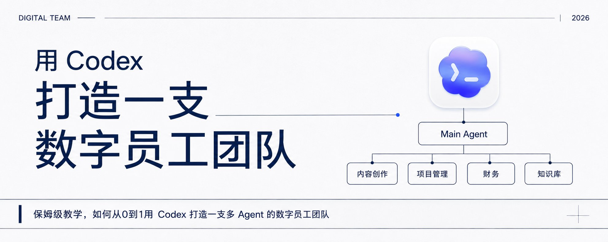
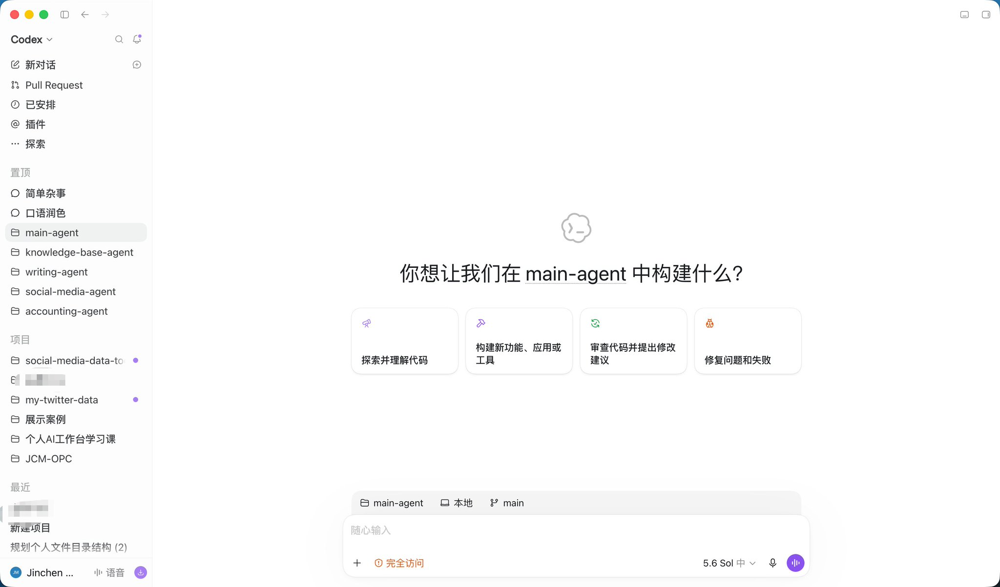
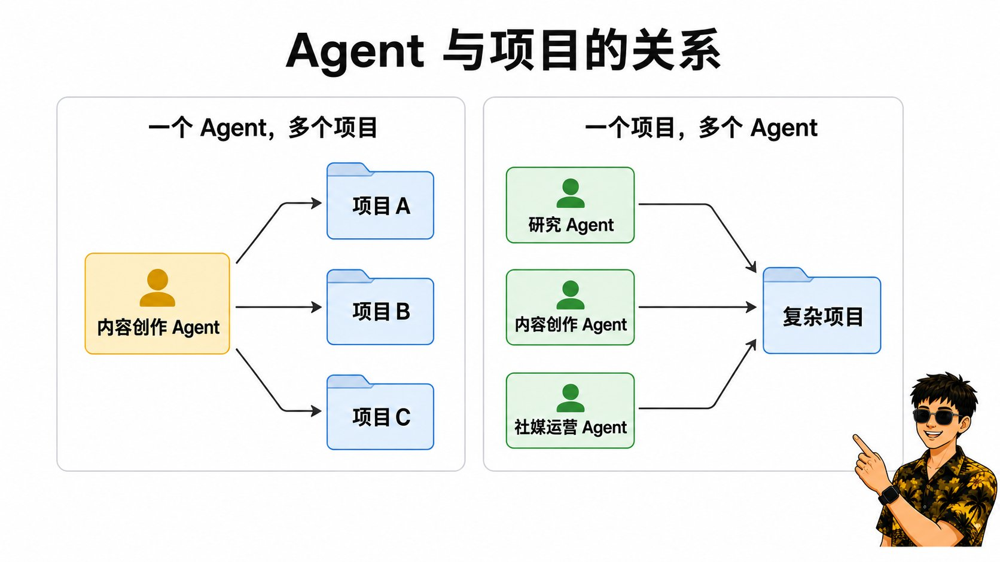
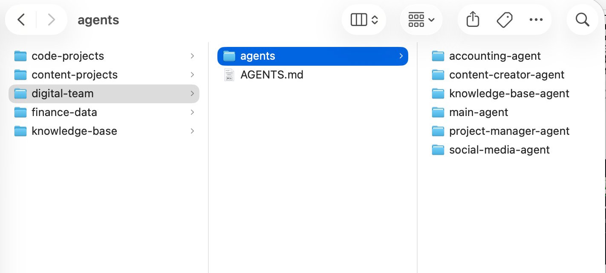
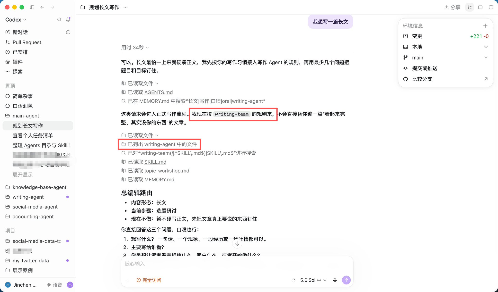
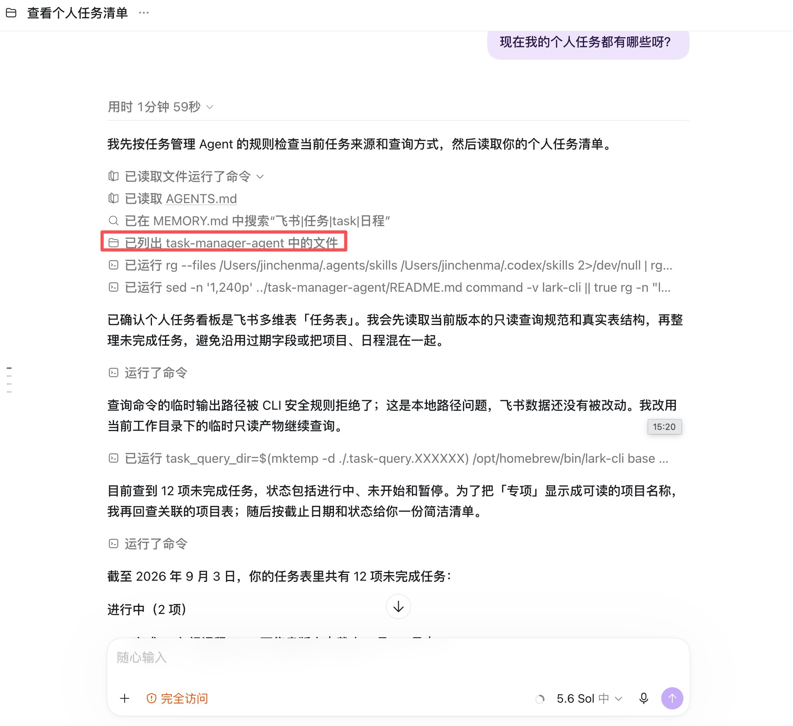

# 保姆级教学｜如何从0到1用Codex打造一支多Agent数字员工团队

@jinchenma_ai · [X 原文](https://x.com/jinchenma_ai/article/2095713255968694405)



朋友们大家好啊，我是金尘马。

昨天我写了一篇关于 Grok Bot 使用的文章，目前已经有 80 多万浏览量了。


文章发出去以后，很多朋友来问我：没有 Grok Bot 相应的会员，或者额度不够，怎么办？大家手里更常用的还是 Codex。

那能不能用 Codex，也搭建一套这样的多 Agent 数字员工体系？

当然是可以的。

**我自己现在就在用一套目录式的方案。** 内容创作、项目管理、财务、知识库管理等工作，都可以交给对应的岗位 Agent。每个 Agent 都有自己的文件夹，里面保存它的职责、规则、Skill、工作流程，以及访问所需资料的方式。

**用户平时可以只和 Main Agent 说话。它像一个数字总经理，会根据任务找到对应的岗位 Agent。** 已经知道自己要找谁时，也可以直接进入那个岗位 Agent 工作。

这篇文章，我会带着大家从 Main Agent 开始，逐步搭建一套属于自己的数字员工团队。


## 为什么要按工作职责划分 Agent

很多人现在已经在用 Codex 工作了，但工作方式还是有问题就开个对话。

今天让它写文章，明天又让它整理任务。过几天处理账单时，还得重新交代背景、规则、保存位置和需要避开的问题。

当任务只有一次时，这么用完全没问题。

当某类任务开始重复出现，每次都靠对话重新交代，问题就出来了。上一次改好的规则没有留下来，不同工作的资料混在一起，AI 也很难稳定判断现在应该按哪种流程做。

还有一个常见情况，就是把所有 Skill 都放到全局位置。

Codex 启动时先看到的是 Skill 的名称、描述和路径，选中以后才会读取完整指令。初始 Skill 列表也有上下文预算，数量太多时，描述可能被缩短，甚至有一部分会被省略。

所以，Skill 不会一开始就把 Token 全部吃掉。数量太多以后，Skill 的匹配和管理都容易变乱。

**按工作职责划分，可以让每一类长期工作拥有自己的边界。**

内容创作 Agent 承担内容生产职责，覆盖选题到发布。财务 Agent 长期处理账单、记账和对账，需要时再分析财务数据。项目推进过程中涉及任务、截止时间和日程，就交给项目管理 Agent。

这些 Agent 处理的事情可能有交集，但各自的长期职责、数据、工具、工作流程和操作权限都不一样。分开之后，每个 Agent 只需要理解自己的工作。

## 项目和 Agent 有什么区别

这里有两个很容易混在一起的概念。

**项目通常围绕某一个明确的对象或目标建立。**

一个代码仓库可以是一个项目，一次新产品上线也可以是一个项目。项目的边界由当前要处理的对象决定，里面保存相关文件、对话、当前上下文和阶段性交付物。

**Agent 对应一项长期存在的工作职责。**

内容创作 Agent 今天可以写数字员工，明天可以写 AI Coding，以后还可以处理其他内容项目。它所处理的项目会不断变，内容创作这项职责下的方法、技能、资料和质量要求可以长期留下来。

**这里容易绕的一点是，工作组织和 Codex 界面说的是两回事。** 前面讲的是项目和 Agent 在工作组织上的区别，到了 Codex 里，两者都可以以「项目」的形式加进来。

比如，内容创作 Agent 本身就是一个文件夹。我们可以把这个文件夹作为一个本地项目加到 Codex，设为主文件夹。从这里开启对话时，Codex 会自动发现这个 Agent 的 AGENTS.md、Skills 和配置文件。在 Codex 的界面上，它看起来仍然是一个项目；在我们的数字员工体系里，这个目录承载的是一个长期岗位。



这个 Agent 也可以处理其他目录里的工作。我们可以把文章目录、代码仓库或知识库作为其他文件夹附加到同一个本地项目中。这样，Agent 可以在自己的岗位规则下，去搜索、读取和修改这些目录中的文件。

不过，这种「可以操作其他项目」的能力不是默认无限制开放的。相关目录需要先被加入工作范围，它能读什么、改什么，还会受到沙箱和权限配置的限制。其他文件夹中的 AGENTS.md、Skills 和配置文件也不会自动成为当前 Agent 的规则。

**从工作组织的角度看，一个 Agent 可以服务多个项目，一个复杂项目也可以由多个 Agent 合作完成。**



比如一篇长文，可能先由研究 Agent 搜集资料，再由内容创作 Agent 完成写作，最后交给社媒运营 Agent 发布。反过来，内容创作 Agent 也可以连续处理很多个完全不同的内容项目。

## 日常怎么使用这套数字员工团队

**日常使用时，Main Agent 就是默认入口。**

它像整支团队的数字总经理。平时遇到任何事情，都可以先和它说。它会理解需求，判断由哪个岗位处理。需要多个 Agent 时，它还要安排顺序，最后把结果统一交付回来。

这里说的路由，发生在当前这次任务里。Main Agent 会继续读取对应岗位的 AGENTS.md 和 Skill，然后按照这套岗位配置完成工作。整篇文章里的多 Agent，指的就是这套目录角色切换。

下面这些情况，直接找 Main Agent 最省事：

- 还没有想清楚具体要做什么。
- 不知道应该找哪个岗位。
- 一个任务需要多个 Agent 合作。
- 只是普通问答，没有必要进入专业流程。

已经有明确目标时，也可以直接进入对应的岗位 Agent。

比如今天就是要写一篇长文，希望内容创作 Agent 的规则、文风和写作资料从对话开始就成为默认上下文，那就直接打开内容创作 Agent。

准备在同一岗位内连续干活，或者任务需要该岗位的专属数据和工具，也适合直接进入对应的 Agent。修改、调试这个 Agent 本身时，同样可以直达。

**平时默认先找 Main Agent。事情已经很明确，而且准备在同一个岗位里连续工作，就直接进入对应的 Agent。**

## 怎么判断要不要新建 Agent

实际搭建时，最容易发生的事，就是刚开始很兴奋，一口气创建十几个 Agent。

要是照着现实公司的岗位表一口气把目录全建出来，最后大部分只是空文件夹。

我现在更倾向于从现实世界的独立岗位出发，再加上一道门槛。

**这类工作需要稳定、重复出现，而且它至少有一项专属资源：**

- 单独的工作规则。
- 专属的 Skill 或工具。
- 独立数据源或文件目录。
- 与其他岗位不同的操作权限。
- 固定的交付位置或验收方式。

比如内容创作需要个人素材、文风和审稿流程，很适合做成独立 Agent。

今天写 AI，明天写职场，只是写作主题变了，没有必要再建两个 Agent。想换一种语气时，可以先考虑在同一个 Agent 里增加风格文件或 Skill。

人设也可以加，但它是可选项。

如果某种语气、价值偏好或交互方式会改变实际交付，就把它写进规则。只为了让数字员工看起来更像真人，没有必要给它编完整履历。它能不能干好活，还是要看职责、流程、数据和验收标准。

## 一套数字员工团队的目录结构

先在电脑里建一个目录，可以叫 digital-team。

知识库、文章、代码仓库和财务数据等实际工作对象，可以继续保存在各自的目录里。把整个工作区画出来，大概是这样：

```text
workspace/
├── digital-team/                         # 数字员工团队
│   ├── AGENTS.md                         # 团队索引和公共边界
│   ├── agents/
│   │   ├── main-agent/
│   │   │   └── AGENTS.md
│   │   └── content-creator-agent/
│   │       ├── AGENTS.md
│   │       ├── skills/
│   │       │   └── longform-writing/
│   │       │       └── SKILL.md
│   │       └── .agents/
│   │           └── skills/
│   │               └── longform-writing -> ../../skills/longform-writing
├── knowledge-base/                       # 个人知识库
├── content-projects/                     # 文章、课程等内容项目
├── code-projects/                        # 网站、工具等代码项目
└── finance-data/                         # 账单和财务数据
```



这张图只是为了说明它们之间的关系，实际使用时不用非得把所有目录搬到同一个 workspace 里。

照着创建时，先建好 digital-team、main-agent 和 content-creator-agent 三层目录，再分别创建根目录、Main Agent 和内容创作 Agent 的三个 AGENTS.md。完成这些以后，再添加长文写作 Skill。

**Agent 目录保存的是它怎么工作，包括岗位职责、规则、Skill、工作流程和必要配置。知识库、文章项目、代码仓库和财务数据，保存的是它要处理的工作对象。**

这样，同一个 Agent 就可以连续处理多个项目。需要某类数据时，再把对应目录加入 Codex 的本地项目，或者在规则中写明它应该通过什么工具去访问。Agent 的能力配置和业务数据可以各自维护，也不用为了换一个 Agent 就复制一份项目数据。

**\`digital-team\` 只负责保存团队索引和各个 Agent，本身不挂任何岗位专属 Skill。**

每个 Agent 在自己的目录里管理自己的能力。以内容创作 Agent 为例，skills/longform-writing/ 保存长文写作 Skill 的源文件，.agents/skills/ 则是 Codex 在这个 Agent 目录下发现 Skill 的入口。这里用软链接把两处连起来，避免维护两份内容。

这样设置以后，直接把 content-creator-agent 作为项目打开时，Codex 可以自动发现长文写作 Skill。从 digital-team 的 Main Agent 进入时，Codex 不会向下扫描并自动发现岗位 Agent 目录里的 Skill，所以 Main Agent 的路由规则还需要明确告诉它继续读取哪个 Agent，以及这个 Agent 目录里的哪一个 Skill。

目录名可以继续使用英文小写，但它对应的角色要按现实岗位命名。比如 content-creator-agent 对应内容创作岗，不要按某一次任务起名。

根目录的 AGENTS.md 是团队索引和公共边界。它告诉 Codex 这里有哪些员工，默认入口在哪里，以及各个岗位的规则不能随意混用。

main-agent/AGENTS.md 是数字总经理的工作说明。它保存路由表，知道什么任务要交给内容创作 Agent。

content-creator-agent/AGENTS.md 保存内容创作岗位的职责、边界和可用能力。

longform-writing/SKILL.md 负责一条可复用的长文写作流程。**Agent 表示谁来处理，Skill 表示它具体怎么完成某类工作。**

如果暂时不熟悉软链接，也可以直接把 Skill 放在 content-creator-agent/.agents/skills/longform-writing/ 里。先跑通，后面再考虑怎么统一管理源码。

## 先写好根目录规则

Codex 启动时会构建一条 AGENTS.md 指令链。在项目内，它会从项目根目录一直走到当前工作目录，读取这条路径上的规则文件。越靠近当前目录的指令，在合并后越靠后，因此可以覆盖前面的通用指导。

假设 main-agent 和 content-creator-agent 是两个并列目录，Codex 不会因为看到了 agents/ 文件夹，就自动读取所有兄弟目录中的 AGENTS.md。

所以，我们要在根规则里明确写出默认入口和 Agent 索引。

最小版本可以直接这么写：

```markdown
# Digital Team

这个目录用于管理个人数字员工。

## 入口规则

- 用户没有明确指定岗位 Agent 时，先完整读取 `agents/main-agent/AGENTS.md`。
- 用户明确指定某个岗位 Agent 时，直接读取对应目录的 `AGENTS.md`。
- 不同岗位 Agent 的规则不自动混用。
- 无法匹配已有岗位时，由 Main Agent 按普通任务处理。

## Agent 索引

- `agents/main-agent/`：默认入口，负责普通对话、任务路由和结果整合。
- `agents/content-creator-agent/`：内容创作岗，负责选题、素材、写作、审稿和内容交付。
```

这个文件不需要写得很长。

根目录负责索引和公共边界，岗位细节留在各自的 Agent 里。否则每新增一个员工，根规则都会越来越胖。

这里的路径都从 digital-team 根目录出发，所以 Main Agent 写成 agents/main-agent/AGENTS.md。根规则里不需要出现内容创作 Agent 的 .agents/skills/，因为那是它独立作为项目启动时使用的 Skill 发现入口。

## 配置数字总经理

接着写 agents/main-agent/AGENTS.md。

它的任务是接收用户请求，判断需不需要进入某个岗位，然后做最小路由。

```markdown
# Main Agent

## 职责

- 作为用户的默认入口。
- 直接处理普通对话和不需要专属资源的任务。
- 任务需要岗位专属的规则、Skill、数据源、工具或操作权限时，进入对应的 Agent。
- 横跨多个岗位时，安排处理顺序并整合结果。

## 路由

- 需要创作、改写、审稿或定稿正式内容时，完整读取 `../content-creator-agent/AGENTS.md`，再按照其中写明的路径读取所需 Skill。
- 只是讨论写作方法、偶然问一个知识问题，可以由 Main Agent 直接处理。

## 输出

- 正常使用时，直接向用户返回结果，不展示不必要的内部路由过程。
- 用户要求调试时，说明本次读取了哪些规则、选择了哪个 Agent。
```

这里又换了一个路径起点。当前文件位于 agents/main-agent/，所以相邻的内容创作 Agent 要写成 ../content-creator-agent/AGENTS.md。进入内容创作 Agent 以后，再由它读取自己目录下的 skills/longform-writing/SKILL.md。

路由规则最好同时写清楚什么时候用、什么时候不用。

如果只写「遇到写作任务就进入内容创作 Agent」，用户问「你觉得这个选题怎么样」，它也可能马上启动一整套正式写作流程。加上反例之后，边界会清楚很多。

## 配置第一个岗位 Agent

现在来写 agents/content-creator-agent/AGENTS.md。

刚开始只要写清楚五件事：它是谁，负责什么，不负责什么，可以用哪些能力，最后交付什么。

```markdown
# Content Creator Agent

## 岗位

你负责内容创作岗，围绕正式内容的规划、生产和交付开展工作。

## 职责

- 处理选题、素材、大纲、初稿、审稿和定稿。
- 在写作前读取当前项目的可用素材和风格要求。
- 正式长文使用 `longform-writing` Skill。
- 如果当前任务由 Main Agent 路由进来，完整读取本 Agent 目录下的 `skills/longform-writing/SKILL.md`。

## 不负责

- 不管理个人账务和任务看板。
- 不编造作者经历、数据和案例。
- 不读取与写作无关的私人数据。

## 交付

- 输出符合用户确认的读者、主线和风格要求的文章。
- 缺少会改变结论的素材时，停下来询问，不自行填补个人经历。
```

如果希望它的表达更有个人感，可以再增加几条会改变交付的人设规则。比如「像一个亲自试过的同行和读者说话」，或者「发现作者的判断有问题时直接指出」。

岗位职责和验收标准要先写清楚，人设放在后面补充就行。一个性格非常饱满、却不知道怎么验收文章的 Agent，很难稳定干活。

## 把长文写作 Skill 挂进来

Agent 定义好岗位以后，还可以给它增加具体工作流程。

这篇文章不展开长文 Skill 里的每一个步骤，先用一个最小版本说明它的位置和触发条件。

```markdown
---
name: longform-writing
description: 在用户要求创作正式长文、教程或公众号文章时使用。普通问答和简短改句不使用。
---

# Longform Writing

- 写作前确认选题、读者和可用素材。
- 先产出大纲，等待用户确认。
- 大纲确认后再写正文。
- 不编造用户经历和未核实数据。
```

直接从内容创作 Agent 启动时，Codex 能否自动选中这个 Skill，很大程度上取决于 description。所以这里需要写清楚「什么时候用」，同时写上「什么时候不用」。从 Main Agent 路由进入时，则按照前面配置的明确路径读取，不依赖 Codex 向下扫描。

将它保存到 agents/content-creator-agent/skills/longform-writing/SKILL.md。

接着进入内容创作 Agent 的目录，为它建立自己的 Skill 发现入口：

```bash
cd agents/content-creator-agent
mkdir -p .agents/skills
ln -s ../../skills/longform-writing .agents/skills/longform-writing
```

执行完成以后，可以在当前目录使用 ls -l .agents/skills/ 检查软链接是否指向正确目录。

如果直接把 Skill 放在 agents/content-creator-agent/.agents/skills/longform-writing/ 里，就不需要执行这条软链接命令。

## 跑通第一条路由

现在，在 Codex 中把 digital-team 设为项目的主文件夹，然后开一个新对话。

发送一句：

```text
我要创作一篇文章。
```

按照刚刚写好的规则，整条链路应该这样运行：

```text
用户提出正式写作需求
  → 根 AGENTS.md 要求读取 Main Agent
  → Main Agent 判断这是正式写作任务
  → 读取 content-creator-agent/AGENTS.md
  → 按岗位规则读取 skills/longform-writing/SKILL.md
  → 按 Skill 要求询问选题、读者和素材
```

不能只看 Codex 有没有回复一句「好的，我来写」。真正的跑通标志有三项：

- 它有没有进入内容创作 Agent 的职责范围。
- 它有没有按岗位规则读取长文写作 Skill。
- 它是否按 Skill 中规定的第一步开始工作。

如果没有跑对，可以先进入调试模式，直接问：

```text
请说明你这次读取了哪些 AGENTS.md，进入了哪个 Agent，读取了哪个 Skill，以及判断理由。
```

这句话可以帮助我们找到具体问题。可能是根入口没有读到，也可能是 Main Agent 路由写得太模糊，或者岗位 Agent 里写的 Skill 路径不正确。

路由测试还要覆盖一条不应命中的请求。

再发送一句：

```text
我有个写作方法想和你讨论一下。
```

按照前面的边界，这句话可以先由 Main Agent 当成普通讨论处理，不应该马上启动完整的长文写作流程。

**正例和反例都跑对了，这个最小团队才算真正可用。**



## 从两个 Agent 扩展到个人团队

前面的写作链路跑通以后，再根据真实需求增加新岗位。

比如经常要做项目拆解、任务安排和进度跟踪，可以新建 project-manager-agent。它的目录中保存项目管理规则、任务字段、日程安排方式、可用工具和写入边界。

以后只要和 Main Agent 说：

```text
帮我记录一个任务，下周一前完成文章配图。
```

Main Agent 就可以把这件事交给项目管理 Agent。后者按自己的字段和分类规则，调用对应工具写入飞书看板，再返回可以核对的结果。



到了这一步，Agent 已经有了自己的数据、工具和交付位置，可以按岗位规则直接完成任务。

同样的方法还可以用来增加财务 Agent、知识管理 Agent 或社媒运营 Agent。每次只加一个真正有任务的岗位，跑通后再继续扩展。

## 隐私、数据和权限

数字员工开始读取真实文件、连接私人账号以后，安全边界就必须同时跟上。

**第一步是把数据分开。**

内容创作 Agent 可以读取创作素材，没有理由默认拿到银行卡信息。财务 Agent 需要读取账单，也没有必要同时拥有社媒账号的发布权限。

**每个 Agent 只拿完成岗位职责必需的数据。对于高敏感信息，尽量使用独立文件位置、独立账号和最小权限凭证。**

token、密码、私人账号和银行卡信息不要写进公开的 AGENTS.md，也不要放进准备分享给别人的模板。规则文件只写它可以读取哪类凭证、通过什么方式读取，以及它允许做哪些操作。

操作权限也要分级。

查询和生成草稿的风险通常比较低。新建记录、修改现有数据时，要先确认目标。删除、批量修改、付费和对外发布，应该在执行前让用户看清对象和后果。

还有一点很容易被忽略。

在 AGENTS.md 里写一句「不读取私人账户」，它提供的是行为指导。真正的强隔离还需要靠文件权限、可写目录、网络访问和工具审批。

Codex 的沙箱模式决定它在技术上可以做什么，审批策略决定哪些动作需要停下来征求许可。这两层需要配合使用。

一个内容创作 Agent 如果只需要读写文章目录，就不要把其他私人目录全部附加进它的项目。一个只负责查账单的财务 Agent，可以先只给查询权限，等真的需要修改数据时再扩大授权。

**规则负责告诉 Agent 应该怎么做，权限负责限制它最多能做到哪里。两个都要有。**

## 怎么让这支团队长期可用

这套系统不需要在第一天就设计完。

我自己的 Agent 团队也是跟着真实任务逐步扩展的。有了项目和任务管理需求，再建项目管理 Agent；内容创作开始稳定重复，再建内容创作 Agent。后面遇到同一个错误几次，才把解决办法写成长期规则。

日常维护可以只做三件事：

1. **重复问题再进入规则，** 一次性的特殊要求留在当前对话。
2. **修改路由和 Skill 描述后，** 重新跑一遍应命中与不应命中的测试。
3. **定期删掉过时规则，** 检查数据路径、账号和操作权限。

**目录式设计还有一个很现实的好处，就是迁移方便。** 岗位职责、规则、Skill 和工作流程都保存在自己的文件里。以后换成 Claude Code、Hermes、WorkBuddy 或其他 Agent Harness，只需要简单适配入口和调用方式，**整支数字员工团队基本可以做到无痛迁移。**


## 写在最后

用了这套方法，你可以先从一个自己最常用的岗位开始。后面出现新的长期工作职责，就继续给自己招聘新的数字牛马。

我觉得，这就是技术平权很有意思的地方。过去只有少部分人能拥有一支分工明确的团队，还能给每个岗位配好流程和资源。**现在，普通人也可以用数字员工建立一套有明确分工的工作方式。**

**这么一想，我们也算终于体验了一把当老板的感觉。**

金尘马｜大厂程序员｜30天X破万粉变现过万｜持续分享 AI 搞钱、程序员转型、OPC 心得｜联系方式见主页介绍：[https://x.com/jinchenma\_ai](https://x.com/jinchenma_ai)
