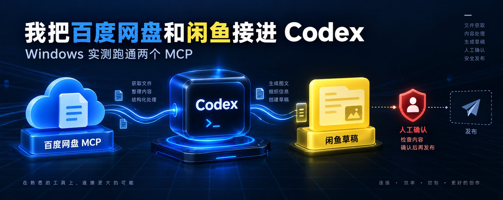
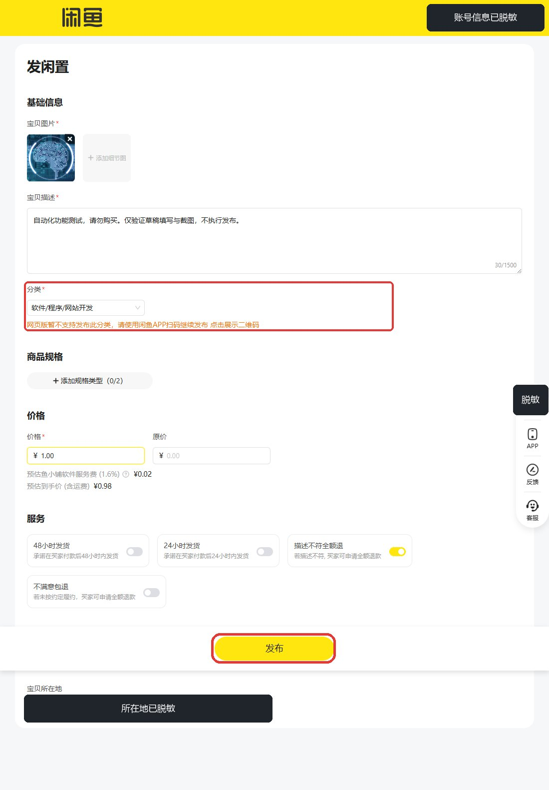

# 小白教程｜用 Codex 自动上架闲鱼虚拟产品：百度网盘＋闲鱼 MCP 实测

@jinli_lg · [X 原文](https://x.com/jinli_lg/article/2097278105257934923)



如果你是小白，想在闲鱼卖虚拟产品，最麻烦的通常不是“有没有资料”，而是每天重复做同一套动作：去网盘翻文件、整理封面、写商品文案、填价格，再一件一件上架。

现在有个开源项目，把百度网盘和闲鱼都接成了 MCP。理想状态下，你只要对 Codex 说一句：

\> ***去网盘找到我要卖的资料，准备封面和文案，帮我填成一条闲鱼商品。***

AI 就能从网盘检索资料，调用闲鱼网页，把图片、描述、分类和价格自动填进发布页面。对想靠虚拟产品赚到第一笔副业收入、又不会写代码的人来说，这套流程最有吸引力的地方很直接：

但我先把边界讲清楚。这个项目能帮你自动化“找资料和填草稿”，不会自动给你合法货源，也不会保证流量、成交或收入。闲鱼真实发布、账号风控、虚拟产品版权和售后，仍然要由你自己负责。

这是一篇从零开始的小白实操教程。我会带你在 Windows 上安装两个 MCP，解决真实报错，登录闲鱼，自动生成一份商品草稿，再验证百度网盘目录能不能被 Codex 读取。你不需要提前懂 MCP、Playwright 或 Python，只要跟着顺序做，就能看懂每一步应该出现什么结果。

## 一、先看懂这两个 MCP 分别管什么

baidu-netdisk-xianyu 不是一个从头包到尾的销售机器人。仓库里其实是两套相互独立的 MCP 服务。

百度网盘 MCP 负责文件这一侧。它通过百度开放平台 API 获取用户信息、容量和文件列表，也提供搜索、移动、重命名、删除、分享等工具。

闲鱼 MCP 负责网页这一侧。它通过 Playwright 打开闲鱼，检查登录状态，搜索市场商品，填写商品草稿，截图，并在得到确认后执行发布或管理在售商品。

Codex 在中间扮演调用者。它能根据自然语言决定使用哪个工具，但它不会自动补上不存在的能力。

这里最容易漏掉的是本地素材这一层：闲鱼上传需要本地图片路径或可访问的图片 URL，百度网盘返回的 fs\_id 只是文件标识。两个 MCP 都连接成功以后，中间仍然要有“把有权使用的素材准备到本机”这一步。

所以整条链路可以拆成四层：

- Codex：理解任务和调用工具；
- 百度网盘 MCP：查找与管理文件；
- 本地素材：承接网盘文件与闲鱼上传；
- 闲鱼 MCP：操作网页和生成草稿。

先把这四层分开，后面的报错才知道应该去哪里找。

## 二、开始之前，先把四个条件备齐

这次实测使用 Windows、Codex Desktop、Python 3.12 和本机 Chrome。

开始前只需要确认四样东西：

1. 项目代码已经下载到一个明确目录；
2. 有 Python 3.12，不建议使用 3.14；
3. 电脑里有 Chrome，或者愿意单独下载 Playwright Chromium；
4. 有一个愿意用于测试的闲鱼账号，后面再准备百度网盘授权。

仓库 README 推荐 uv。我的电脑 PATH 里没有 py 和 uv，但 Codex Desktop 自带 Python 3.12.14，所以我没有继续安装系统级 Python，而是直接为两个 MCP 建独立虚拟环境。

如果你电脑里还没有 Python 3.12：去 [python.org](https://www.python.org/downloads/)

普通 Windows 用户可以把 [$PY312](https://x.com/search?q=%24PY312&src=cashtag_click) 换成自己电脑里 Python 3.12 的绝对路径：

```text
$ROOT = "D:\path\to\baidu-netdisk-xianyu"
$PY312 = "C:\path\to\python.exe"

& $PY312 -m venv "$ROOT\xianyu-mcp\.venv"
& $PY312 -m venv "$ROOT\baidu-netdisk-mcp\.venv"
```

再分别安装依赖：

```text
& "$ROOT\xianyu-mcp\.venv\Scripts\python.exe" -m pip install -e "$ROOT\xianyu-mcp"
& "$ROOT\baidu-netdisk-mcp\.venv\Scripts\python.exe" -m pip install -e "$ROOT\baidu-netdisk-mcp"
```

两个虚拟环境看起来多了一层目录，实际能让问题更简单：闲鱼侧改浏览器依赖，不会影响网盘侧；以后删除测试环境，也不用碰系统 Python。

## 三、先让 MCP 握手，不要急着登录账号

很多教程把“依赖安装完成”写成接入成功。对 MCP 来说，这只完成了下载。

一个本地 stdio MCP 至少要经过三层：Python 能导入依赖，服务器进程能启动，客户端能完成初始化并拿到工具列表。

所以下一步不是登录账号，而是先做一次最小握手：启动 [server.py](https://server.py/)、发送 MCP 初始化请求、调用 list\_tools。这一步不需要闲鱼登录，也不需要百度 Token，失败也不会动到你的账号。

把下面这个最小探针保存为 probe\_mcp.py，放在项目根目录：

```text
import asyncio
import sys

from mcp import ClientSession, StdioServerParameters
from mcp.client.stdio import stdio_client


async def probe(server_cmd: list[str]):
    params = StdioServerParameters(command=server_cmd[0], args=server_cmd[1:])
    async with stdio_client(params) as (read, write):
        async with ClientSession(read, write) as session:
            await session.initialize()
            result = await session.list_tools()
            for tool in result.tools:
                print(tool.name)
            print(f"共发现 {len(result.tools)} 个工具")


if __name__ == "__main__":
    asyncio.run(probe(sys.argv[1:]))
```

运行方式：用对应 MCP 的虚拟环境 Python 启动脚本，后面跟上你平时启动这个 MCP 的完整命令（也就是将来写进 Codex 配置里的那条）：

```text
& "$ROOT\xianyu-mcp\.venv\Scripts\python.exe" probe_mcp.py "$ROOT\xianyu-mcp\.venv\Scripts\python.exe" "$ROOT\xianyu-mcp\server.py"
& "$ROOT\baidu-netdisk-mcp\.venv\Scripts\python.exe" probe_mcp.py "$ROOT\baidu-netdisk-mcp\.venv\Scripts\python.exe" "$ROOT\baidu-netdisk-mcp\server.py"
```

能打印出工具名列表，说明三层全部就位；跑不通，报错会直接告诉问题在哪一层。

实测时第一次运行，两个服务都没走到工具列表，在同一个位置退出：

```text
ModuleNotFoundError: No module named 'mcp.server.fastmcp'
This is mcp 2.x, where FastMCP was renamed to MCPServer
```

这个报错很有价值。Python 能运行，项目路径也没错；问题已经缩小到 MCP SDK 版本。

## 四、第一个坑：项目装到了不兼容的 MCP 2.x

仓库代码仍然使用 FastMCP 1.x 的导入方式：

```text
from mcp.server.fastmcp import FastMCP
```

但两个 pyproject.toml 只写了最低版本，没有限制主版本。当前安装解析到了 MCP 2.2.0，而 2.x 已经迁移了相关 API。

这里有两条路：把整个项目迁移到 MCP 2.x，或者先把依赖固定在与现有代码兼容的 1.x。

对小白来说建议选第二条：不用改代码，只锁版本，几分钟就能验证。闲鱼侧改成：

```text
"mcp[cli]>=1.0.0,<2"
```

百度网盘侧保留自己的最低版本：

```text
"mcp[cli]>=1.6.0,<2"
```

重装以后，实际使用的是 MCP 1.30.0。再次运行同一个探针，闲鱼返回 11 个工具，百度网盘返回 16 个工具。

做到这里，只能说明 MCP 协议层已经打通。账号、网页和百度 API 还没有验证。

## 五、Windows 浏览器怎么准备

闲鱼侧依赖 Playwright。标准安装方式会下载一份单独的 Chromium：

```text
playwright install chromium
```

安装包约 192 MB，国内网络下载可能非常慢。如果你电脑里本来就有 Chrome，可以不等下载，直接让 Playwright 用本机 Chrome——但原项目没有提供浏览器可执行文件配置，需要自己补一个可选环境变量：

```text
PLAYWRIGHT_EXECUTABLE_PATH=C:\Program Files\Google\Chrome\Application\chrome.exe
PLAYWRIGHT_HEADLESS=false
ENABLE_FARMING=false
```

只有设置这个变量时，启动参数才增加：

```text
if PLAYWRIGHT_EXECUTABLE_PATH:
    launch_args["executable_path"] = PLAYWRIGHT_EXECUTABLE_PATH
```

配置完成后不要急着登录，先用一个空白页确认浏览器能被真正驱动。把下面这段保存为 probe\_browser.py，用闲鱼侧虚拟环境的 Python 运行：

```text
from playwright.sync_api import sync_playwright

with sync_playwright() as p:
    browser = p.chromium.launch(headless=False)
    page = browser.new_page()
    page.goto("about:blank")
    print(f"browser_connected={browser.is_connected()}")
    print(f"page_url={page.url}")
    browser.close()
```

正常输出应该是：

```text
browser_connected=True
page_url=about:blank
```

这个测试很轻，却能一次说清 Python 依赖、Chrome 路径和 Playwright 启动三件事。以后网页打不开时，就不用重新怀疑安装环境。

## 六、闲鱼登录：小心“假成功”，必须看到真实扫码

浏览器连接正常以后，就可以调用 login 工具了。但在扫码之前，先认清一个坑：

实测中第一次调用 login 时，只过了几秒工具就返回“Cookie 有效”。当时并没有扫码，项目目录也是刚创建的，根本不存在可用的登录凭据——这个“成功”是检测逻辑的误判。

怎么判断自己遇到的是不是假成功？看两个信号：

1. 你没有扫码，login 却瞬间返回 Cookie 有效；
2. 继续调用 draft\_item 时，发布页弹出真正的登录模态框拦住页面，上传步骤也找不到图片控件。

出现任一信号，都说明账号还没登录，问题出在登录检测的判断顺序上：原代码先搜索宽泛的 div\[class\*=user\] 和头像类名，再检查登录弹窗；两边都没识别出来时，默认值仍然是已登录。普通页面里只要出现一个带 user 的样式名，就可能被提前放行。

解决办法是把判断顺序收紧为三步：

1. 先检查登录弹窗、登录按钮和明确的登录页地址；
2. 只把明确的个人中心链接当作已登录证据；
3. 页面结构无法确认时，默认未登录。

改完再调用 login，Chrome 会进入真正的扫码等待。用手机闲鱼 App 完成扫码，约 36 秒后工具返回成功，并把 17 条 Cookie 保存到项目自己的 .cache/cookies。

给读者一条操作原则：

另外注意，Cookie 是一份本地登录凭据，不是教程素材。它被 .gitignore 排除在仓库之外，同样也不要截图、不要提交、不要发给别人。

## 七、从登录走到第一份闲鱼草稿

接下来才开始真正的业务调用。

测试图片使用仓库自带素材，价格设为 1 元，描述故意写明不要购买：

```text
{
  "image": "本地测试图绝对路径",
  "description": "自动化功能测试，请勿购买。仅验证草稿填写与截图，不执行发布。",
  "price": 1.0
}
```

第二次调用 draft\_item，工具依次完成了图片处理、进入发布页、上传一张图片、填写描述、选择分类、填写价格和保存截图。

```text
[✓] 处理图片
[✓] 进入发布页
[✓] 上传图片：1 张
[✓] 填写描述
[✓] 选择分类
[✓] 填写价格：¥1.00
[✓] 保存草稿截图
```



截图比工具文字多告诉了我一件事：当前分类被网页落到“软件/程序/网站开发”，页面明确提示这个分类暂不支持网页发布，需要使用闲鱼 App 扫码继续。

所以这一步的结论不是“已经可以全自动上架”，而是：图片、描述、分类和价格已经真实进入发布表单，草稿截图可供人工核对；最终发布仍然可能需要手机端接力。

做到这里，闲鱼 MCP 的最小验证已经完成。继续点发布不会增加对“草稿功能是否可用”的认识，只会增加一个真实商品和后续清理成本。

## 八、百度网盘 Token 从哪里拿

百度网盘 MCP 不使用闲鱼 Cookie。它需要百度 OAuth 返回的 Access Token。

百度官方 MCP 文档当前提供个人用户限时体验入口。授权页域名应当是 [openapi.baidu.com](https://openapi.baidu.com/)，页面会说明应用申请的资料与网盘读写权限。

完成授权以后，回跳地址类似：

```text
#expires_in=...&access_token=这里是Token&session_secret=...
```

只复制 access\_token= 后、下一个 & 前的内容，写入本地 .env：

```text
BAIDU_NETDISK_ACCESS_TOKEN=不要写进文章或提交到 Git
```

Access Token 不是 App Key。它代表当前账号授予应用的实际能力。能拿到它的进程，就可能在授权范围内读取和操作网盘。

因此这类信息不要放进 MCP 示例命令、截图、聊天记录或 Git 历史。即使后来补了 .gitignore，已经泄露的 Token 也应该解除授权并重新生成。

## 九、网盘 MCP 怎样才算真的接通

发现 16 个工具只能证明服务器和客户端认识了。要验证 Token 与百度 API，还需要一次真实调用。

验证只需要两个只读工具，也只该用这两个：

```text
get_quota()
file_list(dir="/", page=1, num=20)
```

get\_quota 用来确认授权有效并返回容量字段；file\_list 用来确认网盘根目录能够被实际读取。两个都是只读，失败也不会改变网盘里的任何东西。

一个隐私提醒：不要把容量数字和私人文件名直接打进日志或截图，尤其是打算公开发教程的时候。实测采用的办法是让探针只输出字段是否存在和列表数量：

```text
{"tool":"get_quota","is_error":false,"errno":0,"quota_fields_present":true}
{"tool":"file_list","is_error":false,"errno":0,"list_count":20}
```

两个调用都返回 errno=0 才算通过。到这里，MCP 客户端、服务器进程、Access Token 和百度开放平台 API 才形成一条完整链路。

验证到这一步就停。移动、重命名、删除、分享和 URL 上传不需要在验证阶段测试：工具列表里“存在这个工具”，与“这台电脑已经验证过这个动作”是两件事。

## 十、两个 MCP 真正组合时怎么走

前面两侧已经分别跑通。组合起来时，顺序应该跟真实依赖一致：

```text
百度网盘 file_list / file_keyword_search
→ 选定自己有权使用的资料
→ 把封面下载或准备到本机
→ 闲鱼 login
→ draft_item(本地图片, 文案, 价格)
→ 人工核对截图
→ 明确授权后才 publish_item
```

这条链路中，最容易被“一键”两个字藏起来的是第三步。

本仓库的百度 MCP 能查文件，也提供部分管理能力，但没有自动把任意网盘文件下载成闲鱼可上传图片的完整桥接。实际项目还要处理下载权限、文件格式、封面尺寸、版权确认和本地缓存清理。

如果资料来源不清楚，不应该因为技术上能搜索到，就把它变成商品。Agent 负责执行，不会替你获得版权或平台许可。

## 十一、常见问题按这一顺序查

如果你照着做却没有跑通，不要同时重装所有东西。先看失败发生在哪一层。

**服务一启动就报 mcp.server.fastmcp 不存在**：检查 MCP SDK 主版本。现有代码走 1.x，先固定 \<2。

**Playwright 提示找不到浏览器**：要么完成 playwright install chromium，要么确认 PLAYWRIGHT\_EXECUTABLE\_PATH 指向真实存在的 Chrome。

**login 瞬间返回成功，但你没有扫码**：不要相信文字，继续看发布页或个人中心是否真的可访问。检查登录选择器是否过于宽泛。

**发布页元素被模态框挡住**：先解决登录，不要把上传选择器改得越来越复杂。弹窗已经说明问题在认证层。

**能发现百度工具，但调用返回认证错误**：检查传给 MCP 子进程的是 Access Token，不是 App Key；Token 是否过期；修改后是否重启了服务。

**根目录能读，闲鱼却不能上传网盘文件**：这不是 MCP 连接失败，而是缺少 fs\_id → 本地文件 的素材桥接。

按“环境 → MCP 握手 → 账号认证 → 业务页面 → 外部 API”逐层查，通常比反复重装更快。

## 十二、哪些动作可以自动，哪些必须停下来

只读查询和草稿生成，适合让 Agent 多做一些。它们失败以后通常不会改变外部状态，也容易留下证据。

下面这些动作不应该因为工具存在就自动执行：

- 闲鱼正式发布、下架和永久删除；
- 百度网盘移动、重命名、删除和创建分享链接；
- 批量读取或公开私人目录；
- 使用来源不明的资料生成商品；
- 开启“模拟真人浏览养号”。

提示词里写“谨慎操作”不等于真正的权限控制。更稳的做法是缩小 Token 权限、默认关闭高风险工具、在发布前生成截图，并把最后一步留给人。

这次闲鱼 MCP 没有注册 simulate\_farming，因为 ENABLE\_FARMING=false。这不是少了一个功能，而是我主动选择不验证它。

## 十三、把整套流程再跑一遍

如果只想得到这次实测的安全结果，可以按下面的顺序执行：

1. 下载仓库，确认两个 [server.py](https://server.py/) 都存在。
2. 准备 Python 3.12，为两侧创建独立虚拟环境。
3. 把 MCP 依赖限制在与 FastMCP 代码兼容的 1.x，再安装依赖。
4. 先做 stdio 握手（用第三节的 probe\_mcp.py）：闲鱼应发现 11 个工具，百度网盘应发现 16 个工具。
5. 安装 Playwright Chromium，或者配置本机 Chrome 绝对路径。
6. 用空白页验证浏览器连接（第五节的 probe\_browser.py），不急着操作账号。
7. 调用闲鱼 login；必须看到真实扫码过程或可验证的个人中心，不接受瞬间“成功”。
8. 用无价值测试图、明确测试文案和低价调用 draft\_item。
9. 打开草稿截图，核对图片、描述、分类、价格和平台限制；停在发布按钮前。
10. 从百度官方 OAuth 获取 Access Token，只保存在本地忽略文件中。
11. 调用 get\_quota 和 file\_list("/")，确认 errno=0。
12. 最后再决定是否需要补上网盘下载到本地的素材桥，而不是直接尝试批量发布。

完成这十二步，你验证的是一条能解释、能复现、能停下来的 Agent 工作流，而不是一段只在 README 里成立的演示。

## 最后的判断

这个项目值得研究，因为它把两种完全不同的外部能力做成了 Agent 能理解的工具：一侧是网盘 API，另一侧是网页自动化。

它也还处在很早的阶段。仓库提交少、没有正式 Release；当前依赖会装到不兼容的 MCP 2.x；闲鱼登录判断会假成功；部分分类必须回到手机 App；两个 MCP 之间也没有自动完成素材落地。

本次我能确认的范围是：两个 MCP 在 Windows 上完成握手；闲鱼真实扫码后生成了可核对的草稿；百度网盘通过 MCP 返回了容量字段和根目录列表。

我没有确认的范围是：真实发布、下架、删除、分享、移动、URL 上传，以及无人值守的长期稳定性。

回头再看，这个项目最值得保留的不是“一键发布”的想象，而是草稿截图这道门禁。Agent 能做的事情越接近真实账号和外部世界，越应该把最后一次确认留给人。

项目：[baidu-netdisk-xianyu](https://github.com/mousepotato/baidu-netdisk-xianyu)

百度官方 MCP：[GitHub](https://github.com/baidu-netdisk/mcp)

参考原文：[X 长文](https://x.com/iluciddreaming/status/2081272368660689187)：
