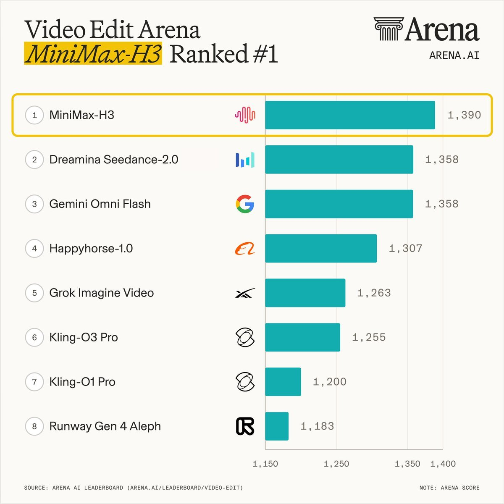
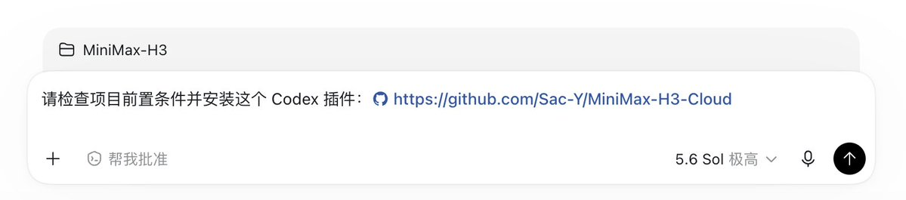
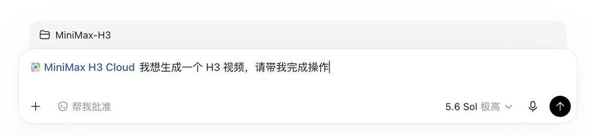
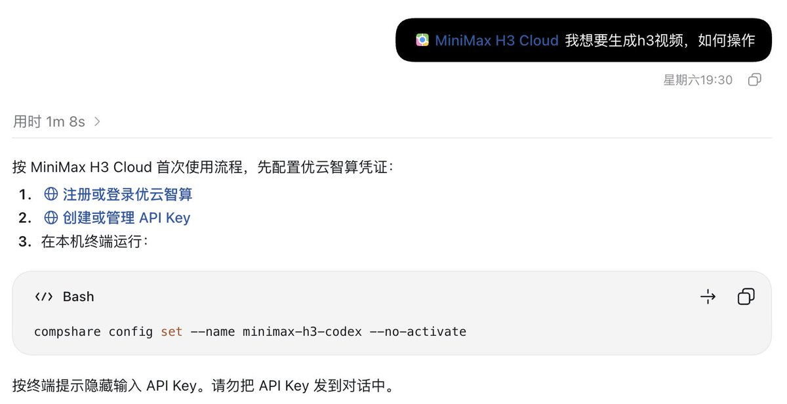
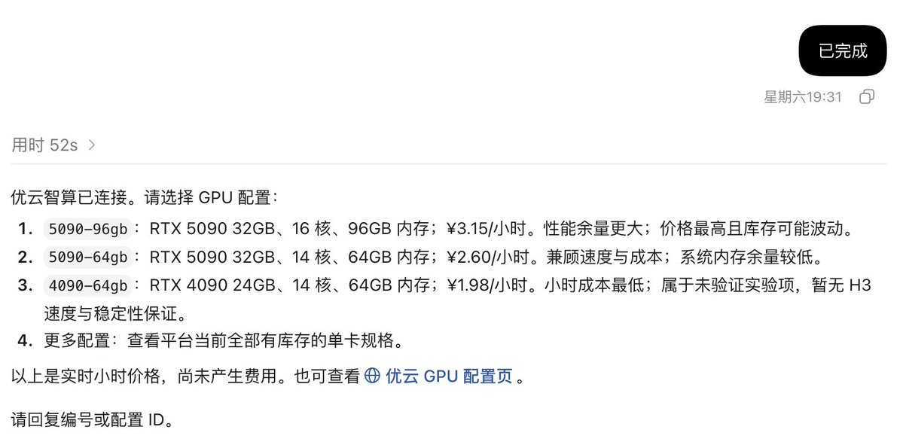
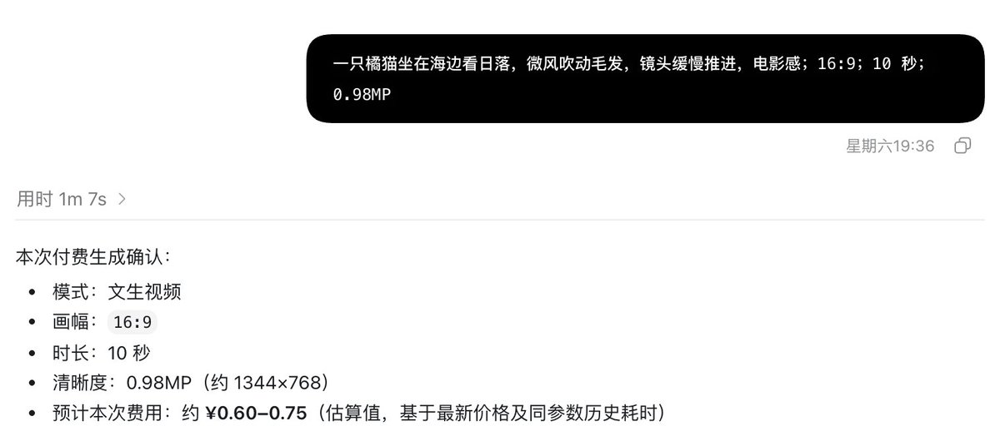
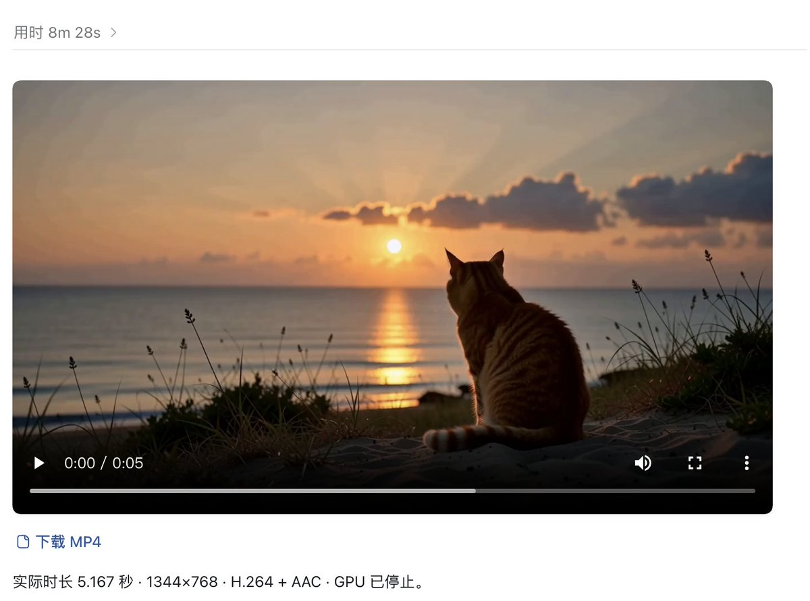

# 我开源了一个Codex插件，让你在 Codex 里不到 1 元生成高清 AI 视频

@Saccc_c · [X 原文](https://x.com/Saccc_c/article/2093992746121933059)

你是否也想尝试 AIGC 创作，但总是因为价格原因劝退？

今年 8 月初发布的 MiniMax H3，直接改变了这一局面。得益于模型开源和云端 GPU，即使没有高性能电脑，也能以极低的成本生成高清视频。

在加上H3绝对T0级别的视频质量，不少场景下效果足以媲美 Seedance。

因此，为了让更多人体验H3模型和AI视频生成，我把整套云端 GPU 运行流程封装成了一个 Codex 插件。

[https://github.com/Sac-Y/MiniMax-H3-Cloud](https://github.com/Sac-Y/MiniMax-H3-Cloud)

安装插件后，Codex 可以协助你构思、优化提示词，并完成从启动云端 GPU 到生成、下载视频的整套流程。

下面我将具体讲解插件的使用方法：

### 第一步：安装插件

在Codex中输入：

> 请检查项目前置条件并安装这个 Codex 插件：
> [https://github.com/Sac-Y/MiniMax-H3-Cloud](https://github.com/Sac-Y/MiniMax-H3-Cloud)

### 第二步：开始创作

新建一个 Codex 任务，调用插件并输入：

> @ MiniMax-H3-Cloud 我想生成一个 H3 视频，请带我完成操作

**1、连接云GPU平台**

首次使用时，按照Codex的指引注册云GPU平台，并完成API Key的配置（目前是优云智算平台，后续会增加更多选择）

具体网址链接都会在指引中显示

**2、选择 GPU**

Codex 会读取当前库存和价格，像你推荐多种GPU配置。建议新手可以直接选5090-96GB，我实测下来速度和稳定性都不错

**3、描述视频需求**

输入视频提示词和生成要求（画幅、时长、清晰度），这里支持文生视频、关键帧生视频和参考图生视频三种基础模式

**4、下载视频**

Codex会将成片直接播放在对话框里，你可以下载或进行后续的迭代

### 最后

整套下来从安装插件到第一个视频生成，全程不到15min。想尝试AIGC的朋友可以速速安装体验

当然，也欢迎大家来GitHub上与我一起共建，有哪里做得不好也欢迎留下评论～

[https://github.com/Sac-Y/MiniMax-H3-Cloud](https://github.com/Sac-Y/MiniMax-H3-Cloud)
