# 百度网盘 - 闲鱼 MCP 一键发布，让你有价值的资料变成持续赚钱的机器

@iluciddreaming · [X 原文](https://x.com/iluciddreaming/article/2081272368660689187)

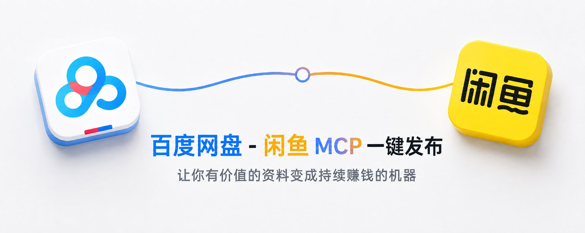

你网盘里是不是也躺着几十个 G 的资料？真正卡住你上架闲鱼的，往往不是「有没有货」，而是那套重复劳动：翻文件夹找素材、下载到本地、开闲鱼网页填标题图价格、点发布——每一件新货都要重来一遍。

这套重复劳动，够格交给 Agent 做，你只需要最后点头确认。
今天讲的就是这条链路：**百度网盘 + 闲鱼 + Agent（MCP）**。
把网盘接成工具，把闲鱼接成工具，再串成「找资料 → 写介绍 → 打草稿 → 发布」的自动系统。

这篇只做一件事：把两套 MCP **接上、跑通、能照着复现**。

你不需要先搞懂 MCP 协议细节。把它想成：**给 AI 插上的外部工具插座**。插上网盘，它能列目录、搜文件、看容量；插上闲鱼，它能登录会话、填商品草稿、确认后发布。

下面按「能照着做」写。路径以 macOS 为例，换成你本机目录即可。

### 这套链路解决什么问题

分开用时，流程是断的：

1. 人在网盘里找素材
2. 人下载到本地
3. 人打开闲鱼网页填标题、图、价格
4. 人点发布

接上两个 MCP 之后，对话里可以变成：

1. 「看一下网盘某某目录」
2. 「用这张本地封面图 + 这段文案，价格 9.9，打草稿」
3. 「截图确认后发布」

**一键发布**在这里的意思，不是黑盒乱卖，而是：
**工具链接好了，确认截图后，Agent 能替你点完发布流程。**
草稿与发布之间，建议你自己看一眼截图——系统负责重复劳动，定价和口径仍由你拍板。

### 开始前准备什么

- **一台本机**：Agent 和 MCP 跑在同一台机器上
- **AI 宿主**：Grok / Cursor / Claude Desktop 等支持 MCP 的客户端
- **Python 3.12**：别用过新的 3.14 折腾编译
- **uv**：Python 包/环境管理，命令行有「uv」即可
- **百度网盘开放平台**：[我的应用](https://pan.baidu.com/union/console/applist)，能创建应用并拿到 Access Token
- **闲鱼账号**：能在网页版 [goofish.com](https://goofish.com/) 登录

项目结构可以按这个想（名字随意，逻辑别乱）：

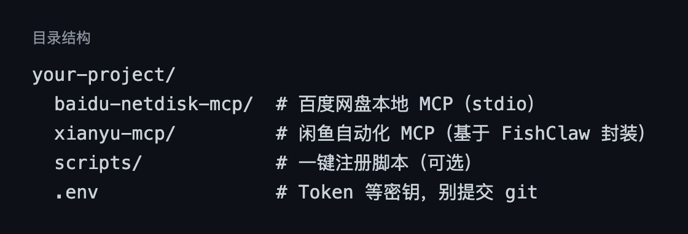

### 一、接入百度网盘 MCP

**1. 先在开放平台建应用**

入口在这里（登录后就是「我的应用」列表）：

[https://pan.baidu.com/union/console/applist](https://pan.baidu.com/union/console/applist)

点 **创建**，填应用名称，创建完成后会出现在列表里。界面大致如下——能看到应用名、创建时间，以及后续要用的 **AppKey**：

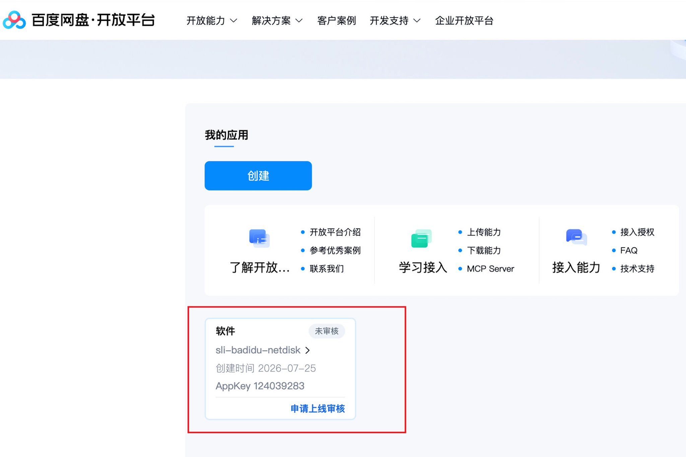

同一页也能点进 **MCP Server**、接入授权、上传/下载能力等文档入口，后面配 MCP 时会用到。

**2. 先搞清：要的是 Access Token，不是 App Key**

App Key 只负责「发起授权」。
MCP 真正带进配置里的，是授权成功后浏览器地址栏里的 **access\_token**。

常见拿法：

1. 打开上面的应用列表，确认应用已创建（见上图）
2. 浏览器打开授权链接（client\_id 用你的 App Key，调试回调可用 oob）
3. 点授权后，地址类似：...[#access\_token](https://x.com/search?q=%23access_token&src=hashtag_click)=一长串&expires\_in=...
4. 只复制 access\_token= 后面、到下一个 & 之前的内容

本地可写成：

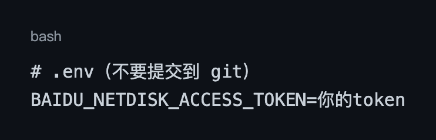

验证一下（能返回用户信息和容量就说明 Token 可用）：

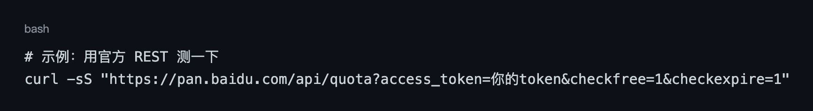

**3. 两种接法，怎么选**

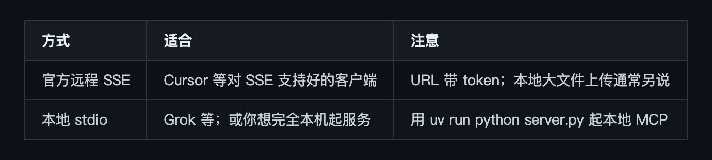

实践里：
有的宿主对官方 [https://mcp-pan.baidu.com/sse](https://mcp-pan.baidu.com/sse)?... 握手不顺（例如返回 405）。
这时用 **本地 stdio 封装 REST** 更稳——Agent 仍然用 MCP 调工具，底层去打百度开放平台接口。

**4. Cursor 里接官方 SSE（最简单）**

在「~/.cursor/mcp.json」或项目「.cursor/mcp.json」：

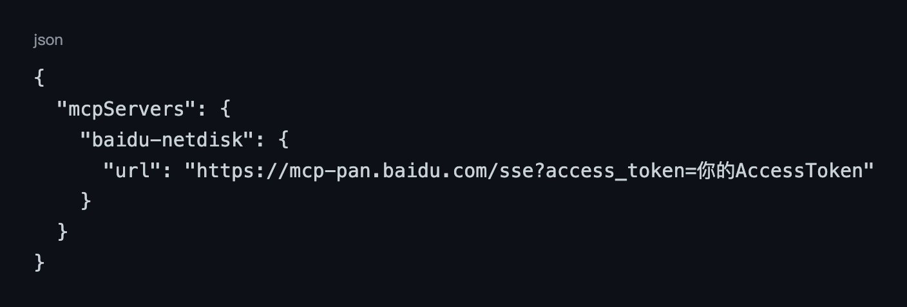

保存后看 MCP 列表是否绿灯。
试一句：**「查一下我的网盘容量」** 或 **「列出根目录」**。

**5. Grok / 通用 stdio：本地网盘 MCP**

假设本地服务在：/path/to/repo/baidu-netdisk-mcp/server.py

依赖装好：

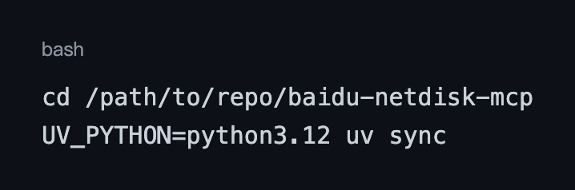

Grok 用户配置「~/.grok/config.toml」形态：

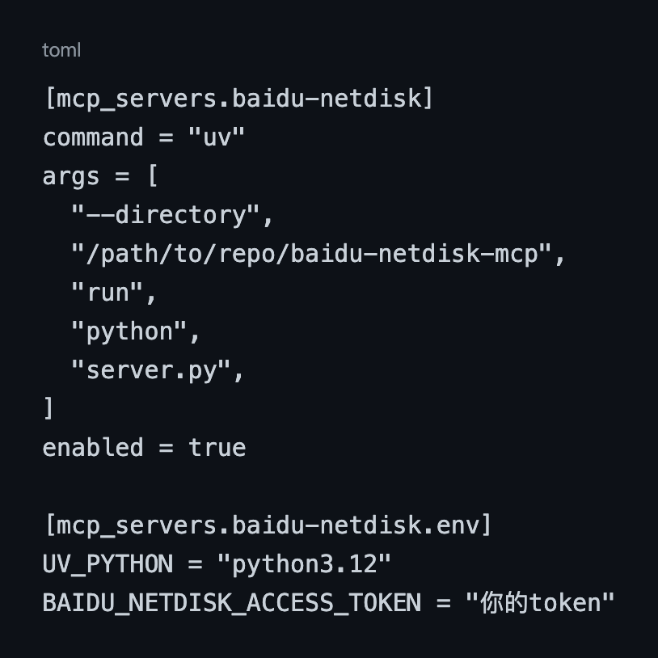

或用 CLI：

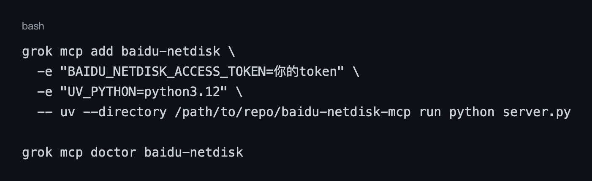

期望：「handshake OK」，能发现一串 tools。
然后 **重启会话**，再让 Agent 调工具。

**6. 网盘侧常用能力（Agent 能干什么）**

本地封装常见工具包括（名称因实现略有差异）：

- 「user\_info」/「get\_quota」：账号与容量
- 「file\_list」：列目录
- 「file\_keyword\_search」：按文件名搜
- 「make\_dir」、复制/移动/重命名/删除
- 「file\_sharelink\_set」：建分享链接

路径一律用网盘绝对路径，例如「/来自：mcp\_server」或你自己的目录名。

接好之后，在对话里直接说「看下我的目录」，Agent 会去调「file\_list」等工具，把根目录扫一遍再给你摘要。实操界面大概长这样——工具调用记录 + 网盘资料列表：

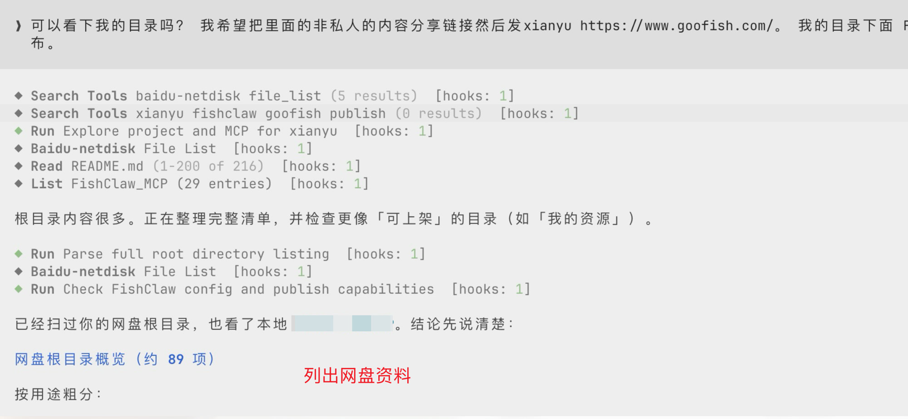

有了这份清单，后面才能接到闲鱼侧：选目录、准备封面图和文案、再走草稿发布。

### 二、接入闲鱼 MCP（FishClaw，目录名 xianyu-mcp）

闲鱼网页自动化这一侧，社区里常见封装是 **FishClaw 一类 MCP**：用 Playwright 打开 [goofish.com](https://goofish.com/)，把登录、草稿、发布暴露成工具。项目里这部分代码放在「xianyu-mcp/」目录，注册到宿主时的服务名仍可以叫「fishclaw」。

**1. 环境**

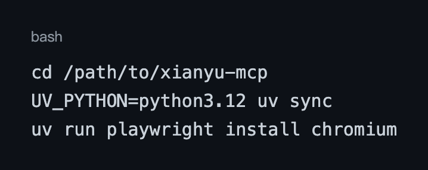

可选：「.env」里配模型 Key，用来**自动生成**封面图和文案。
如果你更想自己指定图片路径、自己写介绍——**Key 可以先不配**，直接走「draft\_item」。

**2. 注册到宿主（Grok 示例）**

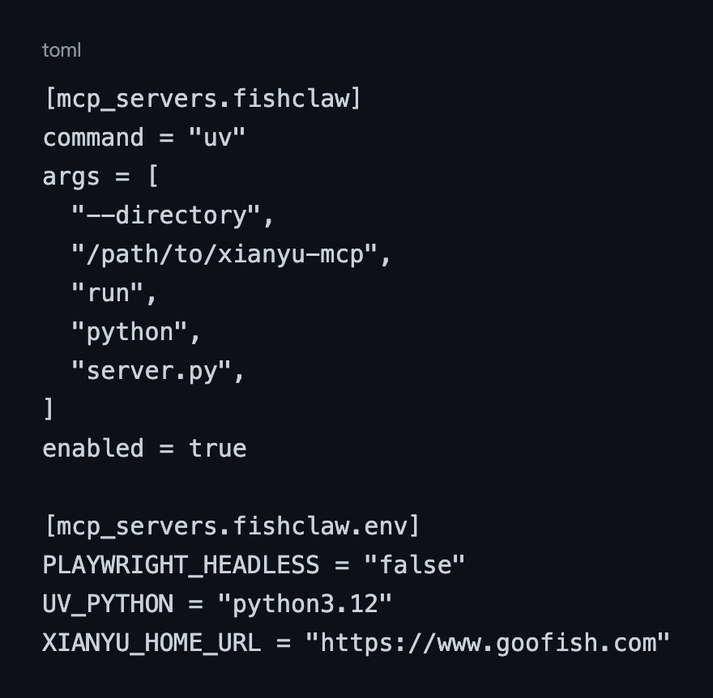

「PLAYWRIGHT\_HEADLESS=false」：有界面，方便扫码登录。

**3. 登录：必须在 Playwright 窗口里登**

重要一点：

**你日常 Chrome 里已经登录闲鱼 ≠ MCP 已登录。**

这套 MCP 用的是独立浏览器配置，Cookie 存在项目目录（例如「.cache/cookies/」）。
第一次务必：

1. 让 Agent 调「login」
2. 在**弹出的那个浏览器窗口**里扫码
3. 进入「我的闲鱼」个人中心，确认已是账号主页，而不是「立即登录」

登录成功后，可以试「get\_selling\_items」看在售列表是否正常。

**4. 闲鱼侧核心工具**

- 「login」：检查/完成登录
- 「draft\_item」：填草稿：图 + 描述 + 价格，并截图
- 「publish\_item」：点发布（不可撤销，先确认截图）
- 「get\_selling\_items」：在售列表
- 「manage\_item」：下架 / 删除
- 「search\_market」：搜市场做定价参考

「draft\_item」参数可以记成模板：

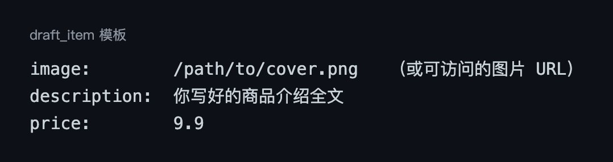

### 三、串起来：从网盘到闲鱼的「一键」发布流

这里给一条最小闭环。按你的业务替换目录名和文案即可。

**推荐对话流（给 Agent 的剧本）**

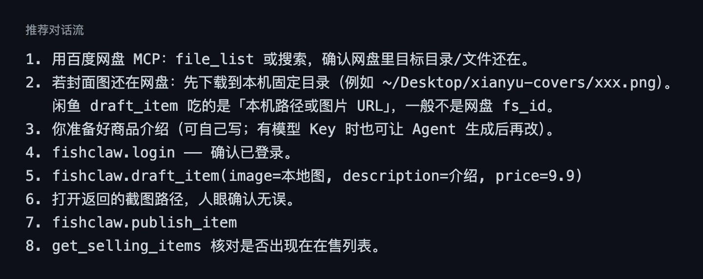

走通之后，闲鱼商品页大致是这样——标题、价格、描述、封面图都齐，可在管理页下架或删除：

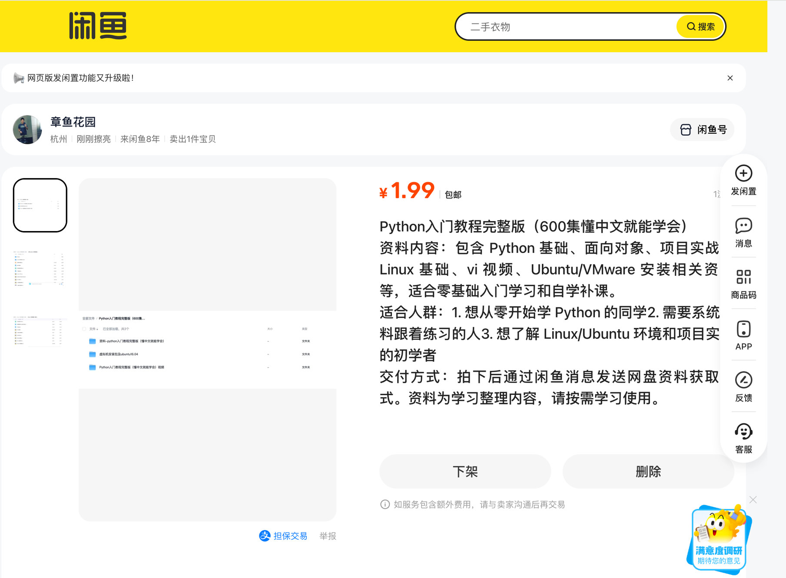

**为什么中间要「落到本机路径」**

网盘 MCP 擅长：查、管、搜、分享。
闲鱼 MCP 擅长：网页表单与发布。

两边默认不共享一个「虚拟文件句柄」。
所以发布链路里，**封面图最终要变成 Playwright 能上传的本地文件（或公开 URL）**。
文案则是一段字符串，直接进「description」。

**人机分工（建议）**

- **决定卖什么、定价、最终文案口径**（人）↔ 列目录、搜文件、填表、点按钮（Agent）
- **看草稿截图点头**（人）↔ 按确认结果调用 publish（Agent）
- **保管 Token / 扫码**（人）↔ 复用已保存 Cookie（Agent）

这样既快，又不会在你没看截图时直接发出去。

### 四、可复制检查清单

**网盘 MCP 验收**

- Token 能查到容量 / 用户信息
- 宿主 MCP 列表里「baidu-netdisk」为可用
- 「file\_list(dir=\\"/\\")」有返回
- 重启会话后工具还在

**闲鱼 MCP 验收**

- 「doctor」或列表里能看到 fishclaw 工具
- 「login」后个人中心**不是**「立即登录」
- 「get\_selling\_items」能反映真实在售
- 「draft\_item」能出截图路径

**发布前 30 秒**

- 图片路径存在且能打开
- 描述无错别字、价格正确
- 草稿截图里类目/图/价看起来对
- 再调「publish\_item」

### 五、常见坑（本机踩过的）

**1. 配了 App Key 却一直连不上**
缺的是 Access Token。回去走授权，复制 access\_token。

**2. SSE 在某个客户端 405**
换本地 stdio，或换对 SSE 支持更好的客户端试官方 URL。

**3. Python 3.14 装依赖失败**
固定「UV\_PYTHON」到 3.12。

**4. MCP 配置改了但 Agent 没工具**
重启会话 / Reload Window。stdio 服务是宿主拉起的子进程。

**5. 闲鱼「已登录」其实是假的**
以个人中心页面为准：能看到你的昵称和在售，而不是登录引导文案。
必要时清 Cookie 再「login」，并在 Playwright 窗口完成扫码。

**6. Token 写进聊天或 git**
立刻轮换。配置文件权限收紧，「.env」进「.gitignore」。

**7. 跨 Agent 想共用 MCP**
不会自动共享。Cursor、Grok、Claude 各写一份配置；同一台机器可指向同一「server.py」。

### 六、你现在可以怎么做

最小路径：

1. 今天只接 **百度网盘 MCP**，先让 Agent 能列目录、查容量。
2. 再接 **闲鱼 MCP**，完成一次扫码登录。
3. 用一张本地测试图 + 两段测试文案，走通「draft\_item」（先别急着 publish）。
4. 确认截图无误后，再「publish\_item」。
5. 把两段配置和本篇检查清单存进自己的笔记，下次换机器照抄。

配置和清单都存好之后，下次换机器重新接通这套链路，花不了你十分钟——这才是这套流程真正省下来的时间。

### 附录：接入剧本（可以直接丢给你的 Agent）

不想自己一步步照着配？把下面这段原样丢给你正在用的 Agent，让它照着装：

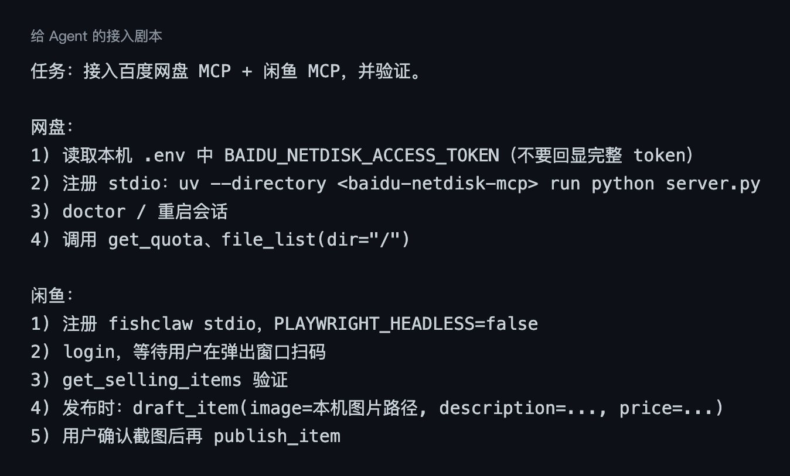

### 代码开源，直接拿去用

本文两套 MCP 的完整代码已经开源：

[github.com/mousepotato/baidu-netdisk-xianyu](https://github.com/mousepotato/baidu-netdisk-xianyu)

clone 下来，把「.env」填上你自己的 Token，跳过本文一半的踩坑步骤直接跑。

不用你重新解释一遍 MCP 是什么，Agent 照着这段就能自己把两套工具装好、验证通。

加微信 **tudou\_peak**，参与 AI 做自媒体操作群 · OPC 一人公司 · AI 赋能 · 出海讨论。

mousepotato（土豆哥）| 美国计算机全奖博士 | 硅谷 11 年技术管理 | AI · OPC · 产品 | X [@iluciddreaming](https://x.com/@iluciddreaming)

关注我，获取 AI 前沿、技术、管理、产品、英语和硅谷生活见闻。

土豆哥 AI 交流群： OPC 一人公司 · AI 赋能 · 出海讨论 · 海外生活聊天吹水。加微信 tudou\_peak 参与交流。
土豆哥 AI Notes 电报群：[https://t.me/tudouge\_ai\_notes](https://t.me/tudouge_ai_notes) （免费）
