# 豆包工作 从 0 到 1 保姆级教程-附图解实操

@369Serena · [X 原文](https://x.com/369Serena/article/2095800822034542820)


嗨朋友们，我是 Serena 木瓜。

之前我写了 WorkBuddy 和 Codex 从 0 到 1 的教程，并且附上了图解，很多朋友都反馈说非常适合小白。现在市面上的工作台 Agent 越来越多了，今天我们可以来讲讲**豆包工作**。

目前只要加了客服微信，就能获得一个月的免费试用。而且不同平台的生态各不相同，大家完全可以根据自己喜欢的生态来选择适合的办公 Agent。

这篇教程还是老规矩，会帮大家拆解画面，每一步都会配上截图。大家照着走一遍，就能熟悉豆包工作。

话不多说，我们马上开始！

## 一、豆包工作是什么

一句话：**字节出的办公 Agent。你给一句话，它拆成几步，自己调工具，把活干完。**

那跟 WorkBuddy、Codex 怎么选？我给你一句判断标准：**别比谁强，看你的人和资料现在躺在哪个生态里。**

| 产品（谁家的） | 主打什么 | 绑定生态 | 一句话选它 |
| --- | --- | --- | --- |
| 豆包工作（字节） | 办公 Agent：文档/表格/PPT/调研/图/视频/网页 | 飞书 | 你和团队在飞书里办公 |
| WorkBuddy（腾讯） | 全场景工作台：办公 + 代码 + 设计 | 微信/腾讯文档 | 独立创作者/小微团队，或泡在腾讯系工具里 |
| Codex（OpenAI） | 编程 Agent：写码/改码/工程任务 | 代码库/终端 | 你主业写代码 |

三个产品功能有重叠，你全装一遍行。但人的精力有限，挑一个用透，比装三个吃灰强。

如果你每天开飞书，豆包工作排第一顺位。

## 二、装好它（3 分钟）

### Step 1：下载安装

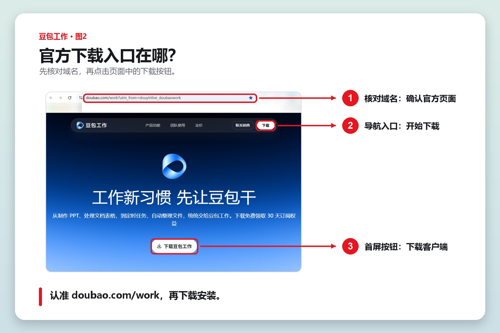

官网：[https://www.doubao.com/work](https://www.doubao.com/work)

打开后第一件事：**核对域名**。确认地址栏写着 [doubao.com/work](https://doubao.com/work)，再点下载。网上有仿冒站，域名错一个字母就是另一个东西。顶部导航有"下载"，首屏有"下载豆包工作"按钮，两个任选一个。

下载、双击、安装，跟装 QQ 一样，登录即用。

### Step 2：打开看首页

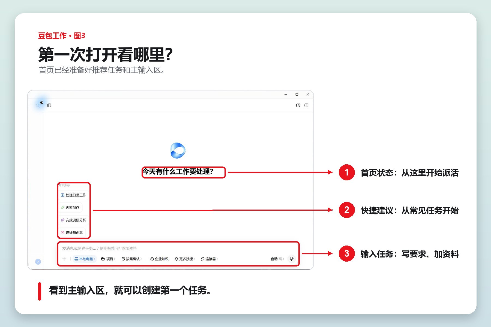

装完打开，屏幕中间挂着一句"今天有什么工作要处理？"，你进到工作台了。

左边那几个推荐任务我建议先跳过，那是给完全没头绪的人准备的。你的目光落到底部输入框——派活的地方。

### Step 3：看一眼权益

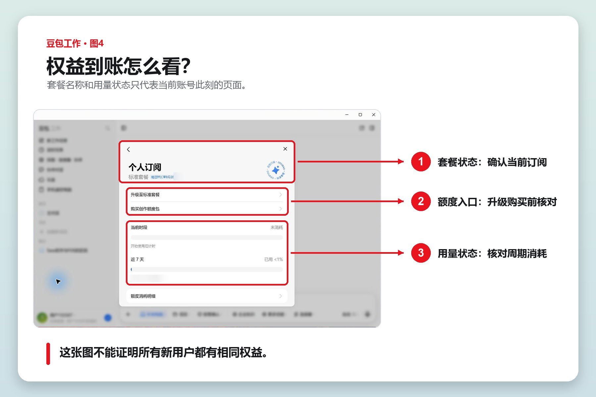

点开订阅，三样东西摆在那：你现在的套餐（个人订阅 / 标准套餐）、创作额度还剩多少、这个周期用了多少。

这里我多说两句，因为踩坑的人不少。我自己页面上看到的是个人订阅和标准套餐两档，领到的试用时长跟你未必一样。

**账号和账号之间，权益是不一样的。** 有人在群里晒自己的额度截图，下面一堆人问"为什么我没有"——批次不同而已，没什么好纠结的。

视频和图片生成吃创作额度。额度见底，页面上有"购买创作额度包"的入口。

还有一条官方写明的规则，我提前告诉你：**超过每人每月免费用量之后，额外的 AI 额度要另外买。** 而且它按任务复杂度浮动计费，同一个任务跑两遍，扣的额度未必一模一样。

## 三、认识界面

界面分三块，我把每块干什么说清楚。

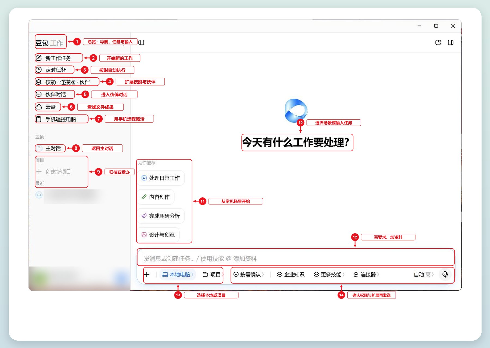

**左边那条栏**是功能区。新工作任务、定时任务、技能·连接器·伙伴、伙伴对话、云盘、手机遥控电脑，全排在这条栏里。栏顶挂着"主对话"，栏底是"项目"和"最近"，用来归档和续接之前没干完的活。

**中间那块**是你跟它对话的地方。没头绪的时候，下面几个推荐任务点一个试试。

**底下那个输入框**是重点，容易被人忽略。左边那个"+"用来加资料，能选本地电脑或者项目；右边排着一排按钮：权限、企业知识、更多技能、连接器。

我踩过的坑基本都出在这个框——东西没传、字段没写、权限没看，点完发送等着，等出来一堆废话，回头一看，自己什么都没交代。

### 权限别乱开

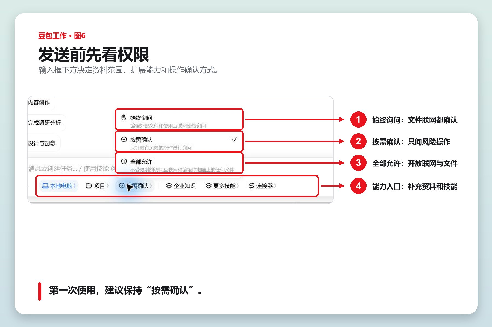

发送前看一眼权限，一共三档：

| 模式 | 意思 |
| --- | --- |
| 始终询问 | 编辑外部文件、联网，逐条问你 |
| 按需确认 | 有风险的操作问你（默认） |
| 全部允许 | 访问网络和电脑文件不受限 |

我自己的做法是守着默认的"按需确认"，不动。

权限拉满不会让它变聪明，省掉几次确认弹窗，代价是它动你电脑里的文件不用打招呼。这笔账不划算。

## 四、跑通第一个任务

第一个任务我建议做这个：把一份会议纪要整理成待办表。

选它的原因有两个——读文件、提取字段、生成表格，全套流程跑一遍；而且结果对不对，你一眼看得出来。

### Step 1：准备一份测试纪要

新建个 Word 或者记事本，随便写几行会议记录。

关键一步：**故意把其中两项的时间空着，标上"待确认"。**

这是我给自己留的测试口子。AI 编日期是老毛病，你不给它挖坑，它把空着的地方填成一个看着合理的日子，你根本发现不了。

### Step 2：发送前核对

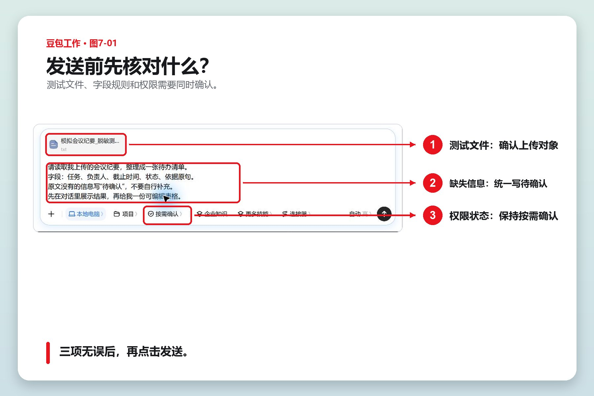

传文件，粘贴这段提示词：

```text
请读取我上传的会议纪要，整理成一张待办清单。
字段：任务、负责人、截止时间、状态、依据原句。
原文没有的信息写"待确认"，不要自行补充。
先在对话里展示结果，再给我一份可编辑表格。
```

点发送之前，我习惯核三件事：文件传对了没、字段和"待确认"规则写进去没、权限是不是停在按需确认。

三件事过完，点发送。

### Step 3：看它执行

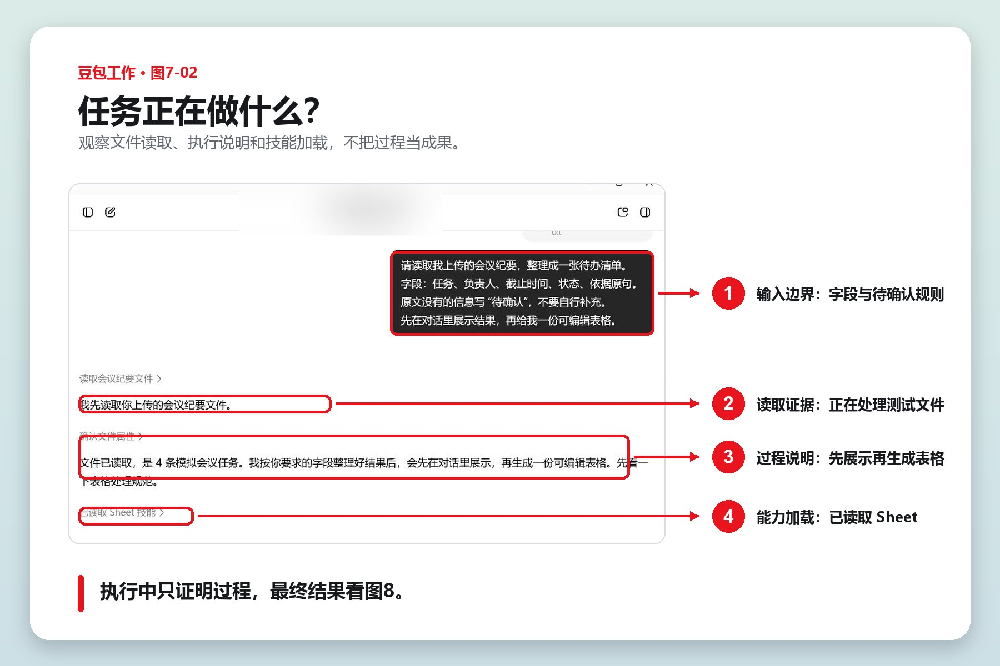

发出去以后，你能看着它一步步说话："我先读取你上传的会议纪要文件"，接着调起表格技能（界面上会显示"已读取 Sheet 技能"），然后告诉你"先展示结果，再生成可编辑表格"。

这个过程别催。它在读文件、在调技能，让它跑完。

### Step 4：核对结果

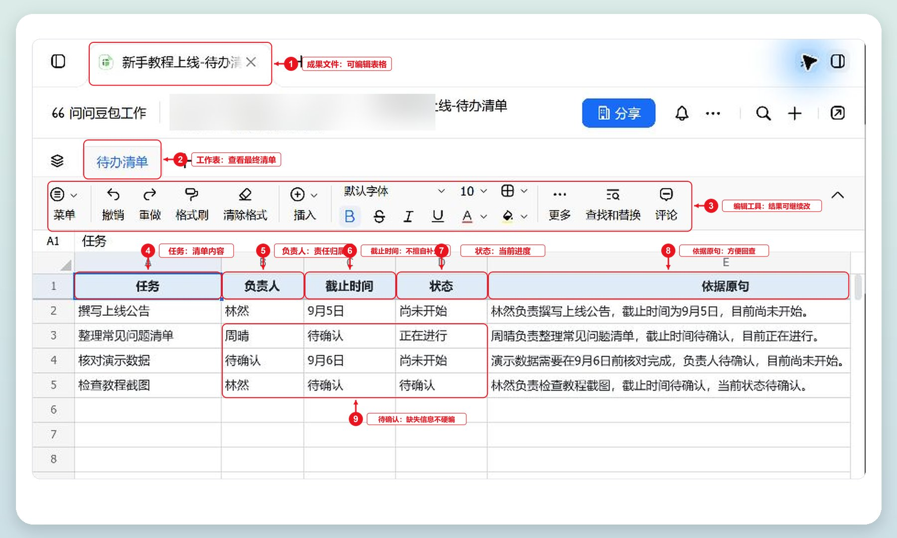

结果出来，我一般查三个地方：

1. 五个字段（任务、负责人、截止时间、状态、依据原句）到齐了没；
2. 我故意留空的地方，它有没有偷偷填上具体内容；
3. 原文没写状态的任务，它有没有替我标成"已完成"。

留空的地方它原样标着"待确认"，说明这个任务跑对了——它没编。

表格是可编辑的，剩下的日期和状态你自己补上。

顺手给个我总结出来的写法，照这个框架填，出来的东西差不了：

> 让它干什么 + 给它什么材料 + 要哪些字段和什么格式 + 缺的信息怎么处理

四条写清楚，比你在框里打一句"帮我好好整理一下"有用得多。

## 五、六个独特功能，用起来

### ① 总结飞书群聊

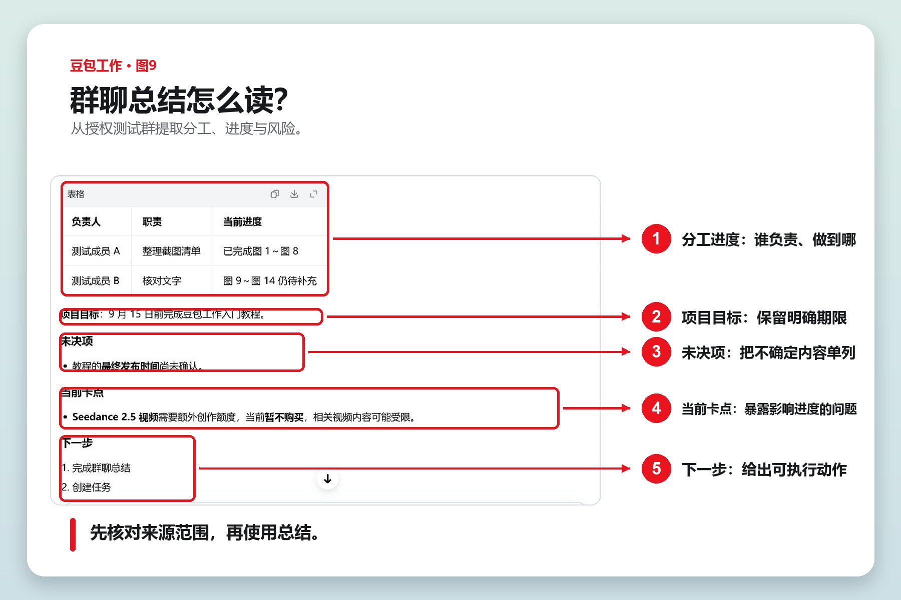

项目群里消息刷得飞快，中间夹着表情包和一排"收到"。第二天上班你从头翻，翻到眼花。

我现在不翻了。丢给豆包工作一句话：把群聊总结一下，谁负责什么、做到哪了、目标期限是什么、哪些没定、卡在哪、下一步该干嘛。

图上是我跑出来的结果：分工进度排成一张表，项目目标和期限写在上面，"未决项""当前卡点""下一步"单独列成三块。

你从头翻 200 条消息的功夫，它几秒给完结果。

### ② 会议纪要转任务

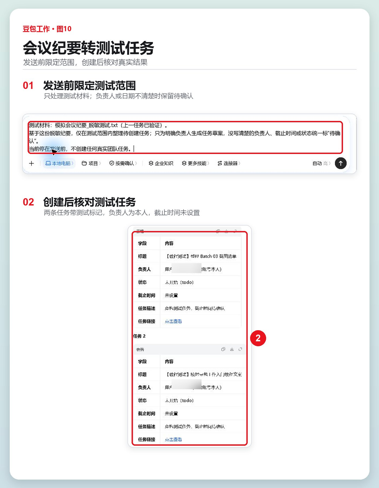

开完会烦的不是开会，是散会之后那一堆待办没人跟。

纪要丢过去，说一句：把明确负责人的事项创建成任务，负责人或日期不清楚的标待确认。

它会把待办拆成一条条任务，能确定的负责人填上，拿不准的日期原样留着待确认。你过一眼，没问题，再决定要不要落成真实任务。

### ③ 数据生成看板

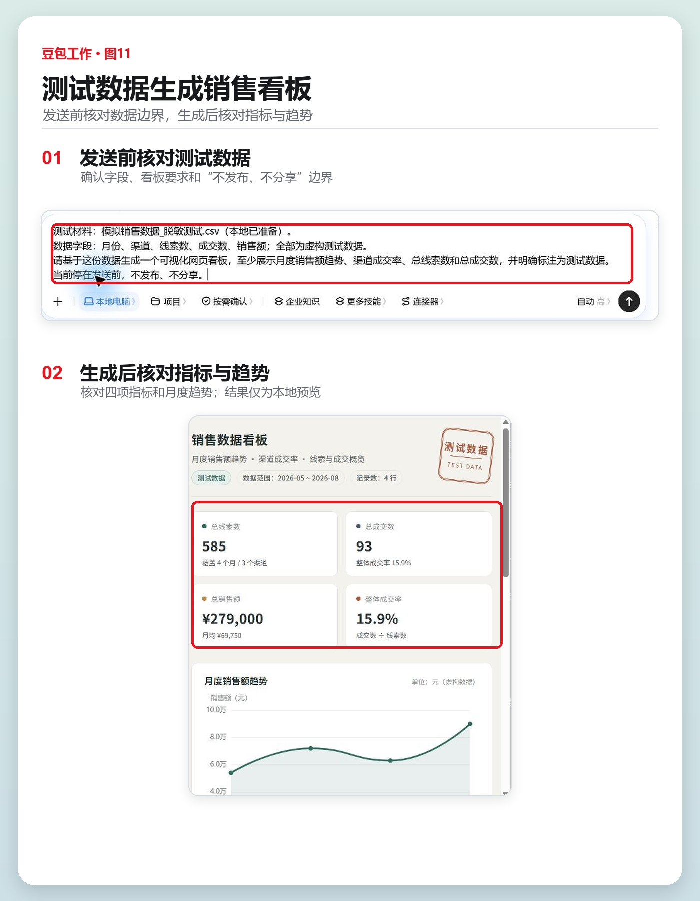

一张数据表丢过去，让它生成看板，出来的是核心指标卡加上趋势图，在本地预览。

这里有个坑我提前说：**它是本地预览，不是上线的网页。** 想发给别人看，你得自己发布一遍。这两个概念搞混，你会以为生成完等于能分享。

### ④ 定时任务

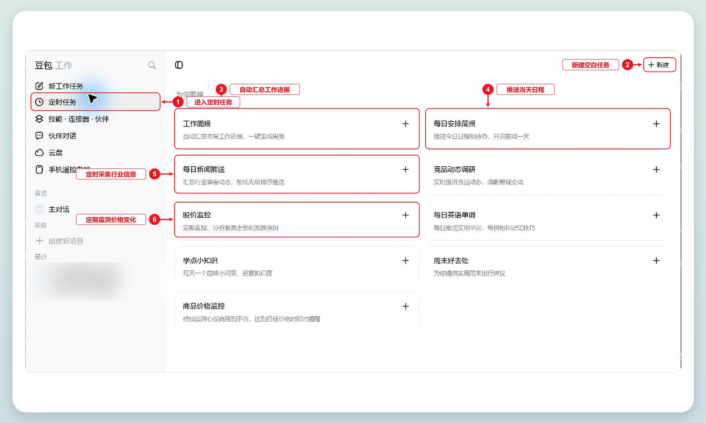

左侧"定时任务"点进去，官方给了四个现成模板：

- **工作周报**：汇总本周进展生成周报
- **每日安排**：推送当天日程和待办
- **新闻推送**：定时汇总行业动态，按优先级推给你
- **股价监控**：定期盯股票走势和涨跌原因

挑一个跟你需求接近的改改，或者点"新建"从头配。

我的建议是：**第一次手动跑一遍。** 结果对了，设定定时。不然它每天定时给你推一堆垃圾，你不知道问题出在哪。

### ⑤ 手机遥控电脑

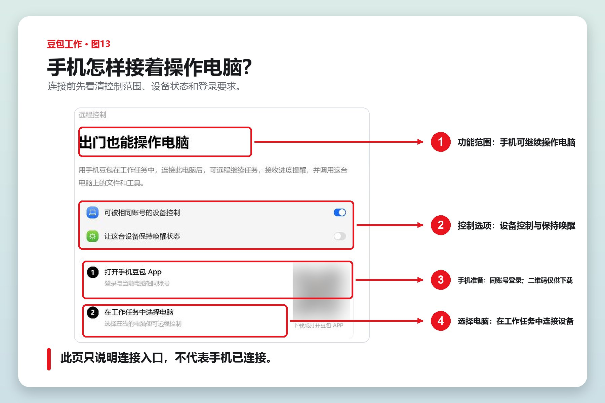

这个功能我在地铁上试过一次。人在路上，工位那台电脑亮着屏，我拿手机接着派活。

前提两个：手机装豆包 App，登录的账号跟电脑是同一个，电脑得开着、连着网。

电脑端找到"手机遥控电脑"，里面两个开关——"可被相同账号的设备控制"和"让这台设备保持唤醒状态"。两个打开，在手机的工作任务里选中这台电脑，能远程操作了。

### ⑥ 生成短视频

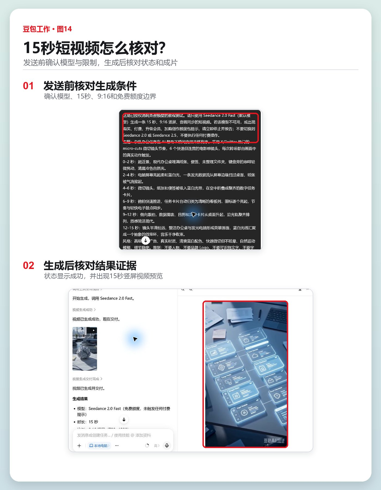

做短视频这块，规格写清再发，别让它猜：用哪个模型、多长、什么比例、走不走免费额度。


图上是我的测试：Seedance 2.0 Fast，15 秒，9:16 竖屏，走免费额度。结果页显示生成成功和视频预览。

额度这块提醒一句：**这次测试用的是免费额度，跑通了。额度规则会变，生成前看一眼余额更稳。**

## 六、技能 · 连接器 · 伙伴

豆包工作的扩展能力，三样。

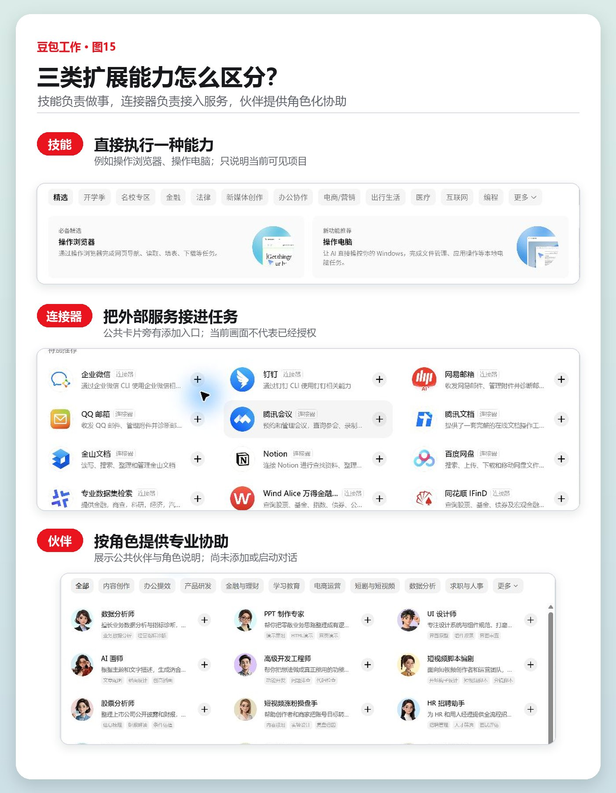

| 概念 | 本质 | 一句话 |
| --- | --- | --- |
| 技能 | 执行一种能力 | 比如"操作浏览器""操作电脑" |
| 连接器 | 接外部服务进来 | 比如企业微信、钉钉、邮箱、会议、文档、网盘 |
| 伙伴 | 按角色提供协助 | 工作伙伴·小队里的角色卡 |

**技能是手艺。** 它自带的能力，点开能用，比如操作浏览器、操作电脑。

**连接器是通行证。** 让 AI 拿到外部服务的数据。我截图里能看到的有企业微信、钉钉、邮箱、会议、文档、网盘。接之前看清楚一件事：它要哪些权限，数据往哪发。

**伙伴是人。** 带固定角色的助手，在"工作伙伴·小队"里，按角色帮你干活。

新手我建议别贪多。连接器加得越多，结果不对时越难定位是哪个在起作用。手上有具体任务了，再加。

## 七、更多能用的方向

下面这些方向，前一个是我在豆包工作里实跑过、有截图有结果的；后面几个是官方演示、社区里有人真跑通过的场景，我搬了人家实打实的提示词进来——不是我编的泛例。提示词填了具体内容，照着抄能用。我没截图，你拿去跑，跑通了发我。

### 场景一：职场数据复盘（实跑示例）

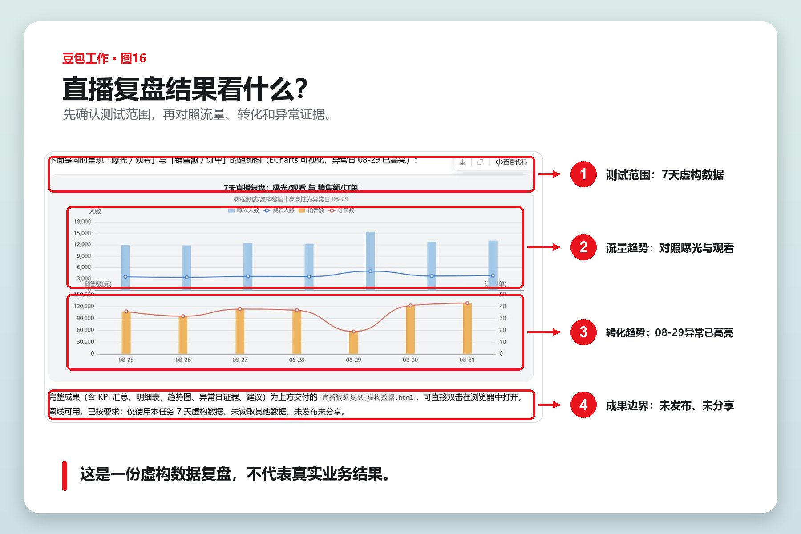

把直播数据表丢过去，让它复盘。图上这轮跑出来的是曝光/观看的流量趋势，加上销售额/订单的转化趋势，异常日（图上标的 08-29）单独拎出来。

我用的是 7 天测试数据，指标、趋势、异常证据排在一张表里，末尾标着"未发布、未分享"。

这里值钱的不是那两张趋势图，是它把异常日给你标出来。你自己看数据，眼睛容易盯着眼前的涨跌，漏掉那一天。

### 场景二：电脑 / 浏览器自动化

豆包工作能自己开浏览器、进系统、填表、整理文件，这是它和纯聊天 AI 的分水岭。下面这个案例有人真跑过：给一份采购任务书，让它用视觉浏览器自己找供应商、核价、出比选。

**采购比选（真实提示词，可照抄）**

```plaintext
【任务】为 100 台办公电脑做采购比选，给出 3 套方案
【需求】<粘贴你的采购任务书，或写清楚：用途、性能要求、预算区间、交付时间、售后要求>
【流程】
1. 搜索并筛选符合需求的供应商和机型
2. 进入商品页和配置器，按我的需求配置，核对实际参数
3. 按相同的配置口径和服务标准重新核算报价
4. 计算单台完整投入（含税、含服务、含配件）
5. 输出对比表 + 一个交互式看板
【对比维度】配置参数｜单台裸机价｜含税价｜服务与保修｜单台完整投入｜100 台总价｜交期｜供应商资质
【规则】
- 三套方案的配置口径必须一致，不然没法比
- 从公开网页无法确认的批量价、库存、交期，标记为"待询价"或"估算"，不要编数字
- 每个数字标出来源链接
- 最后给一段推荐意见，说清楚推荐理由和风险
【输出】对比表 + 交互式看板，给我分享链接
```

实跑产出（量子位实测）：它自己开视觉浏览器搜供应商、进商品页和配置器核对参数、重算报价，最后真给出一份对比表和一个能点开的交互式看板。值钱的是：公开网页查不到的批量价、库存、交期，它没有瞎填，而是标成"待询价""估算"——敢拿去做决策的，是把不确定标出来的表。

桌面文件整理属于这一类：给一句"把桌面文件按日期整理好，同类型的放一个文件夹"，它会开文件管理器，逐个遍历、重命名、移动。批量重命名、合并 Excel、转文档格式、清重复文件，这些活它一个不落。这一步要授权它操作电脑，跑前看一眼权限停在"按需确认"。

### 场景三：一句话搭系统 / 网页 / 应用

豆包工作能从"给你一段文字"跳到"给你一个能用的工具"。下面这个案例有人真跑过：把一个数据源接上，让它生成会自己更新的看板。

**销售看板（真实提示词，可照抄）**

```plaintext
【数据源】飞书多维表格"销售日报"
【任务】做一个销售看板网页应用，字段与这张多维表格打通，表格数据变化时页面自动同步
【页面结构】
1. 顶部四个核心指标卡：本月 GMV、订单数、客单价、目标完成率（每个卡片显示当前值 + 环比变化，涨绿跌红）
2. GMV 月度趋势折线图，可切换"本月 / 本季度 / 全年"
3. 分区域业绩排行榜，可按 GMV / 完成率排序
4. 明细表格，支持按区域和时间范围筛选
【要求】
- 目标完成率低于 80% 的区域标红
- 每个图表带一句话结论
- 手机端可用
- 干净商务的视觉风格，不要花哨
【输出】生成后给我分享链接
```

实跑产出：它先解析多维表格的字段结构，再生成出一个真能打开的网页应用——四个指标卡带环比、一张可切换时间范围的折线图、一个能排序的排行榜、一张能筛选的明细表，而且表格里改个数，页面跟着变。这跟"导出一张图"不是一回事，是个活的系统。

官方演示里更出圈的一条：给一份车间生产数据，一句话搭出带看板、实时更新的生产日报全栈系统。思路一样，把数据源和要的模块写清楚即可。

### 场景四：工作小队多 Agent 并行

9 月 2 日豆包工作更新，加入了多 Agents 并行：主 Agent 先把任务拆了，喊几个专业子 Agent 各干各的，最后汇总。下面这个案例有人真跑过。

**调研报告 + PPT（真实提示词，可照抄）**

```plaintext
用多 Agent 并行模式完成以下任务：
【任务】调研 2026 年 AI Agent 海外创业公司 TOP10 并制作 PPT
【分工】
- Agent A：搜索融资信息（近半年融资历程、估值变化）
- Agent B：分析产品矩阵（核心功能、用户数据、上线时间线）
- Agent C：评估技术架构（模型路线、开源/闭源、算力需求）
- Agent D：调研团队背景（创始人履历、团队规模、招聘动向）
- Agent E：收集用户口碑（社群评价、社交媒体热度、投诉点）
【输出要求】
1. 先各自完成调研，汇报发现的关键信号
2. 汇总阶段筛选出值得优先深挖的 3 家公司
3. 最终输出一份 18 页 PPT，含：选题背景、调研方法论、十大榜单、三家深度分析、每页讲稿
4. 专业商务风格，关键数据加粗高亮
【注意事项】
- 每个子 Agent 独立完成自己的模块，不要互相干扰
- 最终由组织者 Agent 统一汇总输出
- 如某模块信息不足，标注"需人工补充"而非编造
```

实跑产出：5 个子 Agent 大约同时去搜不同维度的信息，主 Agent 收齐后交叉验证、筛出值得优先深挖的 3 家，最后真给出一份 18 页、带讲稿的 PPT。复杂调研这么拆，比一个 Agent 从头跑到尾快，没那么容易卡在半路。注意并行越多越费额度，先在小任务上试。

### 场景五：创意生成图片 / 海报

做内容的人顺手能用：Seedream 5.0 Pro 出图、海报、漫画，Seedance 2.5 做视频分镜和成片，能按反馈接着改。下面这个案例有人真跑过。

**一套电商宣传图（真实提示词，可照抄）**

```plaintext
这是我的产品实拍图。请以原图中的女士皮质手提包为唯一产品参考，制作一套 3 张电商宣传图：
- 宣传海报：完整展示包身，突出精致、高级的整体质感
- 卖点特写：重点表现优质皮料、轻巧便携、防水防油等卖点
- 使用场景图：呈现都市女性日常通勤或休闲出行的真实使用场景
三张均为 3:4，采用干净高级的浅色背景，产品占据画面主体。整套图片的色调、光线方向、字体和排版风格统一，画面真实自然，具有高级电商广告质感。
```

实跑产出：它生成三张一套、风格统一的图——一张完整海报、一张材质卖点特写、一张使用场景图，色调和排版一致。关键一句是"以原图中的产品为唯一产品参考"，不加这句它容易重新画一个形状对但细节全错的包。把产品名和卖点换成你自己的能用。视频分镜和成片走 Seedance 2.5，吃创作额度，跑前看一眼余额。

## 八、飞书深度玩法

写了这么多，你要是问我豆包工作靠什么拉开差距，我投飞书这一票。

你存在飞书里的文档、表格、群聊，它读得到。这意味着它干活的时候，用的是你团队的真实上下文，不是你临时喂给它的几段话。

> 前提：飞书升到 V7.75 以上，账号在内测开放范围内，看得见入口。网页版无版本要求。

### 文档里的"问问豆包"

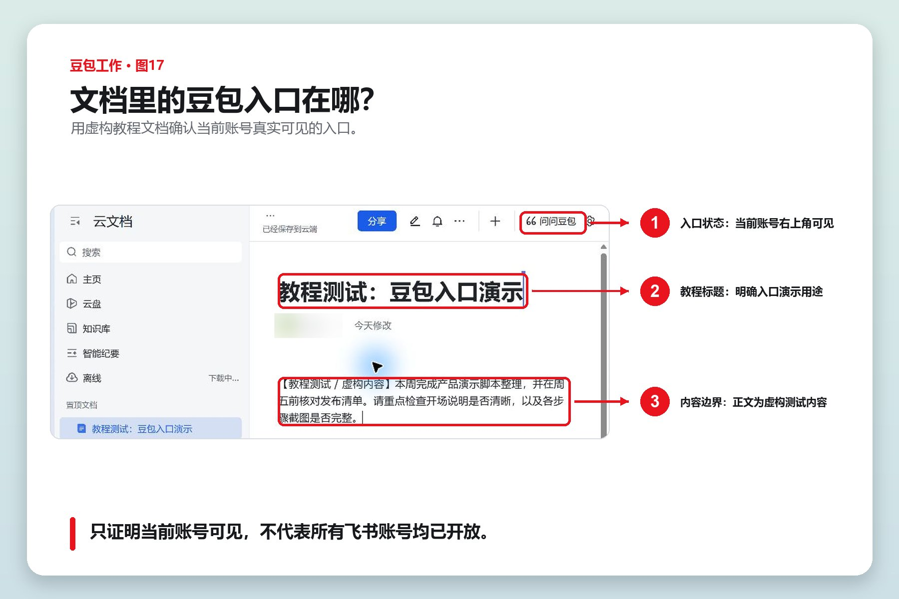

打开飞书文档，右上角有个"问问豆包"。点开，能基于当前文档提问、总结、改写、生成新文档。

### 选中一段文字

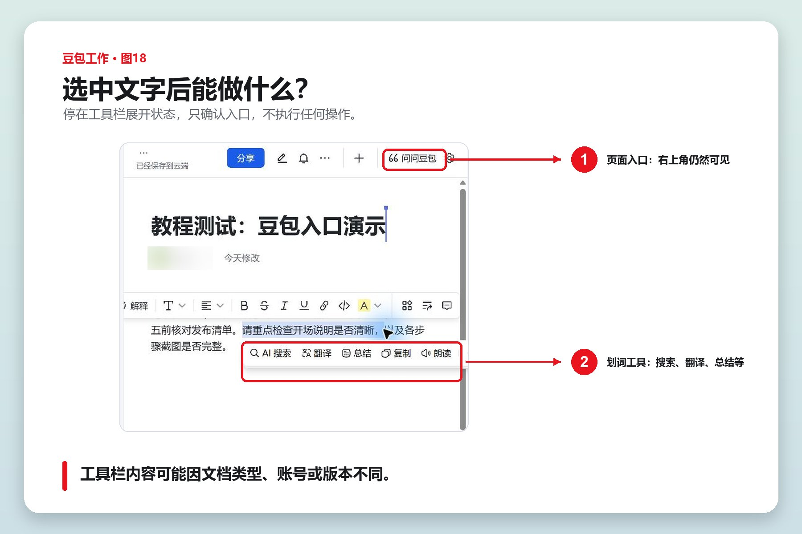

文档里选中一段文字，下面会浮出一条工具栏：AI 搜索、翻译、总结、复制、朗读。具体按钮随版本和入口略有出入，以你实际界面为准。

想改哪段，选中哪段，不用复制粘贴到别的地方去。

### 表格里出分析图

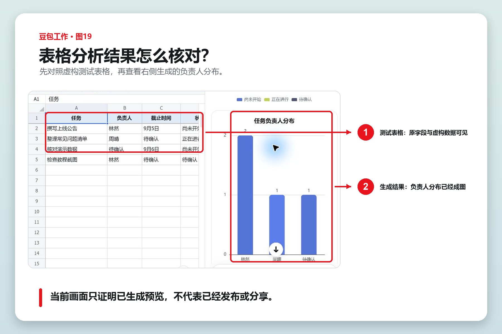

在飞书表格里让它基于数据分析，它能出图。图上这张是"任务负责人分布"的柱状图。

左边是你的原表，右边是生成的图，对着看一眼，数据对得上，拿去用。

## 写在最后

豆包工作的功能远不止这些，一篇塞不下。但跟着走完这一遍，从下载到交付的完整流程你跑通了，几个独特功能摸过一遍，够用了。

如果这篇文章对你有用的话，欢迎在评论区多多交流！

> 我是 Serena 木瓜，希望这篇文章可以帮助到你！
