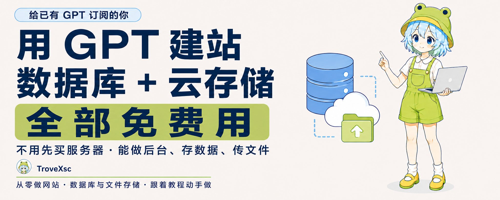
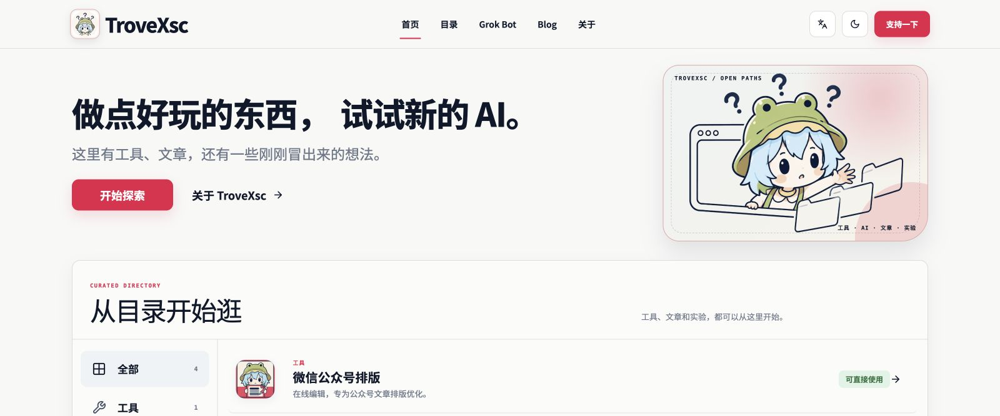
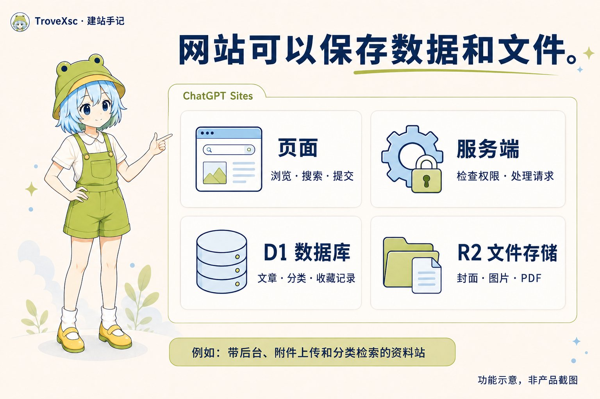
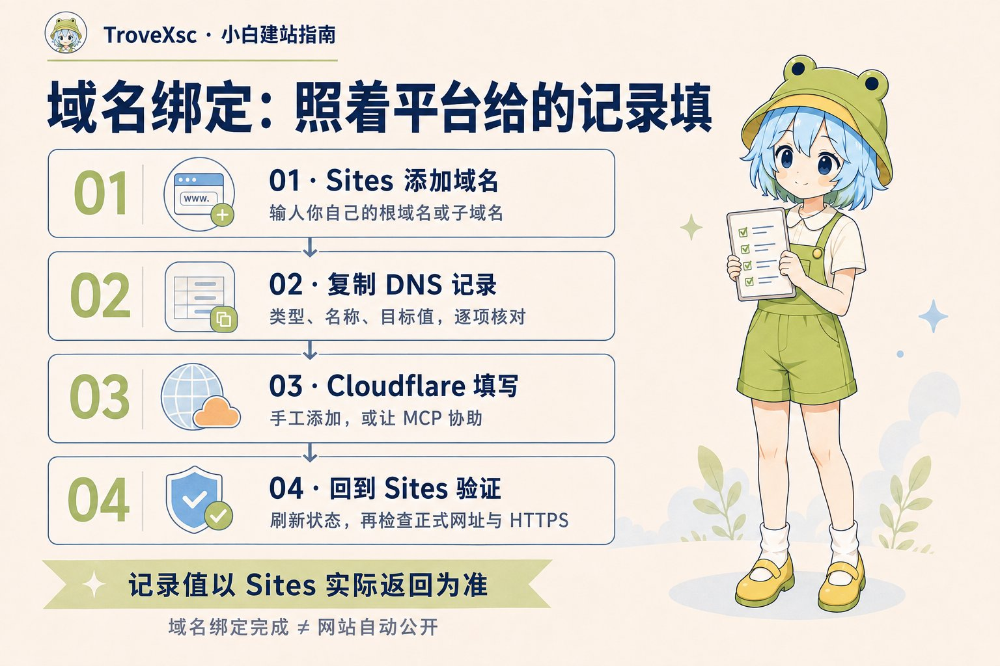
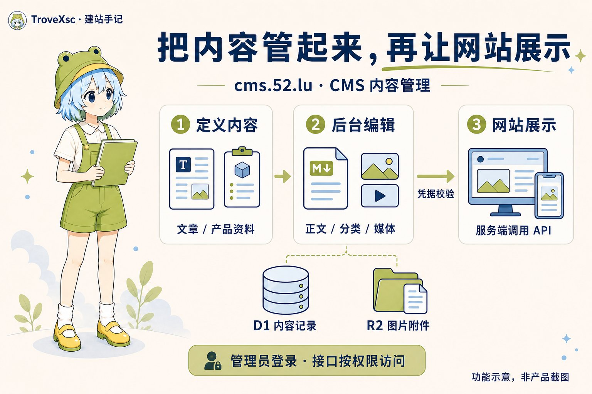
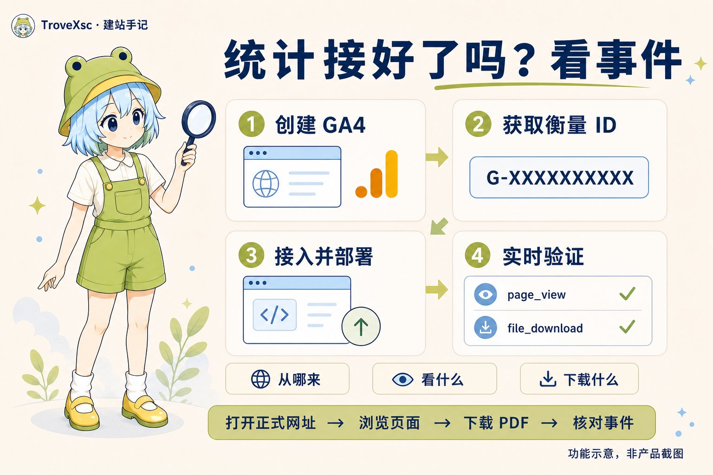
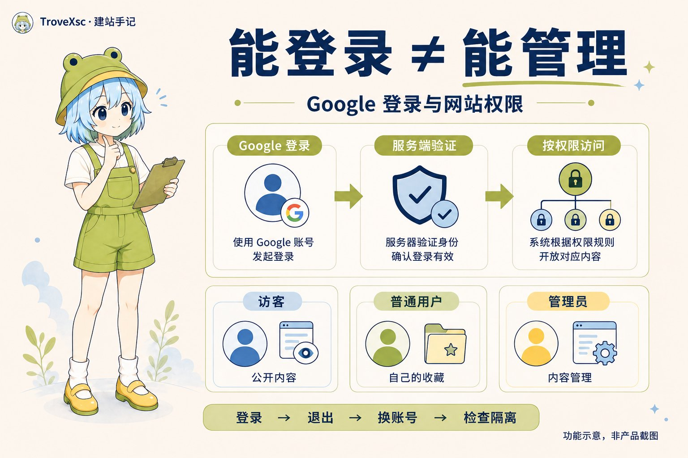
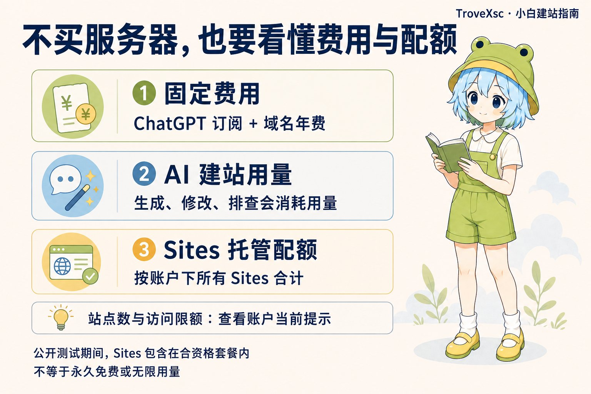

# GPT 订阅别只用来聊天：建站、数据库、云存储，全部免费用

@TroveXsc · [X 原文](https://x.com/TroveXsc/article/2096992296130798059)

**已经有 GPT 订阅？先把建站这笔钱省下来：服务器不用买，数据库和云存储也不用另付钱。**

这份订阅，能帮你把哪些事做成网站？

- **做企业、开工作室：**做公司官网，把业务、服务、案例和联系方式放在一起。给客户一个链接，就能介绍你能做什么。
- **做产品、开发工具：**做产品介绍页，放功能演示、使用教程和常见问题。上线后，用户有地方了解和使用你的产品。
- **写文章、做自媒体：**做自己的博客或 CMS，在后台写文章、管分类、传图片。想要 WordPress 那样的文章管理、媒体库和发布流程，也可以让 GPT 按需求写。
- **卖商品、做品牌：**做商品目录、分类筛选和详情页，在后台维护图片与参数，客户不用翻聊天记录找资料。这里指商品展示；Sites 当前不允许启用金融交易，不能当作收款商城。
- **做成人培训、带团队：**做课程资料站或内部知识库，按主题整理讲义、PDF 和操作手册，让有权限的人查找、下载。
- **做设计、摄影、咨询：**做作品集和服务介绍，把项目案例、交付内容与联系入口整理出来，发给客户或合作方。

**文案让 GPT 写，插图让 GPT 画，页面和后台也让它做。**你提供业务资料、产品照片和想要的功能，再核对它写的内容、测试它做的网站。需要保存文章、上传文件、管理资料，也能一起做。

用 Sites 提供的网址，连域名都可以先不买。把下面的空填好，就能开始：

> 我是做【行业／业务】的，想做【网站用途】，主要给【谁】看。请根据我提供的资料写文案、生成配图，用 Sites 制作网站。需要【文章／商品／资料】管理后台，能保存记录、上传文件。先列页面和功能，确认后制作。缺少的资料请列出来，不要编造客户、案例或产品参数。

**先看一个已上线的例子：**[52.lu](https://52.lu/)。这是我用 Sites 做的网站，里面有工具、内容目录和文章。下面是当前首页，你可以点开网址查看。

**想做自己的内容后台，再看 **[**cms.52.lu**](https://cms.52.lu/)**。**这是我用 Sites 做的 CMS 内容管理系统，用来编辑内容、管理分类与媒体，再通过接口供其他网站按权限读取。52.lu 展示网站和工具，[cms.52.lu](https://cms.52.lu/) 则说明：让 GPT 做网站，也可以做到内容管理后台。CMS 目前只向管理员开放，打开链接看到登录页是正常的。

再说一个来源：我们的[公众号排版工具](https://52.lu/wechat-editor)，就是“蒸馏” [@AdrianPunk115](https://x.com/AdrianPunk115) 的 [Punk 微排](https://weipai.iamadrianpunk.com/)做的。参考它的排版思路和使用流程，再按自己的需求调整，做成 TroveXsc 版本。感谢 Punk，[原作者的介绍在这里](https://x.com/AdrianPunk115/status/2088543211656753278)。第三节也补了方法：看到喜欢的网站，怎样让 GPT 仿着做。

封面写的“全部免费用”，面向已有合资格订阅的读者，范围是公测期额度内的这些建站资源。[官方费用说明](https://learn.chatgpt.com/docs/pricing#how-much-does-sites-cost)

**这篇教程带你做一个带后台的资料站：**你写文章、传封面和 PDF；读者按分类搜索、打开详情、下载附件。做完后，关闭页面再登录，内容还在；换台设备，也能找到同一份资料。下面的步骤都围绕这条流程展开。

**你可以按自己的进度阅读：**从零开始，按第一至四节做出网站；已有网站，跳到第五至八节接域名；准备分享链接，照第九节检查。没有域名也能先用 Sites 地址，等网站能用再购买。

网站上线后，想知道读者从哪里来、哪些资料有人下载，看第十一节 Google Analytics；想让读者用 Google 账号保存收藏和进度，看第十二节。

准备一篇标题为“测试资料”的文章、一张图片、一份 PDF。全文都用它们检查结果；先用测试内容走通流程，再导入自己的资料。

### 01｜你要做的网站，可以保存哪些东西

数据库和云存储能替你保存什么？做博客，留下文章和封面；收报名，留下表单记录；做学习工具，留下每个人的进度。把“谁提交、保存什么、谁能查看”写进需求，AI 才能据此实现功能。

以资料站为例，三部分各有用途：

- **页面和后端：**页面提供列表、搜索和管理表单；后端接收请求、检查权限、保存内容。
- **D1 数据库：**存标题、正文、分类、发布状态和文件归属。搜索标题、修改分类、把草稿改成已发布，都要读写这些记录。
- **R2 云存储：**存图片、封面、PDF 等文件。数据库记录文件属于哪篇资料，R2 保存文件本身。

上传一份 PDF 后，文件进入 R2，标题和文件位置进入 D1。读者打开详情页，网站读取记录，再按权限提供下载。这条流程能用于资料库，也能用于带附件的博客或团队文档站。

Sites 可以把页面、后端、D1 和 R2 放在同一个网站中，由平台管理托管资源与部署连接。采用这条路线时，不需要去自己的 Cloudflare 账户另建 D1 和 R2。后文连接 Cloudflare，是为了管理域名解析。[Sites 存储说明](https://learn.chatgpt.com/docs/sites#choose-a-supported-site-shape)

**把资料站扩展成 CMS，能替你省哪些事？**以 [cms.52.lu](https://cms.52.lu/) 的内容管理方式为例：

- **先定义要管什么：**文章可以有标题、正文、封面；产品资料可以有型号、参数和说明书。用内容类型和字段表达这些差别，不必把所有内容塞进同一种文章模板。
- **日常在后台维护：**用 Markdown 写正文，整理分类，从媒体库选图片或附件，保存草稿后再发布。内容记录放在 D1，文件放在 R2；更新内容不需要每次改页面代码。
- **让其他网站使用内容：**展示网站可以由自己的服务端携带限权 API Key 读取，再呈现给读者。密钥留在服务端，CMS 的管理接口不向匿名访客开放。

这就是企业资料库、产品目录或个人内容站可以采用的做法：先把内容管起来，再决定用什么页面展示。

### 02｜先查资格和额度，避免花错钱

登录 ChatGPT，打开 [Sites 页面](https://chatgpt.com/sites)，或从侧边栏 More／更多进入 Sites／站点。先尝试创建网站，确认所在账户、地区和工作空间已开放功能。没有入口时，先核对官方资格说明，不必为了找入口购买域名或升级套餐。

当前 Sites 面向 Plus、Pro、Business、Enterprise、Edu 等合资格套餐，在公开测试期间包含于订阅。Free、Go 能使用部分 Codex 功能，不等于能使用 Sites。组织账户还要看工作空间设置。[资格与限制](https://learn.chatgpt.com/docs/sites)

已经订阅的读者，要分清两种用量：让 AI 写代码、改页面和排查问题，使用对应的 Work／Codex 用量；网站上线后的访问、数据库和文件存储，受 Sites 配额约束。一次数据库查询，不等于一次 AI 调用。

公开资料给出的单站数据库边界是 D1 10 GB；R2 没有固定容量上限，但仍受账户配额与平台规则约束。它不能被理解为无限免费网盘，Cloudflare 自己免费档的数字也不能套用到 Sites。[配额说明](https://learn.chatgpt.com/docs/sites#understand-limits-and-unsupported-uses)

目前没有一张可供所有账户套用的“Plus 几个站、Pro 多少流量”公开数字表。Sites 的套餐限制按账户合计，接近限制时会提示。达到上限可能影响新建站点、增加存储或高用量网站继续公开，已有网站仍可编辑管理。

**怎么判断要不要升级？**先用现有套餐做测试站，查看账户显示的限制，记录实际用量。几千条文字记录与几千份扫描 PDF 的占用不同；根据你要存的内容判断，不必照别人的套餐购买。

这套方案要另算的费用主要是域名和你接入的外部收费服务，例如邮件或 AI API。ChatGPT 订阅仍按原套餐支付。[套餐与费用说明](https://learn.chatgpt.com/docs/pricing)

### 03｜复制这段需求，做一个带后台的资料站

在支持 Sites 的对话中选择 Sites，或写明“用 Sites 制作网站”。替换下面的【名称】后发送。先把功能说清楚，配色和布局可以在预览时调整。[创建入口](https://learn.chatgpt.com/docs/sites#get-started-with-sites)

> 用 Sites 制作一个中文资料站，名称是【名称】。读者无需登录即可浏览已发布资料，按分类筛选、搜索标题、查看详情和下载公开附件。管理员登录后可以新增、编辑、删除资料，上传封面和 PDF，切换草稿与已发布状态。标题、正文、分类、发布状态和文件归属存入 D1，封面与附件存入 R2。管理权限在服务端检查；普通访客不能读取草稿及其私有附件。手机上要能完成浏览、搜索、上传和下载。先保持非公开，给我预览和管理员配置步骤，列出已实现及尚未完成的功能。

**收到第一版后，用“测试资料”检查：**后台能录入标题、正文和分类，能上传那张图片和 PDF；保存后，在管理员页面能重新打开记录、查看图片、下载文件。缺一项，就把失败的操作告诉 GPT，修复并复查后再往下做。

遇到错误，把操作与结果告诉 AI。比如：

> 我在新增资料页上传 PDF 后点击保存，页面提示成功，但列表没有记录，刷新后也找不到附件。请分别检查文件上传、数据库写入和列表查询的结果，说明失败发生在哪一步。修复后，用同一份测试资料再操作一次，并返回检查结果。

描述“在哪一页、点了什么、原本期待什么、实际出现什么”，比只说“有 bug”更便于定位。报错文字和截图可以附上，密码与密钥不要放进截图。

**看到喜欢的网站，怎样让 GPT 仿着做？**

企业官网、产品页、排版工具，都可以从参考站开始。以公众号排版为例：

1. **给参考：**把网址发给 GPT，附上电脑和手机截图，指出你喜欢的布局与功能。页面打不开，就用截图和操作录屏补充。
2. **拆成需求：**让它列出页面结构、配色、字号、间距和按钮行为，再写出“输入原稿 → 预览 → 调整样式 → 复制”的流程。
3. **做自己的版本：**给它你的名称、文案、Logo 和形象，先做通这条流程，再加功能。需要后台、数据库和文件存储，也要写进需求；仅凭页面看不出对方后台怎么做。
4. **照流程检查：**放入一篇带标题、图片、表格的文章，切换样式，再复制到公众号草稿，检查格式是否保留。网页截图相似，还要确认按钮和功能能用。

可以复制这段指令：

> 请参考【网址】及我提供的截图，用 Sites 做一个服务于【我的用途】的网站。先分析页面布局和操作流程，列出能确认的功能；看不到的部分标注待确认，不要猜成已实现。使用我提供的名称、文案和图片，缺少的插图请生成。先实现【核心流程】，再加入【后台／数据库／文件上传】。完成后对照参考图检查电脑和手机效果，并逐步测试操作，返回差异和未完成项。保留参考来源说明。

### 04｜确认数据能留下，权限分得开

显示“保存成功”只是第一步。浏览器里的 localStorage 也能让内容在刷新后保留，但换设备后未必能读到。资料站的共享内容，应由网站数据库保存。

继续发送：

> 请列出哪些数据存入 D1、哪些文件存入 R2、哪些状态保存在浏览器。资料内容不要用示例数组或浏览器缓存代替。保存失败时显示错误；文件上传成功但资料保存失败时，给出重试或清理办法。请检查关闭页面、重新登录和换设备后的数据是否一致。

再区分管理员、普通用户和未登录访客。管理员可以编辑资料；普通用户登录后，也不该因此获得后台管理权限。权限检查要在服务端执行，隐藏按钮不能阻止别人请求接口。

如果需要收藏或学习进度，可使用 Sites 的 Sign in with ChatGPT。平台识别用户，网站决定这个人能读取、修改哪些记录。[登录说明](https://learn.chatgpt.com/docs/sites#add-sign-in-with-chatgpt)

> 增加 Sign in with ChatGPT。未登录者可阅读公开资料；登录后可收藏，每个用户只读写自己的收藏。管理员权限单独配置。请用两个测试用户检查：甲不能读取、修改或删除乙的收藏。未完成的检查请标注。

文件也要分权限。公开封面供读者访问，草稿附件在下载前检查身份。可以要求“本站只接收 PDF，单个不超过 10 MB”，并显示超限提示。这是你给网站定的上传规则，不是 Sites 的统一上限。

**这一节的完成标准：**管理员换设备仍能找到“测试资料”；未登录者既看不到这条草稿，也不能通过附件链接下载 PDF。把两个访问身份的结果分开记录。

### 05｜需要自己的网址，再买域名

域名是读者输入的网址。注册商负责注册和续费，DNS 告诉浏览器网站在哪里，Sites 负责运行网站。这三件事可以分开购买和管理。

已有域名可继续使用；还没想好名字，可先用 Sites 提供的地址。决定购买时，看首年价、续费价和注册年限，检查是否勾选了服务器、建站套餐或邮箱加购项。

下面用 [example.com](https://example.com/) 举例，操作时换成你的域名。在 Cloudflare 注册的步骤是：

1. 注册并登录 Cloudflare，验证邮箱。
2. 打开 Register domains，搜索域名。
3. 核对可注册状态、价格和年限，填写注册联系人资料并付款。
4. 按邮件完成验证，回管理页检查到期日和自动续费设置。

在 Cloudflare 注册的域名已使用它的 DNS，可跳过下一节更换名称服务器的步骤。使用 Cloudflare Registrar 期间，不能将 nameserver 改为其他 DNS 服务商。[注册说明](https://developers.cloudflare.com/registrar/get-started/register-domain/)

在别家注册也可以。保留原注册商，在那里续费；把 DNS 交给 Cloudflare，不要求转移域名注册商。

### 06｜把域名解析交给 Cloudflare

如果域名在别家注册，按下面操作。已有网站或邮箱时，先保留一份旧 DNS 记录，用来核对，避免切换后邮件收不到。

1. 在 Cloudflare 的 Domains 页面选择 Onboard a domain，输入 [example.com](https://example.com/)，不带 https:// 或页面路径。
2. 选择 Free 套餐，用于本教程的 DNS 配置。
3. 逐条核对扫描结果与旧记录，保留网站用的 A、AAAA、CNAME，以及邮箱和验证用的 MX、TXT 等记录。扫描可能漏项，需要补齐。
4. 旧 DNSSEC 已启用时，按注册商流程停用并处理旧 DS 记录，再更换名称服务器。
5. 复制 Cloudflare 为这个域名分配的 nameserver，回注册商的 Nameservers／名称服务器设置替换并保存。
6. 回 Cloudflare 等待状态变为 Active，激活后再按指引启用 DNSSEC。

nameserver 必须在注册商指定的设置处更换。在 DNS 表里新增两条 NS 不能代替这一步，也不能复制别人的 nameserver。[DNS 接入说明](https://developers.cloudflare.com/dns/zone-setups/full-setup/setup/)

如果状态一直未激活，先检查注册商是否保存成功、填入的名称服务器是否与 Cloudflare 一致、旧 DS 是否已处理。不要同时改动网站记录和邮箱记录，以免分不清问题来自哪里。

### 07｜连接 Cloudflare MCP，让 AI 协助查 DNS

MCP 让 AI 在授权范围内使用 Cloudflare 的工具。本教程用它读取和配置 DNS；Sites 托管的数据库和文件存储不靠这次授权连接。习惯手工操作的读者，可跳到下一节。

在支持插件的客户端搜索 Cloudflare，核对发布者和说明，安装、连接账户，并按提示开启新对话。[插件说明](https://learn.chatgpt.com/docs/plugins)

桌面端也可手动配置。不同客户端的菜单可能不同，下面对应 MCP servers 设置：

1. 打开 Settings → MCP servers → Add server。
2. 名称填写 cloudflare-api，连接类型选 Streamable HTTP。
3. URL 填写 [https://mcp.cloudflare.com/mcp](https://mcp.cloudflare.com/mcp)。
4. 保存并按提示 Restart；需要登录时点击 Authenticate。
5. 在 OAuth 页面核对账户和权限，完成授权后回客户端，用 /mcp 查看连接状态。

这是 Cloudflare API MCP。[docs.mcp.cloudflare.com](https://docs.mcp.cloudflare.com/) 提供文档查询，连接它不等于能修改 DNS。授权界面若支持限定账户或域名，选择本次所需范围。[Cloudflare MCP 说明](https://developers.cloudflare.com/agents/model-context-protocol/cloudflare/servers-for-cloudflare/) · [客户端配置说明](https://learn.chatgpt.com/docs/extend/mcp?surface=cli)

连接后先做一次读取，确认账户与域名选对：

> 请通过 Cloudflare MCP 只读检查 [example.com](https://example.com/)，返回域名状态，列出根域名和 www 的 A、AAAA、CNAME 及验证记录，并指出冲突。先不要修改，也不要改动邮箱记录。

工具能读出这个域名的记录，就完成了连接检查。若提示无权限或找不到域名，核对授权账户、域名归属和连接状态。密码、验证码和完整密钥留在官方页面里。

### 08｜按 Sites 给出的记录绑定域名

网站能完成保存和下载后，在 Site 设置中选择 Add domain，输入根域名或子域名。自定义域名以账户开放情况为准，官方注明 Enterprise 工作空间在推出时不支持。[绑定说明](https://learn.chatgpt.com/docs/sites#connect-a-custom-domain)

Sites 会给出本次绑定的 DNS 配置。手工操作时，打开 Cloudflare → 选择域名 → DNS → Records → Add record，按原值填写：

- Type：记录类型。
- Name：主机名，@ 通常代表根域名，www 代表该子域名。
- Target／Content：Sites 返回的目标或验证值。
- TTL：没有其他要求时使用 Auto。

不要照抄他人的 CNAME 目标，也不要填预览页面路径。同名 A、AAAA 或 CNAME 冲突时，先查旧记录用途。Sites 没有其他要求时，初次验证的可代理 CNAME 可先选 DNS only（灰云）；TXT 没有橙云开关。[验证排查说明](https://developers.cloudflare.com/dns/manage-dns-records/troubleshooting/cname-domain-verification/)

使用 MCP 时，把 Sites 返回的记录贴给 AI：

> 以下是 Sites 为 [example.com](https://example.com/) 返回的 DNS 配置：【记录】。读取现有记录，列出拟新增、修改的条目与冲突。经我确认后执行这份变更，保留邮箱及其他服务记录。完成后重新读取配置，并检查 Sites 的域名状态；不能检查的项目请说明。

回 Sites 等待域名验证和 HTTPS 就绪。根域名与 www 是两个地址，需要分别处理，并确定主地址与跳转。灰云模式下 HTTPS 由托管端处理，修改 Cloudflare SSL 模式不能代替 Sites 证书配置。

如果网站能用 Sites 地址打开，却不能用域名打开，优先检查 DNS 和域名绑定。记录已正确保存但验证未过时，再查代理状态、CNAME flattening 和名称服务器委派，不必先重做网站。

### 09｜分享链接前，照这份清单走一遍

在 Sites 保存待发布版本、审阅，再选择访问范围并部署。公开资料站需要允许互联网访客访问。保存版本、部署版本和绑定域名是三个动作，完成其中一个不代表其余两个已完成。[版本与部署说明](https://learn.chatgpt.com/docs/sites#understand-projects-versions-and-deployments)

1. **保存：**新增一条草稿，填写分类，上传封面和 PDF；退出后重新登录，确认内容还在。
2. **隔离：**用未登录窗口访问，确认看不到草稿，私有附件链接也不能下载。
3. **发布：**发布这条资料，用未登录窗口搜索、打开详情、下载 PDF，核对文件内容。
4. **修改：**改标题和分类，检查列表、详情、搜索结果是否更新。
5. **删除：**删除测试资料，确认记录与附件如何处理。真实内容先备份再删。
6. **更新：**部署一次页面修改，确认已有记录和文件仍可读取。
7. **手机：**检查菜单、表单、上传与下载；直接打开并刷新详情页，确认链接能独立访问。

加了收藏或个人进度，再用两个用户检查数据隔离。让 AI 返回操作、结果和未执行项，不能用一句“测试通过”代替过程。分享前清理假数据、临时管理员和调试入口。

**最终交付清单：**一个读者能打开的网址、一套管理员能使用的后台、一条换设备仍在的记录、一份能下载的附件，以及草稿和用户数据的权限检查结果。哪一项未通过，就先修哪一项。

### 10｜以后更新内容，不必每次都改代码

资料站上线后，写文章、换封面和传附件在后台完成。需要加字段、改页面或调整权限时，再回 Sites 对话修改。

代码版本与数据备份分开管理。恢复旧代码，不等于记录和文件也回到当时。让 AI 写出数据导出、文件备份和恢复步骤，用测试数据验证一次，并把备份保留在网站之外。

维护时看四项：域名是否要续费，Sites 用量是否接近限制，附件与外链能否打开，外部服务是否产生账单。添加收费 API 前，确认它的计费方式和用量限制。

接现有系统或增加后台任务时，先核对 Sites 运行环境。它不提供任意安装软件的 VPS 环境，官方当前也不允许用来处理支付卡数据或启用金融交易。[运行与用途边界](https://learn.chatgpt.com/docs/sites#understand-limits-and-unsupported-uses)

### 11｜接入 Google Analytics，看见读者从哪来、在用什么

企业官网看客户从哪里来，产品站看哪些功能有人点，资料站看哪些内容有人下载。知道这些，你才知道下一步该改页面、补教程，还是继续推广。

只看访客数和浏览量，可以先用 Sites → 网站 → More actions／更多操作 → Analytics。支持该功能的站点会自动记录流量。想分析来源和操作事件，再接 GA4 标准版，免费使用。[Sites 统计说明](https://learn.chatgpt.com/docs/sites#review-site-analytics) · [Google Analytics](https://marketingplatform.google.com/about/analytics/)

1. 打开 [Google Analytics](https://analytics.google.com/)，首次使用点击 Start measuring／开始衡量。已有账户，在 Admin／管理中创建媒体资源。
2. 填写网站名称，选择报告时区、货币、行业和使用目的，创建 GA4 媒体资源。
3. 进入 Data streams／数据流 → Add stream／添加数据流 → Web，填写正式网址和数据流名称，检查 Enhanced measurement／增强型衡量选项后创建。
4. 打开该网站数据流，复制 Measurement ID／衡量 ID，通常以 G- 开头。它用于标识统计目标，不是登录密码，也不是 Google 登录的 Client ID。
5. 把衡量 ID 给 GPT，让它接入网站，再保存并部署新版本。这一步通常不需要改 Cloudflare DNS，也不需要先装 Google Tag Manager。[GA4 创建与接入步骤](https://support.google.com/analytics/answer/14183469?hl=zh-Hans)

> 给这个 Sites 网站接入 GA4，衡量 ID 为【G-XXXXXXXXXX】。全站只加载一份统计代码，检查页面切换时 page\_view 是否漏报或重复。记录公开页面浏览和 PDF 下载；先检查增强型衡量已有事件，避免重复上报。不要把后台正文、姓名、邮箱、登录令牌或带私密参数的网址传给 GA。补充隐私说明及需要的统计同意选项。完成后列出事件名称和验证步骤。

**怎么确认接好了：**打开已部署的正式网址，从首页进入资料详情，再下载一份公开 PDF。回 GA4 的 Reports／报告 → Realtime／实时查看访问；让 GPT 开启调试后，用 DebugView 核对 page\_view 和下载事件，切换一次页面不应重复记两次。[页面切换检查](https://developers.google.com/analytics/devguides/collection/ga4/single-page-applications)

没有数据，依次检查衡量 ID、部署版本、统计同意状态、浏览器拦截和网络请求。实时数据通常几分钟出现，其他报告处理可能需要 24–48 小时。看到代码已经加入，只能说明完成了接入代码；在 GA4 收到测试事件，才完成这次验收。[数据处理时间](https://support.google.com/analytics/answer/11198161?hl=zh-Hans)

### 12｜接入 Google 登录，让读者保存自己的收藏和进度

资料站可以让读者用 Google 账号登录，保存收藏；学习工具可以保存进度。读者不用再为你的网站设置一套密码。

Sites 内置的是 Sign in with ChatGPT；外部身份提供方需要支持认证的网站方案。先让 GPT 核对当前项目的运行环境与认证路径，再接 Google Identity Services。网站里的 Google 登录不会替代 Sites 的公开或私有访问设置。[Sites 认证方案](https://learn.chatgpt.com/docs/sites#choose-a-supported-site-shape)

在 [cms.52.lu](https://cms.52.lu/)，Google 登录用于管理员进入内容后台，普通 Google 账号不会因此获得管理权限。你做读者收藏时，也要把“能登录”和“能管理”分开。

1. 先确定登录所用的正式 HTTPS 网址。打开 [Google Cloud Console](https://console.cloud.google.com/)，创建或选择项目，进入 Google Auth Platform。
2. 在 Branding／品牌中填写应用名称、支持邮箱、首页和隐私政策地址，按页面要求配置授权域名。在 Audience／受众中，面向普通 Google 用户选 External；Internal 用于符合条件的 Workspace 组织内部。[Auth Platform 设置](https://support.google.com/cloud/answer/15544987?hl=zh-Hans)
3. 这里只做登录，Data Access／数据访问使用 openid、email、profile 等基本身份范围，不必申请 Gmail 或 Drive 权限。
4. 进入 Clients／客户端 → Create client，类型选 Web application。在 Authorized JavaScript origins 填实际网站来源，例如 [https://example.com](https://example.com/)，不带页面路径；若也使用 www 地址，分别填写。创建后复制以 [apps.googleusercontent.com](https://apps.googleusercontent.com/) 结尾的 Client ID。[客户端配置说明](https://developers.google.com/identity/gsi/web/guides/get-google-api-clientid)
5. 把 Client ID 交给 GPT，按下面的弹窗登录方案接入。这个方案由网页接收 Google 凭据，再交给网站后端验证，不需要把 Client Secret 放进网页。若改用跳转方案，再将程序实际使用的完整接收地址填入 Authorized redirect URIs，不能猜路径。[登录与凭据接收方式](https://developers.google.com/identity/gsi/web/guides/display-button)
6. 在 Audience 检查测试和发布状态，按界面要求添加测试用户；开放给读者前，完成适用的发布或品牌验证。只申请基本身份信息的应用有测试限制例外，不要照搬其他 API 的授权教程。[受众与测试规则](https://support.google.com/cloud/answer/15549945?hl=zh-Hans)

> 给这个 Sites 项目接入 Google Identity Services 登录，Client ID 为【客户端 ID】，网站来源为【HTTPS 网址】。先确认支持的认证路径与运行环境。采用官方按钮、弹窗和 JavaScript 回调，将凭据通过 HTTPS 交给本站后端。使用兼容运行环境的库验证签名、aud、iss、exp，并实现 CSRF 防护。按 google + sub 关联 D1 用户记录，建立可退出、可过期的安全会话。公开资料无需登录，收藏只允许本人读写，管理员权限单独配置。列出需要我填写的设置，密钥只放 Sites 的 Secrets，不写进前端或对话。返回登录、退出、换账号和权限隔离的测试结果。

后端验证是必需步骤。不能因为浏览器传来一个邮箱或显示了头像，就认定登录成功；Google 的 sub 用于识别账户，邮箱不能代替它。[服务端验证说明](https://developers.google.com/identity/gsi/web/guides/verify-google-id-token)

**验收用两个账号：**甲登录并收藏“测试资料”，刷新后收藏仍在；退出后不能继续请求甲的私有数据；乙登录后看不到甲的收藏，也不能进入管理员后台。出现 origin\_mismatch，核对授权来源的协议、主机和端口；跳转方案出现 redirect\_uri\_mismatch，逐字核对接收地址。最后用手机完成一次登录和退出。

**现在就从“测试资料”开始：**把第三节的需求复制给 GPT，做出第一版；按第四节检查保存和权限，再按第九节检查上线后的访问。每走通一步，你的网站就多一项能用的功能。

先用已有订阅，把文章存下来，把文件传上去，把链接打开给读者看。域名和后续功能，等这条流程跑通再安排。

— TroveXsc

**关于我，也求个关注**

我是 Xsc，X 上的 [@TroveXsc](https://x.com/TroveXsc)，一名程序员。这里主要分享 AI 开发、网站和工具制作，也记录学习、自媒体工作流，以及折腾软硬件的过程。

**如果这篇教程对你有用，求个关注 **[**@TroveXsc**](https://x.com/TroveXsc)**。**
