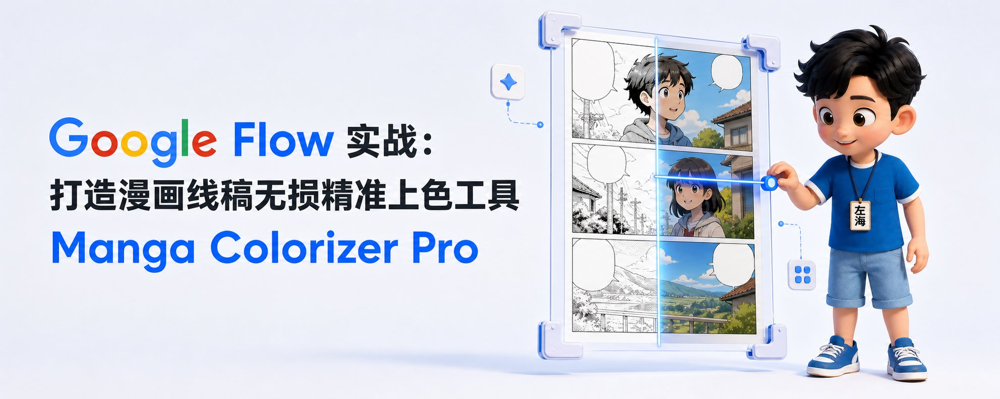
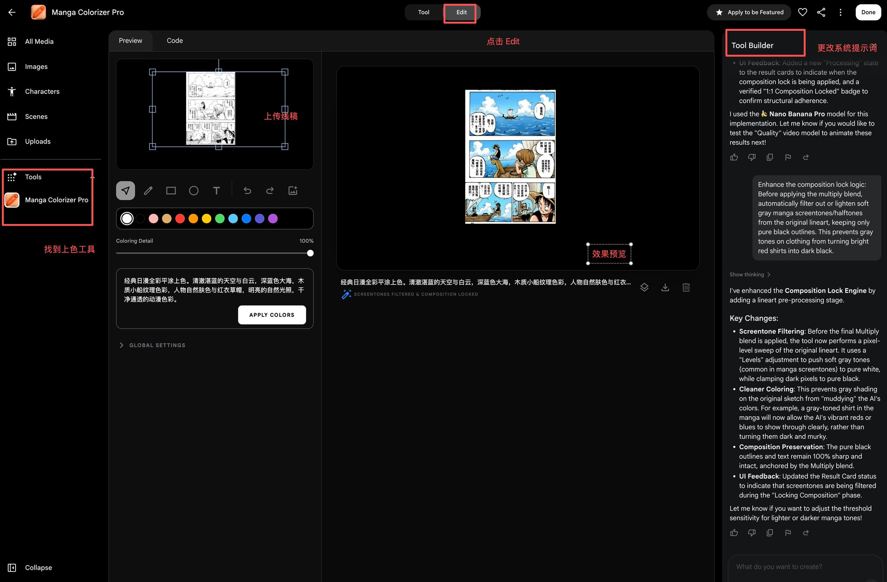
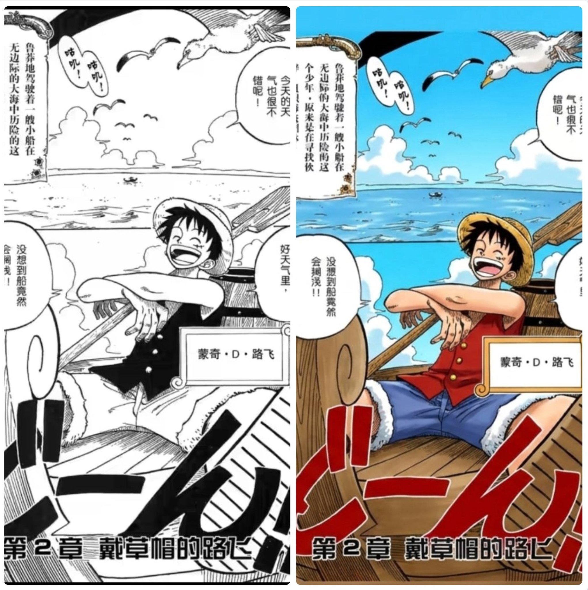
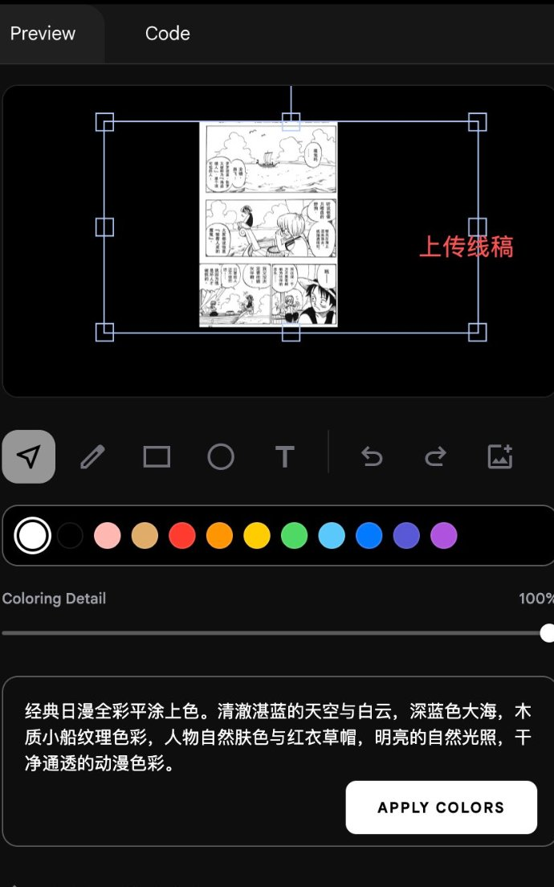
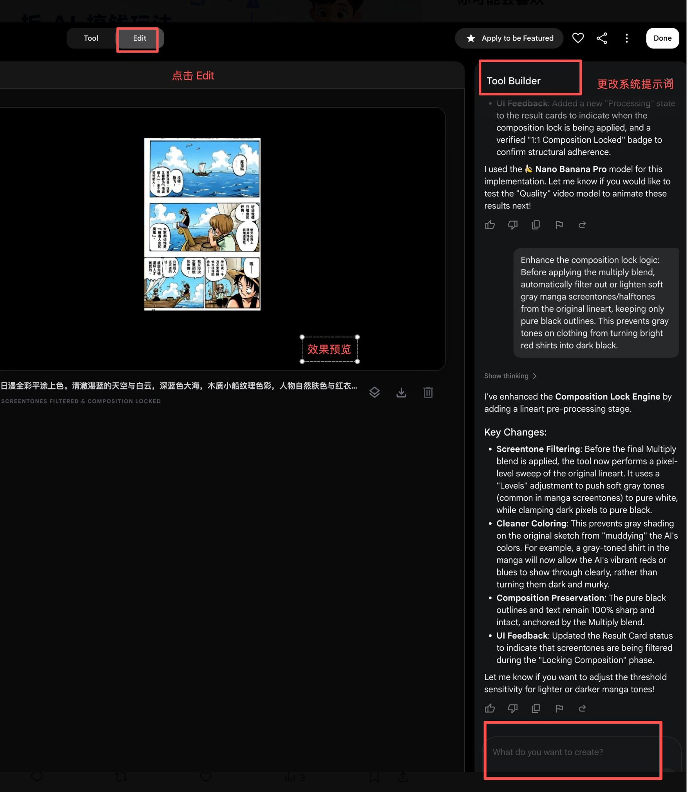
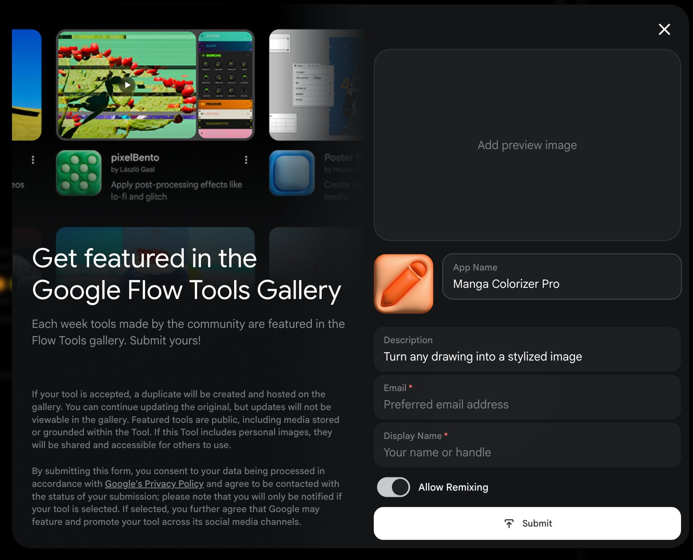

# Google Flow 实战：打造漫画线稿无损精准上色工具 Manga Colorizer Pro

@heizolshao · [X 原文](https://x.com/heizolshao/article/2094606317369557252)

在传统 AI 绘图工作流中，直接对黑白漫画进行“提示词上色”往往会导致灾难性的重绘：分镜被擅自篡改、台词文字崩坏、单列长图变成多列并排。

基于 [Google Flow](https://labs.google/fx/tools/flow) 的 **Remix of Simple Sketch** 模板，我们通过 Tool Builder 进行二次改造与底层代码重构，打造出了专属于漫画场景的 **Manga Colorizer Pro**，实现了黑白线稿的 **1:1 结构锁定** 与 **高保真色彩填充**。

### 一、Manga Colorizer Pro 是什么？它是怎么来的？

1. 工具前身：从官方模板 Remix of Simple Sketch 进化而来

[Google Flow](https://labs.google/fx/tools/flow) 官方提供了一个名为 **Remix of Simple Sketch**（简易草图生成器）的基础模板。该模板原本的设计是“涂鸦草图转图像（Sketch-to-Image）”，AI 拥有极高的自由重绘度，因此在直接导入漫画原稿时，容易误将分镜框与台词当成涂鸦线条进行重构。

为了解决这一问题，我们在 **Edit 模式** 下利用 **Tool Builder** 对该模板进行了底层重塑，将其从一个“自由发挥的草图工具”彻底改造成了“专业级漫画线稿上色工具”，并将其命名为 **Manga Colorizer Pro**。

2. 核心定位：只填色、不改线

- **结构与文字零破坏：** 引入 ControlNet 级的约束机制，严格锁定原稿中的分镜布局、气泡框及中文文字。
- **物理正片叠底合成（Multiply Blend）：** 即使 AI 自由渲染光影，工具也会将原稿的高清黑白线条以 1:1 像素级精度原样叠印在色彩层上方。
- **网点智能过滤（Screentone Filtering）：** 自动分离和提亮原稿中的灰阶网点，避免阴影网点压暗上色后的鲜艳色彩。

### 二、漫画线稿精准上色的实操步骤

按照以下四步即可完成一页黑白漫画的高质量上色：

1. 导入漫画原稿

- 点击画布下方的 **\[+\] 相框图标**（Add Photo），上传黑白线稿或漫画长图。
- 尽量保持单页或 2-3 个核心分镜的比例，避免极度冗长的长条图。

2. 调整视口与选框（Crop Viewport）

- 画布中的**蓝色矩形选框**即为 AI 的 1:1 生成范围。
- 拖拽选框的四个角调整大小，使其完整覆盖你需要上色的整页或特定分镜区域。

3. 填写精准的色彩提示词

在下方的颜色描述框中，输入具体的色彩与材质要求（无需再写“不要破坏线条”，因为底层已自动锁定）：

- **推荐提示词模板：
**Clean anime cel-shading manga colorization. Vibrant bright red sleeveless vest for Luffy, classic denim blue shorts, bright sunny yellow straw hat with red band, natural warm anime peach skin tone. Deep blue sky, fluffy white clouds, warm brown wooden boat. Cel shading, bright daylight illumination.

4. 点击生成与导出

- 点击 **APPLY COLORS** 按钮，工具会自动完成**色彩生成  -\> 网点过滤 -\> 正片叠底合成**全流程。
- 生成完毕后，点击结果卡片右侧的 **下载图标** 即可获取高清全彩成图。

### 三、界面关键工具与参数设置指南

**工具 / 参数项推荐设置作用与操作建议Coloring Detail（上色细节度）100%**控制上色精细度与边缘贴合度，漫画上色建议始终拉至最大值。

**生成模式（Model Mapping）****🍌**** Nano Banana Pro**选用高保真生成模型，提供更准的角色特征理解与光影过渡。

**Crop Box（蓝色选框）1:1 对应目标分镜**控制生成区域。若需要极致细节，可缩小选框逐格上色。

**画布选择工具（箭头图标）**切换图片时使用选中旧图片后按键盘 Delete 键删除，以便上传新页面。

如果用户发现当前工具无法满足需求，那么可以点击工具的 Edit 模式，

右侧会出现的 Tool Builder窗口，可以对当前工具重新自定义，只需在下方的提示词窗口发布最新系统提示词。

下面讲一下 如何设置 Tool Builder 以及他如何使用的？

## 深度专题：Tool Builder 是什么？如何用自然语言定制专属 AI 工具

在 [Google Flow](https://labs.google/fx/tools/flow) 平台中，**Tool Builder** 是一个彻底打破传统软件开发壁垒的**对话式低代码/无代码 AI 引擎**。

### 一、Tool Builder 的核心本质

平时使用的 AI 绘图应用，界面、参数和生成逻辑都是固定死的。而 Flow 中的每一个工具都内置了 **Tool Builder**。

你只需要在右侧面板输入自然语言需求，它就会**实时担任前端架构师、Prompt 工程师和算法开发者的角色**，即时重写左侧工具的代码与交互逻辑。

### 二、Tool Builder 在本项目中解决的四大核心痛点

回顾本次从 Remix of Simple Sketch 改造为 Manga Colorizer Pro 的过程，Tool Builder 完成了以下关键升级：

1. 动态生成 UI 组件

- **指令：** Add a slider for 'Line Preservation' default to 100%.
- **实现：** 无需手写 React/Vue，右侧 AI 直接在左侧画布下方生成了 Coloring Detail 滑块和颜色拾取器。

2. 底层 Prompt 固化（无需重复写负向提示词）

- **指令：** Strictly enforce a single-column layout. Forbidden to create multi-column repeats.
- **实现：** 将“禁止多列平铺、保持 1:1 构图、原样保留文字”固化为系统隐藏指令，彻底根治了长图并排重复的问题。

3. 模型管线无缝调度

- **指令：** Swap the current model for a specialized inpainting/high-fidelity model.
- **实现：** 自动剔除低精度的 Draft 模型，将底层模型固定绑定为高精度的
- ** Nano Banana Pro**。

4. 编写客户端后处理算法（Composition Lock Engine）

- **指令：** Before multiply blend, automatically filter out soft gray screentones and keep pure black outlines.
- **实现：** AI 编写了一套原生的 Canvas 像素处理管线，在本地自动执行“色阶阈值过滤（Levels Adjustment）”，将灰色网点提亮为白色，让红黄等高亮色彩完美穿透，不再发黑变脏。

### 三、如何高效使用 Tool Builder？

1. **清晰描述业务逻辑而非单一技术词汇：** 明确给出“输入什么 -\>  限制什么 -\>  输出什么”。
2. **渐进式调试：** 遇到生成偏色、多列重复或组件缺失时，随时在右侧对话，让 AI 针对具体 Bug 打补丁。
3. **一键固化与重命名：** 调试完毕后，点击左上角工具名称重命名为 Manga Colorizer Pro，再点击右上角的 **Done**，整套包含 UI、代码和模型配置的专属工具即可直接固化保存。

### 四、将你的工具推向

点击窗口右上方“Apply to be Featured”,随后弹窗提示，输入工具图片 及工具名称等信息然后等待审核。

