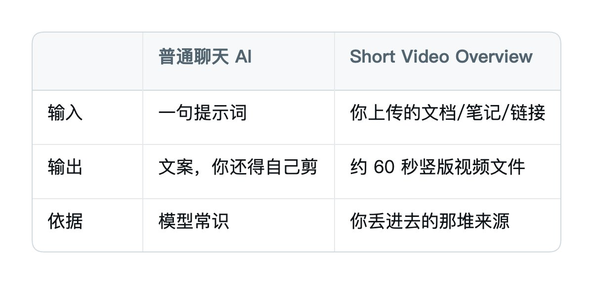
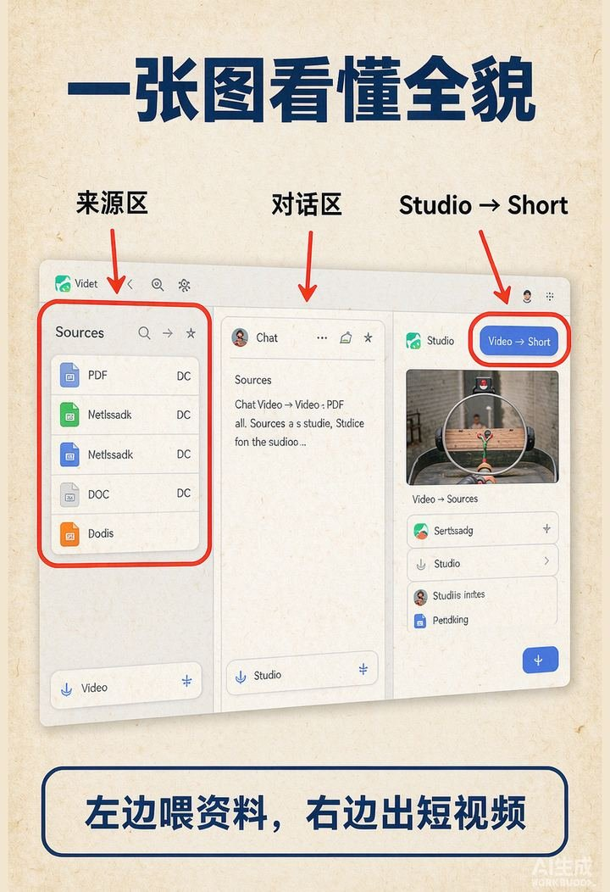
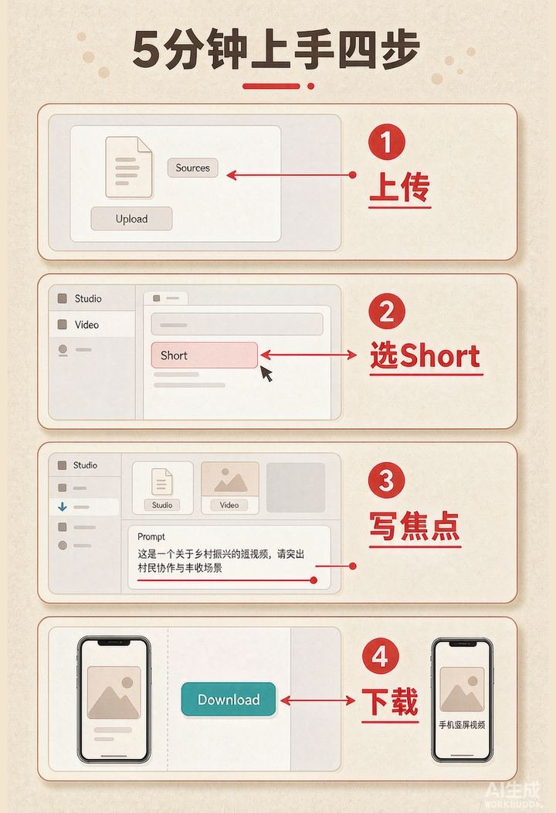
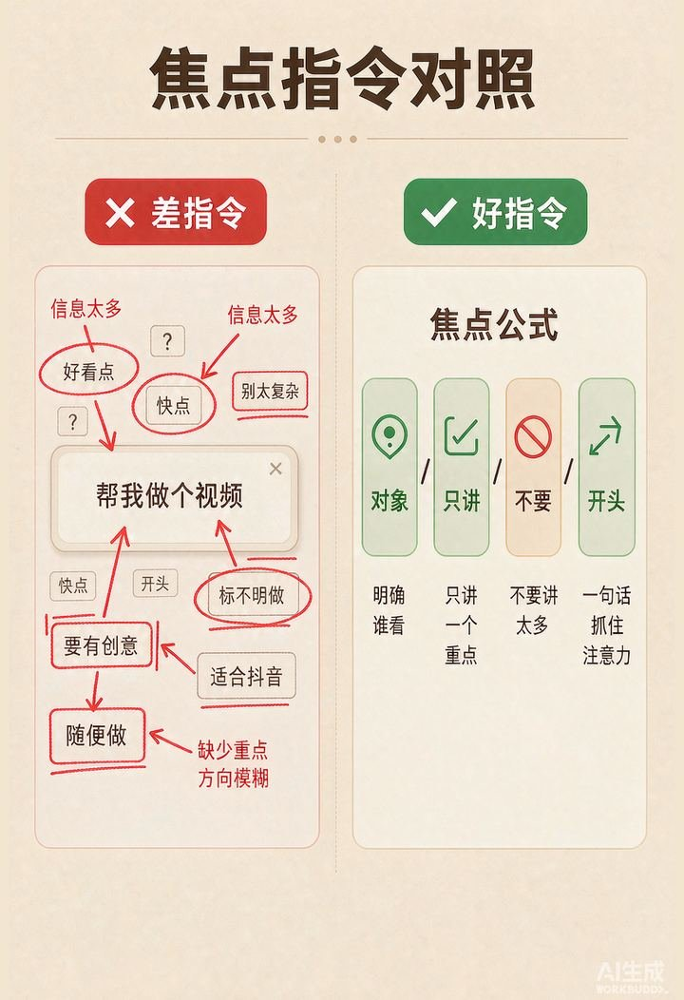
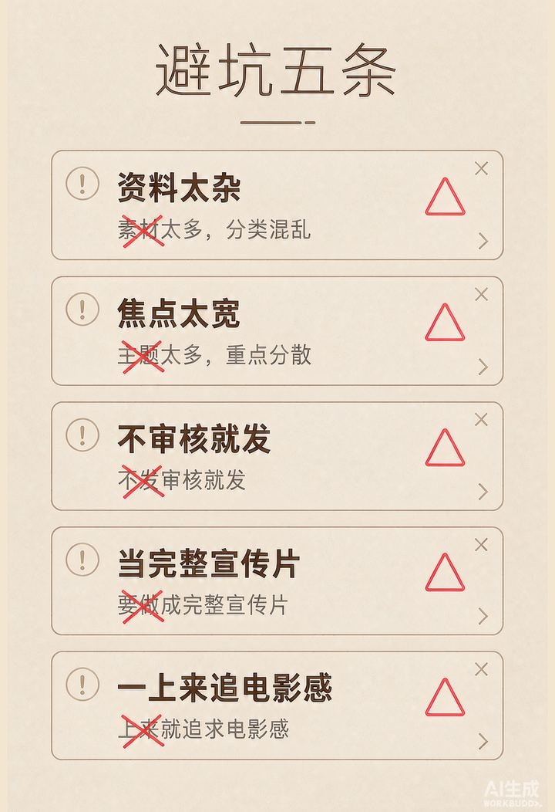
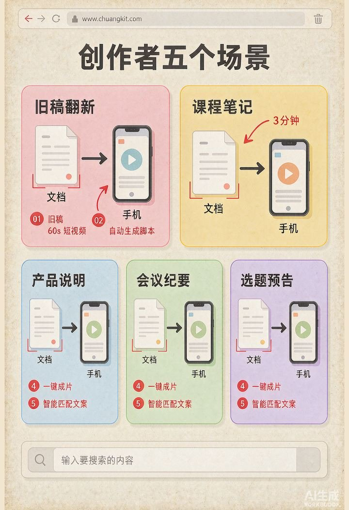

# 文档从0-1变60秒竖版短视频

@Shenmeili1213 · [X 原文](https://x.com/Shenmeili1213/article/2095486436778602533)


之前写过不少「AI 帮你出图、帮你写稿」的东西。
评论区最常见的一句是：
图会做了。 稿会写了。 **短视频还是卡着。
**不是不想发。 是剪辑门槛还在。

开剪映、对时间轴、抠字幕、找 BGM—— 一篇旧稿，剪成 60 秒竖版，普通人常常要折腾半小时起步。

那不如换一条路：

**把文档丢进去，让它直接吐一条 60 秒竖版。**

工具名：Google NotebookLM 的 **Short Video Overview**（短视频概览）。 公开报道里的口径很直白——上传 PDF、文档、笔记，生成约 **60 秒**、**9:16** 竖版，带旁白和教学向动画，适合 Shorts / Reels / TikTok / 视频号这种竖屏位。

这篇不讲模型参数。 讲你怎么从 0 跑通第一条。

照着走一遍。 你至少能拿到一条能下载的竖版短视频。

话不多说，直接开始。

## 一、它是什么

一句话：

**它是一个「读你的资料 → 压成 60 秒竖版解说」的按钮。**

不是空白文生视频。 不是你写一句提示词，它在空气里编故事。

你先把资料放进笔记本。 它基于这些来源，挑重点、写旁白、配画面。

跟普通聊天 AI 的区别很大：



它能干的事包括：

- 把长文压成手机竖屏解说
- 把会议纪要变成 1 分钟要点片
- 把产品说明变成可转发短片
- 把课程笔记变成复习 Short

记住一句：

**资料是原料，60 秒是模具，旁白+动画是外壳。**

## 二、大框架图解：一张图看懂全貌

先别急着点生成。 花一分钟把界面站位记清楚。

打开 NotebookLM（网页或 App），进到某个笔记本后，大致是：

**左侧 / 来源区**：你丢进去的 PDF、Docs、网页、粘贴文本。 **中间 / 对话区**：你问资料问题的地方（今天可以少用）。 **右侧 / Studio**：出成品的地方——Audio、Video、幻灯片、测验都在这。

今天你只盯右侧 Studio：

**Video → Short**

一句话记住：

**左边喂资料，右边出短视频。中间别折腾。**



## 三、5 分钟上手实操

### Step 1：准备一条「够短」的原料

别一上来扔十个 PDF。 第一次只准备 **1 份** 你最熟的文档。

适合当原料的：

- 你自己写过的公众号 / 小红书长文
- 一页产品卖点说明
- 会议纪要（已经有结论的那种）
- 课程笔记里「只讲一个知识点」的那一节

不适合第一次就扔的：

- 整本电子书
- 杂乱聊天记录合集
- 没有标题、没有段落的纯碎碎念

脱敏提醒：客户全名、手机号、银行卡、未公开合同价，先涂掉再上传。

### Step 2：建笔记本并上传

1. 打开 NotebookLM，登录 Google 账号
2. 新建一个笔记本，名字随便，比如「60s-竖版测试」
3. 上传刚才那份文档（或贴链接 / 粘贴文本）

看到来源列表里出现文件，这一步就过了。

### Step 3：走进 Studio，选 Short

右侧 Studio → **Video** → 选 **Short**（短视频 / 竖版那一项）。

注意区分：

- **Short**：约 60 秒，竖版 9:16，抓一个重点，适合手机刷
- **普通 / 横版 Video Overview**：更长、横屏，适合慢慢讲
- **Cinematic**：更电影感，不是今天这条入门线

新手只选 Short。 别在第一天纠结电影感。

### Step 4：写焦点，再点生成

系统常会从资料里抽出几个主题建议。 你也可以自己写焦点。

差指令：

> 帮我做个视频

好指令：

> 只讲「文档怎么变成 60 秒竖版」这一个动作。面向不会剪辑的普通人。语气干脆。前 3 秒给结论。不要展开工具史。

然后点 **Generate**。 等它渲染完。

做完以后，先看三件事：

1. 有没有明显胡说（资料里没有的数字、结论）
2. 旁白是不是围着你写的焦点转
3. 能不能下载到本地

能下载，第一条就算跑通。

不满意怎么办？

**不要推倒重来换十个工具。**改焦点，再生成一次。

比如：

> 上一条太散。只保留「三步操作」。删掉所有产品背景。

同一笔记本、同一来源，多试两三次，比换五个 App 更快。



## 四、跟它「对话」的三种方式

很多人问：怎么控制它别乱发挥？

其实就三种用法。

### 方式一：直接生成 → 它直接出片

适用：资料本来就短、主题本来就单一。

上传一篇 800 字短文 → 选 Short → 直接 Generate。

适合「旧稿翻新成竖版」。

### 方式二：先写焦点 → 确认方向再生成

适用：长文、多观点、容易跑偏。

先在焦点框写清：

- 给谁看
- 只讲哪一个点
- 不要讲什么

再生成。

花 30 秒写焦点，往往省掉两轮废片。

### 方式三：只预览，不发布

适用：你还不确定要不要公开。

生成 → 自己看 → 对照原文核对 → 再决定发不发。

**AI 负责出片，你负责把关。**这是底线。

总结一下：

| 方式 | 你做什么 | 它做什么 | | :--- | :--- | :--- | | 直接干 | 丢一篇短文 | 直接出 60 秒 | | 先焦点 | 写清只讲什么 | 按焦点压片 | | 只预览 | 核对后再发 | 只给你文件 |

## 五、Short 和横版到底怎么选

别被名字绕晕。 用场景选。

|  | Short 竖版 | 横版 Video Overview | | :--- | :--- | :--- | | 时长 | 约 60 秒 | 更长 | | 比例 | 9:16 | 16:9 | | 用途 | 刷、转发、预告 | 学习、完整讲解 | | 信息量 | 只抓主点 | 能铺更多细节 |

一句话：

**要发朋友圈 / 视频号 / TikTok，选 Short。** **要自己把一章课听懂，选横版。**

今天这篇，只教 Short。

## 六、焦点指令怎么写才稳

Short 只有大概一分钟。 它必须扔东西。

你不指定焦点，它就自己扔。 自己扔，常常扔错。

用这个公式：

```text
对象：给谁看
只讲：一个动作 / 一个结论
不要：背景史、堆功能、堆形容词
开头：前3秒先说结果
```

示例 1（旧稿翻新）：

> 对象：做自媒体但不会剪辑的人。只讲如何把一篇旧公众号压成 60 秒竖版。不要介绍 Google 历史。前 3 秒说「文档进，竖版出」。

示例 2（产品说明）：

> 对象：想了解这款面膜怎么用的顾客。只讲「清洁-涂抹-等待」三步。不要讲成分研发故事。

示例 3（会议纪要）：

> 对象：没来开会的同事。只讲今天拍板的 3 个决定和下周负责人。不要复述争论过程。



## 七、生成之后去哪发

下载后，常见去处：

- 视频号 / 抖音 / TikTok / Reels：直接当竖版发
- 公众号：当封面视频或文内短片（注意平台审核与 AI 标识规则）
- 私域：丢社群当「今日 60 秒」

发布前再做两件小事：

1. **片头 1 秒**：如需品牌，可用剪映只加标题贴纸（不必重剪整条）
2. **文案区**：标题写成「文档进，60 秒出」，比「AI很强」更清楚

你不是在发「AI 演示」。 你是在发「一条能看懂的短片」。

## 八、权限、语言、配额（新手先看清）

公开报道与评测里，常见口径是：

- 功能面向 **Google AI Pro / Ultra** 等付费档优先开放
- 早期以 **英语** 体验更稳；其他语言在陆续放
- 免费档「后续开放」的说法有，**以你账号当天界面为准**
- 用量可能按计算量计，不再是「一天点几次」那么简单；重活（视频）更吃配额

所以你写教程给人看时，别写死「人人免费无限出片」。 写：

**先看你账号 Studio 里有没有 Video → Short。有，再跟做。**

没有，就先用 Audio Overview 练「资料进、成品出」的肌肉，等 Short 对你开放。

## 九、避坑指南

### 坑 1：资料太杂

差：把一年聊天记录全扔进去。 好：一次一个主题，一份主文档。

60 秒装不下十个观点。 你塞十个，它只会糊成一句正确的废话。

### 坑 2：焦点太宽

差：「把这篇文章讲完」。 好：「只讲文中第 2 个方法」。

### 坑 3：不审核就发

差：生成完直接发公域。 好：对照原文听一遍，错数字、错结论先改焦点重生，或本地加字幕纠正。

旁白会「抹平」细节，甚至夸张。 这不是阴谋，是压缩必然。

### 坑 4：把它当完整宣传片

差：指望一条 Short 讲完品牌全案。 好：一条 Short 只打一个钉子——一个卖点、一个步骤、一个结论。

### 坑 5：一上来追求电影感

差：第一天就钻 Cinematic、多风格、多语言。 好：先用默认 Short 跑通「上传→生成→下载」。

Serena 那篇讲 WorkBuddy 时说得很对： **先跑通一个简单任务，再进阶。**

这里一样。



## 十、内容创作者专属场景

这几个是我自己会反复用的。

### 场景 1：旧稿翻新

把去年的一篇干货公众号丢进去。 焦点写「只保留可执行的三步」。 当周更短视频预告，再把长文链接放评论区。

长文还在。 竖版负责拉人点进来。

### 场景 2：课程 / 笔记复利

一节课记了 2000 字。 Short 只讲「今天唯一公式」。 发给没来的人，比甩长录音更有人看。

### 场景 3：产品说明 60 秒

说明书没人读。 把「怎么用」三步做成竖版。 电商详情页、社群、直播切片都能复用。

### 场景 4：会议纪要可视化

周会纪要 → Short 只讲拍板事项。 老板刷完 60 秒，比翻文档快。

### 场景 5：选题预告

下周要写的大纲先丢进去。 生成一条「预告片」测反应。 评论区冷，就换题；热，再写长文。



## 写在最后

NotebookLM 的功能很多。 这篇不求面面俱到。

你只要记住一条链路：

**文档进 → Studio 选 Short → 写死一个焦点 → 生成 → 核对 → 下载。**

从 0 到 1，不是学会剪辑软件。 是先拿到第一条竖版成品。

后面如果要续写，我可以补：

- 同一文档如何拆成 3 条 Short 系列
- 竖版短视频怎么配封面文案更敢点
- 国内替代路径怎么选（不会科学上网时）

有问题直接评论区扔给我。

功能信息来自公开报道与产品说明；配图为 AI 生成。 实际按钮名、配额、语言，以你账号当天界面为准。

芭提雅，某个傍晚。 栗子在把旧稿压成 60 秒。
