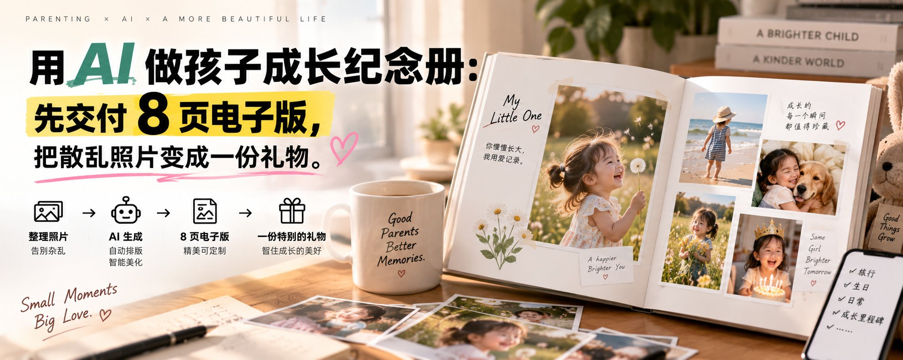

# 用 AI 做孩子成长纪念册：先交付 8 页电子版，把散乱照片变成一份礼物

@better_christal · [X 原文](https://x.com/better_christal/article/2097313106229960724)

很多家长手机里存着几千张孩子照片。

真正会把它们整理成一本可回看的纪念册的人很少。不是不重视，而是选照片、写配文、排版这三件事凑在一起，就足够让人拖半年。

普通人能做的不是“儿童摄影后期”，而是一个小而明确的整理服务：客户给照片和几句话，你用 AI 梳理时间线、补足短配文，再用 Canva 排成 8 页电子纪念册，交付 PDF。

先做电子版，不替客户印刷，不承诺修复照片，也不要把孩子照片送进来路不明的工具。

### 把产品定成 8 页，别一上来接一本 80 页相册

新手版可以固定为：封面 1 页、成长时间线 4 页、家人寄语 2 页、封底 1 页。客户选 20-30 张照片，给 5 条真实小事，你在 48 小时内交付 PDF。

测试价可从 49 元开始。客户要更多照片、加急、实体印刷对接，都是另一个产品。页面数和修改次数不先讲清楚，最后一定会变成无止境的“再放一张”。

服务说明里写明：照片版权和使用授权归客户；不公开展示案例；交付后 7 天删除素材；客户必须确认自己有权提供其中每个人的照片。儿童隐私不是附加项，是这门服务最重要的底线。

### 收素材时，只让客户做两件事

第一，按年龄或年份把 20-30 张照片放进一个文件夹，文件名写成“2023-06-第一次走路”这类简单标签。没有标签也没关系，但要至少分成三个阶段：早期、成长中、最近。

第二，回答 5 个问题：孩子昵称、纪念册覆盖的时间、最想保留的三个瞬间、家人想说的一句话、整体感觉想要温暖还是活泼。

不要替客户猜故事。AI 可以润色一句“第一次自己背书包”，不能把它扩写成客户没有说过的感人情节。

### 三个工具就够：整理、写字、排版

用豆包、ChatGPT 或 Kimi 整理时间线和配文；用文件夹或飞书表格核对照片；用 Canva 套用照片书模板。尽量不要把原图上传到多个 AI 平台，文字和照片分开处理最稳妥。

**Step 1：先做照片清单。** 在表格里列出文件名、时间、场景、预计页码。每一页最多放 4 张，页面才有呼吸感。

**Step 2：让 AI 写短配文。** 把客户提供的真实标签和寄语贴进去，只要 20-35 字的句子：

根据以下真实信息，为孩子成长纪念册写 8 条短配文。
孩子昵称：\[昵称\]；时间范围：\[年份\]；整体语气：\[温暖/活泼\]。
真实片段：\[逐条粘贴客户提供的照片标签和家人寄语\]。
每条 20-35 字，像家人写下的观察，不要使用“永远、最、注定”等夸张词。
不得补充未提供的经历、地点、人物或情绪。

**Step 3：先排封面和一张内页。** 把样张发给客户，确认色调、字体和昵称写法，再继续排余下 6 页。先确认风格，能省掉后面大改版。

**Step 4：固定版式。** 每个阶段用同一套：大图 1 张 + 小图 2 张 + 一句配文。不要每页换模板，也别给照片加 AI 生成的人脸、背景或文字。

**Step 5：导出前人工翻页。** 检查照片是否重复、姓名日期是否正确、文字有没有压到脸上、低清截图有没有被放大。手机预览一次，再导出 PDF。

### 交付时把“修改一次”说得具体

客户最常改的是照片顺序、错别字和一句配文。基础版可以包含一次集中修改：客户在同一份 PDF 上标页码和内容，你统一改完后再交付。

新增页面、替换超过 5 张照片、重新换整套风格，都属于新增工作。不是为了为难客户，而是为了保证你每一单都有一个结束点。

交付文件最好发两个：适合手机查看的 PDF，以及建议打印的高清 PDF。不要替客户把照片上传到公共网盘展示，也不要把可编辑 Canva 链接交出去，除非报价里已包含模板授权和后续编辑。

### 第一批客户，先从“生日礼物样册”开始

先用自己的童年照片、已获授权的家人照片，或完全无人物的成长主题图片做一本 8 页样册。把名字、照片和私密信息全部换成占位符。

在朋友圈发一张封面和一页内页，文案可以写：

我在测试电子成长纪念册：把 20-30 张照片整理成 8 页 PDF。
适合生日、毕业、纪念日送人。照片只用于本次制作，交付后删除素材。
首批 49 元，先看样张再决定。

先找真正有送礼时间点的人，比如孩子生日、幼儿园毕业、搬家或新生儿满月。不要把“感动”当成成交理由，客户能看到样张、知道照片如何处理、知道多久能交付，才会下单。

### 7 天验证：做出第一本，不要先囤模板

1. 第一天做一套 8 页样册和一个空白收集表；
2. 第二天把照片清单、配文提示词和修改规则固定下来；
3. 第三天向 10 位有明确纪念日需求的熟人展示样张；
4. 第一单只收 20-30 张照片，并记录完整耗时；
5. 第七天复盘客户最在意的是版式、配文还是隐私，再改产品说明。

AI 让配文和整理变快，但纪念册真正的价值，是把一堆没人会再翻的照片，变成一家人愿意留下来的几页故事。
