# 7天收入破百，1篇收入破千：微信贴图号这个风口，还在红利前中期

@qihang_zeng6688 · [X 原文](https://x.com/qihang_zeng6688/article/2082293843353821306)

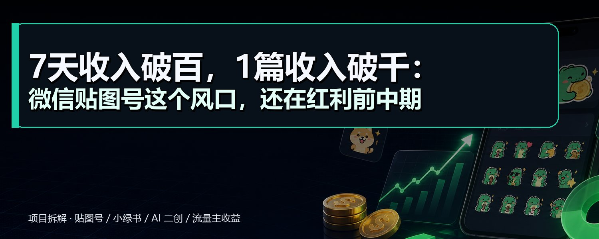

大家好，我是启航

今天给大家带来一个项目拆解

**微信贴图号**

**开始之前麻烦大家关注一下我，你的支持是我更新的动力！**

**为什么推这个项目？**

小风口项目，适合新人，上手快，拿到正反馈也很快，且项目正处于红利期，现在还算是项目红利的前中期，这个时候入局是能吃肉的。

**项目背景？**

腾讯推贴图主要是为了和其他内容平台竞争，例如：小红书等，让大家把贴图号当成小红书来发【贴图号也有另外一个名称：小绿书】，多创作内容，抢其它平台的流量，且贴图号现在不抓AI内容，门槛低，适合入场。

**这个项目怎么赚钱的？**

通过在贴图号发布图片这些内容，获取流量，评论区展示广告，用户点击广告，获取收益。

**项目的收入如何？**

近期好多朋友7天收入破百，单篇贴图收入破千的，配合上矩阵，单月收入可以过万。

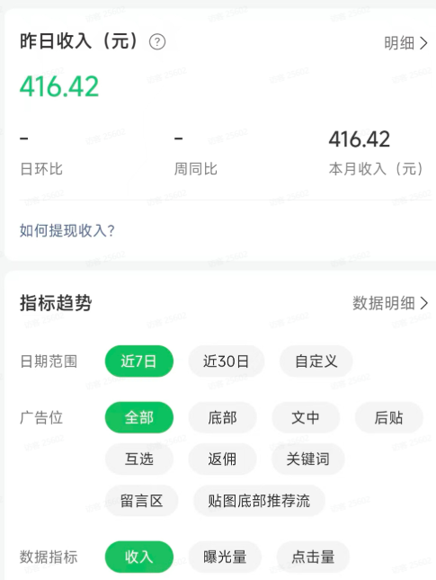

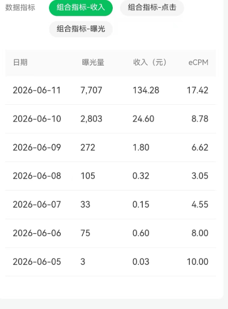

**1、准备账号**

手机端先下载微信公众号助手，然后微信注册

电脑端，网页搜索微信公众平台，注册公众号，微信公众平台网址：[https://mp.weixin.qq.com/](https://mp.weixin.qq.com/)

**2、100粉开通流量主**

这个100粉可以直接去买，某鱼有很多可以购买，一般100粉丝10元，这里就不做推荐了，大家自己去寻找

**为什么要买100个粉丝？**

100粉丝可以开通微信贴图号的流量主，咱们主要是靠流量主赚钱

**3、确定赛道**

常见的对标赛道有新老照片对比图，老照片回忆，日常感悟，生活对比图，落灰豪车，美食，人民币等赛道。赛道很多，不用太拘泥于几个赛道

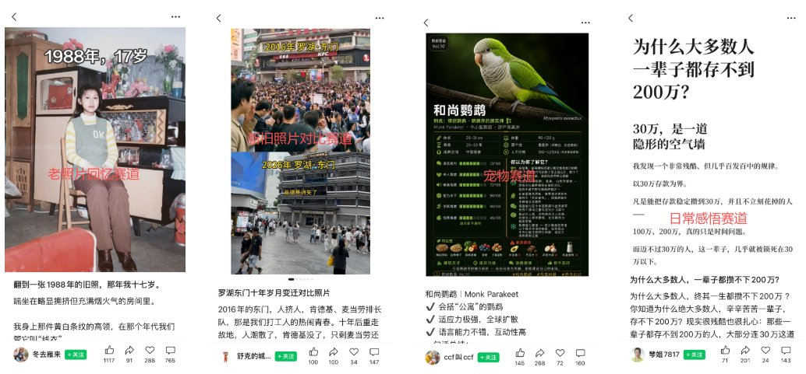

平时也可以多刷，刷到感兴趣的赛道或内容就截图保存，或者收藏都可以，日积月累就有自己的素材库了。

**4、找对标**

确定赛道之后就是找对标，顾名思义，就是找你想模仿的账号/内容，找对标这里有几个标准：

**①.找近期活跃的账号，最好每天都在更新，且更新较为稳定；**

**②.找近期有爆过的内容的账号，要保证内容模版的时效性；**

**③.找内容相对垂直的账号，不要找素人号，素人号爆掉的内容可能是巧合；**

下面举例：

这个账号就是，基本每天都会更新几篇，且7.22日爆过一篇，我搜集素材的时候是7.23日，且内容相对垂直，这种就是赚收益的账号。

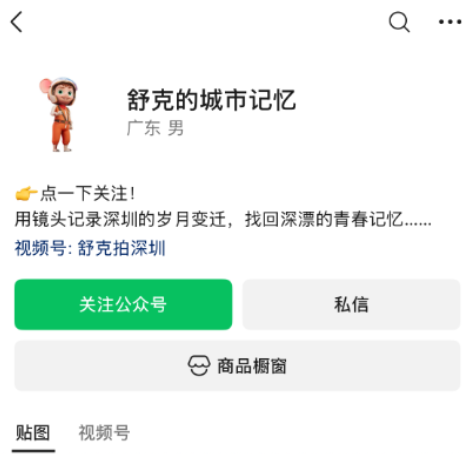

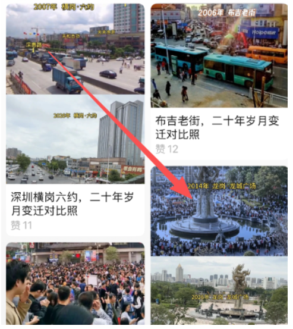

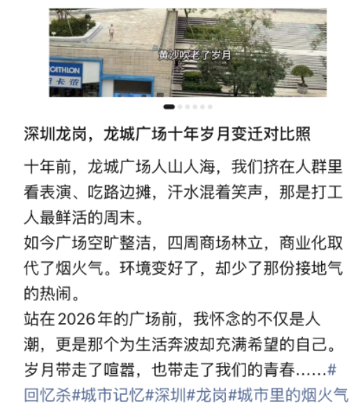

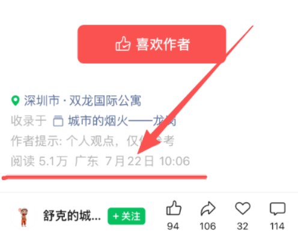

当然找对标，不要只找一个，可以多找几个对标。

一般前期起号，最好找同赛道的10个对标以上，不然防止单一模板没效果，如果单一模板没效果直接换对标账号，换内容模板，多测一下，找到适合自己的模板；

如果多个对标账号的内容模板，测出来都没有流量，那就可以考虑换赛道了；

极端情况可能是账号问题，可以直接注销重新来；

**5、模仿内容**

①找到对标账号，选择他的爆款内容；

例如下面是我找的一个对标贴图

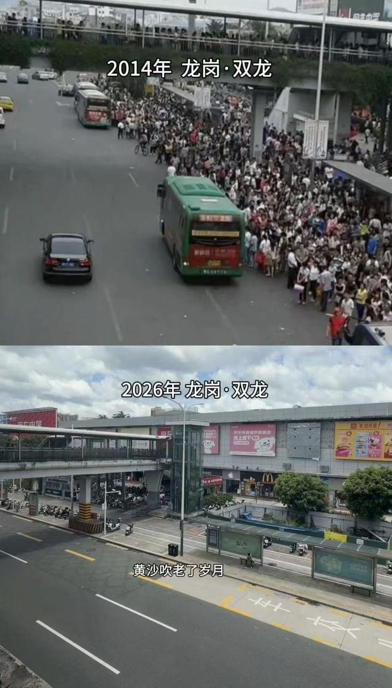

②图片截图下来，去水印

③喂给AI，可以修改数字文字，人物，背景，颜色，做旧图片等等【贴图号现目前不抓AI内容，所以这是这个赛道很大的优势】

我喂给ChatGPT的提示词，提示词可以多次迭代，后期形成稳定统一的提示词

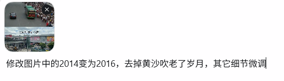

最终图片

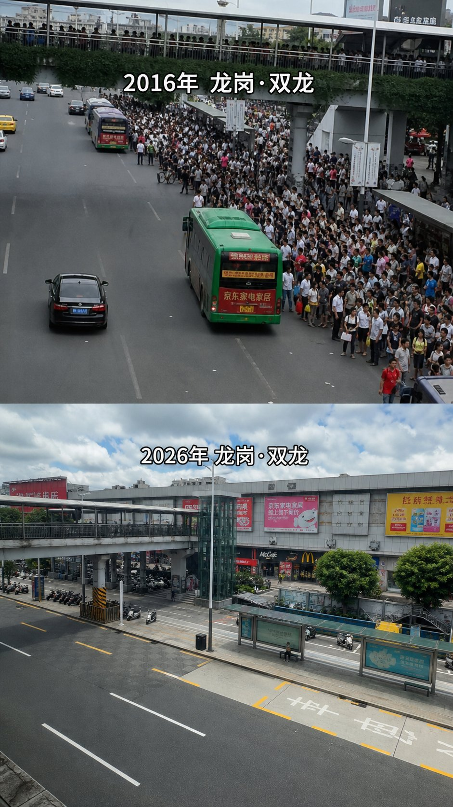

AI处理过后感觉有点新，可以让AI给他做旧一下

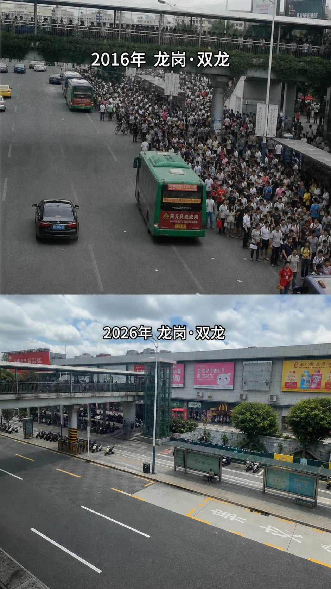

让AI调整之后，上半部分明显旧了一点，不满足还可以继续调整，至于下面图片的字体不清晰，可以保留，也可以继续调整，保留的话可以成为槽点，正好让观众多评论，方便获取收益。

④AI出的图片去一下水印

市面上各类去水印工具都可以

⑤发布内容，**标题也一定要模仿一下**，标题可以模仿你的对标账号的标题；

内容可以加可以不加，不影响流量；

标签可以加可以不加，不影响流量；

可以定时发布，定时发布不影响流量，后期想发布多篇就可以定时；

发布的具体步骤：

手机端进入公众号助手，点击贴图【电脑端：进入微信公众平台，登录，点击贴图】，下面是手机端的操作流程

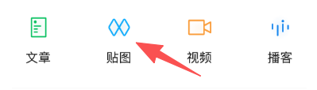

选择你想发布的图片内容，然后填写标题，内容标签等，点击发表即可

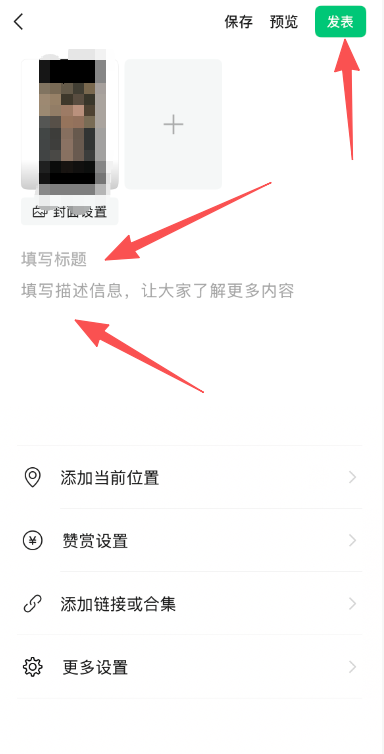

如何设置定时：点击更多设置，进入，然后点击定时发表，选择对应时间发表即可

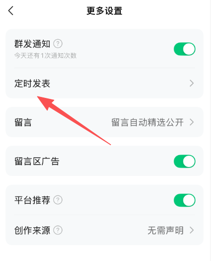

发布完成之后就可以静待效果了，一般两个小时过后才开始推流，所以前期不用着急没流量

前面几篇贴图一般会有流量券，大概10-20张左右，优先选择可能会爆的贴图使用，用好了能快速起号

前面一周一定要坚持每天发

单日流量没有破1000之前，一天发布一篇即可；

单日流量突破1000之后，一天可以发布两篇；

单日流量突破10000之后，一天可以发布3-5篇；

**常见问题解答：**

**1.新手做贴图号是否需要自己原创内容？**

新手前期尽量不要原创，原创大概率没流量，还浪费时间、容易自我怀疑；优先模仿、二创、复刻10W+的爆款。

**2.新号发布贴图后长时间0浏览、0播放，是否代表账号异常？**

新号前两三天无流量、发布后滞后几小时才有数据，属于正常情况；

建议发布后等待2小时左右再查看浏览量；

若长期持续个位数播放，可以判定账号异常，注销重开；

**3.无流量老公众号账号长期0播放，该怎么处理？**

无流量、无违规价值的老号直接立即注销重开，无需养号；

公众号支持即时注销，不用等待7天；

**4.发贴图不带任何话题标签可以吗？**

完全可以，贴图流量核心靠图片选题和内容吸引力，无需额外添加话题标签；

**5.贴图号流量主收益怎么结算、在哪里查看收益？**

流量主收益次日根据作品浏览量和曝光率自动结算；

网页版公众号后台可查看总收益；

尽早完善财务结算信息，未填写会被拖延至季度末结算；

**6.公众号助手找不到贴图发布入口怎么办？**

更新微信版本即可显示贴图发布入口，与公众号助手版本无关；

**7.新手如何快速做出10W+爆款贴图？**

全身心投入实操，每天固定时间发文；大量浏览爆款案例总结选题规律；

测出账号适配的起量选题后批量深耕；

单篇爆出10W+会带动账号其他作品流量，形成矩阵爆量；

**8.贴图号什么时间段发布流量效果最好?**

一般是中午11-1点，下午5-7点，晚上10-12点这几个时间段流量较好，可以选择在这些时间段发布。

还有朋友说凌晨有时候流量也不错，可以选择定时发布。

**9.贴图流量卡在1000播放无法突破，该怎么解决？**

坚持深耕豪车、生活对比、宠物、网约车吐槽等高潜力选题；

多篇作品稳定卡在1000播放后，有概率冲破流量池突破1万+；

不要随意更换已起量的选题；

**10.发布贴图没有评论，广告无法展示该怎么解决？**

手动自己留3条及以上评论，即可触发广告展示；

优先选择有争议、可吐槽、能引发对立的话题，自然提升评论量；

评论数量多少，广告单价差距最高可达20倍；

**大家还有什么问题评论区可以直接留言！**

**觉得有收获，也别忘记点赞收藏！**
