# 万字长文 | 闲鱼搞钱，从入门到精通

@OscarGrowth · [X 原文](https://x.com/OscarGrowth/article/2094990015264690614)

大家好，我是 Oscar，一个 00 后自由职业小白，分享副业搞钱案例和AI工具玩法，也在记录自己一路踩坑、一路学东西的过程。

最近我把两份东西摊开看了很久。

一份是圈友阿皓的复盘。他做了三年流量，表情包引流、小红书精准粉、私域转化都做过，今年转去闲鱼上做 AI 写作，一个半月纯利润两万。另一份是我自己整理的闲鱼从 0 到 1 的资料，里面有个数字挺唬人的，2026 年上半年，闲鱼上的 AI 服务卖出了 981.6 万单，接近 500 万人买过。

这种数字很容易让人上头。可我把两份东西放一起看，最在意的反倒是它们中间露出来的那条线。闲鱼是普通人门槛最低的搞钱入口没错，但真正决定你能走多远的，往往不是选品技巧，而是你抱着什么心态在做。

这篇我想从最基础的地方讲起，闲鱼到底怎么赚钱，一路讲到怎么把它做成一件能沉淀、能放大的事。

开始之前，希望大家点个关注，你的支持是我更新的动力。

**先泼一盆冷水**

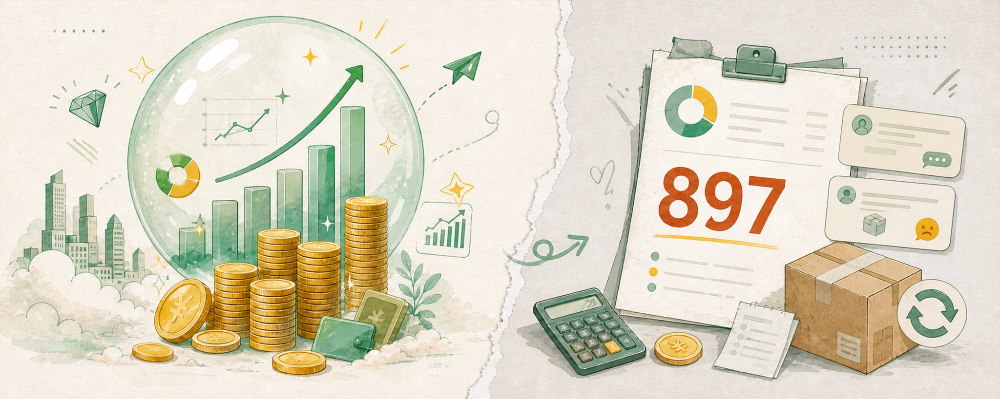

网上写闲鱼赚钱的，最爱展示月入一万、月入五万。

先记住另一个数字。2026 年上半年，闲鱼 AI 服务卖家的月均成交额是 897 元。

平台也披露过，有卖家半年卖出 1.7 万份 AI 教程。后一个数字适合拿去传播，897 元更适合你拿来做预算。两个都是真实口径，只是离多数人的距离完全不一样。

所以这篇不教你一夜暴富。我想讲的是一条普通人能照着走的路。先卖出第一件东西，再判断这事值不值得深做，最后把它从打一波快钱，变成一件能长期沉淀的事。

方法可以学，收入不能保证。这句话我先说在前面。

**第一部分：入门，先搞清楚闲鱼到底怎么赚钱**

**闲鱼赚钱其实就三种**

不管别人把玩法包装得多花，闲鱼上普通人能碰的赚钱方式，本质就三种。

第一种卖闲置。家里的旧书、键盘、小家电、运动器材，本来就买过、正占着地方，擦干净拍清楚卖掉。利润不高，但学到的东西很具体。

第二种卖服务。简历排版、图片去背景、录音转写、PPT 版式统一、AI 修图，都有人下单。你卖的是自己的时间和一点手艺。

第三种卖手艺或者经验。会画画的接痛板定制，会缝纫的做娃衣，长期带娃旅行的整理亲子行程。这类起步慢，但更难被别人抄走。

**新人该按什么顺序走**

我的建议很简单，先卖闲置，再卖服务，最后才碰手艺和囤货。

先卖闲置，是为了完整走一遍交易流程。你会第一次碰到砍价，知道买家最担心什么，也会知道一件二手货该留下哪些证据。这些是花钱买不到的成交经验。

再卖一项固定的小服务，是为了看看自己的时间到底值多少钱。等你摸清了什么东西有人问、每单要忙多久，再考虑寄卖、手作、小批量经营和开鱼小铺。

囤货可以晚一点。新人手里最缺的是成交经验，多背一屋子库存帮不上这件事。

这一层记住一句话就够了，先完成一笔交易，再谈放大。

**第二部分：选品，第一件商品怎么选**

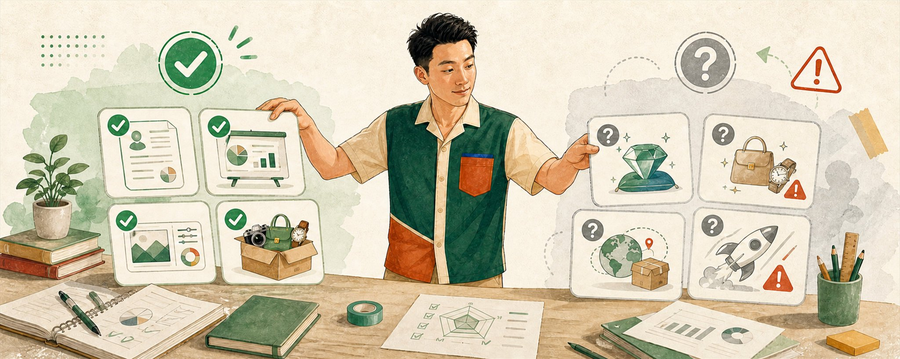

**别一上来就问蓝海**

很多教程一开口就讲蓝海、内部货源、批量铺货。先把这些词放一边，问一个更朴素的问题。

这件东西有人下单以后，我能不能按页面写的内容交出去？

家里闲置多，就挑八到十五件。来源清楚、功能正常、容易运输，最好还能说清购买时间。高价数码、奢侈品和名酒先别碰，它们对鉴定、包装和发货证据的要求很高，一次争议就可能把前面几单的钱吃掉。

想卖服务，先做三份自己的样例。样例做不出来，说明还没到收钱的时候。别拿同行的作品去试探市场，第一位买家真来了，你会立刻卡在交付上。

**第一轮可以测这几个方向**

下面这些方向比较适合拿来做第一轮测试。

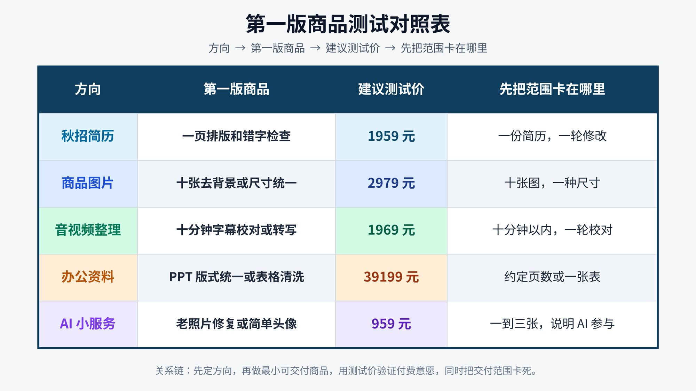

有一段真实经验也能做成商品。旅行攻略太空，换成上海亲子两日行程，按孩子年龄、住址和预算整理交通、预约与雨天备选，买家才看得见这 50 元买到了什么。

**一个我很认同的判断，选品就是选人群**

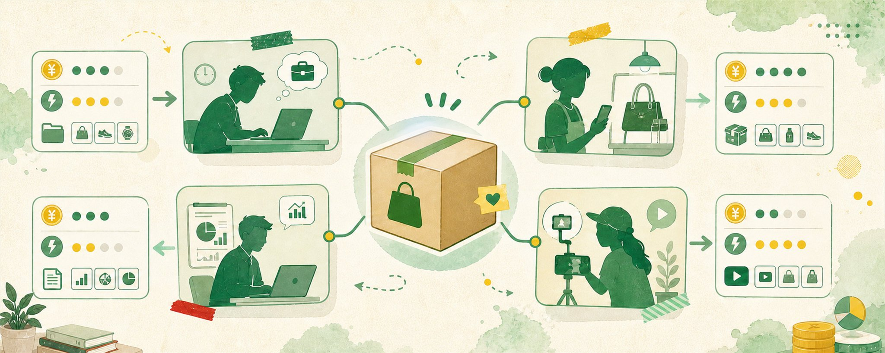

阿皓做 AI 写作时踩过这个坑。他一开始做剧本，咨询很多，成交率却很低。

问题出在人群上。剧本的咨询大部分是个人创业者和学生作业，很多人预算只有几十块，还爱比价，市场价可能 200 到 300 一分钟，无效咨询特别多，投流 ROI 跑不正。

后来他换成 PPT，咨询量和成交率都明显好转。项目没变，方向没变，就换了一个品类，结果就不一样了。

他有句原话我印象很深，选好赛道细分品类，敢报价，优化好话术，就能成交高客单，再把朋友圈 IP 打造好，复购也会很多。

所以主页第一批商品尽量只围着一个方向。简历、宠物用品、手机和情感咨询同时摆在一起，看起来货很多，信任反而散了。

这一层记住的话，从你能诚实交付的商品开始，别从看起来最赚钱的商品开始。

**第三部分：调研，发商品前先在二十个同行下面站一会**

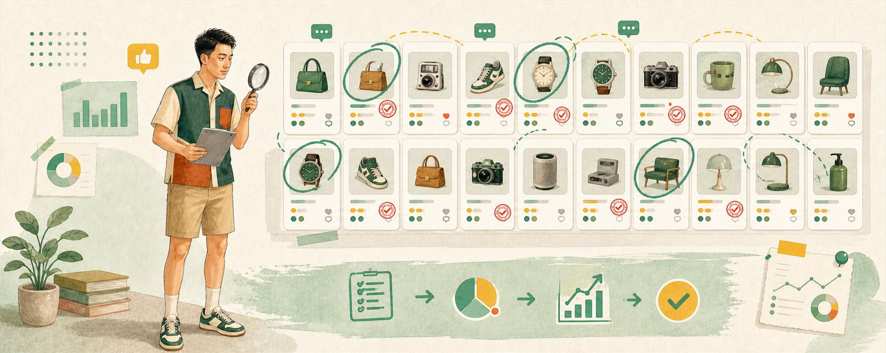

**别急着抄标题，也别把最高价当行情**

方向定了，先搜二十个相似商品。

开一张很简单的表，记下买家会搜的词、常见的价格、卖家写了哪些规格、哪些商品留下了较多评价和询问的痕迹。差评也要看。色差有没有说明，发货慢不慢，服务要改几次，成色和照片对不对得上，这些地方常常要花时间收拾。

挂牌价证明不了成交价。有人挂 299 元，只能说明他想卖 299 元。找到价格中间的位置，再看自己的成色、配件和交付内容在哪一档，会靠谱得多。

服务商品还要看清价格背后的数量。同行 9.9 元只做一张图，你 39 元做十张图还允许修改一次，两边卖的已经不是同一份东西。低价本身没那么可怕，页面故意把交付范围藏起来才麻烦。

调研完先别忙着感叹竞争激烈。把同行评论区和详情页里反复出现的问题，收进自己的商品说明。以后少解释五遍，就是实打实省下来的时间。

这一层记住的话，调研不是为了抄，是为了知道自己该站在哪一档、该提前堵住哪些坑。

**第四部分：上架，把商品链接写成一份小合同**

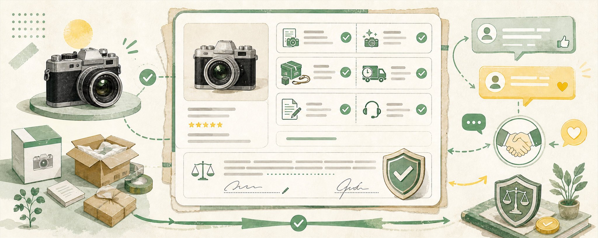

**先用 AI 打底稿，但型号得自己核**

2026 年上线的闲鱼 AI 相机可以识别商品、生成标题和描述，还能辅助定价。公测期间，已经有 1200 多万用户用它发布了 5000 多万件商品。

用它打个底稿很方便。但型号、容量、维修记录和划痕，仍然要自己核对。AI 把 64G 写成 128G，纠纷不会去找 AI。

**实物商品，至少写清这些**

商品名称和准确型号

购买时间与来源

使用频率和出售原因

功能状态与维修情况

划痕、磕碰和缺陷

原盒、线材与其他配件

是否包邮以及发什么快递

同城交易怎样验货

拍照顺序跟着买家的检查顺序走。第一张放完整商品，后面依次拍型号、接口、开机状态和配件，最后单独拍瑕疵。网图可以用来说明型号，不能冒充实拍。为了好看把划痕修掉，可能换来一次点击，也给售后埋下了雷。

标题不用写得神秘。一行里放进品类、准确型号、关键规格、真实状态和主要配件就够了。罗技 K380 蓝牙键盘，白色九成新，原盒，三设备切换，这样写既让买家看懂，也有可搜索的词。

**服务商品，要写另一组内容**

最终会收到什么文件

下单后需要提供什么材料

基础价格包含多少数量

预计多长时间完成

免费修改几次

哪些工作需要另外报价

哪些内容明确不接

专业、高效、包满意，听着很满，真有争议时一句也用不上。十张图、一种尺寸、二十四小时交付、免费修改一次，就清楚多了。买家能检查，你也知道做到哪一步可以停。

这一层记住的话，把每一个商品链接，当成一份你和买家都能照着执行的小合同。

**第五部分：报价，先算钱，免得忙完一看还在倒贴**

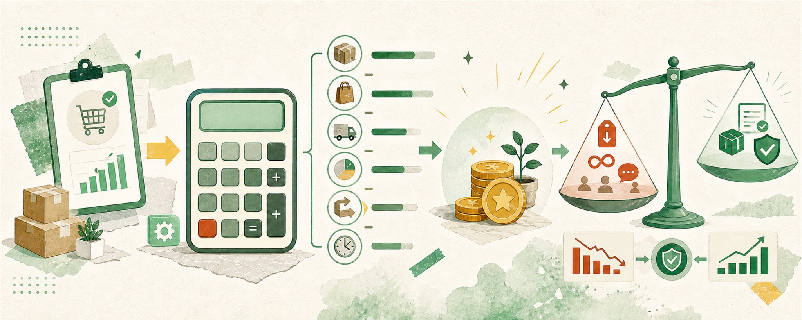

**每笔交易都算一遍账**

一件商品卖了 100 元，进货花 55 元，运费和包装再去 12 元，平台还要收费。账面上似乎还剩三十多元。可一旦退货，来回运费加商品折损，可能把前面几单一起吃掉。

记住这个公式。

净收入 ＝ 成交价 − 货品或材料成本 − 运费 − 包装 − 平台费用 − 退款损耗

服务类还要记工时。39 元改一份简历，沟通、排版、修改一共用了两个小时，时薪还不到 20 元。订单越多越忙，却没多留下多少钱，这个价格就该改了。可以缩小交付范围，也可以等样例和评价攒起来以后再提价。

**敢报价，是能不能赚到钱的分水岭**

这一点我从阿皓那里学到很多。他做了三年流量，最后发现自己更喜欢做转化，用户来了以后怎么聊、怎么判断需求、怎么抓痛点、怎么报价、怎么成交。

他说得很直接，很多人有流量，但不敢报价，或者报价以后接不住客户，最后 ROI 跑不出来。

测试价可以低，但修改次数必须写清。第一单最容易出的麻烦，就是双方都觉得稍微再改一下不算什么，最后一份几十元的服务来回折腾一晚上。

卖实物时，心里留三条线。页面标价用来展示，目标价是你愿意成交的位置，最低价决定什么时候结束谈价。对方继续往下压，客气地说一声不合适，通常比争论行情省事。

这一层记住的话，敢报价，也敢在合适的时候说不。

**第六部分：跑通，七天完成第一轮**

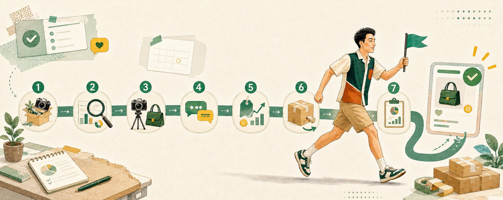

这一轮不用每天守着手机。每天做完一个能检查的动作就行。

第一天，列十件真实闲置，或者写出三个自己确实能完成的小服务。来源说不清、功能没法确认、平台不允许的，直接划掉。

第二天，搜二十个同行。记关键词、价格、规格和常见问题，最后只留一个主要方向。

第三天最费工夫。实物要拍照、测功能、记瑕疵。服务类要做三张自己的样例，还得把姓名和隐私抹掉。当天没做完也别急着上架，作品比先占个坑重要。

第四天，发三到八个商品。发布以后把自己当买家，从头读一遍。价格有没有前后不一，图片里有没有没解释的瑕疵，服务到底交什么文件。

第五天，开始处理询价。只回答能确认的事实，不为了留住买家随口承诺。有人连续问了两遍，把答案补回详情页。

第六天，只改一个变量。没有浏览，先换主图或标题。有浏览没人问，看看价格和需求。有询价没成交，通常是凭证、样例或售后范围还没让人放心。一次全改完，第二天即使数据变了，你也不知道哪一下有用。

第七天，把浏览、有效询价、订单、净收入和工时记下来。有三次有效询价，或者出了一笔真实订单，可以再测一周。完全没人问，先换商品或需求。这时候开第二个账号、买推广，往往只会把同一个问题复制一遍。

七天没出单不算白做。至少你已经碰到了真实的浏览和询价，知道问题更可能在需求、价格、图片还是信任。教程只能告诉你别人怎么卖，市场才会告诉你这件货在你手里能不能卖。

**第七部分：看数据，第一个月只看五个数字**

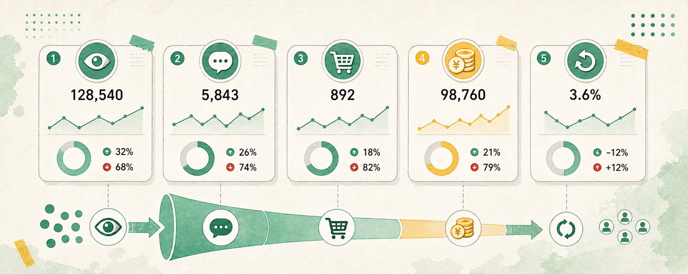

第一单完成以后，很容易兴奋得连发几十个商品。先忍一忍，继续做满三十天，只记下面五个数

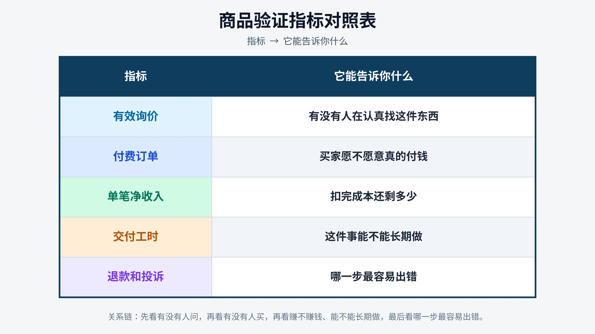

三十天里做成三笔订单，至少有一位买家愿意复购，单笔净收入和工时也能接受，这个方向就值得再投一点时间。

只有一笔订单、交付却拖了很久，可以提价或缩小范围。询价不少、成交很少，多半要补样例、凭证和售后说明。始终没人问，就换需求。多账号和付费推广只会让一个没人要的商品跑得更久。

**第八部分：进阶，从狩猎者到农耕者**

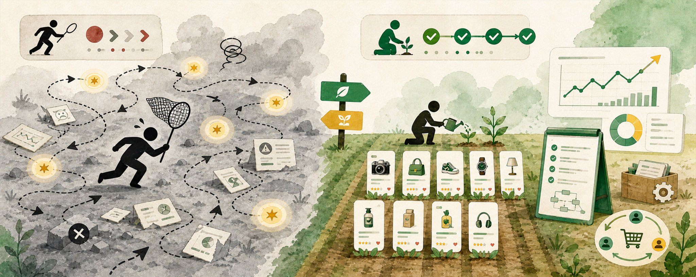

前面七部分讲的是怎么跑通 0 到 1。这一部分，是我从阿皓的复盘里挖到的、真正决定你能走多远的东西。

**两种做项目的人**

阿皓做了三年流量，赚过不少钱。表情包引流累计二三十万粉，精准粉打了几千个，私域转化也跑过。但他回头看，发现自己根本没有留下资产。粉丝大部分卖掉换了现金，账号封了就没了，下一次还是从 0 开始。

他用两个比喻区分了两种人。

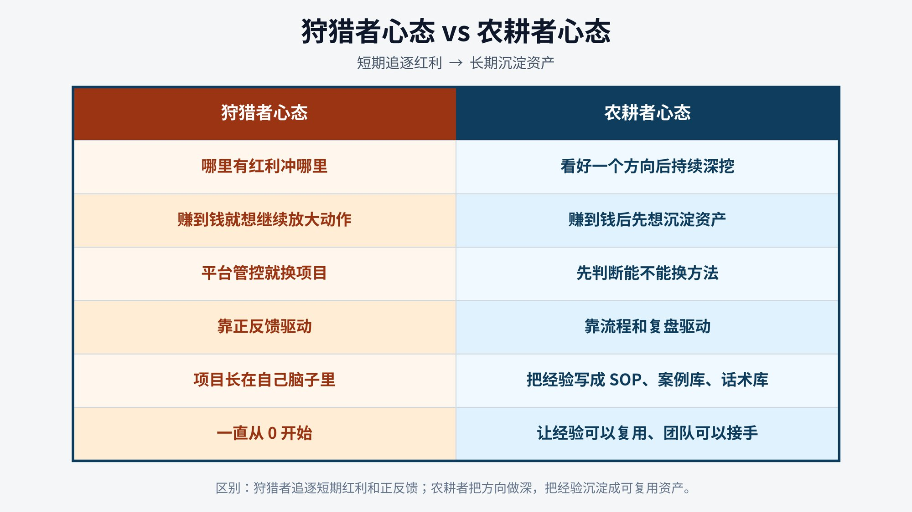

狩猎者能力不是坏事。能看到机会、敢下场、敢测试，很多人连机会都看不到。但如果只有狩猎者能力，就非常不稳定。赚一段，换一个，再赚一段，再换一个。几年下来经历很多，真正属于自己的资产很少。

**他这次做闲鱼，想当一个农耕者**

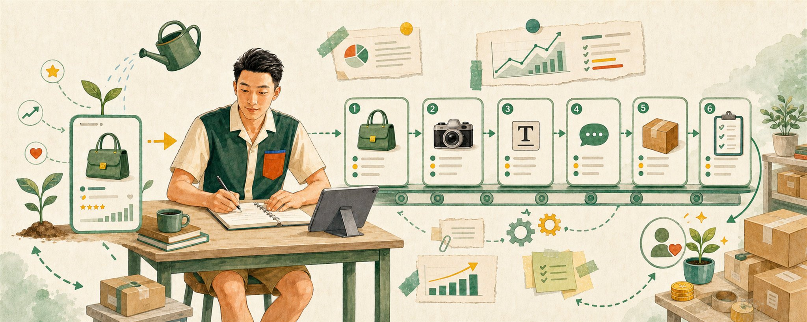

阿皓今年做闲鱼 AI 写作，一个半月纯利润两万。他做了三个账号，自己做前端流量和客服转化，交付外包给写手，成本按成交价的 15% 到 40%。

但这次他不想只打一波流量赚一波钱。他把流量怎么优化、客服怎么聊、写手怎么交付、质量怎么检查，一点点写成 SOP。他甚至用 Codex 做了一个工作流，每天抓取投流后台数据，根据投流 SOP 给出每个账号第二天的调整动作。

他有句话我一直记着，经验不沉淀，项目就永远长在自己脑子里。项目长在脑子里，就很难复制，后面想放大也很难把经验交给员工。

闲鱼跑通 0 到 1 靠执行力。可从 1 做到 10，靠的是你有没有把经验变成能交给别人的东西。

**如果你也总想换项目，先问自己五个问题**

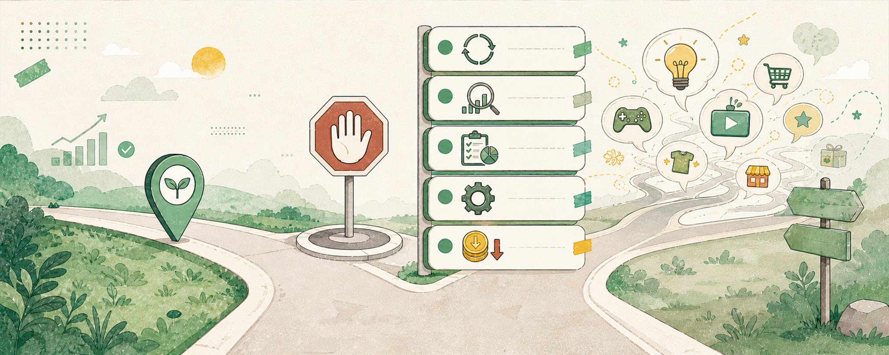

阿皓踩过太多换项目的坑，总结了五个问题，我觉得对每个想在闲鱼长期做下去的人都适用。

一，这个项目是真的不行，还是只是进入了瓶颈期。他做表情包时平台开始封号，第一反应是这个项目不行了，直接换。回头看，那时候完全可以换分发策略、调整内容形式，甚至转去跑流量主。他逃的不是项目，是问题。

二，我是在找更好的机会，还是在缓解当前的焦虑。小红书打粉不顺以后，他有很长一段时间每天刷视频、看别人赚钱，以为自己在找方向，其实只是用信息输入让自己觉得还在努力。AI 写作他 24 年就看到了，真正开始是今年 4 月，中间两年多大部分花在焦虑地等上面。

三，我在这个项目里留下了什么。哪怕项目最后不做了，也该留下一套 SOP、一套流量测试记录、一份客服话术、一批客户案例、一份踩坑清单。这些才是下一个项目的底层资产。

四，我有没有先尝试换方法，而不是直接换项目。免费流不行能不能测付费流，一个类目不行能不能换品类，成交差能不能优化话术，交付累能不能外包。很多时候真正该换的不是项目，是方法。

五，如果继续做 3 个月，我最应该沉淀哪一套能力。一个阶段只抓一两个核心能力，反而更容易推进。阿皓给自己定的很具体，这 3 个月只做两件事，把投流 SOP 写出来，把客服话术整理成 SOP。交付先外包，不铺太多精力。

这一层记住的话，闲鱼真正的复利，不在某一件爆款商品，在你有没有把每一单的经验沉淀下来。

**第九部分：避坑，这些钱新人最好先别交**

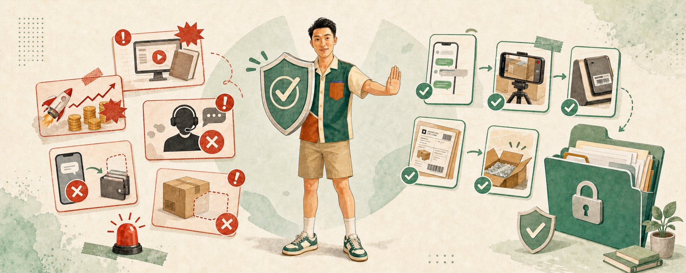

**无货源培训骗局**

2026 年 1 月，多名学员投诉一家闲鱼运营培训公司。报道里的大学生交了 1000 元所谓押金，培训方给出的数码货源，价格甚至高于官网零售价。

他做了一个半月，只卖出一个鼠标垫，利润约 10 元。他认识的二十多人里，多数一个月卖不出五单。申请退款时，押金又被解释成服务费，想退还得完成每月几十单的销售目标。

这类项目总有一张很好看的收入截图。等你没卖出去，原因会落到执行不够、账号权重不行、还需要升级货源。钱又要再交一遍。

判断货源课不需要懂多少运营。先把所谓内部价拿去和官网、淘宝及其他平台的公开零售价比较。连价格优势都没有，标题写得再漂亮也留不下利润。退款还绑着明显困难的销量条件，那笔钱就别按押金看。

第一轮测试总共只需要十件闲置或三份样例。花钱买课，解决不了尚未发生的问题。

**交易诈骗**

诈骗往往出现在新手刚收到第一条消息的时候。陌生买家发来外部客服链接，说账号被冻结，要求交保证金、解冻金或认证费，马上停手。闲鱼不会让卖家通过买家发来的私人链接交钱开通交易。

付款、聊天和售后尽量留在平台。验证码别给，屏幕共享别开，也别为省一点服务费转到微信交易。对方越催，这几件事越要慢下来。

**证据要跟着货一起准备**

实物交易常见的争议，是买家收货后说商品弯曲、损坏或和描述不符，再提出降价或退货。

发货前，在平台聊天里确认型号、配件和已知瑕疵。随后连续拍下外观、序列号、核心功能、装箱和封条，别在中间停镜头。运单、重量和寄件凭证也留下，高价物品尽量选可追踪、能保价的运输服务。

页面写一句售出不退，证明不了商品没有问题，也免不了依法应承担的责任。把事实说清，再把能证明事实的材料留下，遇到争议才有东西可谈。

**第十部分：规则，2026 年的费用和规则也得算进这门小生意**

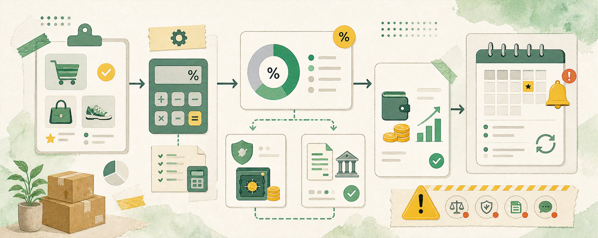

普通卖家的基础软件服务费通常按成交额的 0.6% 收，单笔最高 60 元。

从 2026 年 4 月 18 日起，鱼小铺订单通常按 1.6% 收费，60 元封顶也取消了。退款以后，已经扣掉的费用还可能不退。不同类目和订单会有差别，发布与成交页面显示的数字才是你最后要付的。

新手不用急着开鱼小铺。先做完三到五笔真实订单，确认有人买、算清利润，再看自己是不是需要多规格、数据工具和更多商品容量。

个人通过网络交易，年累计交易额不超过 10 万元时，通常可按零星小额交易免办市场主体登记。涉及许可经营的品类，仍然要有相应资质。平台也已经按规定报送经营者和从业人员的身份及收入信息，长期做下去，税务不能一直当作不存在。

这几条看着枯燥，真遇上退款时都和钱直接相关。标价少算一个点，卖得越多，漏得越多。

**真实案例，那笔小得不起眼的首单往往最值钱**

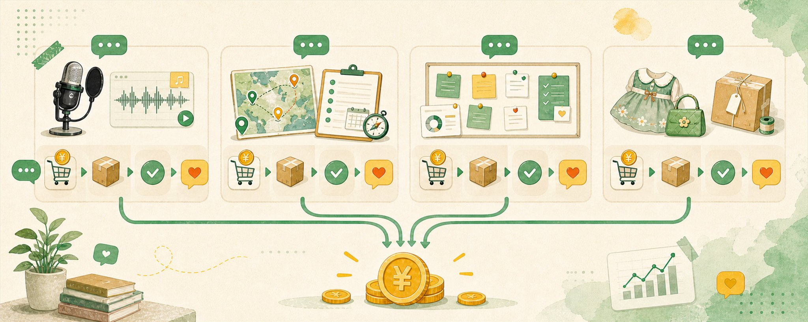

网上写闲鱼赚钱，最爱展示月入一万。我把几个公开案例放一起以后，反倒更想看他们第一笔钱怎么来的。

配音副业者陈东君，接到的第一笔商业单，是给银行短片配 50 个字，收入 60 元。字数、用途、价格都清楚，双方容易判断工作有没有做完。后来他每月最多收入数千元，但他从小接触表演，声音能力积累了多年，零基础的人不能直接照着算。

做早教的陈明，把带娃旅行的经验做成一份 50 元的亲子游方案。发布当晚三个人询价，一周接到 13 份订单。买家买的是省时间，也是花钱减少遗漏。没有真实旅行经验，拼几段公开攻略，交付出来的东西很难一样。

一名美术教培老师在闲鱼接痛板定制，每月约 40 单，副业月收入约 6000 元，复购比例 30% 到 40%，订单一度排到两个月以后。可一个痛板要做一个多小时。手工订单一多，先到上限的通常是两只手和晚上的时间。

娃衣卖家张雯洁的第一件作品花八小时做完，卖了 90 元。五年以后，她的鱼小铺升到最高等级，月收入稳定在一两万元。把 90 元和五年放一起，这个故事才完整。后来的收入有手艺、有款式、有复购，也有长时间的积累，不是一个标题技巧换来的。

这些案例有个共同点。都从一笔明确的小订单开始，后来的收入都建立在长期积累的手艺、经验和复购上。没有一个是靠标题技巧一夜起来的。

**最后留一张速查表**

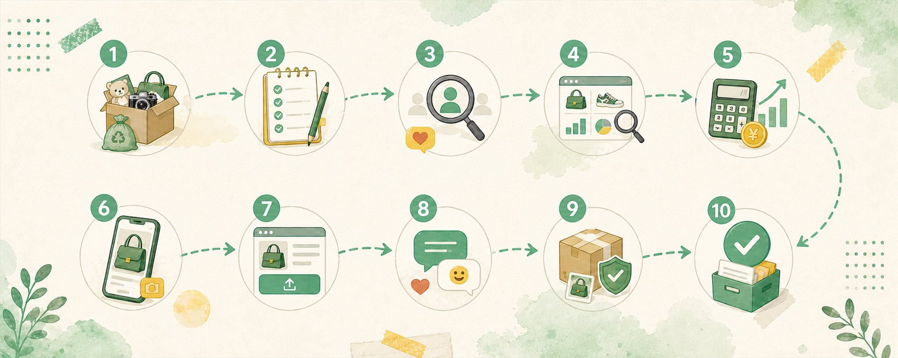

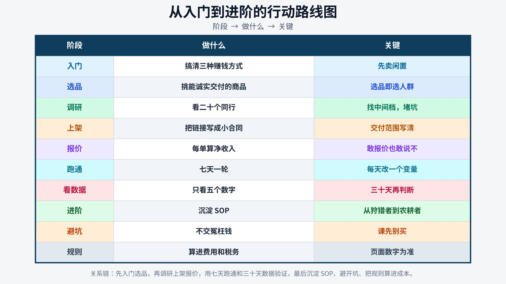

几句核心的话。

闲鱼上最稳妥的第一笔钱，往往就在家里。

选品就是选人群，选好细分品类，敢报价，就能成交高客单。

教程只能告诉你别人怎么卖，市场才会告诉你这件货在你手里能不能卖。

跑通 0 到 1 靠执行力，从 1 到 10 靠你有没有把经验变成能交给别人的东西。

别用看新项目缓解焦虑。现在是在狩猎，还是在农耕。

**写在最后**

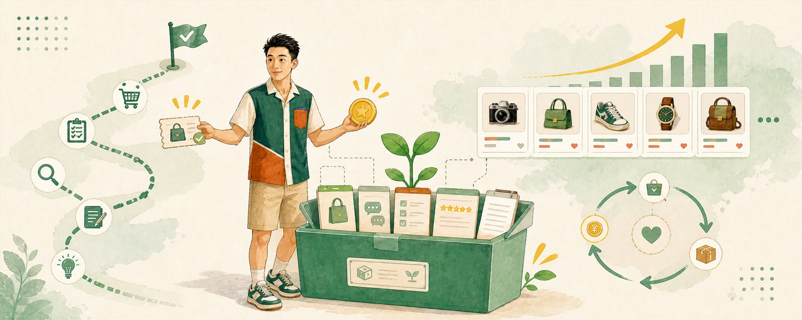

闲鱼是个好入口。有手就行，发了链接基本两天内就有咨询，门槛低到几乎人人能试。

也正因为门槛低，大部分人会停在打一波快钱这一层。赚了钱，账号一停，客户、话术、流程什么都没留下，下一次还是从 0 开始。

阿皓那句话我很喜欢，以前觉得慢就是慢，现在越来越觉得，慢就是快。

如果你正打算在闲鱼开始，今晚就能做一件事。

从家里挑十件真实闲置。东西确实不多，就从简历排版、商品图处理或者录音转写里，选一项自己能做完的小服务。

明天看二十个同行，做三份样例。第三天，把第一批商品发出去。

课先别买，内部货源也先别找。等一个陌生人真的来问，你会知道标题有没有让人看懂、价格是不是太高、样例够不够让人放心。等第一笔订单做完，再决定这件事要不要继续。

先拿到第一单。

然后别急着换项目，先问问自己，这一单，我留下了什么可以复用的东西。

我是 Oscar，一个 00 后自由职业小白和成长记录者。

我会继续分享搞钱案例、真实成长、AI 实用玩法，以及普通人可以小步验证的项目。

关注我  [@OscarGrowth](https://x.com/@OscarGrowth)，一同见证小卡拉米的逆袭之旅。

