# 小红书虚拟1年复制8家店，高峰时期月入6w，我是如何做到的

@qihang_zeng6688 · [X 原文](https://x.com/qihang_zeng6688/article/2074086006857347327)

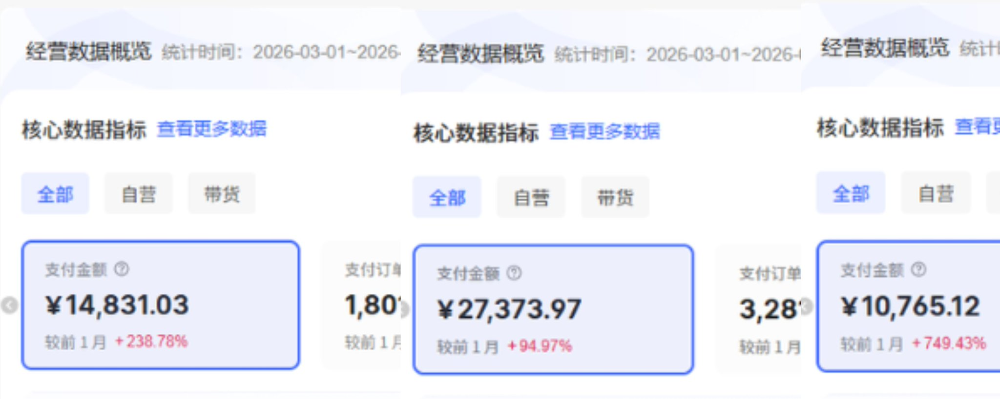

**朋友们好，我是启航，一个深耕小红书的00后，最近也在研究AI和X平台。**

很多朋友看完我之前那篇简易内容后说不过瘾，今天把完整内容整理出来了，**全文超过7000字，预计阅读时间15分钟，适合对小红书虚拟电商感兴趣，对副业赚钱感兴趣的朋友，开始阅读之前，大家可以点个关注，后续我也会分享更多关于小红书虚拟电商，副业赚钱的内容。**

**我在24年底正式开启我的自由职业之旅，开始找项目，**然后不断看网上各种文章，**期间尝试了闲鱼虚拟，闲鱼高客单，得物商单等项目，都没有取得特别大的成果，直到发现小红书虚拟电商。**

**截止今年6月，已经入局小红书虚拟电商1年多，现在自营8家店铺，高峰时期月流水6w+，月订单6000+。**期间经历了小红书虚拟电商的类目调整，官方清除违规商品，提高入局门槛等周期，有自己的一些感悟，同时也准备给现在正在做或者想要做小红书虚拟的朋友推荐一些赛道，以及如何从0-1，如何复制放大项目等等。

图片是3月份收入6w+时候的流水图片，还有其它的店铺数据暂时没放出来，**数据仅供参考**。

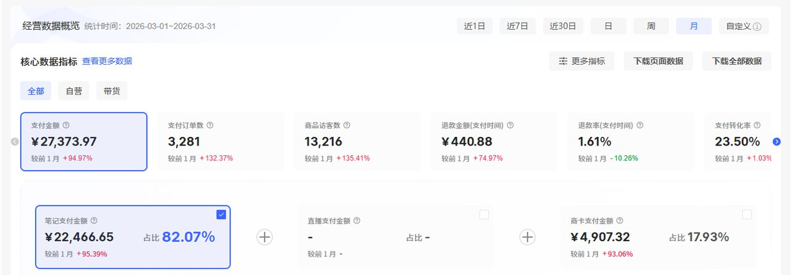

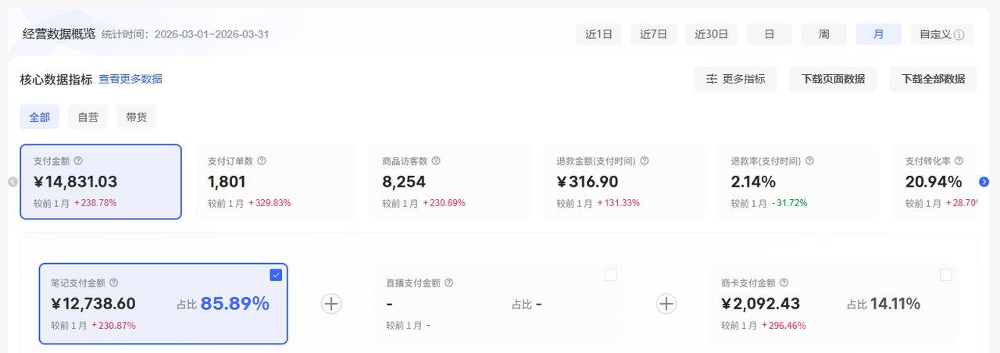

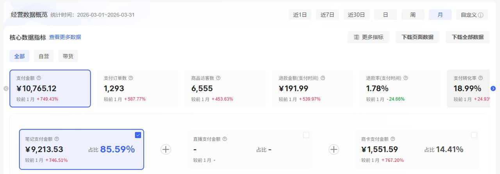

这篇文章是我根据**自己的经历写成的文章，里面干货满满，全是自己实战积累的经验，希望能给大家带来帮助！**

## 一、为什么决定做小红书虚拟

其实25年初，刚开始选项目的时候我也是对副业完全0经验，大学期间做过淘宝，拼多多但是都没有成功过 ，可以说在25年之前，副业收入为0元。

### 1.摸索期

自从关注各类社群之后，就发现特别多的项目，然后我开始逐个尝试，首先是闲鱼虚拟，闲鱼虚拟起步并不容易，需要每天签到，努力获取宝贝曝光数，还要会使用超级曝光，但是因为我开始做的时候是25年2月左右，赶上春节电影档，吃了一波红利，高峰时期能日入过千。

**但是自己版权意识薄弱，不知道电影是强版权的东西**，所以售卖没多久第一家店铺就被闲鱼封禁，紧接着我起第二家店，第二家同样是差不多的版权原因被封禁，其实第二家店铺我已经努力规避版权，仍然没能完全避免，第三家店铺也是差不多的原因，一共做了四家店铺，三家店铺被封禁，我的闲鱼虚拟项目算是彻底完结，总共收入几千块钱。

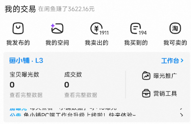

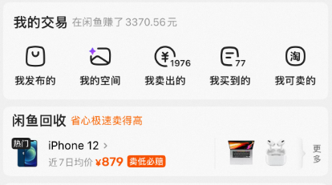

在第三家店铺快被封禁的时候，我已经在找新的项目，有闲鱼高客单，得物商单这两个项目。

在第三家店铺彻底被封禁后，我就直接转战闲鱼高客单，此时只剩下一个店铺，品类选择的是二手台式电脑，一共卖出去3单，总收入几百块钱，一单收入100-200不等，在我思索很久之后，觉得闲鱼蓝海，不太适合我，于是开始尝试得物商单，同时正式关注到小红书虚拟电商。

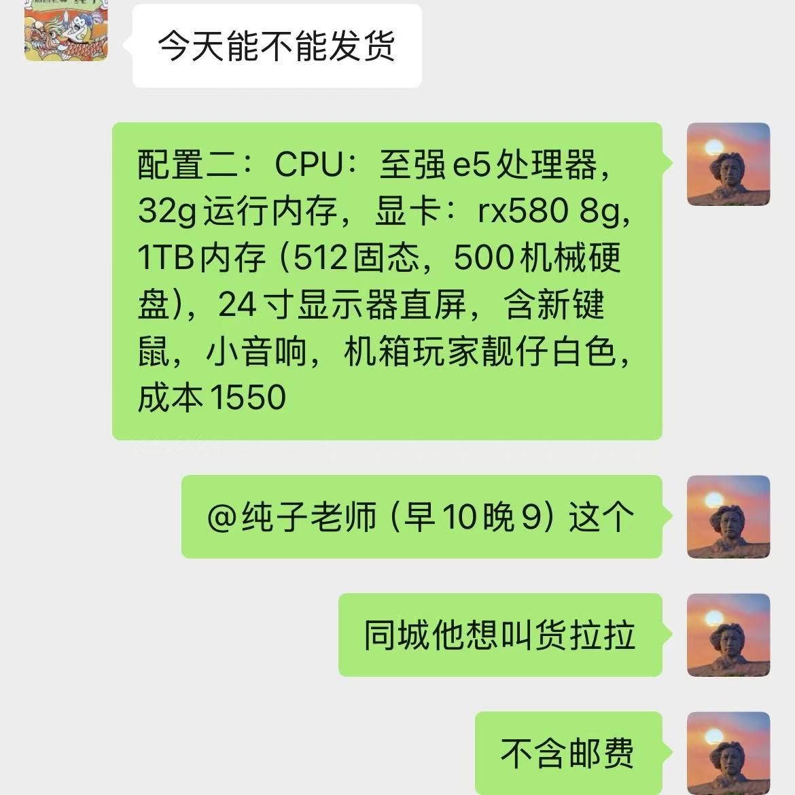

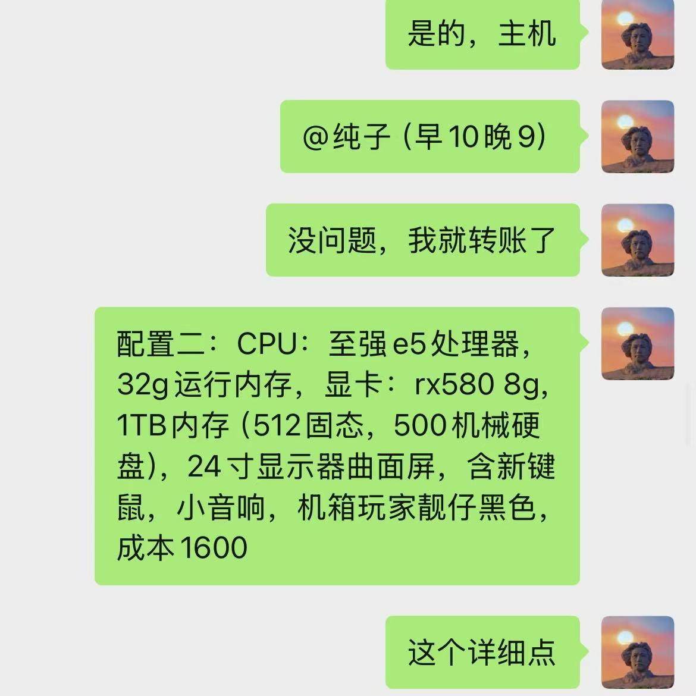

得物商单需要成为达人，需要分享一些实拍图片的产品，我实拍图片能力不行，然后剪视频也不熟练，所以一直没做起来，商单一次没有接到，但是期间通过AI生成仿实拍图片赚到几十块钱，在做得物商单的时候，我也在推进小红书虚拟电商。

### 2.选择小红书虚拟

**前期也是尝试了很多品，从PPT换到掼蛋课程，再到四六级资料，最后才到这个细分类目。终于这个细分类目在25年4月下旬的时候开始发力**，开始每天陆续出单，一直到5月12日成功到90元，当时一天90元对我来说真的是非常高兴的一件事情，接下来我根据起来的这个商品，继续选类似的品，也取得了不错的收益，经过这一个月之后，我的重心渐渐往小红书虚拟转移。

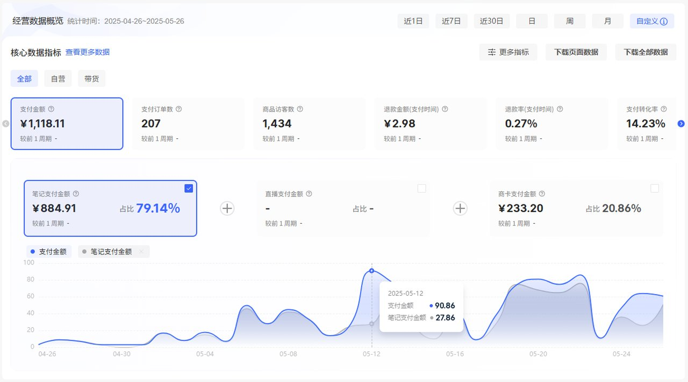

**我觉得第一个月能做起来，也是因为我做过闲鱼虚拟的项目，算是对虚拟电商有一定的经验，期间还发现更绪老师的文章，老师的文章干货满满，对我帮助非常大，也很感谢更绪老师。**

然后第二个月继续不断的选品，堆笔记，然后再不断的起店铺，选品，铺笔记。一直做到现在，期间也在不断更新打法，提升笔记质量；找合伙人；引入外包客服；投流等等。

小红书虚拟电商真的是特别适合新手的一个项目，**首先它是只针对虚拟类产品，发货十分便捷，大多数商品只需要交付网盘链接即可，基本无售后，因为虚拟产品具有可复制性，发货不退换，其次，小红书虚拟只需要做流量即可，流量做好，产品不愁销路，甚至部分产品可以引流到后端，沉淀为私域，进行高客单转化。**

## 二、从0-1需要具备什么

### 1.基本认知

①**选择大于努力**

**好的项目真的会对普通人更友好，上限也更高，如果再配合合适的入场时机，不需要多努力就能跑通项目，甚至赚到更多的钱。**

例如去年的选择小红书虚拟，平台上很多类目供小于求，对运营要求不高，且小红书用户在不断增加，只要你坚持发笔记，就能有不错的收益。

②**失败是常态，成功才是意外**

我在发现小红书虚拟这个项目之前也尝试过好几个其它项目，虽然前面几个项目也没有完全失败，都取得一点成绩，但是都不大，例如闲鱼虚拟，做了四家店铺，被封禁三家，赚了可能几千块钱；然后转战闲鱼高客单，卖电脑，赚了几百块钱，感觉不合适；然后又尝试得物商单，赚了几十块钱，也没能坚持下去；最后才找到的小红书虚拟电商，一步一步慢慢做到现在。

前面几个项目，也基本算是失败，所以失败是做项目的常态，**失败才是大多数，成功才是意外，需要尝试很多项目才能找到适合自己的或者比较不错的项目。**

③适合自己的才是最好的

相信各位圈友加入生财之后肯定会发现各种各样的项目，每个项目都有非常成功、取得特别大结果的圈友，然后就开始眼花缭乱，不知道怎么选择，这个项目试一下，那个项目研究几天，**投入不少时间和精力，却始终没有取得突破性的成果。**

**后来我发现每个人的资源、能力、兴趣、性格以及所处阶段都不一样，适合别人的道路未必适合自己。真正重要的不是不断寻找新的机会，而是找到一个与自己匹配度较高的项目，然后持续投入时间和精力去深耕。**

以我自己为例，经过不断尝试和思考之后，我最终选择聚焦于小红书虚拟电商赛道。虽然这个过程中经历了平台规则变化、流量波动、竞争加剧等各种挑战，**但正因为持续坚持，才逐渐积累了经验，建立了自己的认知体系和运营方法。如果当初因为遇到困难就频繁换项目，很可能到现在依然还在寻找方向。**

**所以适合自己的才是最好的。**

### 2.基本方法

①**完成比完美重要**

**在尝试新项目的时候，或者是复刻爆款的时候，一定要给自己设置一个底线，就是每天至少需要完成多少数量的任务，防止过分追求完美主义，导致项目一直卡壳。**

例如前期做小红书虚拟，一天发布3-5篇笔记，然后你去复刻爆款笔记，但是你不熟练，第一篇笔记可能需要花半天或者几个小时才能做出来，**这个时候你需要给自己设置一个时间，例如这篇笔记最长2个小时之内必须发布，2个小时到了，只要它有一点和爆款笔记相似都可以先发布，因为商品本身也是影响是否能爆的重要因素**，有可能花半天制作的笔记，结果因为商品本身需求不高，导致最后笔记数据和销售数据惨淡，既浪费了时间，也非常打击自信心，所以完成比完美重要。

做产品也是类似的例子，**先完成一个60分的产品，迅速投入到市场里面测试是否有真实需求，是否是伪需求，有需求就快速迭代，没有需求就直接放弃，转战下一个商品。**

②**最小闭环法**

在做新项目时，**一定要快速跑通最小的0-1，建立起信心，这样才能长期坚持下去，遇到困难心态不容易崩掉**。例如在做小红书虚拟之前，最应该先选3-5商品，然后每个商品发3-5篇笔记，只要出一单，就证明这个项目的可行性，就成了闭环。

③**用数量来抵消随机性**

截止目前，8家店铺，发布了超过6000篇笔记，用**极致的数量去抵消流量带来的不确定性**，有时候赚钱就是大道至简，说人话就是**干就完了！**

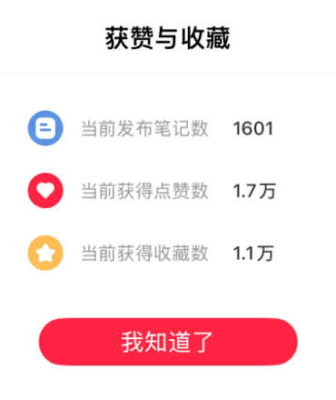

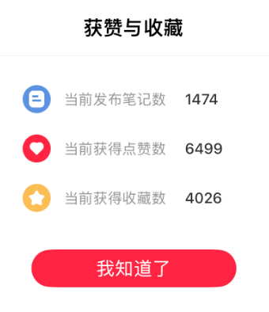

④**聚焦项目的核心动作**

**80%的利润是由20%的核心动作产生的**，在跑通项目流程之后，一定要提取流程的核心动作，哪些动作对利润的影响最大，在找到这些核心动作之后，其他非核心就需要尽可能的外包出去，**引入人力杠杆（招员工、找外包客服），工具杠杆（AI写标题文案），代码杠杆（开发自动化工具）**等等，提高你的工作效率，让你有更多时间聚焦在核心动作上面。

## 三、如何复制放大

复制放大具体可以从**复制爆款商品、爆款内容或者复制店铺；投流放大；总结操作流程，操作流程SOP化；引入AI工具或者自动化工具；引入人力杠杆（招员工，招外包客服）等几个方面入手。**

### 1.复制商品和店铺

在前面选择细分赛道的时候，我也找了不少对标，也测试了一些赛道。

一开始我选择的是PPT，但是PPT没做起来，而且客单价低，中途还尝试了掼蛋课程这种非常小众的商品，结局肯定也是没做起来。还尝试四六级资料类似的产品，销量也不是很高。在这之后渐渐找到新的赛道，**先是找到新赛道的一个细分商品，跑通了之后我再慢慢的复制同赛道的其他商品，当一个店铺有一定规模之后，我在慢慢复制同类型的店铺，一点一点的做起来的。**第一家店铺从4月27日第一次出单只有3元，到7月1日营业额达到最高峰879元，总共过去66天，且达到日营业800每天后，后期每天营业额也非常可观。

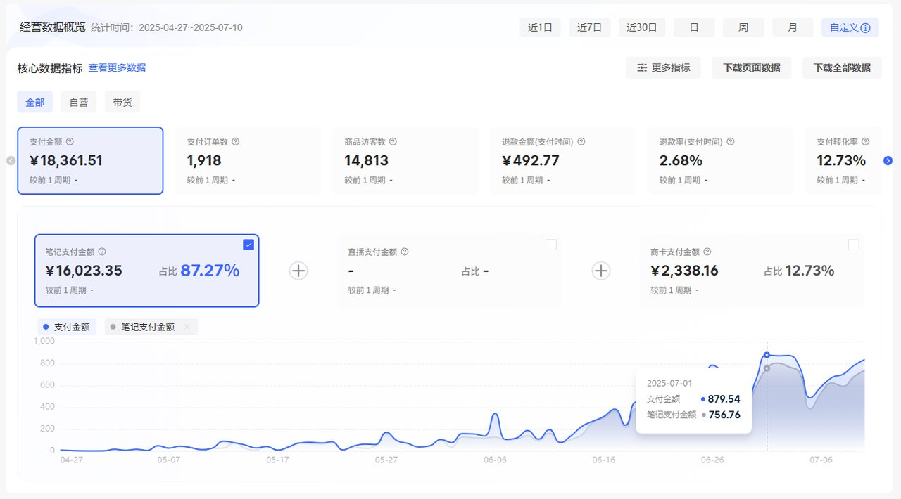

### 2.投流放大

我最开始做小红书虚拟，就在使用小红书乘风进行投放，因为我做闲鱼虚拟的时候也用超级擦亮，**这样能很快测出一个商品是否有流量。**

所以转到小红书虚拟的时候，我也使用投放，只不过前面用的聚光，聚光是获取客资的工具，单次点击成本过高，基本上5-10元/次。

后面才了解小红书电商投放需要换成乘风，换成乘风之后一开始效果也不是很好，前面也走过弯路，就是单次点击成本也比较高，0.3元/次、0.5元/次的样子，这个问题的解决办法就是**调高ROI（单次点击成本变低），且选择质量较高的笔记，质量较高的笔记一般是点击率和转化率都高。**

还有一个问题，相信很多圈友都遇到过，乘风投放出单之后，例如0.5的单次点击成本，你的商品是10元，这个时候ROI是20对不对，但是很多情况是你出单过后乘风后台会突然增加你的单次点击成本，例如下一次点击突然变成2元/次，然后如果出现3次点击，就变成了0.5+2x3=6.5，此时ROI直接变成1.几，更有甚者ROI直接变为1以下，直接亏本。

最开始我的解决办法是投放出单且商品价格较高的时候，**直接关闭这个乘风计划**，但是这样的话今天一天以内就不能再开启这个计划，可能会影响流量，也可能影响计划。

经过很久我自己摸索出这个方法，**就是直接将预期ROI翻倍即可，当然有个前提是，这个方法只对已经爆过笔记有作用，例如我的预期ROI是3，那建议你开启计划的时候选择预期ROI为6及以上，这样你就可以一直开着计划，且一天下来的投放计划ROI基本就在3左右，符合我的预期，且中途不用关闭计划，只需要偶尔监测一下计划。**

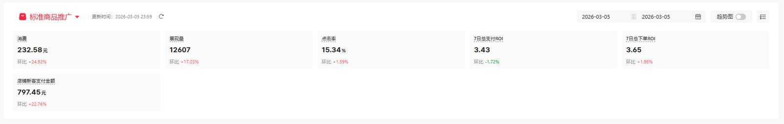

**实测有朋友在使用我的方法之后ROI能到5.5以上，能帮到朋友我非常高兴！下图是朋友的数据。**

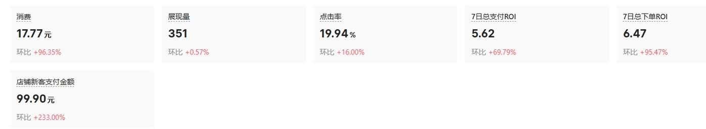

### 3.操作流程SOP化

**我首先将整个变现路径总结为这几步：选品，发笔记，客服，投放，运营等几个部分**，然后在做到第二家店铺的时候，我就找到我的合伙人来帮忙，我们分工合作，**我负责选品投放运营，他负责发笔记，这样再加上两个外包客服，整体效率提高了很多，每个人都负责自己擅长的事情**。

且为了更高效的发布笔记，**我们收集整理出爆款素材库，并且利用AI仿写标题和文案，产出笔记的质量数量都提高很多**。关于笔记图片，我们一直是实拍图片的形式，**因为我们发现小红书平台就是一个非常鼓励实拍图片的平台，同样一个商品实拍图片天然要比截图或者虚拟图之类的形式流量要高，且我们将实拍过程sop化过后，出图效率同样非常高，一天可以出几十套实拍图，覆盖完几家店铺的笔记完全没问题。**

### 4.引入外包客服

在订单有一定数量之后，我就开始考虑引入外包客服，**外包客服我其实是付费向别人找的渠道，也是咨询别人之后才敢引入外包客服的。**

因为在引入外包客服之前，没有雇佣过任何员工，其实这里我也踩过坑，一开始是找朋友帮忙在手机端回复消息，**结果才让他帮忙两天就因为异地登录被要求实名认证**，当时的我并不知道这是什么问题，只知道店铺被“封禁”，这对当时的我打击真的挺大，我消沉了两天，然后请教更绪老师才解决，**他说这是最近经常出现的跳实名问题，然后让我找家人帮忙实名认证一下，立马解封，商品销量什么东西都还在，所以我直接被迫放弃让朋友当客服这条路。**

然后我开始尝试外包客服，**外包客服一般要找正规渠道，这样你的店铺或者资金才有保障**，像我们这种情况是让外包客服登录小红书的千帆客服端，是需要账号密码的，所以这一块一定要注意，我们是别人推荐的渠道，也是他们自用渠道，所以还算比较靠谱。

引入外包客服之后，首先就是培训外包客服，适应外包客服，培训外包客服我也可以详细讲一下过程：首先每个外包客服都需要培训，所以在用外包客服之前，**一定要准备外包客服常见问题的百问百答，且把问题按照高中低频率分类**，这样可以让客服快速上手，你也能节省不少的时间。外包客服的百问百答也可以不断更新调整。

然后培训过程的话，一定不能心急，急也没用，虽然我们是虚拟商品，很多只需要发网盘链接，但是很多外包客服可能连网盘都没有使用过，这一块大家一定要有心理准备，**尽可能把外包客服当成一个完全的小白来培训。**当然如果你感觉接手你店铺的外包客服不好用，也可以申请更换，**这种都是试出来的，前期需要一点时间，当外包客服彻底熟练之后，你就能解放客服这一块的工作，让自己更轻松，有更多时间去聚焦核心工作。**

外包客服的价格如下图，第一家店铺基础是500，每日咨询小于20次，第二家店加300元，如果咨询从20增加到50，价格就加500，市面上的外表客服价格不一样，这个仅供参考。

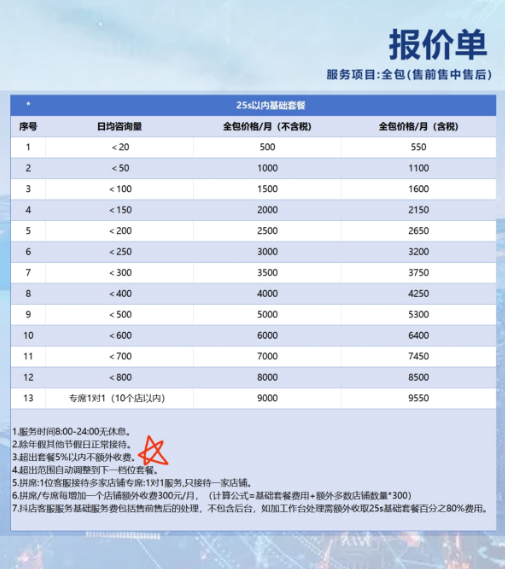

## 四、我走过的弯路

### 1.过于关注非核心数据

最开始的时候，发布一篇笔记之后隔一会儿就看看数据，然后小眼睛数特别少就比较焦虑，一旦有几篇笔记没有流量就觉得被限流，然后去找所谓的“攻略”。**其实商品笔记小眼睛数少是很正常的事情，因为商品笔记是精准流量，不是泛流量；且很多时候笔记推流也需要一定时间**，例如考试前需求爆发的时候，才会陆续推流。

还有特别关心笔记数据等，最开始找过小红书的用户，互相刷赞，也是我干过的''蠢事''。其实**能否让用户成交本质上是由笔记质量和商品决定的，跟笔记的点赞数量没有任何关系。**

### 2.定价策略错误

**低估小红书用户的购买力。**

**小红书的用户人群主要是18-45岁的女性用户，消费力强**，对学历提升，考证，职业资格考试等备考资料需求很大，但是我自己前期因为担心定价过高卖不出去，导致一直不敢提高价格，然后吸引来的客户，也是偏向低价的客户，质量也不高。

**其实价格就是前置的筛选漏斗，高价从一开始就能筛选掉只想找低价好服务的客户**。所以做小红书虚拟一定要敢于定价，我提高客单价之后，订单数量虽然下降，但是利润却提高不少。

### 3.自我设限

**对项目评估不准确，给自己设限，去年平台红利期的时候更应该放开手大干特干。例如：尽快引入人力杠杆（外包客服、兼职员工等）、大规模铺店铺、大胆选品（不侵权的商品都可以打一遍）。**

在去年项目红利期的时候，很多商品都能卖，且比较好卖，但是自己发展的比较缓慢，发现了很多类目非常不错，却没有花时间去打，导致错过很多不错的赛道。今年政策明显收紧，门槛明显提高，不合规的商品直接被下架，很多违规店铺也直接被封禁。

## 五、为什么能走到现在

### 1.不下牌桌

**一直紧跟规则，不断更新自己的打法，精细化运营，从一开始就准备做得更长久。**

在最开始找到这个赛道的其中一个产品时，打爆这个商品之后，再慢慢扩展其它商品，每个商品都在精细化运营，包括高质量笔记，使用精准关键词，详细的商品详情页等等，且同行更新打法，我们也一直跟进，同时也在摸索新的打法；

此外平台类的商业周期基本都遵循这个规律：

**阶段一是红利蓝海期：**也叫野蛮生长期，这个时候做什么都能赚钱，**竞争对手少，且平台监管很松，各种打法层出不穷**，属于是八仙过海各显神通，基本上对应小红书虚拟25年6月之前的时期；

**阶段二是竞争加剧期：**这个时候越来越多的人知道这个赛道，开始进入小红书虚拟电商，同质化内容增多，商品增多，且流量开始分散，竞争加剧，对应25年6月—9月这个时期；

**阶段三是政策收紧期：随着订单变多，交易过程中的纠纷也变多，平台一方面为了规避风险，另一方面为了提高利润，所以会提高门槛，具体表现为下架违规商品，封禁违规店铺，同时提高付费流量比重**，免费流量越来越不稳定，对应着25年9月—26年4月这段时期。这期间我们经历了小红书电子资源类目的推出，商家从个性化定制等类目转移到电子资源类目；然后又将电子资源类目变为邀约制，将商家赶到成人教育和儿童教育；又把成人教育和儿童教育改为邀约制，把商家赶到电子资源这边来的过程；

**阶段四是精细化运营期：**也是存量博弈期，这个时候要想有丰厚利润**必须要精细化运营每一个店铺，甚至每一个链接，且商品和打法必须不断更新，不然只会被淘汰**，这个阶段也会淘汰不少中小卖家，具体时期对应着26年4月—未来，这段时间已经在大规模封禁店铺；

**阶段五是项目衰退期：平台用户下滑，利润不断下滑，ROI比较低，甚至亏损**，这个时候只能一边维持着老项目，再重新找新项目，迁移到新的平台，回到阶段一；

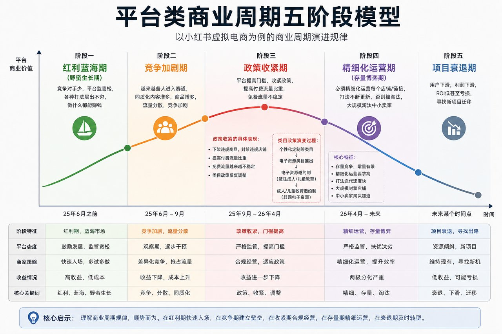

**小红书虚拟现在就是阶段三到阶段四的过渡期，这个阶段精细化运营是必然的**，具体可以体现在，例如：实拍图片进一步去重，相似元素尽可能剔除掉；AI生成标题和文案时需要去AI感，防止平台鉴别为低质量内容；关键词布局更全面，更精准等等；

### 2.良好的心态

在做小红书虚拟的这一年多的时间，遇到的困难并不少，例如：平台政策调整、账号违规、商品下架、竞争加剧以及经营数据下滑等问题，但是由于自己有了更成熟的心态，遇到问题不是像以前一样，直接放弃或者直接就换赛道，而是**积极寻找解决办法，自己解决不了，就请教他人**，只要能解决问题就行。也学会用逆向思维去分析平台规则、用户需求以及市场变化，以应对新的变化。

这种不断学习、积极面对问题的心态，让我在小红书虚拟电商中坚持下来，并不断积累经验、提升能力。我相信，**良好的心态不仅是做好项目的重要基础，也是未来面对更多挑战时最宝贵的财富。**

## 六、推荐几个赛道

今年小红书对虚拟商品的政策收紧，且对AI内容一直是高压态势，但是小红书虚拟电商依然有机会。具体可以关注这几个细分方向：

**1.AI+原创电子商品（学习资料/小程序/知识库/ppt/壁纸/头像/绘本等等）**，官方打击的是AI批量生产低质量笔记，并不是AI相关的优质产品，部分AI提示词相关产品仍然有风险；

**2.各类招聘资料包（各大银行招聘资料包、国央企招聘资料包、互联网大厂面经等等）**；

**3.各类考试资料包**（四六级/考研资料/教资等等需求非常高），小红书用户有很大一部分为年轻女性，对考试相关资料需求很大；

**4.考公考编等笔试面试资料包**需求也非常高，选品不要局限于国家统考省考，**某些细分小城市，细分岗位的资料包需求同样很大**；

**5.各类细分赛道知识库**，例如健身知识库，对公案例知识库，人力资源知识库，装修设计案例库等；

## 七、结语

**26年小红书虚拟电商依然可以做，但是需要选择某些细分赛道，或者创新性产品，且需要一点耐心**，满足这些条件完全可以做起来。

其次紧跟小红书虚拟官方政策变化，最近我们也在探索使用AI原创一些商品，最近有一个大学生资料的产品，**使用AI进行可视化呈现后**，已经售出100单，有潜力成为一个爆品，且发散到其它商品，都可以利用AI进行可视化改造，挖掘出更多有潜力的商品。

我想给还未跑通副业0-1或者正在经历困境的朋友一点信心，**一定要相信自己可以赚到钱的，困境是暂时的，有可能你只是还没遇到适合自己的项目，也许现在还在困顿、迷茫中的你，突然某一天就会迎来自己的人生转折点，取得属于你的成功。**

最后一段话与大家共勉！

