# 我在闲鱼倒卖拼多多的货，3个月还清30年房贷！

@weiyux2021 · [X 原文](https://x.com/weiyux2021/article/2053735690353971217)

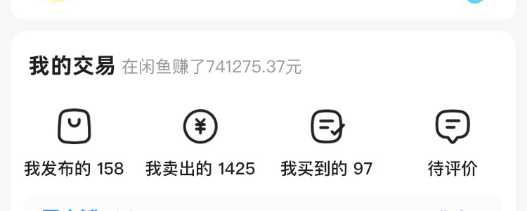

这篇文章不聊成绩、不制造焦虑，以最接地气的方式跟大家聊聊怎么在闲鱼上面赚到钱。万字长文警告，建议深夜没人的时候阅读，看的会更加深入。

记得先收藏，空了按照下面流程直接开干！

一、小白灵魂三问

无论是闲鱼无货源，还是小红书店铺、短视频带货，总是会有这样的问题出现，这个项目还能做吗、从拼夕夕进货被买家发现怎么办、这个项目能赚多少钱等等。

（一）2026年闲鱼卖货还能赚到钱吗

• 韭菜机构会通过一张收益图告诉你，so easy

• 失败者会告诉你，我一件东西都没卖出去

• 旁观者会告诉你，买家是傻子，人家干嘛不去拼夕夕买

鲜有真正的实操者告诉你这背后的真相，到底是虚假繁荣还是确有其事？欢迎大家走进我的闲鱼专栏，且听我揭秘事实的真相。

1、行业背景

无货源，说难听点就是空手套白狼、倒爷、黄牛、二道贩子，说好听点就叫中间商。

我们都知道在线下开店，不管是服装店还是超市，你都得先进货，然后再加价卖。但是如今在线上开店，也就是电商，如果你线下没有货，你可以直接找代理商、经销商或者厂家合作。你只需要铺货，有单子了发给上家，他们会帮你发货，这也就是电商时代的衍生物——一件代发。

最早的无货源电商模式是淘宝无货源，有很多人利用采集软件，采集平台的低价产品然后上架到自己的店铺，进行加价销售。再到后面发展到，全民都去拼夕夕拿货，淘宝的、京东的、抖音的都去拼夕夕一件代发。

说到底任何生意都是低买高卖，无货源只不过是其中一种生意而已。

2、平台规则

任何平台随着不断发展，规则肯定会越来越完善，早期有一些偏门暴利的行业可以做，基本不会有事。

①以前有很多宝妈做母婴产品的，发布一个低价引流的产品然后把用户引到微信做私域，现在你一不小心发了微信号可能就会违规封号；

②以前卖虚拟的高仿的，虽然现在也能卖，但是容易违规，确实有很多人通过这个赚到很多钱；

③以前一个产品可以重复发链接，直接粘贴复制即可，现在你相同的产品发不同的链接得作出差异化，不然平台会限流。

④以前在闲鱼卖东西，一分钱不收，现在鱼小铺要收1.6%的手续费；

平台不断完善规则的目的是打击灰产及保障消费者权益，而不是针对卖家，毕竟在闲鱼人人都可以是买家也可以是卖家。

3、平台用户

早期平台的用户数不多，那么买家自然就少，但是作为卖家，竞争也小，那会儿可能随便发个东西都有人买。

而现在闲鱼月活2个多亿，但竞争也大，就考验真本事，年前有一段时间我在各大平台刷到很多伙伴反映曝光骤降，流量不好。

然后我大概看了一些人的店铺，有的店铺发布的宝贝连标题都没有，有的有标题没有文案，有的干脆直接复制粘贴。

这种你要是能赚钱，那么我天天躺在家里就有馅饼往我嘴里掉了。

其次作为买家，有那么一小部分人知道了你是赚差价的，有的买家暴跳如雷喝斥你的行为，也有的觉得这是你凭本事赚的钱。

因为有些快递里面拼夕夕的字样以及现在拼夕夕会给买家发短信，虽然这个可以避免，但是不懂操作的小白们就这样失去了一部分用户或者还没开始就吓跑了。

4、卖货同行

坊间流传着这么一句话，教你赚钱的人多半是想赚你的钱，这里不予置评，自行领悟。

最近刷抖音直播，确实看到很多人直播教闲鱼卖货的，大部分全程一张收益图，内容全靠编，有个别主播会讲点干货，至于是不是割韭菜的懂行人一看便知。

有人说，教的人越多，卖货的人越多，那么竞争这么大能赚钱吗？

听到这里其实我内心是窃喜的，虽然做的人很多，但是做不做的好是另外一回事，况且那些韭菜机构有几个是肚里有货的，因为我之前学员里面就有被忽悠的，有付了钱不搭理的、有的有电子货源但是压根不懂运营的。

当然还是有很多靠谱的付费社群，我自己也会经常付费学习，提个小建议，凡事不要冲动多对比几家，总会遇到靠谱的。

5、市场规模

在闲鱼上面，除了违禁品不能卖，其他的万物即可卖，对于一些小白来说，他可能只知道日用百货、服饰、化妆品、家具、手机等这些日常生活当中能接触到的可以卖，比如我随便说个化粪池，很多人可能听都没听过。

我分享一段之前工作的经历，你大概就能明白什么是市场。

我在做闲鱼卖货之前，本职工作是做本地生活团购的，像餐饮这个千亿大市场，这几年疫情确实让很多商家过的很难，但是哪怕竞争再大、倒闭的店铺再多，还是有人不断进场。

因为我闲鱼店铺就是卖商用厨具的，年后咨询的人比往常要多得多。

餐饮里面分了很多类目，有火锅、自助餐、奶茶、小吃快餐、烧烤、西餐、料理等等。其中像火锅里面又分鱼火锅、潮汕牛肉火锅、川渝地区的麻辣火锅、美蛙鱼头火锅等等，不断会有进场者在菜品以及装修风格上面下功夫，作出差异化，从这个市场分一杯羹。

近几年我家乡的南昌米粉如雨后春笋般在南方一些城市开了很多店，从数据上看各店铺的生意普遍都不错，还蛮期待啥时候开到成都来。其中有的人尝到甜头，开始开分店，甚至带着亲朋好友一起干。新的市场，自然机会也越大。

• 有人抱怨餐饮竞争大

• 有人抱怨餐饮太累了

• 有人抱怨餐饮让他亏的负债累累

• 而有的人却在闷声发大财

那么，到底谁在讲真话，谁在说谎，自行判断。

闲鱼如此，其他项目也是如此，能不能赚钱关键在于你自己，跟平台其实没关系。

不但是闲鱼，其他项目其实也是一个逻辑。

（二）拼多多拿货有拼多多logo怎么办

这是一个经常被提起的话题，经久不衰。

其实面单都是小问题，比较恼火的是关于拼夕夕发短信的问题。

所谓上有政策，下有对策。饿死胆小的，撑死胆大的，方法总比困难多。

对于我们这种做了多年闲鱼卖货的老江湖来说，这种事情已经见怪不怪了。最早我们做闲鱼卖货的时候，是从淘宝代下单的，后面某宝因为佣金的事情卡得很严，所以转战拼夕夕的。

其实淘宝后面政策也放开了，但是我们已经习惯拼夕夕了，毕竟确实价格便宜售后又巴适。

那么拼夕夕这么做的目的是赶尽杀绝吗，在我看来绝不是，应该只是敲敲打打对上有交待对下有震慑作用，过一阵子就恢复正常。

之前自动退单闹得沸沸扬扬，现在不也恢复正常了。我们唯一要做的就是找应对方法，扛过这段时期，等待恢复就好。同时，也提醒我们要多渠道发展，得有居安思危的心态。

也正是当时的自动退单，促进了我们团队去对接厂家一手货源，上架到我们团队的闲鱼店铺，方便学员下单，截止目前已经对接了几十个厂家，这里反而要感谢拼夕夕。

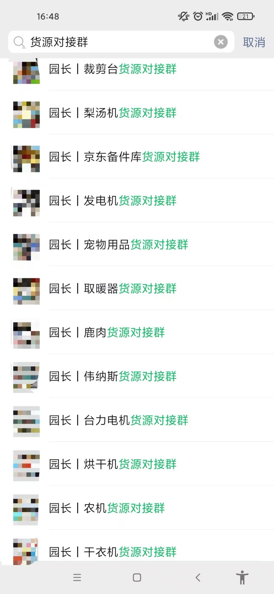

针对这次发短信，其实大可不必惊慌，是有方法应对的。

1、把手机号填写成自己的，另外买家的电话填写到地址里请联系:18888888888签收这个方法已经不适用了，拼多多系统会识别。

2、直接找拼夕夕官方客服，让平台不要发短信。

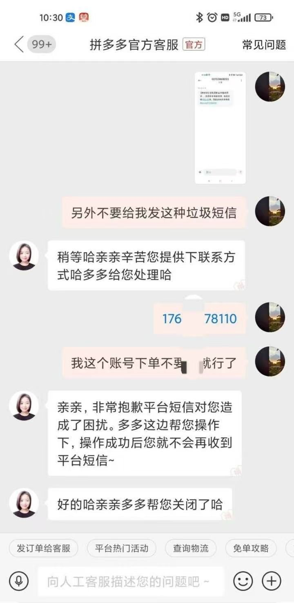

另外，其实大部分买家很少会去看这种短信，有些手机也会自动拦截掉这种营销短信。我们也有学员碰到神仙买家直接发给他截图，结果说这是他本事。

当然，应对方法还是要有，除此之外就是保持不惊慌的心态，天塌了有高个子顶着不是。另外这里对于可能会出现的情况做了一个话术总结：

①顾客收到货，有拼多多店铺信息，并知道了价格?

对顾客话术:您好，我们多平台都有店铺的哈，拼多多店铺也是我们的，每个平台对商家的补贴方式都不一样，拼多多经常搞活动，所以平台对顾客的价格会给予优惠哈!请见谅。

②顾客收到货，发现有拼多多好评返现卡，但不知道价格？

对顾客话术:您好,小本生意,为了增加商品曝光，我们在闲鱼和拼多多都有店铺的，是一个仓库发货的哈，质量都有保证的您放心。您这边对商品还满意不，满意的话您给个好评，我给您返现。

③下单后如何避免拼多多商家放好评卡?

对商家的话术:您好,已下单,麻烦快递面单不要放拼多多店铺信息，快递里面不要放价格表和好评返现小卡片，不要给我发短信打扰，无痕发货谢谢

④拼多多发货，商家给顾客发送了短信?

对顾客话术:亲，是这样的，闲鱼平台快递费用方面没有给补贴，个人邮寄又比较贵，小本生意经不起折腾，我会和其他平台合作，比如 PDD、TB、JD等，通过他们的平台发货，快递费会得到一些补贴省点运费。货物都是我们家的，您放心，这个没有问题的哈。

（三）资金不够怎么办

我要是有钱我也可以开个店，我要是有钱我也能咋滴咋滴啦，这句话是不是很眼熟。我们经常会听到这句话，以一句我要是有钱怎么地来否定别人的成功，以掩盖自己的不足。

更有甚者曾豪言我要是生在马云的时代，我也可以创建出阿里巴巴。

你说线下投资开店，那成本都是十几万的，不敢投倒也可以理解，可是闲鱼开店连保证金都不用。像拼多多有些店铺还可以0元付，简直是赤裸裸的空手套白狼。

甚至有些伙伴担心要是出了个几万的单，没钱垫怎么办。我其实想说你先整出单再说吧。

我们缺的可能不是资金，缺的是做一件事的决心。

无论做什么项目，不要去问能赚多少钱、好不好做这种没有任何实际意义的问题，而且如果你要是想找人付费很容易被割。多从专业知识的角度去问去分析，才能知道自己应该在哪方面下功夫。

那么我们接着往下看，看完你就知道怎么问问题了。

二、实操之前的心理建设

很多人干不好项目，往往是期待过高，实际操作过程中达不到预期，便丧失耐心和信心，最终以失败告终，这里总结了很多人容易走入的几个误区，仅供参考。

（一）不是价格最低就好卖

我们先来了解两个概念，标品看价格，非标看详情，具体这两句话是什么意思？那我展开讲讲：

1、标品看价格

就拿一个很简单的例子，十三香iPhone13，你在闲鱼的价格最低，你就是最好卖，价格一降，分分钟到关键词页面首页，标品的意思就是大家都知道的产品，不止是苹果手机，还有美的电饭煲，小米耳机，格力空调，价格一降，单子自然来，但前提你得有资源。

2、非标看详情

非标就有点玄学了，这款产品爆很有可能有如下几个原因，颜值、功能、价格都有可能，最直观的也是最能把控的是你的关键词、文案、图片，这个成败很关键，把这三个优化好，至少成功了七成，剩下三成取决于你的选品能力，两者结合，就会成功。

因此，万物皆可卖，关键是合适的价格加合适的需求，才能好卖。

我之前有个产品铺了三条链接，结果客户买了最贵的那个。能影响客户作出购买决定的，除了价格有可能是你的文案、你的服务态度，或者是你的头像。

所以，如果价格最低最好卖，京东和淘宝应该早就倒闭了，家门口的零售店也开不下去。

关于成交转化的话术，后面会接着讲。

（二）不是咨询了就要买

很多新手刚开始做的时候经常会有这方面的困扰，有好几个咨询的都没下单，就会很失落，感觉是自己的问题，怀疑自己。

其实我们回想下，我们去商场逛街，进了店里就一定会买么，是一个道理。

我们只能好好的接待，耐心讲解产品，服务好每一位买家。

（三）不是上了一两个产品就会出单

我经常会把闲鱼卖货比作线下地推工作一样，人人都可以干销售，只有干的好与不好的问题，因为再差的销售也会有业绩。

当然你如果跑业务，天天跑家里睡大觉或者每天只拜访一两个客户纯摸鱼，那肯定只有等着被开除的份。

我在去支付宝口碑工作之前其实是一个不善言辞的人，从来没做过销售。但是我知道勤能补拙，只要拜访的商户数量够多，开单是必然的事。那时候每天要拜访几十个客户，才能成交一两单，后面有经验了业绩就能翻倍。

所以，闲鱼也是如此，前期没有经验的时候，就是不断上新产品，边实操边总结，发现问题解决问题，直到稳定出单。

（四）不是高曝光就一定容易出单

很多新人刚开始做闲鱼，非常容易被曝光量误导。特别是看到别人几十上百万曝光量的时候，就开始陷入自我怀疑中。

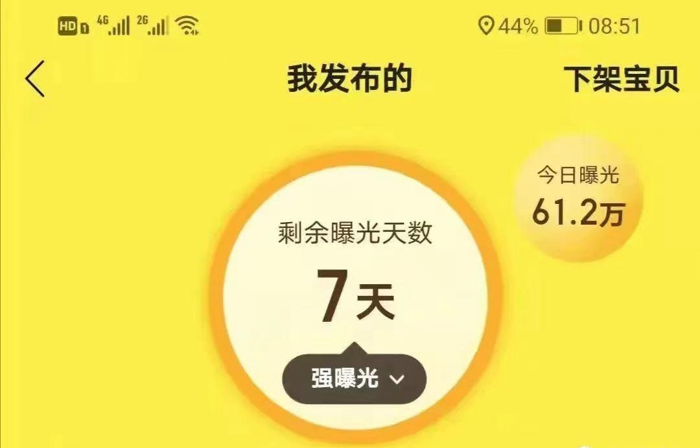

这样的曝光图，你要多少我有多少。但是出单就一定好吗？？

为什么很多新人很关注曝光量？

因为在你没出单之前，曝光量是唯一的反馈值。但其实做过互联网项目的就知道，新手刚开始只能靠怼量，无论是做小红书、短视频还是闲鱼都一样。

如果一味的关注曝光量很容易产生焦虑情绪，从而迷失方向，有的可能干个几天就放弃了。

比如做闲鱼，我们应该关注的是选品、标题、图片、标签、文案等，有没有做好，如果做好了那就是不断上新，上满50之后再优化掉曝光不好的即可。

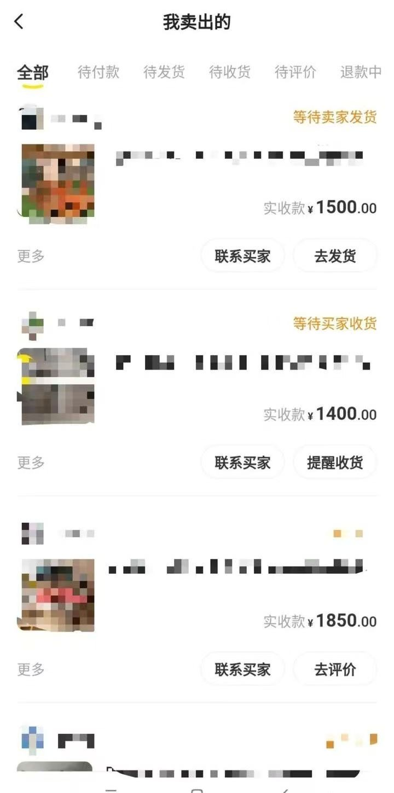

我每天的曝光量基本都维持在1万多点，好的时候有个大几万。因为我卖的是高客单价的产品，曝光量自然比不上百货或者电子产品，但是不影响我利润。

比如电子产品，你随便发个手机曝光量瞬间破百上千，问题是就一定好卖吗？就一定赚钱？

线下实体店超市的人流量肯定要大过隔壁的美容店，但是就一定比美容店赚钱吗，未必吧。

所以还是以出单为准，不用羡慕网上别人发的几十上百万的曝光量，专注做好我们能控制的事情，不能控制的交给天意。

三、如何选品

这是一个难到很多伙伴的话题，费时间又费脑筋。

刚需高客单价产品，如果有价格优势，那么在闲鱼真的跟捡钱一般，我几年前捡过一回。

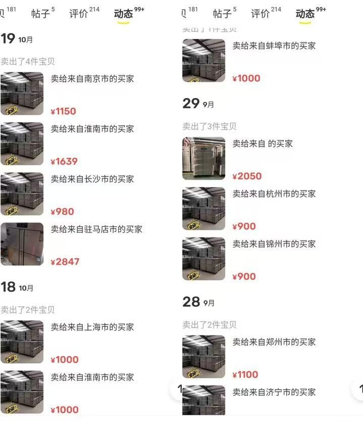

我卖的是一款餐饮店用的平冷操作台，几乎每个店都会用到，当时上架之后问的人特别多，但是成交比较低，很多人都想买二手的。

在拼多多上面问了很多家，只有一家联系了我，给我个批发价，比拼多多的卖价要低几大百以上。

基本上一个账号可以出四五台，一台可以赚200以上。

一共卖了三四个月，后面因为原材料涨价等原因，就没卖了。但就这几个月足足让我赚了xx万，说捡钱毫不夸张。

也因为这一次彻底打开了我的思路，开启了疯狂的选品之路。每天都要花个几小时在选品上，然后不断上品测品。

• 从养猪的母猪产床到农村用的化粪池

• 从工地用的液压平台到服装厂用的拉布机

• 从餐饮用的串串柜到电子厂用的静电工作台

只有你想不到的东西，没有卖不出去的东西。

对于很多新手来说，我刚才说的那些东西不要说想到放闲鱼卖，可能连听都没听过。这就是思维的局限，下面分享一些个人总结的选品方法，仅供参考！

（一）原材料选品法

这是我自己摸索的一个适用任何人的选品方法，而且可以很大概率选到一些冷门蓝海产品。我们都知道任何产品都是由原材料组成的，如不锈钢、玻璃、木头、塑料等等。

比如不锈钢原材料，那么哪些东西是不锈钢做的呢，数不胜数，直接去拼夕夕输入框输入不锈钢

然后我们在去闲鱼搜索产品关键词，看看市场需求如何，“我想要”数量比较多的产品我们就可以跟着去上架。

同样我们搜索“塑料”

这个方法的好处在于，我们可以跳脱出拼多多平台的大数据推荐旋涡，能够发现一些我们认知之外的东西，没准就是下一个冷门爆款产品。而大数据推荐只会局限你的认知，比如你搜索了微波炉，那么平台会一直给你推荐相关的产品，导致你看到的产品都是这些。

（二）刚需用品

这也就是我开头说的，如果有货源有价格优势，那么还是很赚钱的。

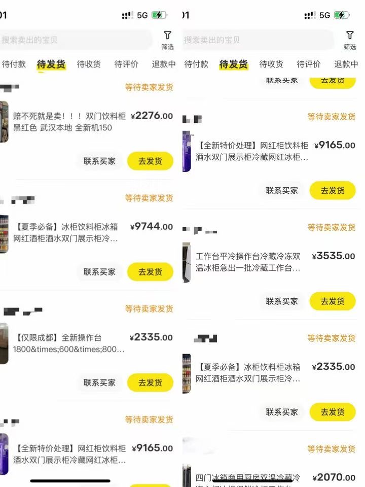

但如果你是个无资源无人脉的普普通通打工银，那就老老实实的先学会如何在拼夕夕选品吧，掌握这项技能足够你在闲鱼月入几大千。

新手做闲鱼，很多人一般想的是先卖低价百货，低价产品容易出单，从而提高账号权重。比如9.9的东西，哪怕你有30%的利润，一单赚3块，按1天100单算，一天收益也就300块。可能很多人看到这会觉得我在说大话，其实做过的人就知道，低客单价的东西爆单了是有多累。

你说它好卖吗，当然好卖，一天几十上百单，但是真的赚钱吗？

所以我们换个角度，什么品利润高，因为我们赚更多钱才是目的。

（三）高客单价的产品

这个是偏笨的方法，东西越贵利润肯定就越高，1000块的东西按照10%的利润算怎么也有100块。那么这类产品有哪些，比如液压机等机械类、办公桌等商用家具、鸡笼等养殖类。

（四）容易产生批量单的产品

顾名思义就是一样东西，消费者一下会购买很多。比如人造草坪、养殖网、防护围栏等，有些都是会一次性采购几千上万的货。

（五）爱好类产品

这类产品价格不透明，有些东西利润甚至可以做到100%，比如古琴等艺术类的，乒乓球桌等体育类的。我有个学员卖了一款古琴，拼夕夕下单180多，闲鱼卖360，将近一倍的利润，关键是卖的还挺好。

所谓，标品看价格，非标看详情，咱卖的就是这些非标品，这类的产品很多，相对冷门一些，会存在一些价格偏差，至少会比他们在实体店或者某宝买要便宜。

当然文案怎么写也比较关键，再加上我们的三寸不烂之舌，再贵的东西卖出去也不是问题。

反正，多尝试多看，不要听风就是雨，实践出真知。

学废了选品之后，那么接下来就是上货。

四、上货发布产品

互联网有一句名言：赚钱就是搞流量。再好的产品，没有流量一切都是白塔。所以无论做任何生意第一步就是先把人引进来，其次再是成交。

以前有句老话叫：“酒香不怕巷子深”，但是互联网信息高度发达的今天，说不怕是假的。我们可以看到很多传统老品牌为了拥抱变化，如回力、五粮液、恒源祥、张小泉等等，都在抖音搞起了直播，毕竟抖音流量太大大了。

而这些品牌为了能够让粉丝停留在直播间，也是使出浑身解数，美女直播是标配，再加上各种超大折扣的抢购，就是为了抢流量。

其实在生活当中，只要我们仔细观察，你会发现处处都是低价引流，比如这个：

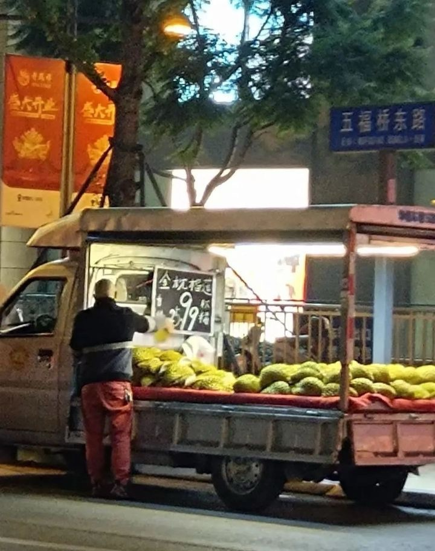

远处看还以为榴莲9块9一斤

类似这样的其实还有很多，你去逛街买衣服，有些店门口会挂一些便宜的衣服，比如19.9特价处理，吸引你过去看，再引导你到店里转一转。

那么线上其实是同样的道理，现在我们一般出门吃饭前都习惯打开美团APP，搜一搜看看周边有没有便宜的团购套餐，毕竟餐饮竞争大，总会有某家店有低价活动。

这种代金券看似很便宜，但其实只能用来抵扣烤鱼，其他比如酒水、配菜是不能用的。

说到这里，相信大家对低价引流应该有一定了解了，那么我们回到闲鱼上来。

首先买家在逛闲鱼APP时，买家看到的页面是这样的：

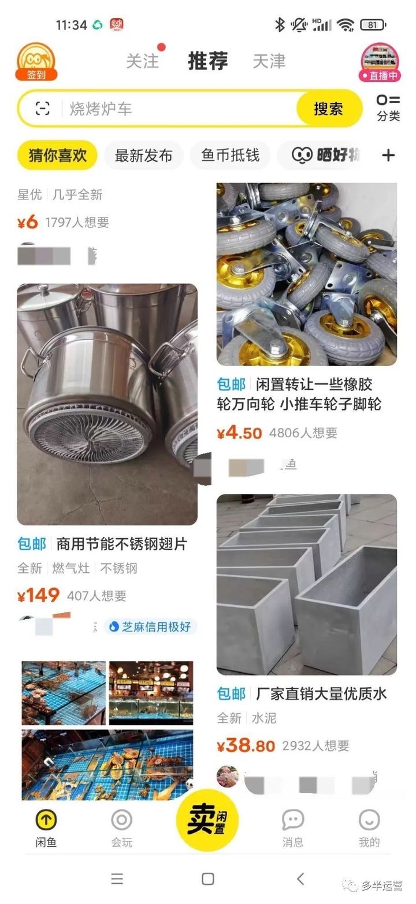

右下角这个水泥框价格肯定不止38.8

这里分享几个低价引流的方法，现场教学仅供参考：

（一）类似产品组合法

比如我卖的这款制冷操作台，最低尺寸的价格都在一千左右，那么我找了一款不带制冷的常温操作台作为低价引流。

文案里面一定要写清楚标价是哪款产品，不然被举报了，容易判定恶意低价引流，链接会被删除。

（二）虚构产品尺寸法

如果找不到合适的同类产品，我们也可以虚构一个尺寸出来，然后在文案里面写清楚尺寸和价格，备注缺货中。

（三）首图与标题反差法

比如左侧这个饮料柜，看标题和首图，买家估计以为双门只要799，实际上标题后面还有单门，799其实是单门的价格。

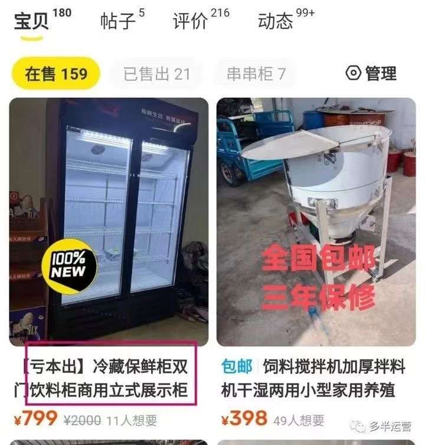

这个方法针对一些尺寸多的产品比较适合，合理利用这个小技巧。

最后，我们一定要明白低价引流就是跟同行抢流量，你价格过高，同样的产品，买家可能就先去咨询别家了。所以我们在发布产品之前，先要了解下同行是怎么做的，只有作出差异化，我们才能抢到更多的流量进来。

当然切记价格不要太低，容易引起买家反感，除非你有扭转乾坤的本事，不然就是搬起石头砸自己的脚。一般我们建议低价引流是你实际卖的产品价格的50%左右。

只要你低价引流做得好，咨询量会像火山爆发一般，这个时候我们就要下苦功夫了，通过对产品的深入了解以及谈单话术的调整，来提高该产品链接的转化率，因为一旦闲鱼给到你的流量承接不住，就只能是短暂的昙花一现。

这里再顺带讲下关于发布地址和首图的重要性

1、根据产品属性选择发布城市

比如说我卖的一款平冷操作台，这个商品几乎是每个餐饮店都会用到的，正好我自己也在成都，成都的餐饮体量在全国都是前几名的，那么发布地我直接选到成都，而且结果证明我的选择是对的，成都最近出了好几单。

2.发布地址选在发货地的附近一二线城市

发布之前先问下拼夕夕商家产品哪里发货的，比如发货地是河北廊坊，那么我们可以把发布地址选在石家庄、唐山或者北京天津这些地方。

如果买家是想自提着急要，那也可以很快收到，其次这样可以增加信任感，毕竟都是挨着的城市，就说总仓在那边也合情合理。但是如果你发布地在广东，当地买家可能问了就直摇头。

3、首图的重要性

在闲鱼发布闲置首图至关重要，好的首图不但可以提高曝光，点“我想要”的人数也会不断增加!

那么选什么样的图片做首图呢?

①最好是正方形并且是高清实拍图；

②图片一定要能够完全展示该产品，不可是局部图，产品应用到场景里面的图片更佳；

也就是常说的氛围感

③为了差异化，可以在图片上适当加一些字

④如果你把账号包装的是厂家，那么产品堆积图就更好了。

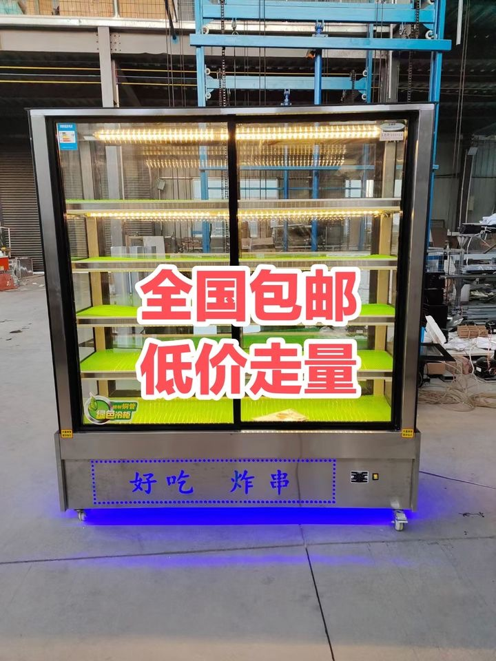

按照以上方法，不断的上新产品即可。

五、成交转化

以下几种情况应该经常会发生，这里分享几个典型案例。

（一）买家被低价产品吸引进来后，要其他规格的时候，嫌贵怎么办？

相信很多新手都是买家问一句答一句，这样肯定是不行的。那么应该怎么优化话术，举个例子：

客户：在吗？桌子多少钱？

你：在的，是要120长的吗，这个规格的是xx元，承重100斤，质量很好，需要可以直接下单。

客户：那150长的呢？多少钱？

你：那个xx元。如果你是要放大一点的东西就可以选这个尺寸。

客户：我不需要放那么大的东西，就买来干嘛干嘛。

你：那我上面说的那个尺寸就可以，大家基本上都选的那一款，性价比很高的，目前没人踩坑，需要可以下单。

所以，客户关心的不仅是价格，还有规格、材质及售后，切记不要直接回复详情都有写，你说了这句大概率客户就跑了。

在客户咨询的时候主动把一些基本信息告诉客户，节约客户的时间也是在帮客户解决问题，帮客户解决问题也是一个合格的销售必备素质。

（二）讨价还价怎么应对

什么都问清楚了，还是大砍一刀，怎么办？

这个时候我们可以语气幽默委屈可爱一点：老板，少不了的啦，我们都是实价在卖呢。您看要不这样吧，您也是诚心要，我这边给您收货都返现20元吧，您觉得还满意给我一个好评行不行呀。

（三）拿其他平台比价的，说淘宝更便宜的怎么办

这个时候我们回复一定要有底气，可以这样说：哪里都有高价和低价的，我们主营是实体店和线下批发，用料足，不走网商路子，不搞精美图片，主打的就是实实在在，您可以放心拍。

一句话总结：高冷的客户礼貌对待，礼貌的客户幽默对待，幽默的客户装傻对待， 装逼的客户安静让他装完！

六、发货细节

出单之后，特别是一些大件物品，发错了退货运费又高，比较麻烦。所以我们除了在文案里面描述清楚之外，还要在发货前跟买家核对一些细节。

比如产品尺寸、材质、功能、颜色、厚度，以及核对收货信息电话地址。

有些桌子厚度分3公分、5公分厚，材质有松木、白蜡木，一定要说清楚。

有些冷柜功能不一样分直冷、风冷，价格差别很大的，一定交待清楚。

七、关于售后

很多伙伴货还没卖出去，就担心客户要退货怎么办，那我们来聊聊可能会发生的几种情况

（一）遇到磕碰破损怎么办

小问题我们可以发点小红包解决，一定要诚恳的表示抱歉，很多买家其实认得是一个态度。

如果是拼多多拿货的，直接把买家提供的照片发给商家，比如商家给了你20红包，你可以给买家10元，这样售后你还可以赚钱哈哈。

（二）遇到退货怎么办

新人最关心的问题来了，这里也分几种情况

1、非质量问题退货

在闲鱼是没有运费险这个说法的，所以如果非质量问题买家要退货的话，是需要买家自付运费的。如果我们是从拼多多或者淘宝下单的话，大部分商品都是有运费险的，也就是说退货我们还可以小赚个10块钱。

2、质量问题退货

通常小件的物品退货都好处理，运费也不贵，商家也会很爽快。如果是大件物品，运费就比较高了，一般商家会协商派师父上门处理，我们可以先这样沟通。

实在不行我们再同意退货，如果商家不同意，我们可以直接找拼多多官方介入，100%会给你处理的妥妥当当，所以完全不用担心。

3、买家买错了退货

毫无疑问，买家硬是要退的话，同样运费自理。如果是大件物品，运费都是几大百还要承担发出去的运费，一般我会建议买家挂在闲鱼上面处理了，能省一点是一点。

八、如何找到有价格优势的货源

我目前通过拼夕夕，合作的商家至少有五家，有两家一直在长期合作，给到我直接是出厂价，让我在闲鱼的卖价比拼夕夕、淘宝都要便宜。

那么，如何怎么议价

有很多小厂在拼夕夕开店，都是自己在运营店铺。这类店铺比较好谈，因为有好产品就差销量。

我一般是这么说的：因为我们本身是有团队的，直接告诉他，我就是在闲鱼卖，可以发动小伙伴一起去帮他卖，他肯定很乐意。

其次，有些旗舰店刚开始可能不愿意，也可以把我们在闲鱼的卖价降低，薄利多销。卖出去几单后再谈，只要他是一手货源，肯定愿意让利的。

记住一点，当你的价格在整个平台都有优势的时候，你就不愁卖一段时间没流量了，做过闲鱼的都知道，单个产品不会一直爆。

但我想说自从我拿到价格优势后，我有几个产品从前年一直卖到现在，还是不断在出单，去年还开了个拼夕夕店铺试试水。

九、杂货铺与垂直店铺

刚开始做闲鱼卖货，做垂直还是杂货，这是很多人都会问到的一个问题。

我的建议是如果你没有经验的话，可以先卖杂货，后面根据产品出单情况再往垂直品类转型，闲鱼本身就是二手市场，卖杂货也合情合理，也没有限流这一说法。

通常一个店铺出单的其实就那么几个产品，当我们某个产品不断出单之后，可以多铺几个链接，也就是同一个产品但是是不同的文案、图片以及发布地址。

这个时候，可以考虑往垂直方向发展，比如我出单的是冷柜操作台，这个产品属于商用厨具，那我就可以专门做商用厨具的这个品类，显得更加专业。

而且通过最近闲鱼的动作来看，平台是要扶持专业卖家的，我们只有在一个领域越专业，后面才能走的更远，甚至可以反哺线下，我们有伙伴就是线上量起来之后，自己线下开了个店。

另外如果我们时间允许的情况下，同时也可以着手扩张的事情，没错就是开分店，多搞几个闲鱼店铺。

那么我的建议是如果三个账号，两个搞垂直，一个搞杂货，把鸡蛋放在不同的篮子里。我自己就是一个厨具类，一个木制类，还有一个杂货铺。

另外这里说下泛垂直，其实就是上面选品提到的概念，比如木制品这个大类，里面有包含了很多品类，比如家具、办公商用等等，我们可以把账号包装成木制品厂家，有关木制的产品我们都可以去上架。

十、寄语

送上罗翔老师的一段话，各位共勉！

“人这一生自己能决定的也许只有5%，有95%是你决定不了的。你的努力也许只是那5%的一个支点，却撬动了那95%的命定。”

我是园长，一位靠闲鱼卖货实现自由职业的超级奶爸，希望大家有所收获！
