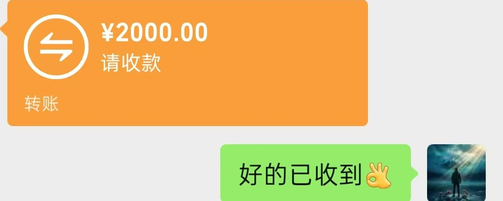
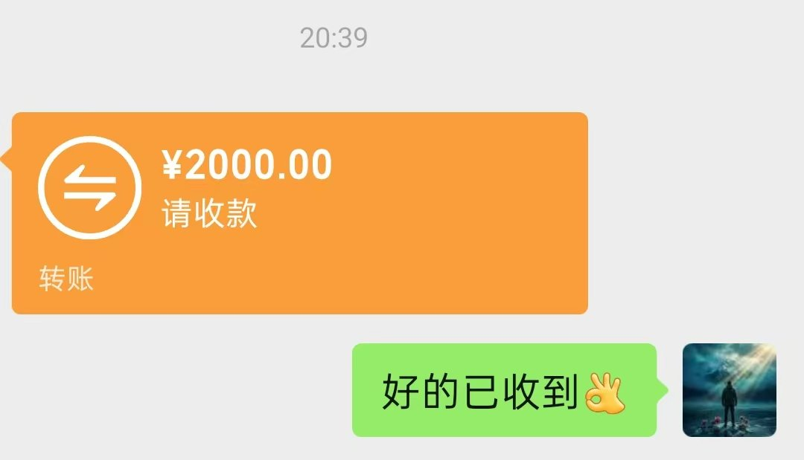
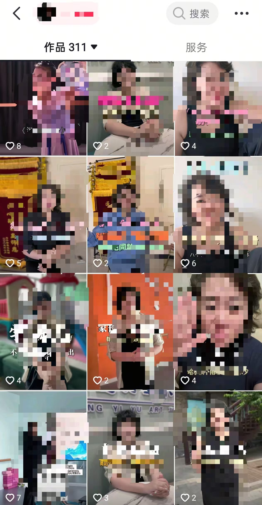
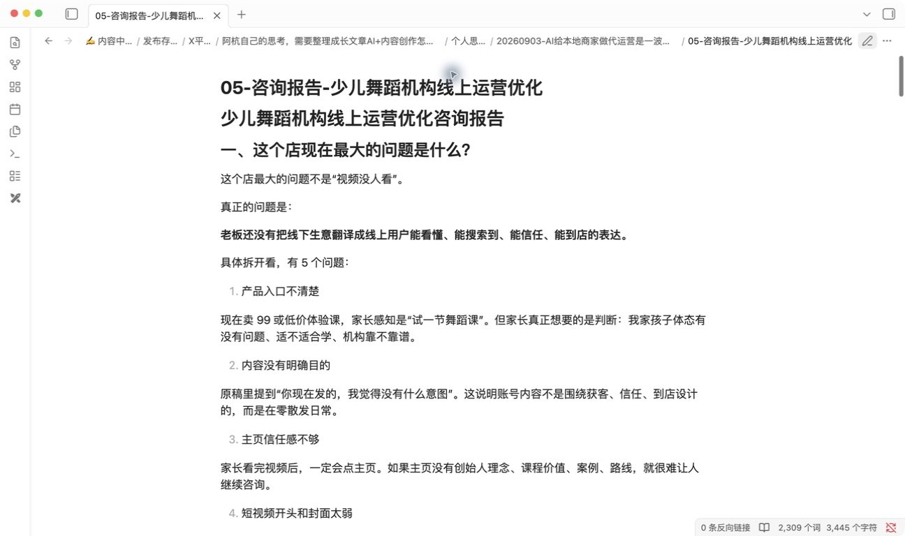
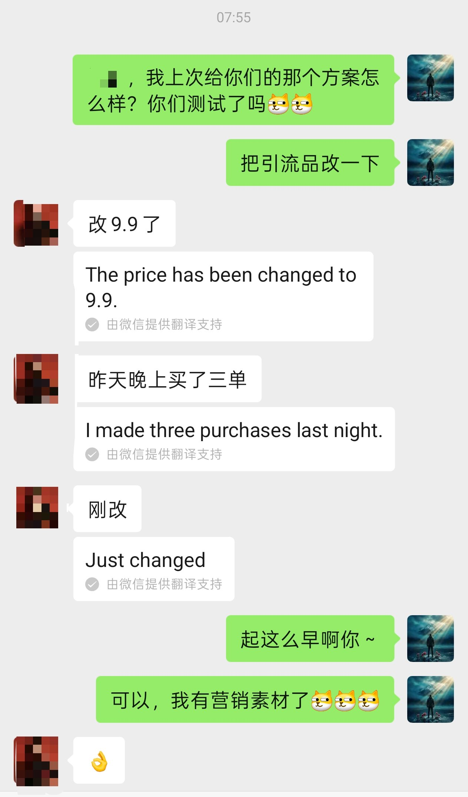

# 我收了2000块，用0.05元的token，做本地商家的代运营，抖音几万粉丝博主用这套方法月入300w

@Astronaut_1216 · [X 原文](https://x.com/Astronaut_1216/article/2097247225848185007)

兄弟们，用AI直接干掉现在的代运营绝对是一波大机会，我给一家少儿舞蹈机构做了一次线下咨询，收了2000元，而且交付轻，生意好做，需求量大

**对方按方案改完产品入口和内容，一条流量不算高的视频，带来3位预约到店的家长，3位家长到店后，机构全部转化了近3000块**

这件事里发生了两次获客

**第一次，我的抖音内容把这位老板带到我面前**

第二次，我帮老板重做内容和产品入口，他的内容又把3位家长带进门店

两次获客中间，AI参与了搜索、记录、整理和交付。但这2000元怎么来的，三位家长为什么愿意进店，答案都不在某个提示词里

我原来总在想，AI落到现实生意里，到底靠什么收费，这也应该是所有人的疑问

跑完这次，我的答案清楚了一点

先看生意，再看AI

### 一、客户先看了我的内容，才来买我的咨询

这位老板来自我的抖音内容，而非招聘网站或陌生拜访

老板先刷到我的内容

他看过我怎么分析短视频，怎么理解内容获客，也看过我用AI处理真实工作，看了一段时间以后，他带着自己门店的问题来找我

**这一步让我重新理解内容营销**

**很多人把内容当成服务做完以后的宣传：项目结束，截几张图，发一篇案例，证明自己干过**

顺序应该往前提。

内容先替你解释你是谁、你看问题的角度、你能处理哪类业务。客户联系你之前，已经完成了一轮筛选

**如果没有这轮筛选，我得从头解释我为什么懂短视频，为什么一个做AI内容的人能看舞蹈机构的生意，2000元又凭什么收**

但老板是看着我的内容来的，他开口问的是“我的生意不好做，我的店怎么改”

所以我现在会把内容营销放在第一位

**它同时承担三个作用：获客、建立信任、展示交付能力**

项目跑出结果以后，这个结果又会成为下一篇内容的材料，于是就有了这一篇

内容被老板刷到
-\> 老板发起咨询
-\> 线下完成交付
-\> 门店跑出结果
-\> 结果变成新内容
-\> 下一位老板看见

这条循环跑起来，其实所有想做AI获客代运营的才不会永远靠私聊和人情介绍，也是最快能够跑通闭环的一步

### 二、实际案例分享，你们也可以拿去作为你们的案例，发了311条作品，为什么线上还是来不了人

到店以后，我先翻他们的账号

主页有311个作品。

截图里能看到，多数作品只有个位数点赞

很抽象的是，这家机构还花过3万元，参加了3天同城课程。回来以后照着学到的方法发本地烤串、本地送礼，话题标签里塞满本地标签

账号做了一年，从线上来到门店的有10个人

老师有专业，课程在正常上，视频也一直发

可这些东西没有连起来

视频里反复出现的是：今天上课了，老师带孩子练动作，教室里有很多小朋友，或者说XXX的文化，和他的产品完全连不起来

老板看得懂，因为那是他的日常

一个陌生家长刷到时，脑子里出现的是另一套问题：这和我家孩子有什么关系？你能帮我看出什么问题？我为什么要去你的店？

账号没有回答，这就是很多实体老板做内容时的盲区。

他每天站在店里，看到的是老师、教室、课程、活动、获奖、孩子上课

用户站在手机外面，看到的是一个陌生账号。

**两边隔着的那层东西，叫购买理由**

他们缺的是一条从内容到到店的路，继续增加发布量解决不了

**所以我没有让他们先日更，也没有先讨论剪辑风格**

第一刀砍在产品入口上。

### 三、99元体验课，为什么要改成9.9元体态诊断

他们原来的引流产品是99元体验课

从老板视角看，这个产品很合理。价格不高，孩子先上4节，家长满意再转长期课。

从陌生家长的视角看，问题来了。

她还不认识老师，也不知道孩子喜不喜欢。为了“再试一家”，要付99元、安排时间、带孩子出门、跑到门店

**她承担了一串决策成本，却不知道自己能得到什么**

**我当时给的建议是：改成9.9元体态诊断，诊断完成后，再赠送一节舞蹈体验课，当然这也不是我说的，这是我的豆包说的**

人不是来试课的，是来拿一个结果的。

家长带孩子过来，老师先看站姿、走路、肩颈、协调性和舞台表现，再告诉她孩子适不适合开始舞蹈启蒙，应该先练什么

这是一份家长听得懂的结果。

**9.9元在这里也不承担赚钱任务。它的作用是让一个还不信任机构的人，愿意迈出第一步，主要就是人进门店了，你才有更多的机会转化，老师的专业、课程设计、服务体验才有机会发挥，事实也证明了，他们每一个进门的人都可以被转化（这家门店真的销转能力顶级）**

**这次咨询让我发现，很多内容问题往前追，追到最后会落在产品上**

产品说不清楚，视频不知道承接什么，视频没有承接对象，播放量再高也容易散掉

入口换成体态诊断以后，主页、封面、选题和直播话术才有了一根共同的线

**主页回答三个问题：服务谁，解决什么，怎么到店**

封面开始说家长认识的问题：孩子走路内扣怎么办，3岁女孩适不适合学舞蹈，孩子上台不敢抬头怎么办

视频不再记录“我们今天干了什么”，而是回答“你家孩子遇到这种情况该怎么办”

直播间围绕9.9元体态诊断反复讲：看哪些地方，适合什么孩子，家长能拿到什么判断，怎么预约

**这些动作看起来是内容运营，前面连接产品，后面连接到店**

**给本地商家做内容，不能从“今天拍什么”开始，要从“客户为什么愿意来”开始**

### 四、花3万元学同城，为什么回来只能发烤串和送礼

复盘一下市场上3万块钱割韭菜的自媒体培训课，这家机构之前学同城，得到的动作是发本地话题，然后我看了一下那个账号，**他们每天就是圈人群，说学科校长怎么怎么样，在这样的情况之下，3万块钱的课，每个月能够有近百人来上，月利润300万**

于是账号开始谈城市里的烤串、送礼和生活

城市是对了，客户没出现

**一个本地妈妈刷到烤串，不会顺着这条视频判断孩子该不该学舞蹈，平台知道内容和本地有关，却不知道这家店服务哪类人、解决哪种问题**

同城内容的任务，是让平台和用户同时看懂：你在哪，你服务谁，你解决什么。把城市名说五遍，完成不了这个任务

### 五、飞书+录音豆+豆包+Codex帮我把一次咨询变成了能复用的交付

这次线下咨询一共一个多小时，现场没有按照一份整齐提纲推进

**一会儿翻主页，一会儿看封面，一会儿讨论99元体验课，一会儿打开豆包搜同城，一会儿又回到直播该讲什么**

线下咨询本来就是乱的

老板想到哪说到哪，我看到问题就追问。很多有价值的判断，藏在这种来回跳转里

如果只靠记忆，回家以后容易漏掉。靠人工重听录音，再整理成报告，时间会被吃掉

所以我让录音豆把现场留住，再同步成飞书妙记。回去以后，我把材料交给Codex，让它先回答六个问题：

- 这个店卡在哪里？
- 账号先改什么？
- 产品入口怎么改？
- 下周先拍什么？
- 直播间循环讲什么？
- 老板最后应该拿到哪份方案？

AI把散乱对话变成问题清单、账号修改方案、7个视频选题、直播话术和一条到店路径。

我再逐项校准，把不符合门店现状的内容删掉，把老板下周能执行的动作留下。

这份交付能回溯到26分17秒的现场录音。录音豆同步到飞书以后，形成了可以检索和核对的妙记，避免我凭印象补全老板没有说过的话。

这才是AI在这次服务里的位置。

**录音豆负责记住现场，豆包负责辅助搜索和对标，Codex负责把材料拆开、归类、扩成文档**

**我负责判断，老板负责执行，并在线下完成成交**

**少了任何一方，这个结果都不完整**

AI没有去过那家店，也不知道老板和家长平时怎么交流。它能生成几十条舞蹈选题，却无法决定应该先改99元体验课，还是先改封面

这个判断来自现场

但没有AI，一次咨询中的判断很容易停在聊天里。老板当时觉得有道理，回去面对311条旧内容，还是不知道明天先改哪一条

### 六、那条视频流量不高，为什么我反而更看重它

老板执行方案以后，给我发来消息：

**“改9.9了。”**

**“昨天晚上卖了三单。”**

**后面我确认，这三单对应3位预约到店的家长。3位到了门店以后，都被机构转化了**

那条视频的流量不算高。

这个结果没有证明流量不重要

**封面、开头两秒、五秒完播仍然决定一条视频能不能继续获得分发**

但播放量只回答“多少人看过”

**老板要回答的是另一组问题：来了多少咨询，多少人预约，多少人到店，多少人最后成交**

**前一组是内容数据，后一组会进入经营结果**

**如果十万播放没有一个人咨询，它可以是一条好内容，却未必是一条能帮门店获客的内容**

### 七、这门生意卖的到底是什么

**我以前理解AI代运营，脑子里先出现的是批量写稿、批量生图、批量剪视频、自动发布**

**这些能力能让账号更新更快**

但账号更新更快，和门店有人进来，中间还隔着客户、产品、信任和成交

**这次咨询以后，我更愿意把这份工作理解成一个蹲在门店里的产品经理**

先听老板怎么讲生意，再看顾客为什么犹豫

把产品入口重新设计一遍，把内容承接到这个入口，再让AI处理后面那些重复、耗时的整理工作

**本地老板手里往往有不少真实东西：门店、老师、课程、客户、案例、成交经验**

**这些东西散落在老板脑子里、员工聊天里、朋友圈里和311条旧视频里**

有手艺，没表达
有专业，没获客
有线下，没线上

服务者的价值，是去现场把这些东西捞出来，重新摆成一条客户能走完的路

这条路可以很朴素：

**家长刷到一个和孩子有关的问题
-\> 停下来听老师讲
-\> 点进主页判断是否可信
-\> 看懂9.9元体态诊断
-\> 预约到店
-\> 完成诊断和体验
-\> 再决定要不要买长期课**

AI负责让这条路的生产成本降下来

同一场咨询，可以变成报告、主页文案、选题、口播稿、直播话术和复盘表。以后遇到相似门店，已有结构还能继续复用

我准备先把服务拆成三层

> **第一层是诊断，进店看业务，找出卡点，交付产品入口和一周动作**

> **第二层是陪跑，跟着老板把主页、选题、脚本和直播改起来，每周看结果**

> **第三层才是代运营，承担持续生产，同时把谁负责拍摄、谁负责出镜、谁跟进客户、谁完成成交写清楚**

这门生意还有三条边界

> **门店交付不行，内容带来的人也留不住**

> **老板拿到方案不执行，报告只是一个文件**

> **服务者不去理解行业，只会调用AI，最后交付的大概率是一份看起来完整、老板却不知道怎么用的文档**

一笔2000元咨询，一条流量不算高的视频。
3位家长预约到店，3位被门店转化

先把同一类门店再跑几家
先把一个店做出结果

我想这个飞轮是真的能转起来
