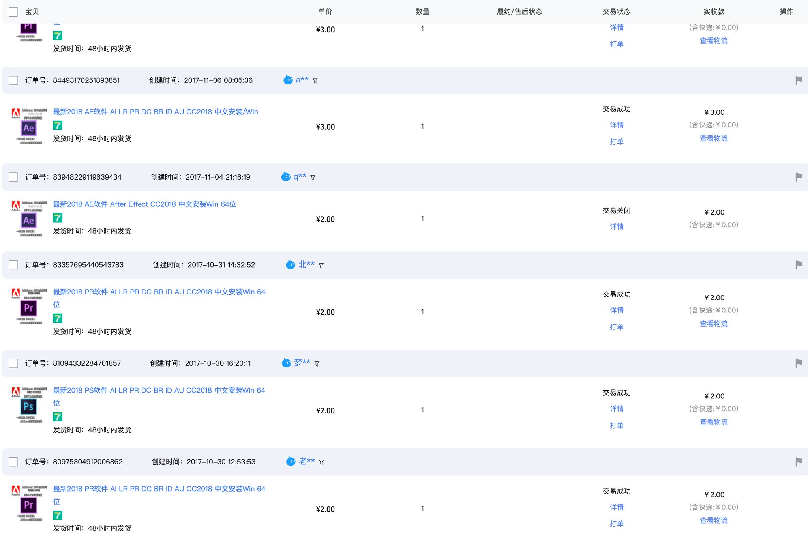
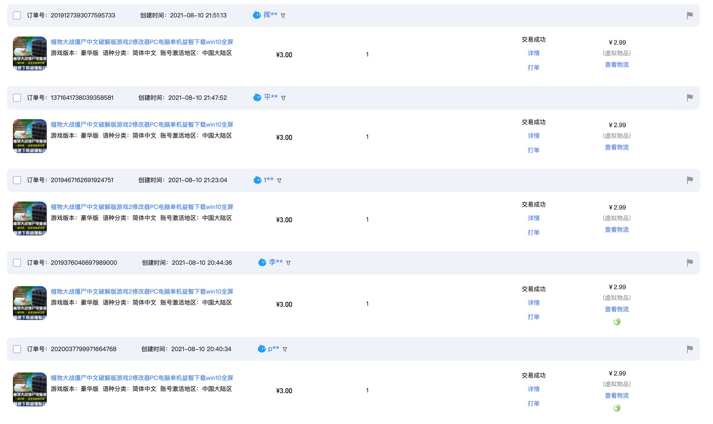
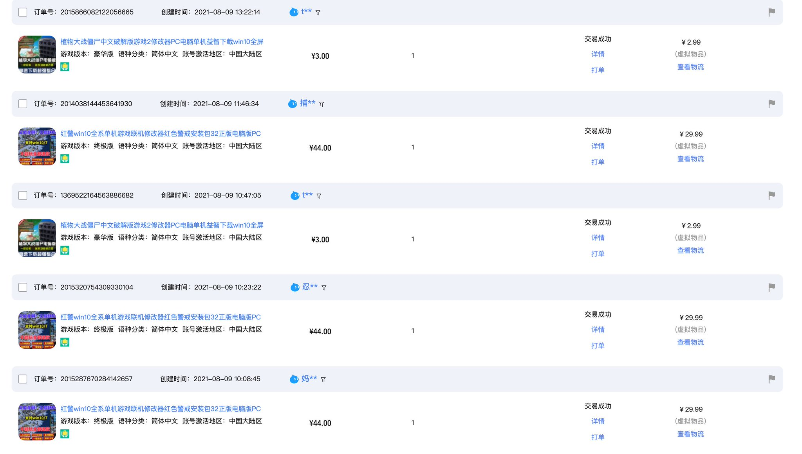
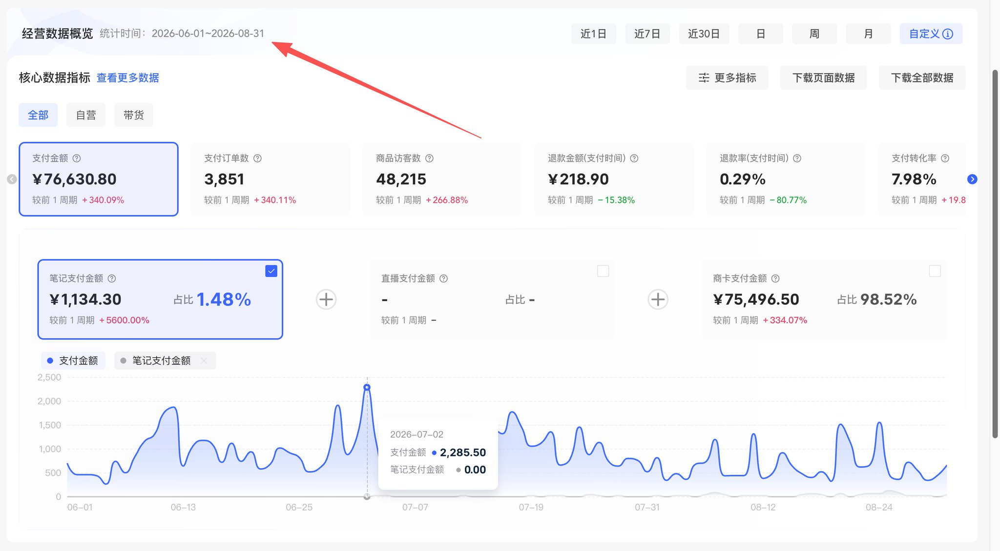
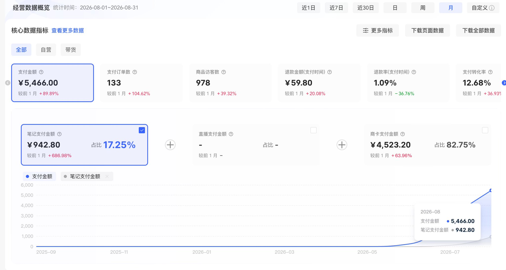
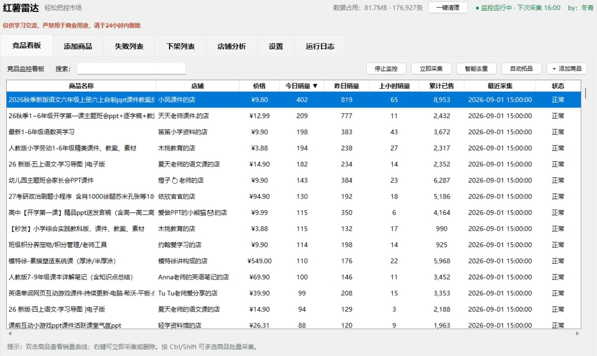
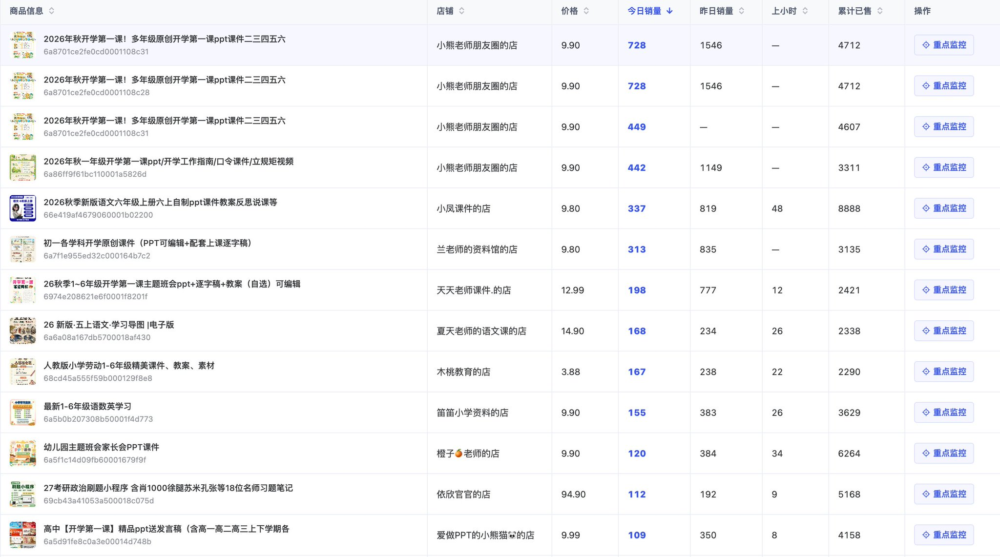
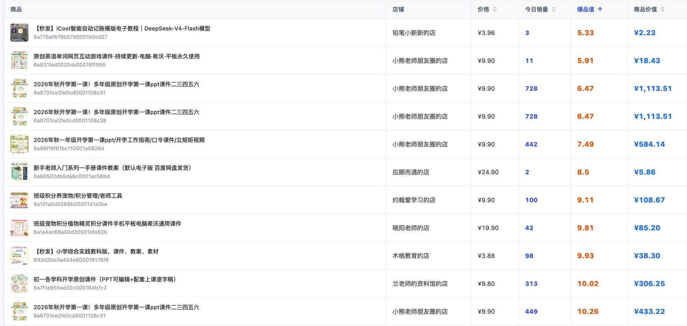

# 我用AI做选品监控，布局8家小红书店铺，巅峰时期月入7万

@DongQingAi · [X 原文](https://x.com/DongQingAi/article/2094691512064098618)

大家好，我是冬青。目前在经营网站以及各种虚拟资料的店铺

不局限于网站、淘宝、闲鱼、小红书

但是我现在感觉小红书依然是带给我最大惊喜的平台

早在2017年，我就开始在淘宝上尝试数字商品。下面这张，就是我当年留下的部分订单记录。

到2021年，我还在淘宝卖过游戏安装包。一个很简单的《植物大战僵尸》安装包，能卖3块钱一份，每天的订单量都还不错。

下面是2021年8月10日的一段真实订单记录。从晚上20点40分到21点51分，一个多小时里，同一个3元安装包连续成交了5单。

这不是偶然某一天才有的订单。后来不同游戏安装包也在持续成交。

这段经历让我很早就意识到，数字产品看起来可以很简单，但只要它能帮用户省掉寻找、整理和试错的时间，就会有人愿意付费。

有人会说：这种东西还需要选品吗？网上不是随便就能下载吗？

我只想说，当你真的想做这个行业时，首先要摒弃的就是这种想法。网上能不能找到，和有没有人愿意付费，本来就是两件事。有人不想自己到处搜索，不想一个个试，也不想花时间辨别哪个能用，他买的就是一个已经被整理好、能直接解决问题的结果。

如果连你自己都不认为选出来的产品能帮人解决问题，甚至连用户为什么愿意付费都说不清楚，那又凭什么指望它帮你赚到钱？

后来转到小红书，我又和很多做虚拟资料的人聊过选品和开店。

目前，我的虚拟资料业务日常月入3-5万元，巅峰时期月入7万元。

下面是其中一家店铺的真实经营数据。2026年6月1日至8月31日，这家店的支付金额为74630.8元。三个月的时间，7万5的支付金额，平均每个月单店带来的收入就是2.5万，因为卖的是虚拟资料，没有进货和制作成本，这笔支付金额就是这家店铺的净利润。

这只是8家店铺中的一家，不是全部店铺的合计数据。其他店铺杂七杂八

当一个产品选好以后，起店的速度非常之快，下面这家店铺是我6月份开始起的，到八月份，当月收入是5000多

除此以外还有很多渠道的收入，比如网盘拉新，私域销售等等

这是我自己的经营结果，不是对别人的收益承诺。从2017年到现在，我一直在做产品、开店，也一直在调整选品方法。

聊得越多，我发现大家遇到最多的问题，不是不会制作资料，也不是不会开店，而是不知道自己应该选择什么类目、做什么产品。

有些人一上来就说要做简历、PPT；还有一些人理解的虚拟资料，仍然是几毛钱、几块钱打包几千套PPT的那种资源合集。

真正转到小红书后，我很快发现，这里和闲鱼、淘宝有很大区别，尤其不能直接照搬闲鱼上的低价资源玩法。

闲鱼上的资源大多价格很低，而且追求“大而全”。你可以很轻松地找到1分钱打包几百套PPT的商品。很多时候，卖家真正想赚的并不是这一分钱，而是背后的网盘拉新收益。资料本身只是一个引流入口，越便宜、越多、越容易让人下单越好。

到了小红书，就必须换一种思路。

在小红书卖虚拟产品，光把一堆文件打包上传是不够的。产品要对准一个具体的人群和场景，还得持续发笔记，让用户知道这份资料能解决什么问题。

同样是PPT，闲鱼用户可能在意“数量多不多、价格够不够低”；小红书用户更可能在意“这套PPT是不是正好适合我的工作、能不能让我马上用起来”。

小红书用户不一定需要文件最多的资源包，他们更愿意为一个清楚、具体、拿来就能用的解决方案付费。

也正因为这样，选品变得特别重要。

我看到很多人始终选不出产品；而我在建立了自己的选品库以后，却经常对着新发现的商品感叹：

\> 天啊，原来这也可以卖。

这当然不等于随便做点什么都能卖。我的感受是，真实需求比我们坐在家里想出来的丰富得多。有些场景看起来很小，只要不断有人遇到，就可能做成一款产品。

后来我做监控工具，也正是想把这种偶然的“发现”，变成一套能够长期积累的选品方法。

很多人看到我现在运营着8家小红书店铺，第一反应可能是：先批量开店，再给每家店找一些产品，最后拼成一个店铺矩阵。

我的实际顺序正好相反。

我没有先定下“开8家店”这个目标。我先做了一款小红书虚拟产品监控工具，持续观察不同店铺、不同商品的销量变化。候选产品越来越多以后，我才按照购买人群、使用场景、核心问题和内容方向给它们分类。

当某个方向不再只有一两个孤立产品，而是逐渐形成一条完整的产品线，并且有足够多的内容可以持续发布时，我才会考虑把它独立成一家店。

最后，产品方向越分越清楚，店铺才一步步扩展到了8家。

这篇文章就讲一件事：我怎样把偶尔刷到一个商品的选品方式，变成长期观察、记录和验证，最后从一堆零散产品里理出了8家店铺。

这篇比较长，预计需要20分钟左右读完。我会把下面这些问题一次讲清楚：

- 为什么闲鱼上常见的低价资源包，不能直接搬到小红书；

- 为什么高赞笔记不等于对应的虚拟产品能够成交；

- 我用AI做的“红薯雷达”到底监控什么，数据应该怎样理解；

- 一个商品出现销量增长后，还要经过哪些判断才能进入选品库；

- 我怎样把零散商品整理成产品线，再由产品线决定店铺布局；

- 我怎样用“爆品值”和“商品价值”，排出最值得研究的新品。

它解决了我以前最头疼的一个问题：

\> 今天到底该做什么产品，依据是什么？

- **一、做虚拟产品，选品往往比制作更难**

小红书上的虚拟产品非常多。

教程、模板、资料包、经验手册、话术合集、工作指南、备考资料、行业知识库……只要围绕一个具体人群继续往下拆，几乎总能找到可以做成电子产品的需求。

问题也恰恰出在这里：选择太多了。

如果只是缺少一个产品想法，刷半小时小红书就可能看到几十个。但“看到有人做”与“这个产品值得我投入时间做”，完全是两回事。

人工选品最容易遇到四个问题。

**第一个问题，是推荐算法会让视野越来越窄。**

你连续看了几篇某个类目的资料，首页很快就会继续推荐同类内容。刷得越多，你越容易产生一种错觉：这个方向到处都在做，一定很有市场。

但你看到的只是算法根据个人行为生成的内容切片，不是完整市场。

**第二个问题，是人很难记住数据变化。**

今天看到一个商品显示已售80，三天以后再刷到，它可能已经变成已售140。可如果没有专门记录，大多数人根本不会记得它三天前是多少，更无法判断这60单是三天卖出的，还是商品页面展示口径发生了变化。

**第三个问题，是内容热度很容易被误认为商品销量。**

一篇笔记有很多点赞和收藏，可能说明标题抓人、内容有共鸣，也可能是账号本身有粉丝基础。它能证明内容获得了互动，却不能单独证明用户愿意为对应的虚拟产品付费。

所以，点赞和收藏我会看，但只把它们当线索，不当销量。

**第四个问题，是人天然会被大数字吸引。**

看到一个累计已售几千甚至上万的商品，直觉会告诉你：这就是爆款，应该赶紧跟。

我自己就被这样的“大数字”带偏过。

临近春节时，有人告诉我，红包封面在小红书上的销量特别高。我打开小红书搜索“红包封面”，映入眼帘的确实是多个累计已售几千甚至几万的商品。

如果只看搜索页面，这个结论几乎没有问题：销量都摆在那里，红包封面显然是一个春节爆品。

但当我把其中的商品加入监控以后，看到的结果完全不同。它们看起来有几千、几万的累计销量，实际一天的销量增量却只有个位数。

我又继续查看商品评价，发现不少评价来自过去不同年份，而且评价里的产品根本不是红包封面。也就是说，我眼前看到的是一个已经积累了大量历史销量和评价的老链接，只是后来修改了商品信息，把现在售卖的产品换成了红包封面。

页面上那个很大的累计销量，属于这条链接过去卖过的其他商品，并不代表当前这款红包封面刚刚卖出了几千、几万单。

如果当时没有把它放进监控工具，只看搜索结果里的累计销量，我很可能会把一个每天只出个位数订单的商品，误判成正在爆发的春节项目。

从那以后，我看到大销量商品时，会额外检查三个问题：

- 最近几个采集周期到底增加了多少销量；

- 最新评价是什么时间，评价内容和当前商品是否一致；

- 这个数字代表当前产品的需求，还是老链接积累下来的历史成绩。

但累计销量只能说明它过去卖过。你不知道这些销量用了多久，也不知道它现在还在不在增长。一个历史销量很高、最近已经不再增长的商品，对今天的选品价值可能远低于一个累计销量不高、但最近持续出单的新商品。

比起“谁的历史销量最大”，我更想知道下面这些事：

> - 哪些商品现在仍然在稳定增长？

> - 哪些新商品刚出现不久，销量却连续上升？

> - 同一个需求，是只有一家店偶然卖起来，还是多个店铺都在出现？

> - 哪些方向不只是能做一个产品，而是能延伸出一整条产品线？

> - 哪些产品适合我的能力、内容和交付方式？

这些问题靠偶尔刷小红书很难回答，于是我开始用AI做一款自己的监控工具。

后来，我把它叫作“红薯雷达”。

- **二、这款工具监控的到底是什么**

先把最容易误解的地方讲清楚。

红薯雷达不是小红书商家后台，也**拿不到竞品的真实订单明细**。它做的事情，是定时记录公开商品页面上的累计已售、价格、商品名称、店铺等信息，再通过不同时间的快照差值，观察销量变化。

举一个最简单的例子。

某个商品上午10点显示累计已售100，上午11点变成108，那么这两个采集时点之间的销量增量就是8。

如果把这样的记录持续保存下来，就不再只能看到“这个商品总共卖了多少”，还可以进一步看到：

> - 今天增加了多少；

> - 昨天增加了多少；

> - 最近几个采集周期是持续增长，还是偶然出单；

> - 同一家店里，哪些商品正在贡献主要销量。

我只需要把想观察的商品加入选品库，工具就会持续记录它的公开销量变化，并按照商品和店铺整理结果。

这功能听起来并不复杂，但对我很有用。以前选品是看一眼商品页面，现在我会看它这几天到底怎么走。

- **三、为什么一定要记录时间，而不能只抄一个销量数字**

假设现在有两个虚拟产品。

A商品累计已售3000，最近一天只增加了2单。

B商品累计已售120，最近一天增加了25单，而且已经连续几个采集周期增长。

如果只看累计销量，A明显更大；如果要寻找最近正在起量的产品，B可能更值得继续观察。

注意，我说的是继续观察，不是马上跟着做。

一两个小时的突然增长，可能只是某篇笔记突然获得了一波推荐或搜索流量。只有把时间拉长，看到它在不同采集周期里的表现，判断才会更接近真实。

我的做法，是让工具在固定时间重复记录，再用前后两次数值的差，判断商品最近有没有增长。这样不同商品、不同日期之间才有比较的基础。

这里我故意使用“销量增量”，而不是“真实订单量”。

因为我们看到的是公开页面数字的变化，不是商家后台订单。退款、平台展示延迟、数据口径调整、商品链接变化等情况，都可能影响公开数字。它适合用来发现趋势和比较候选产品，不适合冒充精确财务报表。

同样，页面价格乘以销量增量，也不能直接等同于对方的利润。优惠、退款、平台费用和其他成本都无法从公开页面完整获得。我使用这些数据是为了比较趋势，不是为了替竞品算账。

- **四、我是怎样用AI把一个想法做成工具的**

我最初的需求并不复杂：不要再靠记忆判断商品有没有增长，我想让电脑定时记下来。

AI帮我把这些想法一步步做成了功能。实际使用时哪里不顺，我就继续提需求、继续改。

我会告诉AI，我需要批量加入商品、定时记录销量、查看近期变化，并把同一家店的商品整理到一起。后来候选产品越来越多，我又让它帮助我查找同店的其他商品、整理销量排名和产品趋势。

后来，我又给红薯雷达增加了一个很重要的功能：只读MCP。

简单来说，MCP让AI可以直接读取这套选品库里的店铺、商品和销量变化，不需要我先导出表格，再把一堆数据复制给AI。

我可以直接问它：最近哪些商品增长比较快？某家店主要是哪几个商品在出单？同一个方向里，哪些候选产品值得继续观察？AI会读取监控数据，再帮我整理结果。

这个MCP只读数据，不会改动选品库。和普通表格相比，这一点对我很实用：我不必自己翻几百行记录，可以直接让AI先把值得看的东西找出来。

以前，我只能靠人工刷小红书和临时记忆；现在，我可以从选品库中看到哪些商品最近仍在增长、哪些方向正在反复出现，再决定下一步研究什么。

AI先帮我读数据、理数据，最后怎么判断还是我自己来。它省的是重复劳动，不会替我按下一个所谓的“赚钱按钮”。

- **五、我不会把销量排名直接当成选品答案**

做出排行榜以后，一个新的陷阱马上出现了：人很容易把排在第一的商品，当成最值得做的产品。

但销量排名只是入口，不是结论。

一个商品进入候选库以后，我会接着看三件事。

**1. 这个需求是不是反复出现**

单个商品突然增长，可以先放进候选池。

如果多个店铺、多个表达不同的商品都在解决相似问题，而且在不同时间段持续有销量，才更值得提高优先级。

我关心的不是有没有人卖，而是这个需求能不能被重复验证。

**2. 能不能顺着做出一组产品**

一个孤立产品卖得不错，不代表值得单独开店。

我更喜欢能往下延伸的方向。一个入门产品后面有没有进阶产品？一个高频问题旁边有没有关联问题？同一批人会不会在别的场景里继续产生需求？

如果一个方向只能做一个商品、写三五篇内容，热度过去以后就无话可说，它更适合放在已有店铺里测试，而不是为它重新开一家店。

**3. 我自己做不做得来**

竞品有销量，不代表我也能获得同样结果。

产品制作能力、内容表达、账号基础、上架时间、定价、封面、搜索关键词、售后和店铺权重，都会影响最终成交。

监控数据只能说明这里值得研究，不能保证我照着做就能赚钱。

所以，任何商品从监控看板进入我的正式产品计划之前，都还要经过一次人工判断。

- **六、从候选商品到产品池，我做了第二次整理**

如果只把销量增长的商品保存下来，最后得到的仍然是一堆杂乱链接。

最后会不会形成一家独立店铺，关键就在后面的分类。

我不会只按商品标题分类，因为同一个需求可能有完全不同的表达。有人把产品写成“入门手册”，有人写成“操作流程”，还有人写成“新人避坑指南”。标题不同，背后解决的问题可能非常接近。

我会从四个维度重新整理候选产品：

> - 人群：究竟是谁在买；

> - 场景：他会在什么时刻使用；

> - 问题：他最急着解决什么；

> - 交付：最终适合做成什么形式。

例如，同一个目标人群的选品库里，可能同时出现入门指南、操作模板、常见问题手册和不同阶段的解决方案。

如果只看文件名，它们是多个不同产品；从经营角度看，却可以继续归纳为入门、日常执行、高频问题和进阶提升等不同产品层级。重点不是文件叫什么，而是它在整条需求链里处于什么位置。

分完以后，产品之间是什么关系就清楚多了。

有的产品适合承担主要的笔记引流，因为问题紧急、用户一眼就能理解；有的产品更适合做辅助产品，因为需求存在，但单独持续生产内容比较困难；还有的产品适合进入合集或后续成交，用来提高整个店铺的产品完整度。

我现在看选品，很少只盯着一个孤零零的爆款。我更关心它旁边还有没有别的需求，能不能和其他产品接起来。

***选品库建起来后，我才知道自己原来漏掉了多少需求***

刚开始做选品库时，我以为它只是一个比收藏夹更方便的工具。用了一段时间后，我才发现它最大的价值，是把我原本看不见的小需求一个个摆到面前。

我们凭空想选品，很容易围着几个熟悉的大词打转。可选品库里反复出现的，常常是一个人在某个具体时刻，急着完成一件具体的事。需求不大，也不新奇，甚至乍看之下有点琐碎，却始终有人在搜、在问、在买。

我经常感叹“天啊，原来这也可以卖”，不是因为发现了什么秘密项目，而是我第一次看到，原来这么具体的麻烦，也有人愿意付费让别人帮他整理好。

这时候我不会立刻把它改写成一个听起来很大的类目，而是先保留它原本的人群、场景和问题。如果后面又出现几个不同商品，指向的却是同一类困扰，我才会把它们放在一起看。一个小需求很难支撑一家店，多个相关需求串起来，才可能变成一条值得长期做的产品线。

这也是我和许多刚入门的人在选品上最大的区别。他们想先找一个看上去很大、很火的类目；我现在会先找那些不起眼、但能够被重复验证的小问题，再看它们能不能长成一条产品线。

- **七、先看产品机会，再决定要不要开新店**

这一步决定了我后来为什么会开到8家店。

很多人做矩阵，先注册一批账号，再给它们安排定位：这个做A，那个做B，还有一个做C。表格看起来很完整，但真正执行时，很快会发现产品不够、内容不够、方向重复，最后每个账号都在断断续续更新。

我的做法是先不规定最终要开几家店。

产品池积累到一定程度以后，我再观察哪些产品应该放在一起，哪些需要分开。

两个产品要不要放在同一家店，我主要看：

> - 买家是不是同一类人；

> - 购买发生的场景是否接近；

> - 两个产品能不能互相承接；

> - 围绕它们创作的内容会不会互相冲突；

> - 用户进入主页以后，能不能迅速理解这家店主要解决什么问题。

如果两个产品面对完全不同的人群，即使都叫“电子资料”，也不应该为了省事硬塞进一家店。

相反，如果两个产品面对的是同一批人，而且一个解决主要问题、另一个解决关联问题，它们放在一起会比拆成两家店更合理。

在具体执行上，我采用的是“一家店一个主推方向，再搭配一个关联度较高的辅助方向”。

这个搭配我做下来比较顺手。用户进入主页，很快就能看懂这家店解决什么问题；我发笔记时也不会一下跨五六个方向，内容压力小很多。主推产品负责让人记住店铺，辅助产品承接相邻需求。

当一个方向只有单个候选产品时，我不会急着开店；当它已经出现多个可以交付的产品、多个可持续内容入口，并且和现有店铺定位存在明显差异时，才具备独立开店的条件。

8家店铺就是在这个过程中形成的。

我一开始没有给自己定“必须开8家”的目标，也没有为了凑矩阵复制8个相似店铺。

更准确的因果顺序是：

\> 监控商品变化 → 发现候选机会 → 建立产品池 → 按人群和场景形成产品线 → 验证哪些方向值得独立 → 最终布局8家店铺。

所以，8家店是这套方法跑了一段时间以后的结果，并非我一开始设定的数字。

- **八、一个产品从被发现到真正上架，要经过哪些步骤**

监控只是第一关。

一个商品出现在销量增长列表里，我不会当天看到、当天照做。我通常会这样处理。

***先放进观察池，不急着跟***

先记录商品、店铺、价格、当前累计销量和发现时间，让它跨过多个采集周期。

我会看增长是一次性的，还是有连续性；看同店其他商品有没有类似表现；也看这个商品是否很快下架或停止增长。

**再多找几家看看**

一个商品增长，也可能只是这家店的笔记做得好。

如果能在其他店铺中找到不同表达、但解决同类问题的产品，需求成立的可信度会更高。

我还会沿着已经监控的商品进入所属店铺，查看这家店的其他产品，再决定哪些值得加入观察。这样看到的就不再是一个爆款孤点，而是一家店的产品结构。

**想清楚谁会买**

我不会只抄商品标题，而是尝试回答：谁在什么情况下会主动搜索它？为什么免费内容还不够？他付费购买后希望节省什么——时间、试错成本、整理成本，还是临场表达压力？

如果这些问题答不清楚，说明我只是看见了销量，没有理解需求。

**再看自己能不能做**

现在有了AI特别方便，大部分的资料我们都可以利用AI来完成，但是一些强版权的内容还有一些用AI难复刻的内容，比如一些知名机构的视频课程，这种时候我可能投入的时间成本太高，不会去做

**能放进老店，就先在老店测试**

只要能放进现有店铺，我通常会先测试，而不是立即新开店。

测试的不只是商品有没有订单，还包括笔记曝光、商品点击、咨询、退款、售后问题和实际毛利。公开竞品数据只能告诉我外部市场的信号，自己的经营数据才决定这个产品是否应该继续投入。

**数据不好，就改或者放弃**

有些产品监控数据不错，但自己上架后点击很低，可能是内容入口不对；有些点击不错却退款高，可能是交付预期出了问题；有些单品表现一般，却能和另一个主推产品形成很好的组合。

选品本来就不是看一眼拍板。这个过程确实比“看到爆款马上复制”慢，但也让我少做了很多只有标题、没有长期价值的产品。

- **九、这款工具帮我改变了什么，又没有替我解决什么**

它最明显的帮助，是扩大了我能够持续观察的范围。

人工刷平台时，我的注意力只能停留在眼前几十个内容上；有了选品库以后，我不再完全依赖记忆，可以持续比较不同商品的近期变化。

它还把选品讨论从“我感觉这个不错”，变成“这个商品最近几个周期在增长，同类店铺也出现了相似产品，可以继续研究”。

注意，我说的是“可以继续研究”，不是“已经证明值得做”。

它不能告诉我究竟是哪篇笔记、哪个标题或哪个关键词带来了流量，也不知道竞品的真实利润，更不能证明我做同一个产品就一定能卖。

发现机会以后，怎样打磨产品、怎样写笔记、怎样定价和承接售后，仍然要自己完成。店铺越多，需要维护的产品和内容也越多；如果产品线不清楚、内容产能跟不上，继续开店只会放大混乱。

所以我一直把它当作选品雷达，而不是选品答案。

- **十、我怎样用“爆品值”和“商品价值”排选品优先级**

监控列表里的商品多了以后，不可能每个都点开慢慢研究。我需要先用数据排一次序，把最值得看的新品挑出来。

**拿现在的开学季举个真实例子**

现在正值开学季，下面这张图是我自己选品库里的实际截图，榜单按当天销量排序。里面有开学第一课、开学工作指南、各学科开学课件等PPT商品。从当天的销量增量看，这一批都属于近期正在明显出量的商品。

直接看这张图，可以很快发现“开学第一课”是当下比较集中的需求。有商品当日销量达到728，还有几款分别达到442、337和313。

但今日销量高，只能说它今天出量不错。我还想知道，这究竟是一个已经卖了很久的老商品，还是最近才突然起来的新品。

我自己给第一个指标起了个名字，叫“爆品值”。

**\> 爆品值 = 累计已售 ÷ 今日销量**

这个数值越小，说明今天的销量占累计销量的比例越高。单日销量越多、累计销量越少，这个商品就越像是最近才起来的新品。它可能总销量还不大，但近期势头很猛，这正是我想优先找到的商品。

还是用上面的开学季PPT来算：

- 一款9.9元的多年级开学第一课PPT，当日销量728、累计已售4712，爆品值约为6.47；

- 一款9.9元的一年级开学第一课PPT，当日销量442、累计已售3311，爆品值约为7.49；

- 一款9.8元的初一各学科开学课件，当日销量313、累计已售3135，爆品值约为10.02；

- 另一款9.8元的开学季PPT，当日销量337、累计已售8888，爆品值约为26.37。

只看当日销量，这四款都很不错；加上爆品值以后，差别就出来了。第一款和第二款的当日销量相对累计销量占比更高，更值得我优先打开研究。第四款虽然当天销量也有337，但累计已售已经达到8888，相比之下更像是一款已经积累较久的商品。

下面这张图，就是我在选品库里按爆品值从小到大排序后的结果。系统也同时算出了每个商品的商品价值。

不过，爆品值只能反映“新不新、起量快不快”，还没有把客单价和单日销量规模算进去。所以我又算了第二个指标：商品价值。

\> 商品价值 = 客单价 × 今日销量 ×（今日销量 ÷ 累计已售）

这个名字是我自己起的，本质上是一个排序分数，不是对商品的财务估值。前面的“客单价 × 今日销量”，反映按公开页面数字估算的当日销售额规模；后面的“今日销量 ÷ 累计已售”，反映近期起量的速度。把两者乘在一起，就是同时给客单价、单日销量和新品势头加权。

套回开学季的真实数据，上面三款商品的商品价值分别约为1113.51、584.14和306.25。第一款不仅当日销量高，爆品值也小，所以在选品库里会被排到更靠前的位置。

再举个简单的例子。两个商品都是累计已售100、今日销量20，爆品值同样是5：

- A商品客单价9.9元，商品价值 = 9.9 × 20 × 20% = 39.6；

- B商品客单价49元，商品价值 = 49 × 20 × 20% = 196。

在今日销量和爆品值都一样的情况下，客单价高的B得分更高。如果两个产品的制作、售后和其他成本也差不多，B的利润空间通常会更大。这就是为什么算完爆品值后，我还要单独算一遍商品价值。

但要注意，只有爆品值相同，不能直接说客单价高的一定更值得做，因为两个商品的今日销量可能完全不同。商品价值把价格和单日销量一起算进去，就是为了避免只看其中一个数字。

这两个指标的用法，一句话就能说清楚：

\> 爆品值越小越值得先看，商品价值越高越值得继续研究。

它们是排选品优先级的工具，不是利润报表，更不是看完就可以照做的答案。今日销量为0时，爆品值无法计算；只有一两单的新商品，数值也很容易被放大。我会继续看后面几个采集周期，再检查评价与当前商品是否一致，避免被单日波动或老链接留下的历史销量带偏。

- **十一、AI在这件事里到底做了什么**

在这个项目里，AI干的活很具体：把我的想法写成程序，处理链接和定时记录，把数据做成看板；再通过只读MCP，直接查询店铺、商品、销量排名和历史变化。

产品池大了以后，我也会让AI先整理销量变化、店铺关系和产品方向。它能帮我从一堆数据里找重点，但做什么产品、怎么交付、要不要继续投入，还是我来决定。

所以我不太喜欢空谈“AI能不能赚钱”。对我来说，AI的价值就是把每天重复做的事情接过去，让我把时间花在选品和判断上。

- **结语：8家店铺不是起点，而是选品系统运行后的结果**

回头看，我做红薯雷达的起点很简单：我不想再靠记忆判断一个商品有没有增长。

从定时保存一个销量数字开始，它逐渐变成了一套能够持续比较商品变化、整理候选产品和观察店铺结构的选品系统。

它也改掉了我以前看见高赞笔记、看见大销量就容易心动的问题。监控先帮我发现变化，选品库再帮我理清产品关系，最后还得用自己的店铺数据验证。

产品越积越多，不同人群和场景慢慢分成了几条产品线，我才开到了8家店。如果用一句话概括，就是：

\> 不是根据店铺寻找产品，而是让产品机会决定店铺布局。

8家店不是目标，只是结果。我更在意能不能持续找到真实需求，再把零散机会做成能交付、能验证、能长期经营的产品线。

如果你也刚开始选品，我的建议是先别急着给自己定下“要开几家店”。先认真记录一小批候选商品，看它们在不同时间的变化，再练习把背后的人群、场景和问题说清楚。当你真的积累出一条产品线，要不要开新店，答案自然会比现在清楚得多。

所以我现在的选品顺序很清楚：先用爆品值找到最近正在起量的新品，再用商品价值排出研究优先级，最后回到具体的产品和店铺里做人工判断。工具帮我缩小范围，真正的选择仍然由我自己完成。

如果大家有需要工具的，我将另起一篇内容，给大家详细介绍
