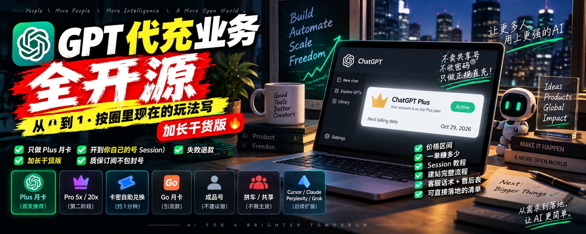
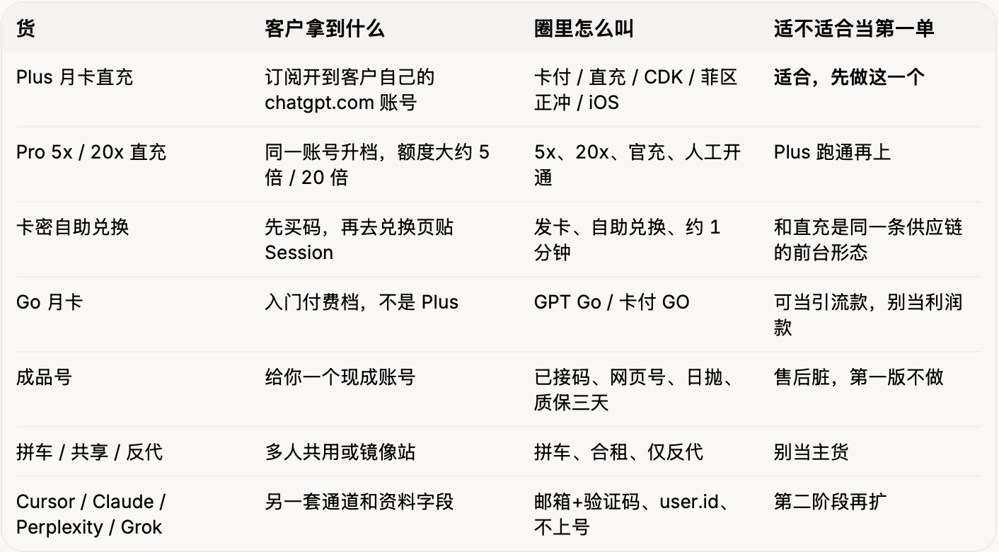
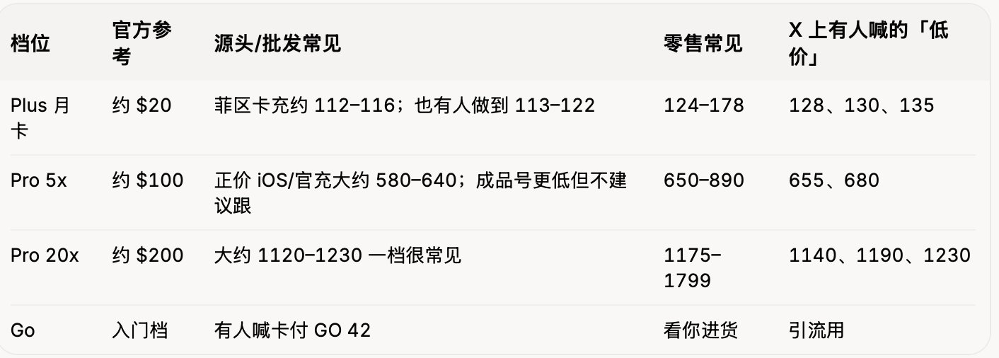
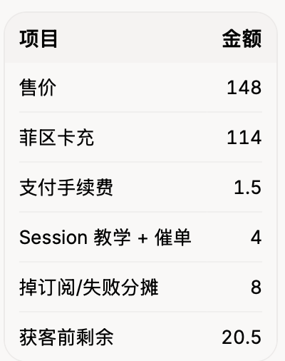
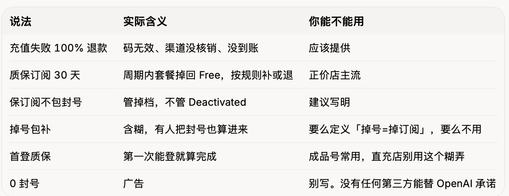
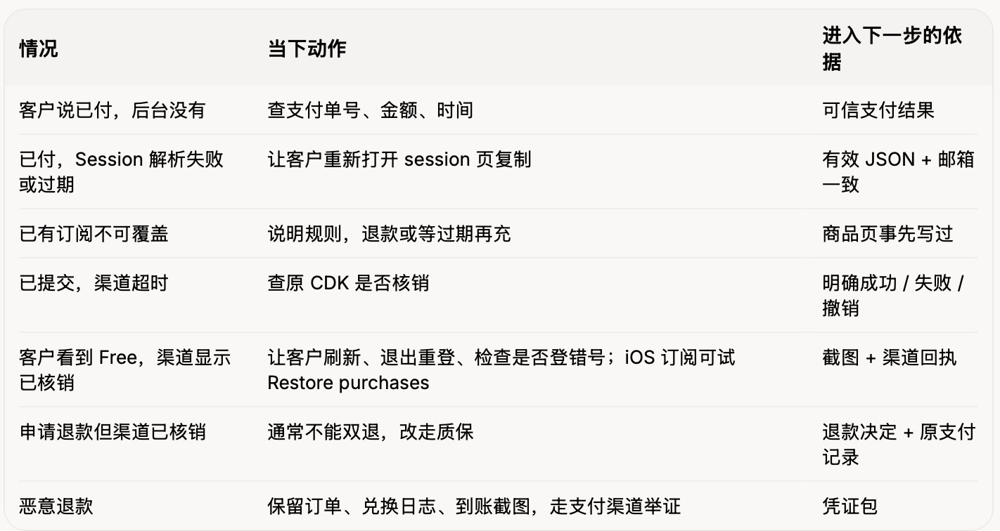

# 火爆全推的GPT代充业务全开源：从 0 到 1，照做就能赚钱（纯干货指南）

@ethanl_0x · [X 原文](https://x.com/ethanl_0x/article/2097514548500824421)

**本文力求使代充业务开源**，力求在GPT代充鱼龙混杂的市场中以一正视听（正如我在checkfakeapi.net中对中转站的举措一样）。

其实，GPT 代充现在不是「卖个会员」四个字。
客户进店时，脑子里其实只有四句：

1. 开到**我自己的号**，还是给我一个别人也能登的号？
2. 要不要**密码**？要贴的是 Session 还是 Account ID？
3. 多少钱、多久亮 Plus、失败退不退？
4. 用几天「会员没了」，你认不认？认的是**掉订阅**还是**封号**？

现在圈里真正在卖的货，拆开是这些，别混在一个 SKU 里：

这篇先把货盘拆开。**七种东西都有人叫「代充」，不是同一种货。**

你要开的是店，不是卡群。只做：**ChatGPT Plus 月卡、开户自己的号 、不收密码 、失败退款 、质保订阅不包封号。**

下面按开店顺序写。不必一次读完；卡在哪一环，就跳到哪一节。

**本文目录**：

1. **一笔单真正走完的路径 — 从付款到账号亮 Plus，后台一单要能回答什么**
2. **三种交付，别混着卖 — 卡密自助 / 人工代登 / 成品号拼车，哪种能当主货**
3. **货盘和价格 — Plus、5x、20x、Go 的行情区间，以及「不可覆盖」「一卡一充」**
4. **每卖一单到底剩几块 — 进货、通道费、质保、恶意退款，怎么算获客上限**
5. **Session 交付 SOP — 兑换页怎么写、客服少说一半的操作步骤**
6. **后台四件事 — 锁定价、订单身份证、超时先查原单、状态词怎么统一**
7. **从零搭 8 步 — 商品卡、最小页面集、假支付验收、丢给 AI 的需求**
8. **找上游的六个问题 — 问什么、怎么判断、别交代理费**
9. **质保口径把词写死 — 失败退款 / 质保订阅 / 不包封号；未到账、掉订阅、封号怎么拆**
10. **售后工作台 — 四条规则 + 高频故障表**
11. **客服话术 — 询价、加急、会不会封号、已有 Plus 能不能续**
12. **第一批内容选题 — 五篇就能开张的题目**
13. **每天盯的五个数 — 日表字段和转化公式**
14. **第一轮执行清单 — 从第 0 天到第 4 周，每步有什么验收物**

先把第 1、3、4、9 节看完，再决定是否开干、进不进货。货没看清、账没摊开，建站和招代理都是提前花钱，纯。

### 1. 一笔单真正走完的路径

客户进店 → 看清「自己的号还是共享号」→ 付款 → 拿卡密或进入兑换页 → 在**已登录 ChatGPT 的同一浏览器**打开 [chatgpt.com/api/auth/session](https://chatgpt.com/api/auth/session)，把整页 JSON 贴回来 → 系统识别邮箱让客户确认 → 卡台核销 → 客户在设置里看订阅是否 Plus、到期日对不对 → 不对就走售后。

有的站不收完整 Session，只收 Account ID / [user.id](https://user.id/)；有的 Pro 单要人工。无论哪种，后台每一单至少能回答：

- 买的是 Plus、5x 还是 20x
- 当时锁定价多少（今天源头涨了，昨天的单不能改）
- 渠道是菲区卡充、美区 iOS，还是别的
- 卡密发了没、核销了没
- Session 提交时间、识别出的邮箱
- 渠道回的是「已受理」还是「订阅已生效」
- 质保从哪天起算、还剩几天
- 售后性质：未到账 / 掉订阅 / Deactivated / 客户不会看

**钱扣了、账号上还没亮 Plus，这单就没完成。** 掉订阅再补一次，算售后，不算新单。

### 2. 三种交付，别混着卖

**A. 卡密 + 自助兑换（现在正经店的主流）**

付完款给 CDK。客户到兑换页：验码 → 贴 Session JSON → 系统抽出 accessToken、显示邮箱 → 客户点确认 → 卡台提交。公开站常见口径是 **30 秒到 3 分钟**。

Session 不是密码，也不是 API Key。它是当前浏览器登录态里的临时凭证，有效期大约几天到两周。圈里相对能摆上台面的店，都把「不收密码」写在首屏。

问上游只问这三句：

1. 提交方式是核销 CDK，还是你传 Session 他代付？
2. 能不能按**你的订单号**查「订阅是否到账」，还是只回「已受理」？
3. 失败、超时、支付回调打两遍，会不会扣两张货？

**B. 人工代登（能起步，不能当长期方案）**

客人把验证码甚至密码给你。小团队早期常见，但「要密码」这件事会让用户极大降低信任。出事后分不清是客户自己多地登，还是你这边 IP 脏。

**C. 成品号 / 拼车 / 收据复用**

闲鱼 9.9、19.9、二三十一个月，很多不是真 Plus：镜像站、多人共号，或一张低价区收据反复上车。客户用几天「会员没了」，你退不完。X 上低价店翻车、卡密清仓收 U 的事已经发生过一轮。这条不要当主货。

先写死你手里有什么：有卡台就做自助；只有人就人工，但**仍然不收密码**；只有低价成品号，先别开店。

夜里没人值守，商品页写服务时段，单进排队。渠道只回「已受理」，订单就显示处理中，别写成「已到账」。

### 3. 货盘和价格：先看懂行情，再决定你卖多少

现在市面上的价格区间大致是：

同一张「Plus」可能是完全不同的货：

- **菲区正冲 / 带账单**：相对接近官方路径，有的可开票，常写「不可覆盖」
- **美区 iOS CDK**：可囤、秒发，有的写可覆盖
- **收据复用 / 低价区票据**：成本低，也是集体掉订阅的来源
- **成品号**：100 出头的 Plus 号、300–500 的 5x 号，质保经常只有「首登」或 3 天

你的定价不要跟 9.9 比，要跟**同一类货**比。正价卡充进 114、零售 148，账才算得过来；你去跟 29 块拼车比，比的不是同一盘货。

下单前必须写进商品页的三句话

1. **已有订阅能不能盖。** 很多菲区卡写死「不可覆盖」：号上已经有 Plus，这张码会失败。有的 Pro 是**覆盖剩余时长，不是往后叠加**——Plus 还剩 20 天，充 5x 会把这 20 天替掉。
2. **一卡一充还是可囤。** 可囤才能做库存；一卡一充就要按单进货，别提前囤一堆过期逻辑不清的码。
3. **质保保什么。** 圈里成熟写法是「质保订阅 30 天，不包封号」。保的是套餐还在不在，不是 OpenAI 永不 Deactivated。

### 4. 每卖一单到底剩几块

卡台进货（菲区 / iOS / 官充，按当次锁定价）

- 支付通道费（支付宝/微信大约 0.6%–1%；有人因此不挂支付宝、改加微信或收 U）

- 人工（教 Session、催上游、解释「设置里看订阅」）

- 获客（闲鱼佣金、X、卡网分销返点）

- 质保赔付（掉订阅补卡、失败退款）

- 恶意退款准备金

**= 这一单真正留下的钱**

售价
- 卡台进货（菲区 / iOS / 官充，按当次锁定价）
- 支付通道费（支付宝/微信大约 0.6%–1%；有人因此不挂支付宝、改加微信或收 U）
- 人工（教 Session、催上游、解释「设置里看订阅」）
- 获客（闲鱼佣金、X、卡网分销返点）
- 质保赔付（掉订阅补卡、失败退款）
- 恶意退款准备金
= 这一单真正留下的钱

Plus 举例（假设，用来套公式）：

想每单留 12 块覆盖域名、客服号、你的固定时间，获客就不能超过大约 8 块。80 块推广带来 10 个首购刚好；只带来 4 个，获客 20，这单白干。

5x / 20x 看起来毛利厚，售后单次损失也厚：补一张 5x 可能直接吃掉十几张 Plus 的利润。所以第一版不要上高客单，除非查单和质保已经跑顺。

再记两笔圈里常漏的账：

1. **恶意退款。** 用几天再找支付渠道拒付，货已核销。X 上已经有店主在问怎么办。对策是：订单凭证齐全、交付截图留存、尽量走能举证的通道；U 能降拒付，但写错地址不认第二笔，别当「避风控神器」。
2. **你的时间。** 一单讲清「怎么复制 Session、充完去哪看、掉了找谁」，15–30 分钟很常见。连续接，一天就没了。时间不够就提价、做图文教程、或换更好查的卡台。

折扣先写下「活动结束恢复价」。靠 9.9、29 冲量，进货都盖不住。

### 5. Session 交付 SOP（把这段做成页面，客服少说一半）

这是现在直充店的核心操作，必须写成图文，不要只靠口头教。

客户侧（写进兑换页）：

1. 用电脑或手机浏览器登录 [**chatgpt.com**](https://chatgpt.com/)（苹果手机很多站要求 Safari）。
2. 同一浏览器新开一页，访问 [https://chatgpt.com/api/auth/session](https://chatgpt.com/api/auth/session)。
3. 页面是一大段以 { 开头、} 结尾的 JSON，**全选复制**，不要自己挑字段。
4. 贴回兑换页。系统应显示识别出的**邮箱**，客户确认是自己的号再提交。
5. 等订单变成「订阅已到账」后，回 ChatGPT 设置里看套餐和到期日。还是 Free，先别反复提交。

你这边要做的：

- 提交前校验 JSON 能不能解析出 accessToken 和 email
- 邮箱和订单备注不一致，卡住人工确认，防止充错号
- Session 只用于当次提交，用完从页面清掉；不要让客服把 JSON 转发到群里
- Token 过期是高频失败原因：提示「重新打开 session 页再复制」，不要立刻补一张新码
- 写明：Session 有效期内理论上能访问该登录态，完成后可改密让旧会话失效——这是对客户诚实，也是你减少扯皮的方式

不要在未核销前让客户改密或退出所有设备，否则正在处理的单会失败。

### 6. 后台四件事，少一件客服就会被问爆

**价格以订单为准。** 源头今天从 114 涨到 120，昨天的单不改价；退款按原单。

**一单一个身份证。** 谁下的、什么档、锁定价、哪张 CDK、Session 时间、识别邮箱、渠道单号、质保截止。

**超时先查原单，禁止直接补交。** 卡台卡住先查这张 CDK 核销没有。直接再提交，容易一卡两充，你亏一张货。

**状态客户自己能看懂。** 建议就用这套词，不要发明「成功中」：

待付款 → 已发码待兑换 → 已提交处理中 → 订阅已到账 → 售后中（未到账/掉订阅/退款中）

客户最烦的是：钱扣了，[chatgpt.com](https://chatgpt.com/) 还是 Free。订单页要同时放「查看订阅的路径」和「不要重复提交」的提示。

技术上还要测这 8 个失败：报价过期仍能下单；连点两次付款扣两次；支付通知来两遍重复发码；外部超时重复提交；A 看到 B 的单；一张码用两次；退款和履约撞车金额不一致；备份恢复后任务能否续上。

### 7. 从零搭：8 步按真路径，每步都有验收物

**第 1 步：一张商品卡（填不出来就先别建站）**

> 商品：ChatGPT Plus 月卡（开到你自己的账号，非共享号、非成品号）
> 客户：已能登录 [chatgpt.com](https://chatgpt.com/)，没有海外卡，要用网页版 / Codex
> 购买条件：不收密码；已有订阅能否覆盖以商品页为准（默认按「不可覆盖」收单）
> 交付结果：账号出现 Plus，约 1 个月；**不含 OpenAI API 余额**
> 总价：【零售价】；发票另算就写明
> 时效：付款后发码；兑换后通常 1–3 分钟；人工单写工作时段
> 失败：码无效 / 渠道失败 → 退款或补码
> 质保：【30 天订阅】；掉订阅按约定补；**Deactivated 不在质保里**
> 免责：本店是第三方代充，与 OpenAI 无授权或隶属关系

「谁最需要」不要写成「所有想用 AI 的人」。更准的是：已经在用网页版、要额度、不想搞美区 ID 和虚拟卡的人。

**第 2 步：页面最小集**

前台只要：商品页、下单/支付、订单查询（订单号+查询密码）、兑换页、售后说明、Session 教程。
后台只要：定价、库存/卡密、订单、人工队列、退款、质保日历。

商品页顺序：

套餐名

→ 开到你自己的号

→ 含什么（以当下官方能力为准，别把 GPT-5.6 / Codex 写成永久承诺）

→ 总价

→ 时效

→ 三步（付款、拿码、贴 Session）

→ 已有订阅能不能盖

→ 质保边界

→ 售后入口。

**第 3–8 步**

先用假支付跑通成功、失败、超时、重复点击。

资料只收服务必需字段。密码、登录凭证、短信验证码一律不收。

退款金额只能来自已确认支付记录，不能让客户自己填一个数。

最后换一台没参与开发的人的手机，让他边点边说卡在哪。这些停顿就是下一轮要改的。

丢给 AI 的需求可以扩成：

> 单商品：ChatGPT Plus 月卡代充。模拟支付 + 模拟卡台。
> 前台含商品、下单、订单查询、兑换页（验码、贴 Session、展示识别邮箱、确认后提交）、售后。
> 后台含锁定价、卡密库存、订单状态机、人工接单、退款、质保截止日。
> 重复点击只处理一次；超时先查询渠道再决定补交；客户只能看自己的单。
> 演示三单：正常到账、Session 过期后重贴成功、质保期内掉订阅补卡。
> 预留「提交 CDK / Session、查询订阅状态」的接口位置。
> 页脚写明第三方、非官方授权。

### 8. 找上游：六个问题 + 怎么判断别被当代理韭菜

先确认上游卖的是**官方路径订阅**（菲区卡充、美区 iOS、官网卡）还是低价区收据复用。后者便宜，也是「一波全掉」的来源。

同一套问题问每个卡台：

1. 交付物：Plus / 5x / 20x？一卡一充还是可囤？已有订阅能否覆盖？
2. 受理 vs 到账：自动 24h 还是工作时段？只回「已受理」算不算完成？
3. 完成凭据：渠道单号、到期日、账单截图，能不能对到你的订单？
4. 卡住怎么查：要不要客户重新贴 Session？会不会让你再付一次？
5. 失败怎么退：未核销、处理中、确认失败，分别退到哪一步？
6. 调价：报价有效多久？已接单按锁定价还是新价？

可直接复制：

> 我做 ChatGPT Plus 直充（开到用户自己的号，不收密码）。请确认：套餐与能否覆盖已有订阅、单价和有效期、受理/到账时效、按订单查询方式、完成凭据、未受理/处理中/失败的退款，以及主体说明。请给可核对结果的测试单。

判断：

- 信息齐、测试单能对上订阅结果 → 小范围验证
- 只有报价、不说退款和查单 → 先别铺货
- 结果不明却让你再交 Session 或再付款 → 先查原单，禁止重复提交

备用渠道必须能交付**同一种**服务。原单不明时留在查单队列，确认未核销或已撤销，再换渠道。

112 的货如果查单要你盯一天，不一定比 116 带自动回执便宜。
X 上已经有人点破：很多人鼓吹月入百万，是为了收你代理费。没有稳定卡台、没有查单，先别交加盟费。

### 9. 质保：把话写死，少一半售后

圈里这几个词意思不一样，商品页和客服必须用同一套：

再拆三种客户口中的「没了」：

- **未到账：** 能登录，一直是 Free，渠道也未核销 → 查单 / 补交 / 退款
- **掉订阅：** 能登录，Plus 没了，号还在 → 走质保
- **封号：** Account Deactivated，登不进去 → 官方申诉是客户的事；你只处理「这单服务是否完成过」

共享号、反代、号池、把号拿去提 API 转卖、客户自己向银行拒付，写进质保除外。

### 10. 售后工作台：四条规则 + 高频故障表

超时主动更新：

> 单还在卡台处理。我们已按原单查询，预计【】前更新。若确认未核销或失败，按约定退款或补码，不会再让你付一次。

退款分清「已申请」和「已到账」。告诉客户钱退到微信还是支付宝、哪一笔。

每次售后记一个原因：Session 过期、不可覆盖、卡台延迟、客户把掉订阅当成封号、登错号、支付未到账、拒付。同一原因超过三次，改页面，不要只改话术。

交班时把未完成单带过去：谁负责、下一步、何时再查。不要只在微信里留一句「帮忙看看」。

### 11. 客服话术（）

先问三句：要 Plus 还是 5x/20x；号能不能登录 [chatgpt.com](https://chatgpt.com/)、现在是 Free 还是已有订阅；是否接受贴 Session、不交密码。

确认后一段话说完：

> 这个是开到你自己 ChatGPT 账号上的 Plus 月卡，不是共享号，总价【】。付款后拿卡密，兑换页按说明贴 Session（或 Account ID），一般 1–3 分钟到账。同一订单页能查进度。质保是 30 天订阅，掉订阅按约定补；账号被官方停用不在质保里。售后走这笔订单。

快捷回复：

> **「能便宜点吗？」**
> 这个价是独享直充，进货是正价卡充。闲鱼二三十那种很多是拼车或收据复用，用几天容易掉。共享号我们不卖。

> **「能马上到账吗？」**
> 自助单兑换后通常 1–3 分钟。现在排队的话预计【】开始处理。你必须在【截止时间】前用上，我先看卡台再接。

> **「买完怎么知道好了？」**
> 打开 [chatgpt.com](https://chatgpt.com/)，设置里看订阅是否 Plus、到期日对不对。还是 Free，先别反复提交，把订单号发我查核销。

> **「会不会封号？」**
> 正规直充是给你的号完成订阅，不收密码。封号更多是共号、脏 IP、黑卡拒付、把号挂反代。我们质保的是订阅在不在，不是 OpenAI 永不停用。谁说「0 封号」当广告看。

> **「我已经有 Plus，能续吗？」**
> 以本单规则为准。若写的是不可覆盖，要等当前订阅结束再充，或换符合条件的通道。不要先付钱再问。

> **「能不能开发票 / 对公？」**
> 【能 / 不能 / 加收点】。能的话写清抬头、税率、开票时效。团队采购和零售单分开走，别用个人码收对公款。

客服、商品页、订单页用同一套词：Plus、卡密、Session、质保订阅、掉订阅、封号、不可覆盖。

### 12. 后续引流

别写「AI 改变生活」。就这五篇：

1. 《买 Plus 代充前先确认三件事》：自己的号、要不要密码、已有订阅能不能盖。
2. 《从付款到账号亮 Plus》：演示单走完拿码、贴 Session、设置里看到期日。
3. 《一直处理中 / 还是 Free，该查什么》：核销没有、有没有登错号、掉订阅还是 Deactivated。
4. 《Plus、5x、20x 怎么选》：人在电脑前用选 Plus；额度总撞顶再考虑 5x；整天挂 Codex / Agent 再看 20x。并写清：订阅不是 API 余额。
5. 《为什么不卖 29 块》：把拼车、成品号、收据复用和正价直充拆开。这是现在转化最高的信任点。

每篇只留一个动作：看商品、看教程、或提交订单号。

统计同一来源：

阅读 → 咨询 → 付款 → 到账 → 退款。

阅读多成交少，多半是价格或「要不要密码」没写清。

### 13. 每天盯的数，和一张日表

1. 有效咨询：要 Plus 还是 5x，能不能接受 Session。
2. 付款单。
3. 按承诺到账（账号亮对应套餐）。超时集中就查那个卡台。
4. 退款 + 补卡 + 拒付成本，倒逼 148 还能不能卖。
5. 老客户续费。续费还要重新教 Session，说明兑换页该改。

日表列：日期、来源（X / 闲鱼 / 卡网分销 / 搜索）、去重咨询、首购、付款单、到期应续、按时到账、未结异常、实收、退款、卡台成本、手续费、人工工时、推广。

咨询转化 = 同批付款人数 ÷ 去重咨询。
按时交付 = 按时到账 ÷ 当期应付单。
退款跨天回写原单，今天进明天退只算一次结果。

一天只改一个卡点：补「不可覆盖」、换查单快的卡台、或把「要密码」的咨询直接拒掉。

单量起来后，把进度查询、排队提醒、重复回复交给系统。人只处理：已有订阅能不能盖、掉订阅还是封号、要不要换上游。

### 14. 第一轮执行清单（每步都有能检查的东西）

**第 0 天**
一页纸写死：客户、货、价、交付、质保除外条款。能用一分钟讲完再往下。

**第 1–2 天**
问至少两个卡台，拿测试单。留下书面：覆盖规则、查单方式、失败退款、调价通知。

**第 3–5 天**
上商品页、兑换页、查单页、Session 教程。假支付跑完成功 / 失败 / 重复点击 / 串单。

**第 6–7 天**
小范围真单，逐笔跟完。把客户原话补进 FAQ。

**第 2 周**
三到五篇内容。开始记日表。还不能解释「每单赚多少、卡在哪」，就先别上 5x，也别招代理。

**第 3–4 周（可选）**
Plus 按时到账稳定、售后原因可分类之后，再考虑：Pro 5x、发票、第二个卡台、Cursor / Claude。扩品时当新产品重新走商品卡，不要假设「反正都是代充」。

### 最后

第一单跑通，你卖的不是「AI 项目」，是这几样能验收的东西：

人民币能付、开到客户自己的号、不交密码、订单能查、失败能退、掉订阅有人认、封号不装能包。

接着优化也很具体：哪篇内容带来真咨询、Plus 和 5x 哪个售后少、哪个卡台回执快、哪句「保订阅不包封号」少掉一半扯皮、恶意退款有没有被日表暴露。

选一个 Plus 月卡，按当时源头价把账摊开，把第一张卡密核到客户号上，再谈扩张。
别一上来铺 9.9 共享号——那不是开店，是给售后打工。

**我是北大在读的Ethan，AI产品连续创业者。**欢迎关注，后续持续分享。
