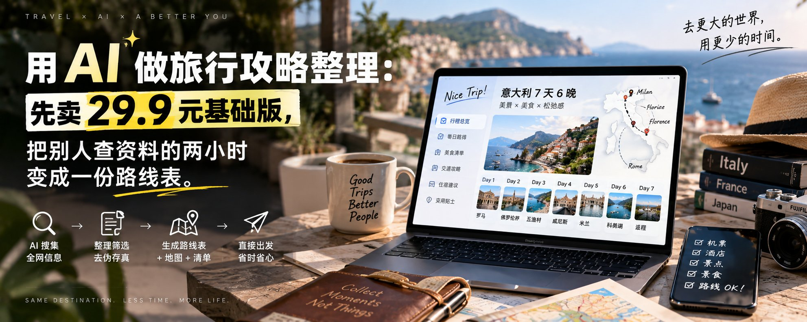

# 用 AI 做旅行攻略整理：先卖 29.9 元基础版，把别人查资料的两小时变成一份路线表

@better_christal · [X 原文](https://x.com/better_christal/article/2096931498167259333)

很多人把旅行攻略当成“免费内容”。

临近出发的人最焦虑的，不是没看过攻略，而是收藏夹里有 80 条笔记，仍不知道第一天从哪儿开始走。

这就是普通人能做的小服务：不替客户订票，不承诺最低价。你卖的是一份把零散信息排成路线的整理工作。

起步先做 29.9 元基础版。客户给出城市、天数、人数和预算，你在当天交付一份可打开的路线表。先把第一份做出来，比研究“旅游博主怎么变现”有用得多。

### 先把商品做小：只交付一份能照着走的攻略包

不要一开始就接“帮我规划 7 天游遍云南”的大单。那会把你拖进酒店选择、景点取舍、临时改期和无限修改。

基础版只含 4 样东西：

1. 按上午、下午、晚上排好的逐日路线；
2. 每天 3-5 个地点及建议停留时间；
3. 一张交通衔接和预算提醒表；
4. 一个地图收藏清单，客户打开后能直接导航。

建议把边界写进商品页：不代订机酒、不保证票价和排队时间、不处理签证，不做医疗、户外安全判断。客户买的是“出发前少查两小时资料”，不是一份旅行保险。

### 接单前只问四个问题，别让客户把你当搜索框

用飞书表单、问卷星或一段固定话术收集信息。少一个关键答案就先不开始做。

1. 去哪里，哪天到、哪天离开？
2. 几个人出行，有老人、小孩或行动不便的人吗？
3. 人均预算和最想要的体验分别是什么？
4. 已经订好的交通、住宿区域，以及明确不想去的地方？

客户发来十几条收藏链接时，不要逐条抄。让他只选出“最想去的 3 个地方”。这一步决定你交付的是路线，而不是一份更长的收藏夹。

### 用三个工具，45 分钟做出第一版

工具不用堆。ChatGPT 或豆包负责整理和排程；高德地图或百度地图负责核对地理位置与路线；Canva 或飞书文档负责把结果排成客户看得懂的页面。

**Step 1：先建地点池。** 把客户给的地点、城市和偏好贴给 AI，让它按“必去、顺路可去、下雨备选”分类。输出不是文案，而是一张地点表。

**Step 2：再按区域排日程。** 打开地图，把必去点标星。不要按网红程度排序，要按地理位置把同一区域排在同一天，减少来回折返。

**Step 3：让 AI 生成路线草稿。** 复制下面这段提示词，替换方括号内容：

你是旅行行程整理助手。为\[城市\]制作\[天数\]天路线草稿。
出行者：\[人数与特殊需求\]；预算：\[预算\]；住宿区域：\[区域\]。
必去地点：\[3-8个地点\]；偏好：\[美食/亲子/拍照/慢游\]。
按地理相邻原则安排，每天分上午、下午、晚上；
每项写建议停留时长、下一站交通方式和一个下雨备选。
不能编造营业时间、票价、交通班次；不确定项统一标“出发前确认”。
最后用表格输出：时间段、地点、移动方式、备注。

**Step 4：人工核对两个点。** 用地图检查相邻两站是否真在同一区域；把可能闭馆、预约、季节性项目标成“待客户确认”。AI 最容易把看起来合理的地名、时长和营业信息拼在一起，人必须在这里踩刹车。

**Step 5：做成一页一日。** 在 Canva 套用简洁的行程表模板，或直接在飞书文档做 3 个模块：今日路线、吃住提醒、地图链接。客户需要的是在路上能迅速看懂下一站。

### 第一份交付物，照这个目录发给客户

把文件命名成“城市-日期-旅行攻略”。正文控制在 6-10 页内，结构固定：

1. 出行信息和总预算提醒；
2. Day 1 到 Day N 路线表；
3. 住宿区到每日第一站的交通提醒；
4. 必须提前确认的清单；
5. 地图收藏链接和修改说明。

交付时发一句：“我已按不绕路原则排好第一版，黄色标注是需要你出发前确认的票务或营业信息。可免费改一次：只限调整一个日期的顺序，不新增城市或景点。”

这句话能挡住大部分无边界修改。你卖的是整理，不是 24 小时在线导游。

### 定价不要装专家，先用三档测试需求

刚开始可以用 29.9 元做 1-2 天国内基础版，只收集案例和反馈；3-4 天、需要地图收藏和一次修改的版本试 59 元；多人出行、已有交通住宿、需要整理复杂偏好的版本再报 99 元以上。

报价前先发客户一张“交付样页”。客户能看到自己会收到什么，成交比空说“AI 定制攻略”更容易。你也能借样页判断对方是不是会无限加需求。

不接“今天晚上就要、还要保证不踩坑”的单。时间太紧时直接报加急价，或请客户改到次日交付。新手最容易亏掉的不是工具费，是没有边界的沟通时间。

### 第一批客户，不要等流量，先做 3 个公开样品

选 3 个近期热门城市，按不同人群各做一份：情侣周末、亲子两日、预算有限的学生。每份只做一页路线预览，发在朋友圈、小红书或本地群。

文案不要写“专业旅行规划师”。直接写：

我用 AI 把散乱收藏整理成按天走的旅行路线。
目前开放 5 个测试名额：城市+天数+预算，29.9 元出一份路线表和地图清单。
不代订，不卖课，先看样页再决定。

有人来问，先发信息收集表和样页。有人付款，把问题、最终路线和修改点匿名记进模板库。做满 5 单后，你会发现真正耗时的是收集偏好和处理变更；下一次就用表单和修改规则把它们压下去。

### 今天就做，别先做“完美旅行助手”

1. 用自己的下一次旅行做一份样品；
2. 把上面的四问做成表单；
3. 用提示词生成一版路线，再亲自到地图上核对；
4. 做一张样页，发给 10 个有出行计划的朋友；
5. 只接边界清楚的第一个 29.9 元订单。

AI 不能替你判断一趟旅行好不好，但它能把“找资料”变成半小时的整理工作。普通人第一笔钱，往往不是来自多高深的能力，而是把别人嫌麻烦的那一步做得清楚、及时、可交付。
