# AI GTM实践：如何构建Reddit Marketing Loop

@yangyi · [X 原文](https://x.com/yangyi/article/2086747579237503005)

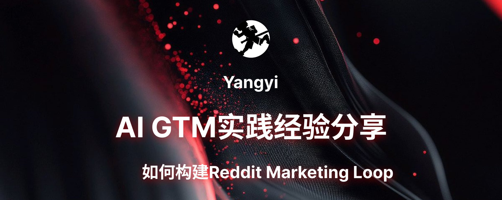

## Reddit营销起初

我很早就在玩Reddit，在24年初谷歌和Reddit开展合作后，我意识到Reddit出现了一个流量洼地红利窗口期。

于是24年开始我就堆了一些号，自己试着养了1个Subreddit来进一步了解Reddit的内容和管理机制，通过搭建一个Karma Farm（交换Karma）的Subreddit，快速增长到了2.8w成员。

24年年底在小报童发布了《Reddit营销获客增长手册》，应该是国内比较早的一批系统化介绍Reddit的内容读物了。

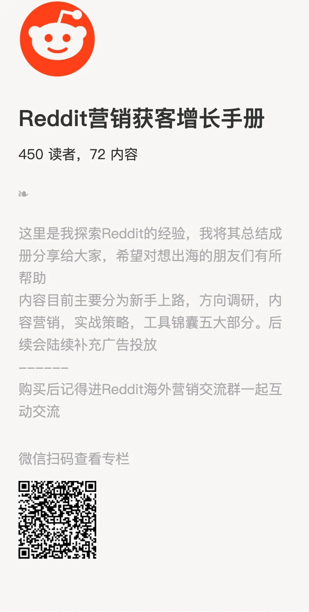

接着转眼到了25年，我意识到AI增强了软件开发能力，流量和用户注意力更加稀缺了，那么分发网络将出现巨大的溢价。于是我开始想构建Agents GTM，利用Agents自己构建社媒账号来搭建分发网络。

当时想的比较简单，过往是MCN捆绑人类，然后设计一种利益分配机制进行合作，靠人力杠杆来获得流量，构造分发网络。

如果把人类替换成Agents，这事情是不是继续Work？

接着我就开始了我的尝试。

## 自动化养号

接着我开始跑自动化养号。

批量采买谷歌邮箱，注册Reddit，激活绑定邮箱，采买IP出口自己搭梯子。

光账号，IP，踩的坑就真不少。

别的不说，就IP一个事情，我找了20多家供应商挨个试，最后才找到了好用的。

然后我们自己搭了一个自动化Playwright的养号工具平台，可以同时养Reddit和推特。

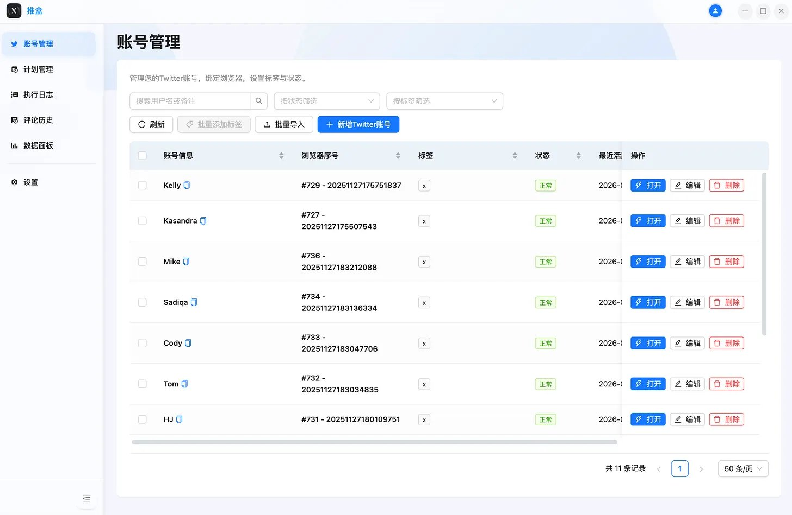

做好策略，每天自己去浏览，关注Subreddit，回复。

我们尝试过很多策略，做了很多对比实验，比如解锁成就表

当时拆分了Reddit的所有成就徽章系统，分别做了Playwright脚本去拿徽章

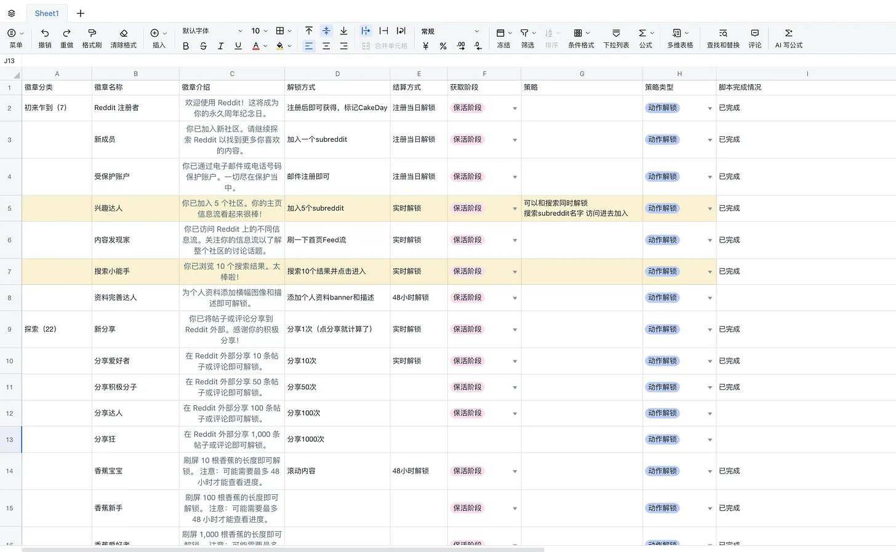

后来发现，成就徽章对Reddit的保活帮助并不大。

我们做过2个测试，一个是完全不评论，先保活，然后拿徽章，每天持续登录的。

连续30日登录后，发现拿满20+徽章，第一个评论一样死。

还有一个实验组是持续评论并拿徽章，和一个对照组是持续评论不拿徽章，结果是差不多的。

起初我们起了300多个号来跑这些测试，一个月之后回收了一批

测试过程中曾经因为其中一个实验组的评论策略设置错了，把全量账号设置成了统一的评论策略，结果导致300多个账号死了90%+，直接悲剧，少说亏了两三万

后来跑起来之后，我们发现了另外的问题：

- IP稳定性：我们一般一个IP跑3-4个账号，但后来Reddit上了IP关联封锁，而且我们IP服务商有的IP段也不是特别稳定，有的IP买完就没法用了
- 账号行为异常：一个账号一直发营销内容，没有自然内容，不够多元，账号很容易被「真人用户投诉」，也很容易被MOD抓出来，导致删帖
- 规模化趋同：策略组虽然都有一些随机性，但整体看起来还是比较程序化，随着规模增加后，这些特征更容易集中化，很容易暴露出整体号池从而被大面积封禁

**这里最好的一个认识就是，养Reddit最关键的还是看CQS**

CQS（content quality score 内容质量得分) 是影响账号最重要的，没有之一

它由2部分构成，一部分是Karma，一部分是时间周期

或者说，它是一个账号在近xx天内获得xx karma的一个量化指标

既表现了「内容贡献度」，又加权了时间性的「活跃度」

查看CQS就直接去 r/whatismycqs 发帖就好了

## 内容Agent的自我Loop

对于发帖而言，号比较重要

我们一边自动化养，一边人工

代发的事情也就解决了

接下来就是内容策略

我们开始做Skills来构建我们的内容方法

伴随着业务，一边做skills，一边系统化整理，最后大抵上分出来几个模块

- 调研类：比如品牌侧，舆情向，用户情绪挖掘，Subreddit审计
- 内容类：爆款话题挖掘，语料表达知识建设，Subreddit禁例，SEO/GEO挖掘审计
- 交付类：内容计划生成，内容撰写，评论撰写
- 迭代类：复盘报告

通过搭建各类Skills，把整个内容生产的SOP固化下来，然后就是开展Agent的Loop

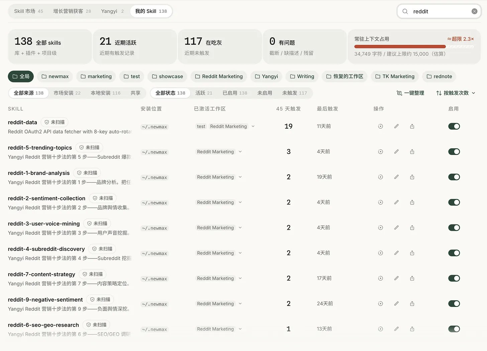

### Loop Step 1 ： 半人工跑流程

第一个阶段，我们先半人工的跑流程

一边跑，一边优化skills，一边校对结果

早期我们都是用飞书跑，这样简单

跑完了就构建个发布表，人工&机器发布

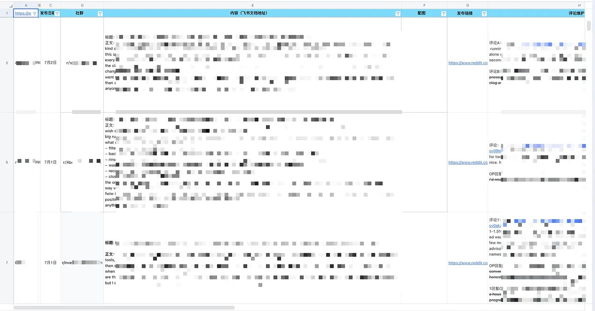

通过这个流程，发现AI在这个过程里的问题，然后逐步把Skills优化稳定

接着看看内容发布是否ok，删帖率大概是什么样子，AI Slop是否能跑出爆款

当你能持续产出爆款之后，证明Skill策略奏效

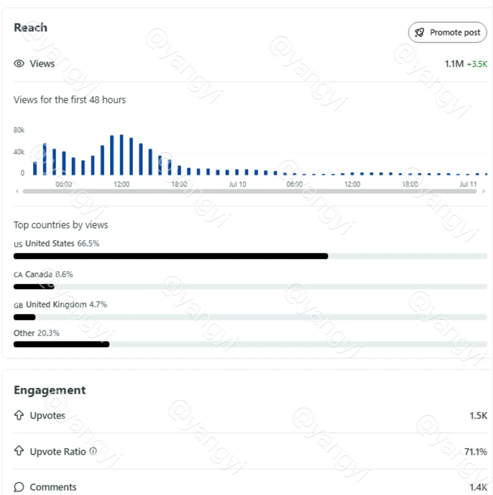

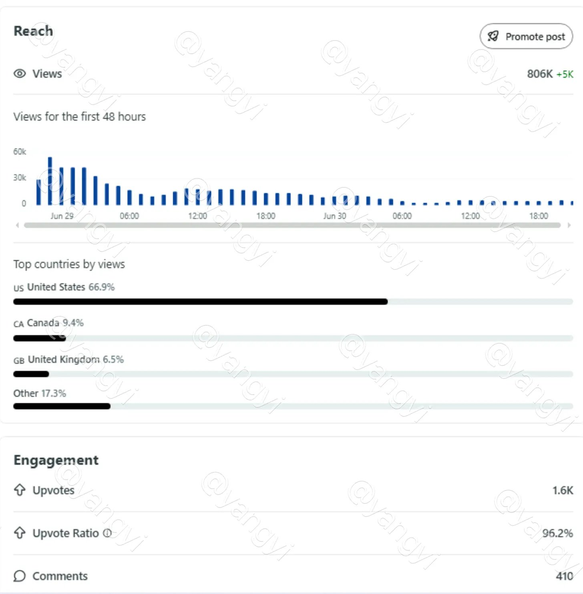

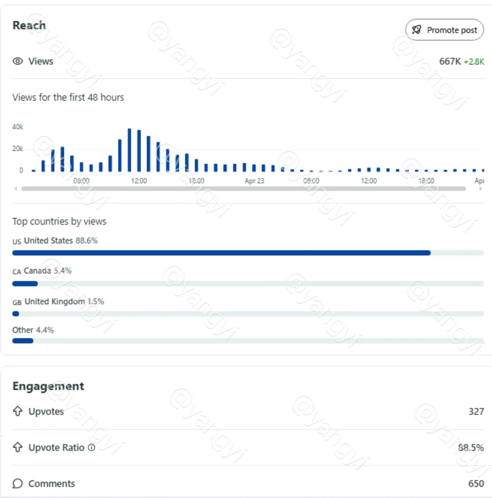

验证了这些没问题之后，我们就进入了第二阶段

### Loop Step 2 : 复盘效果确认

在第二阶段要做的事情，是确认Loop的效果

走完第一个Campaign之后，进行复盘，然后把问题进一步优化

让AI自己分析问题，自己解决，自己提供策略

人只做辅助筛查

在第二个月结束后，如果你发现Loop出了效果，那么就是AI自循环的策略完成了进一步的确认，这是一个很重要的信号

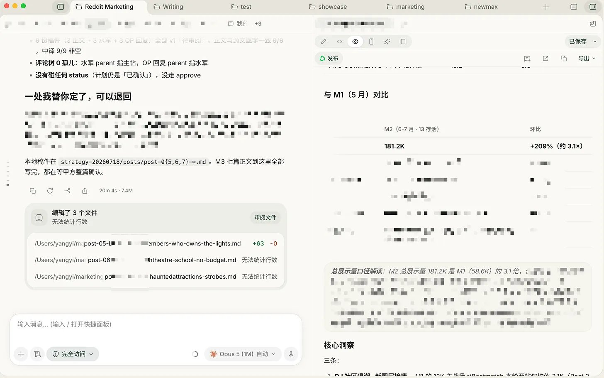

做完第二阶段，发现有4个客户都稳定在200%以上环比增长

说明Loop的策略也做对了

接着就可以稳定进入第三个阶段

### Loop Step 3：系统化

接着进一步解决AI与人的协同流程问题

把沟通放在NewMax客户端

把数据沉淀在SaaS Web内

这样相比飞书表格，大量减少幻觉

通过封装CLI让你的Agent能调用这套系统，就完成了基础的人机协同构建

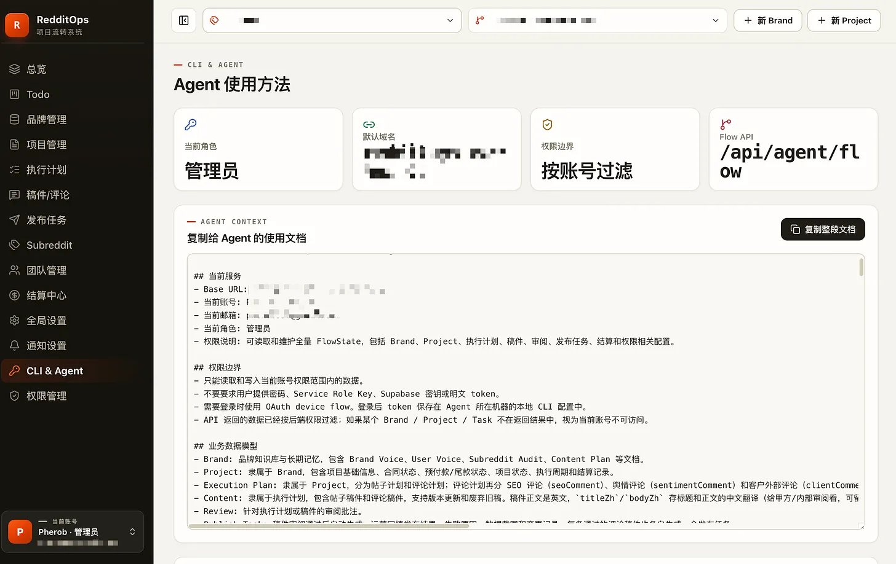

而且之前的数据仅仅沉淀到本地工作区里

但通过把数据转移沉淀到SaaS上

我们结构化出了大量的数据

比如Subreddit的删帖率，大部分的删帖原因

以及AI稿件和人工对比的Diff，这些数据将有助于AI获得进一步的知识，从而不断提升

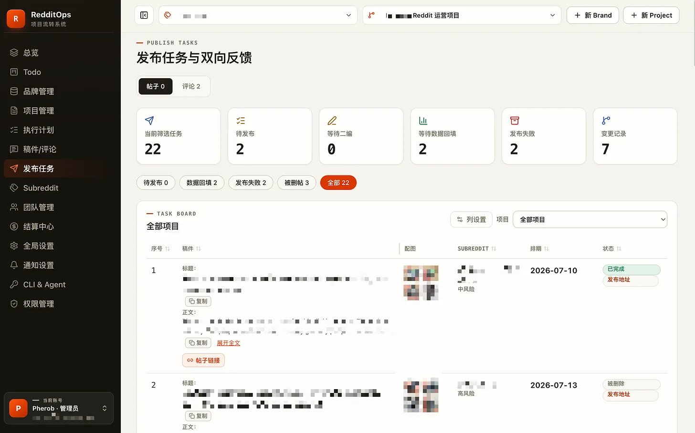

接着就可以利用数据能力，持续优化推进改造这套Reddit Marketing Saa

## AI GTM的系统化卡点

以上是我在Reddit Marketing上探索到的一些经验

在做AI GTM的过程里，我遇到过非常多的问题

总结起来，我觉得有几个比较宝贵的经验值得分享

1. 从**做一个Agency开始**，Dogfood。

这意味着你可以围绕一个真实的业务进行实践。当然，大部分AI GTM产品，早期会想着GTM自己。但其实和甲方还是有一些不一样的。接触甲方，会有不一样的信息输入。因为产品最终要服务的人群，除了甲方，也有大量的Agency。

2. 先半人工，再做自动化

半人工的流程有2步，第一步是固化SOP，验证策略，第二步是验证Loop，第三步才是自动化

3. 不要妄想100% AI，而是80%AI + 20%人类

哪怕你希望100% AI，也一定有20%的人类身份，大部分的社媒平台都在对抗AI，账号也需要人类身份

4. 内容上，一定要构建行业语料不同的产品，需要不同的语料库，行业黑化，专有名词，梗词，行业文化，这些才能区别开AI与人类

5. AI的Common sense不够，要依赖公开检索和知识库

很常见的问题是，AI通用知识不足，对于一些产品的定价，或者人类才知道的事情，它是不清楚的。比如AI能写出，我一周割草5次……或者，花$500美金雇佣了一个工人帮我除草……这些和生活相关的最基本的信息，往往最容易出幻觉。

6. 思考如何构建反馈环路，并设置好优质的结构化数据

当AI可以GTM的时候，反馈是最关键的，其次就是如何构建出结构化的数据，让AI能快速捕获，减少幻觉，并能通过这些数据持续增强AI能力。

以上，是关于Reddit marketing的AI GTM实践。

如果你有任何想法，欢迎留言评论。

订阅Yangyi的实战手记，不错过实战经验👉🏻[https://yangyixxxx.substack.com](https://yangyixxxx.substack.com/)
