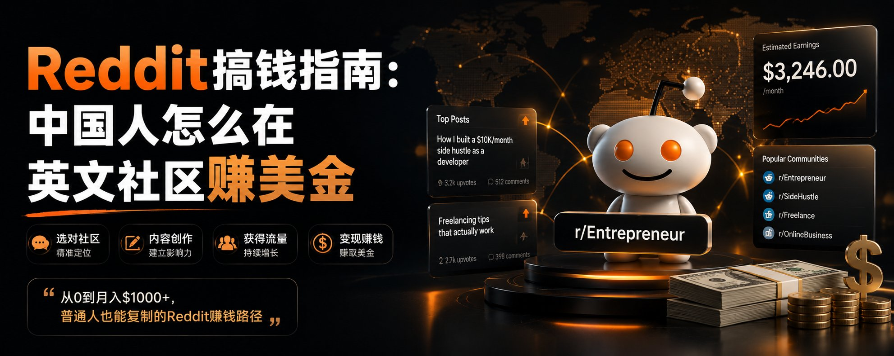
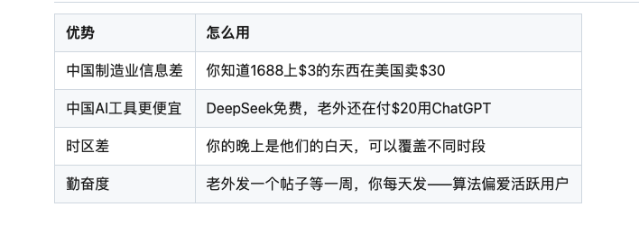
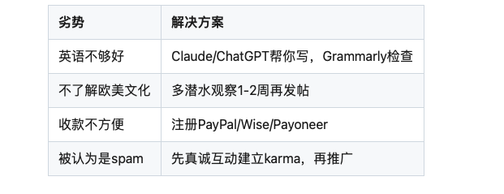

# Reddit搞钱指南：中国人怎么在英文社区赚美金

@better_christal · [X 原文](https://x.com/better_christal/article/2056218181149282775)

前几天有篇帖子火了——“Reddit搞钱指南（详细版）”。

底下的评论全是"真的假的？"“怎么操作？”“中国用户能做吗？”

答案：能。而且因为信息差，中国用户在Reddit赚钱的机会比你想象的大。

有人回复得更直接：“这个Reddit项目有人月入2万刀。”

### Reddit为什么能赚钱？

**核心逻辑：Reddit是全球第六大网站，月活20亿+，但中国人几乎不在这里做生意。**

这意味着：

1. 竞争极小（没有中国式内卷）
2. 用户付费意愿强（欧美用户习惯为价值付费）
3. 美金结算（汇率红利）

### 5种在Reddit赚美金的方式

方式一：联盟营销（Affiliate Marketing）

在相关subreddit回答问题→推荐产品→附联盟链接→有人购买你拿佣金。

**适合推广的品类：**

- AI工具（佣金$5-$50/单）
- 梯子/软件（佣金$30-$100/单）
- 在线课程（佣金20-50%）
- SaaS产品（佣金15-30%）

**操作要点：**

- 先在subreddit建立声望（真诚回答问题、分享经验）
- 不要直接贴链接（会被删）
- 自然地在回答中提到产品，链接放在个人资料或博客里

**月入范围：** $500-$5000

方式二：卖数字产品

在r/Entrepreneur、r/SideProject、r/Design等板块分享你的产品。

**能卖什么：**

- Notion/Figma模板
- AI提示词包
- 电子书/指南
- 在线课程
- SaaS工具

**月入范围：** $300-$10000

方式三：提供服务（Freelance）

在r/forhire、r/slavelabour等板块接单。

**中国用户有优势的服务：**

- AI辅助写作/编辑
- 网站开发
- 数据分析
- 设计（AI辅助）
- 翻译（中英）

**定价：** 比美国freelancer便宜30-50%，但比在国内接单贵3-5倍。

**月入范围：** $1000-$5000

方式四：做内容+引流

在Reddit建立专业形象→引流到你的newsletter/YouTube/产品。

**操作：**

- 选一个垂直subreddit（比如r/Productivity）
- 每周发2-3个有价值的帖子/回答
- 个人资料里放你的newsletter或产品链接
- 有人觉得你厉害→点进资料→订阅/购买

**月入范围：** 间接收入$1000-$10000

方式五：用AI做Reddit营销工具

帮别人在Reddit做推广——这本身就是一门生意。

**案例：** ReddifyAI这类工具，帮品牌在Reddit做智能化社区营销。创始人4个月做到$30K MRR。

**月入范围：** 如果做工具$5000-$50000

### 中国用户在Reddit的特殊优势

### 中国用户在Reddit的劣势（和解决方案）

### 起步策略（2周计划）

**第1周（潜水）：**

- 注册Reddit账号
- 关注10个跟你想赚钱方向相关的subreddit
- 每天花20分钟看帖子、了解社区文化和规则
- 回答3-5个问题（建立karma值）

**第2周（出击）：**

- 发一篇有价值的长帖子（教程/经验分享）
- 在回答中自然提到你的产品/服务
- 个人资料完善（头像、简介、链接）
- 开始有人私信你或点击你的链接

### 注意事项

**Reddit社区规则非常严格：**

- 不要直接发广告（会被秒删+封号）
- karma值太低不能发帖（先评论积累）
- 每个subreddit有自己的规则（发帖前必须看）
- 自我推广比例不超过10%（90%是真诚互动）

**核心原则：先给价值，再获回报。**

在Reddit，你越不像在"卖东西"，你的东西卖得越好。

*Reddit是一个"慢热"平台。不像小红书/抖音一条爆了马上有流量。你可能需要2-4周建立信任。但一旦建立起来，它是所有平台中"信任变现"效率最高的——因为Reddit用户对推荐的信任度远高于其他社交平台。*
