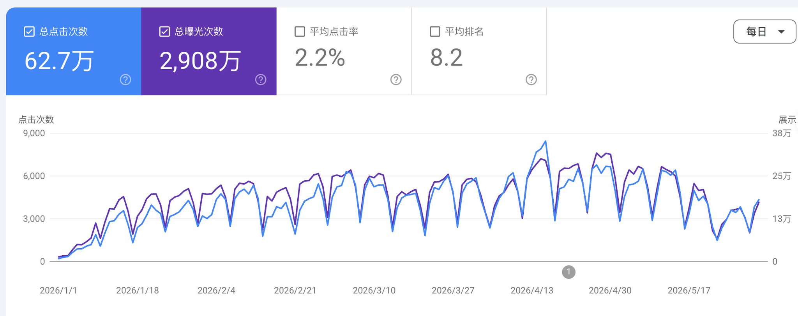
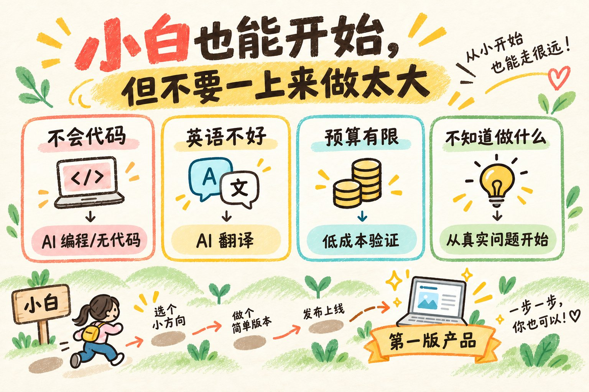
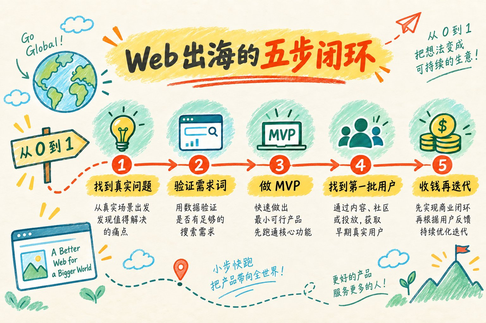
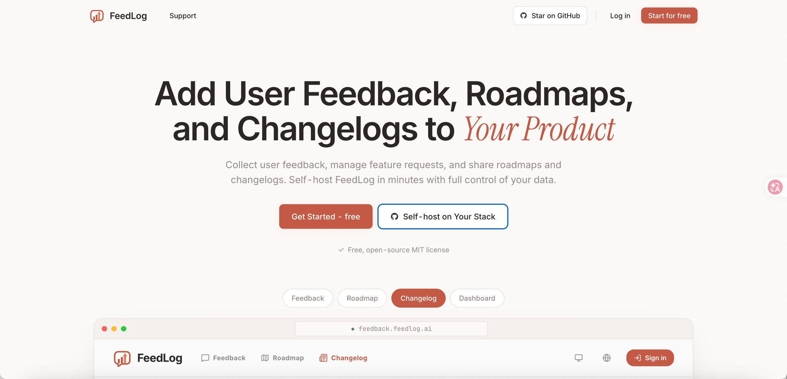
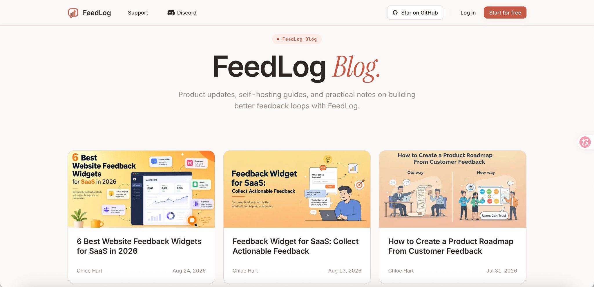

# 万字长文｜从 0 到 1 做 Web 出海保姆级教程，教你赚到第一笔美刀

@momo_peggy · [X 原文](https://x.com/momo_peggy/article/2097276846392111585)

如果你也想做一个面向海外用户的网站，赚到第一笔美刀，却被代码、英语、SEO 这些词劝退了，这篇就是写给你的。

我一直叫夏林果的出海日记，但我还没有认真写过自己的出海业务。我做的事情就是给海外用户做网站和小工具，再通过订阅或者按量付费收钱。除了开发，产品设计、功能、增长、外链、SEO、推广、营销，这些事情我都做过。

做了快2年，最好的产品一个月有几十万人访问，也稳定开始收钱，做到过月入千刀的级别。

我说这些不是为了证明这件事很轻松，而是想告诉你：它没有看上去那么遥远。整条路可以拆成五步，每一步单独看都能学、能做，你也可以

### 一、Web 出海到底是什么

一句话：**给海外用户做一个网站或小工具，解决一个具体问题，再从中收钱。**

它其实就四件事：

- **找需求**：找到海外用户正在遇到、也愿意解决的问题
- **做产品**：把这个问题做成一个简单好用的工具
- **找用户**：让真正需要它的人发现你、开始使用
- **收钱**：用订阅、按量付费或一次性购买，把产品变成收入

比如，有人想给照片去水印，他可能会搜索 image watermark remover，然后打开几个网站试用。哪个工具更快、更好用、免费额度更合适，他就更可能留下来，甚至订阅。

他不关心你用了多复杂的技术。他只关心一件事：**我现在的问题，你能不能帮我解决。**

所以 Web 出海不是“做个网站放在那里”，而是：**需求、产品、用户和收款，这四件事连起来。**

### 二、小白到底能不能做

如果你现在完全不会代码，我可以先把结论告诉你：**能做。**

因为做第一个 Web 产品，不需要你一开始就掌握所有东西。

- 不会代码，可以用 AI 编程工具、无代码平台或外包，先把第一版做出来
- 英语不好，可以用翻译工具和 AI 辅助，先把用户问题和产品页面说清楚
- 没有很多钱，可以先用域名、托管和第三方服务的低成本方案验证
- 不知道做什么，可以先从自己遇到的问题、竞品差评和用户搜索里找方向

小白起步时，最需要自己做好的只有三件事：

1. **找到一个真实的问题**
2. **做出一个能解决问题的第一版**
3. **找到几个真实用户，让他们用起来**

这三件事，AI 可以帮你做一部分，但不能替你判断。

所以小白不是不能做，而是不要一上来做太大的东西。先做一个小工具，解决一个小问题，边做边补能力。这件事最难的也不是某个技术，而是你能不能接受：前几个月可能没有多少人看见你。只要你愿意早点验证、早点调整，就已经超过了很多只停留在想法阶段的人。

### 三、从 0 到 1，具体要走哪五步

先把整条路线记住：

1. 找到一个真实的问题
2. 验证这个需求词值得做
3. 做出一个最小可用版本
4. 找到第一批用户
5. 收钱、迭代、继续增长

### 第一步：找到一个真实的需求

不要先问“我能做什么产品”，先问“谁遇到了什么麻烦”。

**先去这些地方找需求。**

- **自己的卡点**：你每天遇到、但一直没有很好解决的问题
- **身边人的抱怨**：朋友、同事、社群里反复出现的吐槽
- **竞品差评**：用户为什么不满意，哪一步最麻烦
- **导航站和工具榜单**：哪些工具已经有人在用，哪些方向已经被验证
- **社媒和热门话题**：大家最近开始关注什么，哪些需求正在变多

你还要继续问三件事：

1. 这个问题是不是经常发生？
2. 它是不是影响结果，或者让用户明显觉得麻烦？
3. 用户愿不愿意换一个产品，甚至花钱解决它？

**再把需求落到关键词上。**接下来就要做关键词研究。

什么叫关键词研究？简单说，就是把“用户有一个问题”，翻译成“用户会在搜索引擎里输入什么词”。因为用户不会直接告诉你“我需要一个去水印产品”，他只会搜索 image watermark remover。你只有知道他在搜什么，才知道这个需求有没有被表达出来，也才知道你的产品以后应该围绕什么词去做页面和内容。

举个例子。你想到的是“做一个去水印工具”，那就先拿 watermark remover 去搜，看搜索框会自动联想出什么，再看搜索结果页底部的相关搜索。接着把 image watermark remover、remove watermark from photo、ai watermark remover 这些词放进关键词工具里，看它们的搜索数据。不同的词，背后的需求可能不一样：有人想找在线工具，有人想找教程，有人已经在比较不同产品。你先把这些词找出来，再判断哪个词最接近你要做的产品。

看关键词时，可以参考三个数：

- **搜索量**：有多少人在搜，用来估算需求规模
- **CPC**：广告主愿意为相关流量付多少钱，用来参考商业价值
- **KD**：第三方工具估算的竞争程度，用来比较不同关键词的难度

一句话结论就是：**我们优先找搜索量相对高、有商业价值、竞争程度又相对小的词。**这种词更值得继续研究，但三个数只是筛选工具，不是最后答案。你还要看搜索的人到底是想找资料，还是想直接用工具；现有产品解决得好不好；用户为什么要换成你的产品；以及你能不能做出第一版，并找到第一批用户。

第一次选不准很正常，但不要同时做二三十个站来逃避判断。先选一个方向，把它验证清楚。

### 第二步：验证这个需求词值得做

有了一个看起来不错的需求词，不要马上写代码。下一步要做的是竞品调研，确认这个词背后的需求有没有机会做、有没有机会挣到钱。

**先做产品层面的竞品调研。**

先把这个词放到搜索引擎里搜一遍，把前几页的产品都打开。重点看四件事：

- **功能**：它到底帮用户完成了什么
- **体验**：第一次打开能不能看懂，用起来顺不顺
- **收费**：免费版给什么，付费版收多少，怎么引导升级
- **缺口**：用户还在抱怨什么，哪些需求没有被照顾到

**再看这个赛道的 SEO 竞争强度。**

可以用 SEO 工具查一下前几页竞品的域名年龄、第三方工具估算的网站权重、引荐域名数量和外链质量。引荐域名，简单说就是有多少个不同的网站链接到它。

这些数据不是 Google 官方排名公式，也不能直接告诉你能不能排上去，但它们能帮你判断：现在排在前面的，是不是一批经营很多年的强网站；这个词是不是已经被高权重网站牢牢占住；有没有一些新站、弱站也能排进前面。

如果前几页全部是老域名、高权重、引站域名很多的网站，你当然不是绝对不能做，但 SEO 获客的难度和周期都会更高。如果前几页里有不少新站，或者很多产品功能一般、体验很差，那就说明这个词可能还有切入口。

不要只看官网宣传，还要去社媒、评论区、社区和产品目录里找真实反馈。如果竞品做得很好，用户也很满意，你就需要找到非常具体的切入口，否则换方向可能更划算。如果竞品很多，但用户反复骂同一个问题，这就是机会线索，你可以围绕这个问题做得更好。还有一种情况是搜索量看起来不错，但用户没有明确需求，这时也别急着做，继续找真实反馈。

**最后判断有没有挣钱的机会。**

接下来要判断的，不只是“我能不能做出来”，而是“我有没有挣钱的机会”。至少要看四件事：

- 这个词背后的用户是不是有明确的付费意图
- 竞品是不是已经在收费，以及用户愿意为哪部分价值付费
- 你有没有一个用户能感知到的差异化
- 你能不能用自己的能力和成本，把用户带来并服务好

还要问自己一个问题：**我有没有可能做得比现有产品更好？**

不一定要所有功能都更强，但至少要在一个地方明显更好，比如更快、更简单、更便宜、更适合某一类人，或者把用户下一步也顺手解决掉。

验证不一定要做完整产品。你可以先做一个简单落地页、一个可点击原型、一个收集需求的表单，甚至先用人工服务完成这件事，再邀请几个目标用户试试。

只要有人愿意试用、留下邮箱、反复回来、主动反馈，或者愿意付费，就说明你拿到了真实信号。

没有任何真实用户信号之前，不要急着投入几周做完整产品。

### 第三步：做出最小可用版本，也就是 MVP

验证通过后，再动手做产品。

这里说的 MVP，是 Minimum Viable Product 的缩写，中文一般叫“最小可用产品”。你不用把它理解得很复杂，它的意思就是：先做一个最小的版本，只解决用户最核心的那一个问题，让用户真的能用起来。

在开始做之前，可以先让ai帮你把需求设计、用户流程和功能边界梳理出来：这一版必须做什么，哪些功能可以以后再做，用户从打开页面到拿到结果要经过几步。这样做的好处是先把范围定住，避免做到一半不断加功能。

一个小工具第一次打开，至少要做到：

- **三秒能看懂**：用户知道你是干什么的
- **不用教就会用**：不用看长教程也能开始
- **第一次就拿到结果**：用户能完成一次有价值的功能完整体验
- **反馈入口清楚**：出了问题知道去哪找你

**搭站怎么选**

搭站大致有三条路，按你自己的情况选就行。

- **会写代码**：直接用自己熟悉的技术栈，比如 Next.js 做前端和服务端，再用 Vercel 或 Cloudflare Pages 部署。数据库、登录和文件存储可以先用现成服务，不要一开始自己搭一整套基础设施。
- **不会写代码**：用 AI 编程工具生成第一版，或者用 Bubble、Softr、Glide 这类无代码平台。它们适合做表单、后台、目录、简单 SaaS 和工作流类产品。
- **只想快速验证**：先别做完整产品，用一个落地页加表单收集需求，甚至先人工帮用户完成服务。落地页可以用现成模板，表单可以用 Tally 这类工具，先确认有人愿意用，再决定要不要正式开发。

第一版的目标不是架构漂亮，而是让真实用户完成一次任务。能用、能收反馈，比技术选型看起来高级重要得多。

**落地页怎么搭**

- **首屏**：一句话说清楚你解决什么问题，再放一个明显的行动按钮
- **功能和好处**：不要只列参数，要说明用户能得到什么
- **使用步骤**：最好三步以内讲清楚怎么用
- **FAQ**：回答用户最容易犹豫的问题
- **免费和付费**：清楚说明两个版本的区别

**上线前检查什么**

上线前还有一组基础工作，最好按清单走一遍：

- **域名**：选一个好记、和产品相关的域名，先确认没有明显的商标冲突。.com 不是必须，但对海外用户来说通常更容易理解和信任。
- **部署**：把代码部署到 Vercel、Cloudflare Pages 这类托管平台，绑定自己的域名，确认 HTTPS 正常，环境变量没有泄露，生产环境的数据库和 API 都能正常连接。
- **移动端**：至少用一台手机完整走一遍流程，重点看按钮能不能点、输入框会不会被键盘挡住、图片上传是否正常、支付页面能不能打开。
- **页面速度**：压缩图片，减少不必要的脚本，检查首屏加载和核心功能响应。可以用 Lighthouse 或 PageSpeed Insights 看最明显的问题。
- **sitemap 和 robots.txt**：确保网站能生成 sitemap.xml，robots.txt 没有误把全站屏蔽，上线后再把 sitemap 提交到 Google Search Console 和 Bing Webmaster Tools。

这些事情不是为了把网站打磨到完美，而是避免用户第一次使用就遇到打不开、加载慢、手机不能用这类低级问题，而且这些问题做不好，谷歌也不会给你好的排名

**收款怎么接**

收款也可以提前考虑，但要分清“接入支付”和“设计商业模式”不是一回事。Stripe 更灵活，适合自己控制订阅、账单和支付流程；Paddle、Lemon Squeezy 这类 Merchant of Record 服务，中文一般叫记录商户，会替你处理一部分支付和交易税务，适合不想一开始处理太多跨境支付杂事的人。具体能不能开通、需要什么主体和材料，要看你的地区和业务情况。

不管选哪种方案，上线前至少自己测试一遍：能不能付款、订阅续费是否正常、取消订阅后会发生什么、退款怎么处理、付款成功后用户能不能立刻拿到产品。支付链路出问题，前面所有流量都会浪费掉。

**用户反馈怎么接**

用户反馈也要从第一天就留入口，因为第一批用户一定会遇到问题，也一定会提出你没想到的需求。

我自己正在做的 FeedLog，主要解决的就是这件事。它一边可以用 AI 智能客服帮你回答用户问题，能自动处理的就先自动处理，复杂的问题再交给你；另一边也有反馈板、产品路线图和更新日志，把用户提的需求、你准备做什么、已经更新了什么，都放在一个地方。这样你不用每天到处翻消息，也能让用户知道自己的反馈有没有被看见。这是个开源的项目，感兴趣的你可以看看：[https://github.com/linkcraftstudio/feedlog](https://github.com/linkcraftstudio/feedlog)

### 第四步：找到第一批用户

产品上线以后，不会自动有人来。你要主动把产品送到可能需要它的人面前。

**先做收录和数据设置**

- **Google Search Console**：验证网站，提交 sitemap，查看哪些页面被抓取、哪些词带来曝光，必要时请求重新抓取
- **Bing Webmaster Tools**：提交网站和 sitemap，多一个搜索渠道
- **Google Analytics**：看用户从哪里来、访问了哪些页面、有没有完成核心任务

它们的作用是帮助你发现问题和积累数据，不是提交了以后就保证排名。网站能不能被搜到，还要看页面内容、产品质量和外部信号。

**再做内容SEO**

内容 SEO 不是把关键词重复塞进文章，而是围绕用户已经在搜索的问题，写出真正能帮他解决问题的页面。

新手可以先写三类内容：

- **How to 类**：教用户完成一个具体任务，比如如何压缩图片、如何把音频转成文字
- **对比类**：帮助用户比较不同工具，适合已经开始考虑购买的人
- **案例类**：展示真实测试、使用过程、数据和限制，让内容比普通工具介绍更有价值

写之前先看搜索结果里已经有什么，再决定自己能补什么。不要为了凑文章数量，批量生成和别人差不多的内容。每一篇文章最好都能自然地把用户带到你的工具，但不能为了带流量而牺牲内容本身。

**再做外链**

外链就是别的网站、博客、社区或产品目录提到你，并链接到你的产品。它既能带来直接访问，也可能帮助搜索引擎理解你的网站，但不是链接越多越好。

新手可以分两档做。

免费档先做这些：

- 提交免费的产品导航站和工具目录
- 在自己的博客、开发日志和案例文章里自然链接产品
- 在相关社媒社区建立产品主页，持续发布产品更新和使用案例
- 和相关作者、开发者或社区合作，让对方在真正相关的内容里介绍你

有一点预算之后，可以考虑付费导航站、产品发布活动，或者采购相关行业的客座博客。但不要相信“发几篇文章就保证排名”的承诺，优先选择和你的产品主题真正相关、网站本身有真实读者的平台。付费内容和赞助内容也要按平台规则标注，不能把评论区刷链接、低质量目录和批量客座文章当成排名捷径。

**最后做社媒分发**

社媒不是把同一段广告复制到所有平台。不同平台的用户习惯不一样，你要先选一两个最适合自己的。

- **X**：适合记录开发过程、公开复盘、分享产品想法和数据。你可以把自己定位成“正在做产品的人”，让用户跟着你的过程认识产品，而不是每天只发广告。
- **Reddit、Quora**：适合回答具体问题。先在相关版块里提供有用答案，再在确实相关的地方提到产品，不要一注册就到处发链接。
- **Indie Hackers**：适合分享开发过程、收入变化、失败经验和产品决策。这里的人关心你是怎么做的，也更容易理解独立开发者的产品。
- **YouTube、TikTok**：适合演示型产品，直接录屏展示“输入什么、几秒得到什么结果”，比讲一堆功能更有效。
- **Instagram**：更适合视觉类产品，比如图片、视频、设计和模板工具，用前后对比、案例展示和短演示吸引用户。

社媒最适合建立信任、拿到第一批用户，不适合一开始就追求全平台运营。先选一个平台，坚持发布真实过程和用户能看懂的案例。

第一阶段不要追求几十万访问。先找到十个真正会用的人，听清楚他们哪里卡住。

### 第五步：收费、迭代，再慢慢放大

有人使用，只能说明产品可能有价值。有人愿意付费，才说明这个价值可能变成生意。所以商业化不要一上来就拍脑袋定价，而是等真的有人使用后，再认真设计怎么收费。

**先调研怎么收钱**

- **订阅制**：适合持续使用、持续产生价值的工具
- **按量付费**：适合每次使用成本不同的工具，比如处理图片、音频、视频
- **一次性购买**：适合功能明确、使用周期较长的产品

商业化之前，先做一轮竞品调研。看同行怎么收费、免费版给了什么、哪个功能被放在付费版、用户为什么愿意升级。你要知道别人是怎么把用户变成收入的，再决定自己要不要做订阅、按量付费，还是一次性购买。

同时也要算清楚：

- 每个用户大概带来多少成本
- 用户为什么愿意付钱
- 竞品大概怎么收费
- 退款和客服会不会吃掉利润

免费额度可以降低第一次使用的门槛，但不要默认用户用完额度就会自动升级。付费版必须真的帮用户解决更重要的问题。

**再根据数据和反馈迭代**

有没有选择商业化，不影响你做竞品研究。因为产品迭代也需要知己知彼：竞品新增了什么、用户在夸什么、用户还在抱怨什么，你都要持续看。否则你很容易只顾着加自己喜欢的功能，最后却偏离了用户真正需要的东西。

持续迭代时，重点看三类信息：

- **数据**：用户从哪里来，是否完成核心任务，在哪一步离开
- **反馈**：用户反复提出什么问题，哪些反馈值得优先处理
- **竞品**：对方新增了什么，你自己的差异化还在不在

产品更新也要让用户看得见。你可以把重要更新写进更新日志，把准备做的事情放进产品路线图，把用户提出的需求集中在反馈板里。这样用户能感知到自己的意见被看见，也更愿意继续使用和反馈。FeedLog 就是围绕这个闭环来做的：收集用户需求，用反馈板整理，再通过产品路线图和更新日志，把接下来要做什么、已经更新了什么公开出来。产品上线之后，也可以直接在更新日志里发公告，让用户知道这次更新解决了什么问题。

最后你会不断回到前面：发现问题，验证需求，做产品，找用户，收费，再根据反馈继续改。这才是 Web 出海真正的闭环。

### 四、接下来，我会把这五步一篇篇拆开

如果你能读到这里，我最想告诉你的其实是：Web 出海没有你想象中那么难入局。

以前做一个网站，可能要会开发、懂设计、找服务器，还要自己解决一堆技术问题。现在有 AI 编程工具、无代码平台、现成模板和各种成熟服务，一个不会写代码的人，也能先把第一版做出来。

我身边有人靠一个小工具、一个小网站，慢慢做到稳定收美元；我自己的产品，也从一个想法做到了月入千刀。大家都不是一开始什么都会，都是先找到一个小问题，然后边做边学。

别人能走通，至少说明这条路不是只属于技术天才。你当然不一定第一次就选对需求、第一次就赚到钱，但你完全有机会做出自己的第一个产品。现在真正稀缺的，不是代码能力，而是你愿不愿意开始，愿不愿意把一件小事持续做下去。

这篇只是总纲，先把整张地图摆出来。接下来这个系列，我会顺着这五步继续往下拆：

- **怎么找需求**：去哪里发现真实问题，怎么把问题变成需求词
- **怎么做关键词研究**：搜索量、CPC、KD 到底怎么看，怎么判断一个词值不值得做
- **怎么验证机会**：怎么查竞品、看网站权重、找用户反馈，判断自己有没有机会挣到钱
- **怎么做出第一版**：怎么和 AI 梳理需求、控制功能边界，把 MVP 真正做出来
- **怎么让用户找到你**：收录、内容 SEO、外链和社媒分别怎么做
- **怎么开始收费**：定价、支付、数据和产品迭代，怎么慢慢跑成闭环

下一篇，我打算就先从最关键、也最容易走错的第一步开始：一个值得做的需求，到底藏在哪里？
