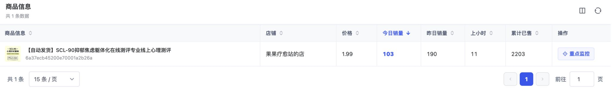
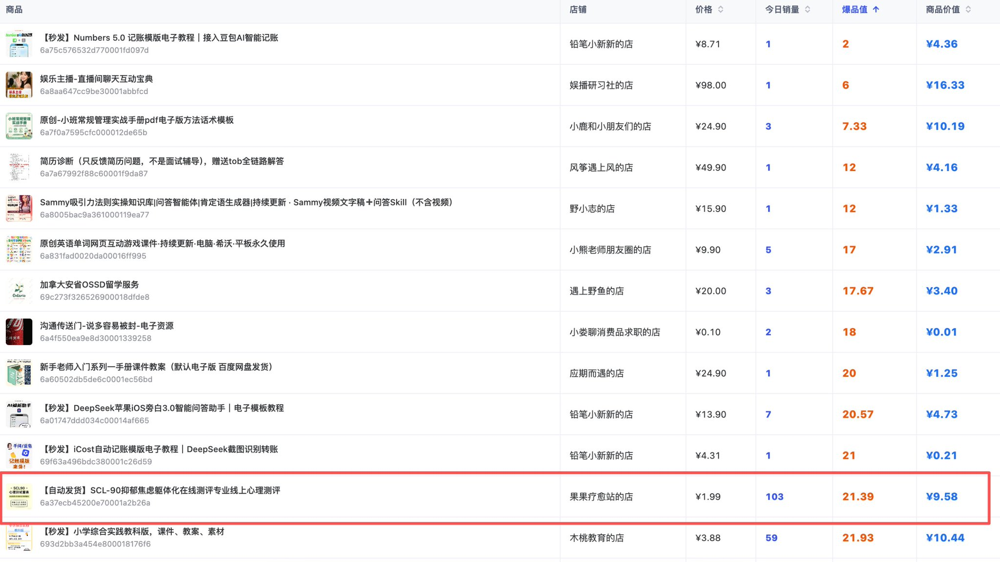
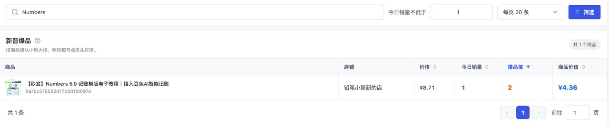
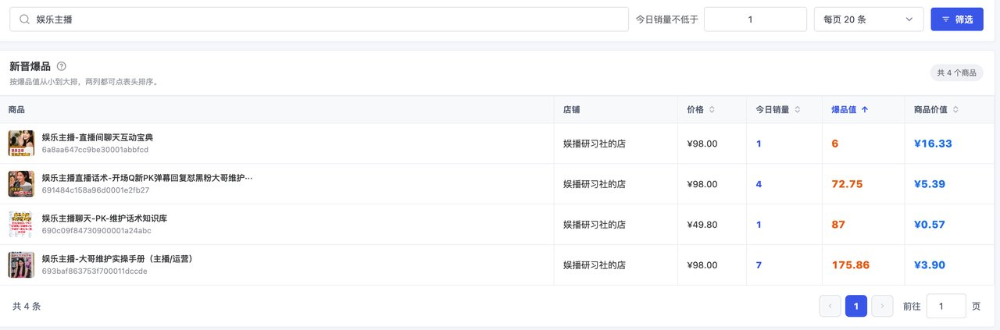

# 小红书虚拟监控软件选品工具以及逻辑（附完整提示词）

@DongQingAi · [X 原文](https://x.com/DongQingAi/article/2095698678766055704)

大家好，我是冬青。

继上一篇发布后，大家的私信问题也很多，评论区很多人都在问同一件事：这个工具到底是怎么做的，能不能分享，能不能直接拿来用？

这几天我一直在想，到底应该直接把软件开源，还是换一种方式分享。

最后我没有选择直接开源。

因为现成的软件只能解决眼前这一个问题。每个人想监控的数据、使用的电脑、判断商品的方式都不一样。即使拿到同一份代码，后面也可能遇到新的需求和新的报错。

AI 时代，授人以鱼不如授人以渔。

所以这一次，我决定把制作“红薯雷达”时整理的完整开发提示词全部放出来。

你可以直接把提示词交给能够编写和运行代码的 AI，让它按照需求创建项目、调试，并尝试打包成 Windows 软件；也可以研究这份提示词是怎样把一个模糊想法拆成数据口径、功能、界面、异常处理和交付要求的，再用同样的方法创造更多天马行空的工具。

不过在放出提示词以前，我还想先把工具背后的选品逻辑讲清楚。否则即使拿到了软件，也只会看到一堆数字，不知道应该怎样判断。

做小红书虚拟产品选品时，我经常遇到两类问题：有人拿着一个“累计已售几万”的链接问我，这个品现在还能不能做；也有人知道应该监控销量，却不知道拿到数据以后怎样判断。

我现在使用的完整链路是：先建立选品库，再把候选商品放进销量监控，接着采集同行笔记、重新创作、快速测试，最后根据结果决定放弃、放大，还是增加关联账号继续拓店。

这篇文章重点讲两个问题：

第一，监控到销量以后，到底应该怎样判断一个商品值不值得做？

第二，这套监控软件到底是怎样做出来的？一个完全不懂代码的人，能不能借助 AI 把它做出来？

**前半部分是我的选品判断方法，后半部分是“红薯雷达”的 完整开发提示词原文。需要提示词的可以直接前往底部查看**

先说结论：

**累计销量大，不等于现在卖得好。真正值得优先研究的，是累计销量还不算高，但最近几天已经明显起势，而且客单价、利润空间和内容可复制性都不错的商品。**

- **一、为什么只看“累计已售”，很容易选错品**

我们平时找竞品，最容易被一个数字吸引：累计已售。

一个商品显示卖了 1 万单、3 万单、5 万单，第一反应往往是：这个需求已经被验证了，这个品一定赚钱，我也要赶紧跟。

这个判断只对了一半。

累计已售只能证明这个链接在某一段历史时间里卖出去过很多份，却不能证明它现在还在卖，更不能证明它是靠当前这个商品卖出来的。

我之前看过一个红包封面的商品。过年时红包封面的需求很旺，利润空间也不错，我手上又有相关资源，所以看到很多人跟的时候，我自己也动过心。

那个链接的累计销量有好几万。单看商品页面，这几乎就是一个标准爆品。

但放进监控以后，看到的却是另一回事：它现在一天可能只出几单、十几单，偶尔才多一点。几万的累计销量，是这个链接很长时间积累出来的，其中还可能包含链接改品前卖出的其他商品。再往前翻评价，也能看到历史评价和现在的红包封面并不完全对应。

这就是只看累计销量最危险的地方。

同样是累计已售 5000 单，可能有三种完全不同的状态：

一种是过去两年慢慢卖到 5000 单，现在每天只有两三单；

一种是最近三个月持续稳定，每天几十单；

还有一种是两周前刚起量，现在每天两三百单。

这三个商品的累计销量一样，机会却完全不同。

如果我的目标是找一个正在上升、可以尽快测试的新品，我显然更关注第三种。

所以，选品不能只看“它卖过多少”，还要看“它最近卖得有多快”。

而要知道“最近卖得有多快”，只看某一个时刻的页面是不够的。你必须把不同时间的累计销量记录下来，再计算相邻时间的增量。

这就是销量监控真正解决的问题。

- **二、销量监控不是抓一个数字，而是记录数字的变化**

“红薯雷达”的工作原理其实很简单。

你把想观察的商品添加进去，让一台可以 24 小时开机的电脑运行监控程序。程序每隔一个小时读取一次商品的公开信息，把商品价格、店铺、累计已售和采集时间存到本地数据库里。

假设某个商品 10:00 的累计已售是 2203，11:00 变成 2214，那么这个小时新增 11 单。

到了第二天零点，用当天结束时的累计销量减去当天开始时的累计销量，就可以得到这一天的销量。

程序记录的核心不是“2214”这个静态数字，而是“2203 到 2214 增加了 11”这个变化。

只要快照连续，就可以继续算出：

- 上一个完整小时卖了多少；

- 今天到目前卖了多少；

- 昨天卖了多少；

- 一天中哪个时间段出单最集中；

- 最近几天是在加速、稳定，还是明显衰退；

- 一个店铺的销量，是靠一个单品撑起来，还是多个商品共同贡献。

这套逻辑并不复杂。它本质上就是一台不会累的记账机器，每个整点替你抄一次数字。

真正困难的地方不在“减法”，而在于怎样保证每次抄到的数字可信。

网络超时不能记成 0；页面没有加载出来不能记成 0；接口返回不完整不能记成 0；商品明确下架和临时请求失败也不能混为一谈。否则只要某一次采集失败，曲线就会突然从 2000 跌到 0，下一次又从 0 涨回 2000，系统会凭空制造出两千单“销量”。

所以一套真正能用的监控工具，至少要处理快照、整点基线、失败重试、下架识别、累计销量回退、高水位、跨日计算和数据迁移。

这些东西我会在后面的完整提示词里全部写清楚。

- **三、我现在重点看的两个数：爆品值和商品价值**

有了今日销量和累计已售以后，我给自己设计了两个很简单的指标。

第一个叫 **爆品值**：

**爆品值 = 累计已售 ÷ 今日销量**

爆品值越小，说明今天销量占累计销量的比例越大，商品越可能是最近才起势的新品。

举个极端例子。

商品 A 累计已售 10000，今天卖了 100 单，爆品值是 100。

商品 B 累计已售 2000，今天同样卖了 100 单，爆品值是 20。

两个商品今天销量一样，但商品 B 今天一天的销量相当于累计销量的 5%，商品 A 只相当于 1%。如果这种速度能够持续，商品 B 更像是一个刚起势的新链接。

爆品值还可以换一种理解：

**今日销量占累计已售的比例 = 1 ÷ 爆品值**

爆品值是 20，意味着今天销量大约相当于累计已售的 5%；爆品值是 100，意味着今天销量只相当于累计已售的 1%。

不过，只看爆品值仍然不够。

如果两个商品的爆品值都是 20，一个客单价 1 元，一个客单价 100 元，它们带来的收入空间显然不同。

所以我又增加了第二个指标，叫 **商品价值**：

**商品价值 = 客单价 × 今日销量 ×（今日销量 ÷ 累计已售）**

把它和爆品值放在一起，还可以得到一个更容易理解的写法：

**商品价值 = 今日模糊销售额 ÷ 爆品值**

因为今日模糊销售额等于客单价乘以今日销量，而“今日销量 ÷ 累计已售”正好等于“1 ÷ 爆品值”。

这个指标同时奖励三件事：

第一，今天销量多；

第二，今天销量占累计销量的比例高，也就是链接比较新；

第三，客单价高。

所以我给自己总结的一句话就是：

爆品值越小越好，商品价值越高越好。

它适合回答“我先看哪一个”，不适合直接回答“这个商品最终能赚多少钱”。

- **四、举例说明一个商品**

拿出来一个商品举例：

*【自动发货】SCL-90 抑郁焦虑躯体化在线测评专业线上心理测评*

- 价格：1.99 元；

- 今日销量：103 单；

- 昨日销量：190 单；

- 上一小时销量：11 单；

- 累计已售：2203 单。

先算爆品值

再算商品价值

再看昨天的数据。

昨天卖了 190 单，按当前 1.99 元的价格做一个最简单的试算：

1.99 × 190 = **378.10** 元。

这意味着它昨天的模糊销售额接近 400 元。虚拟产品通常没有实物库存和快递成本，边际交付成本比较低，所以这种销量有不错的利润想象空间。

**我为什么会关注这个品？**

因为它的累计销量只有 2000 多，单日却已经能卖到接近 200 单。简单粗暴地按 200 单一天估算，2000 单只相当于十天左右的销量。真实起量过程当然不可能每天完全一样，但至少可以判断：这个链接最近的势头很猛，不是一个靠几年时间慢慢堆出来的老链接。

累计 2203 单，按 1.99 元粗算，对应约 4384 元的历史模糊销售额。单个商品的金额不算夸张，但它已经完成了一个更重要的验证：确实有人愿意为这类即时测评产品付费，而且当前仍然在连续出单。

对选品来说，这种“正在发生”的证据，比一个累计几万、现在每天只出几单的旧链接更有用。而且我监控了还有各种各样的此类链接，完全可以做一个店铺垂直去做这种品类

- **五、爆品值很小，也可能只是噪声**

这个公式很直观，但不能机械使用。

我还看到一个 Numbers 记账模板，价格 8.71 元，今日销量只有 1 单，爆品值却只有 2，商品价值是 4.36。

爆品值 2 看起来非常新，但它只有 1 单。累计已售从 1 变成 2，也会产生一个非常漂亮的比例。这个结果可能代表新品刚开第一单，也可能只是随机成交，证据强度远远不够。

另一个“娱乐主播直播间聊天互动宝典”，价格 98 元，今日销量也是 1 单，爆品值 6，商品价值却有 16.33。客单价把商品价值抬高了，但一天 1 单仍然无法证明它已经稳定起量

所以我不会因为某一天爆品值小，就立刻做产品。我至少还要看三个东西：

第一，看绝对销量。一天 1 单和一天 100 单，即使爆品值一样，证据强度也完全不同。

第二，看连续性。连续三天、七天都在增长，比某一天突然出几单可靠得多。

第三，看监控是否覆盖了完整的一天。如果程序下午才开始运行，所谓“今日销量”可能只是下午以后的增量，和一个拥有零点基线的完整自然日不能直接比较。

对低销量新品，我更愿意先观察，不急着下结论；对日销几十、上百，而且连续几天保持的新品，才会真正提高优先级。

- **六、商品价值高，也不等于你就应该照着做**

我把新晋爆品按商品价值从高到低排序时，排在前面的几个商品很有意思。

一个“素描塑造系统课”，价格 549 元，今日销量 59，爆品值 105.68，商品价值 306.51。

一个“人教版 7—9 年级课本详解笔记”，价格 69.90 元，今日销量 94，爆品值 40.84，商品价值 160.88。

还有一个 635 元的“艺术美学体验”商品，今日销量只有 2 单，爆品值 27.5，商品价值却达到 46.18。

这些商品说明，商品价值确实能把“低价跑量”和“高价少量”放到同一个优先级框架里比较。但它仍然只是第一轮筛选。

635 元的商品卖 2 单，算出来的值很高，不代表我就能卖。课程类的商品可能需要录制，出单可能需要更多的人工客服来逼单

549 元的绘画系统课商品价值最高，但爆品值超过 100，说明它相对更成熟。但是需要一定的专业能力

所以最终决策一定要把数据和人的能力放在一起。

- **七、我会用四个象限给商品排优先级**

如果只用爆品值和商品价值做第一轮筛选，可以把商品简单分成四类。

**1. 爆品值小，商品价值高**

这是我最优先研究的一类。

它通常意味着链接相对新、近期销量强、客单价或销售效率也不错。

但“最优先研究”不等于“直接复制”。我还会继续核对产品内容、评价时间、店铺历史、笔记形式、售后难度和自己的生产能力。

**2. 爆品值小，商品价值低**

这类商品可能刚刚起势，但客单价太低，或者绝对销量还太少。

它适合继续观察。有些商品可以把低价款当作入口，再通过组合包、定制服务或升级版提高客单价；有些则是看起来热闹，实际上没有足够利润空间。

**3. 爆品值大，商品价值高**

这类商品通常已经比较成熟，但现在仍然能产生不错的销售额。

它的价值更多是学习成熟模型：用户为什么愿意买、产品如何包装、内容怎样建立信任、店铺还有哪些关联商品。直接跟进时，要考虑竞争是否已经充分，以及自己能不能做出明显差异。

**4. 爆品值大，商品价值低**

这类商品的累计销量可能很好看，但当前动销弱、客单价也低。除非它与我的资源高度匹配，或者能作为店铺里的配套品，否则优先级一般最低。

这四类商品不是永久身份。

一个商品今天可能在第一类，七天后就可能因为销量衰退进入第三类。监控的意义，就是让分类随着真实数据变化，而不是凭第一次看到它时的印象一直不变。

- **八、两个指标之后，我还会做四层人工判断**

数据可以帮我缩小范围，却不能替我完成最后决策。

我现在大致会继续看四层。

**第一层：我能不能做出真正可交付的产品**

看到销量只是看到结果，做产品还要看能力。

一份电子资料可能需要录制，需要完整的体系，制作过于复杂，投入的时间成本以及金钱成本会更大，那么可能会不值得去做。

**第二层：有没有优化空间**

跟品不是复制。

我会看竞品差评、评论区追问和商品描述里没有解决的问题：能不能把目录做得更清楚，能不能增加可编辑版本，能不能针对一个更具体的人群重做，能不能把资料升级成小程序、网页工具或定制服务。竞品如果只有10万字，我们能不能做一份15万字的

真正的机会经常藏在“已经有人买，但现有产品还不好用”的地方。

**第三层：价格和利润结构是否合理**

低价不是原罪，高价也不自动等于好生意。

低价品要看能不能跑量；高价品要看信任成本、转化周期和用户预期是否会显著提高。

我更关心的是单位时间回报。一天卖 100 单但每单都要人工服务十分钟，可能比一天卖 20 单、全自动交付更累。

**第四层：数据是不是季节性或一次性波动**

开学季资料、考试资料、节日模板、红包封面都有明确时间窗口。

一个商品今天暴涨，可能是长期趋势，也可能只是开学前一周的集中需求。越是季节性强的品，越要看过去几天的曲线、搜索时间和交付准备周期。等你做完产品，窗口已经过去，数据再漂亮也没有用。

- **九、从“发现商品”到“决定开做”，我的实际流程**

我的候选商品不是只从一个地方来。

我会从小红书日常刷到的商品、同行店铺、搜索联想、评论区需求、淘宝商品和项目社区的实战分享里不断记录关键词。看到一个商品以后，还会进入店铺查看关联商品，再从关联商品继续扩展关键词。

这些线索先进入选品库，不会立刻进入生产。

接下来，我会做一轮人工筛选：小红书上有没有对应人群，有没有真实竞品，商品形态能不能交付，我有没有能力做出差异。

通过这轮筛选的商品，再添加到销量监控里。

监控不是越多越好。数量太多会增加采集压力，也会让我陷入“看了很多数据，却没有做任何产品”的假忙碌。我更愿意维护一个能持续观察、定期淘汰的候选池。

通常我会先看 3 到 7 天。

如果爆品值持续较小、商品价值较高、每天销量也有足够绝对量，我就把它提到第一梯队，开始拆产品和笔记。

如果数据忽高忽低，就继续观察。

如果累计销量很高、当前几乎不动，或者确认是老链接改品，就降低优先级。

进入第一梯队以后，我会采集同行已经跑出来的内容，但不是逐字仿写。我会分析选题、封面、结构、用户问题和成交场景，再结合自己的资料重新创作。

然后用少量笔记快速测试。

测试有数据，就继续优化产品、增加内容、扩大账号；测试没有数据，就检查是选品错、内容错、封面错，还是账号状态问题。确认方向不成立，就及时停掉。

完整链路可以概括成：

\> 收集线索 → 建立选品库 → 人工初筛 → 销量监控 → 数据分层 → 拆解竞品 → 重新创作 → 小规模测试 → 放弃或放大。

AI 可以参与其中很多环节，但决定“什么值得做”的人仍然是我。

- **十、怎样看待“经验”和“公式”的关系**

说实话，我现在判断一个品，大多数时候仍然离不开经验。

因为真正的经营决策里，有很多东西无法被两个公式完全表达：用户信任、内容审美、产品质量、竞争强度、账号基础、执行速度、交付难度，以及我自己是否熟悉这个人群。

但经验有一个缺点：很难说清楚

爆品值和商品价值的作用，就是先给经验加一层可重复的筛选。

它们不负责替我做决定，只负责让我少错过正在起势的商品，少被历史累计销量欺骗，也少在明显没有动销的老链接上浪费时间。

我现在更愿意把选品看成三种证据的交叉：

第一种是市场证据：有人买，而且最近还在买；

第二种是内容证据：有人发，而且笔记能够持续获得流量；

第三种是能力证据：我能做出合格产品，也能稳定生产内容。

三个条件同时满足，才值得真正投入。

只有市场销量，没有内容入口，商品可能不适合小红书；只有笔记流量，没有成交，可能只是大家爱看却不愿意买；只有自己擅长，没有市场验证，可能会做出一份没人需要的资料。

公式让第一种证据更清楚，人工判断负责把另外两种补齐。

- **十一、这套软件到底是怎样让 AI 做出来的**

很多人看到“销量监控软件”，第一反应是：我不会写代码，这和我没有关系。

实际上，AI 编程已经把“能不能写出来”的门槛降得很低。更难的事情变成了：你能不能把自己的思路讲清楚。

如果你只对 AI 说一句“帮我做一个小红书销量监控软件”，AI 可能会直接告诉你：未经允许，它无法获取小红书数据。即使它愿意继续开发，也可能只给你一个有界面、却没有可靠数据口径的演示品。

所以做这件事，自己还是要先有一个思路。至少要知道商品信息从哪里读取、需要记录哪些字段、多久记录一次、怎样用前后两次累计销量计算增量，以及采集失败、商品下架和跨日时应该怎样处理。

以前我自己使用的是另外一份程序，用的是 MySQL 数据库。那一版主要是给我自己使用，很多规则都没有专门写成别人能直接理解的说明。

不少人问我是怎样实现的，所以我重新写了一版，把自己在实际使用中遇到的问题和解决思路，尽量完整地整理成了现在这份提示词。

这份提示词包含技术栈、商品输入、字段读取、定时采集、异常处理、销量计算、竞品看板、店铺分析、企业微信通知、只读 MCP 服务和 Windows EXE 打包等内容。

这里面的要求，很多都是我遇到问题以后，一项一项补进去的。

例如软件在 09:35 启动，不能把 09:35 当成一个正式整点，而要等到 10:00 再记录正式快照。21:00 的采集如果拖到 22:00 还没有完成，也不能让旧任务一直积压。读取失败不能保存一个假的 0；新读到的累计销量低于历史高水位，也不能凭空制造负销量。

关于这些内容，我已经整理成了一份完整的开发提示词。使用方法很简单，直接 *Ctrl+C、Ctrl+V*，把后面的完整提示词复制给能够编写和运行代码的 AI 就可以了。

我目前整理的是 Windows 版本需求。Mac 用户可以在这份需求的基础上，让 AI 将桌面端和打包方式改造成 macOS 版本。

当然，这份提示词可能仍然有不完美的地方。我也是在使用过程中遇到一个问题，就解决一个问题，不可能提前知道每个人的电脑上会出现什么情况。

它也不一定一次就能生成一套完全可用的软件。你可能需要根据报错自己调试，让 AI 继续修改。如果使用以后对界面、数据库、采集方式或某个功能不满意，也可以直接把你的要求告诉 AI，让它在现有项目上继续改。

我不知道你实际运行时一定会遇到什么问题，但解决方式没有变：把真实现象和完整报错交给 AI，让它定位、修改，再重新运行。不要看到 AI 输出了一堆代码，就默认软件已经做完了。

**AI 编程不是一句话许愿，而是先把思路讲清楚，再在使用中不断修改。**

- **十二、有了完整提示词，可以做到什么**

这份提示词的目标不是让 AI 回答一份产品方案，而是让它创建一套完整项目。

理想交付包括 Python 源码、本地 SQLite 数据库、Windows 图形界面、定时采集、错误重试、企业微信通知、只读 MCP 服务、说明文档、打包脚本、PyInstaller 配置，以及双击运行的单文件 EXE。

最终的使用方式很直接：

第一步，把商品分享口令、短链、完整链接或 24 位商品 ID 加入软件；

第二步，让软件在一台能 24 小时开机的 Windows 电脑上运行；

第三步，程序按自然时间边界，每隔一小时记录一次累计已售和价格；

第四步，用相邻快照计算每小时、今日、昨日和历史销量；

第五步，用爆品值和商品价值给候选商品排序；

第六步，把真正值得研究的商品加入重点监控，再结合店铺和内容做人工判断。

提示词还要求提供只读 MCP 服务。这样做以后，未来可以让支持 MCP 的 AI 直接查询本地数据，回答“今天哪些商品增长最快”“哪些店铺销售额最高”“某个商品最近七天是否加速”等问题。

- **十三、红薯雷达完整开发提示词**

下面是我重新整理后的完整提示词，可以直接复制使用。

[https://github.com/dong-liudong/hongshuleida/blob/main/dq.md](https://github.com/dong-liudong/hongshuleida/blob/main/dq.md)

**十四、最后再说几句**

有人问我：既然已经有数据、有工具，选品是不是就能完全自动化？

我的答案仍然是否定的。

工具能帮我看见变化，公式能帮我排列顺序，AI 能帮我完成大量重复工作，但“这个人群到底需不需要”“我能不能做得比现有产品更好”“这个机会等我做完以后还在不在”，仍然需要经营者自己判断。

我做红薯雷达，不是为了让一个分数替我下注，而是为了把原来模糊的经验变成可以核对的数据。

以前看到累计几万单，我可能会兴奋；现在我会先问：它昨天卖了多少，今天卖了多少，这几天是在涨还是在跌，评价是不是属于现在这个商品。

以前看到一个新品一天卖了 100 单，我只知道它“看起来不错”；现在我能继续算它的爆品值、商品价值，放进同类商品里比较，再决定把有限时间放到哪里。

这就是我目前最认可的 AI 使用方式：不是让 AI 替我思考，而是让 AI 把我的思考做成一套可以反复运行的系统。

如果你已经在做虚拟资料，可以先不要急着把几百个商品全部加进去。先找 10 到 20 个你真正看得懂、也有能力做的商品，连续监控一周。每天看看销量变化，再回到商品页面、店铺、笔记和评论区核对。

你会很快发现，累计销量最大的商品，未必是当前最好的机会；真正值得追踪的，往往是那些总销量还没有夸张到人人都注意，但最近几天已经开始明显加速的商品。

而当你把这些商品持续保存下来，你得到的不只是一张榜单，而是一套越来越懂你自己的选品系统。

这篇文章讲清楚了两件事：怎样用数据判断一个品，以及怎样把监控软件的完整需求交给 AI。

公式可以继续优化，工具也可以继续迭代，但前提永远是先把真实数据记录下来，再谈判断。
