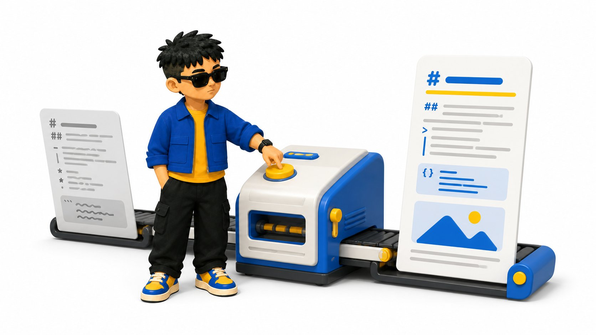
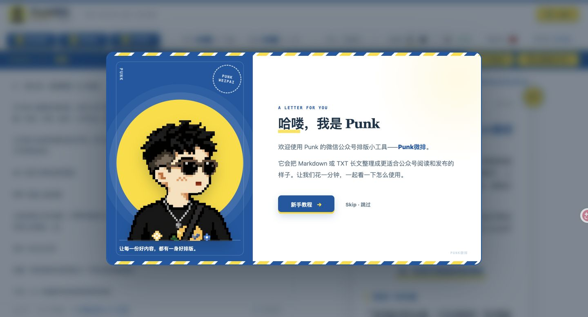
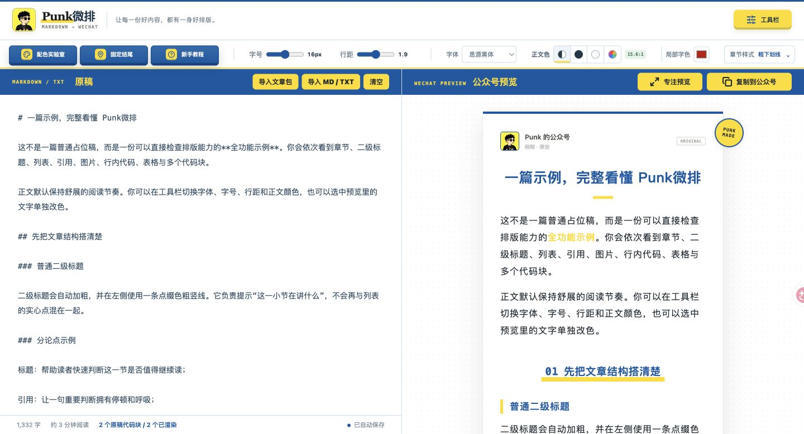
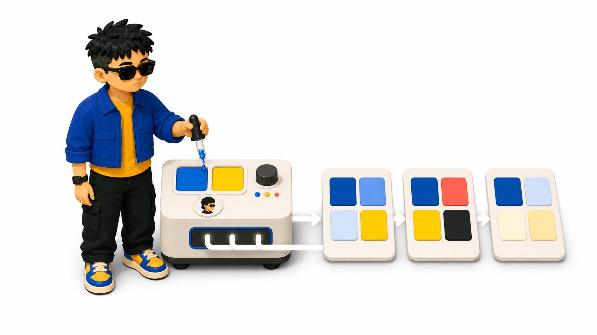
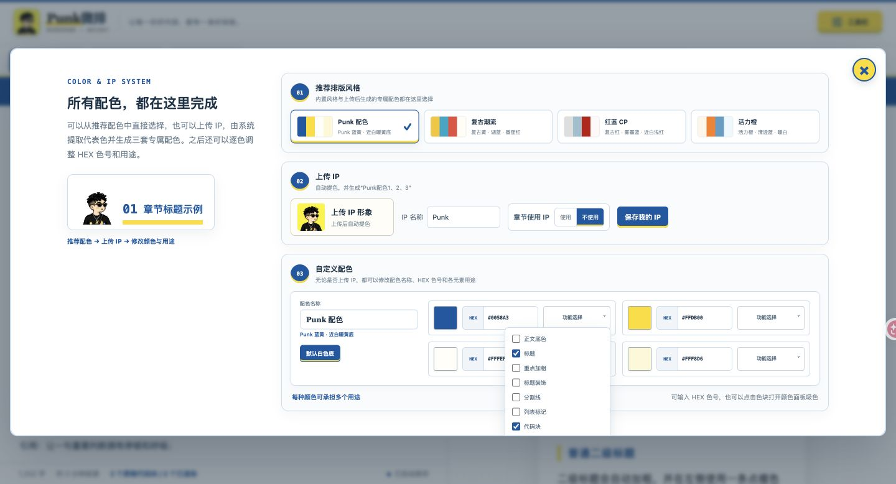
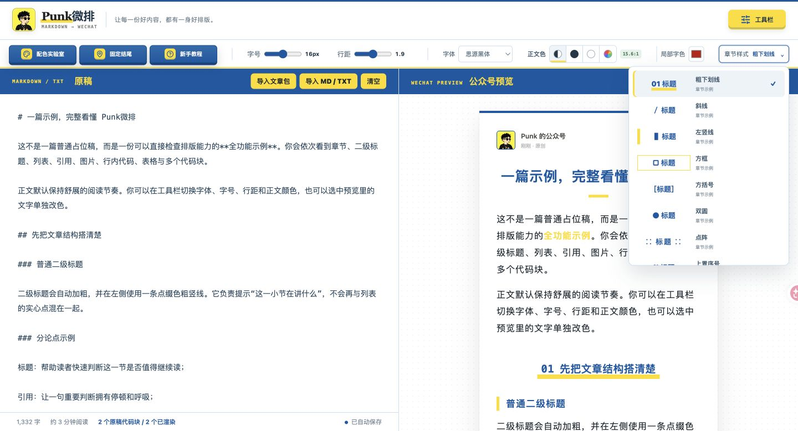
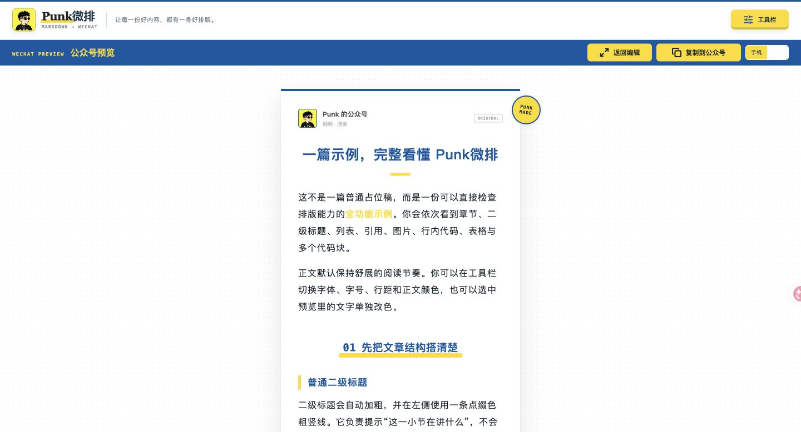
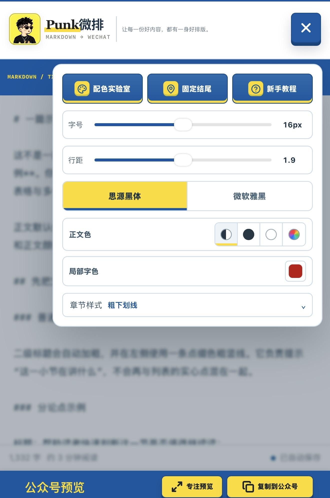
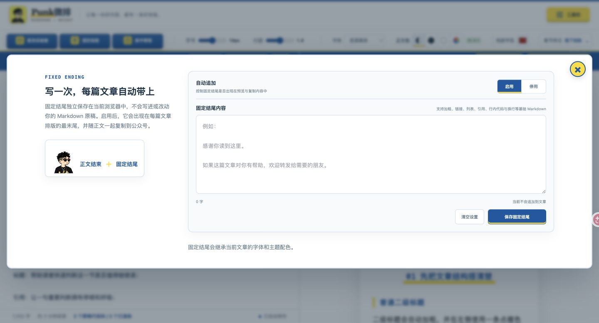

# 我做了一个公众号排版工具：Markdown 写完，一键复制到公众号

@AdrianPunk115 · [X 原文](https://x.com/AdrianPunk115/article/2088543211656753278)

最近把 X 长文导进公众号时，我一直没找到一个用起来衬手的排版工具。前段时间又做了不少和 IP 相关的 Skill，我就想：干脆给自己做一个带点 IP 专属感的公众号排版工具吧。

原本只想解决自己的排版问题，结果做着做着，想法越来越多：配色能不能跟着 IP 走，人物能不能放进章节，Markdown、TXT、代码块和表格能不能一次处理好，手机端能不能直接用。

既然都做到这一步了，那就别只留给自己，也给大家多一个公众号排版的选择。于是，**Punk微排**诞生了。

我想要的效果很直接：把左边略显凌乱的 Markdown 原稿放进去，按一下，右边出来的就是已经整理好标题、引用、代码块和图片节奏的公众号文章。

网站直接打开就能用：

[**https://weipai.iamadrianpunk.com**](https://weipai.iamadrianpunk.com/)

第一次打开网站，会先看到一封由 Punk 发出的“信”。新手教程会依次介绍配色、原稿导入、预览复制和固定结尾；如果已经熟悉流程，也可以直接跳过。

## 一、它先解决一件最烦的事

Punk微排的工作流很直接：左边放 Markdown 或 TXT 原稿，右边实时生成公众号排版。确认效果以后，点击「复制到公众号」，再粘贴进微信公众号网页编辑器。

我花时间处理的，是长文里最容易出问题的这些内容：

- 文章标题、章节标题和二级标题；
- 有序列表、无序列表和多级嵌套列表；
- 引用、分割线、加粗和行内代码；
- 本地图片、表格和多个连续代码块；
- 适合公众号阅读的段落间距、行距和字体。

如果原稿里有清楚的标题层级，它会按照 Markdown 的标题大小判断章节。带序号的二级标题保留序号，没有序号的二级标题使用粗竖线；普通分论点则用随主题色变化的实心点。

代码块会保留 macOS 窗口栏，表格使用三线表。

## 二、整个流程只有三步

### 1. 放入原稿

你可以直接粘贴 Markdown，也可以导入 .md、.txt 或带本地图片的文章包。页面打开时自带一篇全功能示例，标题、引用、列表、图片、表格和代码块都放进去了，先看一遍就知道每种语法最后会长什么样。

### 2. 选择配色和章节样式

工具里预设了 Punk 配色、复古潮流、红蓝 CP 和活力橙。每套方案都包含主题色、点缀色和接近白色的浅色，正文底色默认保持白色。

你也可以上传自己的 IP 形象。系统会从图片中提取代表色，并生成「IP 名称配色1、2、3」三套方案，先选一套最接近自己的，再继续往下调。

配色实验室把这件事做成了一条看得见的流程：从 IP 中提取代表色，再扩展成三套不同倾向的方案，最后留下四个真正能用于排版的颜色角色。

选中一套配色后，还能继续拆开调整。每个色块都能打开「功能选择」，分别决定它用于正文底色、标题、重点加粗、标题装饰、分割线、列表标记、代码块、表格、行内代码文字、行内代码底色或引用；同一种颜色也可以同时承担多个用途。比如我会让蓝色负责标题和代码块，黄色负责加粗、列表与分割线，再把接近白色的浅色留给引用和行内代码背景。

如果没有 IP，也可以直接进入「自定义配色」，修改 HEX 色号、配色名称和颜色用途。这个入口是给愿意自己调色的人留的，不会强迫所有人先上传头像。

章节样式同样可以直接切换。目前放了粗下划线、斜线、左竖线、方框、方括号、双圆、点阵、上置序号和引号 9 种方案，菜单里会先给出实际效果，不用靠名字猜。切换以后整篇文章的章节会一起更新，不需要回到 Markdown 里逐个修改。

如果开启章节 IP，短标题时人物会站在标题横线上；

标题较长、容易换行时，IP 会自动移到标题上方居中，尽量不挤正文。

配色、章节样式和 IP 是否显示彼此独立，可以按自己的内容自由组合。

### 3. 预览，再复制到公众号

写作区和预览区会同步更新。想专心检查文章时，可以打开「专注预览」，只保留公众号成稿；电脑和手机端都能使用。

### 4.手机端适配

手机端也单独做了一套适配，整个流程不需要回到电脑才能完成：

- 排版工具收进右上角的汉堡菜单，避免横向滑动和遮挡正文；
- 文章宽度、内边距和预览方式会跟随手机屏幕自动调整。

所以在手机上也能完成「导入原稿—调整样式—检查预览—复制到公众号」这一整条流程。临时需要改一篇文章时，不用为了排版专门打开电脑。

最后点击「复制到公众号」，把完整富文本粘贴到微信公众号网页编辑器。标题、引用、列表、表格和代码块会一起带过去，不用逐段重新调。

## 三、几个我自己会反复用的细节

第一是**固定结尾**。

作者介绍、账号定位、关注提示这类内容，每篇文章都要写一遍，很容易漏。现在可以提前保存一次并启用固定结尾，以后无论原稿里有没有这段话，排版结果末尾都会自动追加，并用分割线和正文隔开。

固定结尾会继承当前文章的字体和主题配色，内容保存在当前浏览器里。换设备以后需要重新设置一次。

第二是**局部改色**。正文可以选择自动、黑色、白色或自定义颜色，也可以直接选中预览里的某一段文字，只改这部分的字色。写教程时突出命令，写复盘时标出关键数字，会方便很多。

第三是**IP 跟着章节走**。上传人物形象后，可以决定是否让它出现在每个章节标题旁边。颜色方案和 IP 展示是两套独立开关：你可以使用自己的配色但不显示人物，也可以换成推荐配色，同时继续保留人物。

## 四、什么人会用得比较顺

如果你的文章主要在 Word 里完成，而且很少使用代码、表格或 Markdown，这个工具不一定是必需品。

下面几类场景会更合适：

- 经常把 X 长文、笔记或 Markdown 改成公众号文章；
- 用 AI 写初稿，但不想在公众号后台重新排一遍；
- 写 AI 工具教程，文章里有很多代码块和行内代码；
- 同时运营个人号、工作室或多个不同 IP；
- 想让公众号保持稳定视觉，但不想每次从头调格式。

Punk微排现在专注做排版。它不会替你改写文章，也没有接入 AI 生成封面。范围收得很窄，所以打开网页以后，放入原稿、调整样式、复制发布就行。

## 五、你可以先跑这一条最小流程

第一次使用时，不要急着研究全部设置。照着下面三步走：

1. 打开网站，先看默认示例的右侧预览；
2. 把自己的 Markdown 粘贴到左侧，选一套现成配色；
3. 点击「复制到公众号」，粘贴进草稿箱检查一次。

这一条跑通以后，再去上传 IP、调整色号、切换章节样式和保存固定结尾。

我给这个工具定下的那句话是：

> **让每一份好内容，都有一身好排版。**

如果你也经常卡在“文章已经写完，公众号还没排完”，可以直接试一下：

[https://weipai.iamadrianpunk.com](https://weipai.iamadrianpunk.com/)

### 关于作者

**Punk**｜中科大管理学硕士｜AI提示词、AI小白教程｜Punk系列Skills作者｜3个月赚了8位数｜Learn in Public｜FDE文章浏览量240w｜[@AdrianPunk115](https://x.com/@AdrianPunk115)
