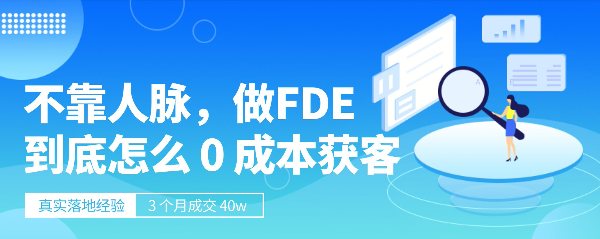
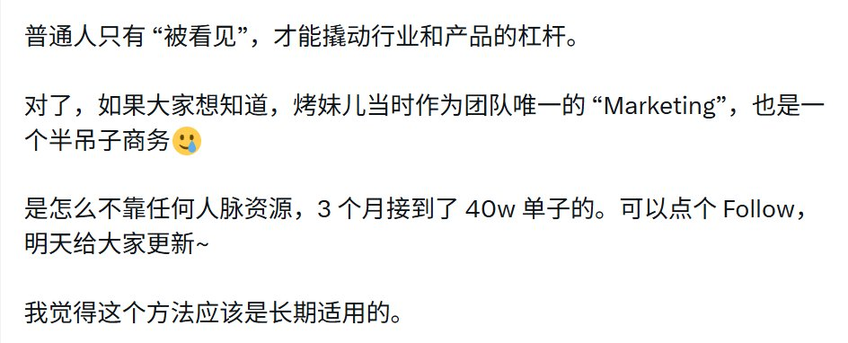
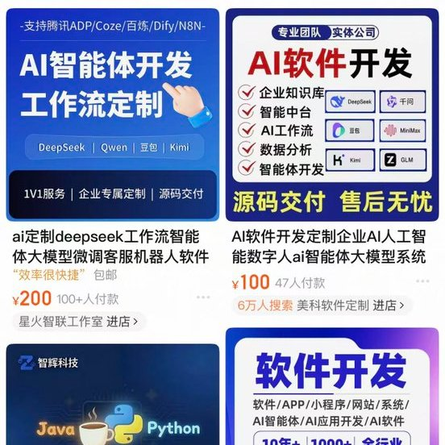
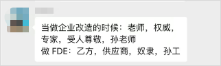

# 经验分享 | 不靠人脉资源，做 FDE 到底怎么 0 成本获客？

@CrazyKaomei · [X 原文](https://x.com/CrazyKaomei/article/2094951962999693474)

接着聊前两天埋的坑，也是市面上所有**卖你大几千块钱的《 FDE 培训课/训练营 》**都不会教你的事情，那就是——

**👉****做 FDE 到底怎么 0 成本获客？**

**\*全文两千字预警，都是一个个手敲的****😂****本来想直接发帖子的，没想到越写越多，只能转成文章了。**

都是实操经验总结，有需要的朋友可以**先收藏~**

原帖链接🔗：

[https://x.com/CrazyKaomei/status/2094417061699260912?s=20](https://x.com/CrazyKaomei/status/2094417061699260912?s=20)

其实当时烤妹儿的团队，严格来说**并不是 FDE**（主要去年也没听过这个词儿）。

只是开发自己的产品久了，觉得有点闭门造车，所以想去接一些 AI 外包业务。

有现金流回血的同时，也能看看**真实的市场需求**。

但当时本来团队就没几个人，还都是程序员，只有我有点运营经验；也不想发朋友圈去问，因为本来就不是主做这个业务。

所以为了** “无任何社交成本” **的接到单子，我基本就是按照下面三步流程操作的，而且最后证明结果还不错——

### 第一步：包装公司介绍、人员背景和案例

这其实是最关键的一步，也是我觉得很多人转型 FDE，都忽略的一点。

当客户问你要介绍的时候，只有一段干巴巴的文字，或者让 AI 生成一个花里胡哨的海报，甚至做一个自以为非常酷炫的极客网站。

但这些其实都不行！因为根本不符合你的目标客户群体、也就是小老板们和中老登的需求。

他们要的是什么？

所有能展现你**靠谱（按周期交付、不会跑路）、能力（最好有名校/大厂背景）和详细案例的东西**，**以及最关键的性价比****😂**

他们的审美是什么？

就是很传统的 PPT 介绍文档和正式海报！

所以，我先去淘宝和闲鱼上，找了做 AI 开发业务销量比较好产品，然后**把他们的业务介绍和宣传图全部下载下来。**

按照他们的结构和排版，替换成我们团队的介绍。

包括海报图，也是仿照他们的风格在 WPS 海报和 Canva，找了类似的模板 1:1 复刻。

接着又做了一个 12 页左右的 PPT 介绍——其实大部分都是案例。毕竟团队的几个程序员，还是有非常丰富经验的，自身背景也不差（清华和字节等）。

这一步一定要注意，**把历史的案例包装好。**

并且尽可能包装成通用行业，比如教育、医疗、媒体、财经等，然后配上产品截图，和尽可能详尽的功能模块介绍。

因为这一步直接决定了** 60% 的小客户信任度**。

由于烤妹儿在这之前，就有比较成熟的区块链项目包装经验，所以这一步简直是驾轻就熟🤣

还要补充的一点是——哪怕你只有一个人，也**尽量找一些搭子**，三五个人组在一起，包装成一个相对完善的团队。

因为对大部分不懂的老板来讲，你很专业没问题；但是**和一个人去谈生意，跟和一个公司谈生意，是完全不一样的感觉。**

这里再插一嘴，虽然 OPC、FDE 这种新词频出。

但如果你决定走这条路，特别是涉及开发、企业 AI 化改造客单价比较高的这种（不是几百几千块的）。

最好还是**注册一个公司**，正式签个合同，会免除很多不必要的麻烦。

### 二、有了 “敲门砖”，如何高效的公域获客？

很多人觉得做完资料包装这一步就结束了，其实烤妹儿当时还**往前又做了一步**——

那就是专门注册一个介绍公司业务的小红书账号，并结合技术的案例经验以及 AI，做了能**连续排期发一个月**的帖子和封面图。

当时想的很简单，这一个月时间，如果有客户，就一定会进到我主页去看。

那我就需要把这个主页包装好，不能是一个空白/个人账号。

后来事实证明，我是对的；相比于闲鱼、boss 直聘以及短视频渠道——

小红书不仅回复率高，还给我贡献了 **近八成的单子~**

甚至那单 25w、优质客户案例的单子，都是从小红书拉来的。

如果不知道怎么写帖子的，不要瞎发；找热度高的对标贴，**像素级复刻**。

做完这些后，我就开始每天定时蹲守小红书了😅

并且**不断搜索关键词**：AI 开发、AI 外包、开发...

只要有最新的相关贴，我基本会马上冲过去私信，发一段正式的介绍**：公司+团队+案例+base地点+交付周期。**

因为小红书私信只能发一条，所以这个私信内容除了提前备好的模板，还会每次根据对方的需求，调整加上**相关的案例细节**。

在这上面花的时间很多吗？其实一般，可能也就每天最多 2h。

但很多单子，就这么直接谈成了。

这里其实想聊的是，很多程序员其实都会**忽略小红书**这个平台，这也没办法。

谁让这个平台** 70% 以上都是女性用户**呢？

可小红书作为国内唯一具备实时搜索、需求发布的平台，真的没有代替品。

所以不要小看小红书，真的会有**背景不错的大客户**，在上面发需求。

当然过了几手，就不知道了。

接下来再简单说说，我在**其它平台的尝试**——

🐟闲鱼接单没问题，但一定要定一个很低的价格，也就是引流品。

只有先增加足够的曝光，吸引多个买家点击 “我想要”，平台才会把你**推给更大的算法池。**

但是在闲鱼上，聊的低价单，真的是比小红书还低。

甚至很多几百、一两千大学生需求这种。

所以感觉比较浪费时间，后面就没有继续花精力维护了。

💼boss 直聘的话，其实是不少人选的方式。

先假装求职，然后再慢慢聊到合作需求。

但其实这种方法有个问题是，**概率其实很小。**

大公司还是希望正经招一个线下办公的人，而且对接你的是 HR，基本做不了主；

小公司呢，本来就是奔着压缩成本去的，让你再赚一个额外利润，说实话很难。

还有一种，**上来就说是招募技术合伙人的**，我实测下来，基本都是钓鱼贴，被白嫖的概率非常大。

🦋最后说说短视频，这是烤妹儿之前不太尝试，但现在觉得还是**很有前景、最适合 FDE 拓客**的地方。

因为传统小老板们，基本还是看抖音、视频号。

一旦能在这上面**建立 IP 信任**，那获客效果和成交概率都会非常好。

现在有了 AI，不愿出镜的，完全可以做一个数字人口播去讲。

但关键是要**打磨好内容，**让视频进入算法流量推荐池，才有后续。

### 三、交付也能带单？理清权责边界的同时，维护好信任资产

很多人接到单就开心了，但其实这才是开始。

不管 AI 外包、企业化改造还是 FDE，从收了钱那一刻起，只有一个**统一的名字**，那就是乙方。

烤妹儿作为当时的主要沟通方，我很清楚自己只有一个目的。

那就是**管理好客户预期的同时，增加客户的信任。**

这两者表面上看是相违背的，因为客户在付完预付款的那一刻起，一定是期待更多，而且不可避免地增加需求。

这个时候，不能直接说做不到；也不能很理所当然的说，合同上没有得加钱。

总之如何沟通，这是个**大技巧**。

这里就不展开聊了，后面有兴趣的话，再单独写一篇帖子。

仔细想一下，烤妹儿当时其实并没有聊很多客户——

大概一共聊了 20 个左右，**成了 5 单。**

其中还有 2 个客户，后面又给我们做了两单其它业务。

所以也是这个让烤妹儿明白，**交付过程**真的很重要。

很多小客户，他们其实最担心的是后面如何维护的问题。

如果外包都是如此，更别说** “进阶” **版本的 FDE 了。

所以只要客户足够信任你，FDE 是一定可以再加一个**长期维护费用**的。

### ✍️聊点上个帖子没说完的......

虽然 FDE 和 AI 外包还是有一定的差别，但我觉得逻辑是大差不差的：

- **大客户**需要关系、资源和资质，需要有成熟的案例和流程 SOP
- **小客户**则需要耗费更多的时间成本去沟通，而且市场相对红海
- 基本都是帮**传统企业**做 AI 流程化改造，需要**多轮沟通并深入了解**不同行业工作流，最好还能驻场（如果小客户愿意付这个费用的话）
- 对每个行业沉淀下工作流后，都可以复用到下个行业，降低边际成本
- ......

但是，我觉得对大部分独立程序员转型 FDE 的**卡点**在于——

客户通常很难一次说清楚自己到底想要什么，而程序员也基本很难用客户理解的语言去传述清楚。

这中间就会有巨大的**沟通损耗成本。**

关键我感觉这个是无解的。除非这个程序员本身就比较擅长表达，对多个不同的行业都有关注，但显然大部分人并不是。

所以有时候，看起来确实赚到了钱，但也非常消耗时间和精力。

尤其是当改的需求多了，很容易跟着对方不断修改，**客户说做什么就做什么。**

毕竟客户才是他们行业，知道 know-how 的那一个。

这就导致又从高大上的 FDE，落回到了外包上面了🙃

最后说会拓客，其实不管是 OPC、超级个体或是 FDE——AI 时代越往后发展，**被看见**就会变得越重要。

普通人只有 “被看见”，才能撬动行业和产品的杠杆。

所以烤妹儿非常鼓励大家，可以试着**从 0 开始建立自己的自媒体品牌。**

不需要都成为几十万粉丝的大博主，只要有一点影响力，你就能感受到杠杆的加成，会有客户不断去触达你。

烤妹儿主页，也在一直更新**【AI+自媒体】**的 Skills 和 “邪修起号” 方法论。

非常感谢所有看到这里的朋友。

这篇文章全部都是手打的，花了几个小时才写好。我都没想到 AI 时代，自己还能不借助任何工具，手打一篇这么长的文章。

所以非常难得了哈哈哈~

如果你也喜欢，还请多多支持，给个**点赞和转发**，帮忙让更多的人看到~

非常感谢大家🫶💙！
