# 如何用 Google Workspace 11 元拿下一年的 .COM 域名（图文保姆级教程）

@KeKeYa88 · [X 原文](https://x.com/KeKeYa88/article/2095447620210868382)

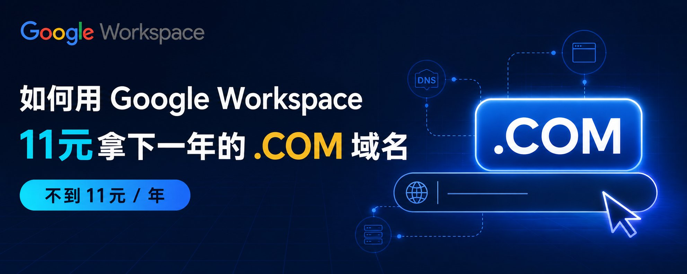

## 如何用 Google Workspace 11 元拿下一年的 .COM 域名

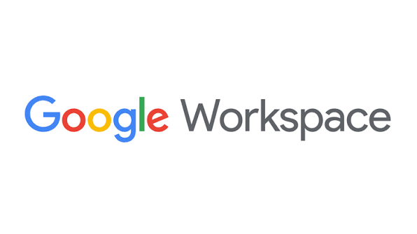

先把话说清楚：这不是“零元注册域名”。视频里的方法，本质是借助 Google Workspace 的注册入口，按当时显示的地区价格购买域名，再把 Workspace 的试用套餐取消掉。

域名本身仍然要付费。本人操作时，.com的价格是每年 75 土耳其里拉，按当时汇率约** 10.48 元**人民币；这个价格会受地区、汇率、税费和 Google 当前政策影响，不能当成今天的固定报价。

真正能省下来的，是 Workspace 试用期结束后的月费。只要你不需要企业邮箱、2TB Drive 和工作版 Gemini，记得在试用期结束前取消套餐，就不会把每月费用一起续上。

## 一、这条路线到底是怎么回事？

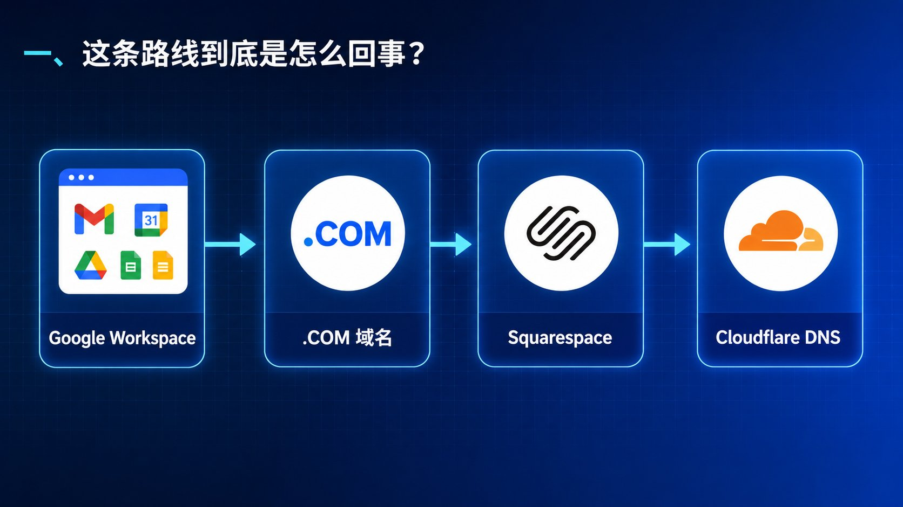

Google Workspace 是面向企业和团队的办公套件，里面有 Gmail、Drive、日历、会议以及部分 AI 功能。注册 Workspace 时，系统会提供“获取新的自定义域名”的入口。

1. 注册一个新的 Workspace 组织账号；

2. 在注册过程中搜索并购买 .com等域名；

3. 域名由 Squarespace 负责后续注册和管理；

4. 需要的话，再把 DNS 托管迁移到 Cloudflare；

5. 取消 Workspace 试用套餐，只留下域名注册。

Google Domains 的业务已经转移给 Squarespace，所以你在 Workspace 里买完域名后，收到 Squarespace 的邮件并不奇怪。

## 二、开始之前准备什么？

你需要准备：

一个可以**正常登录的 Google 账号**；

一张 **Google 结账页面接受的支付卡
**（Visa 万事达都可以 没有的朋友可以参考我下面的文章办理一张适合自己的）

**土耳其的姓名、地址和付款资料**（没有可以去Google搜土耳其地址生成器）

**一个 Cloudflare 账号**（如果你想把 DNS 放到 Cloudflare 管理）。

## 三、用 Workspace 购买域名（图文）

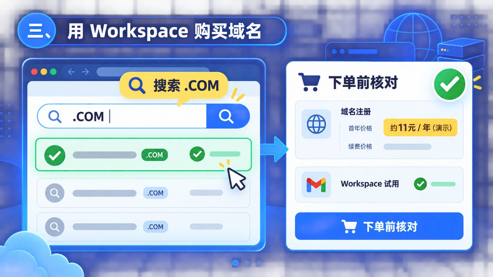

1.打开[https://workspace.google.com/](https://www.youtube.com/redirect?event=video_description&redir_token=QUM4Zm9rUlRYN0pVTXVKUllraWktWER5cW1ES3xBTl9pYzRjVjFSbGJubHpYVVE0Z0hzb21GMmpWZ1RVMkhxUDdFVm5zV0plYzl6TVdpd1dycndzd2EwSUJNcXBWeUlpbjFWLU5DNFF4SVVCTVdOaVMwVDMtUG1tQzlkemZBc1hZ&q=https%3A%2F%2Fworkspace.google.com%2F&v=pFL47GTPYx8)

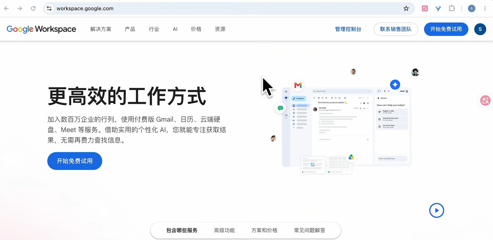

2.点击**开始免费试用**

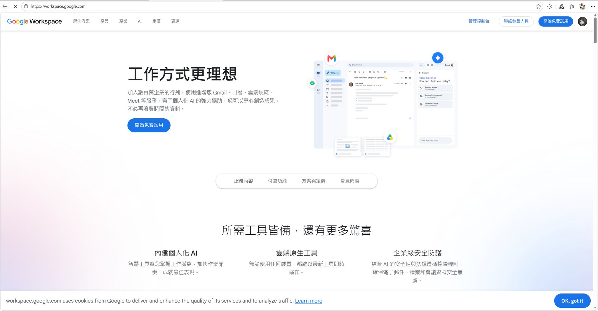

**

**3.点击**建立新账号**

**
**4.**填写信息（地区选土耳其 换算后11元不到 员工人数选一个人）**

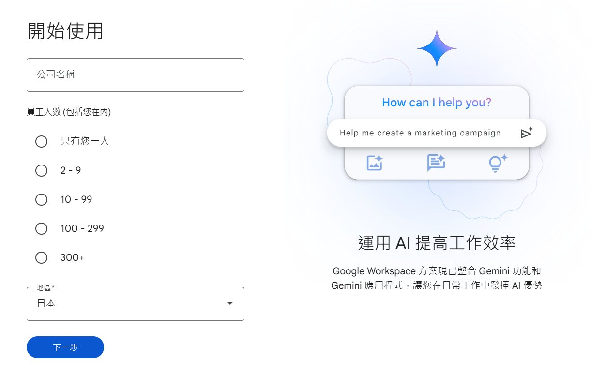

5.**填写联系方式（不需要真名）**

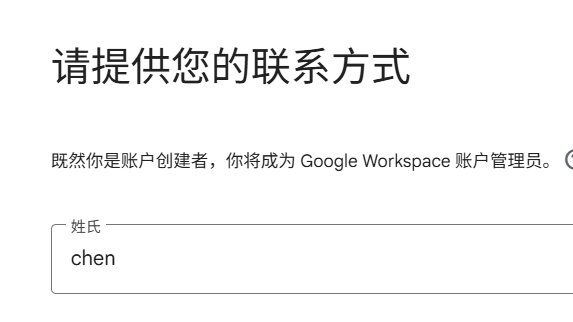

**
**6.点击** 获取新的自定义域名**

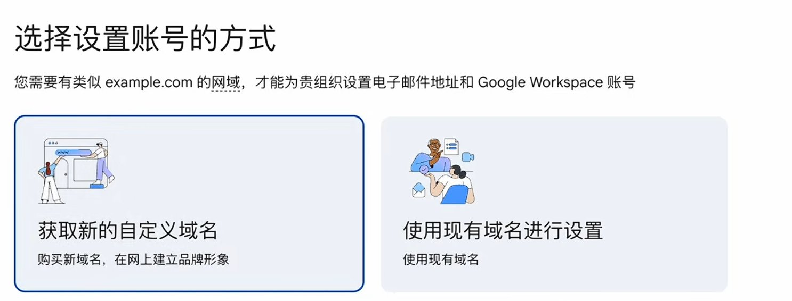

**
**7.选择你想要的域名（我以.com演示 只需要**75 土耳其里拉 折合人民币11元不到一年**）

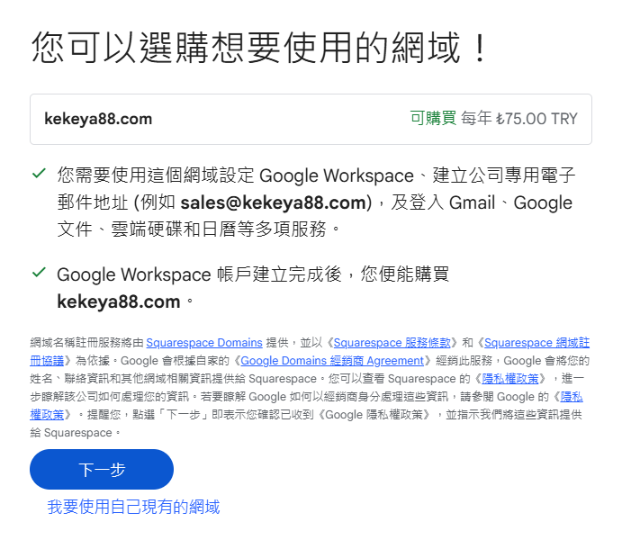

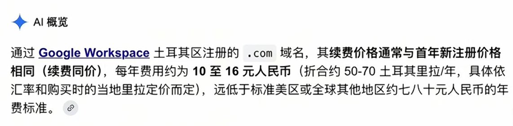

8.填写土耳其地址和电话（电话不需要验证）
    可以用**土耳其地址生成器生成**

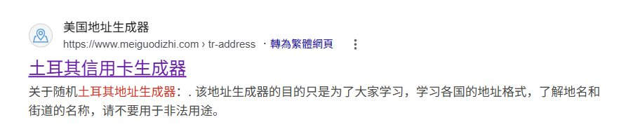

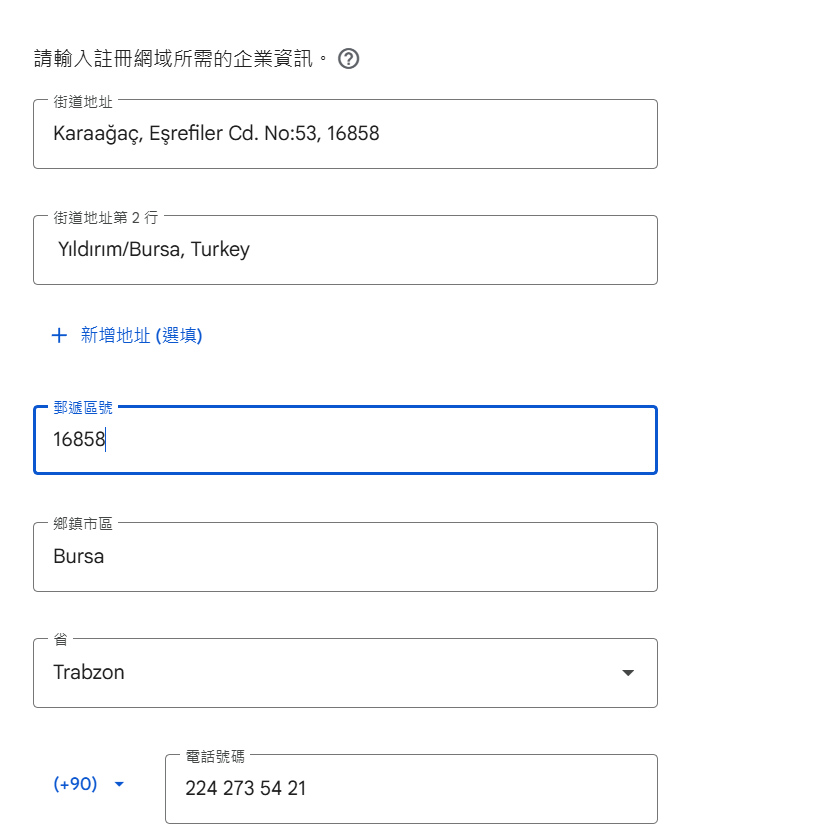

9.建立使用者名称

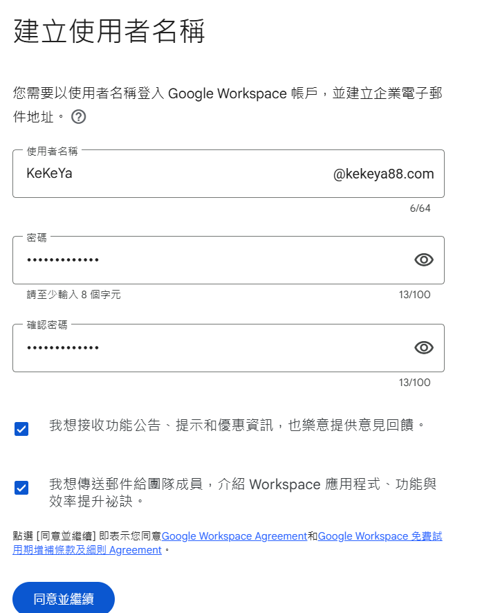

10.选择 **享受14天试用（之后再取消）**

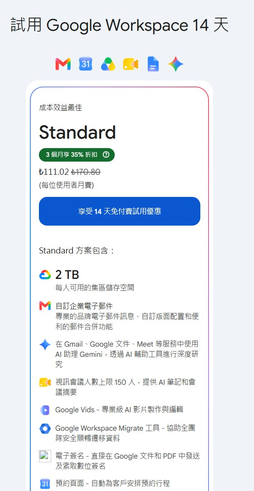

11.确认账单 付款（**实测bybit U卡不行**）

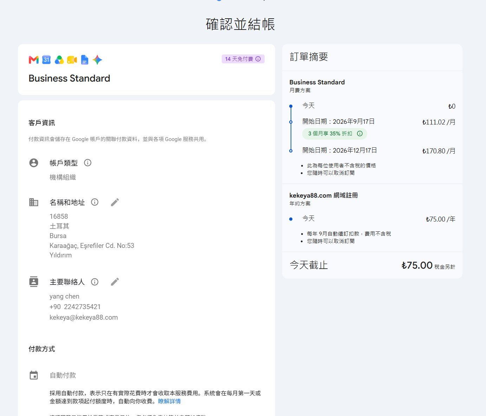

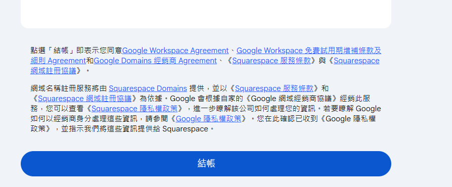

12.查看邮箱 收到三封邮件（一封是Squarespace 剩下的是Google Workspace）

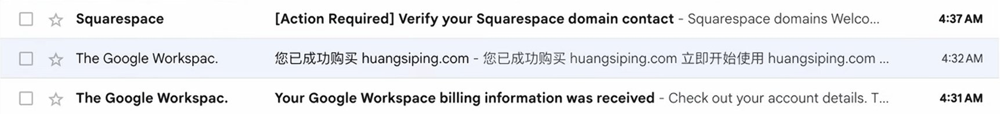

13.点Squarespace那封 有两个按钮 先选** LOG IN**

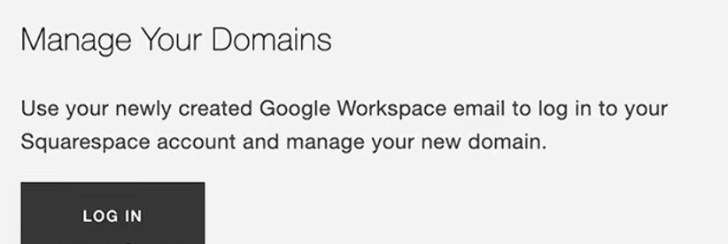

14.注册Squarespace账号

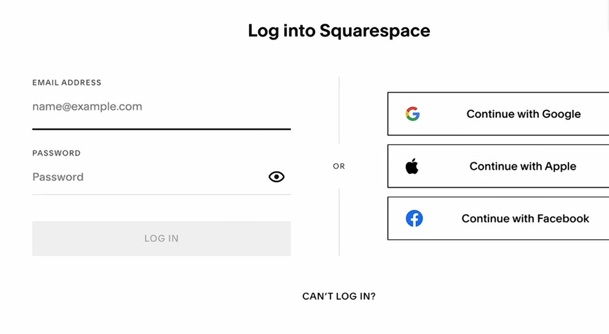

15.成功后发现自己的域名 还需要采取行动

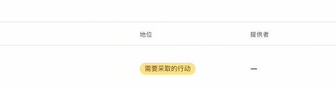

16.回到Squarespace之前发的邮箱 **选择 VERIFY **

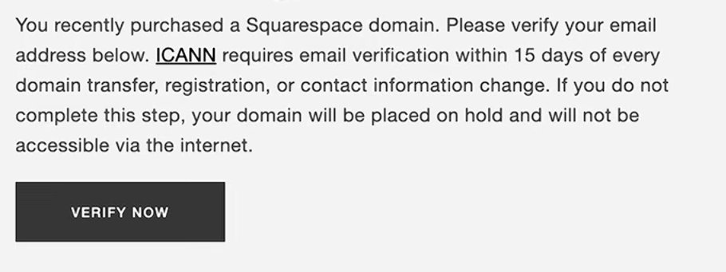

17.验证后回到Squarespace官网 发现你的网站已经变成积极的 
***这个时候已经购买激活成功啦***

## 四、把域名托管到 Cloudflare

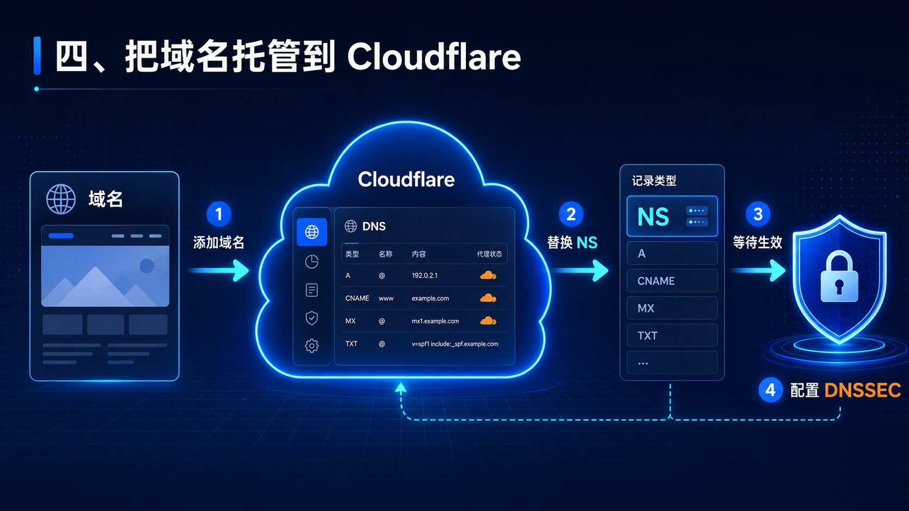

域名注册商和 DNS 托管商可以不是同一家。你可以继续用 Squarespace 管 DNS，也可以迁移到 Cloudflare 的免费计划。

**1. 在 Cloudflare 添加域名**

登录 Cloudflare，进入“域名 / 概览”，选择添加域名，输入刚购买的域名并选择免费计划。

Cloudflare 会扫描现有 DNS 记录。先检查记录是否完整，再决定哪些记录需要代理。尤其是 MX、SPF、DKIM、DMARC 等邮件记录，通常应保持 DNS-only，不要为了点亮代理状态而全部改动。

**2. 替换名称服务器**

Cloudflare 会给出两条名称服务器，也就是 NS 记录。回到 Squarespace 的域名设置，把原来的 NS 替换为 Cloudflare 提供的两条记录并保存。

如果 Squarespace 提示 DNSSEC 已开启，需要先临时关闭，完成 NS 切换后再重新配置。DNSSEC 不是普通 DNS 记录，它更像一把验证域名的锁；两边的 DS 参数对不上，域名可能无法解析。

**3. 等待生效，再配置 DNSSEC**

回到 Cloudflare，点击“我已更新名称服务器”。传播时间可能从几分钟到数小时不等，具体看 DNS 缓存。

确认 Cloudflare 已经接管域名后，再在 Cloudflare 开启 DNSSEC，复制它生成的 Key Tag、Algorithm、Digest Type 和 Digest，回到 Squarespace 的 DNSSEC 页面逐项填写。

这一步一定要逐字符核对。不要在 NS 还没切换成功时就急着改 DNSSEC，也不要删除 Cloudflare 自动扫描出来的邮件记录。

### 五、最容易忘记的一步：取消 Workspace 套餐

如果你只想保留域名，不想继续付 Workspace 月费：

1.用管理员账号进入 [admin.google.com](https://admin.google.com/)；

2.打开结算或 Billing；

3.进入管理订阅；

4.找到 Business Standard 或你实际开通的套餐；

5.在试用期结束前取消订阅；

6.确认页面没有把“域名注册”一起取消。

取消 Workspace 套餐后，企业邮箱、Drive 容量和工作版 Gemini 等服务会受到影响。视频里最终只保留“域名注册”这一项，但你的页面可能不同，确认前一定看清订阅名称和后续影响。

建议在注册当天就设置一个试用结束前的提醒。不要把“我记得会取消”当成计划，自动续费最擅长收这种记性税。

## 结尾：这套方法适合谁？

如果你只是想练手，免费二级域名已经够用；**如果你要做个人品牌、作品集、正式网站或长期项目，.com 的确更省解释成本。**

Google Workspace 这条路线值得研究的地方，是购买入口和域名管理可以拆开：先按页面价格买域名，再把 DNS 放到自己熟悉的平台，最后把不需要的 Workspace 月费关掉。

## 我是可可鸭 欢迎关注我的账号 如果帮到你记得点赞收藏转发！！！
