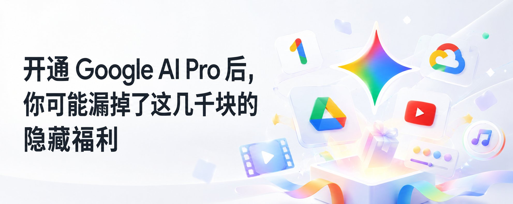
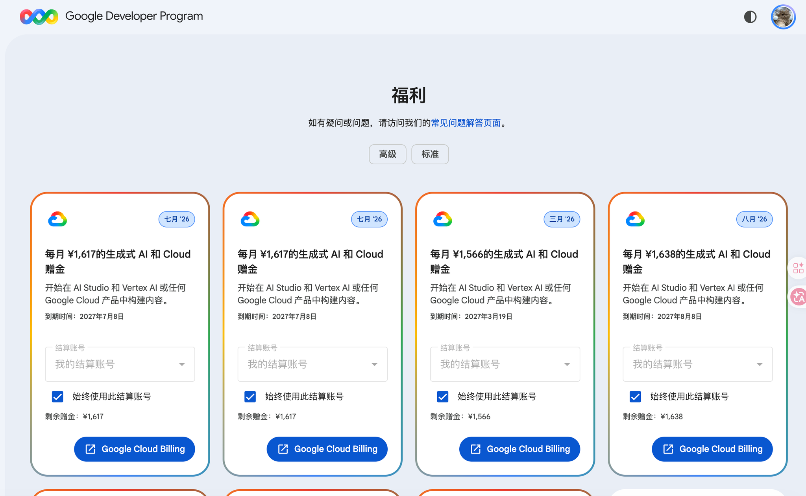

# 开通 Google AI Pro 后，你可能漏掉了这几千块的隐藏福利

@Pluvio9yte · [X 原文](https://x.com/Pluvio9yte/article/2095779662081442173)

现在的 Google AI Pro 早就不是一个单纯的对话订阅，而是 Google 旗下集 **云存储 + 创作生成点数 + 开发者算力 + 流媒体与家居** 于一身的超级数字全家桶。

每个月实际只需几元成本，但官方送出的真金白银和额度提升，价值却高达几十甚至上百美元。

今天就带大家彻底盘点一下：**开通 Google AI Pro 后，你究竟能领到并享受到哪些超值权益？**

### 一、 每月到账的实物与积分

这部分是只要订阅在保，官方**每月固定发放到账**的真金白银资源：

1. 5 TB 超大云存储空间（价值最大的一项）

- **存储规格**：Google 已将原先的 2TB 规格直接升级扩容为 **5 TB**。
- **通用性**：Google Drive、Gmail、Google Photos 跨平台无缝共用。存海量 4K 视频、原画备份照片、工作大文件彻底告别容量焦虑。
- **全家共享**：最多可以拉入 **5 位家庭成员**，大家平分这 5TB 容量，且每个人的文件、相册完全私密独立，相当于一人开通，全家不缺网盘。

2. 每月 1,000 点 Flow / Whisk 视频创作积分

- **用途**：可以在 Google 的影视级生成工具 **Google Flow** 和生图转视频工具 **Whisk** 中使用，驱动背后的 Omni Flash 与 Veo 视频模型。
- **实际能做多少**：每月 1,000 点折算下来，大概能生成约 **66 条 10 秒 720p 视频**，或者 **140 条 10 秒 360p 短片**，对于轻度视频创作者、分镜设计者完全够用。（注意：点数账单日刷新，不结转，按月用完最划算）。

3. 每月 10,000 点 Flow Music 音乐生成点数

- 视频和音乐的点数是**独立计算**的！官方每月额外赠送 10,000 点 Flow Music 点数，由 Lyria 3 编曲模型驱动，支持完整曲风编排和伴奏生成。

4. 每月 $10 美元 GCP 开发者真金算力（很多人根本不知道）

- **价值**：实打实的 10 美元 Google Cloud 云积分。
- **怎么用**：可以直接用来抵扣调用 Vertex AI、官方 Gemini API、部署 Cloud Run 等云端支出。自己写代码接入 API，或者搭建第三方客户端的费用直接被这 10 刀抹平。

5. 打包赠送的订阅全家桶

- **YouTube Premium Lite**：享受绝大多数普通视频、长视频去广告特权（极大地提升刷视频体验）。
- **Google Home Premium Standard**（官方标价约 $10/月）：拥有 30 天智能摄像头云端事件回放，以及基于 Gemini 的智能家居语音大模型理解。
- **Google Health Premium**：搭配 Pixel Watch 或 Fitbit 设备，解锁更深度的身体体征、睡眠和健康 AI 分析。
- **Google Store 10% 返点**：在谷歌官方商店购买硬件时享受 10% Store Credit 返现。

### 二、 无形却关键的“生产力额度扩容”

除了每月发的积分与空间，你在日常使用各项 AI 工具时，额度也全部被拉到了专业级：

1. **Gemini 本体顶格体验**：**4 倍免费额度**：告别动不动就撞墙的限制，算力池每 5 小时自动循环刷新。
**100 万（1M）Token 上下文**：相当于一次性吃下 1,500 页文档或 3 万行代码，丢一整本书或几小时的会议录音进去直接提问。
**专业功能全开**：支持长达 1 小时的视频上传分析、3 小时长音频解析，解锁 Deep Research（深度研究报告）和 24/7 个人智能体 Spark。
2. **全套 Google Workspace 办公套件加持**：在 Gmail（自动帮写润色、AI 邮件总结摘要）、Docs、Sheets、Slides 中随处调用 Gemini。
包含官方一键 AI 生成视频工具 **Google Vids** 与扩容版的 **NotebookLM**（可容纳更多笔记本与来源）。
3. **开发者专属加成**：**Google AI Studio**：Pro 级模型测试与原型设计额度大幅放宽。
**Google Antigravity & Jules**：编码智能体、任务并发数均享有 Expanded 优待。

### 三、 重点实操：最容易白白浪费的 3 个福利

花十几块钱上车之后，千万记得做好下面这三件事，否则就等于白白浪费福利：

1. 手动去领那 $10 GCP 云积分！

- 这笔钱**不会自动打到你的账单**里！
- **领取路径**：访问 [Google Developer Program Benefits 页面](https://developers.google.com/program/my-benefits) 登录你的订阅账号，手动点击领取，并绑定到你的 Google Cloud Billing（结算账号）上。调用 Gemini API 或跑 Vertex AI 时记得选用对应的账单项目。

2. 绑满 5 个家庭成员，分摊收益

- 去 Google One 后台开启家庭组共享，把家人或自己的小号加进去。
- 不仅 5TB 超大云盘可以共享，部分基础 AI 体验也能惠及全家。

3. 注意网络节点与地区限制

- **YouTube Premium Lite** 和 **Chrome auto browse** 等高级自动化功能，对账号归属地及访问 IP 有一定限制。
- 建议使用网络环境干净的节点访问，以确保能够顺利触发并享受完整的全套权益。

欢迎关注我 [@Pluvio9yte](https://x.com/@Pluvio9yte)，我会持续分享AI类相关干货
