# How to build a one-person company with Grok Bot using my 41M+ views system. (FULL GUIDE)

@Sabrina_Ramonov · [X 原文](https://x.com/Sabrina_Ramonov/article/2094833331183759612)

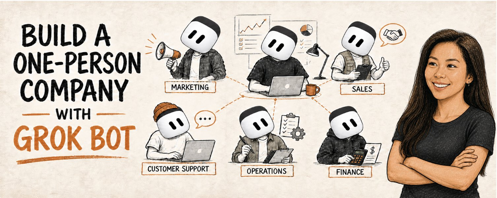

*TLDR*

*Here's the exact setup to build a one-person company with *[*Grok @bot.*](https://x.ai/bot)* Starting with what every founder struggles with: marketing.*

*I took the system behind my 41 million views in 30 days, rebuilt everything inside Grok Bot, split the work between 4 specialist Bots, and launched a full marketing team.*


Most 1-person companies are just one person doing 12 jobs.

You build the product.

Find customers.

Write content.

Answer support.

Chase payments.

Stress over numbers.

Then at 11pm you remember… **you forgot to do marketing.**

AI helps you do each job. But you STILL had to open every AI chat, explain what to do, give AI feedback, paste answers into another app, and do it all again.

YOU are the bottleneck.

But, Grok Bot gets you much closer to a true AI agent team.

You make the decisions.

Your Bots own the repeatable work.

Each Bot has a name, 1 job, and access to a shared cloud computer. They can use real websites, pass work to each other, keep going after your laptop closes, and stop when they need your approval.

That last part matters A LOT.

The goal isn't to remove yourself from your company.

Your skill, clarity, relationships, and decisions ARE the company.

The goal is to stop being the BOTTLENECK.

You don’t want to be the person doing every little click every single time.

To test whether Grok Bot could ACTUALLY do that, I started with the workflow I know best.

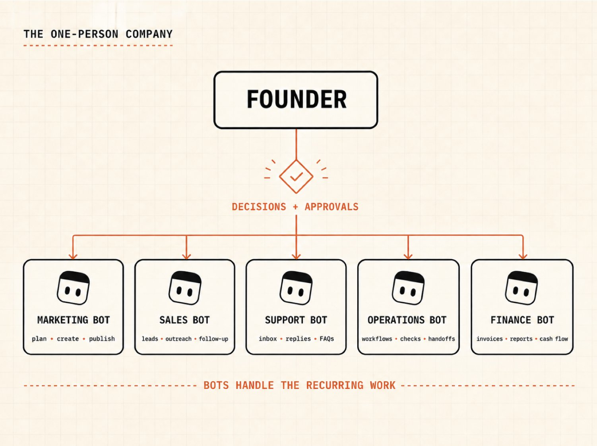

### Some context first

I run all of my short-form social media content SOLO.

No team. $0 ads.

It’s really simple, my marketing workflow uses 7 Claude skills:

- brand-brief
- content-coach
- post-writer
- post-grader
- post-scheduler
- viral-hooks
- repurpose

This system helped me get 41+ million views in 30 days.

It works like 1 very capable mini marketing employee. Claude understands my brand, brainstorms a hook, writes, grades, repurpose, and publishes everywhere.

But, Grok Bot is built around a different idea.

Instead of giving 1 agent a set of Skills, you give each persistent Bot a job.

So, I rebuilt my existing marketing workflow inside Grok Bot to test the bigger question:

> How close are we to running a one-person company with Bots?

I started with marketing because I’ve already proven it works: my system, my Claude skills, and achieved results.

The test was simple.

Take a real app.

Create a campaign.

Write the posts.

Review independently.

Create visuals.

Then post on socials.

Nothing faked.

But getting all this working started with a key decision:

> *one general Bot or a team of specialists?*

### What Grok Bot actually changes

Most people will make 1 general Bot, ask it random questions, and wonder why it feels like another chatbot...

But, a useful Bot does 1 job you can clearly explain.

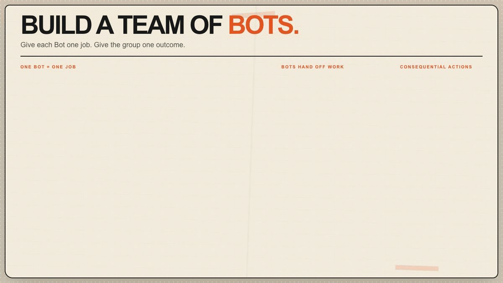

Examples:

- Sales Researcher
- Customer Support Lead
- Content Writer
- Finance Assistant

Each one builds context around its own responsibility. When several jobs need to work together, you put the Bots into a shared channel and give the group an outcome.

They can hand work to each other without you copy-pasting between chats.

Your Bots share the same cloud computer, including its files and browser logins. So only connect accounts you’re comfortable with every Bot accessing.

Keep the publishing, sending messages, spending money, deleting files, and changing live systems behind approval.

Here's where those rules actually live on your org chart, and which job to build first.

### Your one-person-company org chart

DON'T build every Bot today.

Pick ONE thing that takes you 30+ minutes each week and start there.

| Function | What the Bot owns | Where you stay involved |
| --- | --- | --- |
| Chief of Staff | Priorities, routing work, chasing handoffs | Final priorities and tradeoffs |
| Marketing | Research, content, repurposing, distribution | Taste, claims, final approval |
| Sales | Account research, draft outreach, CRM preparation | Relationships and sending |
| Customer Support | Triage, draft replies, recurring questions | Sensitive or unusual cases |
| Operations | Recurring admin, monitoring, weekly summaries | Exceptions and decisions |
| Finance | Receipt organization, invoice tracking, reports | Payments and financial approval |

You could create 50 Bots and feel very productive for 20 minutes.

DON'T.

Start with the smallest useful team… literally just ONE Bot.

Give 1 Bot an end-to-end outcome. Add another Bot only when you really need to.

But, before I built a full marketing team, I had to setup the FIRST job.

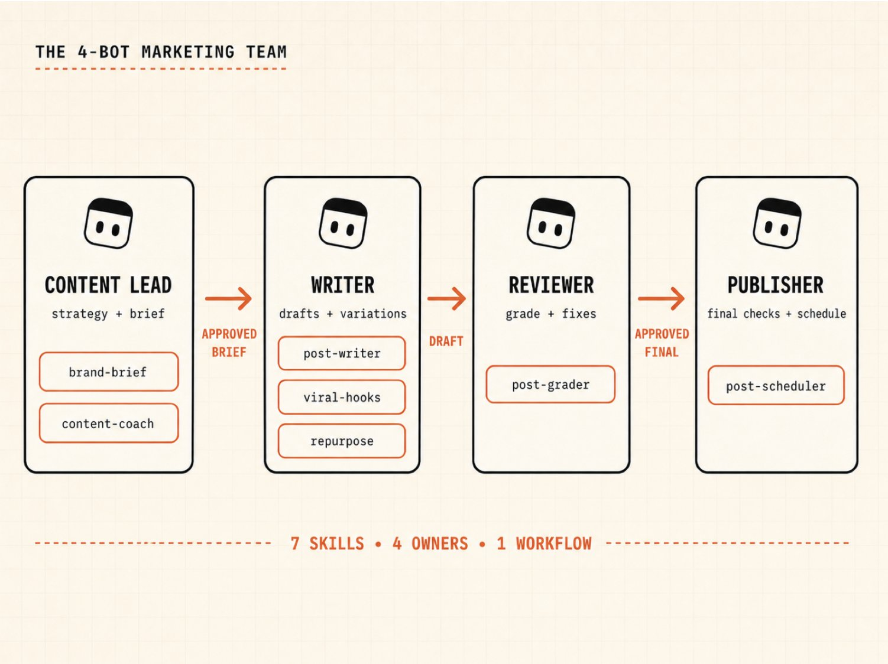

### Pick the first job properly

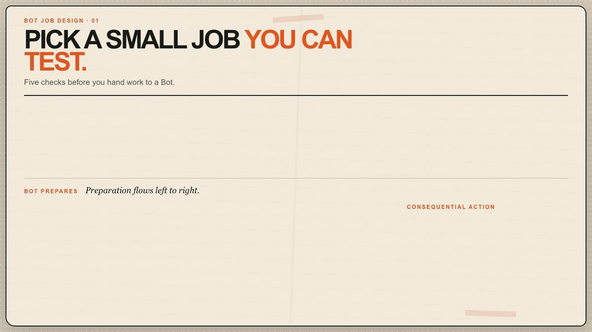

Your first Bot shouldn't be the Bot with the coolest title.

Pick a small job you can test.

Choose a job with these 5 qualities:

**Recurring**: You already do the work every week.

**Stable**: The basic steps stay roughly the same.

**Multi-step**: It moves through enough small tasks that handing it off saves real time.

**Reversible**: If the Bot gets something wrong, you can fix it without hurting customers or losing money.

**Measurable**: You can clearly articulate what “good” and “finished” look like.

For example: “weekly content brief” is a good first job.

> *Content Brief Bot checks sources, collects ideas, ranks the best ones, does more research, and gives the Writer Bot a brief.*

I can open the brief and tell in 5 minutes whether it did a good job.

Another example: “monitor my competitor's pricing page”.

> *Check the page every morning. Capture what changed. Alert me with the old price, new price, source link, and screenshot. Don't contact anyone or edit anything.*

If you have clear inputs and guardrails, there'll be little damage if it fails.

Ask yourself:

> If this ran badly tonight, would I know what happened tomorrow morning, and could I undo it?

If the answer is no, narrow the job.

It's less exciting than creating an army of 30 Bots on your first day.

BUT this is how you end up with an AI team you can trust.

Once the job is sufficiently narrow to test safely, 5 things make it real...

### What you need

- **Grok Bot:** Use an eligible SuperGrok or Cursor plan, then download the Grok Bot desktop app from [x.ai/bot](http://x.ai/bot).
- **A real recurring workflow**: Pick something you already do 30+ minutes per week with clear defined steps, so it is easier to automate.
- **Skill files**: They're markdown instructions that teach a Bot how to perform a job and validate the result.
- **The actual tools your company uses**: Connect a plugin (if relevant). For websites without one, Grok Bot can use its browser.
- **An approval boundary**: Decide what you should review and approve.

For this marketing job, I used my 7 existing skills and [**Blotato**](https://www.blotato.com/), an app I built so my AI agents can automate social media scheduling and DMs.

More on that in a minute.

### Step 1: Hire your first Bot

Random prompts won't build a reliable teammate.

You have to tell each Bot exactly what job it's doing and where it needs your input.

Give it:

1. One job.

2. A definition of what “good” looks like.

3. The tools and apps it can use.

4. Guardrails.

"Help me with marketing" is too vague.

"Plan next week's content using our brand brief and performance data. Give the Writer the topics, hooks, source links, and key points for each post. Don't publish anything or make up results" ... is much better.

Adapt this template for each Bot:

```markdown
# BOT JOB DESCRIPTION

## Role
You're [NAME], our [JOB TITLE].

## Your job
Your main job is [ONE CLEAR OUTCOME].
Use [SOURCE OF TRUTH] and [APPROVED TOOLS] to complete the work.

## Before you finish
- Use current source material. Never invent facts, numbers, quotes, or results.
- Preserve links or screenshots for important claims.
- Follow the required output format exactly.
- Check your work before handing it off.
- Report missing access, stale data, or partial completion clearly.

## Pass it on
When it's ready, send it to [NEXT BOT] with:
1. the completed deliverable,
2. the sources used,
3. anything uncertain,
4. the exact next action required.

## Ask first
You can research, draft, organize, and recommend.
Ask me before sending, publishing, purchasing, deleting, changing permissions, or editing a live system.
If you're unsure, stop and ask.
```

Put the rules you want it to follow every time in the Bot's description.

Put today's task in the chat.

DON'T cram your entire company into one enormous description. Focused Bots build better context because every correction applies to the same kind of work.

Now the Bot has a job and a boundary. Next, give it tools.

### Step 2: Connect tools without handing over the keys to everything

You can connect a plugin or let the Bot use the website.

**If there's a plugin**: connect it from Plugins. The Bot gets structured tools for that service.

**If there isn't**: let the Bot open the website in its cloud browser. Take control when it reaches the login screen. Enter your password or 2FA yourself, then hand control back.

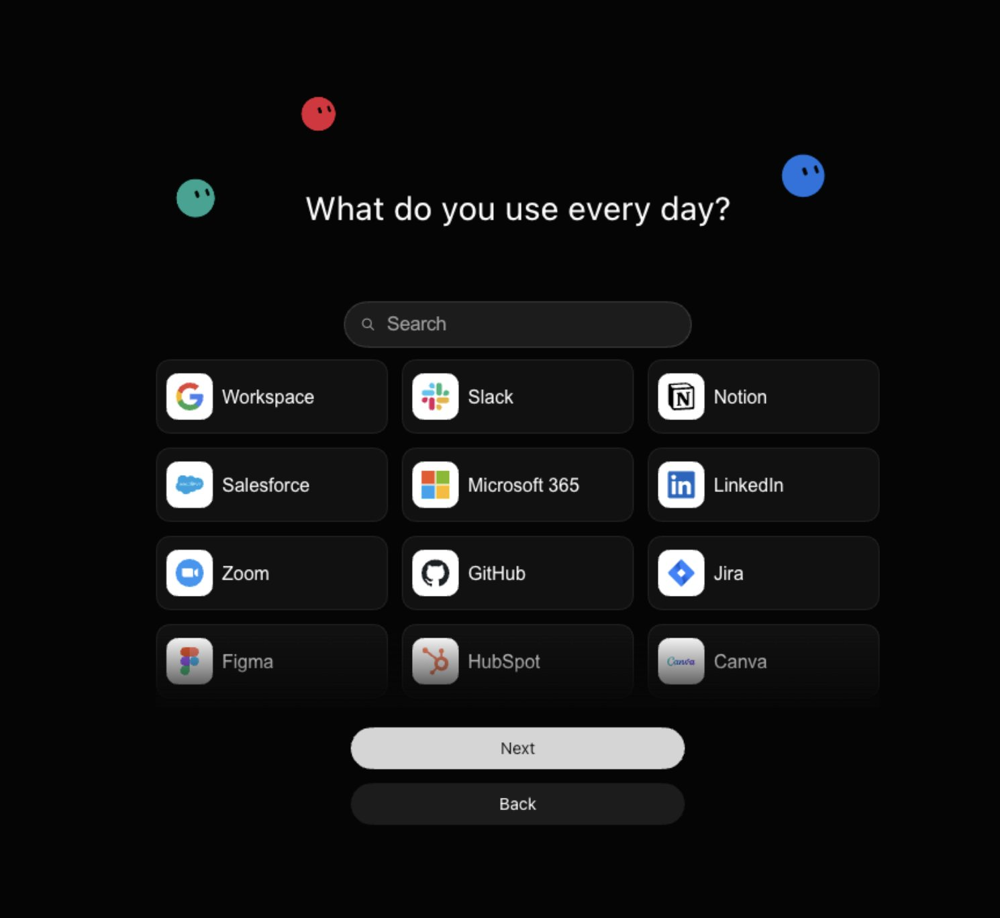

Never paste passwords or one-time codes into the chat.

Since every Bot on your account shares the same cloud computer, if the Publisher's signed into a social tool, another Bot may be able to use that same browser session.

Start narrow.

For our test, the Content Lead needs the brand and product context. The Writer needs the approved brief. The Reviewer needs the draft and the grading rules. Only the Publisher needs access to the publishing account.

All 4 Bots can see the skills, even though they’re each assigned individual skills.

Only the Publisher was told to use Blotato.

That's how a real team should work too.

Make sure you connect your social accounts here: [https://my.blotato.com/settings](https://my.blotato.com/settings)

Now I’ll build out the rest of the marketing team.

### Step 3: Build the marketing department

Here are the 4 Bots I actually tested, and how I divided my original 7 skills between them:

| Bot | Job | Skills |
| --- | --- | --- |
| Content Lead | Own the strategy and content brief | brand-brief, content-coach |
| Writer | Turn the brief into strong content and variations | post-writer, viral-hooks, repurpose |
| Reviewer | Grade the work and tell the Writer what needs fixing before approval | post-grader |
| Publisher | Run final checks and schedule approved content | post-scheduler |

Why 4 Bots instead of 7?

Each Bot gets 1 job.

A “skill” just teaches the Bot how to do part of a job. Just like in real life, a job involves learning multiple skills.

The Writer can use post-writer, viral-hooks, and repurpose because all 3 serve the same responsibility:

**generate high-performing content based on my company information!**

The Reviewer stays separate because writers are terrible at reviewing their own work 😭

Publishing is a separate Bot because it’s an important external action. It should receive approved content, check the platforms and time, then stop for your approval.

### Install the proven skills

You can see my marketing skills here:

[https://github.com/Blotato-Inc/blotato-skills](https://github.com/Blotato-Inc/blotato-skills)

The skills were originally written for Claude. Grok Bot can save reusable skills from written instructions, so I simply imported each skill.

The only compatibility change - removing Claude-specific \`allowed-tools\` field. But I didn't summarize or rewrite the skill itself.

Use this prompt:

\> Import all 7 skills from [https://github.com/Blotato-Inc/blotato-skills](https://github.com/Blotato-Inc/blotato-skills). Preserve the instructions, decision rules, output format, validation steps, and approval boundaries. Remove only tool names that don't exist in Grok Bot. Tell me every change you made. Don't run the skill yet.

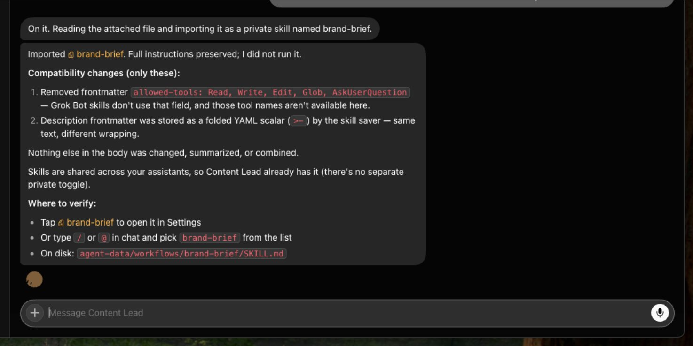

Your Bots can all see the skills, but each Bot only needs the skills specific to its job.

So, don't give the Publisher a viral hook library. It doesn’t need it.

Don’t give the Writer Bot permission to publish.

That's why the separation matters.

So now, I have 4 Bots.

But, they still need ONE shared place to collaborate.

### Step 4: Put the team in ONE channel

I created a channel called App Marketing Team and added all 4 Bots.

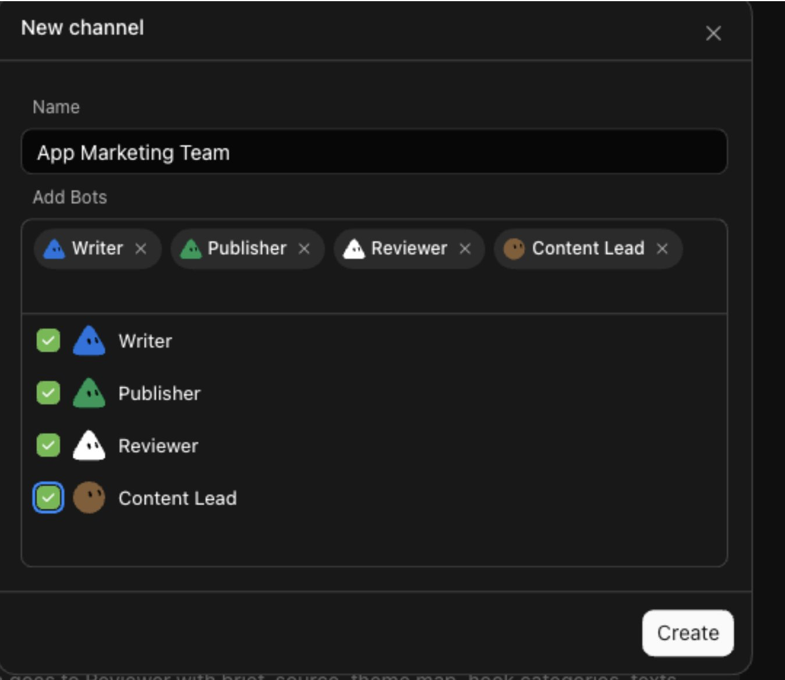

Then I kicked off the channel with this:

```markdown
> @Content Lead Use the content-coach skill.
>
> Adapt it into the orchestration playbook for this 4-Bot channel.
>
> Preserve its beginner-friendly front door, brand questions, five-idea brainstorming framework, platform guidance and explicit approval before publishing.
>
> Replace its single-agent execution with visible specialist handoffs:
>
> Content Lead owns brand context, strategy, idea selection and the approved brief.
>
> Writer uses post-writer, viral-hooks or repurpose to create drafts.
>
> Reviewer independently uses post-grader, returns fixes and is the only Bot that can approve content.
>
> Publisher uses post-scheduler only after Reviewer approval and my explicit approval.
>
> Globally shared skills must not erase these role boundaries. No Bot may perform another Bot's stage merely because it can see that skill.
>
> Do not execute the workflow or connect Blotato. Report every compatibility and orchestration change, and explain how the handoffs will appear in this channel.
```

**It was cool to see the bots in action:**

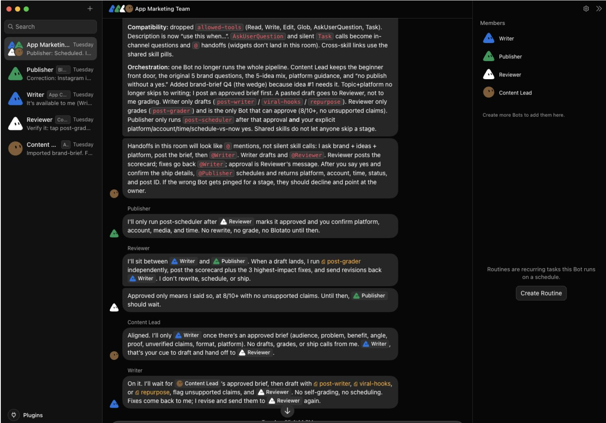

Now the handoff looks like this:

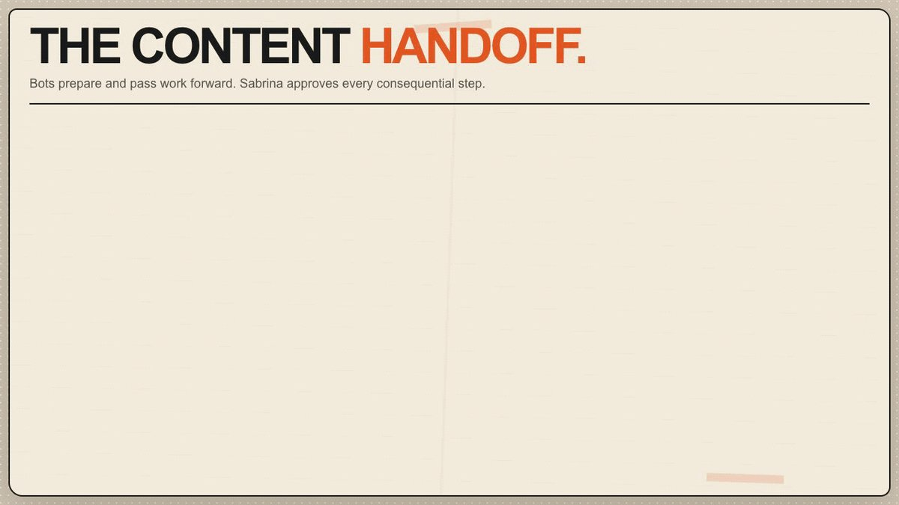

Bots coordinate the marketing.

While YOU are responsible for decisions that cost money or impact customers.

But, could my team actually automate posting on social media?

### The real test

I’m going to test creating and scheduling an Instagram carousel that promotes a real app.

First, set up the Blotato tool. Just type:

```text
Use these instructions to connect to Blotato MCP/API: 

https://help.blotato.com/api/llm
```

Then click **“Yes, add Blotato”**.

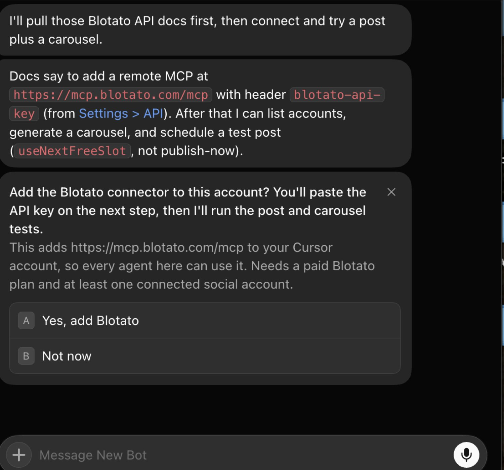

Then click **“Approve access”**.

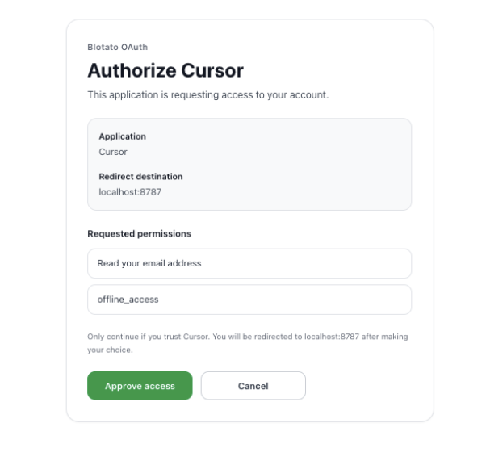

I copied my Blotato API Key from Settings: [https://my.blotato.com/settings/api](https://my.blotato.com/settings/api)… and used the Grok Bot’s connect card to authorize it:

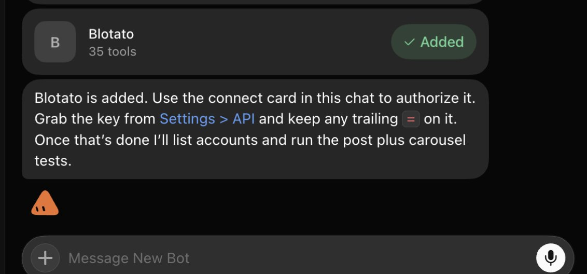

Now, my Bots got to work…

Remember, I’m creating a simple Instagram carousel to promote an app:

Use this prompt:

```markdown
Use your skills to plan a 3-slide Instagram carousel to promote _______, iterate on it until it scores 8+ out of 10, then make the carousel/slideshow using Blotato.
```

The Content Lead figured out the angle.

The Writer created the caption and slide copy.

The Reviewer checked the claim, voice, structure, and call-to-action independently. Graded the post 7/10, rejecting it and suggesting fixes.

The Writer revised it.

Then, I approved the final carousel.

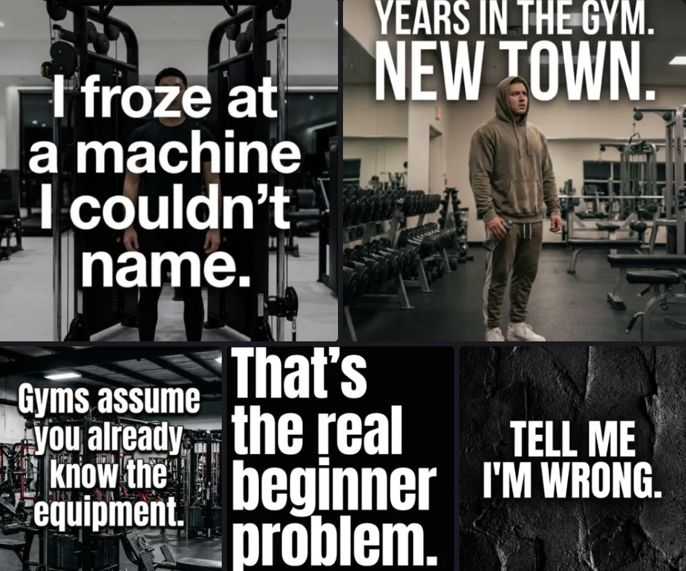

BTW you can see all your visuals directly in Blotato: [https://my.blotato.com/videos](https://my.blotato.com/videos)

And if you run into any issues, view all your API calls: [https://my.blotato.com/api-dashboard](https://my.blotato.com/api-dashboard?expandedIds=)

So far, so good.

Finally, I scheduled it to Instagram:

```markdown
Schedule it to Instagram tomorrow 8am
```

The Publisher used the post-scheduler skill and queued up the post for tomorrow.

**Remember:**

*Pick the ONE job you never want to do manually again: assign it to a Bot.*

But before you copy my setup… here’s what worked, what slowed us down, and what still needs YOU in the loop.

### What worked and what didn't

**What worked**

- All 7 Claude skills transferred cleanly into Grok Bot.
- Focused roles made ownership & accountability clear.
- The Reviewer challenged the Writer twice instead of politely approving everything.
- The group channel preserved the handoffs and guardrails.
- The shared browser session lets the Publisher use a real tool.
- Approval gates stopped the post before the alt-text and timezone decisions.
- The approved carousel was successfully scheduled.

**What was still clunky**

- Skills are also Plugins which was confusing
- AI image/video generation takes time, so Grok Bot had to check the status of the Instagram carousel several times before it finished
- Grok Bot's still in beta. ALWAYS start with reversible low-stakes work.

### Step 5: Turn proven work into routines

To recap, the high-level workflow is:

Choose a job you’re already doing 30+ minutes per week, with clear steps, and a clear definition of “done”.

Create a Bot for the job.

Then write down your process as a skill.

Only AFTER everything works reliably, turn it into a recurring routine.

It can even run while your laptop is closed.

Examples:

- Every morning, Research Bot finds relevant product launches and audience questions.

- Every Monday, the Content Lead sends topics, hooks, and source links to the Writer.

- Every Friday, the Reviewer audits next week's scheduled marketing content.

- Before every sales call, the Sales Bot prepares account research.

- At month’s end, the Finance Bot organizes receipts and flags missing items.

### Build your one-person company (copy this)

Save this section; use it as your setup checklist:

1. Pick ONE thing that consumes a lot of time. I chose marketing.

2. Create 1 Bot with 1 clear job.

3. Give it a source of truth, definition of “good” work, handoff, and approval boundary.

4. Connect the tools that the job needs.

5. Run a real task with a clear finish line.

6. Correct the workflow until it works repeatedly.

7. Save the proven process as a skill.

8. Add another Bot only when you have another bigBots in a group so they can collaborate.

10. When you trust the output, turn everything into a repeating routine.

11. Keep publishing, sending, spending, deleting, and production changes behind approval.

You DO NOT need an AI employee for every box in an org chart.

Start with just 1 job you keep avoiding.

Give it an owner.

Make it work.

Then “hire” the next Bot.

Your one-person company starts there.

♻️ SAVE this article and RETWEET it and you can DM me questions!
