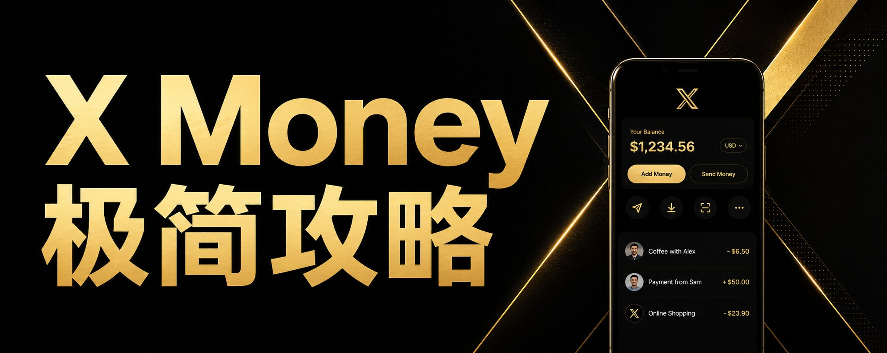

# 怎么开X Money帐号并拿到25刀和6%利息

@RealHanyaHu · [X 原文](https://x.com/RealHanyaHu/article/2092420221860786619)

X Money的好处就是它不是CD也不是国债也不是投资，它就是相当于美国支付宝，需要用钱的时候可以很快调出来。所以这个6%还是相当有吸引力的。可以把平时一些零花钱存在这里。

X Money 开通完整攻略（iPhone）

一、基本条件

- 必须是美国居民（18岁以上）
- X 账号已订阅 Premium 或 Premium+ 也就是我们常说的蓝V或蓝V+
- 有美国手机号验证
- 账号状态正常
- 目前分批开放，不是人人都能立刻看到 Money 入口

关于居住地、SSN、出入金银行帐号和手机号，这个X上的小伙伴不需要我教育了吧。如果你的帐号暂时没有X Money功能，那就安心等待好了。它是分批进行邀请的。

二、准备工作（很重要）

1. 更新系统：把 iPhone 的 iOS 更新到最新版本
2. 更新 X App：去 App Store 更新 X 到最新版
3. 重启手机：关机 → 等10秒 → 再开机
4. 打开 iCloud 钥匙串（关键步骤！很多人卡这里）：打开「设置」→ 点顶部自己的名字
点「iCloud」→「Passwords & Keychain （密码与钥匙串）」
把「同步此 iPhone」打开

三、进入开通流程

1. 打开 X App
2. 点左上角头像，找到 Money（或钱包/$ 图标）入口
3. 按提示填写真实信息：法定姓名（必须和身份证件一致）
出生日期
社会安全号（SSN）
美国住址（注意不能填 PO Box）
4. 完成身份验证（可能需要拍证件+自拍）
5. 开通成功后，$25 会自动存入你的 X Money 余额

四、**最容易卡住的地方**：Passkey（通行密钥）设置很多人到这一步会看到：

- 要求提供 Passkey
- 突然出现二维码
- 提示「用另一台设备扫描」
- 然后就卡住了

解决方法（我亲身验证过的，花了我好几星期！）：

1. 保持你的 iPhone 显示二维码的页面不要关
2. 打开蓝牙
3. 用另一台设备（注意！！！！！！要自己的旧手机、自己的 iPad、自己已登录同一 Apple ID 的设备）打开「相机」App  （特别说明，这个一定要自己的设备。下一次进帐号的时间也许还会用到这台设备。GROK如果建议你用另一台别人的手机或设计，这是不安全的，会把你的passkey存在别人设备上！！！！！！GROK有时候是个混蛋！）
目前X对此还没有特别好的解决办法，等官方软件升级吧。
4. 扫描你 iPhone 上的二维码
5. 第二台设备会出现提示（Sign in with passkey / Save passkey 之类）
6. 在第二台设备上用 Face ID / 指纹 / 锁屏密码确认
7. 回到你的 iPhone，一般几秒内就会自动通过

注意：

- 两台设备尽量靠近
- 网络稳定（Wi-Fi 或流量都可以）
- 用完第二台设备后，如果你不想再用，可以用电脑进X MONEY SETTING里，再增加一个新的passkey，用你第一台手机设备扫码。增加完了以后，把老的KEY删除就行。

五、如果还是不行

- 强制关闭 X App 再重新打开重试
- 再检查一次 iCloud 钥匙串设置是否已打开
- 换网络（从 Wi-Fi 切到流量，或反过来）
- 最后没办法了只能联系官方支持：Money 页面右上角点「？」→ Support
电话：+1 (888) 606-9669。

六、开通成功后

- 会立刻得到虚拟卡
- 可以绑定银行卡/借记卡充值
- 可以申请实体金属卡
- 之后进出 Money 都用 Passkey（Face ID）就行

七、如何拿到6% APY （最关键）

- Premium+ 订阅用户：直接自动享受 6.00% APY，无需额外条件。
- 普通蓝V Premium 订阅用户：默认只有 4.00% APY。
想升到 6.00% APY，必须在过去 34 天内收到累计 $1,000 或以上的“合格直接存款”（Qualifying Direct Deposit）。

什么算“合格直接存款”？

- 工资/薪资直接存款（ACH，SEC code = PPD）
- X 创作者收益（Original Content Rewards、Creator Revenue Sharing 或 Creator Subscriptions 的 payout）

好了！

记得将X帐号的双重验证开起来！总体来说X MONEY是安全的，只要你把基础安全措施做好。

好了，ENJOY YOUR EARNING！
