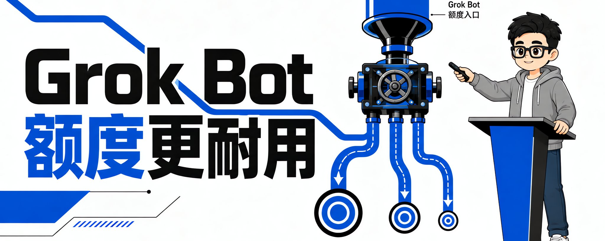
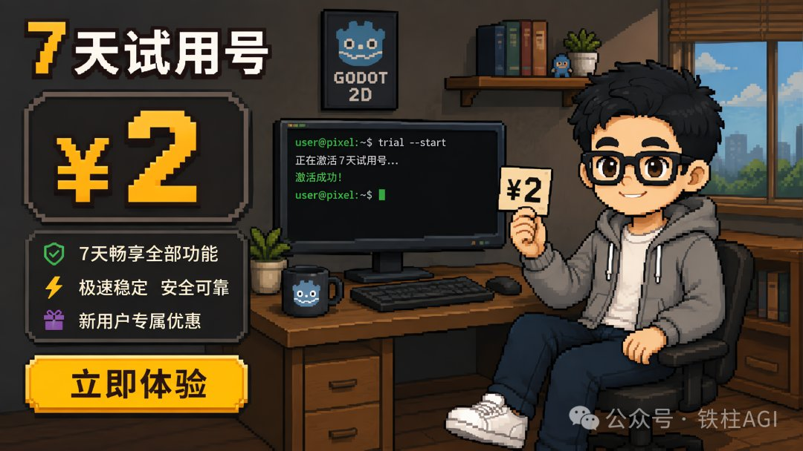
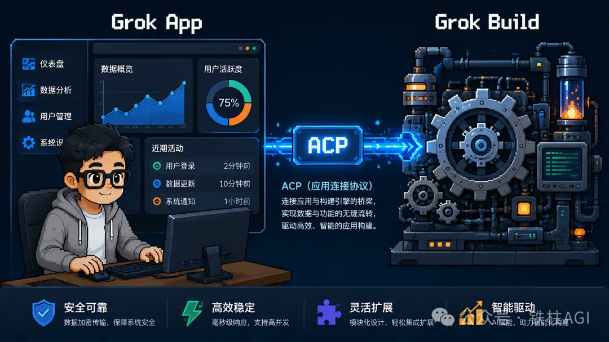
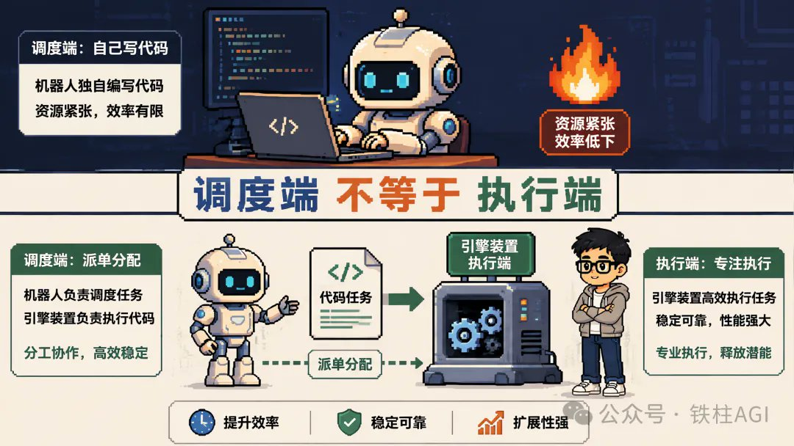
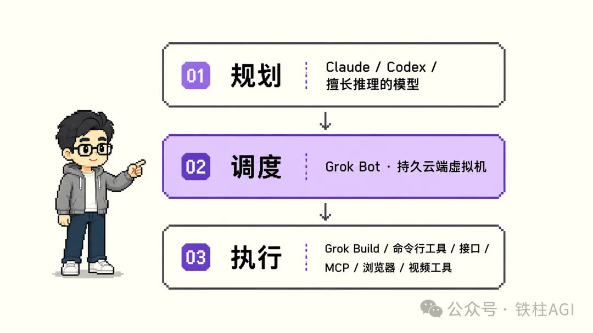
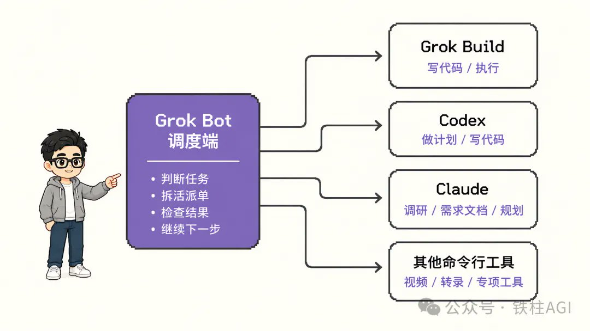
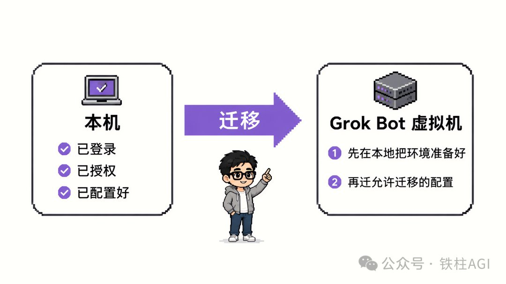

# 杭州线下活动回看：我是怎么让 Grok Bot 额度更耐用的

@cgnot996 · [X 原文](https://x.com/cgnot996/article/2096415217710461078)

昨天下午我做了一场线上分享，人在出差，没能到杭州 Grok Bot 活动现场。讲完趁热把稿子整理成这篇文，给没在现场的你。

整个故事要从两块钱的 SuperGrok 账号说起。

### 从两块钱的 SuperGrok 账号说起

今年 7 月初，市面上有一批 7 天试用号，两块钱一个。额度足，Grok Build 速度还特别快。搞 AI 的人哪受得了这个，我直接狠狠用。

但用着用着，始终有些别扭：当时的 Grok Build 只有终端界面。想用它，得打开终端、进项目目录、运行 grok 命令，在命令行里跟它对话。

我不是不会用终端，是被 Codex 的桌面端惯坏了。项目、会话、任务都摊在一个图形界面里管理，突然退回一堆黑窗口，浑身难受。

当时的想法特别简单：Grok Build 这么好用，为什么不能给它套个桌面端？

于是有了第一个项目，Grok App。

— ¥2 起点：从试用号到桌面端

我没有重写 Agent

先解决一个容易混的问题：官方 Grok App 和我这个 Grok App，不是一回事。

官方的 Grok 只有网页和手机上的客户端，而我做的这个，是填补PC 上没有桌面客户端的空白。

Grok Build 原生支持 ACP（Agent Client Protocol，代理客户端协议）。客户端通过 ACP 创建会话、发消息、收流式回复、拿工具调用状态。所以我只做界面，Agent 能力全部留在 Grok Build 里。

— Grok App 架构：界面→ACP→引擎

技术栈最开始选了 Tauri，打包小、启动快。做到后面发现，Tauri 做深度内嵌浏览器自动化比较费劲，现在在找外挂浏览器的方案（比如 ego lite 这类）。Windows 支持还在折腾。

说到这有个挺真实的行业结论：搞 AI，还是得有一台**Mac**。

第一版 Grok App 简陋得不行：一个项目、一个会话、能聊就行。

但这种工具只要你自己天天用，需求就会自己长出来。多项目、多会话并行、接入飞书和微信、接入 ChatCut 剪辑插件、接入 X API、兼容 Codex 插件市场…… 慢慢从“我不想开终端”，变成了“我想把 Grok Build 变成一台长期工作的桌面 Agent 工作台”。

有意思的是，这些东西基本都是 Grok Build 自己写出来的。

第一版用 Grok 4.5，速度快、多模态不错、写代码也强。开源后 star 冲到 400 多，现在接近1200。功能新增、修 bug、代码 review、处理 issue 和 PR，全交给 Grok Build。

用着用着，我直接买了一年 SuperGrok Heavy。

本来以为只是给 Grok Build 充值。结果没想到，真正改变我后面思路的，是另一个产品 ——**Grok Bot**。

当时 Grok 官方发布了 Grok Bot 这个产品，首批支持使用的就是 Heavy 订阅，以及 Cursor 的 Ultra 订阅，让我成了第一批用上它的人。

### 让 Grok Bot 维护 Grok Bot

Grok Bot 跟普通聊天 Agent 最大的区别：它真的有一台自己的电脑。

每个 Bot 运行在一个持久的Bot 虚拟机上，里面有浏览器、文件系统、终端。它不只是回答你的问题，理论上，你可以把一项长期工作真正交给它。最近 Grok Bot 开放了公测，订阅范围也不只 Heavy 了，有兴趣的都能上手。

当时社区里还没多少人讨论它，我就想：大家迟早都会用，不如先把“Grok Bot 能干什么”收集起来。于是有了第二个项目，Awesome Grok Bot—— 官方活动、官方资源、社区案例，全收进来，方便大家在一个仓库里查全 Grok Bot 的资源和玩法。

但更有意思的是它后来怎么运营的。

第一版是我让 Grok App 帮我整理的。后来突然反应过来：我手上不是有 Grok Bot 吗？为什么要自己维护一个关于 Grok Bot 的仓库？

于是建了个“仓库管理员 Bot”，把仓库整个交给它：每天定时去 X 和 GitHub 找新玩法，整理进去，过期的剔除。运行了半个多月，我基本没管过，star 从 0 涨到230 左右。

— Bot 维护 Bot：仓库管理员自动运营

到这里我开始觉得：这东西是真的能干活。

然后人一旦觉得 Agent 能干活，就特别容易犯一个错误 ——给它加活。

### 一周额度，没了

我决定测一下它的能力边界，让它搭一个漫剧工作台的客户端项目。

它很认真地干。然后，一周的额度，没了。

而且我是 Heavy，额度已经算很充足。写代码、转录、拉片、分析、长任务，全都堆在它身上 —— 再多额度都不够烧。

— 一周额度归零：Heavy 也扛不住

我开始想办法，找能够让额度减少、续航更长的办法。

我们下意识觉得，任务给了 Grok Bot，它就该自己完成。但它是很好的调度端啊，它真正该做的是：理解目标、拆解任务、判断活派给谁、检查结果、继续下一步。

中间最烧 token、最烧额度的执行过程，完全可以交给别的工具。

### 让 Grok Bot 调用 Grok Build

比如写代码。我手上本来就有 Grok Build，它支持headless（无头）模式，可以直接用命令行运行。

能不能让 Grok Bot 调用 Grok Build？写代码消耗 Grok Build 的资源，Grok Bot 只负责调度。

第一次，让 Grok Bot 直接调用我本地装好的 Grok Build—— 失败，经常卡住没返回。

换了个思路：Grok Bot 自己就有一台持久虚拟机，那就把 Grok Build 装进它的虚拟机里，授权处理好，通过CLI 调用。

这次成功了。

原来的链路：Grok Bot → 自己思考 → 自己执行 → 自己烧额度。

现在的链路：Grok Bot → 判断任务 → 调用 Grok Build → 执行 → 结果返回。

改完之后，我自己的使用强度下，一周基本能撑住。

但后来我发现：省额度，只是这套方法最浅的一层价值。

— 调度端不等于执行端

### 能力路由 + 额度路由

做到这里，事情已经不只是额度问题了，它在做能力路由。

现在大家手上通常不止一个 AI 订阅：Claude、Codex、Grok、各种 CLI、一堆专项工具。不同模型擅长的事本来就不一样 —— 有的适合讨论方案、写 PRD，有的写代码快，有的适合搜索，有的适合处理视频。

为什么要强迫一个模型从头干到尾？

再抽象一层，这套东西可以拆成三层：

1. 规划层：把需求、方案、约束想清楚，谁擅长谁来做。
2. 调度层：我让 Grok Bot 当调度，它有持久的 Bot 虚拟机、有浏览器、有终端，适合长期运行。
3. 执行层：Grok Build、各种 CLI、API、MCP、浏览器工具、视频工具，真正干重活的。

这么一分，你不只把能力分散了，额度也一起分散了。原来所有任务压在 Grok Bot 上，现在 Grok Bot、Grok Build、Claude、Codex、各家 API 各自分担一部分。

这就是**额度负载均衡** —— 能力路由 + 额度路由，两件事同时做。

— 三层架构：规划→调度→执行

— 任务路由：中心节点分流四出口

### 一个“邪修”技巧

再分享一个我自己折腾出来的“邪修”技巧。

Grok Bot 自己操作虚拟机非常流畅，但我们直接去操作它的虚拟机，就会明显卡顿。更麻烦的是登录授权：有些工具在 Bot 虚拟机里授权特别费劲，尤其是浏览器登录、多因素验证、第三方账号。本地两分钟搞定的事，在 Bot 虚拟机里可能折腾半天。

我的思路：先在自己机器上把工具按正常方式登录、授权、配置好，再把工具允许迁移的环境和配置，迁到 Bot 虚拟机。

💡 能不能迁移，得看工具自己的授权机制和服务条款。这不是绕过认证，是在本地完成正常授权后，迁工具允许迁的配置。

我折腾需要 Google 账号授权的客户端时就被卡过，这个思路帮了大忙。

— 邪修技巧：本机授权→迁移→虚拟机

### X 积分路由

同样的思路，我也用在了 X 开发者积分上。

Grok Bot 连上 X 之后，核心原则一句话：能不花积分，就不花。

搜索、公开信息研究，Grok 自带工具能完成的，就不必调用开发者 API。真正必须依赖账号级 API 的 —— 比如发帖、读自己账号特定数据 —— 才用X 开发者积分。

所有 X 任务 → API → 扣积分，变成先判断“这个任务到底需不需要 API”，需要再用。积分续航长了很多。

— X 积分路由：公开研究 vs 开发者积分

∞

THE END

### 不要让一个 Agent 干完所有活

从 Grok Bot 的额度，到 Grok Build，再到 X 开发者积分，我最后其实一直在做同一件事：

「不要让一个 Agent 干完所有的活，让每个模型干自己最擅长的事。」

擅长规划的负责规划，擅长 coding 的负责 coding，擅长搜索的负责搜索。能用 CLI 完成的重活，就不要全烧调度 Agent自己的额度。

今天这场分享就讲了这三样：Grok App、Awesome Grok Bot，和这套额度负载均衡。

想要完整 PPT 的：

1. 公众号（铁柱 AGI）后台回复关键词「负载均衡」，直接领。
2. 在 X 上私聊我（[@cgnot996](https://x.com/@cgnot996)），我发你。
3. 想一起交流 Grok Bot 玩法的，加我好友，我拉你进群。

你手里现在有几份 AI 订阅？是各干各的，还是已经让它们分工了？评论区聊聊。

END

我是铁柱AGI，热衷于分享 AI 观察与 Grok Bot 实战干货。

如果你觉得今天这篇有收获，欢迎**点赞、收藏、评论**三连，我们下篇见。
